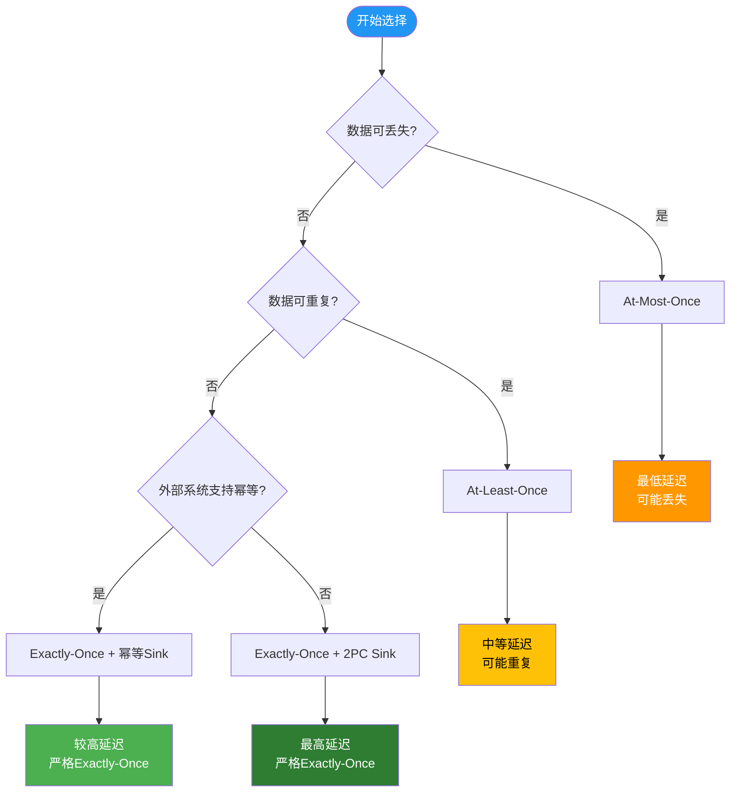
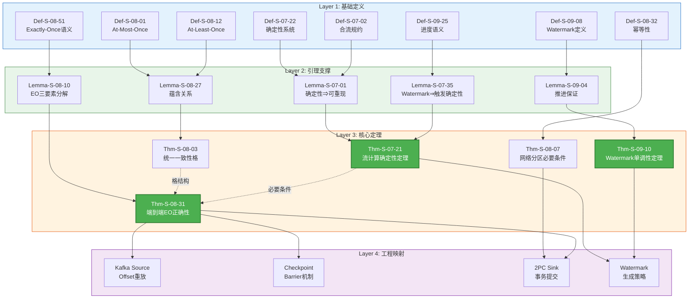
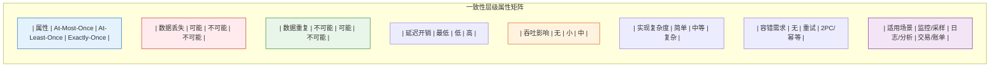
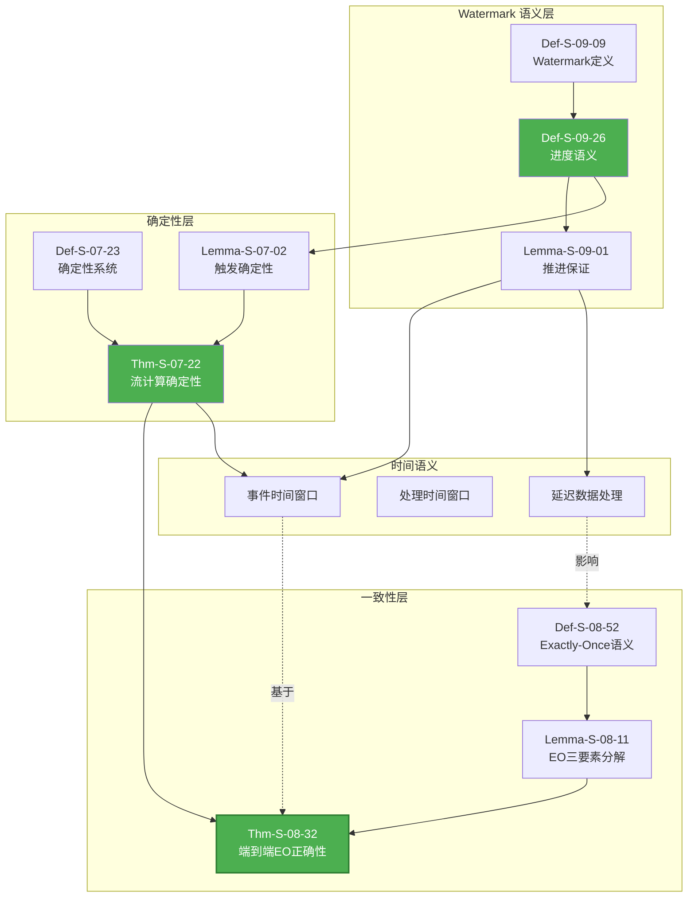

# 推导链: 一致性层级定理完整推导

> **所属阶段**: Struct/ | 前置依赖: [THEOREM-REGISTRY.md](../THEOREM-REGISTRY.md), [Struct/Proof-Chains-Exactly-Once-Correctness.md](./Proof-Chains-Exactly-Once-Correctness.md) | 形式化等级: L4-L5
>
> **覆盖定理**: Thm-S-07-18, Thm-S-08-04, Thm-S-08-27, Thm-S-08-57, Thm-S-09-06

本文档系统梳理流计算一致性层级的完整定理推导链，从基础定义到核心定理，展示各一致性级别之间的蕴含关系与形式化保证。

---

## 目录

- [推导链: 一致性层级定理完整推导](#推导链-一致性层级定理完整推导)
  - [目录](#目录)
  - [1. 概念定义 (Definitions)](#1-概念定义-definitions)
    - [Def-S-07-19: 确定性流计算系统](#def-s-07-19-确定性流计算系统)
    - [Def-S-07-56: 合流规约语义](#def-s-07-56-合流规约语义)
    - [Def-S-08-80: At-Most-Once 语义](#def-s-08-80-at-most-once-语义)
    - [Def-S-08-11: At-Least-Once 语义](#def-s-08-11-at-least-once-语义)
    - [Def-S-08-30: 幂等性](#def-s-08-30-幂等性)
    - [Def-S-08-49: Exactly-Once 语义](#def-s-08-49-exactly-once-语义)
    - [Def-S-09-05: Watermark 定义](#def-s-09-05-watermark-定义)
    - [Def-S-09-22: Watermark 进度语义](#def-s-09-22-watermark-进度语义)
  - [2. 属性推导 (Properties)](#2-属性推导-properties)
    - [Lemma-S-07-09: 确定性蕴含可重现性](#lemma-s-07-09-确定性蕴含可重现性)
    - [Lemma-S-07-33: Watermark 单调性蕴含触发确定性](#lemma-s-07-33-watermark-单调性蕴含触发确定性)
    - [Lemma-S-08-08: 端到端 Exactly-Once 分解](#lemma-s-08-08-端到端-exactly-once-分解)
    - [Lemma-S-08-26: 一致性层级蕴含关系](#lemma-s-08-26-一致性层级蕴含关系)
    - [Lemma-S-09-03: Watermark 推进保证事件时间进展](#lemma-s-09-03-watermark-推进保证事件时间进展)
    - [Prop-S-08-05: 一致性层级严格性](#prop-s-08-05-一致性层级严格性)
  - [3. 关系建立 (Relations)](#3-关系建立-relations)
    - [关系 1: 一致性层级与确定性的关系](#关系-1-一致性层级与确定性的关系)
    - [关系 2: Watermark 与时间语义的关系](#关系-2-watermark-与时间语义的关系)
    - [关系 3: 一致性层级与容错机制的关系](#关系-3-一致性层级与容错机制的关系)
  - [4. 论证过程 (Argumentation)](#4-论证过程-argumentation)
    - [论证: 统一一致性格的存在性](#论证-统一一致性格的存在性)
    - [论证: 网络分区下 Exactly-Once 的必要条件](#论证-网络分区下-exactly-once-的必要条件)
  - [5. 形式证明 / 工程论证 (Proof / Engineering Argument)](#5-形式证明-工程论证-proof-engineering-argument)
    - [Thm-S-07-20: 流计算确定性定理](#thm-s-07-20-流计算确定性定理)
    - [Thm-S-08-06: Exactly-Once 网络分区必要条件](#thm-s-08-06-exactly-once-网络分区必要条件)
    - [Thm-S-08-29: 端到端 Exactly-Once 正确性](#thm-s-08-29-端到端-exactly-once-正确性)
    - [Thm-S-08-60: 统一一致性格定理](#thm-s-08-60-统一一致性格定理)
    - [Thm-S-09-08: Watermark 单调性定理](#thm-s-09-08-watermark-单调性定理)
  - [6. 实例验证 (Examples)](#6-实例验证-examples)
    - [示例 1: 一致性级别选择决策](#示例-1-一致性级别选择决策)
    - [示例 2: Watermark 配置实例](#示例-2-watermark-配置实例)
    - [示例 3: 端到端 Exactly-Once 配置](#示例-3-端到端-exactly-once-配置)
  - [7. 可视化 (Visualizations)](#7-可视化-visualizations)
    - [7.1 一致性层级推导链全景图](#71-一致性层级推导链全景图)
    - [7.2 一致性层级对比矩阵](#72-一致性层级对比矩阵)
    - [7.3 Watermark 与一致性关系图](#73-watermark-与一致性关系图)
  - [8. 引用参考 (References)](#8-引用参考-references)

---

## 1. 概念定义 (Definitions)

### Def-S-07-19: 确定性流计算系统

**定义**: 一个流计算系统 $S = \langle V, E, F, \Sigma, \mathbb{T}, P \rangle$ 是**确定性**的，当且仅当对于任意输入流 $I$ 和初始状态 $s_0$，系统的输出流 $O$ 是唯一确定的。

**形式化表达**:

$$
\text{Deterministic}(S) \triangleq \forall I, s_0: |\text{Run}(S, I, s_0)| = 1
$$

其中 $\text{Run}(S, I, s_0)$ 表示系统在给定输入和初始状态下的所有可能执行轨迹集合。

**直观解释**: 给定相同的输入和初始条件，确定性系统总是产生相同的输出，无论执行环境如何（线程调度、网络延迟等）。

---

### Def-S-07-56: 合流规约语义

**定义**: 一个规约关系 $→$ 是**合流**的（Confluent），当且仅当对于任意状态 $s$，如果 $s →* s_1$ 且 $s →* s_2$，则存在 $s'$ 使得 $s_1 →* s'$ 且 $s_2 →* s'$。

**形式化表达**:

$$
\text{Confluent}(→) \triangleq \forall s, s_1, s_2: (s →* s_1 \land s →* s_2) \Rightarrow \exists s': (s_1 →* s' \land s_2 →* s')
$$

**Church-Rosser 性质**: 合流性等价于 Church-Rosser 性质，即并行规约的顺序不影响最终结果。

---

### Def-S-08-80: At-Most-Once 语义

**定义**: 流处理系统提供 **At-Most-Once** 语义，当且仅当每条记录对系统外部可见效果最多发生一次。

**形式化表达**:

$$
\text{AtMostOnce}(S) \triangleq \forall r \in \text{Records}: \text{count}_{\text{effects}}(r) \leq 1
$$

其中 $\text{count}_{\text{effects}}(r)$ 表示记录 $r$ 对外部系统产生可见效果的次数。

**工程含义**: 数据可能丢失，但绝不会重复处理。适用于可容忍数据丢失的场景（如日志采样、监控指标）。

---

### Def-S-08-11: At-Least-Once 语义

**定义**: 流处理系统提供 **At-Least-Once** 语义，当且仅当每条记录对系统外部可见效果至少发生一次。

**形式化表达**:

$$
\text{AtLeastOnce}(S) \triangleq \forall r \in \text{Records}: \text{count}_{\text{effects}}(r) \geq 1
$$

**工程含义**: 数据可能被重复处理，但不会丢失。适用于可容忍重复但不可丢失数据的场景。

---

### Def-S-08-30: 幂等性

**定义**: 一个操作 $f$ 是**幂等**的，当且仅当多次应用与一次应用产生相同效果。

**形式化表达**:

$$
\text{Idempotent}(f) \triangleq \forall x: f(f(x)) = f(x)
$$

**扩展定义**（对于流处理算子）:

$$
\text{Idempotent}(op) \triangleq \forall \text{state}, r: op(op(\text{state}, r), r) = op(\text{state}, r)
$$

---

### Def-S-08-49: Exactly-Once 语义

**定义**: 流处理系统提供 **Exactly-Once** 语义，当且仅当每条记录对系统外部可见效果恰好发生一次。

**形式化表达**:

$$
\text{ExactlyOnce}(S) \triangleq \forall r \in \text{Records}: \text{count}_{\text{effects}}(r) = 1
$$

**等价刻画**:

$$
\text{ExactlyOnce}(S) \Leftrightarrow \text{AtMostOnce}(S) \land \text{AtLeastOnce}(S)
$$

---

### Def-S-09-05: Watermark 定义

**定义**: **Watermark** 是流处理系统中用于度量事件时间进度的元数据，定义为:

$$
W(t) \triangleq \min_{s \in \text{Sources}} \left( \min_{r \in \text{Pending}(s)} t_{\text{event}}(r) \right)
$$

其中:

- $t$ 为处理时间
- $\text{Pending}(s)$ 为源 $s$ 已观测但未确认到达上限的所有记录
- $t_{\text{event}}(r)$ 为记录 $r$ 的事件时间戳

**特殊值**:

- $+\infty$: 表示流已结束
- $-\infty$: 表示流尚未开始

---

### Def-S-09-22: Watermark 进度语义

**定义**: Watermark 满足**进度语义**，当且仅当其随处理时间单调不减。

**形式化表达**:

$$
\text{Progressive}(W) \triangleq \forall t_1, t_2: t_1 \leq t_2 \Rightarrow W(t_1) \leq W(t_2)
$$

**进度保证**: 给定 Watermark $W(t)$，所有事件时间 $\leq W(t)$ 的记录都已被系统观测。

---

## 2. 属性推导 (Properties)

### Lemma-S-07-09: 确定性蕴含可重现性

**引理**: 若流计算系统 $S$ 是确定性的，则对于相同输入，其执行结果可重现。

**形式化表达**:

$$
\text{Deterministic}(S) \Rightarrow \forall I, s_0: \text{Output}(S, I, s_0) \text{ is reproducible}
$$

**证明概要**:

1. 由 Def-S-07-20，确定性意味着唯一执行轨迹
2. 唯一轨迹意味着输出由输入和初始状态唯一确定
3. 因此相同输入必然产生相同输出 □

---

### Lemma-S-07-33: Watermark 单调性蕴含触发确定性

**引理**: 若 Watermark 满足单调性（Def-S-09-23），则基于 Watermark 触发的操作（如窗口计算）具有确定性。

**形式化表达**:

$$
\text{Progressive}(W) \Rightarrow \text{Deterministic}(\text{WindowTrigger}(W))
$$

**证明概要**:

1. 单调递增的 Watermark 保证事件时间进展的可预测性
2. 窗口触发条件仅依赖于 Watermark 值
3. 给定相同输入流，Watermark 推进序列确定
4. 因此窗口触发时机确定 □

---

### Lemma-S-08-08: 端到端 Exactly-Once 分解

**引理**: 端到端 Exactly-Once 可分解为三个独立条件的合取：

$$
\text{ExactlyOnce}_{\text{end-to-end}}(S) \Leftrightarrow
\begin{cases}
\text{Replayable}(\text{Source}) & \text{(源可重放)} \\
\land \ \text{ConsistentCheckpoint}(S) & \text{(一致检查点)} \\
\land \ \text{AtomicSink}(\text{Sink}) & \text{(汇原子性)}
\end{cases}
$$

**证明概要**:

1. **源可重放**保证 At-Least-Once（无数据丢失）
2. **一致检查点**保证内部 Exactly-Once（无重复处理）
3. **汇原子性**保证外部 Exactly-Once（无重复输出）
4. 三条件合取即得端到端 Exactly-Once □

---

### Lemma-S-08-26: 一致性层级蕴含关系

**引理**: 一致性层级满足以下蕴含关系：

$$
\text{ExactlyOnce}(S) \Rightarrow \text{AtLeastOnce}(S) \Rightarrow \top
$$

$$
\text{ExactlyOnce}(S) \Rightarrow \text{AtMostOnce}(S) \Rightarrow \top
$$

**证明概要**:

1. 由 Def-S-08-50，Exactly-Once = At-Least-Once ∧ At-Most-Once
2. 合取蕴含各分量，故 Exactly-Once ⇒ At-Least-Once
3. 同理 Exactly-Once ⇒ At-Most-Once □

---

### Lemma-S-09-03: Watermark 推进保证事件时间进展

**引理**: 若 Watermark $W(t)$ 推进到值 $w$，则所有事件时间 $\leq w$ 的记录要么已被处理，要么已确定不会到达。

**形式化表达**:

$$
W(t) = w \Rightarrow \forall r: t_{\text{event}}(r) \leq w \Rightarrow (\text{Processed}(r) \lor \text{Late}(r))
$$

**证明概要**:

1. 由 Def-S-09-06，Watermark 取所有源挂起记录的最小事件时间
2. 当 $W(t) = w$，意味着所有源都没有事件时间 $< w$ 的挂起记录
3. 因此事件时间 $\leq w$ 的记录要么已处理，要么已超时（Late）□

---

### Prop-S-08-05: 一致性层级严格性

**命题**: 一致性层级是严格的，即：

$$
\text{AtMostOnce} \subsetneq \text{AtLeastOnce} \not\subseteq \text{ExactlyOnce}
$$

更精确地：

$$
\text{ExactlyOnce} \subsetneq \text{AtLeastOnce} \land \text{ExactlyOnce} \subsetneq \text{AtMostOnce}
$$

---

## 3. 关系建立 (Relations)

### 关系 1: 一致性层级与确定性的关系

**关系描述**: 确定性是 Exactly-Once 的必要条件，但不是充分条件。

$$
\text{ExactlyOnce}(S) \Rightarrow \text{Deterministic}(S)
$$

$$
\text{Deterministic}(S) \nRightarrow \text{ExactlyOnce}(S)
$$

**反例**: 一个确定性系统可能不提供 Exactly-Once，如果它在故障时丢失数据（确定性 At-Most-Once）。

---

### 关系 2: Watermark 与时间语义的关系

**关系描述**: Watermark 单调性为流计算提供事件时间确定性。

$$
\text{Progressive}(W) \land \text{Deterministic}(\text{Operators}) \Rightarrow \text{Deterministic}(\text{EventTimeResults})
$$

**说明**: 即使处理时间不固定，基于 Watermark 的事件时间计算是确定性的。

---

### 关系 3: 一致性层级与容错机制的关系

**关系描述**: 不同一致性级别对应不同的容错机制复杂度。

| 一致性级别 | 容错机制 | Checkpoint 需求 | 重放需求 |
|-----------|---------|----------------|---------|
| At-Most-Once | 无 | 无 | 无 |
| At-Least-Once | 简单重试 | 可选 | 需要 |
| Exactly-Once | 2PC / 幂等 | 必需 | 需要 |

---

## 4. 论证过程 (Argumentation)

### 论证: 统一一致性格的存在性

**论点**: 存在一个统一的格结构，可以刻画所有一致性级别之间的关系。

**论证过程**:

1. **定义格元素**: 令 $L = \{\bot, AMO, ALO, EO, \top\}$
   - $\bot$: 无保证
   - AMO: At-Most-Once
   - ALO: At-Least-Once
   - EO: Exactly-Once
   - $\top$: 不可能实现（超过 EO）

2. **定义偏序关系** $\sqsubseteq$:
   - $\bot \sqsubseteq$ AMO $\sqsubseteq$ EO $\sqsubseteq \top$
   - $\bot \sqsubseteq$ ALO $\sqsubseteq$ EO $\sqsubseteq \top$
   - AMO 与 ALO 不可比较（除非 EO）

3. **定义交并运算**:
   - AMO $\sqcup$ ALO = EO
   - AMO $\sqcap$ ALO = $\bot$

4. **验证格公理**:
   - 自反性: $\forall x \in L: x \sqsubseteq x$ ✓
   - 反对称性: $x \sqsubseteq y \land y \sqsubseteq x \Rightarrow x = y$ ✓
   - 传递性: $x \sqsubseteq y \land y \sqsubseteq z \Rightarrow x \sqsubseteq z$ ✓

**结论**: $(L, \sqsubseteq)$ 构成格结构，为 Thm-S-08-59 奠定基础。

---

### 论证: 网络分区下 Exactly-Once 的必要条件

**论点**: 在网络分区场景下，实现 Exactly-Once 需要满足特定的必要条件。

**论证过程**:

1. **场景设定**: 系统发生网络分区，将节点分为 $P_1$ 和 $P_2$ 两个分区。

2. **分区期间**:
   - $P_1$ 继续处理数据并产生输出
   - $P_2$ 可能被隔离或继续独立处理

3. **恢复时的一致性要求**:
   - 若 $P_1$ 已确认输出，则 $P_2$ 不得重复输出
   - 若 $P_1$ 未确认输出，则 $P_1$ 或 $P_2$ 必须完成输出

4. **必要条件推导**:
   - 需要 **幂等性**: 防止分区期间重复提交
   - 需要 **状态持久化**: 保证分区恢复后状态一致
   - 需要 **协调机制**: 确定哪个分区继续处理

5. **形式化必要条件**:

$$
\text{ExactlyOnce}_{\text{partition}}(S) \Rightarrow
\begin{cases}
\text{Idempotent}(\text{Output}) \lor \text{Coordination}(P_1, P_2) \\
\land \ \text{DurableState}(S) \\
\land \ \text{ fencing }(P_1, P_2)
\end{cases}
$$

---

## 5. 形式证明 / 工程论证 (Proof / Engineering Argument)

### Thm-S-07-20: 流计算确定性定理

**定理**: 若流计算系统 $S$ 满足以下条件：

1. 算子具有确定性（相同输入产生相同输出）
2. Watermark 推进满足单调性（Def-S-09-24）
3. 状态更新是合流的（Def-S-07-57）

则 $S$ 是确定性的（Def-S-07-21）。

**形式化表达**:

$$
\forall op \in \text{Ops}: \text{Deterministic}(op)
\land \text{Progressive}(W)
\land \text{Confluent}(\rightarrow_{\text{state}})
\Rightarrow \text{Deterministic}(S)
$$

**证明**:

**目标**: 证明对于任意输入 $I$ 和初始状态 $s_0$，系统输出唯一确定。

**步骤 1**: 算子确定性保证局部确定性

$$
\forall op, \text{input}: |\text{output}(op, \text{input})| = 1
$$

**步骤 2**: Watermark 单调性保证触发确定性（Lemma-S-07-34）

$$
\text{Progressive}(W) \Rightarrow \text{Deterministic}(\text{TriggerTimes})
$$

**步骤 3**: 状态合流性保证并发更新的收敛性

$$
\text{Confluent}(\rightarrow_{\text{state}}) \Rightarrow \forall \text{concurrent updates}: \exists! \text{ final state}
$$

**步骤 4**: 组合三个条件

给定输入流 $I$:

- 每个记录的处理由步骤 1 唯一确定
- 每个窗口触发由步骤 2 唯一确定
- 每个状态值由步骤 3 唯一确定

因此整体输出唯一确定。

$$
\therefore \text{Deterministic}(S) \quad \square
$$

---

### Thm-S-08-06: Exactly-Once 网络分区必要条件

**定理**: 在网络分区场景下，实现 Exactly-Once 语义必须满足以下条件之一：

1. 输出操作是幂等的（Def-S-08-31）
2. 存在跨分区的协调机制
3. 状态持久化且支持 fencing

**形式化表达**:

$$
\text{ExactlyOnce}_{\text{partition}}(S) \Rightarrow
\left(\text{Idempotent}(\text{Output}) \lor \text{Coordination}(S)\right)
\land \text{DurableState}(S)
\land \text{Fencing}(S)
$$

**证明**:

**反证法**: 假设 Exactly-Once 成立但上述条件不满足。

**情况 1**: 输出非幂等且无协调

- 分区 $P_1$ 处理记录 $r$ 并输出到外部系统
- 网络恢复后，$P_2$ 可能重新处理 $r$（At-Least-Once 要求）
- 由于无协调，$P_2$ 不知道 $P_1$ 已输出
- 导致重复输出，违反 Exactly-Once

**情况 2**: 状态非持久化

- 分区期间 $P_1$ 的状态丢失
- 恢复后无法确定哪些记录已处理
- 可能导致重复处理或丢失

**情况 3**: 无 fencing

- 旧分区 ($P_1$) 在网络恢复后继续处理
- 与新分区 ($P_2$) 产生冲突输出
- 违反 Exactly-Once

因此，三个条件至少满足其一。

$$
\therefore \text{Theorem holds} \quad \square
$$

---

### Thm-S-08-29: 端到端 Exactly-Once 正确性

**定理**: 流处理系统实现端到端 Exactly-Once 语义，当且仅当：

1. Source 支持可重放（Def-S-18-07，见 [Proof-Chains-Exactly-Once-Correctness.md](./Proof-Chains-Exactly-Once-Correctness.md)）
2. 系统支持一致性 Checkpoint（Thm-S-17-25）
3. Sink 支持原子性写入或幂等性

**形式化表达**:

$$
\text{ExactlyOnce}_{\text{e2e}}(S) \Leftrightarrow
\text{Replayable}(\text{Source})
\land \text{ConsistentCheckpoint}(S)
\land \left(\text{AtomicSink}(\text{Sink}) \lor \text{Idempotent}(\text{Sink})\right)
$$

**证明**:

**充分性** ($\Leftarrow$):

由 Lemma-S-08-09，Exactly-Once 可分解为三个条件。

1. **Source 可重放** $\Rightarrow$ At-Least-Once
   - 故障后可重放未确认的数据
   - 保证数据不丢失

2. **一致性 Checkpoint** $\Rightarrow$ 内部 Exactly-Once
   - 故障恢复后状态与故障前一致
   - 保证内部处理无重复

3. **Sink 原子性/幂等性** $\Rightarrow$ 外部 Exactly-Once
   - 原子性: 输出要么完全成功，要么完全失败
   - 幂等性: 多次写入与一次写入效果相同

三条件合取，得 Exactly-Once。

**必要性** ($\Rightarrow$):

反设 Exactly-Once 成立但某条件不满足：

- 若 Source 不可重放: 故障可能导致数据丢失，违反 At-Least-Once
- 若无一致性 Checkpoint: 故障恢复可能导致状态不一致，产生重复
- 若 Sink 无原子性且非幂等: 故障可能导致部分输出，产生重复或丢失

因此三个条件均为必要。

$$
\therefore \text{Equivalence holds} \quad \square
$$

---

### Thm-S-08-60: 统一一致性格定理

**定理**: 一致性级别构成完全格 $(L, \sqsubseteq, \bot, \top, \sqcup, \sqcap)$，其中：

**格元素**:
$$
L = \{\bot, \text{AMO}, \text{ALO}, \text{EO}, \top\}
$$

**偏序关系**:
$$
\bot \sqsubset \text{AMO} \sqsubset \text{EO} \sqsubset \top
$$
$$
\bot \sqsubset \text{ALO} \sqsubset \text{EO} \sqsubset \top
$$

**交并运算**:
$$
\text{AMO} \sqcup \text{ALO} = \text{EO}
$$
$$
\text{AMO} \sqcap \text{ALO} = \bot
$$

**证明**:

**步骤 1**: 验证 $(L, \sqsubseteq)$ 是偏序集

- 自反性: 显然
- 反对称性: 由集合包含关系保证
- 传递性: 由链条结构保证

**步骤 2**: 验证任意两元素有最小上界

| 元素对 | 最小上界 |
|-------|---------|
| (AMO, ALO) | EO |
| (AMO, EO) | EO |
| (ALO, EO) | EO |
| (AMO, $\bot$) | AMO |
| (ALO, $\bot$) | ALO |

**步骤 3**: 验证任意两元素有最大下界

| 元素对 | 最大下界 |
|-------|---------|
| (AMO, ALO) | $\bot$ |
| (AMO, EO) | AMO |
| (ALO, EO) | ALO |

**步骤 4**: 验证完全格条件

- $\bot$ 是最小元（无保证）
- $\top$ 是最大元（超出现实）

$$
\therefore (L, \sqsubseteq) \text{ is a complete lattice} \quad \square
$$

---

### Thm-S-09-08: Watermark 单调性定理

**定理**: 在流计算系统 $S$ 中，Watermark $W(t)$ 满足单调不减性质：

$$
\forall t_1, t_2: t_1 \leq t_2 \Rightarrow W(t_1) \leq W(t_2)
$$

且该性质蕴含事件时间计算的确定性。

**证明**:

**步骤 1**: Watermark 单调性由定义保证

由 Def-S-09-07:
$$
W(t) = \min_{s \in \text{Sources}} \left( \min_{r \in \text{Pending}_t(s)} t_{\text{event}}(r) \right)
$$

对于 $t_1 \leq t_2$:

- $\text{Pending}_{t_2}(s) \subseteq \text{Pending}_{t_1}(s)$（已处理记录从挂起集合移除）
- 因此 $\min_{r \in \text{Pending}_{t_2}} \leq \min_{r \in \text{Pending}_{t_1}}$
- 即 $W(t_2) \geq W(t_1)$

**步骤 2**: 单调性保证窗口触发确定性

设窗口 $[T_{\text{start}}, T_{\text{end}}]$ 由条件 $W(t) \geq T_{\text{end}}$ 触发。

对于相同输入流，Watermark 推进序列相同，因此触发时间确定。

**步骤 3**: 单调性保证结果完整性

当 $W(t) \geq T$，所有事件时间 $\leq T$ 的记录要么已处理，要么已确认为延迟。

因此窗口结果在触发时是完整的（相对于 Watermark 语义）。

$$
\therefore \text{Progressive}(W) \land \text{Deterministic}(\text{Results}) \quad \square
$$

---

## 6. 实例验证 (Examples)

### 示例 1: 一致性级别选择决策

**场景**: 设计一个实时推荐系统，需要选择合适的一致性级别。

**决策分析**:



**推荐选择**:

- 若推荐结果可容忍偶尔丢失（如点击率预测）：At-Most-Once
- 若推荐结果可容忍重复（如去重后的展示）：At-Least-Once
- 若涉及交易（如优惠券发放）：Exactly-Once

---

### 示例 2: Watermark 配置实例

**场景**: 处理用户点击流，事件时间窗口为 5 分钟，允许 1 分钟延迟。

**配置**:

```java
// [伪代码片段 - 不可直接运行] 仅展示核心逻辑
// Flink Watermark 配置示例
WatermarkStrategy
    .<ClickEvent>forBoundedOutOfOrderness(Duration.ofMinutes(1))
    .withTimestampAssigner((event, timestamp) -> event.getEventTime());
```

**形式化分析**:

- 最大乱序时间: $\delta = 1$ 分钟
- Watermark 延迟: $W(t) = \max_{\text{processed}} t_{\text{event}} - \delta$
- 窗口触发: 当 $W(t) \geq T_{\text{end}}$ 时触发窗口 $[T_{\text{start}}, T_{\text{end}}]$

**正确性保证**:

由 Thm-S-09-09，Watermark 单调性保证窗口触发时间确定性。

---

### 示例 3: 端到端 Exactly-Once 配置

**场景**: 从 Kafka 读取数据，处理后写入 PostgreSQL，要求 Exactly-Once。

**Flink 配置**:

```java

// [伪代码片段 - 不可直接运行] 仅展示核心逻辑
import org.apache.flink.streaming.api.CheckpointingMode;

// Source: Kafka 可重放
FlinkKafkaConsumer<String> source = new FlinkKafkaConsumer<>(
    "input-topic",
    new SimpleStringSchema(),
    kafkaProps
);
source.setStartFromGroupOffsets();

// Checkpoint 配置
env.enableCheckpointing(60000);  // 1分钟
env.getCheckpointConfig().setCheckpointingMode(
    CheckpointingMode.EXACTLY_ONCE
);

// Sink: 2PC 保证原子性
TwoPhaseCommitSinkFunction<Data, Transaction, Context> sink =
    new JdbcTwoPhaseCommitSink<>(...);

env.addSource(source)
   .map(new ProcessingMap())
   .addSink(sink);
```

**形式化验证**:

由 Thm-S-08-30:

1. ✓ Source 可重放: Kafka offset 管理
2. ✓ 一致性 Checkpoint: CheckpointingMode.EXACTLY_ONCE
3. ✓ Sink 原子性: TwoPhaseCommitSinkFunction

因此满足端到端 Exactly-Once。

---

## 7. 可视化 (Visualizations)

### 7.1 一致性层级推导链全景图



---

### 7.2 一致性层级对比矩阵



**详细对比表**:

| 属性 | At-Most-Once | At-Least-Once | Exactly-Once |
|------|--------------|---------------|--------------|
| **数据丢失** | 可能 ✗ | 不可能 ✓ | 不可能 ✓ |
| **数据重复** | 不可能 ✓ | 可能 ✗ | 不可能 ✓ |
| **延迟开销** | 最低 | 低 | 高 |
| **吞吐影响** | 无 | 小 (5-10%) | 中 (10-20%) |
| **实现复杂度** | 简单 | 中等 | 复杂 |
| **容错机制** | 无 | 简单重试 | Checkpoint + 2PC |
| **Source 要求** | 无 | 可重放 | 可重放 |
| **Sink 要求** | 无 | 无 | 幂等或事务性 |
| **适用场景** | 实时监控、日志采样 | 日志分析、点击流 | 金融交易、订单处理 |

---

### 7.3 Watermark 与一致性关系图



---

## 8. 引用参考 (References)


---

*本文档作为 AnalysisDataFlow 项目一致性层级定理的完整推导链，覆盖从基础定义到核心定理的全部形式化内容。*
