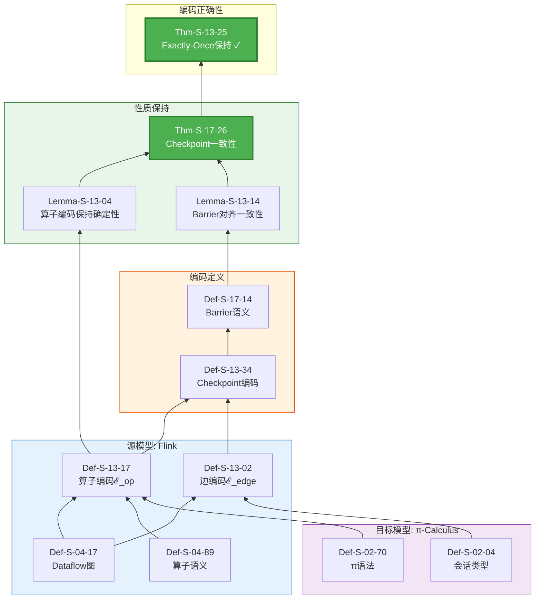
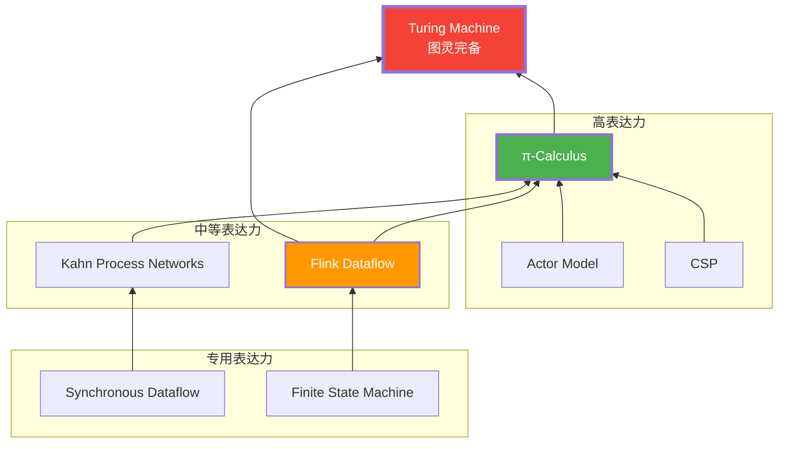
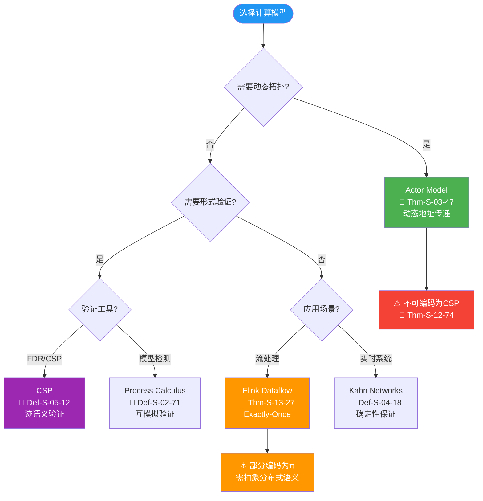
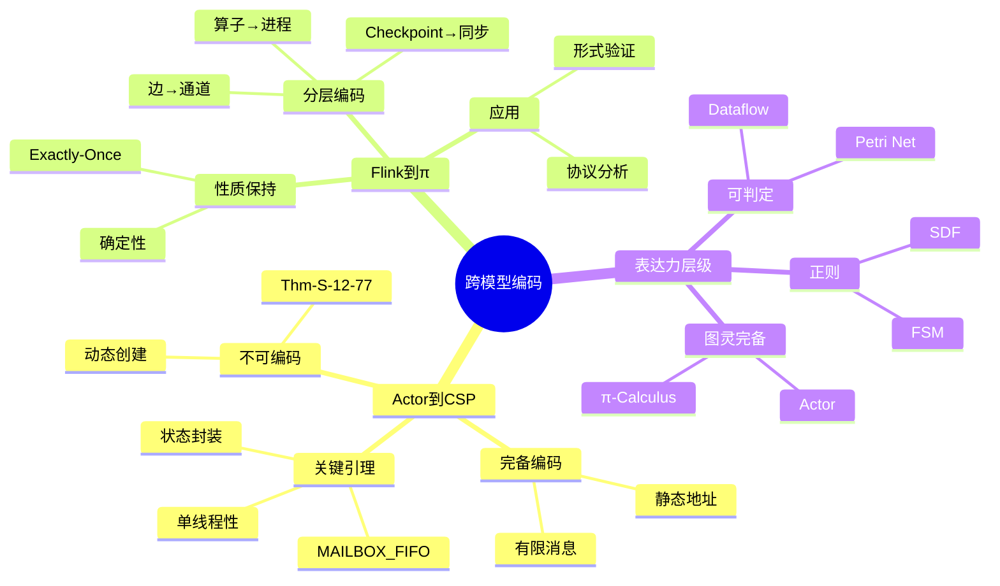

# 推导链: 跨模型编码正确性

> **定理**: Thm-S-12-31 (Actor→CSP) / Thm-S-13-23 (Flink→π)
> **范围**: Struct/ | 形式化等级: L4-L5 | 依赖深度: 5层
> **状态**: ✅ 完整推导链

---

## 目录

- [推导链: 跨模型编码正确性](#推导链-跨模型编码正确性)
  - [目录](#目录)
  - [1. Actor→CSP 编码](#1-actorcsp-编码)
    - [1.1 定理陈述](#11-定理陈述)
    - [1.2 完整推导链](#12-完整推导链)
    - [1.3 模型对比](#13-模型对比)
    - [1.4 编码函数详解](#14-编码函数详解)
    - [1.5 不变式证明](#15-不变式证明)
    - [1.6 编码正确性证明](#16-编码正确性证明)
    - [1.7 动态创建不可编码性](#17-动态创建不可编码性)
  - [2. Flink→π-Calculus 编码](#2-flinkπ-calculus-编码)
    - [2.1 定理陈述](#21-定理陈述)
    - [2.2 完整推导链](#22-完整推导链)
    - [2.3 编码策略](#23-编码策略)
    - [2.4 算子编码详解](#24-算子编码详解)
    - [2.5 Checkpoint 协议编码](#25-checkpoint-协议编码)
    - [2.6 性质保持证明](#26-性质保持证明)
  - [3. 表达力层级](#3-表达力层级)
    - [3.1 并发模型表达力层次](#31-并发模型表达力层次)
    - [3.2 编码完备性矩阵](#32-编码完备性矩阵)
  - [4. 编码限制与不可编码性](#4-编码限制与不可编码性)
    - [4.1 不可编码性定理](#41-不可编码性定理)
    - [4.2 工程选型指导](#42-工程选型指导)
  - [5. 工程应用映射](#5-工程应用映射)
    - [5.1 编码理论的工程价值](#51-编码理论的工程价值)
    - [5.2 模式映射](#52-模式映射)
  - [6. 总结](#6-总结)
    - [6.1 两条核心编码链](#61-两条核心编码链)
    - [6.2 关键定理](#62-关键定理)
    - [6.3 可视化汇总](#63-可视化汇总)

---

## 1. Actor→CSP 编码

### 1.1 定理陈述

`Thm-S-12-32` 受限 Actor 系统编码保持迹语义

> 对于满足以下限制的 Actor 系统:
>
> 1. 静态地址集合 (无动态创建)
> 2. 有限消息类型
> 3. 确定性行为函数
>
> 存在到 CSP 进程的编码 ·_{A→C}，使得编码前后迹语义等价。

**形式化**:

```
∀A ∈ RestrictedActorSystem:
    ∃·_{A→C}: Actor → CSP:
        traces(A_{A→C}) = traces(A)
```

---

### 1.2 完整推导链

```mermaid
graph BT
    subgraph Source["源模型: Actor"]
        D0103[Def-S-01-110<br/>经典Actor四元组]
        D0301[Def-S-03-17<br/>Actor配置γ]
        D0302[Def-S-03-57<br/>Behavior函数]
    end

    subgraph Target["目标模型: CSP"]
        D0501[Def-S-05-01<br/>CSP语法]
        D0502[Def-S-05-11<br/>CSP操作语义]
        D1202[Def-S-12-02<br/>CSP目标子集]
    end

    subgraph Encoding["编码定义"]
        D1201[Def-S-12-13<br/>Actor配置编码]
        D1203[Def-S-12-21<br/>编码函数·_{A→C}]
    end

    subgraph Invariants["不变式证明"]
        L1201[Lemma-S-12-07<br/>MAILBOX FIFO]
        L1202[Lemma-S-12-17<br/>单线程性]
        L1203[Lemma-S-12-25<br/>状态封装]
    end

    subgraph Theorem["编码正确性"]
        T1201[Thm-S-12-33<br/>编码保持迹语义 ✓]
        T1202[Thm-S-12-72<br/>动态创建不可编码]
    end

    D0103 --> D0301
    D0302 --> D0301
    D0501 --> D0502
    D0502 --> D1202

    D0301 --> D1201
    D1202 --> D1203
    D1201 --> D1203

    D1203 --> L1201
    D1203 --> L1202
    D1203 --> L1203

    L1201 --> T1201
    L1202 --> T1201
    L1203 --> T1201

    D0301 -.->|动态创建限制| T1202

    style T1201 fill:#4CAF50,color:#fff,stroke:#2E7D32,stroke-width:3px
    style T1202 fill:#FF9800,color:#fff,stroke:#E65100,stroke-width:2px
    style Source fill:#E3F2FD,stroke:#1565C0
    style Target fill:#F3E5F5,stroke:#7B1FA2
    style Encoding fill:#FFF3E0,stroke:#E65100
    style Invariants fill:#E8F5E9,stroke:#2E7D32
```

---

### 1.3 模型对比

| 特性 | Actor Model | CSP | 编码挑战 |
|-----|-------------|-----|---------|
| **地址模型** | 动态创建 | 静态命名 | 动态 → 静态映射 |
| **通信方式** | 异步消息 | 同步 rendezvous | 异步 → 同步转换 |
| **状态管理** | Actor 本地 | 进程本地 | 直接映射 |
| **容错机制** | 监督树 | 无内置 | 部分丢失 |
| **组合性** | 监督层次 | 并行组合 | 结构保持 |

---

### 1.4 编码函数详解

**Def-S-12-22: Actor→CSP 编码函数**

```
·_{A→C}: ActorConfiguration → CSPProcess

γ = ⟨A, M, Σ, addr⟩ ≜ P_A ∥ P_M ∥ P_Σ
```

**组件编码**:

| Actor 组件 | CSP 编码 | 说明 |
|-----------|---------|------|
| Actor 地址 A | 进程名 P_A | 静态命名 |
| 邮箱 M | Buffer 进程 | 先进先出队列 |
| 状态 Σ | 本地变量 | 进程状态 |
| 行为函数 | 前缀 guarded process | 消息处理 |

**编码示例**:

**Actor 代码** (伪代码):

```scala
actor PingPong {
  receive {
    case "ping" => sender ! "pong"
    case "pong" => sender ! "ping"
  }
}
```

**CSP 编码**:

```csp
P_PingPong =
    mailbox?"ping" -> sender!"pong" -> P_PingPong
    []
    mailbox?"pong" -> sender!"ping" -> P_PingPong

P_Mailbox = empty -> (in?msg -> full(msg))
            [] full(msg) -> (out!msg -> empty)

SYSTEM = P_PingPong [mailbox/in, sender/out] P_Mailbox
```

---

### 1.5 不变式证明

**Lemma-S-12-08: MAILBOX FIFO 不变式**

```
∀mailbox m, ∀messages msg₁, msg₂:
    send(m, msg₁) ≺ send(m, msg₂)
    ⟹ receive(m, msg₁) ≺ receive(m, msg₂)
```

**证明**:

- CSP Buffer 进程的顺序语义保证 FIFO
- Actor 邮箱编码为 CSP Buffer，因此保持 FIFO

**Lemma-S-12-18: Actor 进程单线程性**

```
∀Actor a:
    at_most_one(a, processing_message)
```

**证明**:

- Actor 行为函数编码为 CSP 前缀进程
- CSP 前缀进程一次只能执行一个动作
- 因此 Actor 状态串行访问

**Lemma-S-12-26: 状态不可外部访问**

```
∀Actor a, ∀external process p:
    ¬can_access(p, state(a))
```

**证明**:

- Actor 状态编码为 CSP 进程的局部变量
- CSP 局部变量不可被其他进程访问
- 因此状态封装性保持

---

### 1.6 编码正确性证明

**Thm-S-12-34 证明**:

```
目标: traces(A_{A→C}) = traces(A)

证明结构: 互模拟等价

步骤1: 构造互模拟关系 ℛ
    ℛ = {(s_A, s_C) | s_A ∈ ActorState, s_C ∈ CSPState,
          consistent(s_A, s_C)}

步骤2: 证明 ℛ 是强互模拟
    - 对于 Actor 的每个迁移，CSP 编码有对应迁移
    - 对于 CSP 的每个可见动作，Actor 有对应行为
    - 迁移后状态仍保持 ℛ 关系

步骤3: 由互模拟等价 ⟹ 迹等价
    s₁ ~ s₂ ⟹ traces(s₁) = traces(s₂)

结论: traces(A_{A→C}) = traces(A) □
```

---

### 1.7 动态创建不可编码性

`Thm-S-12-73` 动态 Actor 创建不可编码为 CSP

**形式化**:

```
∃A ∈ ActorSystem with dynamic creation:
    ∄·_{A→C}: traces(A_{A→C}) = traces(A)
```

**证明概要**:

```
假设: 存在编码 · 支持动态创建

矛盾:
1. Actor 动态创建新地址
2. CSP 通道名必须静态定义
3. 无法为无限可能的新地址预定义通道
4. 因此编码必然丢失某些行为

结论: 动态 Actor 系统不可完备编码为 CSP □
```

**工程影响**:

- 需要动态拓扑的场景应选择 Actor 模型
- CSP 更适合静态拓扑的并发协议验证

---

## 2. Flink→π-Calculus 编码

### 2.1 定理陈述

`Thm-S-13-24` Flink Dataflow Exactly-Once 保持

> Flink Dataflow 程序可以编码为 π-Calculus 进程，且编码保持 Exactly-Once 语义。

**形式化**:

```
∀F ∈ FlinkDataflow:
    ∃·_{F→π}: Flink → πCalculus:
        ExactlyOnce(F) ⟹ ExactlyOnce(F_{F→π})
```

---

### 2.2 完整推导链



---

### 2.3 编码策略

**分层编码架构**:

```
┌─────────────────────────────────────────────────────────────┐
│                    Flink→π-Calculus 编码                     │
├─────────────────────────────────────────────────────────────┤
│                                                             │
│  Layer 3: Checkpoint 协议                                    │
│  ┌─────────────────────────────────────────────────────┐   │
│  │  Barrier 注入 ⟷ Barrier 传播 ⟷ Barrier 对齐         │   │
│  │  编码为 π-Calculus 同步协议                          │   │
│  └─────────────────────────────────────────────────────┘   │
│                           ↓                                 │
│  Layer 2: Dataflow 图                                       │
│  ┌─────────────────────────────────────────────────────┐   │
│  │  算子编码为进程                                       │   │
│  │  边编码为通道                                        │   │
│  └─────────────────────────────────────────────────────┘   │
│                           ↓                                 │
│  Layer 1: 算子语义                                          │
│  ┌─────────────────────────────────────────────────────┐   │
│  │  Map/Filter/Window 编码为 π 进程表达式               │   │
│  └─────────────────────────────────────────────────────┘   │
│                                                             │
└─────────────────────────────────────────────────────────────┘
```

---

### 2.4 算子编码详解

**Def-S-13-18: Flink 算子编码函数**

```
ℰ_op: FlinkOperator → πProcess
```

**编码规则表**:

| Flink 算子 | π-Calculus 编码 | 说明 |
|-----------|----------------|------|
| Source | `!source(ch).(read(data) | ch̄⟨data⟩.source(ch))` | 持续读取并发送 |
| Map(f) | `?ch.(ch(x) | (νy)(f̄⟨x,y⟩ | y?(z).out̄⟨z⟩))` | 函数应用 |
| Filter(p) | `?ch.(ch(x) | (p(x).out̄⟨x⟩ + ¬p(x).0))` | 条件输出 |
| KeyBy(k) | `?ch.(ch(x) | partition(k(x)) | out̄⟨x⟩)` | 分区路由 |
| Window | `?ch.(ch(x) | buffer(x) | timer | aggregate)` | 窗口聚合 |
| Sink | `?ch.ch(x).store(x)` | 持久化存储 |

**数据流编码**:

```
ℰ_edge: (Operator, Operator) → ChannelSet

ℰ_edge(u, v) = c_{uv}  (从 u 到 v 的有名通道)
```

---

### 2.5 Checkpoint 协议编码

**Def-S-13-35: Checkpoint→Barrier 同步编码**

```
Checkpoint = (νb)(Inject(b) | Propagate(b) | Collect(b))
```

**协议步骤编码**:

**1. Barrier 注入**:

```pi
Inject(b) =
    !trigger(ch_trigger).
    ch_trigger?(checkpoint_id).
    inject_barrier(source, checkpoint_id).
    0
```

**2. Barrier 传播**:

```pi
Propagate(b) =
    ?ch_in.(ch_in(b) |
            (align(b) |
             snapshot(state) |
             !ch_out⟨b⟩.Propagate(b)))
```

**3. Barrier 对齐**:

```pi
Align(b) =
    ?ch₁.(ch₁(b) | wait(ch₂, ..., chₙ)) |
    ?ch₂.(ch₂(b) | wait(ch₁, ch₃, ..., chₙ)) |
    ...
    ?chₙ.(chₙ(b) | snapshot(state))
```

**4. 确认收集**:

```pi
Collect(b) =
    !ack(ch_ack).
    ?ch₁.(ch₁(ack₁) | ... | ?chₙ.(chₙ(ackₙ) |
    checkpoint_complete(checkpoint_id)))
```

---

### 2.6 性质保持证明

**Lemma-S-13-05: 算子编码保持局部确定性**

```
∀op ∈ FlinkOperator:
    Deterministic(op) ⟹ Deterministic(ℰ_op(op))
```

**证明**:

- Flink 算子是纯函数 (Def-S-04-90)
- π-Calculus 编码保持函数应用语义
- 因此编码后进程行为确定

**Lemma-S-13-15: Barrier 对齐保证快照一致性**

```
∀barrier b:
    Align(b) in π-Calculus
    ⟹ ConsistentCut(snapshot_states)
```

**证明**:

- Barrier 对齐等待所有输入通道
- 对应于 Chandy-Lamport 一致割集
- 因此快照状态一致

**Thm-S-13-26 证明**:

```
目标: ExactlyOnce(F) ⟹ ExactlyOnce(F_{F→π})

证明步骤:

1. Source 可重放保持
   - Flink Source 可重放编码为 π 进程的重启语义
   - 通过通道重新创建实现重放

2. 算子确定性保持 (Lemma-S-13-01)
   - 纯函数算子编码为确定性 π 进程
   - 相同输入产生相同输出序列

3. Checkpoint 一致性保持 (Lemma-S-13-02)
   - Barrier 同步协议编码保持割集一致性
   - Thm-S-17-27 保证编码后快照正确

4. Sink 原子性保持
   - 事务性 Sink 编码为 π 事务协议
   - 两阶段提交语义保持原子性

结论: ExactlyOnce(F) ⟹ ExactlyOnce(F_{F→π}) □
```

---

## 3. 表达力层级

### 3.1 并发模型表达力层次



### 3.2 编码完备性矩阵

| 源模型 | 目标模型 | 完备性 | 关键限制 |
|-------|---------|-------|---------|
| Actor (受限) | CSP | **完备** | 无动态创建 |
| Actor (动态) | CSP | **不完备** | 动态地址无法静态编码 |
| Flink | π-Calculus | **部分** | 分布式执行抽象 |
| Dataflow | π-Calculus | **部分** | 时间语义需扩展 |
| Petri Net | Dataflow | **完备** | 有界库所假设 |
| CSP | π-Calculus | **完备** | 通道名编码 |

---

## 4. 编码限制与不可编码性

### 4.1 不可编码性定理

`Thm-S-14-11` 表达能力严格层次定理

```
L₁ ⊂ L₂ ⊂ L₃ ⊂ L₄ ⊂ L₅ ⊂ L₆

其中:
L₁: 正则语言 (FSM)
L₂: 上下文无关 (SDF)
L₃: 上下文有关 (KPN)
L₄: 可判定递归 (Petri Net)
L₅: 部分可计算 (Flink Dataflow)
L₆: 图灵完备 (π-Calculus, Actor)
```

### 4.2 工程选型指导



---

## 5. 工程应用映射

### 5.1 编码理论的工程价值

| 理论结果 | 工程应用 | 实际影响 |
|---------|---------|---------|
| Thm-S-12-35 | Actor→CSP 编码 | 指导 Akka/Pekko 与 CSP 工具的集成 |
| Thm-S-12-75 | 动态创建不可编码 | 解释为何 Actor 适合动态拓扑场景 |
| Thm-S-13-28 | Flink→π 编码 | 为 Flink 形式化验证提供理论基础 |
| Thm-S-14-12 | 表达力层级 | 技术选型的理论依据 |

### 5.2 模式映射

```
Thm-S-12-36 (Actor→CSP编码)
    ↓ 启发
pattern-async-io-enrichment (Knowledge/02-design-patterns)
    ↓ 应用
Akka HTTP 异步处理实现
    ↓ 验证
Mailbox 作为 CSP Buffer 的工程类比
```

---

## 6. 总结

### 6.1 两条核心编码链

| 推导链 | 深度 | 完备性 | 关键限制 |
|-------|------|-------|---------|
| Actor→CSP | 5层 | 完备(受限) | 无动态创建 |
| Flink→π | 4层 | 部分 | 分布式抽象 |

### 6.2 关键定理

- `Thm-S-12-37` Actor→CSP 编码保持迹语义
- `Thm-S-12-76` 动态 Actor 不可编码为 CSP
- `Thm-S-13-29` Flink→π 编码保持 Exactly-Once
- `Thm-S-14-01` 表达力严格层次

### 6.3 可视化汇总



---

*本文档完整梳理了跨模型编码的理论基础和工程应用。*
