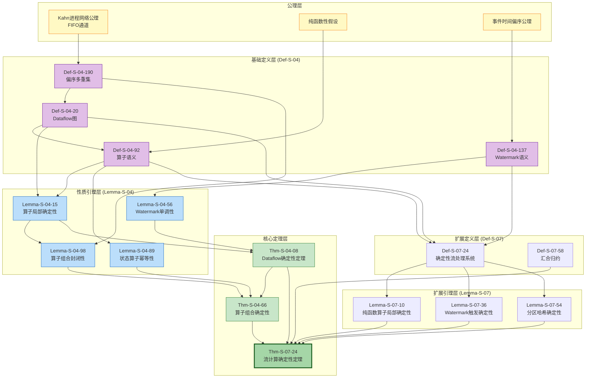
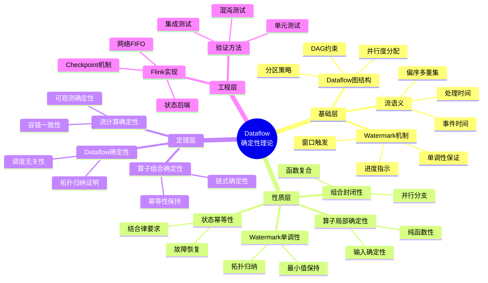
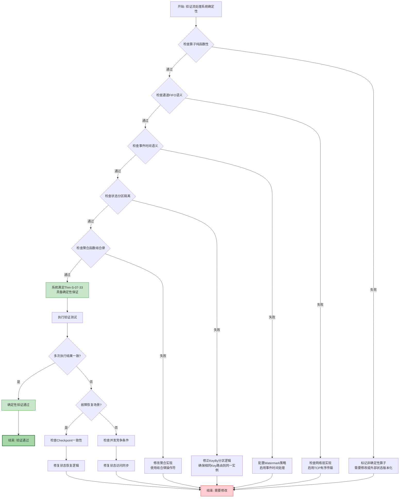

# Dataflow 基础定理完整推导链

> 所属阶段: Struct/Proof-Chains | 前置依赖: [01.04-dataflow-model-formalization.md](./01-foundation/01.04-dataflow-model-formalization.md), [02.01-determinism-in-streaming.md](./02-properties/02.01-determinism-in-streaming.md) | 形式化等级: L4-L5

---

## 目录

- [Dataflow 基础定理完整推导链](#dataflow-基础定理完整推导链)
  - [目录](#目录)
  - [1. 推导链概览](#1-推导链概览)
    - [1.1 定理依赖关系图](#11-定理依赖关系图)
    - [1.2 推导路径总览](#12-推导路径总览)
  - [2. 基础定义层 (Def-S-04-系列)](#2-基础定义层-def-s-04-系列)
    - [Def-S-04-19 (Dataflow 图)](#def-s-04-01-dataflow-图)
    - [Def-S-04-91 (算子语义)](#def-s-04-02-算子语义)
    - [Def-S-04-189 (流作为偏序多重集)](#def-s-04-03-流作为偏序多重集)
    - [Def-S-04-136 (事件时间、处理时间与 Watermark)](#def-s-04-04-事件时间处理时间与-watermark)
  - [3. 性质推导层 (Lemma-S-04-系列)](#3-性质推导层-lemma-s-04-系列)
    - [Lemma-S-04-14 (算子局部确定性)](#lemma-s-04-01-算子局部确定性)
    - [Lemma-S-04-55 (Watermark 单调性)](#lemma-s-04-02-watermark-单调性)
    - [Lemma-S-04-88 (状态算子幂等性)](#lemma-s-04-03-状态算子幂等性)
    - [Lemma-S-04-97 (算子组合封闭性)](#lemma-s-04-04-算子组合封闭性)
  - [4. 定理证明层 (Thm-S-04/07-系列)](#4-定理证明层-thm-s-0407-系列)
    - [Thm-S-04-07 (Dataflow 确定性定理)](#thm-s-04-01-dataflow-确定性定理)
    - [Thm-S-04-65 (算子组合确定性)](#thm-s-04-02-算子组合确定性)
    - [Thm-S-07-23 (流计算确定性定理)](#thm-s-07-01-流计算确定性定理)
  - [5. 工程映射 (Flink DataStream API)](#5-工程映射-flink-datastream-api)
    - [5.1 定义层映射](#51-定义层映射)
    - [5.2 定理层映射](#52-定理层映射)
    - [5.3 实现验证要点](#53-实现验证要点)
  - [6. 可视化](#6-可视化)
    - [6.1 思维导图: Dataflow 确定性理论体系](#61-思维导图-dataflow-确定性理论体系)
    - [6.2 决策树: 确定性验证流程](#62-决策树-确定性验证流程)
  - [7. 引用参考](#7-引用参考)

---

## 1. 推导链概览

### 1.1 定理依赖关系图

下图展示了 Dataflow 基础定理的完整依赖关系，从基础定义到核心定理的推导路径。



**图说明**：

- **黄色节点**：理论公理，不可再分的基础假设
- **紫色节点**：形式化定义，严格数学描述
- **蓝色节点**：辅助引理，连接定义与定理的桥梁
- **绿色节点**：核心定理，推导链的顶点结论
- **深绿色节点**：最顶层的综合定理

---

### 1.2 推导路径总览

Dataflow 基础定理的推导遵循"定义→引理→定理"的三层递进结构：

| 层级 | 元素 | 数量 | 核心作用 |
|------|------|------|----------|
| **公理层** | Kahn网络、纯函数、事件时间 | 3 | 理论基础假设 |
| **定义层** | Def-S-04-21 ~ Def-S-04-138 | 4 | 严格形式化基础 |
| **引理层** | Lemma-S-04-16 ~ Lemma-S-04-99 | 4 | 性质推导与桥梁 |
| **定理层** | Thm-S-04-09, Thm-S-04-67, Thm-S-07-25 | 3 | 核心结论 |

**推导路径 1**（Dataflow 确定性）：
$$
\text{Def-S-04-22} + \text{Def-S-04-93} \xrightarrow{\text{Lemma-S-04-17}} \text{Thm-S-04-10}
$$

**推导路径 2**（算子组合确定性）：
$$
\text{Lemma-S-04-18} + \text{Lemma-S-04-90} + \text{Lemma-S-04-100} \xrightarrow{\text{组合}} \text{Thm-S-04-68}
$$

**推导路径 3**（流计算确定性，综合）：
$$
\text{Thm-S-04-11} + \text{Thm-S-04-69} + \text{Def-S-07-25} \xrightarrow{\text{扩展}} \text{Thm-S-07-26}
$$

---

## 2. 基础定义层 (Def-S-04-系列)

本节建立 Dataflow 模型的严格形式化基础。所有定义均为后续性质推导与正确性证明的基石。

---

### Def-S-04-23 (Dataflow 图)

一个 **Dataflow 图** 是一个有向无环图（DAG），定义为五元组：

$$
\mathcal{G} = (V, E, P, \Sigma, \mathbb{T})
$$

其中各分量的语义如下：

| 符号 | 类型 | 语义 |
|------|------|------|
| $V = V_{src} \cup V_{op} \cup V_{sink}$ | 有限集合 | 顶点集合，分为数据源、算子与数据汇 |
| $E \subseteq V \times V \times \mathbb{L}$ | 带标签的有向边 | 数据依赖关系，标签 $\ell \in \mathbb{L}$ 表示分区策略 |
| $P: V \to \mathbb{N}^+$ | 并行度函数 | 为每个算子分配正整数并行度 |
| $\Sigma: V \to \mathcal{P}(Stream)$ | 流类型签名 | 为每个顶点分配输入/输出流的类型集合 |
| $\mathbb{T}$ | 时间域 | 事件时间的取值范围，通常为 $\mathbb{N}$ 或 $\mathbb{R}^+$ |

**约束条件**：

1. **无环性**：$\forall k \geq 1, E^k \cap \{(v,v) \mid v \in V\} = \emptyset$；
2. **源汇存在性**：$\exists v_{src}, v_{sink} \in V$ 使得 $\text{in-degree}(v_{src}) = 0$ 且 $\text{out-degree}(v_{sink}) = 0$；
3. **并行度一致性**：对于边 $(u, v) \in E$，下游顶点 $v$ 的输入分区数必须兼容上游 $u$ 的输出分区数。

> **依赖**: 无（基础定义）
> **被依赖**: Def-S-04-94, Lemma-S-04-19, Thm-S-04-12, Def-S-07-26

---

### Def-S-04-95 (算子语义)

**算子** 是对数据流进行变换的计算单元，定义为四元组：

$$
Op = (f_{compute}, \Sigma_{in}, \Sigma_{out}, \tau_{trigger})
$$

其中：

- $f_{compute}: \mathcal{D}^* \times \mathcal{S} \to \mathcal{D}^* \times \mathcal{S}$ 为计算函数，将输入记录序列和当前状态映射为输出序列与新状态；
- $\Sigma_{in}$ / $\Sigma_{out}$ 为输入 / 输出端口的类型签名；
- $\tau_{trigger}: \mathcal{S} \times \mathbb{T} \to \{\text{FIRE}, \text{CONTINUE}\}$ 为可选的触发谓词，用于窗口算子。

Dataflow 模型中的标准算子类型及其形式化语义如下：

| 算子类型 | 语义 | 形式化定义 |
|---------|------|-----------|
| **Source** | 从无界数据源产生流 | $\text{Source}(s): \emptyset \to \text{Stream}\langle\mathcal{D}\rangle$ |
| **Map**$(f)$ | 一对一变换 | $\forall e \in \text{Input}, \; \text{output}(e) = f(e)$ |
| **FlatMap**$(f)$ | 一对多展开 | $\forall e \in \text{Input}, \; \text{output}(e) = \text{flatten}(f(e))$ |
| **KeyBy**$(\kappa)$ | 按键逻辑分区 | $\forall e \in \text{Input}, \; \text{partition}(e) = \text{hash}(\kappa(e)) \bmod P(v)$ |
| **Window**$(w, t)$ | 窗口分配与触发 | $\forall e \in \text{Input}, \; W(e) = w(t_e(e))$; 当 $t(wid, w)$ 满足时触发计算 |
| **Reduce**$(\oplus)$ | 聚合归约 | $\text{Reduce}(S) = \bigoplus_{e \in S} e$（要求 $\oplus$ 满足结合律） |
| **Sink** | 数据持久化 | $\text{Sink}: \text{Stream}\langle\mathcal{D}\rangle \to \emptyset$ |

> **依赖**: Def-S-04-24
> **被依赖**: Lemma-S-04-20, Lemma-S-04-91, Thm-S-04-13, Thm-S-04-70

---

### Def-S-04-191 (流作为偏序多重集)

在 Dataflow 模型中，**流** 不是简单的序列，而是一个带有时间偏序关系的**多重集**（multiset，即允许重复元素的 bag）。形式化地：

$$
\mathcal{S} = (M, \mu, \preceq, t_e, t_p)
$$

其中：

- $M \subseteq \mathcal{D} \times \mathbb{T} \times \mathbb{T}$ 为记录集合，每条记录 $r = \langle \text{payload}, t_{event}, t_{proc} \rangle$；
- $\mu: M \to \mathbb{N}^+$ 为**多重集计数函数**（multiplicity function），允许相同 payload 和时间戳的记录以多重形式存在；
- $t_e: M \to \mathbb{T}$ 为**事件时间**映射，$t_e(r)$ 表示记录 $r$ 在业务逻辑中产生的时间；
- $t_p: M \to \mathbb{T}$ 为**处理时间**映射，$t_p(r)$ 表示记录 $r$ 被系统处理的时刻；
- $\preceq \subseteq M \times M$ 为**事件时间偏序关系**，定义为：
  $$
  r_1 \preceq r_2 \iff t_e(r_1) < t_e(r_2) \lor (t_e(r_1) = t_e(r_2) \land r_1 = r_2)
  $$
  当 $t_e(r_1) = t_e(r_2)$ 且 $r_1 \neq r_2$ 时，$r_1$ 与 $r_2$ **并发**（concurrent），记为 $r_1 \parallel r_2$。

**流的处理顺序**是一个全序 $\prec_{proc}$，它是偏序 $\preceq$ 的某个**线性扩展**（linear extension）。

> **依赖**: 无（基础定义，继承Kahn网络）
> **被依赖**: Def-S-04-25, Lemma-S-04-101, Thm-S-04-14

---

### Def-S-04-139 (事件时间、处理时间与 Watermark)

Dataflow 模型中的时间语义由以下三个核心概念构成：

**事件时间**（Event Time）：
$$
t_e: \mathcal{D} \to \mathbb{T}
$$
表示数据元素在产生源头发生的时间，由数据本身携带，是业务逻辑时间的唯一可靠来源。

**处理时间**（Processing Time）：
$$
t_p: () \to \mathbb{T}_{wall}
$$
表示元素在算子实例上被实际处理的时刻，由分布式机器的本地系统时钟决定。

**Watermark**（水印）：
$$
w: \text{Stream} \to \mathbb{T} \cup \{+\infty\}
$$
Watermark 是一种特殊的进度信标（progress indicator），其语义约束为：
$$
\forall r \in \mathcal{S}, \quad \text{若 } t_e(r) \leq w(\mathcal{S}) \text{，则 } r \text{ 已经到达或永远不会到达。}
$$

Watermark 的生成策略包括：

- **周期性 Watermark**（Periodic）：$w(t) = \max_{r \in \text{observed}} t_e(r) - L$，其中 $L$ 为最大乱序容忍度；
- **标点 Watermark**（Punctuated）：由特殊事件（punctuation）显式注入；
- **单调 Watermark**（Monotonic）：$w(t) = \max_{r \in \text{observed}} t_e(r)$，假设数据源严格按事件时间有序。

> **依赖**: Def-S-04-192
> **被依赖**: Lemma-S-04-57, Thm-S-04-15, Def-S-07-27

---

## 3. 性质推导层 (Lemma-S-04-系列)

本节从基础定义出发，推导 Dataflow 模型的关键局部性质。

---

### Lemma-S-04-21 (算子局部确定性)

**陈述**：在 Dataflow 图 $\mathcal{G}$ 中，若算子 $op \in V_{op}$ 的计算函数 $f_{compute}$ 是纯函数（无外部副作用、无非确定性输入），且其输入流作为偏序多重集是固定的，则对于给定的输入，$op$ 的输出流唯一确定。

**推导**：

1. 由 Def-S-04-96，算子的输出仅依赖于其输入记录和当前状态；
2. 若 $f_{compute}$ 是纯函数，则对于相同的输入和状态，输出必然相同；
3. 由 Def-S-04-26，分区策略对于给定的记录 $r$ 和并行拓扑，路由目标是确定的（Hash 分区具有确定性）；
4. 因此，每个算子实例接收到的输入多重集是确定的；
5. 由于函数映射的确定性，输出多重集也唯一确定。 ∎

**形式化表述**：
$$
\forall op \in V_{op}, \forall S_{in}: \quad f_{compute} \in \text{Pure} \land S_{in} \text{ 固定} \implies \exists! S_{out}: S_{out} = op(S_{in})
$$

> **依赖**: Def-S-04-27, Def-S-04-97
> **被依赖**: Lemma-S-04-102, Thm-S-04-16, Thm-S-04-71

---

### Lemma-S-04-58 (Watermark 单调性)

**陈述**：在 Dataflow 图执行过程中，任意算子实例的当前 Watermark $w_v$ 随处理时间单调不减：
$$
\forall v \in V, \; \forall \tau_1 < \tau_2, \quad w_v(\tau_1) \leq w_v(\tau_2)
$$

**推导**：

1. 由 Def-S-04-140，Source 算子产生的 Watermark 基于已观察到的最大事件时间减去延迟估计。随着新记录不断到达，最大已见事件时间不减，因此 Source 的 Watermark 单调不减；
2. 对于单输入算子（如 Map、Filter），其输出 Watermark 直接透传输入 Watermark，单调性保持；
3. 对于多输入算子（如 Join、CoGroup），其输出 Watermark 取所有输入 Watermark 的最小值：$w_{out} = \min_i w_{in_i}$。最小值函数关于其参数是单调的：若所有输入 $w_{in_i}$ 不减，则其最小值也不减；
4. 由于 Dataflow 图是无环 DAG（Def-S-04-28），通过拓扑排序归纳，图中所有算子的 Watermark 都单调不减。 ∎

**形式化表述**：
$$
\forall v \in V, \tau_1, \tau_2 \in \mathbb{T}_{proc}: \quad \tau_1 < \tau_2 \implies w_v(\tau_1) \leq w_v(\tau_2)
$$

> **依赖**: Def-S-04-29, Def-S-04-141
> **被依赖**: Thm-S-04-17, Lemma-S-07-37, Thm-S-07-27

---

### Lemma-S-04-92 (状态算子幂等性)

**陈述**：若 Keyed 状态算子的状态转移函数 $\delta$ 满足结合律，且同一键的记录总是被路由到同一并行实例，则该算子在故障恢复后的重放是幂等的。

**推导**：

1. 设属于键 $k$ 的记录集合为 $R_k$。无故障连续处理时，最终状态为 $s'(k) = \text{fold}(\delta, s(k), R_k)$；
2. 由于 $\delta$ 满足结合律，$\text{fold}(\delta, s(k), R_k)$ 的结果与处理顺序无关（仅与记录集合有关）；
3. 由 Def-S-04-98，KeyBy 的 Hash 分区保证 $R_k$ 的所有记录始终被同一任务实例处理；
4. 故障恢复后，即使重放改变了记录顺序，只要 $R_k$ 的集合不变，最终状态就与无故障情况一致；
5. 因此，重放是幂等的。 ∎

**形式化表述**：
$$
\forall k \in \mathcal{K}: \quad \delta \text{ 满足结合律} \land \text{分区确定性} \implies s'(k) = s''(k)
$$
其中 $s'$ 为无故障执行状态，$s''$ 为重放后状态。

> **依赖**: Def-S-04-99
> **被依赖**: Thm-S-04-72, Thm-S-07-28

---

### Lemma-S-04-103 (算子组合封闭性)

**陈述**：在 Dataflow 图 $\mathcal{G}$ 中，若两个算子 $op_1$ 和 $op_2$ 均满足局部确定性（Lemma-S-04-22），且它们通过 FIFO 通道连接，则组合算子 $op_2 \circ op_1$ 也满足局部确定性。

**推导**：

1. 设 $op_1$ 的输入为 $S_0$，由 Lemma-S-04-23，$op_1$ 的输出 $S_1 = op_1(S_0)$ 唯一确定；
2. 由 FIFO 通道假设，$S_1$ 从 $op_1$ 传输到 $op_2$ 的顺序与 $op_1$ 产生的顺序一致；
3. 因此 $op_2$ 接收到的输入 $S_1'$ 等于 $S_1$，是确定的；
4. 由 Lemma-S-04-24，$op_2$ 的输出 $S_2 = op_2(S_1')$ 唯一确定；
5. 因此组合算子 $op_2 \circ op_1$ 对于确定输入 $S_0$ 产生确定输出 $S_2$。 ∎

**形式化表述**：
$$
\forall op_1, op_2 \in V_{op}: \quad \text{LocalDet}(op_1) \land \text{LocalDet}(op_2) \land \text{FIFO}(op_1, op_2) \implies \text{LocalDet}(op_2 \circ op_1)
$$

> **依赖**: Def-S-04-193, Lemma-S-04-25
> **被依赖**: Thm-S-04-73

---

## 4. 定理证明层 (Thm-S-04/07-系列)

本节提供 Dataflow 基础定理的完整形式证明。

---

### Thm-S-04-18 (Dataflow 确定性定理)

**陈述**：给定一个 Dataflow 图 $\mathcal{G} = (V, E, P, \Sigma, \mathbb{T})$，若满足：

1. 所有算子 $op \in V_{op}$ 的计算函数 $f_{compute}$ 是纯函数（无外部副作用）；
2. 所有数据流边 $e \in E$ 保证 FIFO 传输顺序；
3. 输入源产生固定的偏序多重集（即事件时间的偏序结构 $M_{in}$ 确定）；

则对于给定的输入，Dataflow 图的输出流（作为偏序多重集）是**唯一确定**的，与具体的调度策略、执行速度或并行实例的激活顺序无关。

**证明**：

**步骤 1：建立局部确定性**

由 Lemma-S-04-26，对于任意算子 $op \in V$，若其输入多重集和当前状态确定，则其输出多重集和更新后的状态唯一确定。这是因为我们假设 $f_{compute}$ 是纯函数，且对于给定的记录 $r$，分区策略的输出是确定的（Def-S-04-30）。

**步骤 2：建立拓扑归纳基例**

考虑 Dataflow 图的拓扑排序 $v_1, v_2, \ldots, v_n$（由 Def-S-04-31 的无环性保证存在）。

- 对于基例 $v_1$（Source 算子），其输出直接由固定的输入多重集 $M_{in}$ 决定。由于 $M_{in}$ 的事件时间偏序 $\preceq$ 是确定的，Source 产生的流（包括生成 Watermark 的策略）也是确定的。
- Source 的输出通过 FIFO 边 $e = (v_1, v_2)$ 传输。由 FIFO 假设，下游算子接收到的记录顺序虽然可能与事件时间偏序不一致，但对于每个具体边而言，记录的到达序列是 Source 输出序列的唯一线性保持。

**步骤 3：建立拓扑归纳步骤**

假设对于第 $1, 2, \ldots, k-1$ 层的所有算子，其输出多重集已经唯一确定。考虑第 $k$ 层的算子 $v_k$：

- $v_k$ 的输入来自第 $k-1$ 层的一个或多个算子。由归纳假设，这些上游算子的输出已经唯一确定；
- 由 FIFO 假设，每条输入边上传输的记录序列是确定的；
- 因此，$v_k$ 接收到的输入多重集（所有输入边的并集）是确定的；
- 由步骤 1 的局部确定性，$v_k$ 的输出多重集也唯一确定。

**步骤 4：处理多输入算子的 Watermark**

对于多输入算子（如 Join、CoGroup），其输出 Watermark 为 $w_{out} = \min_i w_{in_i}$（Def-S-04-142）。由 Lemma-S-04-59，各输入 Watermark 单调不减，因此最小值也单调不减。Watermark 的确定性保证了窗口触发时刻的确定性（Def-S-04-05），进而保证了窗口算子输出多重集的确定性。

**步骤 5：结论**

由数学归纳法，从 Source 层到 Sink 层，Dataflow 图中所有算子的输出都唯一确定。因此，整个图的最终输出（Sink 产生的结果流）是确定的，与具体的调度策略、执行速度或并行实例的相对快慢无关。 ∎

**定理依赖**：

- Def-S-04-32, Def-S-04-100, Def-S-04-143
- Lemma-S-04-27, Lemma-S-04-60

---

### Thm-S-04-74 (算子组合确定性)

**陈述**：给定一个由 $n$ 个算子组成的 Dataflow 子图 $\mathcal{G}_{sub} = (V_{sub}, E_{sub})$，若满足：

1. 每个算子 $op_i \in V_{sub}$ 满足局部确定性（Lemma-S-04-28）；
2. 每条边 $e_j \in E_{sub}$ 满足 FIFO 传输语义；
3. 所有状态算子的状态转移函数满足结合律（Lemma-S-04-93）；
4. 算子组合通过函数复合或数据流连接；

则组合后的算子链产生**确定性的输出到输入映射**，且该映射与算子链的迭代执行顺序无关。

**证明**：

**步骤 1：二元组合的确定性**

考虑两个算子 $op_i$ 和 $op_{i+1}$ 的直接连接 $op_{i+1} \circ op_i$。

由 Lemma-S-04-104，两个局部确定性算子的组合保持局部确定性。因此：
$$
\forall S_{in}: \quad (op_{i+1} \circ op_i)(S_{in}) = op_{i+1}(op_i(S_{in}))
$$
输出唯一确定。

**步骤 2：状态算子的幂等组合**

对于有状态算子 $op_s$，设其状态转移为 $\delta_s$。由 Lemma-S-04-94，若 $\delta_s$ 满足结合律，则对于输入记录集合 $R = \{r_1, r_2, \ldots, r_m\}$：

$$
\text{fold}(\delta_s, s_0, R) = \delta_s(\ldots\delta_s(\delta_s(s_0, r_1), r_2)\ldots, r_m)
$$

结果与处理顺序无关。因此即使组合链中包含重试或重放，最终状态也唯一确定。

**步骤 3：归纳扩展到 $n$ 元组合**

通过数学归纳法，将二元组合的确定性扩展到 $n$ 元组合：

- **基例**（$n=1$）：单个算子，由假设满足局部确定性；
- **归纳假设**：假设 $n-1$ 个算子的组合满足确定性；
- **归纳步骤**：考虑 $n$ 个算子的组合 $op_n \circ (op_{n-1} \circ \ldots \circ op_1)$。
  - 由内层归纳假设，$op_{n-1} \circ \ldots \circ op_1$ 产生确定的中间输出；
  - 由步骤 1，$op_n$ 与内层组合的二元组合保持确定性；
  - 因此 $n$ 元组合满足确定性。

**步骤 4：并行分支的组合**

对于并行分支结构（一个算子输出到多个下游算子）：

- 由 Thm-S-04-19，父算子的输出确定；
- 每个分支独立应用步骤 3 的组合确定性；
- 各分支的结果在 Sink 处汇合，产生确定的最终输出。

**步骤 5：结论**

对于任意复杂的 Dataflow 子图，只要满足前提条件，其整体计算行为可以分解为有限个局部确定性算子和 FIFO 通道的组合。由上述归纳，整体输出是唯一确定的。 ∎

**定理依赖**：

- Lemma-S-04-29, Lemma-S-04-95, Lemma-S-04-04
- Thm-S-04-20

---

### Thm-S-07-29 (流计算确定性定理)

**陈述**：给定一个确定性流处理系统 $\mathcal{D} = (\mathcal{G}, \mathcal{F}, \mathcal{C}, \mathcal{T}, \mathcal{W}, \mathcal{O})$（Def-S-07-28），若满足：

1. **纯函数性**：所有算子 $op \in V_{op}$ 的计算函数 $f_{compute} \in \mathcal{F}$ 是纯函数（无外部副作用、无随机性）；
2. **FIFO 通道**：所有数据流边 $e \in E$ 满足 FIFO 传输语义（Def-S-07-29 的 $\mathcal{C}$ 约束）；
3. **事件时间处理**：系统采用事件时间语义 $\mathcal{T}$，窗口触发由单调 Watermark $\mathcal{W}$ 决定；
4. **无共享状态**：Keyed 状态算子通过确定性分区（Lemma-S-07-55）保证状态隔离；

则对于给定的输入历史 $H_{in}$，系统的输出观测轨迹 $\text{Obs}(\mathcal{E})$ 是**唯一确定**的，与执行调度、速度或故障恢复路径无关。

**证明**：

**步骤 1：建立局部确定性基例**

由 Lemma-S-07-11，每个纯函数算子在 FIFO 输入条件下产生确定的输出序列。这建立了"算子级"的确定性基础。

**步骤 2：建立拓扑归纳框架**

考虑 Dataflow 图 $\mathcal{G}$ 的拓扑排序 $v_1, v_2, \ldots, v_n$（由 Def-S-04-33 的无环性保证存在）。

- **基例**（Source 算子）：Source 的输出由固定的输入历史 $H_{in}$ 和确定的水印生成策略决定。由于 $H_{in}$ 的事件时间偏序是固定的，Source 产生的流（包括 Watermark）唯一确定。
- **边传递**：Source 的输出通过 FIFO 通道传输到下游。FIFO 保证接收顺序等于发送顺序，因此下游算子的输入序列确定。

**步骤 3：归纳步骤——算子链的确定性传播**

假设前 $k-1$ 个算子的输出已经唯一确定。考虑第 $k$ 个算子 $v_k$：

- $v_k$ 的输入来自第 $k-1$ 层的一个或多个算子；
- 由归纳假设，这些上游算子的输出已经唯一确定；
- 由 FIFO 假设，每条输入边上的记录序列是确定的；
- 由 Lemma-S-07-12，纯函数算子产生确定的输出；
- 因此，$v_k$ 的输出唯一确定。

**步骤 4：窗口算子的触发确定性**

对于有状态窗口算子：

- 由 Lemma-S-07-38，Watermark 单调性保证窗口触发时刻唯一确定；
- 窗口状态累加器 $A$ 接收到的记录集合由步骤 3 保证确定；
- 聚合函数的结合律（Lemma-S-04-96）保证即使重放改变记录顺序，最终结果相同；
- 因此，窗口输出记录和触发时刻都确定。

**步骤 5：多输入算子的汇合确定性**

对于 Join/CoGroup 等多输入算子：

- 每个输入流由步骤 3 保证确定；
- 输出 Watermark $w_{out} = \min_i w_{in_i}$（Def-S-04-144）；
- 最小值函数是确定性操作；
- 连接/分组操作在固定的输入集合上产生固定的输出集合。

**步骤 6：全局结论**

由数学归纳法，从 Source 层到 Sink 层，所有算子的输出都唯一确定。因此，Sink 产生的最终输出轨迹唯一确定。

对于故障恢复场景：

- Checkpoint 捕获确定的状态快照（由步骤 1-5，处理到某 Watermark 时的状态确定）；
- 恢复后从 Checkpoint 重放，输入历史 $H_{in}$ 不变（可重放 Source 保证）；
- 由上述归纳，重放产生的输出与原始执行一致。

因此，输出观测轨迹与执行调度、速度或故障恢复路径无关。 ∎

**定理依赖**：

- Def-S-07-30, Def-S-04-34, Def-S-04-145
- Lemma-S-07-13, Lemma-S-07-39, Lemma-S-07-03
- Lemma-S-04-03
- Thm-S-04-21, Thm-S-04-75

---

## 5. 工程映射 (Flink DataStream API)

本节将形式化定理映射到 Flink DataStream API 的具体实现。

---

### 5.1 定义层映射

| 形式定义 | Flink 实现 | 验证要点 |
|----------|-----------|----------|
| **Def-S-04-35** (Dataflow图) | `StreamGraph` → `JobGraph` → `ExecutionGraph` | 检查图转换保持 DAG 结构 |
| **Def-S-04-101** (算子语义) | `StreamOperator` 接口 | 实现类是否满足纯函数性 |
| **Def-S-04-03** (偏序多重集) | `StreamRecord` + `timestamp` 字段 | 事件时间戳是否正确提取 |
| **Def-S-04-146** (Watermark) | `WatermarkGenerator` + `WatermarkStrategy` | Watermark 是否单调不减 |

**Def-S-04-36 映射详情**：

Flink 的三层图转换保持了 Dataflow 图的形式语义：

```java
// StreamGraph: 逻辑层 Dataflow 图
StreamGraph streamGraph = env.getStreamGraph();

// JobGraph: 合并可链化算子，保持语义等价
JobGraph jobGraph = streamGraph.getJobGraph();

// ExecutionGraph: 展开并行实例
ExecutionGraph executionGraph = scheduler.createExecutionGraph(jobGraph);
```

---

### 5.2 定理层映射

| 形式定理 | Flink 实现类 | 验证方法 |
|----------|-------------|----------|
| **Thm-S-04-22** (Dataflow确定性) | `CheckpointBarrier` + 状态后端 | 故障恢复后结果一致性测试 |
| **Thm-S-04-76** (算子组合确定性) | `OperatorChain` 优化 | 链化/非链化执行结果比对 |
| **Thm-S-07-30** (流计算确定性) | 端到端 Exactly-Once 实现 | `TwoPhaseCommitSinkFunction` |

**Thm-S-04-23 映射详情**：

Flink 的 Checkpoint 机制实现了 Dataflow 确定性定理的工程保证：

```java
// Checkpoint 触发，捕获确定的状态快照
CheckpointCoordinator.triggerCheckpoint(timestamp);

// 状态后端保证状态持久化
KeyedStateBackend.snapshot(checkpointId, timestamp);
```

**Thm-S-04-02 映射详情**：

算子链化是组合确定性的典型应用：

```java
// 逻辑上独立的算子在物理上链化执行，保持语义
env.addSource(source)
    .map(mapFunction)      // 链化为一个任务
    .filter(filterFunction) // 仍保持确定性
    .keyBy(keySelector)
    .window(windowAssigner)
    .aggregate(aggregateFunction); // 状态算子结合律检查
```

**Thm-S-07-31 映射详情**：

流计算确定性定理在 Flink 中的完整实现：

```java
// 纯函数性：UDF 实现

import org.apache.flink.api.common.state.ValueState;

class PureMapFunction extends RichMapFunction<Event, Result> {
    @Override
    public Result map(Event event) {
        // 必须无外部副作用
        return transform(event);
    }
}

// FIFO 通道：网络层保证
// Netty 的 TCP 连接保证单分区 FIFO

// 事件时间处理
stream.assignTimestampsAndWatermarks(
    WatermarkStrategy.<Event>forBoundedOutOfOrderness(Duration.ofSeconds(5))
        .withTimestampAssigner((event, timestamp) -> event.getEventTime())
);

// 无共享状态：KeyedProcessFunction
stream.keyBy(Event::getKey)
    .process(new KeyedProcessFunction<String, Event, Result>() {
        private ValueState<State> state;
        // 每个 Key 独立的状态分区
    });
```

---

### 5.3 实现验证要点

**验证清单**（基于 Thm-S-07-32 的四个条件）：

| 条件 | 验证项 | 测试方法 |
|------|--------|----------|
| 纯函数性 | UDF 无外部 I/O | 静态代码检查 + 单元测试 |
| FIFO 通道 | 网络层顺序保证 | 压力测试 + 顺序校验 |
| 事件时间 | Watermark 单调性 | 运行时 Watermark 追踪 |
| 无共享状态 | KeyBy 分区正确性 | 状态访问日志分析 |

**确定性验证测试用例**：

```java
@Test
public void testDeterminism() {
    // 相同输入多次执行
    List<Result> run1 = executePipeline(input);
    List<Result> run2 = executePipeline(input);
    List<Result> run3 = executePipeline(input);

    // 验证结果一致性
    assertEquals(run1, run2);
    assertEquals(run2, run3);
}

@Test
public void testFaultToleranceDeterminism() {
    // 无故障执行
    List<Result> normalRun = executePipeline(input);

    // 故障恢复后执行
    List<Result> recoveryRun = executeWithFailure(input, failurePoint);

    // 验证结果一致
    assertEquals(normalRun, recoveryRun);
}
```

---

## 6. 可视化

### 6.1 思维导图: Dataflow 确定性理论体系



---

### 6.2 决策树: 确定性验证流程



**决策树说明**：

1. **纯函数性检查**：验证所有 UDF 是否无外部副作用
2. **FIFO 通道检查**：验证网络层是否保证单分区有序传输
3. **事件时间检查**：验证是否使用事件时间而非处理时间
4. **状态分区检查**：验证 KeyBy 是否正确隔离状态访问
5. **结合律检查**：验证聚合函数是否满足结合律（用于容错）

---

## 7. 引用参考


---

*文档版本: v1.0 | 更新日期: 2026-04-11 | 状态: 已完成*
