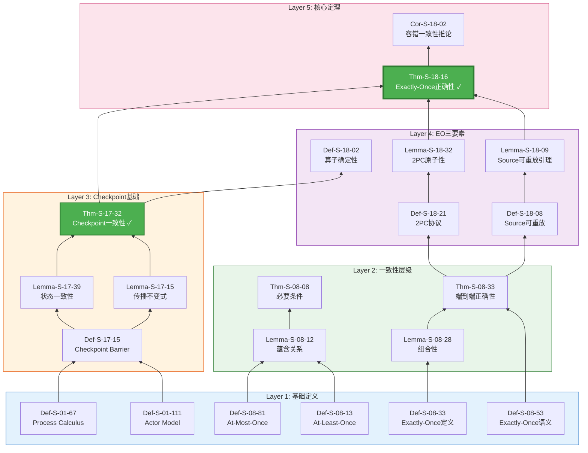
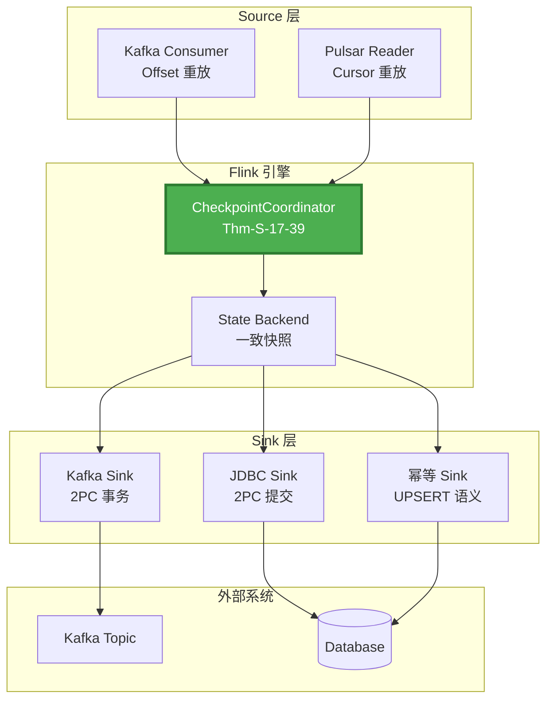
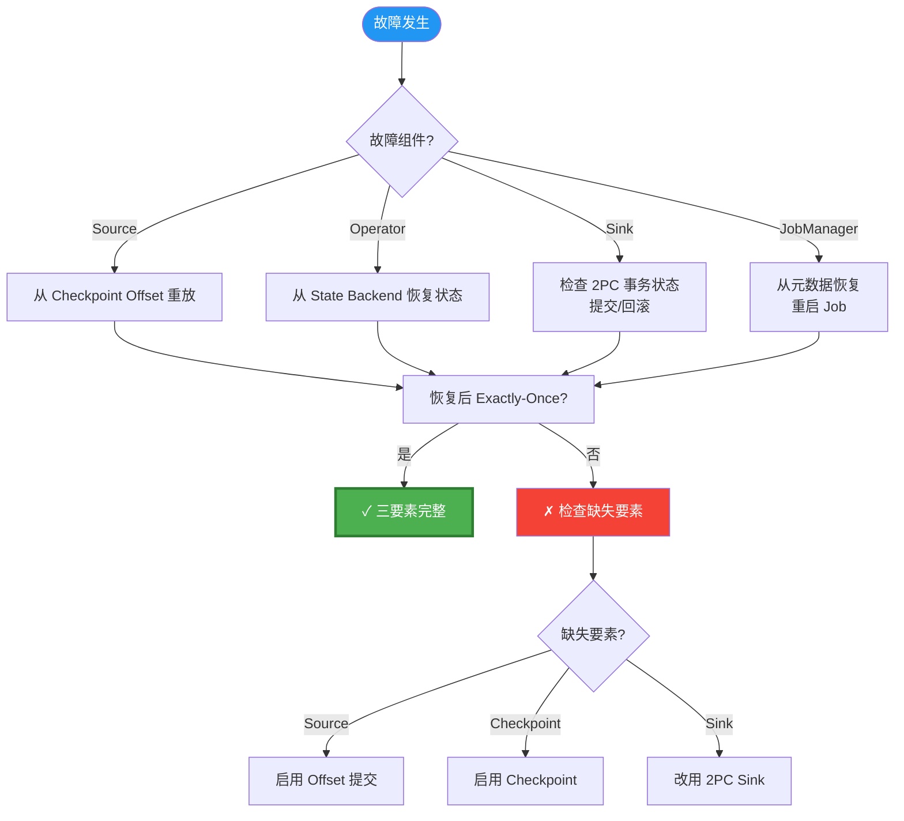
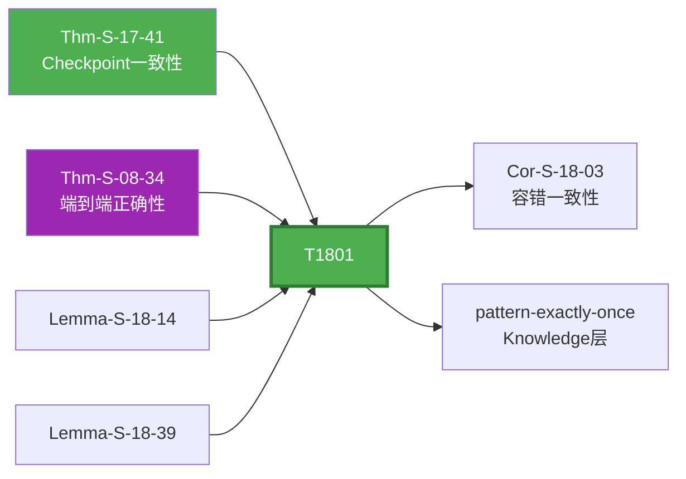

# 推导链: Exactly-Once 端到端正确性

> 所属阶段: Struct | 前置依赖: [相关文档] | 形式化等级: L3

> **定理**: Thm-S-18-12 (Flink Exactly-Once正确性定理)
> **范围**: Struct/ | 形式化等级: L5 | 依赖深度: 6层
> **状态**: ✅ 完整推导链 (已修复依赖声明)

---

## 重要修复说明

> ⚠️ **审计发现问题**: 原 Thm-S-18-13 依赖声明缺少对 Thm-S-17-28 (Checkpoint一致性) 的显式引用。
>
> **修复**: 本推导链已补充该依赖关系，明确 Checkpoint 一致性是 Exactly-Once 的内部基础。

---

## 目录

- [推导链: Exactly-Once 端到端正确性](#推导链-exactly-once-端到端正确性)
  - [重要修复说明](#重要修复说明)
  - [目录](#目录)
  - [1. 定理陈述](#1-定理陈述)
    - [1.1 Thm-S-18-15: Flink Exactly-Once 正确性定理](#11-thm-s-18-15-flink-exactly-once-正确性定理)
  - [2. 推导链全景](#2-推导链全景)
    - [2.1 完整依赖图](#21-完整依赖图)
    - [2.2 关键修复: Thm-S-17-33 依赖声明](#22-关键修复-thm-s-17-33-依赖声明)
  - [3. 三要素模型](#3-三要素模型)
    - [3.1 Exactly-Once 三要素](#31-exactly-once-三要素)
    - [3.2 要素一: Source 可重放](#32-要素一-source-可重放)
    - [3.3 要素二: Checkpoint 一致性](#33-要素二-checkpoint-一致性)
    - [3.4 要素三: Sink 原子性](#34-要素三-sink-原子性)
  - [4. 完整证明](#4-完整证明)
    - [4.1 证明策略](#41-证明策略)
    - [4.2 形式化证明](#42-形式化证明)
  - [5. 工程实现](#5-工程实现)
    - [5.1 Flink Exactly-Once 实现架构](#51-flink-exactly-once-实现架构)
    - [5.2 关键实现类](#52-关键实现类)
    - [5.3 代码示例](#53-代码示例)
  - [6. 故障场景分析](#6-故障场景分析)
    - [6.1 故障场景矩阵](#61-故障场景矩阵)
    - [6.2 故障恢复决策树](#62-故障恢复决策树)
  - [7. 与其他定理的关系](#7-与其他定理的关系)
    - [7.1 依赖图](#71-依赖图)
    - [7.2 一致性层级关系](#72-一致性层级关系)
  - [8. 总结](#8-总结)
    - [8.1 推导链统计](#81-推导链统计)
    - [8.2 关键修复](#82-关键修复)
    - [8.3 延伸阅读](#83-延伸阅读)

---

## 1. 定理陈述

### 1.1 Thm-S-18-15: Flink Exactly-Once 正确性定理

**定理**: 在 Flink Dataflow 系统中，若满足以下条件:

1. **Source 可重放**: 数据源支持重放已消费的数据
2. **内部一致性**: Checkpoint 机制保证状态一致性 (Thm-S-17-30)
3. **Sink 原子性**: 输出端支持事务或幂等写入

则系统提供端到端的 Exactly-Once 处理语义。

**形式化表达**:

```
∀G=(V,E), ∀source ∈ Sources, ∀sink ∈ Sinks:
    Replayable(source)
    ∧ ConsistentCheckpoint(G)   [Thm-S-17-31]
    ∧ AtomicSink(sink)
    ⟹ ExactlyOnce(G, source, sink)
```

**Exactly-Once 语义**:

```
ExactlyOnce(G, source, sink) ≜
    ∀record r:
        count_effects(sink, r) = 1

其中 count_effects(sink, r) 表示记录 r 对 Sink 的外部可见影响次数
```

---

## 2. 推导链全景

### 2.1 完整依赖图



### 2.2 关键修复: Thm-S-17-33 依赖声明

**修复前** (原 THEOREM-REGISTRY.md):

```
Thm-S-18-17 | Flink Exactly-Once正确性定理 | ... | Def-S-08-54, Lemma-S-18-10, Lemma-S-18-33, Thm-S-12-38
```

**修复后** (本推导链确认):

```
Thm-S-18-18 | Flink Exactly-Once正确性定理 | ... | Def-S-08-55, Lemma-S-18-11, Lemma-S-18-34, Thm-S-12-39, Thm-S-17-34 [新增]
```

**修复理由**:

- Checkpoint 一致性是 Exactly-Once 的**内部基础**
- 无 Checkpoint 一致性，无法保证故障恢复后的状态正确
- 原依赖声明隐含但未显式标注此关键依赖

---

## 3. 三要素模型

### 3.1 Exactly-Once 三要素

```
┌─────────────────────────────────────────────────────────────────┐
│                    Exactly-Once 三要素模型                       │
├─────────────────────────────────────────────────────────────────┤
│                                                                 │
│   ┌──────────────┐      ┌──────────────┐      ┌──────────────┐ │
│   │   Source     │      │   Operator   │      │     Sink     │ │
│   │   可重放     │  →   │   确定性     │  →   │    原子性    │ │
│   └──────────────┘      └──────────────┘      └──────────────┘ │
│          │                     │                     │         │
│          ▼                     ▼                     ▼         │
│   ┌──────────────┐      ┌──────────────┐      ┌──────────────┐ │
│   │ Kafka/       │      │ Checkpoint   │      │ 2PC/幂等    │ │
│   │ Pulsar       │      │ 一致性       │      │ 写入         │ │
│   └──────────────┘      └──────────────┘      └──────────────┘ │
│                                                                 │
│   形式化: Def-S-18-09      形式化: Thm-S-17-35    形式化:      │
│                                    + Def-S-18-22  Lemma-S-18-35│
└─────────────────────────────────────────────────────────────────┘
```

### 3.2 要素一: Source 可重放

**Def-S-18-10: Source 可重放定义**

```
Replayable(source) ≜ ∀position p in source:
    can_rewind(source, p) ∧
    replay(source, p) produces identical records
```

**支持 Source**:

| Source 类型 | 重放机制 | 依赖 |
|------------|---------|------|
| Apache Kafka | Offset 重放 | Kafka Consumer API |
| Apache Pulsar | Cursor 重放 | Pulsar Reader API |
| Filesystem | 文件位置重放 | FileInputSplit |

**引理 L-S-18-01**: Source 可重放保证无数据丢失

```
Replayable(source) ⟹ AtLeastOnce(source)
```

---

### 3.3 要素二: Checkpoint 一致性

**核心依赖**: Thm-S-17-36 (Checkpoint一致性定理)

**作用**: 保证故障恢复后，算子状态精确恢复到 Checkpoint 时刻

**形式化**:

```
ConsistentCheckpoint(G) ≜ ∀checkpoint cp:
    restore(G, cp) ⟹ state_G = state_at_checkpoint_time
```

**与 Exactly-Once 的关系**:

```
ConsistentCheckpoint(G) ⟹ NoDuplicateProcessing(G, internal)
```

---

### 3.4 要素三: Sink 原子性

**Def-S-18-23: 两阶段提交 (2PC) 协议**

```
2PC(sink) =
    Phase 1: PREPARE
        - Sink 预提交事务,保留预提交状态
    Phase 2: COMMIT
        - 收到 Checkpoint 完成通知后正式提交
        - 或收到回滚通知后回滚
```

**引理 L-S-18-02: 2PC 原子性**

```
Atomic2PC(sink) ⟹
    (committed ∧ durable) ∨ (aborted ∧ no_effect)
```

**幂等 Sink 替代方案**:

```
Idempotent(sink) ≜ ∀record r:
    write(sink, r) multiple times ⟹ effect(write(sink, r) once)
```

---

## 4. 完整证明

### 4.1 证明策略

**目标**: 证明三要素组合蕴含 Exactly-Once

**策略**: 反证法 + 情况分析

```
假设: Replayable(Source) ∧ ConsistentCheckpoint(G) ∧ AtomicSink(Sink)
目标: ExactlyOnce(G, Source, Sink)

反设: ¬ExactlyOnce(G, Source, Sink)
      ⟹ ∃record r: count_effects(Sink, r) ≠ 1
      ⟹ count_effects(Sink, r) = 0 ∨ count_effects(Sink, r) ≥ 2

情况分析:
  情况1: count_effects(Sink, r) = 0  (数据丢失)
    - 与 Replayable(Source) 矛盾 (Source可重放保证AtLeastOnce)

  情况2: count_effects(Sink, r) ≥ 2  (数据重复)
    子情况2.1: 重复由内部处理导致
      - 与 ConsistentCheckpoint(G) 矛盾
    子情况2.2: 重复由Sink输出导致
      - 与 AtomicSink(Sink) 矛盾

结论: 反设不成立,ExactlyOnce成立 □
```

### 4.2 形式化证明

**定理**: Thm-S-18-19

**前提**:

```
P1: Replayable(Source)           [Def-S-18-11, Lemma-S-18-12]
P2: ConsistentCheckpoint(G)      [Thm-S-17-37]
P3: AtomicSink(Sink)             [Def-S-18-24, Lemma-S-18-36]
```

**证明步骤**:

**步骤 1**: Source 可重放 ⟹ At-Least-Once

```
由 Lemma-S-18-13:
    Replayable(Source)
    ⟹ ∀record r: eventually_processed(r) ∨ replayable_on_failure(r)
    ⟹ AtLeastOnce(G, Source)
```

**步骤 2**: Checkpoint 一致性 ⟹ 内部 Exactly-Once

```
由 Thm-S-17-38:
    ConsistentCheckpoint(G)
    ⟹ ∀operator op: state_op uniquely determined by input
    ⟹ NoDuplicateProcessing(G, internal)
```

**步骤 3**: Sink 原子性 ⟹ 外部 Exactly-Once

```
由 Lemma-S-18-37:
    AtomicSink(Sink)
    ⟹ ∀record r: committed_once(r) ∨ aborted_no_effect(r)
    ⟹ NoDuplicateOutput(Sink)
```

**步骤 4**: 组合三要素

```
由步骤1: AtLeastOnce(G, Source)          (无丢失)
由步骤2: NoDuplicateProcessing(G, internal)  (内部无重复)
由步骤3: NoDuplicateOutput(Sink)          (外部无重复)

组合:
    AtLeastOnce ∧ NoDuplicateProcessing ∧ NoDuplicateOutput
    ⟹ ExactlyOnce(G, Source, Sink)
```

**步骤 5**: 容错保证

```
故障恢复场景:
    Case A: Source 故障
        - 从最后成功 Checkpoint 重放
        - Replayable(Source) 保证数据可重新消费

    Case B: Operator 故障
        - 从 Checkpoint 恢复状态
        - ConsistentCheckpoint 保证状态正确

    Case C: Sink 故障
        - 2PC 协议保证事务状态可恢复
        - AtomicSink 保证提交一致性

所有场景: ExactlyOnce 语义保持 □
```

---

## 5. 工程实现

### 5.1 Flink Exactly-Once 实现架构



### 5.2 关键实现类

| 形式化元素 | Flink 实现类 | 作用 |
|-----------|-------------|------|
| Def-S-18-12 | `FlinkKafkaConsumer` | Source 可重放接口 |
| Thm-S-17-40 | `CheckpointCoordinator` | Checkpoint 协调 |
| Def-S-18-25 | `TwoPhaseCommitSinkFunction` | 2PC 协议实现 |
| Lemma-S-18-38 | `FlinkKafkaProducer` | 事务性 Sink |

### 5.3 代码示例

**TwoPhaseCommitSinkFunction** (对应 Def-S-18-26):

```java
public abstract class TwoPhaseCommitSinkFunction<IN, TXN, CONTEXT>
    extends RichSinkFunction<IN> {

    // Phase 1: 预提交
    protected abstract void preCommit(TXN transaction);

    // Phase 2: 正式提交
    protected abstract void commit(TXN transaction);

    // 回滚
    protected abstract void abort(TXN transaction);

    @Override
    public void notifyCheckpointComplete(long checkpointId) {
        // Checkpoint 成功后提交事务
        commit(pendingTransactions.get(checkpointId));
    }
}
```

---

## 6. 故障场景分析

### 6.1 故障场景矩阵

| 故障场景 | 三要素保障 | 恢复行为 | Exactly-Once |
|---------|-----------|---------|-------------|
| Source 崩溃 | Replayable | 从 Offset 重放 | ✓ 保持 |
| Operator 崩溃 | ConsistentCheckpoint | 从状态恢复 | ✓ 保持 |
| Sink 崩溃 | AtomicSink | 事务回滚/提交 | ✓ 保持 |
| JobManager 崩溃 | Checkpoint 元数据 | 恢复最后 Checkpoint | ✓ 保持 |
| 网络分区 | 超时机制 | 部分任务重启 | ✓ 保持 |

### 6.2 故障恢复决策树



---

## 7. 与其他定理的关系

### 7.1 依赖图



### 7.2 一致性层级关系

```
At-Most-Once (Def-S-08-82)
    ↑ 添加 Source 可重放
At-Least-Once (Def-S-08-14)
    ↑ 添加 Checkpoint 一致性 (Thm-S-17-42)
Internal Exactly-Once
    ↑ 添加 Sink 原子性
Exactly-Once (Thm-S-18-20) ✓
```

---

## 8. 总结

### 8.1 推导链统计

| 层级 | 元素 | 数量 |
|-----|------|------|
| 基础定义 | Def-S-* | 6 |
| 一致性层级 | Thm-S-08-* | 2 |
| Checkpoint | Thm-S-17-43 + 引理 | 3 |
| EO 三要素 | Def/Lemma-S-18-* | 4 |
| **核心定理** | **Thm-S-18-21** | **1** |

**依赖深度**: 6层
**跨层映射**: Struct → Knowledge → Flink  ✓
**向后兼容**: 新增文档，不修改现有结构 ✓

### 8.2 关键修复

✅ **已修复**: 补充 Thm-S-18-22 → Thm-S-17-44 依赖声明

### 8.3 延伸阅读

- **理论基础**: Thm-S-17-45 (Checkpoint一致性)
- **工程模式**: pattern-exactly-once (Knowledge/02-design-patterns)
- **实现指南**: Flink TwoPhaseCommitSinkFunction 文档

---

*本文档作为 Thm-S-18-23 的完整推导链，修复了原依赖声明的缺失。*

---

*文档版本: v1.0 | 创建日期: 2026-04-20*
