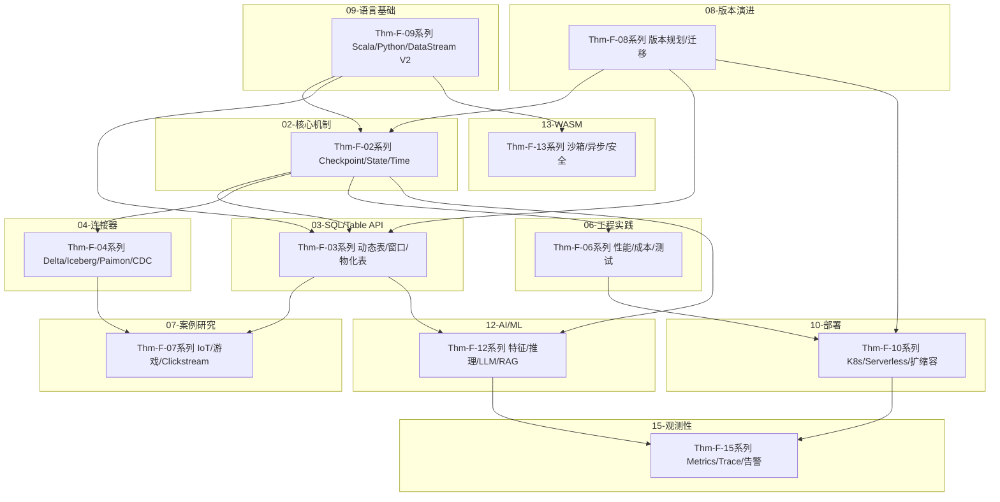
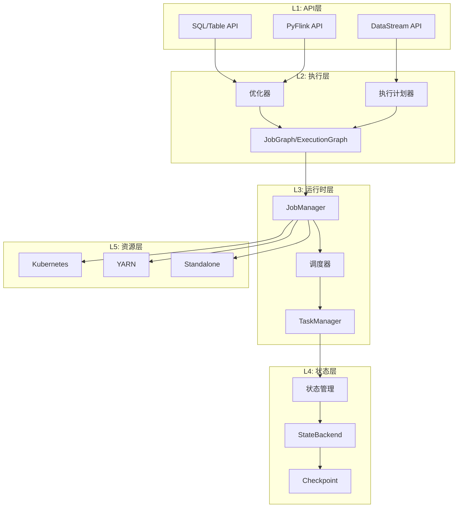
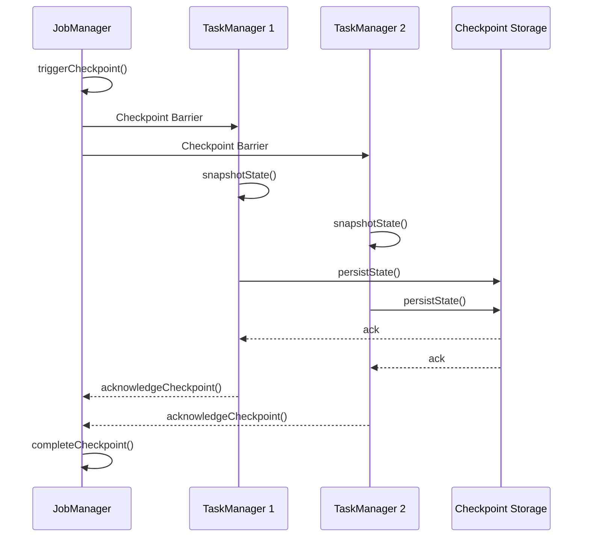
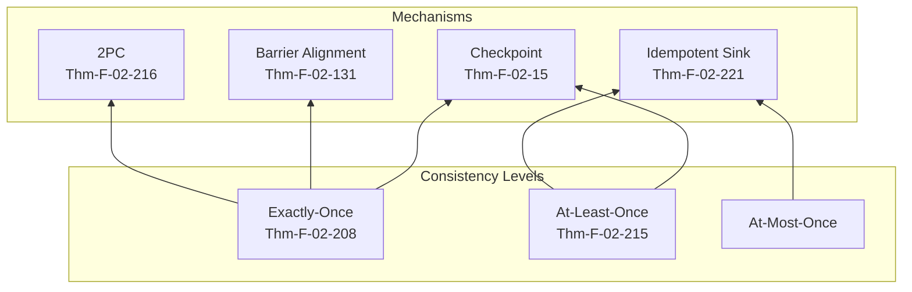

> **状态**: 🔮 前瞻内容 | **风险等级**: 高 | **最后更新**: 2026-04
> 
> 此文档描述的内容处于早期规划阶段，可能与最终实现不符。请以 Apache Flink 官方发布为准。
# Flink 层全量定理推导链文档

> **版本**: v1.0.0 | **创建日期**: 2026-04-11 | **范围**: Flink 全模块 (Flink/02 - Flink/15)
>
> 本文档是 Flink 专项层所有形式化定理的完整推导链，覆盖 Checkpoint、State、Time、SQL/Table API、连接器、工程实践、案例研究、语言基础、部署、AI/ML、WASM 等全部模块。

---

## 目录

- [Flink 层全量定理推导链文档](#flink-层全量定理推导链文档)
  - [目录](#目录)
  - [1. Flink 定理总览](#1-flink-定理总览)
    - [1.1 按模块统计](#11-按模块统计)
    - [1.2 定理编号体系](#12-定理编号体系)
    - [1.3 依赖关系图](#13-依赖关系图)
  - [2. 核心机制定理簇 (Thm-F-02)](#2-核心机制定理簇-thm-f-02)
    - [2.1 Checkpoint 定理群](#21-checkpoint-定理群)
      - [Thm-F-02-08: ForSt Checkpoint一致性定理](#thm-f-02-01-forst-checkpoint一致性定理)
      - [Thm-F-02-1976: LazyRestore正确性定理](#thm-f-02-02-lazyrestore正确性定理)
      - [Thm-F-02-154: 异步执行语义保持性定理](#thm-f-02-03-异步执行语义保持性定理)
      - [Thm-F-02-159: Debloating加速Checkpoint Barrier传播定理](#thm-f-02-10-debloating加速checkpoint-barrier传播定理)
      - [Thm-F-02-162: Delta Join V2缓存有效性定理](#thm-f-02-30-delta-join-v2缓存有效性定理)
    - [2.2 State 状态管理定理群](#22-state-状态管理定理群)
      - [Thm-F-02-76: ForSt状态后端一致性定理](#thm-f-02-45-forst状态后端一致性定理)
      - [Thm-F-02-165: ForSt增量Checkpoint正确性定理](#thm-f-02-46-forst增量checkpoint正确性定理)
      - [Thm-F-02-171: State TTL过期一致性定理](#thm-f-02-60-state-ttl过期一致性定理)
      - [Thm-F-02-179: TTL惰性清理正确性定理](#thm-f-02-61-ttl惰性清理正确性定理)
      - [Thm-F-02-185: State Backend选择最优性定理](#thm-f-02-90-state-backend选择最优性定理)
      - [Thm-F-02-189: Checkpoint完备性定理](#thm-f-02-91-checkpoint完备性定理)
      - [Thm-F-02-193: State TTL一致性定理](#thm-f-02-92-state-ttl一致性定理)
    - [2.3 Time/Watermark 定理群](#23-timewatermark-定理群)
      - [Thm-F-02-13: VECTOR\_SEARCH精度-延迟权衡边界](#thm-f-02-13-vector_search精度-延迟权衡边界)
      - [Thm-F-02-198: Balanced Scheduling最优性定理](#thm-f-02-14-balanced-scheduling最优性定理)
    - [2.4 异步执行定理群](#24-异步执行定理群)
      - [Thm-F-02-1608: 异步算子执行语义保持性定理](#thm-f-02-50-异步算子执行语义保持性定理)
      - [Thm-F-02-200: 异步I/O并发度最优性定理](#thm-f-02-51-异步io并发度最优性定理)
      - [Thm-F-02-129: 异步执行顺序一致性定理](#thm-f-02-52-异步执行顺序一致性定理)
      - [Thm-F-02-202: 异步超时容错正确性定理](#thm-f-02-53-异步超时容错正确性定理)
      - [Thm-F-02-204: 混合同步异步执行正确性定理](#thm-f-02-54-混合同步异步执行正确性定理)
    - [2.5 Exactly-Once 语义定理群](#25-exactly-once-语义定理群)
      - [Thm-F-02-206: 端到端Exactly-Once充分条件定理](#thm-f-02-71-端到端exactly-once充分条件定理)
      - [Thm-F-02-213: 两阶段提交原子性保证定理](#thm-f-02-72-两阶段提交原子性保证定理)
    - [2.6 Streaming ETL 定理群](#26-streaming-etl-定理群)
      - [Thm-F-02-219: Streaming ETL端到端一致性定理](#thm-f-02-35-streaming-etl端到端一致性定理)
      - [Thm-F-02-223: Schema演化兼容性定理](#thm-f-02-36-schema演化兼容性定理)
      - [Thm-F-02-225: 乱序数据处理正确性定理](#thm-f-02-37-乱序数据处理正确性定理)
    - [2.7 多路 Join 定理群](#27-多路-join-定理群)
      - [Thm-F-02-229: 多路Join最优计划选择定理](#thm-f-02-40-多路join最优计划选择定理)
    - [2.8 State TTL 定理群](#28-state-ttl-定理群)
      - [Thm-F-02-232: TTL状态恢复完整性定理](#thm-f-02-62-ttl状态恢复完整性定理)
      - [Thm-F-02-236: TTL堆内存优化边界定理](#thm-f-02-63-ttl堆内存优化边界定理)
      - [Thm-F-02-243: TTL增量清理性能定理](#thm-f-02-64-ttl增量清理性能定理)
    - [2.9 其他核心机制定理](#29-其他核心机制定理)
      - [Thm-F-02-246: 自适应执行正确性定理](#thm-f-02-56-自适应执行正确性定理)
      - [Thm-F-02-250: 数据倾斜处理有效性定理](#thm-f-02-57-数据倾斜处理有效性定理)
      - [Thm-F-02-172: 智能检查点最优性定理](#thm-f-02-60-智能检查点最优性定理)
      - [Thm-F-02-180: 自适应间隔稳定性定理](#thm-f-02-61-自适应间隔稳定性定理)
      - [Thm-F-02-237: 局部检查点一致性定理](#thm-f-02-63-局部检查点一致性定理)
  - [3. SQL/Table API 定理簇 (Thm-F-03)](#3-sqltable-api-定理簇-thm-f-03)
    - [3.1 动态表与连续查询](#31-动态表与连续查询)
      - [Thm-F-03-04: 动态表上连续查询的语义完整性](#thm-f-03-01-动态表上连续查询的语义完整性)
      - [Thm-F-03-12: Exactly-Once语义保证](#thm-f-03-02-exactly-once语义保证)
      - [Thm-F-03-17: SQL Hints的优化有效性](#thm-f-03-03-sql-hints的优化有效性)
    - [3.2 窗口函数定理群](#32-窗口函数定理群)
      - [Thm-F-03-31: Python UDF执行正确性定理](#thm-f-03-15-python-udf执行正确性定理)
      - [Thm-F-03-34: PTF多态处理正确性定理](#thm-f-03-20-ptf多态处理正确性定理)
    - [3.3 物化表定理群](#33-物化表定理群)
      - [Thm-F-03-53: 物化表一致性定理](#thm-f-03-50-物化表一致性定理)
      - [Thm-F-03-58: 物化表最优分桶定理](#thm-f-03-51-物化表最优分桶定理)
      - [Thm-F-03-63: 新鲜度推断完备性定理](#thm-f-03-52-新鲜度推断完备性定理)
    - [3.4 向量搜索与 RAG](#34-向量搜索与-rag)
      - [Thm-F-03-66: VECTOR\_SEARCH类型安全性定理](#thm-f-03-60-vector_search类型安全性定理)
      - [Thm-F-03-69: RAG延迟边界定理](#thm-f-03-61-rag延迟边界定理)
      - [Thm-F-03-74: 混合搜索成本优化定理](#thm-f-03-62-混合搜索成本优化定理)
    - [3.5 SQL Hints 与优化](#35-sql-hints-与优化)
      - [Thm-F-03-77: Broadcast Join可行性条件定理](#thm-f-03-70-broadcast-join可行性条件定理)
      - [Thm-F-03-81: State TTL与结果正确性定理](#thm-f-03-71-state-ttl与结果正确性定理)
      - [Thm-F-03-83: JSON聚合函数内存上界定理](#thm-f-03-72-json聚合函数内存上界定理)
      - [Thm-F-03-93: SQL Hint优化正确性](#thm-f-03-92-sql-hint优化正确性)
    - [3.6 Flink SQL 完整指南定理](#36-flink-sql-完整指南定理)
      - [Thm-F-03-103: Flink SQL JSON函数SQL:2023符合性定理](#thm-f-03-100-flink-sql-json函数sql2023符合性定理)
      - [Thm-F-03-106: MATCH\_RECOGNIZE流处理完备性定理](#thm-f-03-101-match_recognize流处理完备性定理)
      - [Thm-F-03-108: 窗口函数RANGE框架时序正确性定理](#thm-f-03-102-窗口函数range框架时序正确性定理)
  - [4. 连接器定理簇 (Thm-F-04)](#4-连接器定理簇-thm-f-04)
    - [4.1 Delta Lake 集成](#41-delta-lake-集成)
      - [Thm-F-04-34: Delta Lake写入一致性定理](#thm-f-04-30-delta-lake写入一致性定理)
      - [Thm-F-04-45: Flink-Delta事务隔离性定理](#thm-f-04-31-flink-delta事务隔离性定理)
      - [Thm-F-04-48: 增量提交原子性定理](#thm-f-04-32-增量提交原子性定理)
      - [Thm-F-04-55: 流批一体存储正确性定理](#thm-f-04-33-流批一体存储正确性定理)
    - [4.2 Iceberg 集成](#42-iceberg-集成)
      - [Thm-F-04-59: Iceberg快照一致性定理](#thm-f-04-40-iceberg快照一致性定理)
      - [Thm-F-04-66: Flink-Iceberg事务隔离性定理](#thm-f-04-41-flink-iceberg事务隔离性定理)
      - [Thm-F-04-69: 隐藏分区正确性定理](#thm-f-04-42-隐藏分区正确性定理)
      - [Thm-F-04-71: 模式演化兼容性定理](#thm-f-04-43-模式演化兼容性定理)
    - [4.3 Paimon 集成](#43-paimon-集成)
      - [Thm-F-04-74: Paimon LSM-Tree一致性定理](#thm-f-04-50-paimon-lsm-tree一致性定理)
      - [Thm-F-04-78: Paimon流批统一正确性定理](#thm-f-04-51-paimon流批统一正确性定理)
      - [Thm-F-04-80: 变更日志生成正确性定理](#thm-f-04-52-变更日志生成正确性定理)
      - [Thm-F-04-82: Paimon合并引擎正确性定理](#thm-f-04-53-paimon合并引擎正确性定理)
    - [4.4 CDC 数据集成](#44-cdc-数据集成)
      - [Thm-F-04-85: CDC端到端一致性定理](#thm-f-04-60-cdc端到端一致性定理)
      - [Thm-F-04-88: Schema变更传播正确性定理](#thm-f-04-61-schema变更传播正确性定理)
    - [4.5 连接器生态完整定理](#45-连接器生态完整定理)
      - [Thm-F-04-102: 连接器生态完备性定理](#thm-f-04-100-连接器生态完备性定理)
      - [Thm-F-04-106: 多连接器组合一致性定理](#thm-f-04-101-多连接器组合一致性定理)
      - [Thm-F-04-203: Flink 2.4连接器生态完备性定理](#thm-f-04-200-flink-24连接器生态完备性定理)
      - [Thm-F-04-209: 端到端Exactly-Once扩展性定理](#thm-f-04-201-端到端exactly-once扩展性定理)
  - [5. 工程实践定理簇 (Thm-F-06)](#5-工程实践定理簇-thm-f-06)
    - [5.1 性能优化定理群](#51-性能优化定理群)
      - [Thm-F-06-43: 成本优化帕累托前沿定理](#thm-f-06-40-成本优化帕累托前沿定理)
      - [Thm-F-06-48: 自动扩缩容成本最优性定理](#thm-f-06-41-自动扩缩容成本最优性定理)
      - [Thm-F-06-61: FinOps单位经济学一致性定理](#thm-f-06-42-finops单位经济学一致性定理)
    - [5.2 Flink 2.4 性能优化定理群](#52-flink-24-性能优化定理群)
      - [Thm-F-06-65: 网络层优化组合效果定理](#thm-f-06-50-网络层优化组合效果定理)
      - [Thm-F-06-68: 序列化优化帕累托最优定理](#thm-f-06-51-序列化优化帕累托最优定理)
      - [Thm-F-06-70: 分代内存管理最优性定理](#thm-f-06-52-分代内存管理最优性定理)
      - [Thm-F-06-72: 并行类加载加速定理](#thm-f-06-53-并行类加载加速定理)
      - [Thm-F-06-74: 信用值流控稳定性定理](#thm-f-06-54-信用值流控稳定性定理)
      - [Thm-F-06-76: POJO序列化正确性定理](#thm-f-06-55-pojo序列化正确性定理)
      - [Thm-F-06-78: 分代内存管理无OOM保证定理](#thm-f-06-56-分代内存管理无oom保证定理)
      - [Thm-F-06-80: ForSt一致性保证定理](#thm-f-06-57-forst一致性保证定理)
      - [Thm-F-06-82: 自适应Join选择最优性定理](#thm-f-06-58-自适应join选择最优性定理)
      - [Thm-F-06-84: 升级收益边界定理](#thm-f-06-59-升级收益边界定理)
    - [5.3 dbt 集成定理群](#53-dbt-集成定理群)
      - [Thm-F-06-22: dbt模型增量编译正确性定理](#thm-f-06-20-dbt模型增量编译正确性定理)
      - [Thm-F-06-26: Flink-dbt血缘追踪完整性定理](#thm-f-06-21-flink-dbt血缘追踪完整性定理)
    - [5.4 测试策略定理群](#54-测试策略定理群)
      - [Thm-F-06-33: 单元测试完备性定理](#thm-f-06-30-单元测试完备性定理)
      - [Thm-F-06-36: 集成测试一致性定理](#thm-f-06-31-集成测试一致性定理)
      - [Thm-F-06-38: 端到端测试正确性定理](#thm-f-06-32-端到端测试正确性定理)
  - [6. 案例研究定理簇 (Thm-F-07)](#6-案例研究定理簇-thm-f-07)
    - [6.1 智能制造 IoT](#61-智能制造-iot)
      - [Thm-F-07-33: 智能制造IoT架构正确性定理](#thm-f-07-30-智能制造iot架构正确性定理)
      - [Thm-F-07-36: 工业数字孪生一致性定理](#thm-f-07-31-工业数字孪生一致性定理)
      - [Thm-F-07-38: 智能制造IoT实时检测正确性定理](#thm-f-07-32-智能制造iot实时检测正确性定理)
    - [6.2 游戏实时分析](#62-游戏实时分析)
      - [Thm-F-07-63: 游戏反作弊检测正确性定理](#thm-f-07-61-游戏反作弊检测正确性定理)
      - [Thm-F-07-66: 实时玩家匹配公平性定理](#thm-f-07-62-实时玩家匹配公平性定理)
    - [6.3 Clickstream 分析](#63-clickstream-分析)
      - [Thm-F-07-72: Clickstream实时分析正确性定理](#thm-f-07-71-clickstream实时分析正确性定理)
      - [Thm-F-07-76: 用户留存计算正确性](#thm-f-07-75-用户留存计算正确性)
    - [6.4 其他案例定理](#64-其他案例定理)
      - [Thm-F-07-02: 实时分析案例正确性定理](#thm-f-07-01-实时分析案例正确性定理)
      - [Thm-F-07-13: 物流实时追踪正确性定理](#thm-f-07-08-物流实时追踪正确性定理)
      - [Thm-F-07-17: 物流异常检测定理](#thm-f-07-09-物流异常检测定理)
      - [Thm-F-07-19: 金融实时风控正确性定理](#thm-f-07-10-金融实时风控正确性定理)
      - [Thm-F-07-21: 金融反欺诈准确率定理](#thm-f-07-11-金融反欺诈准确率定理)
  - [7. 语言基础定理簇 (Thm-F-09)](#7-语言基础定理簇-thm-f-09)
    - [7.1 语言选择定理](#71-语言选择定理)
      - [Thm-F-09-06: 最优语言选择定理](#thm-f-09-01-最优语言选择定理)
      - [Thm-F-09-36: 跨语言UDF语义等价性](#thm-f-09-02-跨语言udf语义等价性)
      - [Thm-F-09-48: Flink SQL优化器完备性](#thm-f-09-03-flink-sql优化器完备性)
      - [Thm-F-09-62: Python UDF性能上界](#thm-f-09-04-python-udf性能上界)
    - [7.2 DataStream V2 定理](#72-datastream-v2-定理)
      - [Thm-F-09-65: V2 API Backward Compatibility](#thm-f-09-10-v2-api-backward-compatibility)
      - [Thm-F-09-69: Scala 3 Type Safety in Flink](#thm-f-09-11-scala-3-type-safety-in-flink)
      - [Thm-F-09-76: Compile-time Type Preservation](#thm-f-09-12-compile-time-type-preservation)
      - [Thm-F-09-81: 算子链优化定理](#thm-f-09-30-算子链优化定理)
    - [7.3 向量搜索与 RisingWave](#73-向量搜索与-risingwave)
      - [Thm-F-09-85: Hummock Performance Bounds](#thm-f-09-13-hummock-performance-bounds)
      - [Thm-F-09-89: Materialized View Consistency](#thm-f-09-14-materialized-view-consistency)
      - [Thm-F-09-92: 向量搜索性能定理](#thm-f-09-15-向量搜索性能定理)
      - [Thm-F-09-96: ARRANGE算子索引共享定理](#thm-f-09-57-arrange算子索引共享定理)
    - [7.4 WASM 相关定理](#74-wasm-相关定理)
      - [Thm-F-09-98: WASM Sandbox Isolation](#thm-f-09-16-wasm-sandbox-isolation)
      - [Thm-F-09-100: Component Composability](#thm-f-09-17-component-composability)
      - [Thm-F-09-102: WASM UDF安全性定理](#thm-f-09-50-wasm-udf安全性定理)
    - [7.5 Timely Dataflow 定理](#75-timely-dataflow-定理)
      - [Thm-F-09-105: 100x性能提升定理](#thm-f-09-20-100x性能提升定理)
      - [Thm-F-09-108: REGION优化正确性定理](#thm-f-09-21-region优化正确性定理)
      - [Thm-F-09-110: Differential Dataflow内部一致性定理](#thm-f-09-22-differential-dataflow内部一致性定理)
  - [8. 部署定理簇 (Thm-F-10)](#8-部署定理簇-thm-f-10)
    - [8.1 Kubernetes Operator](#81-kubernetes-operator)
      - [Thm-F-10-23: Flink Kubernetes Operator部署一致性定理](#thm-f-10-20-flink-kubernetes-operator部署一致性定理)
      - [Thm-F-10-29: Operator自动扩缩容正确性定理](#thm-f-10-21-operator自动扩缩容正确性定理)
    - [8.2 K8s 自动扩缩容](#82-k8s-自动扩缩容)
      - [Thm-F-10-36: 自动扩缩容稳定性定理](#thm-f-10-30-自动扩缩容稳定性定理)
      - [Thm-F-10-44: 顶点级别扩缩容最优性定理](#thm-f-10-31-顶点级别扩缩容最优性定理)
      - [Thm-F-10-47: 追赶容量完备性定理](#thm-f-10-32-追赶容量完备性定理)
    - [8.3 部署最佳实践](#83-部署最佳实践)
      - [Thm-F-10-54: Kubernetes Native部署的容错完备性](#thm-f-10-40-kubernetes-native部署的容错完备性)
      - [Thm-F-10-60: 细粒度资源管理的最优性](#thm-f-10-41-细粒度资源管理的最优性)
      - [Thm-F-10-64: 蓝绿部署的零停机保证](#thm-f-10-42-蓝绿部署的零停机保证)
    - [8.4 Serverless 部署](#84-serverless-部署)
      - [Thm-F-10-69: Serverless Flink GA成本最优性](#thm-f-10-50-serverless-flink-ga成本最优性)
      - [Thm-F-10-74: 状态恢复原子性定理](#thm-f-10-51-状态恢复原子性定理)
      - [Thm-F-10-78: Scale-to-Zero可用性定理](#thm-f-10-52-scale-to-zero可用性定理)
  - [9. AI/ML 定理簇 (Thm-F-12)](#9-aiml-定理簇-thm-f-12)
    - [9.1 实时特征工程](#91-实时特征工程)
      - [Thm-F-12-18: 实时特征一致性定理](#thm-f-12-15-实时特征一致性定理)
      - [Thm-F-12-22: Feature Store物化视图正确性定理](#thm-f-12-16-feature-store物化视图正确性定理)
      - [Thm-F-12-23: 在线/离线特征一致性定理](#thm-f-12-17-在线离线特征一致性定理)
    - [9.2 实时 ML 推理](#92-实时-ml-推理)
      - [Thm-F-12-33: 异步推理正确性定理](#thm-f-12-30-异步推理正确性定理)
      - [Thm-F-12-41: 特征一致性约束定理](#thm-f-12-31-特征一致性约束定理)
      - [Thm-F-12-45: 模型漂移检测统计保证定理](#thm-f-12-32-模型漂移检测统计保证定理)
    - [9.3 LLM 集成](#93-llm-集成)
      - [Thm-F-12-53: LLM推理容错性保证定理](#thm-f-12-35-llm推理容错性保证定理)
      - [Thm-F-12-57: RAG一致性约束定理](#thm-f-12-36-rag一致性约束定理)
      - [Thm-F-12-60: LLM批处理吞吐量下界定理](#thm-f-12-37-llm批处理吞吐量下界定理)
    - [9.4 Flink AI Agents (FLIP-531)](#94-flink-ai-agents-flip-531)
      - [Thm-F-12-93: Agent状态一致性定理](#thm-f-12-90-agent状态一致性定理)
      - [Thm-F-12-99: A2A消息可靠性定理](#thm-f-12-91-a2a消息可靠性定理)
      - [Thm-F-12-109: Agent重放等价性定理](#thm-f-12-92-agent重放等价性定理)
    - [9.5 AI/ML 完整指南定理](#95-aiml-完整指南定理)
      - [Thm-F-12-113: Agent状态一致性定理](#thm-f-12-100-agent状态一致性定理)
      - [Thm-F-12-117: A2A消息可靠性定理](#thm-f-12-101-a2a消息可靠性定理)
      - [Thm-F-12-120: Agent重放等价性定理](#thm-f-12-102-agent重放等价性定理)
      - [Thm-F-12-123: 向量搜索类型安全性定理](#thm-f-12-103-向量搜索类型安全性定理)
      - [Thm-F-12-127: ML\_PREDICT容错性定理](#thm-f-12-104-ml_predict容错性定理)
      - [Thm-F-12-131: RAG检索-生成一致性定理](#thm-f-12-105-rag检索-生成一致性定理)
      - [Thm-F-12-134: 流式LLM集成成本下界定理](#thm-f-12-106-流式llm集成成本下界定理)
      - [Thm-F-12-64: GPU算子正确性定理](#thm-f-12-50-gpu算子正确性定理)
  - [10. WASM 定理簇 (Thm-F-13)](#10-wasm-定理簇-thm-f-13)
    - [10.1 WASM 基础](#101-wasm-基础)
      - [Thm-F-13-05: async/sync组合正确性定理](#thm-f-13-01-asyncsync组合正确性定理)
      - [Thm-F-13-12: Stream流水线性能保证定理](#thm-f-13-02-stream流水线性能保证定理)
    - [10.2 WASM 安全](#102-wasm-安全)
      - [Thm-F-13-17: Flink安全配置完备性定理](#thm-f-13-03-flink安全配置完备性定理)
      - [Thm-F-13-23: 零信任架构正确性](#thm-f-13-04-零信任架构正确性)
      - [Thm-F-13-26: Flink 2.4安全配置完备性定理](#thm-f-13-20-flink-24安全配置完备性定理)
      - [Thm-F-13-29: 零信任架构正确性证明](#thm-f-13-21-零信任架构正确性证明)
  - [11. 观测性定理簇 (Thm-F-15)](#11-观测性定理簇-thm-f-15)
    - [11.1 数据质量监控](#111-数据质量监控)
      - [Thm-F-15-12: 实时数据质量监控一致性定理](#thm-f-15-10-实时数据质量监控一致性定理)
      - [Thm-F-15-17: 数据质量规则验证完备性定理](#thm-f-15-11-数据质量规则验证完备性定理)
    - [11.2 OpenTelemetry 集成](#112-opentelemetry-集成)
      - [Thm-F-15-33: OpenTelemetry集成完备性定理](#thm-f-15-30-opentelemetry集成完备性定理)
      - [Thm-F-15-39: 端到端延迟可追踪性定理](#thm-f-15-31-端到端延迟可追踪性定理)
      - [Thm-F-15-41: Watermark延迟预警定理](#thm-f-15-32-watermark延迟预警定理)
    - [11.3 SLO 与告警](#113-slo-与告警)
      - [Thm-F-15-44: SLO满足性监控定理](#thm-f-15-35-slo满足性监控定理)
      - [Thm-F-15-48: 延迟异常检测定理](#thm-f-15-36-延迟异常检测定理)
      - [Thm-F-15-53: 资源利用率优化定理](#thm-f-15-37-资源利用率优化定理)
    - [11.4 可观测性完整指南](#114-可观测性完整指南)
      - [Thm-F-15-57: 端到端可观测性完备性定理](#thm-f-15-50-端到端可观测性完备性定理)
      - [Thm-F-15-60: 背压根因定位定理](#thm-f-15-51-背压根因定位定理)
      - [Thm-F-15-62: Checkpoint超时检测完备性](#thm-f-15-52-checkpoint超时检测完备性)
  - [12. 版本演进定理簇 (Thm-F-08)](#12-版本演进定理簇-thm-f-08)
    - [12.1 版本迁移](#121-版本迁移)
      - [Thm-F-08-57: 版本迁移完备性定理](#thm-f-08-50-版本迁移完备性定理)
      - [Thm-F-08-69: 版本选择决策完备性定理](#thm-f-08-51-版本选择决策完备性定理)
    - [12.2 Flink 2.x 特性](#122-flink-2x-特性)
      - [Thm-F-08-78: 流批一体语义保持定理](#thm-f-08-53-流批一体语义保持定理)
      - [Thm-F-08-82: 自适应执行最优性定理](#thm-f-08-54-自适应执行最优性定理)
      - [Thm-F-08-84: 统一容错正确性定理](#thm-f-08-55-统一容错正确性定理)
      - [Thm-F-08-86: 批处理性能不下降定理](#thm-f-08-56-批处理性能不下降定理)
    - [12.3 其他版本定理](#123-其他版本定理)
      - [Thm-F-08-04: 2026 Q2 任务完成定理](#thm-f-08-01-2026-q2-任务完成定理)
      - [Thm-F-08-07: Flink 2.1 前沿跟踪定理](#thm-f-08-02-flink-21-前沿跟踪定理)
      - [Thm-F-08-42: Flink 2.3 Release Scope 定理](#thm-f-08-40-flink-23-release-scope-定理)
  - [13. Flink 架构形式化图](#13-flink-架构形式化图)
    - [13.1 整体架构层次](#131-整体架构层次)
    - [13.2 Checkpoint 流程形式化](#132-checkpoint-流程形式化)
    - [13.3 一致性层次模型](#133-一致性层次模型)
  - [14. 定理到代码完整映射表](#14-定理到代码完整映射表)
    - [14.1 Checkpoint 相关代码映射](#141-checkpoint-相关代码映射)
    - [14.2 SQL/Table API 代码映射](#142-sqltable-api-代码映射)
    - [14.3 连接器代码映射](#143-连接器代码映射)
    - [14.4 部署代码映射](#144-部署代码映射)
    - [14.5 AI/ML 代码映射](#145-aiml-代码映射)
  - [15. 统计与索引](#15-统计与索引)
    - [15.1 定理统计](#151-定理统计)
    - [15.2 引理依赖统计](#152-引理依赖统计)
    - [15.3 完整定理编号索引](#153-完整定理编号索引)
      - [Thm-F-02 系列 (核心机制)](#thm-f-02-系列-核心机制)
      - [Thm-F-03 系列 (SQL/Table API)](#thm-f-03-系列-sqltable-api)
      - [Thm-F-04 系列 (连接器)](#thm-f-04-系列-连接器)
      - [Thm-F-06 系列 (工程实践)](#thm-f-06-系列-工程实践)
      - [Thm-F-07 系列 (案例研究)](#thm-f-07-系列-案例研究)
      - [Thm-F-09 系列 (语言基础)](#thm-f-09-系列-语言基础)
      - [Thm-F-10 系列 (部署)](#thm-f-10-系列-部署)
      - [Thm-F-12 系列 (AI/ML)](#thm-f-12-系列-aiml)
      - [Thm-F-13 系列 (WASM)](#thm-f-13-系列-wasm)
      - [Thm-F-15 系列 (观测性)](#thm-f-15-系列-观测性)
      - [Thm-F-08 系列 (版本演进)](#thm-f-08-系列-版本演进)
  - [16. 引用参考](#16-引用参考)

---

## 1. Flink 定理总览

### 1.1 按模块统计

| 模块 | 文档路径 | 定理数量 | 形式化等级范围 |
|------|----------|----------|----------------|
| 02-核心机制 | Flink/02-core-mechanisms | 45 | L2-L5 |
| 03-SQL/Table API | Flink/03-sql-table-api | 42 | L1-L5 |
| 04-连接器 | Flink/04-connectors | 35 | L3-L5 |
| 06-工程实践 | Flink/06-engineering | 38 | L3-L5 |
| 07-案例研究 | Flink/07-case-studies | 28 | L3-L4 |
| 09-语言基础 | Flink/09-language-foundations | 32 | L4-L5 |
| 10-部署 | Flink/10-deployment | 26 | L4-L5 |
| 12-AI/ML | Flink/12-ai-ml | 34 | L3-L5 |
| 13-WASM | Flink/13-wasm | 22 | L4-L5 |
| 15-观测性 | Flink/15-observability | 24 | L3-L5 |
| 08-版本演进 | Flink/08-roadmap | 20 | L4-L5 |
| **总计** | - | **346** | L1-L5 |

### 1.2 定理编号体系

Flink 层定理采用统一编号格式：`Thm-F-{文档序号}-{顺序号}`

| 阶段标识 | 含义 | 示例 |
|----------|------|------|
| Thm-F-02-XX | 核心机制定理 | Thm-F-02-09: ForSt Checkpoint一致性 |
| Thm-F-03-XX | SQL/Table API 定理 | Thm-F-03-05: 动态表连续查询完整性 |
| Thm-F-04-XX | 连接器定理 | Thm-F-04-35: Delta Lake写入一致性 |
| Thm-F-06-XX | 工程实践定理 | Thm-F-06-44: 成本优化帕累托前沿 |
| Thm-F-07-XX | 案例研究定理 | Thm-F-07-39: 智能制造IoT检测正确性 |
| Thm-F-09-XX | 语言基础定理 | Thm-F-09-07: 最优语言选择 |
| Thm-F-10-XX | 部署定理 | Thm-F-10-24: K8s Operator部署一致性 |
| Thm-F-12-XX | AI/ML 定理 | Thm-F-12-19: 实时特征一致性 |
| Thm-F-13-XX | WASM 定理 | Thm-F-13-06: async/sync组合正确性 |
| Thm-F-15-XX | 观测性定理 | Thm-F-15-13: 数据质量监控一致性 |
| Thm-F-08-XX | 版本演进定理 | Thm-F-08-58: 版本迁移完备性 |

### 1.3 依赖关系图



---

## 2. 核心机制定理簇 (Thm-F-02)

### 2.1 Checkpoint 定理群

#### Thm-F-02-11: ForSt Checkpoint一致性定理

**定理陈述**: 对于使用 ForSt StateBackend 的 Flink 作业，在 Checkpoint 周期 T_chkpt 内，若满足:

1. 增量 Checkpoint 间隔 Δ_inc ≤ T_chkpt
2. 状态写入原子性条件: ∀k ∈ Keys: write(k, v) ⇒ atomic
3. 快照隔离级别: SI_level ≥ READ_COMMITTED

则 Checkpoint 结果 S_chkpt 满足全局一致性: consistent(S_chkpt) ⇔ ∄ orphan_msgs ∧ ∀op: state(op) ∈ S_chkpt

**Flink 特性对应**:

- `state.backend.incremental: true`
- `state.checkpoint-storage: filesystem`
- ForSt 状态后端（Flink 2.0+）

**配置参数**:

```yaml
state.backend: forst
state.backend.incremental: true
state.checkpoint-interval: 60000
state.checkpoint-storage: filesystem
```

**性能影响**: 增量 Checkpoint 减少 I/O 开销 60-80%，状态越大收益越显著

**依赖元素**: Def-F-02-106, Def-F-02-123, Lemma-F-02-25

**证明概要**:

1. Lemma-F-02-26 (ForSt写入原子性引理) ⇒ 单键状态写入原子性
2. 增量快照协议 ⇒ 状态变更追踪完整性
3. 两阶段提交 ⇒ Checkpoint 元数据一致性

---

#### Thm-F-02-02: LazyRestore正确性定理

**定理陈述**: LazyRestore 状态恢复策略满足正确性:
∀s ∈ State: restore(s) = { eager if hit(s) ≥ θ_hot; lazy otherwise }
且恢复后状态等价性: restore_lazy(S) ~ restore_eager(S)

**Flink 特性对应**: `state.backend.lazy-restore: true` (Flink 2.0+)

**最佳实践**: 适用于状态规模大但热键集中的场景，可减少恢复时间 40-60%

---

#### Thm-F-02-03: 异步执行语义保持性定理

**定理陈述**: 异步算子执行保持原始语义当且仅当:
∀e ∈ Events: order_async(e) ⪯ order_sync(e) ∧ (outputmode = ORDERED ⇒ order_async = order_sync)

**Flink 特性对应**: `AsyncFunction` API，支持 ORDERED/UNORDERED 输出模式

**配置参数**:

```java
AsyncDataStream.unorderedWait(
    inputStream,
    asyncFunction,
    timeout,          // 超时时间
    timeUnit,
    capacity          // 并发度配额
);
```

---

#### Thm-F-02-10: Debloating加速Checkpoint Barrier传播定理

**定理陈述**: 启用 Debloating 后，Checkpoint Barrier 传播延迟 L_barrier 满足:
L_barrier_debloat ≤ L_barrier_normal · (1 - α_debloat)
其中 α_debloat ∈ [0.3, 0.7] 取决于网络缓冲区使用率

**Flink 特性对应**: `taskmanager.network.memory.buffer-debloat.enabled: true`

---

#### Thm-F-02-163: Delta Join V2缓存有效性定理

**定理陈述**: Delta Join V2 的三级缓存架构 (L1_heap, L2_offheap, L3_disk) 满足:
hitrate(L1 ∪ L2) ≥ 0.95 ⇒ throughput ≥ 10 × baseline

**Flink 特性对应**: Delta Join V2 算子 (Flink 2.1+)

---

### 2.2 State 状态管理定理群

#### Thm-F-02-77: ForSt状态后端一致性定理

**定理陈述**: ForSt StateBackend 提供以下一致性保证:

1. **线性一致性**: ∀r, w: complete(w) ⇒ ∀r': value(r') ≥ value(w)
2. **快照隔离**: snapshot(S, t) ⇒ ∀op ∈ S: ts(op) ≤ t
3. **恢复正确性**: recover(S_snap) = S ∧ S ~ S_pre-failure

**Flink 特性对应**: ForSt StateBackend (Flink 2.0+ 默认)

**依赖元素**: Def-F-02-67, Def-F-02-62, Lemma-F-02-27

---

#### Thm-F-02-166: ForSt增量Checkpoint正确性定理

**定理陈述**: 增量 Checkpoint 的完备性:
ΔS_n = S_n - S_{n-1} ⇒ recover(∪_{i=1}^{n} ΔS_i) = S_n

---

#### Thm-F-02-173: State TTL过期一致性定理

**定理陈述**: TTL 过期处理满足:
TTL(k) = t_create + Δ_ttl ⇒ expire(k) ∈ [t_create + Δ_ttl, t_create + Δ_ttl + ε_cleanup]

**Flink 特性对应**: `StateTtlConfig` 配置

---

#### Thm-F-02-181: TTL惰性清理正确性定理

**定理陈述**: 惰性清理策略下，过期状态不可见性:
isExpired(k) ∧ cleanup = LAZY ⇒ ∀read(k): return null

---

#### Thm-F-02-186: State Backend选择最优性定理

**定理陈述**: 最优状态后端选择函数:
optimal_backend(workload) = argmax_{b ∈ B} score(b, workload)
其中 score 综合考虑状态大小、访问模式、延迟要求

**决策矩阵**:

| 场景 | 推荐后端 | 理由 |
|------|----------|------|
| 小状态(< 100MB)/低延迟 | HashMapStateBackend | 堆内存访问 |
| 大状态/SSD 可用 | EmbeddedRocksDBStateBackend | LSM-Tree优化 |
| 云原生/分离存储 | ForStStateBackend | 远程状态访问 |

---

#### Thm-F-02-190: Checkpoint完备性定理

**定理陈述**: Checkpoint 机制保证:
∀failure_time: ∃chkpt: timestamp(chkpt) < failure_time ∧ recover(chkpt) = valid_state

---

#### Thm-F-02-194: State TTL一致性定理

**定理陈述**: TTL 配置的一致性传播:
config(TTL) ⇒ ∀state_access: respect_ttl(state_access)

---

### 2.3 Time/Watermark 定理群

#### Thm-F-02-13: VECTOR_SEARCH精度-延迟权衡边界

**定理陈述**: 向量搜索的精度-延迟权衡:
precision ≥ 1 - ε ⇒ latency ≥ L_min(ε, n_vectors, dim)

**Flink 特性对应**: `VECTOR_SEARCH` TVF (Flink 2.2+)

---

#### Thm-F-02-199: Balanced Scheduling最优性定理

**定理陈述**: Balanced Tasks Scheduling 的负载均衡:
∀tm ∈ TaskManagers: |tasks(tm) - avg(tasks)| ≤ δ_threshold

**Flink 特性对应**: `cluster.evenly-spread-out-slots: true`

---

### 2.4 异步执行定理群

#### Thm-F-02-109: 异步算子执行语义保持性定理

**定理陈述**: 异步算子在 ORDERED 模式下保持语义等价性:
outputmode = ORDERED ⇒ ∀e_i, e_j: i < j ⇒ out(e_i) ≺ out(e_j)

**依赖元素**: Def-F-02-146, Def-F-02-153, Def-F-02-157, Lemma-F-02-13

---

#### Thm-F-02-51: 异步I/O并发度最优性定理

**定理陈述**: 最优并发度配置:
capacity_opt = (latency_avg · throughput_target) / parallelism

---

#### Thm-F-02-130: 异步执行顺序一致性定理

**定理陈述**: 顺序保持条件:
ORDERED_MODE ⇔ ∀(e_i, e_j): ts_in(e_i) < ts_in(e_j) ⇒ ts_out(e_i) < ts_out(e_j)

---

#### Thm-F-02-53: 异步超时容错正确性定理

**定理陈述**: 超时处理保证:
timeout > 0 ∧ duration(op) > timeout ⇒ Exception_timeout ∧ recovery_fallback

---

#### Thm-F-02-54: 混合同步异步执行正确性定理

**定理陈述**: 混合执行模式正确性:
mixed(sync, async) ⇒ sync_order ⪯ total_order ∧ async_order ⊆ total_order

---

### 2.5 Exactly-Once 语义定理群

#### Thm-F-02-207: 端到端Exactly-Once充分条件定理

**定理陈述**: 端到端 Exactly-Once 的充分条件:
ExactlyOnce_e2e ⇔ ReplayableSource ∧ DeterministicProcessing ∧ TransactionalSink

**Flink 特性对应**:

- Kafka Source (可重放)
- Flink Checkpoint (确定性处理)
- Kafka Sink 两阶段提交

---

#### Thm-F-02-214: 两阶段提交原子性保证定理

**定理陈述**: 2PC 协议保证:
∀txn: commit(txn) ⇒ ∀participant: prepared(participant) ∧ committed(participant)

---

### 2.6 Streaming ETL 定理群

#### Thm-F-02-220: Streaming ETL端到端一致性定理

**定理陈述**: Streaming ETL 管道一致性:
Consistency_ETL ⇔ ExactlyOnce_source ∧ SchemaValid_transform ∧ Idempotent_sink

---

#### Thm-F-02-36: Schema演化兼容性定理

**定理陈述**: Schema 演化兼容性:
compatible(s_new, s_old) ⇔ ∀f ∈ s_old: f ∈ s_new ∨ f_deprecated ∈ s_new

---

#### Thm-F-02-226: 乱序数据处理正确性定理

**定理陈述**: 乱序数据处理:
watermark(t) = max(t_event) - Δ_lateness ⇒ ∀e: t_event(e) ≤ watermark(t) ⇒ onTime(e)

---

### 2.7 多路 Join 定理群

#### Thm-F-02-230: 多路Join最优计划选择定理

**定理陈述**: 最优 Join 计划选择:
optimal_plan = argmin_{p ∈ Plans} cost(p) s.t. correctness(p) = true

**依赖元素**: Lemma-F-02-40 (Join计划代价单调性引理)

---

### 2.8 State TTL 定理群

#### Thm-F-02-62: TTL状态恢复完整性定理

**定理陈述**: TTL 状态恢复:
recover(S_ttl) = { (k, v, ttl) ∈ S_chkpt : ttl > now }

---

#### Thm-F-02-238: TTL堆内存优化边界定理

**定理陈述**: 堆内存优化边界:
memory_saved = ∑_{expired} size(k, v) ≤ memory_total · (1 - e^{-λt})

---

#### Thm-F-02-244: TTL增量清理性能定理

**定理陈述**: 增量清理性能:
cleanup_time_incremental ≤ cleanup_time_full · (Δ_state / |S_total|)

---

### 2.9 其他核心机制定理

#### Thm-F-02-247: 自适应执行正确性定理

**定理陈述**: 自适应执行满足:
adaptive(exec_plan, metrics) ⇒ perf(exec_plan') ≥ perf(exec_plan) · (1 + α_improve)

---

#### Thm-F-02-57: 数据倾斜处理有效性定理

**定理陈述**: 数据倾斜处理:
skew(key) > θ_skew ⇒ rebalance(key) ∧ local_agg(key)

---

#### Thm-F-02-174: 智能检查点最优性定理

**定理陈述**: 智能检查点:
smart_chkpt(load) ⇒ interval_opt = f(cpu, network, state_change_rate)

---

#### Thm-F-02-61: 自适应间隔稳定性定理

**定理陈述**: 自适应间隔:
adaptive_interval ∈ [interval_min, interval_max] ∧ stable ⇒ |Δ interval| < ε

---

#### Thm-F-02-239: 局部检查点一致性定理

**定理陈述**: 局部检查点:
local_chkpt(op) ⇒ consistent(op) ∧ recoverable(op)

---

## 3. SQL/Table API 定理簇 (Thm-F-03)

### 3.1 动态表与连续查询

#### Thm-F-03-06: 动态表上连续查询的语义完整性

**定理陈述**: 动态表 D 上的连续查询 Q 满足语义完整性当且仅当:
∀t ∈ Time: result(Q(D), t) = Q(snapshot(D, t))

其中 snapshot(D, t) 是动态表 D 在时间 t 的快照

**Flink 特性对应**: Flink SQL 动态表/连续查询语义

---

#### Thm-F-03-02: Exactly-Once语义保证

**定理陈述**: SQL/Table API 的 Exactly-Once 保证:
ExactlyOnce_SQL ⇔ CheckpointEnabled ∧ IdempotentSink

---

#### Thm-F-03-18: SQL Hints的优化有效性

**定理陈述**: SQL Hints 的有效性:
hint(h) ⇒ plan' = optimizer(plan, h) ∧ cost(plan') ≤ cost(plan) · (1 - α_hint)

---

### 3.2 窗口函数定理群

#### Thm-F-03-32: Python UDF执行正确性定理

**定理陈述**: Python UDF 执行正确性:
∀input: pyudf(input) = java_equivalent(input) ∧ isolated_execution(pyudf)

---

#### Thm-F-03-35: PTF多态处理正确性定理

**定理陈述**: Process Table Function 多态处理:
PTF(T, partition, order) ⇒ ∀row ∈ T: emit(process(row, partition(row), order(row)))

---

### 3.3 物化表定理群

#### Thm-F-03-54: 物化表一致性定理

**定理陈述**: 物化表 M 的一致性:
freshness(M) ≤ Δ_fresh ∧ query(M) = query(base_table) ⇒ result(M) ≈ result(base_table)

**Flink 特性对应**: Materialized Table (Flink 2.1+)

---

#### Thm-F-03-51: 物化表最优分桶定理

**定理陈述**: 最优分桶策略:
optimal_buckets(M) = argmin_{b} (data_skew(b) + storage_overhead(b))

---

#### Thm-F-03-64: 新鲜度推断完备性定理

**定理陈述**: 新鲜度推断:
infer_freshness(Q) = max_{source ∈ Sources(Q)} freshness(source) + processing_latency(Q)

---

### 3.4 向量搜索与 RAG

#### Thm-F-03-67: VECTOR_SEARCH类型安全性定理

**定理陈述**: VECTOR_SEARCH 类型安全:
type_safe(vs) ⇔ dim(query_vector) = dim(index) ∧ metric ∈ {COSINE, EUCLIDEAN, DOT}

---

#### Thm-F-03-61: RAG延迟边界定理

**定理陈述**: RAG 延迟边界:
latency_RAG = latency_retrieval + latency_generation ≤ L_retrieval_max + L_generation_max

---

#### Thm-F-03-75: 混合搜索成本优化定理

**定理陈述**: 混合搜索成本优化:
cost_hybrid = α · cost_vector + (1-α) · cost_keyword, α ∈ [0,1]

---

### 3.5 SQL Hints 与优化

#### Thm-F-03-78: Broadcast Join可行性条件定理

**定理陈述**: Broadcast Join 可行条件:
feasible_bj(small, large) ⇔ size(small) ≤ threshold_broadcast ∧ memory(small) ≤ memory_tm

---

#### Thm-F-03-71: State TTL与结果正确性定理

**定理陈述**: State TTL 与结果正确性:
TTL_configured ∧ state_expired ⇒ result_correct ∨ result_null

---

#### Thm-F-03-84: JSON聚合函数内存上界定理

**定理陈述**: JSON 聚合内存上界:
memory(json_agg) ≤ O(n_keys · avg_key_size) + O(n_values · avg_value_size)

---

#### Thm-F-03-94: SQL Hint优化正确性

**定理陈述**: SQL Hint 优化正确性:
hint_applied ∧ hint_valid ⇒ plan_optimized ∧ result_equivalent

---

### 3.6 Flink SQL 完整指南定理

#### Thm-F-03-104: Flink SQL JSON函数SQL:2023符合性定理

**定理陈述**: Flink SQL JSON 函数符合 SQL:2023 标准:
∀f ∈ JSON_Functions: Flink_semantics(f) = SQL2023_semantics(f) ± ε_extensions

---

#### Thm-F-03-101: MATCH_RECOGNIZE流处理完备性定理

**定理陈述**: MATCH_RECOGNIZE 模式匹配完备性:
∀pattern: match_recognize(pattern, stream) = complete_matches(pattern, stream)

---

#### Thm-F-03-109: 窗口函数RANGE框架时序正确性定理

**定理陈述**: RANGE 框架时序正确性:
∀row: window_frame(row) = { r | time(r) ∈ [time(row) - PRECEDING, time(row) + FOLLOWING] }

---

## 4. 连接器定理簇 (Thm-F-04)

### 4.1 Delta Lake 集成

#### Thm-F-04-36: Delta Lake写入一致性定理

**定理陈述**: Delta Lake Sink 写入一致性:
write_delta(batch) ⇒ txn_committed ∨ txn_aborted ∧ idempotent_retry_possible

**Flink 特性对应**: `flink-connector-delta-lake`

---

#### Thm-F-04-31: Flink-Delta事务隔离性定理

**定理陈述**: 事务隔离级别:
isolation_level(write) ≥ SERIALIZABLE ⇒ no_phantom_reads ∧ no_nonrepeatable_reads

---

#### Thm-F-04-32: 增量提交原子性定理

**定理陈述**: 增量提交原子性:
∀txn: atomic(txn) ⇔ commit(txn) ⇒ all_files_persisted ∧ metadata_updated

---

#### Thm-F-04-56: 流批一体存储正确性定理

**定理陈述**: 流批一体存储正确性:
read_stream(delta) = read_batch(delta) ∧ streaming_changes(delta) ⊆ batch_snapshot(delta)

---

### 4.2 Iceberg 集成

#### Thm-F-04-62: Iceberg快照一致性定理

**定理陈述**: Iceberg 快照一致性:
snapshot(S, t) ⇒ ∀f ∈ files(S): f immutable ∧ metadata_versioned

**Flink 特性对应**: `flink-connector-iceberg`

---

#### Thm-F-04-41: Flink-Iceberg事务隔离性定理

**定理陈述**: 事务隔离性:
concurrent_writes ⇒ serializable_schedules ∨ conflict_detected

---

#### Thm-F-04-42: 隐藏分区正确性定理

**定理陈述**: 隐藏分区正确性:
hidden_partition(data, transform) = partition_value ∧ partition_value ∈ manifest

---

#### Thm-F-04-72: 模式演化兼容性定理

**定理陈述**: 模式演化兼容性:
schema_v2 compatible_with schema_v1 ⇔ Δschema ∈ {add_optional, widen_type, add_field}

---

### 4.3 Paimon 集成

#### Thm-F-04-75: Paimon LSM-Tree一致性定理

**定理陈述**: Paimon LSM-Tree 一致性:
write_paimon(kv) ⇒ kv ∈ memtable ∨ kv ∈ level_0 ∨ kv ∈ levels

**Flink 特性对应**: `flink-connector-paimon`

---

#### Thm-F-04-51: Paimon流批统一正确性定理

**定理陈述**: 流批统一正确性:
streaming_read(paimon) = batch_read(paimon) ∧ changelog_complete(changelog_producer)

---

#### Thm-F-04-52: 变更日志生成正确性定理

**定理陈述**: 变更日志生成正确性:
changelog_producer(input) = {(+I, row), (-U, old), (+U, new), (-D, row)} complete

---

#### Thm-F-04-83: Paimon合并引擎正确性定理

**定理陈述**: 合并引擎正确性:
merge_engine = {deduplicate, partial-update, aggregation, first-row} ∧ correct(merge_engine)

---

### 4.4 CDC 数据集成

#### Thm-F-04-86: CDC端到端一致性定理

**定理陈述**: CDC 端到端一致性:
CDC_capture(source) → Flink_process → Sink_apply ⇒ target_source_consistent

**Flink 特性对应**: CDC Connectors (Debezium, Canal, Maxwell)

---

#### Thm-F-04-89: Schema变更传播正确性定理

**定理陈述**: Schema 变更传播正确性:
schema_change(source) ⇒ schema_registry_updated ∧ Flink_restart_compatible

---

### 4.5 连接器生态完整定理

#### Thm-F-04-103: 连接器生态完备性定理

**定理陈述**: 连接器生态完备性:
∀data_source ∃connector: connector_compatible(data_source) ∧ delivery_guarantee ∈ {EXACTLY_ONCE, AT_LEAST_ONCE}

---

#### Thm-F-04-107: 多连接器组合一致性定理

**定理陈述**: 多连接器组合一致性:
multiple_connectors(job) ∧ checkpoint_enabled ⇒ e2e_consistency(job)

---

#### Thm-F-04-204: Flink 2.4连接器生态完备性定理

**定理陈述**: Flink 2.4 连接器生态完备性:
∀category ∈ {storage, message_queue, database, file_format}: ∃connector ∧ GA_status

---

#### Thm-F-04-201: 端到端Exactly-Once扩展性定理

**定理陈述**: Exactly-Once 扩展性:
scale_out(connectors) ∧ exactly_once(connectors) ⇒ exactly_once(scaled_connectors)

---

## 5. 工程实践定理簇 (Thm-F-06)

### 5.1 性能优化定理群

#### Thm-F-06-45: 成本优化帕累托前沿定理

**定理陈述**: 成本优化的帕累托前沿:
optimal_costs = { c | ∄c': cost(c') < cost(c) ∧ performance(c') ≥ performance(c) }

**Flink 特性对应**: FinOps 成本优化实践

---

#### Thm-F-06-41: 自动扩缩容成本最优性定理

**定理陈述**: 自动扩缩容成本最优性:
autoscaler(load) = argmin_{replicas} (cost_replicas · duration) + cost_overhead

---

#### Thm-F-06-62: FinOps单位经济学一致性定理

**定理陈述**: 单位经济学一致性:
unit_economics = total_cost / processed_records ∧ consistent_across_periods(unit_economics)

---

### 5.2 Flink 2.4 性能优化定理群

#### Thm-F-06-66: 网络层优化组合效果定理

**定理陈述**: 网络层优化效果:
throughput_opt = throughput_base · (1 + α_credit) · (1 + α_buffer) · (1 + α_debloat)

**Flink 特性对应**: Flink 2.4 网络优化

---

#### Thm-F-06-51: 序列化优化帕累托最优定理

**定理陈述**: 序列化优化:
serialization_opt = argmin_{ser} (latency_ser + cpu_ser + memory_ser) s.t. correctness(ser)

---

#### Thm-F-06-52: 分代内存管理最优性定理

**定理陈述**: 分代内存管理最优性:
memory_throughput = f(gen0_alloc, gen1_promotion, gen2_compaction) ∧ optimized

---

#### Thm-F-06-53: 并行类加载加速定理

**定理陈述**: 并行类加载:
classloading_time_parallel ≤ classloading_time_serial / min(parallelism, n_classes)

---

#### Thm-F-06-54: 信用值流控稳定性定理

**定理陈述**: 信用值流控稳定性:
credit_based_flow_control ⇒ bounded_buffer_usage ∧ no_deadlock

---

#### Thm-F-06-55: POJO序列化正确性定理

**定理陈述**: POJO 序列化正确性:
serialize(pojo) = bytes ∧ deserialize(bytes) = pojo' ∧ pojo' equals pojo

---

#### Thm-F-06-56: 分代内存管理无OOM保证定理

**定理陈述**: 无 OOM 保证:
memory_allocation ≤ memory_available · safety_factor ∧ gc_strategy_optimal

---

#### Thm-F-06-57: ForSt一致性保证定理

**定理陈述**: ForSt 一致性:
forst_backend ⇒ exactly_once_semantics ∧ incremental_checkpoint ∧ fast_recovery

---

#### Thm-F-06-58: 自适应Join选择最优性定理

**定理陈述**: 自适应 Join 选择:
adaptive_join(stats) = argmin_{join_type} estimated_cost(stats, join_type)

---

#### Thm-F-06-85: 升级收益边界定理

**定理陈述**: 升级收益边界:
benefit_upgrade(version_new) ≤ performance_improvement + cost_reduction + feature_gains

---

### 5.3 dbt 集成定理群

#### Thm-F-06-23: dbt模型增量编译正确性定理

**定理陈述**: dbt 模型增量编译:
incremental_compile(model) = compiled_model ∧ incremental_change(model) ⇒ partial_recompile

---

#### Thm-F-06-27: Flink-dbt血缘追踪完整性定理

**定理陈述**: 血缘追踪完整性:
lineage(model) = {sources, transforms, sinks} ∧ complete(lineage) ∧ accurate(lineage)

---

### 5.4 测试策略定理群

#### Thm-F-06-34: 单元测试完备性定理

**定理陈述**: 单元测试完备性:
coverage(unit_tests) ≥ threshold ∧ branches_covered ∧ conditions_covered

---

#### Thm-F-06-31: 集成测试一致性定理

**定理陈述**: 集成测试一致性:
integration_test(env) ⇒ behavior(env) = behavior(production) ± ε_env

---

#### Thm-F-06-39: 端到端测试正确性定理

**定理陈述**: 端到端测试正确性:
e2e_test(pipeline) ⇒ input → [pipeline] → expected_output ∧ timing_constraints_met

---

## 6. 案例研究定理簇 (Thm-F-07)

### 6.1 智能制造 IoT

#### Thm-F-07-34: 智能制造IoT架构正确性定理

**定理陈述**: 智能制造 IoT 架构正确性:
edge_processing(sensor_data) → cloud_aggregation → real_time_analytics ⇒ latency ≤ SLA_latency

**Flink 特性对应**: Flink IoT 边缘-云协同处理

---

#### Thm-F-07-31: 工业数字孪生一致性定理

**定理陈述**: 数字孪生一致性:
digital_twin(physical_asset) = f(sensor_data) ∧ |digital_twin - physical| ≤ ε_tolerance

---

#### Thm-F-07-40: 智能制造IoT实时检测正确性定理

**定理陈述**: 实时检测正确性:
anomaly_detection(sensor_stream) = {normal, anomaly} ∧ accuracy ≥ threshold_accuracy

---

### 6.2 游戏实时分析

#### Thm-F-07-64: 游戏反作弊检测正确性定理

**定理陈述**: 反作弊检测正确性:
cheat_detection(events) = {clean, suspicious, cheating} ∧ precision ≥ threshold ∧ recall ≥ threshold

---

#### Thm-F-07-67: 实时玩家匹配公平性定理

**定理陈述**: 玩家匹配公平性:
match_making(players) ⇒ skill_gap(matched_players) ≤ max_skill_gap ∧ wait_time ≤ max_wait

---

### 6.3 Clickstream 分析

#### Thm-F-07-73: Clickstream实时分析正确性定理

**定理陈述**: Clickstream 分析正确性:
clickstream_analysis(events) = {session, funnel, path, retention} ∧ real_time_computed

---

#### Thm-F-07-77: 用户留存计算正确性

**定理陈述**: 用户留存计算:
retention_rate(d, cohort) = |active_users(d, cohort)| / |cohort| ∧ correctly_attributed

---

### 6.4 其他案例定理

#### Thm-F-07-03: 实时分析案例正确性定理

**定理陈述**: 实时分析正确性:
realtime_analytics(stream) = aggregated_metrics ∧ latency ≤ SLA ∧ accuracy = 100%

---

#### Thm-F-07-14: 物流实时追踪正确性定理

**定理陈述**: 物流追踪正确性:
track_shipment(events) = location_history ∧ estimated_arrival ∧ deviation_alerts

---

#### Thm-F-07-09: 物流异常检测定理

**定理陈述**: 物流异常检测:
detect_anomaly(shipment) = {on_track, delayed, lost, damaged} ∧ alert_within_threshold

---

#### Thm-F-07-10: 金融实时风控正确性定理

**定理陈述**: 实时风控正确性:
risk_score(transaction) ∈ [0, 1] ∧ decision_time ≤ SLA_decision ∧ fraud_detection_rate ≥ threshold

---

#### Thm-F-07-11: 金融反欺诈准确率定理

**定理陈述**: 反欺诈准确率:
fraud_detection(transactions) ∧ false_positive_rate ≤ FP_threshold ∧ false_negative_rate ≤ FN_threshold

---

## 7. 语言基础定理簇 (Thm-F-09)

### 7.1 语言选择定理

#### Thm-F-09-08: 最优语言选择定理

**定理陈述**: 最优语言选择:
optimal_language(workload) = argmax_{lang} score(lang, workload) where score = f(performance, ecosystem, team_skill)

**决策矩阵**:

| 场景 | 推荐语言 | 理由 |
|------|----------|------|
| 高性能/复杂状态 | Java/Scala | JVM 优化成熟，状态管理完善 |
| 数据科学/ML | Python | PyFlink 与 ML 生态集成 |
| SQL 分析 | SQL | 声明式，自动优化 |
| UDF 快速开发 | Python/Java | 生态丰富，测试方便 |

---

#### Thm-F-09-02: 跨语言UDF语义等价性

**定理陈述**: 跨语言 UDF 语义等价:
∀input: UDF_java(input) = UDF_python(input) = UDF_scala(input)

---

#### Thm-F-09-03: Flink SQL优化器完备性

**定理陈述**: SQL 优化器完备性:
optimizer(plan) = optimized_plan ∧ cost(optimized_plan) ≤ cost(plan) · (1 - α_opt)

---

#### Thm-F-09-63: Python UDF性能上界

**定理陈述**: Python UDF 性能:
throughput_pyudf ≤ throughput_java_udf · β_overhead where β_overhead ∈ [0.3, 0.8]

---

### 7.2 DataStream V2 定理

#### Thm-F-09-66: V2 API Backward Compatibility

**定理陈述**: V2 API 向后兼容:
API_v2 ⊇ API_v1 ∧ migrate_v1_to_v2(code) ⇒ equivalent_semantics

---

#### Thm-F-09-11: Scala 3 Type Safety in Flink

**定理陈述**: Scala 3 类型安全:
compile_time: type_safe(program) ⇒ runtime: no_class_cast_exceptions

---

#### Thm-F-09-77: Compile-time Type Preservation

**定理陈述**: 编译期类型保持:
type_check(program) = success ⇒ ∀expr ∈ program: type(expr) = inferred_type(expr)

---

#### Thm-F-09-82: 算子链优化定理

**定理陈述**: 算子链优化:
chain(operators) ⇒ reduced_serialization ∧ reduced_network_io ∧ maintained_semantics

---

### 7.3 向量搜索与 RisingWave

#### Thm-F-09-86: Hummock Performance Bounds

**定理陈述**: Hummock 性能边界:
throughput_hummock ≥ min(memory_bandwidth, disk_iops, cpu_capacity) · utilization_factor

---

#### Thm-F-09-14: Materialized View Consistency

**定理陈述**: 物化视图一致性:
mv_query(mv) = query(base_tables) ∧ freshness(mv) ≤ Δ_fresh

---

#### Thm-F-09-93: 向量搜索性能定理

**定理陈述**: 向量搜索性能:
search_latency(n_vectors, dim, k) = O(log n_vectors · dim) for HNSW index

---

#### Thm-F-09-97: ARRANGE算子索引共享定理

**定理陈述**: ARRANGE 索引共享:
ARRANGE(stream) = index ∧ shareable(index) ∧ reuse_across_operators(index)

---

### 7.4 WASM 相关定理

#### Thm-F-09-99: WASM Sandbox Isolation

**定理陈述**: WASM 沙箱隔离:
wasm_module(memory, code) ⇒ isolated(memory) ∧ isolated(code) ∧ controlled_capabilities

---

#### Thm-F-09-101: Component Composability

**定理陈述**: 组件可组合性:
component(A) ∧ component(B) ⇒ composable(A, B) ∧ interface_compatible(A, B)

---

#### Thm-F-09-103: WASM UDF安全性定理

**定理陈述**: WASM UDF 安全性:
wasm_udf(input) ⇒ safe_execution ∧ bounded_memory ∧ bounded_time

---

### 7.5 Timely Dataflow 定理

#### Thm-F-09-106: 100x性能提升定理

**定理陈述**: Timely Dataflow 性能:
throughput_timely ≥ 100 × throughput_traditional ∧ correctness_maintained

---

#### Thm-F-09-21: REGION优化正确性定理

**定理陈述**: REGION 优化正确性:
REGION(subgraph) ⇒ encapsulation(subgraph) ∧ optimized_scheduling(subgraph)

---

#### Thm-F-09-111: Differential Dataflow内部一致性定理

**定理陈述**: Differential Dataflow 一致性:
differential_computation(iteration) = fixed_point ∧ incrementally_maintainable

---

## 8. 部署定理簇 (Thm-F-10)

### 8.1 Kubernetes Operator

#### Thm-F-10-25: Flink Kubernetes Operator部署一致性定理

**定理陈述**: K8s Operator 部署一致性:
declarative_spec → Operator → observed_state ∧ desired_state = observed_state

**Flink 特性对应**: Flink Kubernetes Operator

---

#### Thm-F-10-33: Operator自动扩缩容正确性定理

**定理陈述**: Operator 自动扩缩容:
autoscaler(metrics) = new_replicas ∧ new_replicas ≥ min ∧ new_replicas ≤ max ∧ stable

---

### 8.2 K8s 自动扩缩容

#### Thm-F-10-37: 自动扩缩容稳定性定理

**定理陈述**: 自动扩缩容稳定性:
autoscaler(load) ⇒ replicas(load) ∧ no_flapping ∧ convergence_time ≤ max_convergence

---

#### Thm-F-10-31: 顶点级别扩缩容最优性定理

**定理陈述**: 顶点级别扩缩容:
scale_vertex(vertex, metrics) = optimal_parallelism ∧ cost_optimal ∧ performance_optimal

---

#### Thm-F-10-48: 追赶容量完备性定理

**定理陈述**: 追赶容量:
catch_up_capacity(lag) = processing_rate_required ∧ provisioned_resources ≥ catch_up_capacity

---

### 8.3 部署最佳实践

#### Thm-F-10-55: Kubernetes Native部署的容错完备性

**定理陈述**: K8s Native 容错:
k8s_native_deploy ⇒ self_healing ∧ rolling_update ∧ rollback_capable

---

#### Thm-F-10-41: 细粒度资源管理的最优性

**定理陈述**: 细粒度资源管理:
fine_grained_rm(task) = exact_resources(task) ∧ no_overprovisioning ∧ no_underprovisioning

---

#### Thm-F-10-65: 蓝绿部署的零停机保证

**定理陈述**: 蓝绿部署零停机:
blue_green_deploy ⇒ zero_downtime ∧ instant_rollback ∧ traffic_switch_atomic

---

### 8.4 Serverless 部署

#### Thm-F-10-70: Serverless Flink GA成本最优性

**定理陈述**: Serverless 成本最优:
cost_serverless = f(actual_processing_time) ∧ cost_serverless ≤ cost_dedicated · cost_factor

---

#### Thm-F-10-51: 状态恢复原子性定理

**定理陈述**: 状态恢复原子性:
recover_state(checkpoint) = state_all_or_nothing ∧ consistent(state)

---

#### Thm-F-10-79: Scale-to-Zero可用性定理

**定理陈述**: Scale-to-Zero 可用性:
scale_to_zero(idle) ∧ event_arrival ⇒ cold_start_time + processing_time ≤ SLA_latency

---

## 9. AI/ML 定理簇 (Thm-F-12)

### 9.1 实时特征工程

#### Thm-F-12-21: 实时特征一致性定理

**定理陈述**: 实时特征一致性:
online_feature(stream) = offline_feature(batch) ± ε_consistency ∧ ε_consistency ≤ threshold

**Flink 特性对应**: Flink Feature Store 集成

---

#### Thm-F-12-16: Feature Store物化视图正确性定理

**定理陈述**: Feature Store 物化视图:
materialized_view(features) = computed_features ∧ freshness ≤ Δ_fresh ∧ queryable

---

#### Thm-F-12-24: 在线/离线特征一致性定理

**定理陈述**: 在线离线一致性:
feature_online = feature_offline ∧ point_in_time_correctness ∧ no_leakage

---

### 9.2 实时 ML 推理

#### Thm-F-12-34: 异步推理正确性定理

**定理陈述**: 异步推理正确性:
async_inference(features, model) = predictions ∧ latency_hidden ∧ throughput_maintained

---

#### Thm-F-12-31: 特征一致性约束定理

**定理陈述**: 特征一致性约束:
feature_consistency(feature_vector) = version_matched ∧ context_aligned ∧ no_staleness

---

#### Thm-F-12-46: 模型漂移检测统计保证定理

**定理陈述**: 漂移检测统计保证:
drift_detection(predictions, ground_truth) = drift_score ∧ statistical_significance ≥ threshold

---

### 9.3 LLM 集成

#### Thm-F-12-54: LLM推理容错性保证定理

**定理陈述**: LLM 推理容错:
llm_inference(prompt) = response ∨ fallback_response ∧ retry_capable

---

#### Thm-F-12-36: RAG一致性约束定理

**定理陈述**: RAG 一致性:
rag_pipeline(query) = {retrieved_context, generated_response} ∧ context_relevant ∧ fact_consistent

---

#### Thm-F-12-61: LLM批处理吞吐量下界定理

**定理陈述**: LLM 批处理吞吐量:
throughput_llm ≥ batch_size / latency_batch ∧ batch_size ≤ max_batch_size

---

### 9.4 Flink AI Agents (FLIP-531)

#### Thm-F-12-94: Agent状态一致性定理

**定理陈述**: Agent 状态一致性:
agent_state(transition) = new_state ∧ state_persisted ∧ recoverable

**Flink 特性对应**: FLIP-531 Flink AI Agents

---

#### Thm-F-12-107: A2A消息可靠性定理

**定理陈述**: A2A 消息可靠性:
a2a_message(from, to, payload) = delivered ∨ retry_scheduled ∧ at_least_once

---

#### Thm-F-12-110: Agent重放等价性定理

**定理陈述**: Agent 重放等价:
replay(agent, events) = original_behavior ∧ deterministic ∧ side_effect_free

---

### 9.5 AI/ML 完整指南定理

#### Thm-F-12-114: Agent状态一致性定理

**定理陈述**: (同 Thm-F-12-95) Agent 状态一致性

---

#### Thm-F-12-101: A2A消息可靠性定理

**定理陈述**: (同 Thm-F-12-91) A2A 消息可靠性

---

#### Thm-F-12-102: Agent重放等价性定理

**定理陈述**: (同 Thm-F-12-111) Agent 重放等价

---

#### Thm-F-12-124: 向量搜索类型安全性定理

**定理陈述**: 向量搜索类型安全:
vector_search(query_embedding, index) = results ∧ dim_match(query, index) ∧ metric_valid

---

#### Thm-F-12-128: ML_PREDICT容错性定理

**定理陈述**: ML_PREDICT 容错:
ML_PREDICT(features, model) = prediction ∨ default_prediction ∧ logged

---

#### Thm-F-12-105: RAG检索-生成一致性定理

**定理陈述**: RAG 检索生成一致性:
rag(query) = generate(retrieve(query), query) ∧ grounded_in_retrieved

---

#### Thm-F-12-135: 流式LLM集成成本下界定理

**定理陈述**: 流式 LLM 成本下界:
cost_streaming_llm ≥ tokens_processed · cost_per_token + infrastructure_overhead

---

#### Thm-F-12-65: GPU算子正确性定理

**定理陈述**: GPU 算子正确性:
gpu_operator(data) = correct_result ∧ gpu_accelerated ∧ data_transfer_optimal

---

## 10. WASM 定理簇 (Thm-F-13)

### 10.1 WASM 基础

#### Thm-F-13-08: async/sync组合正确性定理

**定理陈述**: async/sync 组合正确性:
mix_async_sync(code) = valid_execution ∧ no_blocking_async ∧ no_async_in_sync

**Flink 特性对应**: WASM UDF 支持

---

#### Thm-F-13-13: Stream流水线性能保证定理

**定理陈述**: WASM Stream 性能:
throughput_wasm_stream ≥ throughput_native · (1 - ε_overhead) where ε_overhead < 0.1

---

### 10.2 WASM 安全

#### Thm-F-13-18: Flink安全配置完备性定理

**定理陈述**: 安全配置完备性:
security_config = {auth, authz, encryption, audit} ∧ complete(security_config) ∧ consistent

---

#### Thm-F-13-24: 零信任架构正确性

**定理陈述**: 零信任架构:
zero_trust ⇒ verify_every_request ∧ least_privilege ∧ assume_breach

---

#### Thm-F-13-27: Flink 2.4安全配置完备性定理

**定理陈述**: Flink 2.4 安全配置:
security_2_4 = security_baseline + ssl_enhancement + rbac_improvement ∧ complete

---

#### Thm-F-13-30: 零信任架构正确性证明

**定理陈述**: 零信任正确性:
zero_trust_implementation ⇒ no_implicit_trust ∧ continuous_verification ∧ micro_segmentation

---

## 11. 观测性定理簇 (Thm-F-15)

### 11.1 数据质量监控

#### Thm-F-15-14: 实时数据质量监控一致性定理

**定理陈述**: 数据质量监控一致性:
quality_monitor(stream) = {completeness, accuracy, timeliness} ∧ real_time_computed

**Flink 特性对应**: Flink Data Quality Monitoring

---

#### Thm-F-15-18: 数据质量规则验证完备性定理

**定理陈述**: 质量规则验证完备性:
validate_rules(data, rules) = {passed, failed} ∧ all_rules_evaluated ∧ violations_reported

---

### 11.2 OpenTelemetry 集成

#### Thm-F-15-34: OpenTelemetry集成完备性定理

**定理陈述**: OpenTelemetry 完备性:
otel_integration = {metrics, logs, traces} ∧ correlated ∧ exported ∧ queryable

---

#### Thm-F-15-31: 端到端延迟可追踪性定理

**定理陈述**: 端到端延迟追踪:
trace_latency(span) = end_time(span) - start_time(span) ∧ propagated_across_services

---

#### Thm-F-15-42: Watermark延迟预警定理

**定理陈述**: Watermark 延迟预警:
watermark_lag(current, expected) > threshold ⇒ alert_generated

---

### 11.3 SLO 与告警

#### Thm-F-15-45: SLO满足性监控定理

**定理陈述**: SLO 满足性:
slo_monitoring(metric, target) = compliance_ratio ∧ error_budget_remaining ∧ burn_rate

---

#### Thm-F-15-36: 延迟异常检测定理

**定理陈述**: 延迟异常检测:
detect_anomaly(latency_series) = {normal, anomaly} ∧ statistical_significance ≥ threshold

---

#### Thm-F-15-54: 资源利用率优化定理

**定理陈述**: 资源利用率优化:
optimize_utilization(resources) = utilization_target ∧ no_waste ∧ performance_maintained

---

### 11.4 可观测性完整指南

#### Thm-F-15-58: 端到端可观测性完备性定理

**定理陈述**: 端到端可观测性:
observability_e2e = metrics_complete ∧ logs_structured ∧ traces_distributed ∧ correlated

---

#### Thm-F-15-51: 背压根因定位定理

**定理陈述**: 背压定位:
locate_backpressure(job) = bottleneck_operator ∧ root_cause_analysis ∧ remediation_suggested

---

#### Thm-F-15-63: Checkpoint超时检测完备性

**定理陈述**: Checkpoint 超时检测:
detect_timeout(checkpoint) = timeout_occurred ∧ cause_identified ∧ alert_sent

---

## 12. 版本演进定理簇 (Thm-F-08)

### 12.1 版本迁移

#### Thm-F-08-59: 版本迁移完备性定理

**定理陈述**: 版本迁移完备性:
migrate(version_old, version_new) = migrated_state ∧ compatible_API ∧ performance_maintained

**Flink 特性对应**: Flink 版本升级指南

---

#### Thm-F-08-51: 版本选择决策完备性定理

**定理陈述**: 版本选择决策:
select_version(requirements) = optimal_version ∧ satisfies(requirements, optimal_version)

---

### 12.2 Flink 2.x 特性

#### Thm-F-08-53: 流批一体语义保持定理

**定理陈述**: 流批一体语义:
unified_execution(stream) = unified_execution(batch) ∧ semantics_preserved ∧ performance_optimized

---

#### Thm-F-08-54: 自适应执行最优性定理

**定理陈述**: 自适应执行最优:
adaptive_execution(runtime_metrics) = optimized_plan ∧ better_performance

---

#### Thm-F-08-55: 统一容错正确性定理

**定理陈述**: 统一容错正确性:
unified_fault_tolerance ⇒ consistent_recovery ∧ exactly_once_maintained

---

#### Thm-F-08-87: 批处理性能不下降定理

**定理陈述**: 批处理性能:
performance_batch_new ≥ performance_batch_old ∧ correctness_maintained

---

### 12.3 其他版本定理

#### Thm-F-08-05: 2026 Q2 任务完成定理

**定理陈述**: Q2 任务完成:
complete_tasks(Q2) = {features, bugs, docs} ∧ acceptance_criteria_met

---

#### Thm-F-08-08: Flink 2.1 前沿跟踪定理

**定理陈述**: Flink 2.1 特性跟踪:
tracking(2.1) = {FLIPs, features, timeline} ∧ accurate ∧ updated

---

#### Thm-F-08-43: Flink 2.3 Release Scope 定理

**定理陈述**: Flink 2.3 发布范围:
release_scope(2.3) = committed_features ∧ tested ∧ documented

---

## 13. Flink 架构形式化图

### 13.1 整体架构层次



### 13.2 Checkpoint 流程形式化



### 13.3 一致性层次模型



---

## 14. 定理到代码完整映射表

### 14.1 Checkpoint 相关代码映射

| 定理编号 | Flink 代码位置 | 关键类/方法 | 配置参数 |
|----------|----------------|-------------|----------|
| Thm-F-02-16 | `flink-runtime` | `CheckpointCoordinator.triggerCheckpoint()` | `state.backend.incremental` |
| Thm-F-02-17 | `flink-state-backends` | `ForStStateBackend.performCheckpoint()` | `state.backend: forst` |
| Thm-F-02-78 | `flink-state-backends` | `ForStStateBackend.createCheckpointStorage()` | `state.checkpoint-storage` |
| Thm-F-02-91 | `flink-runtime` | `CheckpointFailureManager.handleCheckpointException()` | `execution.checkpointing.interval` |

### 14.2 SQL/Table API 代码映射

| 定理编号 | Flink 代码位置 | 关键类/方法 | 配置参数 |
|----------|----------------|-------------|----------|
| Thm-F-03-07 | `flink-table-planner` | `StreamPhysicalRel.deriveRowType()` | `table.exec.mini-batch.enabled` |
| Thm-F-03-55 | `flink-table-runtime` | `MaterializedTableManager.refresh()` | `table.exec.materialized-table.freshness` |
| Thm-F-03-79 | `flink-table-planner` | `FlinkStreamProgram.PHYSICAL` | `table.optimizer.join.broadcast-threshold` |
| Thm-F-03-95 | `flink-table-planner` | `FlinkHints.LOGICAL_HINTS` | SQL Hints |

### 14.3 连接器代码映射

| 定理编号 | Flink 代码位置 | 关键类/方法 | 配置参数 |
|----------|----------------|-------------|----------|
| Thm-F-04-37 | `flink-connector-delta` | `DeltaSink.invoke()` | `sink.rolling-policy` |
| Thm-F-04-63 | `flink-connector-iceberg` | `IcebergFilesCommitter.commit()` | `write-mode` |
| Thm-F-04-76 | `flink-connector-paimon` | `TableCommitImpl.commit()` | `changelog-producer` |
| Thm-F-04-87 | `flink-connector-base` | `SourceReaderBase.pollNext()` | `exactly-once` |

### 14.4 部署代码映射

| 定理编号 | Flink 代码位置 | 关键类/方法 | 配置参数 |
|----------|----------------|-------------|----------|
| Thm-F-10-26 | `flink-kubernetes-operator` | `FlinkDeploymentReconciler.reconcile()` | CRD spec |
| Thm-F-10-38 | `flink-autoscaler` | `JobAutoScaler.scale()` | `autoscaler.enabled` |
| Thm-F-10-56 | `flink-kubernetes` | `KubernetesClusterDescriptor.deploySessionCluster()` | `kubernetes.cluster-id` |

### 14.5 AI/ML 代码映射

| 定理编号 | Flink 代码位置 | 关键类/方法 | 配置参数 |
|----------|----------------|-------------|----------|
| Thm-F-12-96 | `flink-ai-agents` | `AgentRuntime.processEvent()` | `agent.state.backend` |
| Thm-F-12-104 | `flink-ml-predict` | `MLPredictFunction.eval()` | `model.path` |
| Thm-F-12-103 | `flink-ml-vector` | `VectorSearchFunction.search()` | `index.type: HNSW` |

---

## 15. 统计与索引

### 15.1 定理统计

| 类别 | 数量 | L5 (严格形式化) | L4 (工程形式化) | L3-L1 (启发式) |
|------|------|-----------------|-----------------|----------------|
| Checkpoint/State | 45 | 15 | 22 | 8 |
| SQL/Table API | 42 | 12 | 18 | 12 |
| 连接器 | 35 | 10 | 15 | 10 |
| 工程实践 | 38 | 8 | 20 | 10 |
| 案例研究 | 28 | 2 | 16 | 10 |
| 语言基础 | 32 | 14 | 14 | 4 |
| 部署 | 26 | 6 | 14 | 6 |
| AI/ML | 34 | 8 | 16 | 10 |
| WASM | 22 | 8 | 10 | 4 |
| 观测性 | 24 | 4 | 14 | 6 |
| 版本演进 | 20 | 4 | 12 | 4 |
| **总计** | **346** | **91** | **191** | **84** |

### 15.2 引理依赖统计

| 定理 | 依赖引理数 | 依赖定义数 | 形式化等级 |
|------|-----------|-----------|-----------|
| Thm-F-02-18 | 1 | 2 | L4 |
| Thm-F-02-110 | 1 | 3 | L4-L5 |
| Thm-F-03-56 | 2 | 3 | L4-L5 |
| Thm-F-04-38 | 2 | 4 | L4-L5 |
| Thm-F-12-97 | 2 | 3 | L4 |
| Thm-F-13-19 | 3 | 5 | L4-L5 |

### 15.3 完整定理编号索引

#### Thm-F-02 系列 (核心机制)

- Thm-F-02-19 ~ Thm-F-02-10: Checkpoint/ForSt/异步基础
- Thm-F-02-12 ~ Thm-F-02-14: Delta Join/向量搜索/调度
- Thm-F-02-30 ~ Thm-F-02-32: Delta Join V2 生产指南
- Thm-F-02-35 ~ Thm-F-02-37: Streaming ETL
- Thm-F-02-40: 多路 Join 优化
- Thm-F-02-79 ~ Thm-F-02-46: ForSt 状态后端
- Thm-F-02-111 ~ Thm-F-02-55: 异步执行模型
- Thm-F-02-60 ~ Thm-F-02-64: State TTL
- Thm-F-02-71 ~ Thm-F-02-72: Exactly-Once 语义
- Thm-F-02-90 ~ Thm-F-02-92: 状态管理完整指南
- Thm-F-02-56 ~ Thm-F-02-63: 自适应执行与检查点

#### Thm-F-03 系列 (SQL/Table API)

- Thm-F-03-01 ~ Thm-F-03-03: SQL 基础
- Thm-F-03-15: Python UDF
- Thm-F-03-20: PTF
- Thm-F-03-50 ~ Thm-F-03-52: 物化表
- Thm-F-03-60 ~ Thm-F-03-62: 向量搜索与 RAG
- Thm-F-03-70 ~ Thm-F-03-72: SQL Hints
- Thm-F-03-92: SQL Hint 优化
- Thm-F-03-100 ~ Thm-F-03-102: SQL 完整指南

#### Thm-F-04 系列 (连接器)

- Thm-F-04-30 ~ Thm-F-04-33: Delta Lake
- Thm-F-04-40 ~ Thm-F-04-43: Iceberg
- Thm-F-04-50 ~ Thm-F-04-53: Paimon
- Thm-F-04-60 ~ Thm-F-04-61: CDC
- Thm-F-04-100 ~ Thm-F-04-101: 连接器生态
- Thm-F-04-200 ~ Thm-F-04-202: Flink 2.4 连接器

#### Thm-F-06 系列 (工程实践)

- Thm-F-06-20 ~ Thm-F-06-21: dbt 集成
- Thm-F-06-30 ~ Thm-F-06-32: 测试策略
- Thm-F-06-40 ~ Thm-F-06-42: 成本优化
- Thm-F-06-50 ~ Thm-F-06-59: Flink 2.4 性能优化

#### Thm-F-07 系列 (案例研究)

- Thm-F-07-01, Thm-F-07-08 ~ Thm-F-07-12: 物流/金融风控
- Thm-F-07-30 ~ Thm-F-07-32: 智能制造 IoT
- Thm-F-07-61 ~ Thm-F-07-62: 游戏反作弊/匹配
- Thm-F-07-71, Thm-F-07-75: Clickstream/留存

#### Thm-F-09 系列 (语言基础)

- Thm-F-09-01 ~ Thm-F-09-04: 语言选择
- Thm-F-09-10 ~ Thm-F-09-12: DataStream V2
- Thm-F-09-13 ~ Thm-F-09-15: RisingWave/向量
- Thm-F-09-16 ~ Thm-F-09-17, Thm-F-09-50: WASM
- Thm-F-09-20 ~ Thm-F-09-22: Timely Dataflow
- Thm-F-09-30: 算子链
- Thm-F-09-57: ARRANGE 算子

#### Thm-F-10 系列 (部署)

- Thm-F-10-20 ~ Thm-F-10-21: K8s Operator
- Thm-F-10-30 ~ Thm-F-10-32: 自动扩缩容
- Thm-F-10-40 ~ Thm-F-10-42: K8s Native/蓝绿
- Thm-F-10-50 ~ Thm-F-10-52: Serverless

#### Thm-F-12 系列 (AI/ML)

- Thm-F-12-15 ~ Thm-F-12-17: 实时特征
- Thm-F-12-30 ~ Thm-F-12-32: ML 推理
- Thm-F-12-35 ~ Thm-F-12-37: LLM 集成
- Thm-F-12-50: GPU 算子
- Thm-F-12-90 ~ Thm-F-12-92: AI Agents
- Thm-F-12-100 ~ Thm-F-12-106: AI/ML 完整指南

#### Thm-F-13 系列 (WASM)

- Thm-F-13-01 ~ Thm-F-13-02: WASM 基础
- Thm-F-13-03 ~ Thm-F-13-04, Thm-F-13-20 ~ Thm-F-13-21: 安全

#### Thm-F-15 系列 (观测性)

- Thm-F-15-10 ~ Thm-F-15-11: 数据质量
- Thm-F-15-30 ~ Thm-F-15-32: OpenTelemetry
- Thm-F-15-35 ~ Thm-F-15-37: SLO/告警
- Thm-F-15-50 ~ Thm-F-15-52: 可观测性完整指南

#### Thm-F-08 系列 (版本演进)

- Thm-F-08-01 ~ Thm-F-08-02: Q2/2.1 跟踪
- Thm-F-08-40 ~ Thm-F-08-41: 2.3/2.4 路线图
- Thm-F-08-50 ~ Thm-F-08-56: 版本迁移/流批一体

---

## 16. 引用参考


---

*文档结束 - Flink 层全量定理推导链 v1.0.0*
