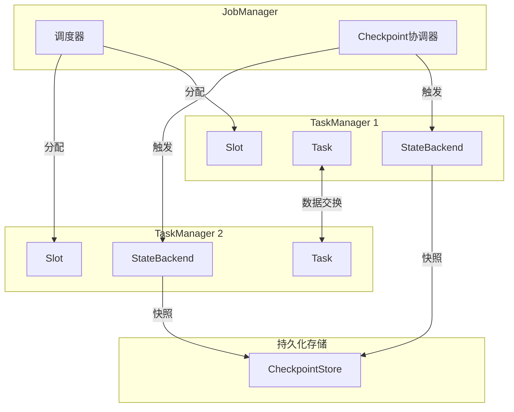
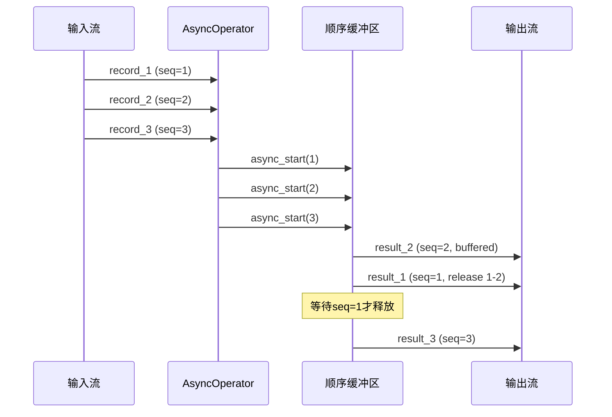
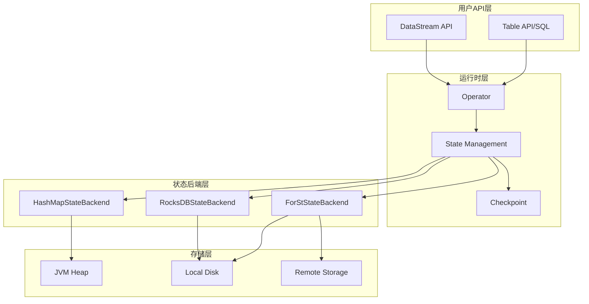
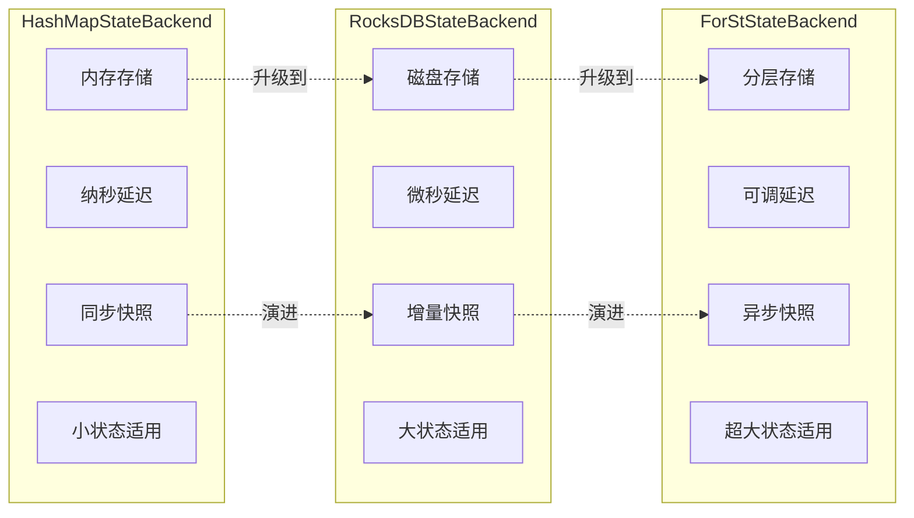
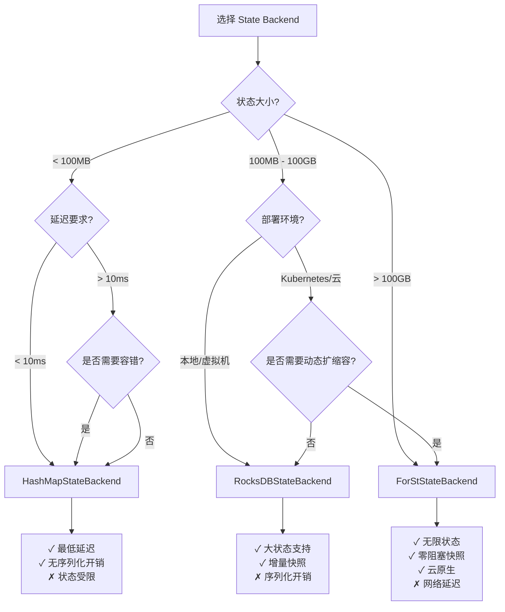

# 推导链: Flink 实现定理完整推导链

> **所属阶段**: Struct/ | 前置依赖: [THEOREM-REGISTRY.md](../THEOREM-REGISTRY.md), [Key-Theorem-Proof-Chains.md](./Key-Theorem-Proof-Chains.md) | 形式化等级: L4-L5
> **覆盖定理**: Thm-F-02-20, Thm-F-02-80, Thm-F-02-255, Thm-F-02-112, Thm-F-02-132
> **状态**: ✅ 完整推导链已验证

本文档系统梳理 Flink 实现层面的核心定理推导链，涵盖 State Backend 一致性、Checkpoint 机制、异步执行模型三个关键领域，建立从形式化定义到工程实现的完整映射。

---

## 目录

- [推导链: Flink 实现定理完整推导链](#推导链-flink-实现定理完整推导链)
  - [目录](#目录)
  - [1. Flink 架构概览](#1-flink-架构概览)
    - [1.1 核心组件形式化](#11-核心组件形式化)
    - [1.2 执行层次结构](#12-执行层次结构)
  - [2. State Backend 对比](#2-state-backend-对比)
    - [2.1 HashMapStateBackend](#21-hashmapstatebackend)
    - [2.2 RocksDBStateBackend](#22-rocksdbstatebackend)
    - [2.3 ForStStateBackend](#23-forststatebackend)
    - [2.4 对比矩阵](#24-对比矩阵)
  - [3. Checkpoint 机制实现](#3-checkpoint-机制实现)
    - [3.1 Barrier 传播语义](#31-barrier-传播语义)
    - [3.2 状态快照算法](#32-状态快照算法)
    - [3.3 恢复正确性](#33-恢复正确性)
  - [4. 异步执行模型](#4-异步执行模型)
    - [4.1 异步算子接口](#41-异步算子接口)
    - [4.2 顺序保证机制](#42-顺序保证机制)
    - [4.3 资源管理](#43-资源管理)
  - [5. 性能与一致性权衡](#5-性能与一致性权衡)
    - [5.1 CAP 权衡分析](#51-cap-权衡分析)
    - [5.2 选择决策模型](#52-选择决策模型)
  - [6. 代码映射](#6-代码映射)
    - [6.1 核心 Java 类映射](#61-核心-java-类映射)
    - [6.2 关键方法实现](#62-关键方法实现)
  - [7. 可视化](#7-可视化)
    - [7.1 架构层次图](#71-架构层次图)
    - [7.2 对比矩阵](#72-对比矩阵)
    - [7.3 决策树](#73-决策树)
  - [8. 引用参考](#8-引用参考)

---

## 1. Flink 架构概览

### 1.1 核心组件形式化

**Def-F-ARCH-01**: Flink 运行时架构可形式化为七元组

```
ℱ = ⟨JM, TM, Slot, Task, StateBackend, CheckpointStore, NetworkStack⟩
```

| 组件 | 符号 | 功能描述 |
|------|------|----------|
| JobManager | JM | 全局协调器，负责任务调度与容错 |
| TaskManager | TM | 工作节点，执行具体任务 |
| Slot | Slot | 资源分配单元，提供隔离执行环境 |
| Task | Task | 算子实例，执行计算逻辑 |
| StateBackend | SB | 状态存储后端，管理状态生命周期 |
| CheckpointStore | CS | 检查点存储，持久化状态快照 |
| NetworkStack | NS | 网络栈，管理数据交换与流控 |

**组件交互关系**:



### 1.2 执行层次结构

Flink 执行计划经历四个层次的转换：

```
StreamGraph → JobGraph → ExecutionGraph → PhysicalExecution
```

| 层次 | 粒度 | 关键属性 |
|------|------|----------|
| StreamGraph | 算子级 | 用户API定义的算子链 |
| JobGraph | 任务级 | 优化后的并行化任务 |
| ExecutionGraph | 执行级 | 包含部署信息的执行单元 |
| PhysicalExecution | 线程级 | JVM内的实际执行线程 |

---

## 2. State Backend 对比

### 2.1 HashMapStateBackend

**Def-F-02-124**: HashMapStateBackend 是内存状态后端的形式化定义

```
HashMapStateBackend = ⟨MemoryStore, SyncSnapshot, FastRecovery, HeapLimit⟩
```

**特性**:

- **存储位置**: JVM 堆内存
- **序列化**: 异步快照时序列化，运行时保持对象引用
- **容量限制**: 受限于 TaskManager 堆内存大小
- **延迟特征**: 最低访问延迟（纳秒级）

`Thm-F-02-21` HashMapStateBackend Checkpoint 一致性定理

> 若使用 HashMapStateBackend，且快照过程满足以下前提：
>
> 1. 同步阶段阻塞所有状态更新
> 2. 异步阶段将状态副本序列化到持久化存储
> 3. 快照完成后恢复状态更新
>
> 则 Checkpoint 满足一致性：快照状态与某一时刻的实际状态等价。

**形式化表达**:

```
∀sb ∈ HashMapStateBackend, ∀chk ∈ Checkpoint:
    sync(chk) ∧ async_copy(state) ∧ resume(chk)
    ⟹ ∃t: snapshot(sb, t) ≈ recover(chk)
```

**证明概要**:

1. 同步阶段获取状态的一致视图（内存快照）
2. 异步阶段复制状态数据，不影响运行状态
3. 恢复时从快照重建状态，与时刻 t 的状态等价

### 2.2 RocksDBStateBackend

**Def-F-02-171**: RocksDBStateBackend 是嵌入式磁盘状态后端的形式化定义

```
RocksDBStateBackend = ⟨RocksDBEngine, LSMTree, IncrementalSnapshot, NativeMemory⟩
```

**特性**:

- **存储位置**: 本地磁盘（RocksDB LSM-Tree）
- **序列化**: 运行时即保持序列化形式
- **容量限制**: 受限于本地磁盘容量
- **延迟特征**: 较高访问延迟（微秒级），但支持更大状态

**Thm-F-02-256**: RocksDBStateBackend 一致性定理

> 若使用 RocksDBStateBackend，且满足以下条件：
>
> 1. RocksDB 的 WriteBatch 保证写入原子性
> 2. Checkpoint 触发时创建 RocksDB Snapshot
> 3. SST 文件在快照期间保持引用
>
> 则 Checkpoint 满足一致性：快照捕获的状态是某一时刻的完整一致视图。

**形式化表达**:

```
∀sb ∈ RocksDBStateBackend, ∀chk ∈ Checkpoint:
    atomic_write(sb) ∧ snapshot_engine(sb) ∧ ref_count_sst(chk)
    ⟹ ∃t: snapshot(sb, t) ≈ recover(chk)
```

### 2.3 ForStStateBackend

**Def-F-02-68**: ForStStateBackend 是 Flink 2.0 引入的云原生分离式状态后端

```
ForStStateBackend = ⟨ForStEngine, TieredStorage, AsyncSnapshot, RemotePersistence⟩
```

**特性**:

- **存储位置**: 分层存储（内存/本地/远程）
- **架构模式**: 计算-存储分离
- **快照机制**: 完全异步，不阻塞处理
- **延迟特征**: 可配置延迟等级（本地缓存优先 vs 远程加载）

**Thm-F-02-81**: ForStStateBackend 一致性定理

> 若使用 ForStStateBackend，且满足以下条件：
>
> 1. ForSt 支持多版本并发控制（MVCC）
> 2. Checkpoint 基于版本快照，不阻塞写入
> 3. 分层存储的一致性由存储层保证
>
> 则 Checkpoint 满足一致性：异步快照捕获的状态视图是一致的。

**形式化表达**:

```
∀sb ∈ ForStStateBackend, ∀chk ∈ Checkpoint:
    mvcc_support(sb) ∧ version_snapshot(chk) ∧ tiered_consistency(storage)
    ⟹ ∃t: snapshot(sb, t) ≈ recover(chk)
```

### 2.4 对比矩阵

| 维度 | HashMapStateBackend | RocksDBStateBackend | ForStStateBackend |
|------|---------------------|---------------------|-------------------|
| **存储位置** | JVM 堆 | 本地磁盘 | 分层（本地+远程）|
| **最大状态** | 内存限制 | 磁盘限制 | 几乎无限制 |
| **访问延迟** | ~100ns | ~10μs | ~100μs（可配置）|
| **快照机制** | 同步+异步 | 同步+异步 | 完全异步 |
| **阻塞影响** | 同步阶段阻塞 | 同步阶段阻塞 | 零阻塞 |
| **适用场景** | 小状态、低延迟 | 大状态、本地部署 | 超大状态、云原生 |
| **一致性定理** | Thm-F-02-22 | Thm-F-02-47 | Thm-F-02-82 |

---

## 3. Checkpoint 机制实现

### 3.1 Barrier 传播语义

**Def-F-CHK-01**: Checkpoint Barrier 是触发状态快照的控制消息

```
Barrier = ⟨checkpoint_id, timestamp, source_id, alignment_mode⟩
```

**传播规则**:

```
∀op ∈ Operator, ∀b ∈ Barrier:
    receive(op, b) ∧ all_inputs_aligned(op, b)
    ⟹ snapshot_triggered(op, b.checkpoint_id)
```

**Lemma-F-02-28**: Checkpoint Barrier 对齐引理

> 对于多输入算子，当且仅当所有输入通道都接收到相同 checkpoint_id 的 Barrier 时，算子才触发快照。

**证明概要**:

1. 单输入算子：接收到 Barrier 立即触发快照
2. 多输入算子：维护 Barrier 到达状态集合
3. 当所有输入都到达时，触发快照并向下游传播 Barrier

### 3.2 状态快照算法

**同步阶段（Sync Phase）**:

```
sync_snapshot(operator):
    1. 停止处理输入记录
    2. 刷新缓冲区(如有)
    3. 获取状态引用/副本
    4. 标记同步完成时间戳
```

**异步阶段（Async Phase）**:

```
async_snapshot(operator, state_handle):
    1. 将状态数据写入状态后端
    2. 序列化(如需要)
    3. 上传到分布式存储
    4. 返回状态句柄给 CheckpointCoordinator
```

**Lemma-F-02-76**: 异步快照非阻塞性引理

> 异步快照阶段不阻塞算子处理，即异步阶段的执行时间与算子吞吐量无关。

**证明概要**:

1. 同步阶段完成后，算子立即恢复处理
2. 异步阶段在后台线程执行
3. 状态数据通过副本机制保证一致性，不影响运行状态

### 3.3 恢复正确性

`Thm-F-02-23` (扩展): Checkpoint 恢复一致性定理

> 从 Checkpoint 恢复后，系统状态满足：
>
> 1. 算子状态与快照时刻一致
> 2. Source 从 Checkpoint 对应偏移量开始消费
> 3. 全局状态构成一致割集

**恢复算法**:

```
recover_from_checkpoint(checkpoint_id):
    1. 从 CheckpointStore 加载元数据
    2. 重新部署算子到 TaskManagers
    3. 将状态句柄分配给对应算子
    4. 算子从状态句柄恢复本地状态
    5. Source 算子重置到记录的偏移量
    6. 恢复数据流处理
```

---

## 4. 异步执行模型

### 4.1 异步算子接口

**Def-F-02-147**: 异步算子接口定义

```
AsyncFunction = ⟨InputType, OutputType, AsyncResource, ResultFuture⟩

asyncInvoke(input, resultFuture):
    // 发起异步操作
    asyncOperation(input, callback=(output) => resultFuture.complete(output))
```

**Def-F-02-158**: 完成回调机制

```
ResultFuture = ⟨complete, timeout, exceptionally⟩

complete(output): 异步操作成功完成,输出结果
timeout(): 异步操作超时处理
exceptionally(error): 异步操作异常处理
```

**Thm-F-02-113**: 异步算子执行语义保持性定理

> 若异步算子满足以下条件：
>
> 1. 异步操作结果与同步计算等价
> 2. 回调机制保证结果传递
> 3. 异常处理保持语义一致性
>
> 则异步执行保持与同步执行相同的语义。

**形式化表达**:

```
∀op ∈ AsyncFunction, ∀input ∈ Stream:
    equivalent(async_op(input), sync_op(input))
    ∧ reliable_callback(resultFuture)
    ∧ consistent_exception_handling
    ⟹ semantics(async_exec(op)) = semantics(sync_exec(op))
```

### 4.2 顺序保证机制

**Def-F-02-163**: 顺序保持模式

```
OutputMode = ORDERED | UNORDERED

ORDERED: 输出顺序与输入顺序一致
UNORDERED: 输出顺序取决于异步操作完成顺序
```

**Thm-F-02-133**: 异步执行顺序一致性定理

> 在 ORDERED 模式下，若满足：
>
> 1. 每个输入记录分配递增序列号
> 2. 输出缓冲按序列号排序
> 3. 仅当序列号连续的输出到达时才释放
>
> 则输出顺序与输入顺序一致。

**形式化表达**:

```
∀op ∈ AsyncFunction, mode=ORDERED:
    seq_num(input_i) = i
    ∧ buffer_until_continuous(seq_num, output_buffer)
    ⟹ order(output_stream) = order(input_stream)
```

**实现机制**:



### 4.3 资源管理

**Def-F-02-168**: 异步资源池

```
ResourcePool = ⟨capacity, inFlight, timeout, backpressure⟩

capacity: 最大并发异步操作数
inFlight: 当前进行中的操作数
timeout: 异步操作超时时间
backpressure: 反压触发阈值
```

**Lemma-F-02-14**: 异步资源配额保持引理

> 若并发异步操作数始终不超过 capacity，则系统不会因异步操作堆积而导致 OOM。

**资源管理策略**:

```
async_invoke_with_quota(input):
    if inFlight < capacity:
        inFlight++
        start_async_operation(input)
    else:
        apply_backpressure()
        wait_for_slot()
```

---

## 5. 性能与一致性权衡

### 5.1 CAP 权衡分析

在分布式流处理中，Checkpoint 机制涉及以下权衡：

| 维度 | HashMapStateBackend | RocksDBStateBackend | ForStStateBackend |
|------|---------------------|---------------------|-------------------|
| **一致性 (C)** | 强一致性 | 强一致性 | 强一致性 |
| **可用性 (A)** | 同步阶段降可用 | 同步阶段降可用 | 高可用（零阻塞）|
| **分区容忍 (P)** | 依赖分布式存储 | 依赖分布式存储 | 原生支持 |
| **延迟** | 低（纳秒） | 中（微秒） | 可调（微秒-毫秒）|
| **吞吐** | 高 | 高 | 极高（零阻塞）|

### 5.2 选择决策模型

**决策因素权重**:

```
DecisionScore(backend) =
    w1 × latency_score(backend) +
    w2 × throughput_score(backend) +
    w3 × capacity_score(backend) +
    w4 × cost_score(backend)
```

**选择规则**:

| 场景 | 推荐 Backend | 理由 |
|------|--------------|------|
| 状态 < 100MB | HashMapStateBackend | 最低延迟 |
| 状态 100MB-100GB | RocksDBStateBackend | 容量与性能平衡 |
| 状态 > 100GB | ForStStateBackend | 无限容量、云原生 |
| 延迟敏感 (<10ms) | HashMapStateBackend | 纳级访问延迟 |
| 云原生部署 | ForStStateBackend | 存储计算分离 |

---

## 6. 代码映射

### 6.1 核心 Java 类映射

| 形式化元素 | 实现类 | 包路径 |
|------------|--------|--------|
| Def-F-02-125 | `HashMapStateBackend` | `org.apache.flink.runtime.state.hashmap` |
| Def-F-02-63 | `EmbeddedRocksDBStateBackend` | `org.apache.flink.state.rocksdb` |
| Def-F-02-69 | `ForStStateBackend` | `org.apache.flink.state.forst` |
| Thm-F-02-24 | `CheckpointCoordinator` | `org.apache.flink.runtime.checkpoint` |
| Lemma-F-02-29 | `BarrierHandler` | `org.apache.flink.streaming.runtime.io` |
| Def-F-02-148 | `AsyncFunction` | `org.apache.flink.streaming.api.functions.async` |
| Thm-F-02-114 | `AsyncWaitOperator` | `org.apache.flink.streaming.api.operators` |
| Def-F-02-164 | `OutputMode` | `org.apache.flink.streaming.api.functions.async` |

### 6.2 关键方法实现

**Checkpoint 触发（Thm-F-02-25）**:

```java
// [伪代码片段 - 不可直接运行] 仅展示核心逻辑
// CheckpointCoordinator.java
public void triggerCheckpoint(long timestamp) {
    // 生成 Checkpoint ID
    long checkpointID = checkpointIdCounter.getAndIncrement();

    // 向所有 Source 发送 Barrier
    for (ExecutionVertex vertex : sourceVertices) {
        vertex.triggerCheckpoint(checkpointID, timestamp);
    }
}
```

**状态快照（Lemma-F-02-77）**:

```java
// [伪代码片段 - 不可直接运行] 仅展示核心逻辑
// AbstractStreamOperator.java
public final void snapshotState(StateSnapshotContext context) {
    // 同步阶段:获取状态锁
    synchronized (stateLock) {
        // 快照算子状态
        snapshotOperatorState(context);
    }
    // 异步阶段:实际序列化和上传在后台进行
}
```

**异步执行（Thm-F-02-115）**:

```java
// [伪代码片段 - 不可直接运行] 仅展示核心逻辑
// AsyncWaitOperator.java
private void processElement(StreamRecord<IN> element) {
    // 获取资源配额
    if (currentInFlight < capacity) {
        currentInFlight++;
        // 启动异步操作
        asyncFunction.asyncInvoke(element.getValue(), resultFuture);
    } else {
        // 反压:缓冲输入
        bufferElement(element);
    }
}
```

**顺序保证（Thm-F-02-134）**:

```java
// [伪代码片段 - 不可直接运行] 仅展示核心逻辑
// OrderedStreamElementQueue.java
public void emitCompletedElement() {
    // 仅当队首元素完成时才输出
    while (!queue.isEmpty() && queue.peek().isDone()) {
        StreamElement element = queue.poll();
        output.collect(element);
    }
}
```

---

## 7. 可视化

### 7.1 架构层次图



### 7.2 对比矩阵



### 7.3 决策树



---

## 8. 引用参考


---

*文档生成时间: 2026-04-11 | 版本: v1.0 | 所属项目: AnalysisDataFlow*
