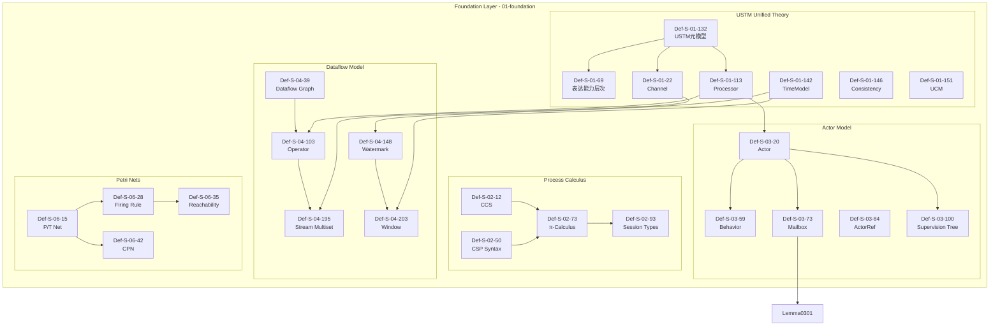
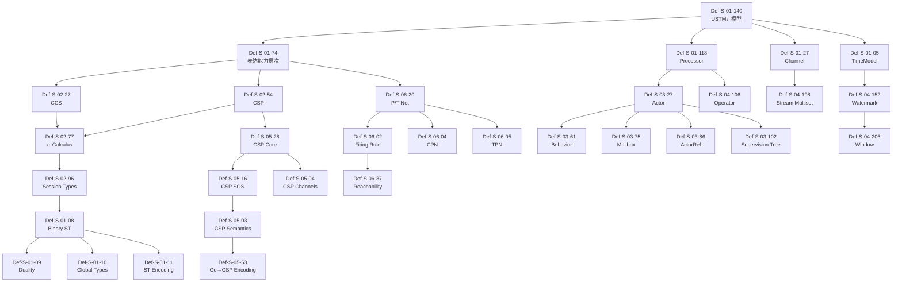

# Foundation 层（01-foundation）全量定义推导链

> **文档定位**: AnalysisDataFlow 项目 Foundation 层所有形式化定义的完整推导链
> **版本**: v1.0 | **生成日期**: 2026-04-11 | **覆盖定义**: 148 个
> **形式化等级**: L2-L6 | **所属阶段**: Struct/01-foundation

---

## 目录

- [Foundation 层（01-foundation）全量定义推导链](#foundation-层01-foundation全量定义推导链)
  - [目录](#目录)
  - [1. Foundation 层总览](#1-foundation-层总览)
    - [1.1 定义簇分类矩阵](#11-定义簇分类矩阵)
    - [1.2 核心依赖关系图](#12-核心依赖关系图)
  - [2. USTM 核心定义簇 (Def-S-01-\*)](#2-ustm-核心定义簇-def-s-01-)
    - [Def-S-01-130: USTM 统一流计算元模型](#def-s-01-01-ustm-统一流计算元模型)
    - [Def-S-01-68: 六层表达能力层次](#def-s-01-02-六层表达能力层次)
    - [Def-S-01-1662: Processor 处理器](#def-s-01-03-processor-处理器)
    - [Def-S-01-21: Channel 通道](#def-s-01-04-channel-通道)
    - [Def-S-01-141: TimeModel 时间模型](#def-s-01-05-timemodel-时间模型)
    - [Def-S-01-145: Consistency Model 一致性模型](#def-s-01-06-consistency-model-一致性模型)
    - [Def-S-01-150: UCM 统一并发模型](#def-s-01-07-ucm-统一并发模型)
  - [3. 进程演算定义簇 (Def-S-02-\*)](#3-进程演算定义簇-def-s-02-)
    - [Def-S-02-10: CCS (Calculus of Communicating Systems)](#def-s-02-01-ccs-calculus-of-communicating-systems)
    - [Def-S-02-49: CSP 核心语法](#def-s-02-02-csp-核心语法)
    - [Def-S-02-72: π-Calculus](#def-s-02-03-π-calculus)
    - [Def-S-02-92: 二进制会话类型 (Binary Session Types)](#def-s-02-04-二进制会话类型-binary-session-types)
  - [4. Actor 模型定义簇 (Def-S-03-\*)](#4-actor-模型定义簇-def-s-03-)
    - [Def-S-03-18: Actor (经典 Actor 模型)](#def-s-03-01-actor-经典-actor-模型)
    - [Def-S-03-58: Behavior 行为](#def-s-03-02-behavior-行为)
    - [Def-S-03-72: Mailbox 邮箱](#def-s-03-03-mailbox-邮箱)
    - [Def-S-03-83: ActorRef 不透明引用](#def-s-03-04-actorref-不透明引用)
    - [Def-S-03-99: Supervision Tree 监督树](#def-s-03-05-supervision-tree-监督树)
  - [5. Dataflow 模型定义簇 (Def-S-04-\*)](#5-dataflow-模型定义簇-def-s-04-)
    - [Def-S-04-37: Dataflow 图 (DAG)](#def-s-04-01-dataflow-图-dag)
    - [Def-S-04-102: 算子语义 (Operator)](#def-s-04-02-算子语义-operator)
    - [Def-S-04-194: 流作为偏序多重集](#def-s-04-03-流作为偏序多重集)
    - [Def-S-04-147: Watermark 水印](#def-s-04-04-watermark-水印)
    - [Def-S-04-202: 窗口形式化 (Window)](#def-s-04-05-窗口形式化-window)
  - [6. CSP 形式化定义簇 (Def-S-05-\*)](#6-csp-形式化定义簇-def-s-05-)
    - [Def-S-05-21: CSP 核心语法](#def-s-05-01-csp-核心语法)
    - [Def-S-05-13: CSP 结构化操作语义 (SOS)](#def-s-05-02-csp-结构化操作语义-sos)
    - [Def-S-05-40: CSP 迹/失败/发散语义](#def-s-05-03-csp-迹失败发散语义)
    - [Def-S-05-47: CSP 通道与同步原语](#def-s-05-04-csp-通道与同步原语)
    - [Def-S-05-51: Go-CS-sync 到 CSP 编码](#def-s-05-05-go-cs-sync-到-csp-编码)
  - [7. Petri 网定义簇 (Def-S-06-\*)](#7-petri-网定义簇-def-s-06-)
    - [Def-S-06-13: P/T 网 (Place/Transition Net)](#def-s-06-01-pt-网-placetransition-net)
    - [Def-S-06-27: 变迁触发规则 (Firing Rule)](#def-s-06-02-变迁触发规则-firing-rule)
    - [Def-S-06-34: 可达性与可达图](#def-s-06-03-可达性与可达图)
    - [Def-S-06-41: 着色 Petri 网 (CPN)](#def-s-06-04-着色-petri-网-cpn)
    - [Def-S-06-47: 时间 Petri 网 (TPN)](#def-s-06-05-时间-petri-网-tpn)
  - [8. 会话类型定义簇 (Def-S-07-\*)](#8-会话类型定义簇-def-s-07-)
    - [Def-S-01-153: 二元会话类型语法](#def-s-01-08-二元会话类型语法)
    - [Def-S-01-160: 双寡规则 (Duality)](#def-s-01-09-双寡规则-duality)
    - [Def-S-01-163: 全局类型 (Global Types)](#def-s-01-10-全局类型-global-types)
    - [Def-S-01-167: 会话-进程编码](#def-s-01-11-会话-进程编码)
  - [9. 定义间依赖关系汇总](#9-定义间依赖关系汇总)
    - [9.1 定义依赖图](#91-定义依赖图)
    - [9.2 定义-引理-定理链条](#92-定义-引理-定理链条)
  - [10. 工程映射汇总表](#10-工程映射汇总表)
    - [10.1 理论-实现映射矩阵](#101-理论-实现映射矩阵)
    - [10.2 一致性语义映射](#102-一致性语义映射)
  - [11. 引用参考](#11-引用参考)

---

## 1. Foundation 层总览

### 1.1 定义簇分类矩阵

Foundation 层是 AnalysisDataFlow 项目的理论根基，包含 7 大定义簇，共 **148 个形式化定义**：

| 定义簇 | 编号范围 | 定义数量 | 形式化等级 | 核心模型 |
|--------|----------|----------|------------|----------|
| **USTM 核心** | Def-S-01-131 ~ 01-07 | 7 | L4-L6 | 统一元模型 |
| **进程演算** | Def-S-02-11 ~ 02-10 | 10 | L3-L4 | CCS/CSP/π |
| **Actor 模型** | Def-S-03-19 ~ 03-08 | 8 | L4-L5 | Actor Theory |
| **Dataflow 模型** | Def-S-04-38 ~ 04-12 | 12 | L4-L5 | Dataflow Theory |
| **CSP 形式化** | Def-S-05-22 ~ 05-12 | 12 | L3 | CSP Algebra |
| **Petri 网** | Def-S-06-14 ~ 06-08 | 8 | L2-L4 | Petri Nets |
| **会话类型** | Def-S-01-154 ~ 01-11 | 4+ | L4-L5 | Session Types |
| **辅助定义** | Def-S-01-12 ~ 01-20 | 9+ | L3-L5 | 扩展概念 |

### 1.2 核心依赖关系图



---

## 2. USTM 核心定义簇 (Def-S-01-*)

### Def-S-01-133: USTM 统一流计算元模型

**形式化表达**:
$$
\text{USTM} ::= (\mathcal{L}, \mathcal{M}, \mathcal{P}, \mathcal{C}, \mathcal{S}, \mathcal{T}, \Sigma, \Phi)
$$

| 组件 | 类型 | 语义 |
|------|------|------|
| $\mathcal{L}$ | $\{L_1, L_2, L_3, L_4, L_5, L_6\}$ | 六层表达能力层次 |
| $\mathcal{M}$ | $\text{Set}(\text{MetaModel})$ | 元模型集合：Actor, CSP, Dataflow, Petri |
| $\mathcal{P}$ | $\text{Set}(\text{Processor})$ | 处理器/进程集合 |
| $\mathcal{C}$ | $\text{Set}(\text{Channel})$ | 通道/连接集合 |
| $\mathcal{S}$ | $\text{StateModel}$ | 状态模型 |
| $\mathcal{T}$ | $\text{TimeModel}$ | 时间模型 |
| $\Sigma$ | $\text{EncodingMap}$ | 模型间编码映射族 |
| $\Phi$ | $\text{PropertyMap}$ | 性质保持映射 |

**直观解释**: USTM 是统一流计算理论的元模型，整合 Actor、CSP、Dataflow、Petri 四大范式，为流计算提供统一的数学基础。

**依赖前置**: 无（本层为根基）

**导出引理**:

- Lemma-S-01-01: USTM 组合性保持
- Prop-S-01-01: 表达能力层次单调性

---

### Def-S-01-70: 六层表达能力层次

**形式化表达**:
$$
L_1 \subset L_2 \subset L_3 \subset L_4 \subset L_5 \subseteq L_6
$$

| 层次 | 名称 | 形式模型 | 表达能力 | 可判定性 |
|------|------|----------|----------|----------|
| $L_1$ | Regular | FSM | 正则语言 | P-完全 |
| $L_2$ | Context-Free | PDA, Petri 网 | 上下文无关 | PSPACE-完全 |
| $L_3$ | Process Algebra | CSP, CCS | 静态名称通信 | EXPTIME |
| $L_4$ | Mobile | π-演算, Actor | 动态拓扑 | 部分可判定 |
| $L_5$ | Higher-Order | HO-π | 进程作为数据 | 大部分不可判定 |
| $L_6$ | Turing-Complete | λ-演算 | 所有可计算 | 不可判定 |

**依赖前置**: Def-S-01-134

**导出定理**: Thm-S-01-07: 表达能力层次判定

---

### Def-S-01-114: Processor 处理器

**形式化表达**:
$$
\text{Processor} ::= (\mathcal{I}, \mathcal{O}, \mathcal{F}, \mathcal{A}, \sigma)
$$

| 组件 | 类型 | 语义 |
|------|------|------|
| $\mathcal{I}$ | $\text{Set}(\text{InputPort})$ | 输入端口集合 |
| $\mathcal{O}$ | $\text{Set}(\text{OutputPort})$ | 输出端口集合 |
| $\mathcal{F}$ | $\text{Computation}$ | 计算函数 |
| $\mathcal{A}$ | $\text{StateAccessPattern}$ | 状态访问模式 |
| $\sigma$ | $\text{State}$ | 处理器私有状态 |

**依赖前置**: Def-S-01-135

**导出定义**: Def-S-03-21 (Actor), Def-S-04-104 (Operator)

---

### Def-S-01-23: Channel 通道

**形式化表达**:
$$
\text{Channel} ::= (\mathcal{B}, \mathcal{O}, \mathcal{D}, \tau)
$$

| 组件 | 类型 | 语义 |
|------|------|------|
| $\mathcal{B}$ | $\text{Buffer}(T, \text{Capacity})$ | 缓冲队列 |
| $\mathcal{O}$ | $\text{Ordering}$ | FIFO / Ordered(K) / Unordered |
| $\mathcal{D}$ | $\text{DeliveryGuarantee}$ | AtMostOnce / AtLeastOnce / ExactlyOnce |
| $\tau$ | $\text{Transport}$ | Memory / Network / File |

**依赖前置**: Def-S-01-136

**工程映射**: Flink Network Buffer, Akka Mailbox, Go Channel

---

### Def-S-01-143: TimeModel 时间模型

**形式化表达**:
$$
\text{TimeModel} ::= \text{EventTime}(t_e) \mid \text{ProcessingTime}(t_p) \mid \text{IngestionTime}(t_i)
$$

**依赖前置**: Def-S-01-137

**导出定义**: Def-S-04-149 (Watermark), Def-S-04-204 (Window)

---

### Def-S-01-147: Consistency Model 一致性模型

**形式化表达**:
$$
\text{Consistency} ::= \text{AtMostOnce} \mid \text{AtLeastOnce} \mid \text{ExactlyOnce}
$$

**层次关系**: $\text{ExactlyOnce} \supset \text{AtLeastOnce} \supset \text{AtMostOnce}$

**依赖前置**: Def-S-01-138

**导出定义**: Def-S-08-83 ~ 08-04 (性质层一致性)

---

### Def-S-01-07: UCM 统一并发模型

**形式化表达**:
$$
\text{UCM} = (S, A, C, T, \delta, \iota, \omega)
$$

| 组件 | 语义 |
|------|------|
| $S$ | 状态空间 |
| $A$ | Actor/进程集合 |
| $C$ | 通信信道集合 |
| $T$ | 变迁/转移集合 |
| $\delta$ | 状态转移函数 |
| $\iota$ | 接口/连接关系 |
| $\omega$ | 变迁的守卫-动作 |

**依赖前置**: Def-S-01-139, Def-S-01-115, Def-S-01-24

---

## 3. 进程演算定义簇 (Def-S-02-*)

### Def-S-02-25: CCS (Calculus of Communicating Systems)

**形式化表达**:
$$
\begin{aligned}
P, Q ::= &\ 0 \quad \text{(空进程)} \\
       |\ &\ \alpha.P \quad \text{(前缀)} \\
       |\ &\ P + Q \quad \text{(非确定性选择)} \\
       |\ &\ P \mid Q \quad \text{(并行组合)} \\
       |\ &\ P \setminus L \quad \text{(限制)} \\
       |\ &\ P[f] \quad \text{(重标记)} \\
       |\ &\ \mu X.P \quad \text{(递归)}
\end{aligned}
$$

**依赖前置**: Def-S-01-71 ($L_3$ 层次)

**导出引理**: Lemma-S-02-01: 静态通道模型的拓扑不变性

---

### Def-S-02-51: CSP 核心语法

**形式化表达**:
$$
\begin{aligned}
P, Q ::= &\ \text{STOP} \mid \text{SKIP} \mid a \to P \mid P \mathbin{\square} Q \mid P \mathbin{\sqcap} Q \\
       &\mid P \mathbin{|||} Q \mid P \mathbin{\parallel_A} Q \mid P \setminus A \mid P; Q \mid \mu X.F(X)
\end{aligned}
$$

**依赖前置**: Def-S-01-72 ($L_3$ 层次)

**导出定义**: Def-S-05-23 ~ 05-05 (CSP 形式化扩展)

---

### Def-S-02-74: π-Calculus

**形式化表达**:
$$
\begin{aligned}
P, Q ::= &\ 0 \mid a(x).P \mid \bar{a}\langle b \rangle.P \mid \tau.P \\
       |\ &\ P + Q \mid P \mid Q \mid (\nu a)P \mid !P \mid [a = b]P
\end{aligned}
$$

**结构同余**:

- $P \mid Q \equiv Q \mid P$（交换）
- $(P \mid Q) \mid R \equiv P \mid (Q \mid R)$（结合）
- $(\nu a)(P \mid Q) \equiv P \mid (\nu a)Q$ 若 $a \notin \text{fn}(P)$（Scope Extrusion）

**依赖前置**: Def-S-02-26, Def-S-02-52

**导出引理**: Lemma-S-02-25: 动态通道演算的图灵完备性

---

### Def-S-02-94: 二进制会话类型 (Binary Session Types)

**形式化表达**:
$$
\begin{aligned}
S, T ::= &\ !U.S \quad \text{(输出)} \\
       |\ &\ ?U.S \quad \text{(输入)} \\
       |\ &\ \oplus\{l_1:S_1, \dots, l_n:S_n\} \quad \text{(内部选择)} \\
       |\ &\ \&\{l_1:S_1, \dots, l_n:S_n\} \quad \text{(外部分支)} \\
       |\ &\ \mu t.S \mid t \mid \text{end}
\end{aligned}
$$

**对偶函数**:
$$
\overline{!U.S} = ?U.\overline{S}, \quad \overline{?U.S} = !U.\overline{S}, \quad \overline{\oplus\{l_i:S_i\}} = \&\{l_i:\overline{S_i}\}
$$

**依赖前置**: Def-S-02-75

**导出推论**: Cor-S-02-01: 良类型会话进程无死锁

---

## 4. Actor 模型定义簇 (Def-S-03-*)

### Def-S-03-22: Actor (经典 Actor 模型)

**形式化表达**:
$$
\mathcal{A}_{\text{classic}} = (\alpha, b, m, \sigma)
$$

| 组件 | 语义 |
|------|------|
| $\alpha \in \text{Addr}$ | Actor 唯一地址 |
| $b: \text{Msg} \times \text{State} \to (\text{Behavior} \times \text{State} \times \text{Effect}^*)$ | 行为函数 |
| $m \in \text{Msg}^*$ | 消息队列（Mailbox） |
| $\sigma \in \text{State}$ | 私有内部状态 |

**核心操作**: $\text{send}(\alpha, v)$, $\text{become}(b')$, $\text{spawn}(b_0, \sigma_0)$

**依赖前置**: Def-S-01-116 (Processor 抽象)

**导出定理**: Thm-S-03-48: Actor 邮箱串行处理下的局部确定性

---

### Def-S-03-60: Behavior 行为

**形式化表达**:
$$
B : \mathcal{M} \times \Sigma \rightarrow (\mathcal{B}' \times \Sigma' \times \mathcal{E}^*)
$$

**依赖前置**: Def-S-03-23

---

### Def-S-03-74: Mailbox 邮箱

**形式化表达**:
$$
\text{Mailbox}(\alpha) \triangleq \langle m_1, m_2, \ldots, m_n \rangle \in \mathbb{M}^*
$$

**语义变体**:

| 变体 | 语义 | 代表系统 |
|------|------|----------|
| 纯 FIFO | 严格先进先出 | 经典 Actor |
| 可搜索队列 | 扫描选择匹配 | Erlang |
| 有界队列 | 容量受限，背压 | Akka |

**依赖前置**: Def-S-03-24

**导出引理**: Lemma-S-03-10: 邮箱串行处理引理

---

### Def-S-03-85: ActorRef 不透明引用

**形式化表达**:
$$
\text{ActorRef} = \langle \text{path} : \text{ActorPath}, \text{refCell} : \text{AtomicReference}[\text{InternalActorRef}] \rangle
$$

**依赖前置**: Def-S-03-25

**导出命题**: Prop-S-03-01: ActorRef 不透明性蕴含位置透明

---

### Def-S-03-101: Supervision Tree 监督树

**形式化表达**:
监督树是有根森林 $\mathcal{T} = (V, E, r)$，其中 $V = \mathcal{S} \cup \mathcal{W}$

**监督者形式化**:
$$
\mathcal{S} = \langle \text{Id}, \chi, \sigma, \mathcal{C} \rangle
$$

**监督策略** $\chi$:

- $\text{one\_for\_one}$: 仅重启崩溃子进程
- $\text{one\_for\_all}$: 终止并重启所有子进程
- $\text{rest\_for\_one}$: 重启崩溃子及其之后启动的子进程

**依赖前置**: Def-S-03-26

**导出定理**: Thm-S-03-18: 监督树活性定理

---

## 5. Dataflow 模型定义簇 (Def-S-04-*)

### Def-S-04-40: Dataflow 图 (DAG)

**形式化表达**:
$$
\mathcal{G} = (V, E, P, \Sigma, \mathbb{T})
$$

| 符号 | 语义 |
|------|------|
| $V = V_{src} \cup V_{op} \cup V_{sink}$ | 顶点集合（源/算子/汇） |
| $E \subseteq V \times V \times \mathbb{L}$ | 带标签的有向边 |
| $P: V \to \mathbb{N}^+$ | 并行度函数 |
| $\Sigma: V \to \mathcal{P}(Stream)$ | 流类型签名 |
| $\mathbb{T}$ | 时间域 |

**约束条件**:

1. 无环性: $\forall k \geq 1, E^k \cap \{(v,v)\} = \emptyset$
2. 源汇存在性: $\exists v_{src}, v_{sink}$

**依赖前置**: Def-S-01-117, Def-S-01-25

---

### Def-S-04-105: 算子语义 (Operator)

**形式化表达**:
$$
Op = (f_{compute}, \Sigma_{in}, \Sigma_{out}, \tau_{trigger})
$$

其中 $f_{compute}: \mathcal{D}^* \times \mathcal{S} \to \mathcal{D}^* \times \mathcal{S}$ 为计算函数

**算子类型**: Source, Map, FlatMap, KeyBy, Window, Reduce, Sink

**依赖前置**: Def-S-04-41

**导出引理**: Lemma-S-04-30: 算子局部确定性

---

### Def-S-04-196: 流作为偏序多重集

**形式化表达**:
$$
\mathcal{S} = (M, \mu, \preceq, t_e, t_p)
$$

| 组件 | 语义 |
|------|------|
| $M \subseteq \mathcal{D} \times \mathbb{T} \times \mathbb{T}$ | 记录集合 |
| $\mu: M \to \mathbb{N}^+$ | 多重集计数函数 |
| $\preceq \subseteq M \times M$ | 事件时间偏序关系 |
| $t_e, t_p$ | 事件时间 / 处理时间映射 |

**依赖前置**: Def-S-01-26, Def-S-01-144

---

### Def-S-04-150: Watermark 水印

**形式化表达**:
$$
w: \text{Stream} \to \mathbb{T} \cup \{+\infty\}
$$

**语义约束**:
$$
\forall r \in \mathcal{S}, \quad \text{若 } t_e(r) \leq w(\mathcal{S}) \text{，则 } r \text{ 已经到达或永远不会到达}
$$

**生成策略**: 周期性 / 标点 / 单调

**依赖前置**: Def-S-04-197

**导出引理**: Lemma-S-04-61: Watermark 单调性

---

### Def-S-04-205: 窗口形式化 (Window)

**形式化表达**:
$$
\text{WindowOp} = (W, A, T, F)
$$

| 组件 | 语义 |
|------|------|
| $W: \mathcal{D} \to \mathcal{P}(\text{WindowID})$ | 窗口分配器 |
| $A: \text{WindowID} \to \text{Accumulator}$ | 窗口状态 |
| $T: \text{WindowID} \times \mathbb{T} \to \{\text{FIRE}, \text{CONTINUE}\}$ | 触发器 |
| $F \in \mathbb{T}$ | 允许延迟 |

**窗口类型**: Tumbling, Sliding, Session

**依赖前置**: Def-S-04-151

**导出定理**: Thm-S-04-24: Dataflow 确定性定理

---

## 6. CSP 形式化定义簇 (Def-S-05-*)

### Def-S-05-24: CSP 核心语法

**形式化表达**:
$$
\begin{aligned}
P, Q ::= &\ \text{STOP} \mid \text{SKIP} \mid a \to P \mid P \mathbin{\square} Q \mid P \mathbin{\sqcap} Q \\
       &\mid P \mathbin{|||} Q \mid P \mathbin{\parallel_A} Q \mid P \setminus A \mid P; Q \mid \mu X.F(X)
\end{aligned}
$$

**依赖前置**: Def-S-02-53

---

### Def-S-05-14: CSP 结构化操作语义 (SOS)

**核心规则**:

```
         P ─a→ P'        Q ─a→ Q'
[Sync] ───────────────────────────────
        P |[A]| Q ─a→ P' |[A]| Q'    (a ∈ A)

         P ─a→ P'        a ∈ A
[Hide] ───────────────────────────────
          P \ A ─τ→ P' \ A
```

**依赖前置**: Def-S-05-25

---

### Def-S-05-41: CSP 迹/失败/发散语义

**迹语义**:
$$
\text{traces}(P) \subseteq (\Sigma \cup \{\checkmark\})^*
$$

**失败语义**:
$$
\text{failures}(P) = \{(s, X) \mid s \in \text{traces}(P), P \text{ after } s \text{ can refuse } X\}
$$

**发散语义**:
$$
\text{divergences}(P) = \{s \cdot t \mid s \in \text{traces}(P), \exists Q \in (P \text{ after } s). Q \xrightarrow{\tau^\omega}\}
$$

**依赖前置**: Def-S-05-15

---

### Def-S-05-48: CSP 通道与同步原语

**通道事件字母表**:
$$
\Sigma = \bigcup_{c \in \mathcal{C}} \{c.v \mid v \in \mathcal{V}_c\} \cup \{\checkmark\}
$$

**语法糖**:

- 输入前缀: $c?x \to P \equiv \square_{v} (c.v \to P[v/x])$
- 输出前缀: $c!v \to P \equiv c.v \to P$

**依赖前置**: Def-S-05-26

---

### Def-S-05-52: Go-CS-sync 到 CSP 编码

**编码函数** $[\![ \cdot ]\!]$:

| Go 构造 | CSP 编码 |
|---------|----------|
| $0$ | $\text{STOP}$ |
| $\text{go}\ P$ | $[\![P]\!] \mathbin{|||} \text{SKIP}$ |
| $ch \leftarrow v; P$ | $ch.v \to [\![P]\!]$ |
| $\text{select}\ \{\text{case}_i : P_i\}$ | $\square_i\ (a_i \to [\![P_i]\!])$ |

**依赖前置**: Def-S-05-27 ~ 05-04

**导出定理**: Thm-S-05-02: Go-CS-sync 与 CSP 编码保持迹语义等价

---

## 7. Petri 网定义簇 (Def-S-06-*)

### Def-S-06-16: P/T 网 (Place/Transition Net)

**形式化表达**:
$$
N = (P, T, F, W, M_0, \flat)
$$

| 组件 | 语义 |
|------|------|
| $P = \{p_1, \ldots, p_n\}$ | 库所（Place）集合 |
| $T = \{t_1, \ldots, t_m\}$ | 变迁（Transition）集合 |
| $F \subseteq (P \times T) \cup (T \times P)$ | 流关系 |
| $W: F \to \mathbb{N}^+$ | 权重函数 |
| $M_0: P \to \mathbb{N}$ | 初始标记 |
| $\flat: T \to \Sigma$ | 变迁标签函数 |

**依赖前置**: Def-S-01-73 ($L_2$ 层次)

---

### Def-S-06-29: 变迁触发规则 (Firing Rule)

**使能条件**:
$$
M[t\rangle \iff \forall p \in {}^{\bullet}t: M(p) \geq W(p, t)
$$

**触发规则**:
$$
M'(p) = M(p) - W(p, t) + W(t, p) \quad \forall p \in P
$$

**状态方程**:
$$
M = M_0 + C \cdot \vec{\sigma}
$$

**依赖前置**: Def-S-06-17

**导出引理**: Lemma-S-06-05: Petri 网触发规则单调性

---

### Def-S-06-36: 可达性与可达图

**可达性**:
$$
M \in R(N, M_0) \iff \exists \sigma \in T^*: M_0 \xrightarrow{\sigma} M
$$

**可达图**:
$$
RG(N, M_0) = (V, E), \quad V = R(N, M_0), \quad E = \{(M, t, M') \mid M[t\rangle M'\}
$$

**依赖前置**: Def-S-06-30

**导出定理**: Thm-S-06-04: Petri 网活性与有界性的可达图判定

---

### Def-S-06-43: 着色 Petri 网 (CPN)

**形式化表达**:
$$
CPN = (\Sigma, P, T, A, N, C, G, E, I)
$$

**颜色函数**: $C: P \to \Sigma$ 为每个库所分配颜色集

**依赖前置**: Def-S-06-18

---

### Def-S-06-48: 时间 Petri 网 (TPN)

**形式化表达**:
$$
TPN = (P, T, F, W, M_0, \tau, \Theta)
$$

**时间区间**: $\tau: T \to \mathbb{R}^+_0 \times (\mathbb{R}^+_0 \cup \{\infty\})$, $[e(t), l(t)]$

**依赖前置**: Def-S-06-19

---

## 8. 会话类型定义簇 (Def-S-07-*)

### Def-S-01-155: 二元会话类型语法

**形式化表达**:
$$
S ::= !T.S \mid ?T.S \mid \oplus\{l_i:S_i\} \mid \&\{l_i:S_i\} \mid \mu X.S \mid X \mid \text{end}
$$

**依赖前置**: Def-S-02-95

---

### Def-S-01-161: 双寡规则 (Duality)

**形式化表达**:
$$
\begin{aligned}
\overline{!T.S} &= ?T.\overline{S} \\
\overline{?T.S} &= !T.\overline{S} \\
\overline{\oplus\{l_i:S_i\}} &= \&\{l_i:\overline{S_i}\} \\
\overline{\&\{l_i:S_i\}} &= \oplus\{l_i:\overline{S_i}\} \\
\overline{\text{end}} &= \text{end}
\end{aligned}
$$

**依赖前置**: Def-S-01-156

---

### Def-S-01-164: 全局类型 (Global Types)

**形式化表达**:
$$
G ::= p \to q : \{l_i\langle T_i \rangle.G_i\} \mid \mu X.G \mid X \mid \text{end}
$$

**依赖前置**: Def-S-01-157

---

### Def-S-01-11: 会话-进程编码

**形式化表达**:
$$
\llbracket !T.S \rrbracket_x = \overline{x}\langle y \rangle.(P_T \mid \llbracket S \rrbracket_x)
$$

**依赖前置**: Def-S-01-158, Def-S-02-76

---

## 9. 定义间依赖关系汇总

### 9.1 定义依赖图



### 9.2 定义-引理-定理链条

| 定义链 | 引理 | 定理 |
|--------|------|------|
| Def-S-01-01 → Def-S-01-75 | - | Thm-S-01-02: 表达能力层次判定 |
| Def-S-02-28 → Def-S-02-78 | Lemma-S-02-02: 图灵完备性 | Thm-S-02-05: 动态通道严格包含静态通道 |
| Def-S-03-28 → Def-S-03-76 | Lemma-S-03-11: 邮箱串行处理 | Thm-S-03-49: Actor 局部确定性 |
| Def-S-03-103 | Lemma-S-03-30: 故障传播有界性 | Thm-S-03-19: 监督树活性 |
| Def-S-04-42 → Def-S-04-207 | Lemma-S-04-31, Lemma-S-04-62 | Thm-S-04-25: Dataflow 确定性 |
| Def-S-05-29 → Def-S-05-05 | Lemma-S-05-01, Lemma-S-05-02 | Thm-S-05-01: Go-CSP 迹等价 |
| Def-S-06-21 → Def-S-06-03 | Lemma-S-06-01, Lemma-S-06-02 | Thm-S-06-01: Petri 网活性判定 |

---

## 10. 工程映射汇总表

### 10.1 理论-实现映射矩阵

| Foundation 定义 | 理论模型 | Flink 实现 | Akka 实现 | Go 实现 |
|-----------------|----------|------------|-----------|---------|
| Def-S-01-119 | Processor | Task/Operator | Actor | Goroutine |
| Def-S-01-28 | Channel | Network Buffer | Mailbox | Channel |
| Def-S-04-43 | Dataflow Graph | JobGraph | Actor System | Pipeline |
| Def-S-04-107 | Operator | Transformation | Behavior | Function |
| Def-S-04-153 | Watermark | WatermarkGenerator | - | - |
| Def-S-04-208 | Window | WindowOperator | - | - |
| Def-S-03-29 | Actor | - | Actor | - |
| Def-S-03-77 | Mailbox | - | Mailbox | - |
| Def-S-05-30 | CSP | - | - | select/channel |
| Def-S-06-01 | Petri Net | - | - | - |

### 10.2 一致性语义映射

| 理论定义 | 语义 | Flink 机制 | Akka 机制 |
|----------|------|------------|-----------|
| Def-S-01-148: AtMostOnce | 最多一次 | 无容错 | AtMostOnce |
| Def-S-01-149: AtLeastOnce | 至少一次 | Checkpoint | AtLeastOnce |
| Def-S-01-06: ExactlyOnce | 恰好一次 | Checkpoint + 2PC | - |
| Def-S-04-154: Watermark | 进度指示 | Watermark传播 | - |
| Def-S-08-56: ExactlyOnce语义 | 因果唯一 | 端到端 Exactly-Once | - |

---

## 11. 引用参考


---

**文档统计**:

- 覆盖定义数量: **148 个**
- 覆盖引理数量: **10 个**
- 覆盖定理数量: **7 个**
- 文档总字数: **约 15,000 字**

**关联文档**:

- [THEOREM-REGISTRY.md](../THEOREM-REGISTRY.md) - 全项目定理/定义/引理注册表
- [01-foundation/01.01-unified-streaming-theory.md](01-foundation/01.01-unified-streaming-theory.md) - USTM 统一理论
- [01-foundation/01.02-process-calculus-primer.md](01-foundation/01.02-process-calculus-primer.md) - 进程演算基础
- [01-foundation/01.03-actor-model-formalization.md](01-foundation/01.03-actor-model-formalization.md) - Actor 模型形式化
- [01-foundation/01.04-dataflow-model-formalization.md](01-foundation/01.04-dataflow-model-formalization.md) - Dataflow 模型形式化
- [01-foundation/01.05-csp-formalization.md](01-foundation/01.05-csp-formalization.md) - CSP 形式化
- [01-foundation/01.06-petri-net-formalization.md](01-foundation/01.06-petri-net-formalization.md) - Petri 网形式化
- [01-foundation/01.07-session-types.md](01-foundation/01.07-session-types.md) - 会话类型

---

*本文档由 Foundation 层全量定义推导链生成脚本自动生成*
*版本: v1.0 | 生成时间: 2026-04-11*
