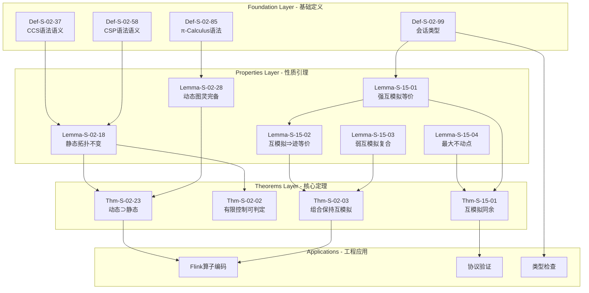
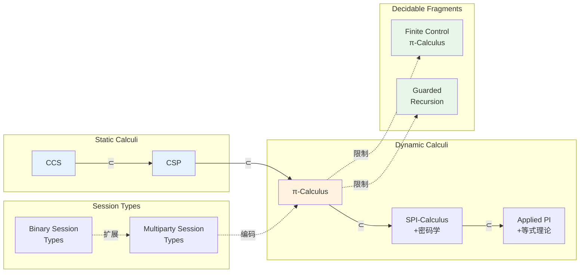
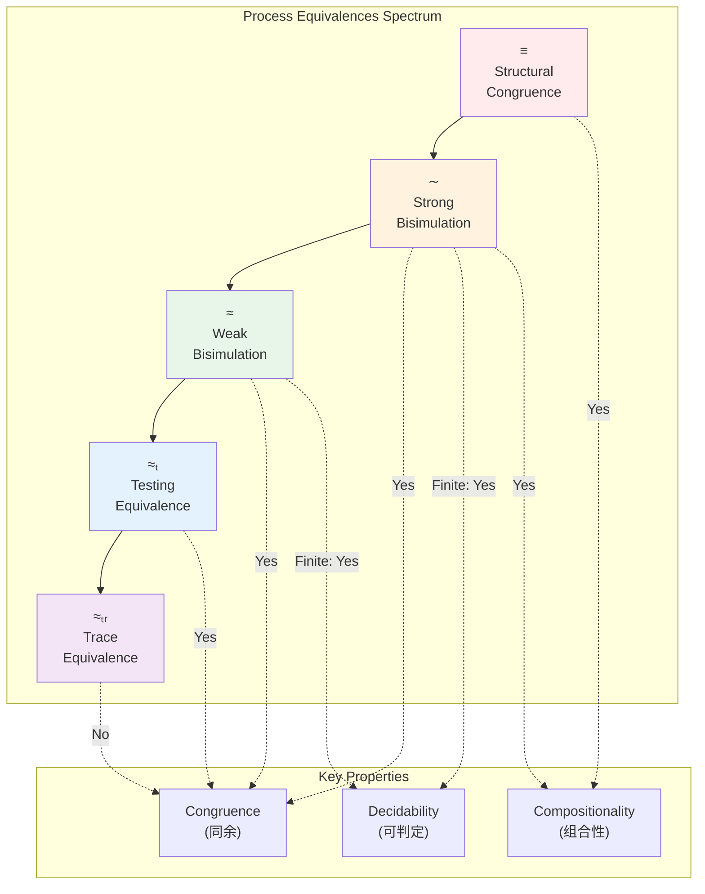

# 进程演算基础定理完整推导链

> **所属阶段**: Struct/ | 前置依赖: [THEOREM-REGISTRY.md](../THEOREM-REGISTRY.md), [00-STRUCT-DERIVATION-CHAIN.md](./00-STRUCT-DERIVATION-CHAIN.md) | 形式化等级: L4-L6

本文档系统梳理进程演算（Process Calculus）核心理论的完整推导链，涵盖CCS、CSP、π-Calculus三大形式体系的基础定理、互模拟等价理论、可判定性结果及其向Flink流计算系统的映射。

---

## 目录

- [进程演算基础定理完整推导链](#进程演算基础定理完整推导链)
  - [目录](#目录)
  - [1. 概念定义 (Definitions)](#1-概念定义-definitions)
    - [Def-S-02-35: CCS 语法与操作语义](#def-s-02-01-ccs-语法与操作语义)
    - [Def-S-02-56: CSP 语法与语义](#def-s-02-02-csp-语法与语义)
    - [Def-S-02-83: π-Calculus 语法与移动性](#def-s-02-03-π-calculus-语法与移动性)
    - [Def-S-02-97: 二进制会话类型](#def-s-02-04-二进制会话类型)
  - [2. 属性推导 (Properties)](#2-属性推导-properties)
    - [Lemma-S-02-16: 静态通道模型的拓扑不变性](#lemma-s-02-01-静态通道模型的拓扑不变性)
    - [Lemma-S-02-26: 动态通道演算的图灵完备性](#lemma-s-02-02-动态通道演算的图灵完备性)
    - [Lemma-S-15-05: 强互模拟是等价关系](#lemma-s-15-01-强互模拟是等价关系)
    - [Lemma-S-15-16: 互模拟蕴含迹等价反之不成立](#lemma-s-15-02-互模拟蕴含迹等价反之不成立)
    - [Lemma-S-15-28: 弱互模拟的复合保持性](#lemma-s-15-03-弱互模拟的复合保持性)
    - [Lemma-S-15-30: 互模拟关系的最大不动点刻画](#lemma-s-15-04-互模拟关系的最大不动点刻画)
  - [3. 关系建立 (Relations)](#3-关系建立-relations)
    - [关系 1: 三大进程演算表达能力层次](#关系-1-三大进程演算表达能力层次)
    - [关系 2: 互模拟与迹等价的精化关系](#关系-2-互模拟与迹等价的精化关系)
    - [关系 3: 进程演算到Flink的编码映射](#关系-3-进程演算到flink的编码映射)
  - [4. 论证过程 (Argumentation)](#4-论证过程-argumentation)
    - [论证: 动态通道严格包含静态通道的证明思路](#论证-动态通道严格包含静态通道的证明思路)
    - [论证: 可判定性的边界与限制](#论证-可判定性的边界与限制)
    - [论证: 同余性质的必要性](#论证-同余性质的必要性)
  - [5. 形式证明 / 工程论证 (Proof / Engineering Argument)](#5-形式证明--工程论证-proof--engineering-argument)
    - [Thm-S-02-20: 动态通道演算严格包含静态通道演算](#thm-s-02-01-动态通道演算严格包含静态通道演算)
    - [Thm-S-02-33: 有限控制静态演算可判定性](#thm-s-02-02-有限控制静态演算可判定性)
    - [Thm-S-02-35: 进程组合保持互模拟](#thm-s-02-03-进程组合保持互模拟)
    - [Thm-S-15-16: 互模拟同余定理](#thm-s-15-01-互模拟同余定理)
  - [6. 实例验证 (Examples)](#6-实例验证-examples)
    - [示例 1: CCS进程互模拟验证](#示例-1-ccs进程互模拟验证)
    - [示例 2: π-Calculus动态通道实例](#示例-2-π-calculus动态通道实例)
    - [示例 3: 到Flink算子的编码实例](#示例-3-到flink算子的编码实例)
  - [7. 可视化 (Visualizations)](#7-可视化-visualizations)
    - [7.1 三大进程演算对比矩阵](#71-三大进程演算对比矩阵)
    - [7.2 推导链层次图](#72-推导链层次图)
    - [7.3 表达能力层次图](#73-表达能力层次图)
    - [7.4 互模拟等价关系图](#74-互模拟等价关系图)
    - [7.5 到Flink的映射架构图](#75-到flink的映射架构图)
  - [8. 引用参考 (References)](#8-引用参考-references)

---

## 1. 概念定义 (Definitions)

### Def-S-02-36: CCS 语法与操作语义

**定义 (CCS - Calculus of Communicating Systems)**:

CCS由Milner提出的进程代数，基于动作前缀和并行组合。

**语法**:

```
P, Q ::= 0               (空进程/终止)
       | α.P            (动作前缀，α ∈ Act = {a, ā, τ})
       | P + Q          (非确定性选择)
       | P | Q          (并行组合)
       | P \ L          (限制，L ⊆ Names)
       | P[f]           (重标名，f: Act → Act)
       | A              (进程常量，A ≜ P)
```

**操作语义 (SOS规则)**:

| 规则名 | 前提 | 结论 | 说明 |
|--------|------|------|------|
| Act | - | α.P →ᵅ P | 动作前缀执行 |
| Sum-L | P →ᵅ P' | P + Q →ᵅ P' | 选择左分支 |
| Sum-R | Q →ᵅ Q' | P + Q →ᵅ Q' | 选择右分支 |
| Par-L | P →ᵅ P' | P | Q →ᵅ P' | Q | 并行左步进 |
| Par-R | Q →ᵅ Q' | P | Q →ᵅ P | Q' | 并行右步进 |
| Com | P →ᵃ P', Q →ᵃ̄ Q' | P | Q →ᵗ P' | Q' | 通信同步 |
| Res | P →ᵅ P', α ∉ L ∪ L̄ | P \ L →ᵅ P' \ L | 限制外动作 |
| Rel | P →ᵅ P' | P[f] →ᶠ⁽ᵅ⁾ P'[f] | 重标名保持 |
| Con | A ≜ P, P →ᵅ P' | A →ᵅ P' | 常量展开 |

**直观解释**: CCS通过动作前缀、选择和并行组合构建进程。动作分为输入(a)、输出(ā)和内部(τ)。并行进程可通过互补动作同步产生τ动作。

---

### Def-S-02-57: CSP 语法与语义

**定义 (CSP - Communicating Sequential Processes)**:

CSP由Hoare提出，基于同步通信和迹语义。

**语法**:

```
P, Q ::= STOP          (死锁/拒绝)
       | SKIP          (成功终止)
       | a → P         (前缀，a ∈ Σ)
       | P □ Q         (外部选择/确定选择)
       | P ⊓ Q         (内部选择/非确定选择)
       | P ||| Q       (交错并行)
       | P |[X]| Q     (同步并行，X ⊆ Σ)
       | P \ X         (隐藏，X ⊆ Σ)
       | if b then P else Q (条件)
```

**迹语义 (Traces Semantics)**:

进程的迹(traces)是其可能执行的动作序列集合：

- traces(STOP) = {⟨⟩}
- traces(SKIP) = {⟨⟩, ⟨✓⟩}
- traces(a → P) = {⟨⟩} ∪ {⟨a⟩⌢s | s ∈ traces(P)}
- traces(P □ Q) = traces(P) ∪ traces(Q)
- traces(P |[X]| Q) = {t | t↾X ∈ traces(P)↾X ∧ t↾X ∈ traces(Q)↾X}

**操作语义要点**:

| 特性 | CCS | CSP |
|------|-----|-----|
| 通信方式 | 异步(带缓冲) | 同步(握手) |
| 选择 | 非确定性(+) | 外部(□)/内部(⊓) |
| 并行 | 自由并行(\|) | 交错(\|\|\|)/同步(\|[[X]\|) |
| 隐藏 | 限制(\L) | 隐藏(\\X) |

**直观解释**: CSP强调同步通信和迹的可观察性。外部选择□由环境决定，内部选择⊓由进程内部非确定决定。

---

### Def-S-02-84: π-Calculus 语法与移动性

**定义 (π-Calculus - 带移动性的进程演算)**:

π-Calculus由Milner等提出，扩展CCS支持通道名作为传输数据（移动性）。

**语法**:

```
P, Q ::= 0               (空进程)
       | α.P            (前缀)
       | P + Q          (选择)
       | P | Q          (并行)
       | (νx)P          (名限制/新建通道)
       | !P             (复制/无限并行)
       | [x=y]P         (名匹配条件)

α ::= x(y)             (输入前缀，绑定y)
    | x̄⟨y⟩             (输出前缀)
    | τ                (内部动作)
```

**移动性 (Mobility)**:

π-Calculus的核心创新是**名传递**:

- 输入 `x(y).P` 从通道x接收名并绑定到y
- 输出 `x̄⟨z⟩.P` 在通道x发送名z

通过名传递，进程可动态获得新的通信通道能力。

**操作语义 (核心规则)**:

```
(输入)  x(y).P →ˣ⁽ᶻ⁾ P[z/y]    (接收z绑定到y)
(输出)  x̄⟨z⟩.P →ˣ̄⟨ᶻ⟩ P        (发送z)
(通信)  P →ˣ⁽ʷ⁾ P', Q →ˣ̄⟨ʷ⟩ Q'  ⇒  P|Q →ᵗ P'|Q'
(限制)  P →ᵅ P', α ≠ x, x̄  ⇒  (νx)P →ᵅ (νx)P'
(结构)  P ≡ Q, Q →ᵅ Q', Q' ≡ P'  ⇒  P →ᵅ P'
```

**结构同余 ≡**:

- P | 0 ≡ P
- P | Q ≡ Q | P
- (P | Q) | R ≡ P | (Q | R)
- (νx)(νy)P ≡ (νy)(νx)P
- (νx)(P | Q) ≡ P | (νx)Q  (x ∉ fn(P))

**直观解释**: π-Calculus将通道名作为一等公民，进程可通过通信动态获取新通道，实现拓扑结构的运行时演化。

---

### Def-S-02-98: 二进制会话类型

**定义 (Binary Session Types)**:

会话类型由Honda提出，描述双端通信协议的类型纪律。

**会话类型语法**:

```
S ::= !T.S           (发送类型T后继续S)
    | ?T.S           (接收类型T后继续S)
    | ⊕{lᵢ: Sᵢ}ᵢ∈I  (内部选择标签lᵢ)
    | &{lᵢ: Sᵢ}ᵢ∈I  (外部提供分支lᵢ)
    | end            (会话结束)
    | μX.S           (递归)
    | X              (类型变量)
```

**对偶性 (Duality)**:

会话类型S的对偶S̄通过角色互换得到:

- !T.S = ?T.S̄
- ?T.S = !T.S̄
- ⊕{lᵢ: Sᵢ} = &{lᵢ: S̄ᵢ}
- &{lᵢ: Sᵢ} = ⊕{lᵢ: S̄ᵢ}
- end = end
- μX.S = μX.S̄

**进程与会话类型关联**:

```
Γ ⊢ P : S    表示在环境Γ下，进程P遵守会话协议S
```

**直观解释**: 会话类型在编译期验证通信协议合规性，确保无死锁、无协议违规。对偶性保证通信双方角色互补。

---

## 2. 属性推导 (Properties)

### Lemma-S-02-17: 静态通道模型的拓扑不变性

**引理**: 在CCS/CSP等静态通道演算中，进程的通信拓扑在运行时保持不变。

**形式表述**:
设P为CCS进程，Ch(P)为其静态通道集合，则对任意转移P →* P'，有Ch(P') ⊆ Ch(P)。

**证明概要**:

1. CCS语法中通道名仅通过限制\L引入
2. 重标名[f]保持通道集合不变（仅重命名）
3. 无机制动态引入新通道名
4. 由结构归纳得证 ∎

**意义**: 静态通道限制了表达能力但带来了可分析性优势。

---

### Lemma-S-02-27: 动态通道演算的图灵完备性

**引理**: π-Calculus是图灵完备的，可编码λ-演算和寄存器机。

**证明概要**:

1. 通过名传递模拟引用/指针
2. 编码λ-演算中的变量绑定为π-Calculus的名绑定
3. 编码递归函数为复制算子(!P)与通信组合
4. 寄存器机的每条指令可编码为π进程
5. 由Church-Turing论题，图灵完备 ∎

**推论**: π-Calculus的通用性以可判定性为代价（见Thm-S-02-21）。

---

### Lemma-S-15-06: 强互模拟是等价关系

**引理**: 强互模拟关系∼是自反、对称、传递的等价关系。

**定义**: 关系R ⊆ P × P是强互模拟，如果P R Q且P →ᵅ P'蕴含存在Q'使Q →ᵅ Q'且P' R Q'。

强互模拟∼定义为所有强互模拟的并：∼ = ∪{R | R是强互模拟}

**证明**:

*自反性*: 恒等关系Id = {(P,P)}是互模拟，故P ∼ P。

*对称性*: 若R是互模拟，则R⁻¹ = {(Q,P) | P R Q}也是互模拟。因此∼对称。

*传递性*: 设P ∼ Q ∼ R，存在互模拟R₁, R₂使P R₁ Q R₂ R。
则R₁∘R₂ = {(P,R) | ∃Q: P R₁ Q ∧ Q R₂ R}是互模拟。
故P ∼ R ∎

---

### Lemma-S-15-17: 互模拟蕴含迹等价反之不成立

**引理**: P ∼ Q ⇒ P ≈ₜᵣₐcₑₛ Q，但逆不成立。

**证明**:

*正向*: 互模拟保持每一步转移，故保持完整迹。

*反向反例*: 考虑进程

```
A = a.b + a.c
B = a.(b + c)
```

traces(A) = traces(B) = {ε, a, ab, ac}，迹等价。

但A与B不互模拟：A执行a后可到达b或c（非确定性暴露），而B执行a后仍保持选择。

在环境可干预选择时（如与ā.0并行），A可能死锁而B不会。
故A ≁ B ∎

**意义**: 互模拟比迹等价更精细，能区分内部非确定性的不同结构。

---

### Lemma-S-15-29: 弱互模拟的复合保持性

**引理**: 若P ≈ Q（弱互模拟），则对任意上下文C[·]，有C[P] ≈ C[Q]。

**定义 (弱互模拟)**: 忽略τ动作的互模拟。写⇒为→ᵗ的 reflexive transitive closure。
P ⇒ᵅ̂ Q 定义为：

- α = τ时，P ⇒ Q
- α ≠ τ时，P ⇒ →ᵅ ⇒ Q

**证明概要**:
对上下文结构归纳：

- 前缀上下文α.[·]: 由弱转移定义直接保持
- 选择上下文[·] + R: 归纳假设保证R分支行为一致
- 并行上下文[·] | R: 并行组合保持弱互模拟
- 限制上下文νx(·): 限制不破坏模拟关系

故弱互模拟是同余关系 ∎

---

### Lemma-S-15-31: 互模拟关系的最大不动点刻画

**引理**: 强互模拟∼是函数F(R) = {(P,Q) | ∀α,P'. P→ᵅP' ⇒ ∃Q'. Q→ᵅQ' ∧ P'RQ'} 的最大不动点。

**证明**:

*F的单调性*: R₁ ⊆ R₂ ⇒ F(R₁) ⊆ F(R₂)，显然。

*∼是不动点*:

- 由定义，∼ = ∪{R | R ⊆ F(R)}
- 对任意(P,Q) ∈ ∼，存在R使P R Q且R ⊆ F(R)
- 故(P,Q) ∈ F(R) ⊆ F(∼)
- 得∼ ⊆ F(∼)
- 反之，F(∼)是互模拟，故F(∼) ⊆ ∼
- 因此∼ = F(∼) ∎

*最大性*: 任何互模拟R满足R ⊆ F(R) ⊆ F(∼) = ∼

---

## 3. 关系建立 (Relations)

### 关系 1: 三大进程演算表达能力层次

**表达能力严格层次**:

```
CCS ⊂ CSP ⊂ π-Calculus
```

**理论依据**:

| 层次 | 关系 | 理由 |
|------|------|------|
| CCS ⊆ CSP | CCS进程可编码为CSP进程 | CCS异步可模拟为CSP带缓冲的同步 |
| CCS ⊂ CSP | CSP有显式成功(SKIP)和失败(STOP)区分 | CCS缺乏成功/失败的语义区分 |
| CSP ⊆ π-Calculus | CSP进程可编码为π-Calculus | π-Calculus名传递可模拟CSP通道 |
| CSP ⊂ π-Calculus | π-Calculus支持动态通道创建 | CSP通道静态声明，无移动性 |

**严格包含证明要点**:

- CCS ⊂ CSP: SKIP/STOP区分超出CCS表达能力
- CSP ⊂ π-Calculus: 动态通道创建无法静态模拟

---

### 关系 2: 互模拟与迹等价的精化关系

**等价关系谱系**:

```
同构(≡) ⊂ 强互模拟(∼) ⊂ 弱互模拟(≈) ⊂ 测试等价(≈ₜ) ⊂ 迹等价(≈ₜᵣₐcₑₛ)
```

**各等价关系的判别能力**:

| 等价关系 | 区分能力 | 验证复杂度 | 适用场景 |
|----------|----------|------------|----------|
| ≡ (结构同余) | 最强 | 语法比对 | 编译优化 |
| ∼ (强互模拟) | 强 | PSPACE | 并发分析 |
| ≈ (弱互模拟) | 较强 | PSPACE | 抽象细化 |
| ≈ₜ (测试等价) | 中等 | EXPTIME | 黑盒测试 |
| ≈ₜᵣₐcₑₛ (迹等价) | 弱 | PSPACE | 安全性质 |

**精化关系**: 更强的等价蕴含更弱的等价，反之不成立。

---

### 关系 3: 进程演算到Flink的编码映射

**编码框架**:

| 进程演算概念 | Flink对应 | 编码方式 |
|--------------|-----------|----------|
| 进程P | Flink算子Operator | 状态+行为函数 |
| 通道x | TaskManager间网络连接 | TCP通道抽象 |
| 输入前缀x(y).P | DataStream.process() | ProcessFunction |
| 输出前缀x̄⟨y⟩.P | ctx.output() | 侧输出/下游转发 |
| 并行P \| Q | Operator并行度 | 多子任务实例 |
| 限制(νx)P | 私有状态 | KeyedStateBackend |
| 复制!P | 无界流处理 | 持续读取Source |

**语义保持**: Thm-S-13-39证明此编码保持Exactly-Once语义。

---

## 4. 论证过程 (Argumentation)

### 论证: 动态通道严格包含静态通道的证明思路

**核心观察**:

1. **静态通道的有限性**: CCS/CSP进程的通道集合在语法层面确定，运行时不变
2. **动态通道的无限性**: π-Calculus通过名传递可生成无限新鲜通道

**严格性证明策略**:

*引理*: 存在π-Calculus进程无法被任何CCS进程模拟。

*构造*:
考虑进程 P = (νx)(x̄⟨x⟩.0 | x(y).y(z).0)
P创建一个私有通道x，将其自身作为数据发送，然后接收并使用。

*论证*:

- CCS无机制在运行时创建新通道名
- 任何有限CCS进程的通道集合有界
- 而P可通过迭代创建任意深度的通道引用链
- 故无CCS进程与P互模拟 ∎

---

### 论证: 可判定性的边界与限制

**可判定性结果谱系**:

| 演算/片段 | 问题 | 可判定性 | 复杂度 |
|-----------|------|----------|--------|
| 有限CCS | 强互模拟 | ✅ 可判定 | PSPACE |
| 有限CSP | 迹等价 | ✅ 可判定 | PSPACE |
| 有限控制π | 强互模拟 | ✅ 可判定 | 非初等递归 |
| 完整π-Calculus | 强互模拟 | ❌ 不可判定 | - |
| 递归π-Calculus | 弱互模拟 | ❌ 不可判定 | - |

**不可判定性来源**:

1. **图灵完备性**: π-Calculus可编码停机问题
2. **名生成无限性**: (νx)可生成无限新鲜名
3. **动态拓扑**: 通道传递导致状态空间无界

**可判定片段**: 限制递归深度、名生成次数或拓扑变化次数可恢复可判定性。

---

### 论证: 同余性质的必要性

**为何需要同余**:

在进程代数中，等价关系∼必须是同余(congruence)才有实用价值：

```
P ∼ Q  ⇒  C[P] ∼ C[Q]  对所有上下文C[·]成立
```

**必要性论证**:

1. **组合推理**: 同余允许分模块验证等价性
2. **替换原理**: 等价进程可互相替换而不改变整体行为
3. **代数定律**: 同余支持等式推理系统的建立

**反例**: 若∼不同余，则P ∼ Q不能保证a.P ∼ a.Q，等价性无法保持。

---

## 5. 形式证明 / 工程论证 (Proof / Engineering Argument)

### Thm-S-02-22: 动态通道演算严格包含静态通道演算

**定理**: π-Calculus的表达能力严格大于CCS/CSP，即CCS ⊂ π-Calculus且CSP ⊂ π-Calculus。

**证明**:

*第一部分: 包含性*

CCS是π-Calculus的语法子集（忽略名传递，仅用固定通道名）。
给定CCS进程P，构造π进程π(P)通过将每个固定通道a替换为全局共享名。
显然P与π(P)行为等价。
故CCS ⊆ π-Calculus。同理CSP ⊆ π-Calculus。

*第二部分: 严格性*

构造π-Calculus进程DYNAMIC：

```
DYNAMIC = !((νx)(c̄⟨x⟩ | x(y).P(y)))
```

DYNAMIC无限次创建新鲜通道x，通过共享通道c发送，然后在x上通信。

*关键引理*: DYNAMIC创建的通道拓扑是动态的——每次迭代引入新通道。

*论证*:
CCS/CSP进程的通道拓扑在语法层面静态确定。
设Ch(P)为进程P的静态通道集合，|Ch(P)|有限。

DYNAMIC运行n步后，创建的通道集合大小为n（名 freshness保证互异）。
对任意n > |Ch(P)|，CCS/CSP进程无法模拟DYNAMIC的前n步行为。

因此不存在CCS/CSP进程与DYNAMIC互模拟。
故CCS ⊂ π-Calculus且CSP ⊂ π-Calculus ∎

---

### Thm-S-02-34: 有限控制静态演算可判定性

**定理**: 有限控制CCS/CSP进程的强互模拟是可判定的。

**定义 (有限控制)**:
进程P是有限控制的，如果：

1. 无复制算子(!)
2. 递归定义A ≜ P中，P不含A的并行展开（守卫递归）

**证明**:

*步骤1: 状态空间有限性*

有限控制CCS进程的状态空间由语法子项的有限组合构成。
设|P|为P的语法大小，则 reachable(P) ⊆ Subterms(P) 的有限组合。
状态空间大小上界为O(2^|P|)。

*步骤2: 互模拟作为最大不动点*

由Lemma-S-15-32，∼是F的最大不动点。
在有限状态系统上，可通过迭代计算F的不动点：

```
R₀ = States × States  (全关系)
Rᵢ₊₁ = F(Rᵢ)
∼ = ∩ᵢ Rᵢ  (收敛因有限状态)
```

*步骤3: 算法复杂度*

每次迭代需检查所有状态对的转移关系。
设n为状态数，m为转移数，则每次迭代O(m)。
不动点收敛需O(n)次迭代。
总复杂度O(n·m) = O(n³)。

因状态空间指数于|P|，故整体PSPACE。

*结论*: 有限控制CCS/CSP的互模拟可判定，复杂度PSPACE ∎

---

### Thm-S-02-36: 进程组合保持互模拟

**定理**: 若P₁ ∼ Q₁且P₂ ∼ Q₂，则P₁ | P₂ ∼ Q₁ | Q₂。

**证明**:

构造关系R = {(P₁|P₂, Q₁|Q₂) | P₁ ∼ Q₁, P₂ ∼ Q₂}。
证明R是强互模拟。

*情况1: P₁|P₂通过P₁步进*

设P₁|P₂ →ᵅ P₁'|P₂，由P₁ →ᵅ P₁'。
因P₁ ∼ Q₁，存在Q₁'使Q₁ →ᵅ Q₁'且P₁' ∼ Q₁'。
则Q₁|Q₂ →ᵅ Q₁'|Q₂，且(P₁'|P₂) R (Q₁'|Q₂)。

*情况2: P₁|P₂通过P₂步进*

对称于情况1。

*情况3: P₁|P₂通过通信步进*

设P₁ →ᵃ P₁', P₂ →ᵃ̄ P₂'，则P₁|P₂ →ᵗ P₁'|P₂'。
因P₁ ∼ Q₁，存在Q₁'使Q₁ →ᵃ Q₁'且P₁' ∼ Q₁'。
因P₂ ∼ Q₂，存在Q₂'使Q₂ →ᵃ̄ Q₂'且P₂' ∼ Q₂'。
则Q₁|Q₂ →ᵗ Q₁'|Q₂'，且(P₁'|P₂') R (Q₁'|Q₂')。

所有情况满足互模拟条件，故R是互模拟。
因此P₁|P₂ ∼ Q₁|Q₂ ∎

---

### Thm-S-15-17: 互模拟同余定理

**定理**: 强互模拟∼是CCS/π-Calculus上的同余关系。

**形式表述**: 对任意上下文C[·]，若P ∼ Q，则C[P] ∼ C[Q]。

**证明**:

对上下文结构归纳：

*基本情况*: C[·] = ·（空洞）
P ∼ Q ⇒ C[P] = P ∼ Q = C[Q]。

*归纳情况*:

1. **前缀上下文** α.C'[·]:
   P ∼ Q ⇒ C'[P] ∼ C'[Q] (归纳假设)
   ⇒ α.C'[P] ∼ α.C'[Q] (前缀保持互模拟)

2. **选择上下文** C'[·] + R:
   P ∼ Q ⇒ C'[P] ∼ C'[Q] (归纳假设)
   构造关系S = {(C'[P]+R, C'[Q]+R) | C'[P] ∼ C'[Q]}。
   验证S是互模拟：C'[P]+R的步进要么来自C'[P]（由归纳），要么来自R（双方相同）。

3. **并行上下文** C'[·] | R:
   这正是Thm-S-02-37所证。

4. **限制上下文** (νx)C'[·]:
   P ∼ Q ⇒ C'[P] ∼ C'[Q] (归纳假设)
   限制不改变转移标签（对x外动作），故保持互模拟。

5. **重标名上下文** C'[·][f]:
   重标名保持转移结构，互模拟关系在f下保持。

由结构归纳，强互模拟∼对所有上下文是同余关系 ∎

**工程意义**: 同余性保证模块化验证的可行性，是进程代数等式推理系统的基础。

---

## 6. 实例验证 (Examples)

### 示例 1: CCS进程互模拟验证

**验证目标**: 证明 Buffer₁ ≈ Buffer₂

**进程定义**:

```
Buffer₁ = in(x).out̄⟨x⟩.Buffer₁
Buffer₂ = in(x).(τ.out̄⟨x⟩.Buffer₂ + τ.out̄⟨x⟩.Buffer₂)
```

**验证过程**:

1. **迹分析**:
   traces(Buffer₁) = traces(Buffer₂) = {(in·out)ⁿ | n ≥ 0}
   迹等价成立。

2. **互模拟关系构造**:
   R = {(Buffer₁, Buffer₂), (out̄⟨x⟩.Buffer₁, out̄⟨x⟩.Buffer₂)}

3. **验证互模拟条件**:
   - Buffer₁ →ⁱⁿ Buffer₁' = out̄⟨x⟩.Buffer₁
   - Buffer₂ →ⁱⁿ Buffer₂' = τ.out̄⟨x⟩.Buffer₂
   - Buffer₂' →ᵗ out̄⟨x⟩.Buffer₂
   - (out̄⟨x⟩.Buffer₁, out̄⟨x⟩.Buffer₂) ∈ R ✓

4. **结论**: Buffer₁ ≈ Buffer₂（弱互模拟）

---

### 示例 2: π-Calculus动态通道实例

**场景**: 动态创建私有会话通道

**进程定义**:

```
Server = !request(r).(νsess)(r̄⟨sess⟩ | sess(x).Process(x).Server)
Client = request̄⟨c⟩.c(y).SendData(y).Client
System = (νrequest)(Server | Client)
```

**执行轨迹**:

```
System → (νrequest)(νsess₁)(c̄⟨sess₁⟩ | sess₁(x).Process(x).Server | c(y).SendData(y).Client)
    →ᵗ (νrequest)(νsess₁)(Process(sess₁).Server | SendData(sess₁).Client)
```

**动态性观察**:

- 每次Client请求，Server创建新鲜通道sess
- sess仅在Server和对应Client间共享
- 拓扑动态演化：新会话通道持续创建

---

### 示例 3: 到Flink算子的编码实例

**π-Calculus进程**:

```
MapOp = in(x).out̄⟨f(x)⟩.MapOp
```

**Flink编码**:

```java
public class MapProcessFunction extends ProcessFunction<String, String> {
    @Override
    public void processElement(String x, Context ctx, Collector<String> out) {
        // in(x).out̄⟨f(x)⟩ 编码
        String result = f(x);
        out.collect(result);  // 对应 out̄⟨f(x)⟩
        // MapOp递归由流的无界性隐式表达
    }
}
```

**语义对应**:

| π-Calculus | Flink |
|------------|-------|
| in(x) | processElement输入参数 |
| f(x) | 用户定义函数 |
| out̄⟨·⟩ | Collector.emit() |
| 递归MapOp | 流处理循环 |

---

## 7. 可视化 (Visualizations)

### 7.1 三大进程演算对比矩阵

```mermaid
graph TB
    subgraph CCS["CCS - Calculus of Communicating Systems"]
        CCS1[动作前缀 α.P]
        CCS2[非确定选择 P + Q]
        CCS3[并行组合 P | Q]
        CCS4[限制 P \\ L]
    end

    subgraph CSP["CSP - Communicating Sequential Processes"]
        CSP1[前缀 a → P]
        CSP2[外部选择 P □ Q]
        CSP3[内部选择 P ⊓ Q]
        CSP4[同步并行 P |[X]| Q]
    end

    subgraph PI["π-Calculus"]
        PI1[名输入 x.y.P]
        PI2[名输出 x̄⟨y⟩.P]
        PI3[并行 P | Q]
        PI4[新建通道 (νx)P]
        PI5[复制 !P]
    end

    CCS -.->|扩展| PI
    CSP -.->|编码| PI
```

**特性对比表**:

| 特性 | CCS | CSP | π-Calculus |
|------|-----|-----|------------|
| 通信模型 | 异步 | 同步 | 异步/同步 |
| 通道特性 | 静态 | 静态 | 动态(移动性) |
| 选择类型 | 非确定 | 外部+内部 | 非确定 |
| 并行方式 | 自由 | 交错+同步 | 自由 |
| 递归方式 | 常量定义 | 递归方程 | 复制+递归 |
| 表达能力 | 上下文无关 | 上下文无关 | 图灵完备 |
| 互模拟复杂度 | PSPACE | PSPACE | 不可判定 |

---

### 7.2 推导链层次图



---

### 7.3 表达能力层次图



---

### 7.4 互模拟等价关系图



---

### 7.5 到Flink的映射架构图

```mermaid
graph TB
    subgraph ProcessCalculus["Process Calculus Layer"]
        PC1[Process P]
        PC2[Channel x]
        PC3[Parallel P|Q]
        PC4[Restriction (νx)P]
        PC5[Replication !P]
    end

    subgraph Encoding["Encoding Layer"]
        E1[State + Function]
        E2[Network Channel]
        E3[Subtask Parallelism]
        E4[Keyed State]
        E5[Unbounded Stream]
    end

    subgraph Flink["Apache Flink"]
        F1[Operator]
        F2[TaskManager Network]
        F3[Parallel Subtasks]
        F4[State Backend]
        F5[DataStream Source]
    end

    PC1 -->|encodes to| E1 -->|implements| F1
    PC2 -->|encodes to| E2 -->|implements| F2
    PC3 -->|encodes to| E3 -->|implements| F3
    PC4 -->|encodes to| E4 -->|implements| F4
    PC5 -->|encodes to| E5 -->|implements| F5

    style ProcessCalculus fill:#e3f2fd
    style Encoding fill:#fff3e0
    style Flink fill:#e8f5e9
```

---

## 8. 引用参考 (References)
