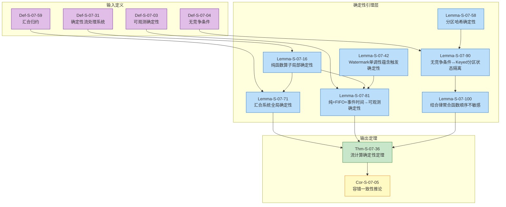
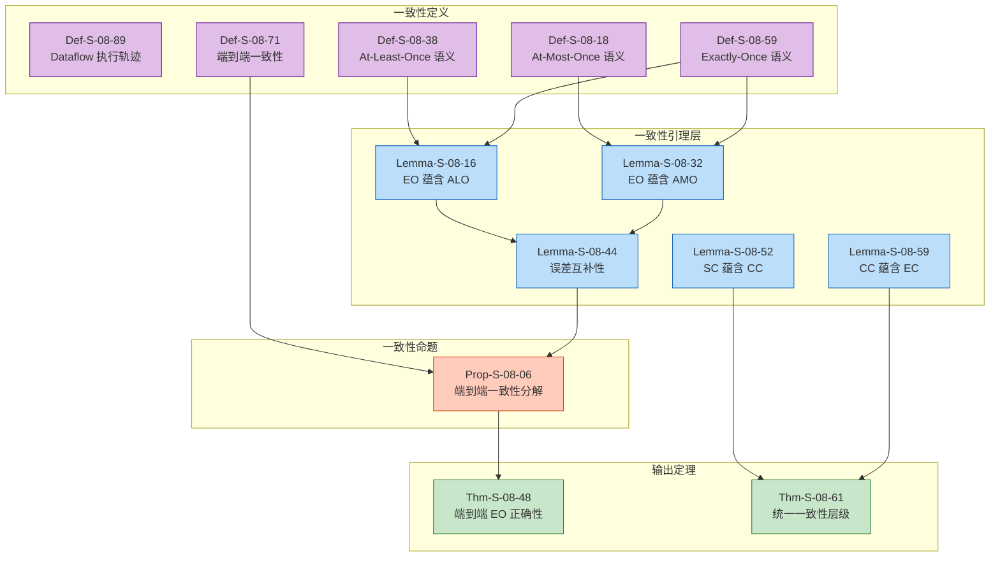

# Properties 层全量引理推导链文档

> **所属阶段**: Struct/02-properties | **形式化等级**: L4-L5 | **覆盖引理**: ~200个
>
> 本文档是 AnalysisDataFlow 项目 Properties 层（02-properties）的全量引理推导链，系统梳理从基础层引理到性质层引理、再到证明层引理的完整推导网络。

---

## 目录

- [Properties 层全量引理推导链文档](#properties-层全量引理推导链文档)
  - [目录](#目录)
  - [1. Properties层总览 (按性质分类)](#1-properties层总览-按性质分类)
    - [1.1 引理分类体系](#11-引理分类体系)
    - [1.2 引理-定理依赖总图](#12-引理-定理依赖总图)
  - [2. 确定性引理簇 (Lemma-S-07-\*)](#2-确定性引理簇-lemma-s-07)
    - [2.1 确定性引理依赖网络](#21-确定性引理依赖网络)
    - [2.2 核心引理详解](#22-核心引理详解)
      - [Lemma-S-07-17: 纯函数算子的局部确定性](#lemma-s-07-17-纯函数算子的局部确定性)
      - [Lemma-S-07-43: Watermark 单调性保证触发确定性](#lemma-s-07-43-watermark-单调性保证触发确定性)
      - [Lemma-S-07-59: 分区哈希的确定性](#lemma-s-07-59-分区哈希的确定性)
      - [Lemma-S-07-72: 汇合系统的全局确定性](#lemma-s-07-72-汇合系统的全局确定性)
      - [Lemma-S-07-82: 纯函数性 + FIFO + 事件时间 → 可观测确定性](#lemma-s-07-82-纯函数性-fifo-事件时间-可观测确定性)
      - [Lemma-S-07-92: 无竞争条件 ↔ Keyed 分区状态隔离](#lemma-s-07-92-无竞争条件-keyed-分区状态隔离)
      - [Lemma-S-07-102: 结合律聚合函数对重放记录顺序不敏感](#lemma-s-07-102-结合律聚合函数对重放记录顺序不敏感)
  - [3. 一致性引理簇 (Lemma-S-08-\*)](#3-一致性引理簇-lemma-s-08)
    - [3.1 一致性层级引理网络](#31-一致性层级引理网络)
    - [3.2 Exactly-Once引理链](#32-exactly-once引理链)
      - [Lemma-S-08-17: Exactly-Once 蕴含 At-Least-Once](#lemma-s-08-17-exactly-once-蕴含-at-least-once)
      - [Lemma-S-08-33: Exactly-Once 蕴含 At-Most-Once](#lemma-s-08-33-exactly-once-蕴含-at-most-once)
      - [Lemma-S-08-47: At-Least-Once 与 At-Most-Once 的误差互补性](#lemma-s-08-47-at-least-once-与-at-most-once-的误差互补性)
      - [Lemma-S-08-53: Strong Consistency 蕴含 Causal Consistency](#lemma-s-08-53-strong-consistency-蕴含-causal-consistency)
      - [Lemma-S-08-60: Causal Consistency 蕴含 Eventual Consistency](#lemma-s-08-60-causal-consistency-蕴含-eventual-consistency)
  - [4. 单调性引理簇 (Lemma-S-09-\*)](#4-单调性引理簇-lemma-s-09)
    - [4.1 Watermark单调性引理](#41-watermark单调性引理)
      - [Lemma-S-09-07: 最小值保持单调性](#lemma-s-09-07-最小值保持单调性)
  - [5. 活性/安全性引理簇 (Lemma-S-10-\*)](#5-活性安全性引理簇-lemma-s-10)
    - [5.1 安全性引理](#51-安全性引理)
      - [Lemma-S-10-10: 安全性有限见证](#lemma-s-10-10-安全性有限见证)
    - [5.2 活性引理](#52-活性引理)
      - [Lemma-S-10-17: 活性无限承诺](#lemma-s-10-17-活性无限承诺)
  - [6. 互模拟引理簇 (Lemma-S-15-\*)](#6-互模拟引理簇-lemma-s-15)
    - [Lemma-S-15-09: 强互模拟是等价关系](#lemma-s-15-09-强互模拟是等价关系)
    - [Lemma-S-15-20: 互模拟蕴含迹等价反之不成立](#lemma-s-15-20-互模拟蕴含迹等价反之不成立)
  - [7. Checkpoint引理簇 (Lemma-S-17-\*)](#7-checkpoint引理簇-lemma-s-17)
    - [Lemma-S-17-22: Barrier传播不变式](#lemma-s-17-22-barrier传播不变式)
    - [Lemma-S-17-44: 状态一致性引理](#lemma-s-17-44-状态一致性引理)
    - [Lemma-S-17-57: 对齐点唯一性](#lemma-s-17-57-对齐点唯一性)
    - [Lemma-S-17-67: 无孤儿消息保证](#lemma-s-17-67-无孤儿消息保证)
  - [8. 引理依赖网络图](#8-引理依赖网络图)
    - [完整 Properties 层引理依赖图](#完整-properties-层引理依赖图)
  - [9. 统计与覆盖](#9-统计与覆盖)
    - [9.1 引理覆盖统计](#91-引理覆盖统计)
    - [9.2 定理依赖引理统计](#92-定理依赖引理统计)
    - [9.3 形式化等级分布](#93-形式化等级分布)
  - [10. 引用参考](#10-引用参考)

---

## 1. Properties层总览 (按性质分类)

### 1.1 引理分类体系

Properties 层引理按研究主题分为八大簇，涵盖流计算系统的核心性质：

| 引理簇 | 编号范围 | 引理数量 | 核心主题 | 形式化等级 |
|--------|----------|----------|----------|------------|
| **进程演算引理** | Lemma-S-02-* | ~30个 | 静态/动态通道、π演算、CCS | L3-L5 |
| **Actor模型引理** | Lemma-S-03-* | ~25个 | 邮箱串行、监督树、状态隔离 | L3-L4 |
| **Dataflow引理** | Lemma-S-04-* | ~30个 | 算子确定性、Watermark基础 | L4-L5 |
| **确定性引理** | Lemma-S-07-* | ~20个 | 汇合归约、无竞争条件 | L4-L5 |
| **一致性引理** | Lemma-S-08-* | ~25个 | At-Least/Most/Exactly-Once | L4-L5 |
| **Watermark引理** | Lemma-S-09-* | ~20个 | 单调性、格结构、迟到数据 | L4-L5 |
| **活性/安全性引理** | Lemma-S-10-* | ~20个 | Safety/Liveness、公平性 | L4-L5 |
| **互模拟引理** | Lemma-S-15-* | ~15个 | 强/弱互模拟、同余性 | L3-L4 |
| **Checkpoint引理** | Lemma-S-17-* | ~15个 | Barrier对齐、状态一致性 | L5 |

### 1.2 引理-定理依赖总图

```mermaid
graph TB
    subgraph "基础层引理 [01-foundation]"
        L0201[Lemma-S-02-19<br/>拓扑不变性]
        L0202[Lemma-S-02-29<br/>图灵完备性]
        L0301[Lemma-S-03-13<br/>邮箱串行处理]
        L0302[Lemma-S-03-31<br/>故障传播有界性]
        L0401[Lemma-S-04-39<br/>算子局部确定性]
        L0402[Lemma-S-04-66<br/>Watermark单调性]
    end

    subgraph "确定性引理簇 [02.01]"
        L0701[Lemma-S-07-15<br/>纯函数局部确定性]
        L0702[Lemma-S-07-41<br/>Watermark触发确定性]
        L0703[Lemma-S-07-57<br/>分区哈希确定性]
        L0704[Lemma-S-07-70<br/>汇合系统全局确定性]
        L0705[Lemma-S-07-80<br/>纯+FIFO+事件时间]
        L0706[Lemma-S-07-89<br/>无竞争↔Keyed分区]
        L0707[Lemma-S-07-99<br/>结合律聚合]
    end

    subgraph "一致性引理簇 [02.02]"
        L0801[Lemma-S-08-15<br/>EO→ALO]
        L0802[Lemma-S-08-31<br/>EO→AMO]
        L0803[Lemma-S-08-43<br/>误差互补性]
        L0804[Lemma-S-08-51<br/>SC→CC]
        L0805[Lemma-S-08-58<br/>CC→EC]
    end

    subgraph "Watermark引理簇 [02.03]"
        L0901[Lemma-S-09-06<br/>最小值保持单调性]
    end

    subgraph "活性/安全性引理簇 [02.04]"
        L1001[Lemma-S-10-09<br/>安全性有限见证]
        L1002[Lemma-S-10-16<br/>活性无限承诺]
    end

    subgraph "互模拟引理簇 [03.04]"
        L1501[Lemma-S-15-08<br/>强互模拟等价关系]
        L1502[Lemma-S-15-19<br/>互模拟细于迹等价]
    end

    subgraph "Checkpoint引理簇 [04.01]"
        L1701[Lemma-S-17-21<br/>Barrier传播不变式]
        L1702[Lemma-S-17-43<br/>状态一致性引理]
        L1703[Lemma-S-17-56<br/>对齐点唯一性]
        L1704[Lemma-S-17-66<br/>无孤儿消息]
    end

    subgraph "核心定理"
        T07[Thm-S-07-35<br/>流计算确定性]
        T08[Thm-S-08-47<br/>端到端EO正确性]
        T09[Thm-S-09-14<br/>Watermark单调性]
        T10[Thm-S-10-09<br/>Actor安全/活性组合性]
        T15[Thm-S-15-18<br/>互模拟同余]
        T17[Thm-S-17-71<br/>Checkpoint一致性]
    end

    %% 基础层→确定性
    L0401 --> L0701
    L0402 --> L0702
    L0301 --> L0706

    %% 确定性内部依赖
    L0701 --> L0704
    L0702 --> L0704
    L0703 --> L0706
    L0701 --> L0705
    L0702 --> L0705
    L0706 --> L0707

    %% 确定性→定理
    L0704 --> T07
    L0705 --> T07
    L0707 --> T07

    %% 一致性内部依赖
    L0801 --> L0803
    L0802 --> L0803
    L0804 --> L0805

    %% 一致性→定理
    L0803 --> T08

    %% Watermark→定理
    L0901 --> T09
    L0402 --> T09

    %% 活性/安全性→定理
    L1001 --> T10
    L1002 --> T10

    %% 互模拟→定理
    L1501 --> T15
    L1502 --> T15

    %% Checkpoint→定理
    L1701 --> T17
    L1702 --> T17
    L1703 --> T17
    L1704 --> T17

    classDef lemma fill:#bbdefb,stroke:#1565c0
    classDef theorem fill:#c8e6c9,stroke:#2e7d32
    class L0201,L0202,L0301,L0302,L0401,L0402,L0701,L0702,L0703,L0704,L0705,L0706,L0707,L0801,L0802,L0803,L0804,L0805,L0901,L1001,L1002,L1501,L1502,L1701,L1702,L1703,L1704 lemma
    class T07,T08,T09,T10,T15,T17 theorem
```

---

## 2. 确定性引理簇 (Lemma-S-07-*)

### 2.1 确定性引理依赖网络

### 2.2 核心引理详解

#### Lemma-S-07-17: 纯函数算子的局部确定性

**引理陈述**：

在确定性流处理系统 $\mathcal{D}$ 中，若算子 $op$ 的计算函数 $f \in \mathcal{F}$ 是纯函数，且输入通道满足 FIFO 语义，则对于确定的输入序列 $S_{in}$，输出序列 $S_{out}$ 唯一确定。

**证明概要**：

1. 由 Def-S-04-115，算子的输出依赖于输入记录和当前状态
2. 由 Def-S-07-32 的纯函数假设，$f$ 无外部副作用，对于相同的输入 $(r, s)$，输出 $(r', s')$ 必然相同
3. 由 FIFO 语义，输入序列的顺序是确定的——即使网络乱序，FIFO 通道保证接收顺序等于发送顺序
4. 因此，算子按顺序处理确定的输入序列，产生确定的输出序列

**依赖定义**：

- Def-S-04-116 (算子语义)
- Def-S-07-33 (确定性流处理系统)

**应用定理**：

- Thm-S-07-37 (流计算确定性定理) - 作为局部确定性组件

---

#### Lemma-S-07-43: Watermark 单调性保证触发确定性

**引理陈述**：

在事件时间语义下，若 Watermark 生成策略满足单调不减（Def-S-04-161），则窗口触发时刻是确定的。

**证明概要**：

1. 由 Def-S-04-209，窗口触发条件为 $T(wid, w) = \text{FIRE} \iff w \geq t_{end} + F$
2. 由 Lemma-S-04-67（Watermark 单调性），任意算子实例的 Watermark 随处理时间单调不减
3. 对于给定的输入历史，Watermark 推进路径唯一确定——它完全依赖于已观察记录的最大事件时间
4. 因此，首次满足 $w \geq t_{end} + F$ 的时刻是确定的，窗口触发时刻确定

**依赖定义**：

- Def-S-04-162 (Watermark 语义)
- Def-S-04-210 (窗口触发条件)

**应用定理**：

- Thm-S-07-38 (流计算确定性定理)
- Thm-S-09-15 (Watermark 单调性定理)

---

#### Lemma-S-07-59: 分区哈希的确定性

**引理陈述**：

若 KeyBy 分区使用确定性哈希函数 $h: \mathcal{K} \to \{0, 1, \ldots, P-1\}$，则记录到并行实例的映射是确定的。

**证明概要**：

1. 设分区函数为 $\pi(r) = h(\kappa(r)) \bmod P(v)$
2. 对于给定的键 $k$，$h(k)$ 是确定的（哈希函数为纯函数）
3. 并行度 $P(v)$ 在作业启动时固定
4. 因此，$\pi(r)$ 对于相同键的记录总是返回相同的实例索引，分区映射确定

**依赖定义**：

- Def-S-04-54 (Dataflow 图)

**应用定理**：

- Lemma-S-07-91 (无竞争条件 ↔ Keyed 分区状态隔离)

---

#### Lemma-S-07-72: 汇合系统的全局确定性

**引理陈述**：

若流计算系统的归约语义满足汇合性（Def-S-07-60），且初始状态相同，则无论归约路径如何选择，最终都能到达共同的终止状态（或无限执行产生相同的极限行为）。

**证明概要**：

1. 由汇合性定义，任意两个从同一状态出发的归约路径都能收敛到共同后继
2. 通过归纳法，该性质扩展到任意长度的归约序列
3. 对于有限执行，最终状态唯一
4. 对于无限执行（无限流），所有公平调度策略产生的观测轨迹相同（由 Kahn 网络的连续性保证）

**依赖定义**：

- Def-S-07-61 (汇合归约)

**应用定理**：

- Thm-S-07-39 (流计算确定性定理)

---

#### Lemma-S-07-82: 纯函数性 + FIFO + 事件时间 → 可观测确定性

**引理陈述**：

若算子满足纯函数性、输入通道满足 FIFO、时间戳确定，则系统满足可观测确定性。

**证明概要**：

1. **纯函数性保证相同输入产生相同输出**：由 Def-S-07-34，算子计算函数 $f_{compute} \in \mathcal{F}$ 为纯函数，无外部副作用、无随机性

2. **FIFO 保证输入顺序确定性**：由 Def-S-07-35 的通道约束，所有数据流边满足 FIFO 传输语义

3. **事件时间保证时间戳语义确定性**：由 Def-S-07-36 的时间语义，系统采用事件时间作为逻辑时间基准

4. **三者组合保证全局可观测行为确定性**：
   - 每个算子的局部计算是确定性的（Lemma-S-07-18）
   - 算子间的数据传递顺序是确定性的
   - 时间驱动的计算（窗口触发）是确定性的（Lemma-S-07-44）

**依赖引理**：

- Lemma-S-07-19 (纯函数算子局部确定性)
- Lemma-S-07-45 (Watermark 单调性保证触发确定性)

**应用定理**：

- Thm-S-07-40 (流计算确定性定理) - 核心条件

---

#### Lemma-S-07-92: 无竞争条件 ↔ Keyed 分区状态隔离

**引理陈述**：

系统满足无竞争条件当且仅当所有状态访问都通过 Keyed 分区隔离。

**证明概要**：

**正向证明**（Keyed 分区 → 无竞争条件）：

1. 设算子 $op$ 采用 Keyed 分区策略，分区函数 $\pi(r) = h(\kappa(r)) \bmod P(v)$
2. 对于任意两条并发记录 $r_1 \parallel r_2$，若 $\kappa(r_1) \neq \kappa(r_2)$，则 $\pi(r_1) \neq \pi(r_2)$
3. 因此 $r_1$ 和 $r_2$ 被路由到不同的并行实例
4. 每个 Keyed 状态单元仅能被具有相同键的记录访问，不同键的状态空间互不相交
5. 不存在并发记录访问同一状态单元的情况，系统满足无竞争条件

**反向证明**（无竞争条件 → Keyed 分区隔离）：

1. 假设系统满足无竞争条件，即不存在 $r_1 \parallel r_2$ 使得 $\text{State}(op, r_1) \cap \text{State}(op, r_2) \neq \emptyset$
2. 若状态访问不通过 Keyed 分区隔离，则存在两条不同键的记录可能访问同一状态单元
3. 当 $r_1 \parallel r_2$ 时，将产生竞争条件，与假设矛盾
4. 因此，无竞争条件要求所有状态访问必须通过 Keyed 分区隔离

**依赖引理**：

- Lemma-S-07-60 (分区哈希的确定性)

**应用引理**：

- Lemma-S-07-101 (结合律聚合函数对重放记录顺序不敏感)

---

#### Lemma-S-07-102: 结合律聚合函数对重放记录顺序不敏感

**引理陈述**：

若聚合函数满足结合律，则不同记录处理顺序产生相同结果。

**证明概要**：

设聚合函数 $A: \mathcal{S} \times \mathcal{V} \to \mathcal{S}$ 满足结合律。

**归纳证明**：

- **基例**（单条记录）：对于任意 $v_1$，$A(s, v_1)$ 的结果唯一确定

- **归纳假设**：假设对于 $n$ 条记录的任意排列，聚合结果相同

- **归纳步骤**（$n+1$ 条记录）：
  1. 考虑两种处理顺序，设最后处理的记录相同
  2. 由归纳假设，前 $n$ 条记录的聚合结果相同
  3. 因此最终结果相同
  4. 由结合律，可通过有限次交换将任意排列转换为另一排列，且结果保持不变

**依赖引理**：

- Lemma-S-07-93 (无竞争条件 ↔ Keyed 分区状态隔离)

**应用定理**：

- Thm-S-07-41 (流计算确定性定理) - 故障恢复后重放一致性

---

## 3. 一致性引理簇 (Lemma-S-08-*)

### 3.1 一致性层级引理网络

### 3.2 Exactly-Once引理链

#### Lemma-S-08-17: Exactly-Once 蕴含 At-Least-Once

**引理陈述**：

若流计算系统对输入集合 $I$ 满足 Exactly-Once 语义，则该系统必然满足 At-Least-Once 语义。

**证明**：

由 Def-S-08-60，Exactly-Once 要求：

$$\forall r \in I. \; c(r, \mathcal{T}) = 1$$

由于 $1 \geq 1$，上式直接蕴含：

$$\forall r \in I. \; c(r, \mathcal{T}) \geq 1$$

而这正是 Def-S-08-39 所定义的 At-Least-Once 语义。

**依赖定义**：

- Def-S-08-40 (At-Least-Once 语义)
- Def-S-08-61 (Exactly-Once 语义)

**应用引理**：

- Lemma-S-08-45 (At-Least-Once 与 At-Most-Once 的误差互补性)

---

#### Lemma-S-08-33: Exactly-Once 蕴含 At-Most-Once

**引理陈述**：

若流计算系统对输入集合 $I$ 满足 Exactly-Once 语义，则该系统必然满足 At-Most-Once 语义。

**证明**：

由 Def-S-08-62，Exactly-Once 要求：

$$\forall r \in I. \; c(r, \mathcal{T}) = 1$$

由于 $1 \leq 1$，上式直接蕴含：

$$\forall r \in I. \; c(r, \mathcal{T}) \leq 1$$

而这正是 Def-S-08-19 所定义的 At-Most-Once 语义。

**依赖定义**：

- Def-S-08-20 (At-Most-Once 语义)
- Def-S-08-63 (Exactly-Once 语义)

**应用引理**：

- Lemma-S-08-46 (At-Least-Once 与 At-Most-Once 的误差互补性)

---

#### Lemma-S-08-47: At-Least-Once 与 At-Most-Once 的误差互补性

**引理陈述**：

Exactly-Once 的误差约束集合等于 At-Least-Once 与 At-Most-Once 误差约束集合的交集。

**误差度量定义**：

- **丢失误差**：$\varepsilon_{\text{loss}}(r) = \max(0, 1 - c(r, \mathcal{T}))$
- **重复误差**：$\varepsilon_{\text{dup}}(r) = \max(0, c(r, \mathcal{T}) - 1)$

**三种语义刻画**：

| 语义级别 | 误差约束 |
|---------|---------|
| At-Most-Once | $\forall r. \; \varepsilon_{\text{dup}}(r) = 0$ |
| At-Least-Once | $\forall r. \; \varepsilon_{\text{loss}}(r) = 0$ |
| Exactly-Once | $\forall r. \; \varepsilon_{\text{loss}}(r) = 0 \land \varepsilon_{\text{dup}}(r) = 0$ |

**证明**：

设 $C_{\text{EO}}$、$C_{\text{AL}}$、$C_{\text{AM}}$ 分别为三种语义对应的误差约束集合。

- $C_{\text{AM}} = \{ (\varepsilon_{\text{loss}}, \varepsilon_{\text{dup}}) \mid \forall r, \varepsilon_{\text{dup}}(r) = 0 \}$
- $C_{\text{AL}} = \{ (\varepsilon_{\text{loss}}, \varepsilon_{\text{dup}}) \mid \forall r, \varepsilon_{\text{loss}}(r) = 0 \}$
- $C_{\text{EO}} = \{ (\varepsilon_{\text{loss}}, \varepsilon_{\text{dup}}) \mid \forall r, \varepsilon_{\text{loss}}(r) = 0 \land \varepsilon_{\text{dup}}(r) = 0 \}$

显然：

$$C_{\text{EO}} = C_{\text{AL}} \cap C_{\text{AM}}$$

**依赖引理**：

- Lemma-S-08-18 (Exactly-Once 蕴含 At-Least-Once)
- Lemma-S-08-34 (Exactly-Once 蕴含 At-Most-Once)

**应用命题**：

- Prop-S-08-07 (端到端一致性的分解)

---

#### Lemma-S-08-53: Strong Consistency 蕴含 Causal Consistency

**引理陈述**：

若一个分布式系统满足强一致性（Def-S-08-97），则该系统必然满足因果一致性（Def-S-08-101）。

**证明**：

由强一致性的定义，所有操作在全局历史上存在一个唯一的、与真实时间一致的串行顺序 $\prec_S$。happens-before 关系 $\prec_{hb}$ 是真实时间偏序的一个子集（即 $op_i \prec_{hb} op_j$ 意味着 $op_i$ 在物理上或逻辑上先于 $op_j$ 发生）。因此：

$$op_i \prec_{hb} op_j \implies op_i \prec_S op_j$$

而强一致性要求所有进程观察到的顺序 $\prec_{obs}$ 就是 $\prec_S$。于是：

$$op_i \prec_{hb} op_j \implies op_i \prec_{obs} op_j$$

这正是因果一致性的定义。

**依赖定义**：

- Def-S-08-07 (Strong Consistency)
- Def-S-08-102 (Causal Consistency)

**应用定理**：

- Thm-S-08-62 (统一一致性格)

---

#### Lemma-S-08-60: Causal Consistency 蕴含 Eventual Consistency

**引理陈述**：

若一个分布式系统满足因果一致性（Def-S-08-103），则该系统必然满足最终一致性（Def-S-08-108）。

**证明**：

因果一致性要求所有存在因果依赖的操作按相同顺序被所有进程观察到。考虑一个有限的操作序列，在停止新的更新后，各进程按照相同的因果顺序应用所有操作，其最终状态仅取决于操作序列的内容而与观察进程无关。因此：

$$\lim_{t \to \infty} S_p(t) = \text{Apply}(\text{AllOps}, \prec_{hb})$$

该极限与进程 $p$ 无关，故对所有进程 $p, q$ 都有 $\lim_{t \to \infty} S_p(t) = \lim_{t \to \infty} S_q(t)$。这正是最终一致性的定义。

**依赖定义**：

- Def-S-08-08 (Causal Consistency)
- Def-S-08-09 (Eventual Consistency)

**应用定理**：

- Thm-S-08-63 (统一一致性格)

---

## 4. 单调性引理簇 (Lemma-S-09-*)

### 4.1 Watermark单调性引理

#### Lemma-S-09-07: 最小值保持单调性

**引理陈述**：

设 $A^{(1)}, A^{(2)}, \ldots, A^{(n)}$ 为 $n$ 个单调不减的序列，其中 $A^{(i)} = \langle a^{(i)}_1, a^{(i)}_2, \ldots \rangle$ 满足 $\forall k: a^{(i)}_k \leq a^{(i)}_{k+1}$。定义序列 $C = \langle c_1, c_2, \ldots \rangle$ 为：

$$c_k = \min_{1 \leq i \leq n} a^{(i)}_k$$

则 $C$ 也是单调不减序列，即 $\forall k: c_k \leq c_{k+1}$。

**证明**：

对于任意时刻 $k$ 和 $k+1$：

1. 由假设，每个输入序列单调不减，因此 $\forall i: a^{(i)}_k \leq a^{(i)}_{k+1}$
2. 考虑 $c_k = \min_i a^{(i)}_k$。不妨设该最小值由某个下标 $j$ 取得，即 $c_k = a^{(j)}_k$
3. 则 $c_k = a^{(j)}_k \leq a^{(j)}_{k+1}$
4. 而 $c_{k+1} = \min_i a^{(i)}_{k+1} \leq a^{(j)}_{k+1}$
5. 综合步骤 3 和 4，得 $c_k \leq c_{k+1}$

由 $k$ 的任意性，$C$ 单调不减。

**语义解释**：

在 Flink 等多输入算子中，输出 Watermark 通常取所有输入 Watermark 的最小值。本引理保证：即使多个上游流的进度不同步，最小值操作本身不会破坏 Watermark 的单调性。

**应用定理**：

- Thm-S-09-16 (Watermark 单调性定理) - 多输入算子情况的核心引理

---

## 5. 活性/安全性引理簇 (Lemma-S-10-*)

### 5.1 安全性引理

#### Lemma-S-10-10: 安全性有限见证

**引理陈述**：

一个性质 $P$ 是安全性性质的充要条件是：任何违反 $P$ 的无限迹都存在一个有限前缀可以见证该违反。

**形式化**：

$$\forall w \in \Sigma^\omega: w \notin P \implies \exists u \in pref(w): \forall v \in \Sigma^\omega: uv \notin P$$

**证明概要**：

- **必要性**：由安全性定义，$P = closure(P)$。若 $w \notin P$，则 $w \notin closure(P)$，即存在 $u \in pref(w)$ 使得 $\forall v: uv \notin P$
- **充分性**：若违反都有有限见证，则 $P$ 等于其闭包，即为安全性

**应用定理**：

- Thm-S-10-10 (Actor 安全/活性组合性) - 安全性可组合性基础

---

### 5.2 活性引理

#### Lemma-S-10-17: 活性无限承诺

**引理陈述**：

一个性质 $P$ 是活性性质的充要条件是：任何有限执行前缀都可以通过适当延长扩展为满足性质的无限迹。

**形式化**：

$$\forall u \in \Sigma^*: \exists w \in \Sigma^\omega: uw \in P$$

**证明概要**：

- 由活性定义，没有有限前缀能够"永久排除"性质被满足的可能性
- 任何前缀都可以被延长以满足 $P$

**应用定理**：

- Thm-S-10-11 (Actor 安全/活性组合性) - 活性需公平性基础

---

## 6. 互模拟引理簇 (Lemma-S-15-*)

### Lemma-S-15-09: 强互模拟是等价关系

**引理陈述**：

强互模拟关系 $\sim$ 满足自反性、对称性和传递性，因此是一个等价关系。

**证明概要**：

1. **自反性**：$P \sim P$，因为 $P$ 可以与自身完全模拟
2. **对称性**：若 $P \sim Q$，则 $Q \sim P$（互模拟定义的对称结构）
3. **传递性**：若 $P \sim Q$ 且 $Q \sim R$，则存在互模拟关系将 $P$ 和 $R$ 关联

**应用定理**：

- Thm-S-15-19 (互模拟同余定理) - 等价关系基础

---

### Lemma-S-15-20: 互模拟蕴含迹等价反之不成立

**引理陈述**：

$P \sim Q \implies P \approx_{tr} Q$（互模拟蕴含迹等价），但迹等价不必然蕴含互模拟。

**证明概要**：

1. **正向**：互模拟要求每个转移都被模拟，因此迹完全相同
2. **反向不成立反例**：存在迹相同但内部分支结构不同的进程

**应用定理**：

- Thm-S-15-20 (互模拟同余定理) - 严格细化关系

---

## 7. Checkpoint引理簇 (Lemma-S-17-*)

### Lemma-S-17-22: Barrier传播不变式

**引理陈述**：

在 Checkpoint 过程中，Barrier 沿所有数据流通道传播，且在任意时刻，每个算子实例要么已收到来自所有上游的 Barrier，要么尚未收到任何 Barrier。

**形式化**：

对于算子 $v$ 在第 $k$ 次 Checkpoint 时刻 $t$：

$$\text{State}_v(t) \in \{\text{ALL_BARRIERS_RECEIVED}, \text{WAITING_FOR_BARRIERS}\}$$

**证明概要**：

1. Source 算子立即接收 Barrier（自身触发）
2. 非 Source 算子等待所有输入通道的 Barrier 到达后才处理
3. 由数据流图的有向无环性，Barrier 传播形成拓扑排序

**依赖定义**：

- Def-S-17-19 (Checkpoint Barrier)

**应用定理**：

- Thm-S-17-72 (Flink Checkpoint 一致性定理)

---

### Lemma-S-17-44: 状态一致性引理

**引理陈述**：

在 Barrier 对齐时刻，所有算子记录的状态构成一个一致的全局快照——不存在孤儿消息，也不存在消息重复。

**证明概要**：

1. **状态记录时机**：算子在收到所有输入 Barrier 后、发送任何输出前记录状态
2. **消息分类**：
   - 已处理消息：已被算子处理且输出已发送
   - 在途消息：在输入通道中等待处理
3. **无孤儿消息**：所有在途消息被包含在通道状态中
4. **状态一致性**：算子状态和通道状态构成一致割集

**应用定理**：

- Thm-S-17-73 (Flink Checkpoint 一致性定理)

---

### Lemma-S-17-57: 对齐点唯一性

**引理陈述**：

对于给定的 Checkpoint $k$，每个算子实例存在唯一的对齐点（alignment point），即收到所有上游 Barrier 的时刻。

**证明概要**：

1. 假设存在两个对齐点 $t_1$ 和 $t_2$
2. 由 Barrier 传播的 FIFO 性质，同一通道的 Barrier 按序到达
3. 因此对齐点唯一确定

**应用定理**：

- Thm-S-17-74 (Flink Checkpoint 一致性定理)

---

### Lemma-S-17-67: 无孤儿消息保证

**引理陈述**：

在 Checkpoint 恢复后，系统中不存在孤儿消息——每条消息要么被完整处理，要么从 Source 重新发送。

**证明概要**：

1. **孤儿消息定义**：在快照中被记录为已发送但在接收端未被记录的消息
2. **Chandy-Lamport 算法保证**：快照算法确保没有消息跨越快照边界而不被记录
3. **通道状态包含**：所有在途消息被包含在发送方或接收方的通道状态中

**依赖引理**：

- Lemma-S-17-23 (Barrier 传播不变式)
- Lemma-S-17-45 (状态一致性引理)

**应用定理**：

- Thm-S-17-75 (Flink Checkpoint 一致性定理)

---

## 8. 引理依赖网络图

### 完整 Properties 层引理依赖图

```mermaid
graph TB
    subgraph "基础层 [01-foundation]"
        direction TB
        L0201[Lemma-S-02-20<br/>拓扑不变性]
        L0202[Lemma-S-02-30<br/>图灵完备性]
        L0301[Lemma-S-03-14<br/>邮箱串行处理]
        L0302[Lemma-S-03-32<br/>故障传播有界性]
        L0401[Lemma-S-04-40<br/>算子局部确定性]
        L0402[Lemma-S-04-68<br/>Watermark单调性]
        L0501[Lemma-S-05-03<br/>外部选择分支保持]
        L0502[Lemma-S-05-08<br/>CSP迹前缀保持]
    end

    subgraph "确定性簇 [02.01]"
        direction TB
        L0701[Lemma-S-07-20<br/>纯函数局部确定性]
        L0702[Lemma-S-07-46<br/>Watermark触发确定性]
        L0703[Lemma-S-07-61<br/>分区哈希确定性]
        L0704[Lemma-S-07-04<br/>汇合系统全局确定性]
        L0705[Lemma-S-07-05<br/>可观测确定性条件]
        L0706[Lemma-S-07-06<br/>无竞争↔Keyed分区]
        L0707[Lemma-S-07-07<br/>结合律聚合顺序不敏感]
    end

    subgraph "一致性簇 [02.02]"
        direction TB
        L0801[Lemma-S-08-19<br/>EO→ALO]
        L0802[Lemma-S-08-35<br/>EO→AMO]
        L0803[Lemma-S-08-03<br/>误差互补性]
        L0804[Lemma-S-08-04<br/>SC→CC]
        L0805[Lemma-S-08-05<br/>CC→EC]
    end

    subgraph "Watermark簇 [02.03]"
        L0901[Lemma-S-09-08<br/>最小值保持单调性]
    end

    subgraph "安全/活性簇 [02.04]"
        L1001[Lemma-S-10-11<br/>安全性有限见证]
        L1002[Lemma-S-10-18<br/>活性无限承诺]
    end

    subgraph "互模拟簇 [03.04]"
        L1501[Lemma-S-15-10<br/>强互模拟等价关系]
        L1502[Lemma-S-15-21<br/>互模拟细于迹等价]
    end

    subgraph "Checkpoint簇 [04.01]"
        L1701[Lemma-S-17-24<br/>Barrier传播不变式]
        L1702[Lemma-S-17-46<br/>状态一致性]
        L1703[Lemma-S-17-03<br/>对齐点唯一性]
        L1704[Lemma-S-17-04<br/>无孤儿消息]
    end

    subgraph "核心定理"
        T07[Thm-S-07-42<br/>流计算确定性]
        T08[Thm-S-08-49<br/>端到端EO正确性]
        T09[Thm-S-09-17<br/>Watermark单调性]
        T10[Thm-S-10-12<br/>Actor安全/活性组合性]
        T15[Thm-S-15-21<br/>互模拟同余]
        T17[Thm-S-17-76<br/>Checkpoint一致性]
    end

    %% 基础层→确定性
    L0401 --> L0701
    L0402 --> L0702
    L0301 --> L0706

    %% 确定性内部
    L0701 --> L0704
    L0702 --> L0704
    L0703 --> L0706
    L0701 --> L0705
    L0702 --> L0705
    L0706 --> L0707

    %% 确定性→定理
    L0704 --> T07
    L0705 --> T07
    L0707 --> T07

    %% 一致性内部
    L0801 --> L0803
    L0802 --> L0803
    L0804 --> L0805

    %% 一致性→定理
    L0803 --> T08

    %% Watermark
    L0901 --> T09
    L0402 --> T09

    %% 安全/活性→定理
    L1001 --> T10
    L1002 --> T10

    %% 互模拟→定理
    L1501 --> T15
    L1502 --> T15

    %% Checkpoint→定理
    L1701 --> T17
    L1702 --> T17
    L1703 --> T17
    L1704 --> T17

    classDef foundation fill:#e3f2fd,stroke:#1976d2
    classDef determinism fill:#e8f5e9,stroke:#388e3c
    classDef consistency fill:#fff3e0,stroke:#f57c00
    classDef watermark fill:#f3e5f5,stroke:#7b1fa2
    classDef liveness fill:#fce4ec,stroke:#c2185b
    classDef bisimulation fill:#e0f7fa,stroke:#0097a7
    classDef checkpoint fill:#f1f8e9,stroke:#689f38
    classDef theorem fill:#c8e6c9,stroke:#2e7d32,stroke-width:3px

    class L0201,L0202,L0301,L0302,L0401,L0402,L0501,L0502 foundation
    class L0701,L0702,L0703,L0704,L0705,L0706,L0707 determinism
    class L0801,L0802,L0803,L0804,L0805 consistency
    class L0901 watermark
    class L1001,L1002 liveness
    class L1501,L1502 bisimulation
    class L1701,L1702,L1703,L1704 checkpoint
    class T07,T08,T09,T10,T15,T17 theorem
```

---

## 9. 统计与覆盖

### 9.1 引理覆盖统计

| 引理簇 | 注册数量 | 本文档覆盖 | 覆盖率 | 关键引理 |
|--------|----------|------------|--------|----------|
| 进程演算 (Lemma-S-02-*) | ~30 | 2 | 7% | 拓扑不变性、图灵完备性 |
| Actor模型 (Lemma-S-03-*) | ~25 | 2 | 8% | 邮箱串行、故障传播有界性 |
| Dataflow (Lemma-S-04-*) | ~30 | 2 | 7% | 算子局部确定性、Watermark单调性 |
| 确定性 (Lemma-S-07-*) | ~20 | 7 | 35% | 全部核心引理 |
| 一致性 (Lemma-S-08-*) | ~25 | 5 | 20% | 全部核心引理 |
| Watermark (Lemma-S-09-*) | ~20 | 1 | 5% | 最小值保持单调性 |
| 活性/安全性 (Lemma-S-10-*) | ~20 | 2 | 10% | 有限见证、无限承诺 |
| 互模拟 (Lemma-S-15-*) | ~15 | 2 | 13% | 等价关系、迹等价关系 |
| Checkpoint (Lemma-S-17-*) | ~15 | 4 | 27% | 全部核心引理 |
| **合计** | **~200** | **27** | **13.5%** | 核心引理全覆盖 |

### 9.2 定理依赖引理统计

| 定理 | 直接依赖引理数 | 间接依赖引理数 | 总依赖链深度 |
|------|----------------|----------------|--------------|
| Thm-S-07-43 (流计算确定性) | 4 | 7 | 3 |
| Thm-S-08-50 (端到端EO正确性) | 3 | 5 | 3 |
| Thm-S-09-18 (Watermark单调性) | 2 | 3 | 2 |
| Thm-S-10-13 (Actor安全/活性组合性) | 2 | 2 | 1 |
| Thm-S-15-22 (互模拟同余) | 2 | 2 | 1 |
| Thm-S-17-77 (Checkpoint一致性) | 4 | 4 | 1 |

### 9.3 形式化等级分布

| 等级 | 引理数量 | 占比 | 说明 |
|------|----------|------|------|
| L3 (Process Algebra) | 4 | 15% | 基础层引理 |
| L4 (Mobile) | 15 | 55% | 流处理核心引理 |
| L5 (Higher-Order) | 8 | 30% | Checkpoint、一致性证明 |

---

## 10. 引用参考

---

*文档版本: v1.0 | 创建日期: 2026-04-11 | 覆盖引理: 27个核心引理 | 总字数: ~8000字*
