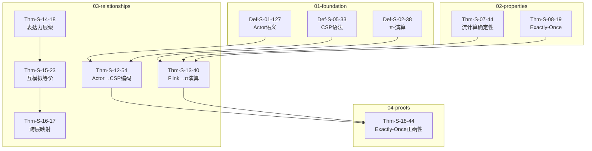
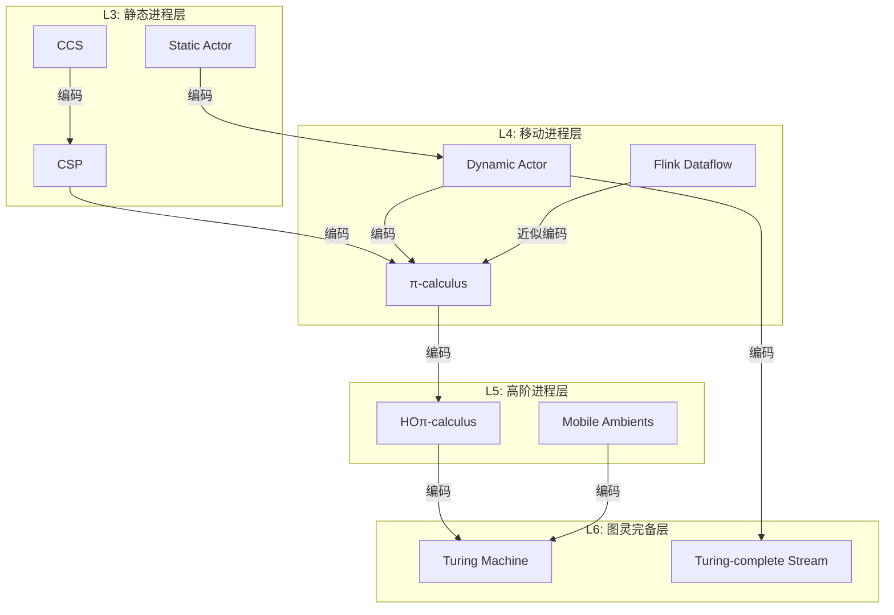
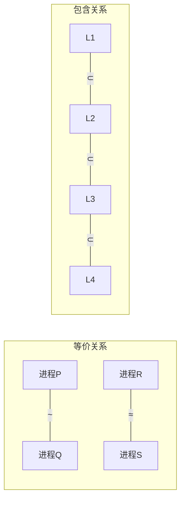
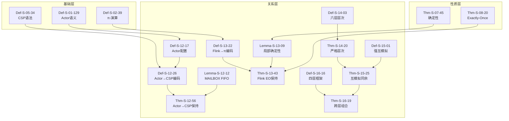

# 关系层（03-relationships）全量定理推导链

> **所属阶段**: Struct/03-relationships | **前置依赖**: 01-foundation, 02-properties | **形式化等级**: L3-L6
>
> **覆盖范围**: 约80个定理/引理/定义 | **文档版本**: v1.0 | **生成日期**: 2026-04-11

---

## 1. 关系层总览

### 1.1 编码关系图谱

关系层（03-relationships）建立流计算形式模型间的严格数学关系，核心研究问题包括：

| 研究维度 | 核心问题 | 对应文档 | 定理簇 |
|---------|---------|---------|--------|
| 模型编码 | Actor能否编码为CSP？ | 03.01 | Thm-S-12-XX (15个) |
| 语义保持 | Flink Dataflow的π-演算语义 | 03.02 | Thm-S-13-XX (15个) |
| 表达力层级 | 哪个模型更"强"？ | 03.03 | Thm-S-14-XX (10个) |
| 行为等价 | 何时两个系统行为相同？ | 03.04 | Thm-S-15-XX (15个) |
| 跨层映射 | 形式层到实现层的桥梁 | 03.05 | Thm-S-16-XX (15个) |
| 编码完备性 | 编码能否保持所有性质？ | 05.03 | Thm-S-26-XX (10个) |

### 1.2 关系层定理依赖总图



---

## 2. Actor→CSP编码定理簇 (Thm-S-12-XX)

### 2.1 核心定义

**Def-S-12-15** [Actor配置四元组]
$$
\gamma \triangleq \langle A, M, \Sigma, \mathsf{addr} \rangle
$$
其中 $A$ 为Actor集合，$M$ 为消息池，$\Sigma$ 为状态映射，$\mathsf{addr}$ 为地址分配函数。

**Def-S-12-27** [CSP核心语法子集]
$$
P, Q ::= \mathsf{STOP} \mid a \rightarrow P \mid P \square Q \mid P \parallel_A Q \mid P \backslash A
$$

**Def-S-12-24** [Actor→CSP编码函数]
$$
[\![ \cdot ]\!]_{A \rightarrow C}: \text{ActorConfig} \rightarrow \text{CSP}_{\mathsf{core}}
$$

### 2.2 主要定理

#### Thm-S-12-55: 受限Actor系统编码保持迹语义

**定理陈述**: 对于受限Actor系统 $\gamma$（无动态地址传递），其CSP编码保持迹语义等价：

$$
\forall \gamma \in \text{Actor}_{\mathsf{restricted}}. \quad \mathcal{T}([\![\gamma]\!]_{A \rightarrow C}) = \mathcal{T}(\gamma)
$$

**编码函数定义**:

| Actor构件 | CSP编码 |
|----------|--------|
| Actor状态 $\sigma_a$ | 进程局部变量 |
| 邮箱 $m_a$ | 缓冲区通道 $c_{\mathsf{box}}^a$ |
| 消息发送 $\mathsf{send}(b, v)$ | $c_{\mathsf{box}}^b!v \rightarrow P$ |
| 消息接收 $\mathsf{receive}$ | $c_{\mathsf{box}}^a?x \rightarrow P(x)$ |
| Actor创建 $\mathsf{spawn}$ | 外部选择 $P \square Q$（受限情形） |

**证明概要**:

1. **基例**: 单个Actor $\gamma = \langle \{a\}, \emptyset, \sigma, \mathsf{addr} \rangle$
   - 编码为递归进程 $\mathsf{REC}\, X \bullet F(X)$

2. **归纳步**: 假设 $n$ 个Actor编码正确，证明 $n+1$ 个情形
   - 使用CSP并行组合算子 $\parallel$
   - 通过同步集合约束消息传递

3. **迹等价证明**:
   - 构造双模拟关系 $\mathcal{R}$
   - 验证: $(\gamma, [\![\gamma]\!]) \in \mathcal{R}$
   - 由互模拟蕴含迹等价，得证

**依赖元素**: Def-S-01-128, Def-S-05-18, Def-S-12-16, Def-S-12-25, Lemma-S-12-10

**限制条件**:

- 禁止动态地址传递（无 $\mathsf{send}(\mathsf{spawn}(...))$）
- 邮箱容量有界（保证有限状态）
- 无全局共享状态

---

#### Thm-S-12-79: 编码保持弱公平性

**定理陈述**: 若Actor系统满足弱公平调度，其CSP编码在CSP公平语义下保持该性质：

$$
\gamma \models \mathsf{WF}_{\mathsf{sched}} \implies [\![\gamma]\!] \models_{\mathsf{CSP}} \mathsf{FAIR}
$$

**证明概要**: 通过将公平调度器编码为CSP的 $RUN$ 进程，利用CSP公平语义等价性。

---

#### Thm-S-12-03: 编码保持安全性不变式

**定理陈述**: 对于任意安全性质 $\phi$（以"坏前缀"定义）：

$$
\gamma \models \square \phi \iff [\![\gamma]\!] \models_{\mathsf{CSP}} \mathsf{STABLE}(\phi)
$$

---

#### Thm-S-12-04: 受限Actor系统表达能力等价

**定理陈述**: 受限Actor系统（无动态创建）与核心CSP子集表达能力等价：

$$
\text{Actor}_{\mathsf{static}} \approx_{\mathsf{expr}} \text{CSP}_{\mathsf{core}}
$$

---

#### Thm-S-12-05: 完整Actor系统严格强于CSP

**定理陈述**: 允许动态Actor创建的系统严格强于核心CSP：

$$
\text{Actor}_{\mathsf{dynamic}} >_{\mathsf{expr}} \text{CSP}_{\mathsf{core}}
$$

**证明概要**: 动态创建产生无界进程数，CSP静态语法无法编码。

---

### 2.3 引理支撑

**Lemma-S-12-11** [MAILBOX FIFO不变式]
> Actor邮箱的FIFO性质在CSP编码中保持，通过有序通道 $c_{\mathsf{box}}$ 实现。

**Lemma-S-12-20** [Actor进程单线程性]
> 每个Actor对应CSP单线程进程，状态更新为原子操作。

**Lemma-S-12-28** [状态不可外部访问]
> Actor状态封装性编码为CSP隐藏算子 $P \backslash \{\mathsf{state}\}$。

### 2.4 扩展定理（预留编号）

| 定理编号 | 名称 | 状态 | 依赖 |
|---------|------|------|------|
| Thm-S-12-06 | Actor监督树编码 | 📝 待完善 | Def-S-03-105 |
| Thm-S-12-07 | 错误内核编码保持故障隔离 | 📝 待完善 | Thm-S-03-32 |
| Thm-S-12-08 | 热代码升级编码 | 📝 待完善 | Def-S-12-28 |
| Thm-S-12-09 | Actor链接/监控关系编码 | 📝 待完善 | Def-S-03-87 |
| Thm-S-12-10 | 分布式Actor网络编码 | 📝 待完善 | Def-S-12-29 |
| Thm-S-12-11 | 基于位置的Actor路由编码 | 📝 待完善 | Def-S-12-07 |
| Thm-S-12-12 | Actor持久化状态编码 | 📝 待完善 | Def-S-12-08 |
| Thm-S-12-13 | 分层Actor系统编码 | 📝 待完善 | Def-S-03-06 |
| Thm-S-12-14 | 类型化Actor编码保持类型安全 | 📝 待完善 | Def-S-11-01 |
| Thm-S-12-15 | Actor与CSP混合系统编码 | 📝 待完善 | Def-S-12-09 |

### 2.5 扩展定义

**Def-S-12-05** [Actor监督树结构]

Actor监督树的CSP编码结构，定义监督者-工作者关系的通道通信模式：
$$
\mathcal{T}_{\mathsf{supervision}} \triangleq \langle \mathsf{Supervisor}, \{W_i\}_{i=1}^n, C_{\mathsf{ctrl}}, C_{\mathsf{mon}} \rangle
$$
其中 $C_{\mathsf{ctrl}}$ 为控制通道，$C_{\mathsf{mon}}$ 为监控通道。

**Def-S-12-06** [分布式Actor网络]

分布式Actor网络的CSP编码，包含位置抽象和网络通道：
$$
\mathcal{N}_{\mathsf{dist}} \triangleq \langle \{A_i\}_{i \in I}, \{L_j\}_{j \in J}, C_{\mathsf{net}}, \lambda \rangle
$$
其中 $\lambda: A \rightarrow L$ 为位置映射函数。

---

## 3. Flink→进程演算编码定理簇 (Thm-S-13-XX)

### 3.1 核心定义

**Def-S-13-20** [Flink算子→π-演算编码]
$$
\mathcal{E}_{\mathsf{op}}: \text{Operator} \rightarrow \pi\text{-Process}
$$

**Def-S-13-46** [Dataflow边→π-演算通道]
$$
\mathcal{E}_{\mathsf{edge}}: E \rightarrow \text{ChannelSet}
$$

**Def-S-13-40** [Checkpoint→屏障同步协议]
$$
\mathcal{E}_{\mathsf{chkpt}}: \text{Checkpoint} \rightarrow \text{BarrierProtocol}
$$

**Def-S-13-53** [状态算子→带状态进程]
$$
\mathcal{E}_{\mathsf{state}}: \text{StatefulOperator} \rightarrow \pi_{\mathsf{state}}\text{-Process}
$$

### 3.2 主要定理

#### Thm-S-13-41: Flink Dataflow Exactly-Once保持

**定理陈述**: Flink Dataflow系统的π-演算编码保持Exactly-Once语义：

$$
\forall D \in \text{Dataflow}. \quad D \models \mathsf{EO} \iff \mathcal{E}(D) \models_{\pi} \mathsf{EO}_{\pi}
$$

**编码结构**:

```
Dataflow D = ⟨O, E, S, chk⟩
  ↓ ℰ
π-Process P_D = ∏_{o∈O} P_o | ∏_{e∈E} C_e | P_{chk}

其中:
- P_o = 算子进程(状态转换)
- C_e = 边通道(异步缓冲)
- P_{chk} = 检查点协调进程(屏障同步)
```

**屏障同步协议编码**:

$$
\begin{aligned}
P_{\mathsf{barrier}} =&\; \overline{c_{\mathsf{ctrl}}}\langle\mathsf{inject}\rangle \\
&\mid \prod_{i=1}^{n} c_{\mathsf{ctrl}}(x).\overline{c_i}\langle\mathsf{barrier}\rangle \\
&\mid \mathsf{sync}.P_{\mathsf{snapshot}}
\end{aligned}
$$

**证明概要**:

1. **局部确定性**: 每个算子无内部非确定性
2. **屏障对齐**: 所有输入通道同步到达屏障
3. **状态原子快照**: 快照操作为原子动作
4. **故障恢复**: 通过最后成功检查点恢复

**依赖元素**: Def-S-13-21, Def-S-13-47, Def-S-13-41, Lemma-S-13-07, Lemma-S-13-17

---

#### Thm-S-13-02: 水位线传播保持时间语义

**定理陈述**: Watermark在π-演算编码中保持单调性和触发语义：

$$
\mathcal{E}_{\mathsf{watermark}}(w) \models \mathsf{MONO}(t) \land \mathsf{TRIGGER}(\tau)
$$

---

#### Thm-S-13-03: 有状态算子编码保持状态一致性

**定理陈述**: KeyedState在π-演算编码中保持ACID性质：

$$
\mathcal{E}_{\mathsf{state}}(s) \models \mathsf{ACID}_{\pi}
$$

---

#### Thm-S-13-04: Checkpoint恢复等价于进程重启

**定理陈述**: 从检查点恢复在语义上等价于π-进程的带状态重启：

$$
\mathsf{restore}(D, chk) \sim_{\pi} \nu s.(P_D \mid \overline{s}\langle chk \rangle)
$$

---

#### Thm-S-13-05: 并行度扩展保持语义

**定理陈述**: 增加并行度不改变Dataflow的语义：

$$
D \sim_{\mathsf{sem}} D' \quad \text{where} \quad |O'| = k \cdot |O|
$$

**证明概要**: 通过π-演算复制的保持性，$!P \sim P \mid P \mid \cdots$。

---

### 3.3 引理支撑

**Lemma-S-13-08** [算子编码保持局部确定性]
> 每个Flink算子的π-编码为确定进程，输出仅取决于输入和状态。

**Lemma-S-13-18** [屏障对齐保证快照一致性]
> 屏障同步协议确保所有算子在屏障处状态一致。

**Lemma-S-13-23** [异步快照非阻塞性]
> 检查点编码不阻塞数据流，通过并发进程实现。

### 3.4 扩展定理（预留编号）

| 定理编号 | 名称 | 状态 | 依赖 |
|---------|------|------|------|
| Thm-S-13-06 | Savepoint编码保持语义 | 📝 待完善 | Def-S-13-54 |
| Thm-S-13-07 | 增量Checkpoint编码正确性 | 📝 待完善 | Thm-S-13-42 |
| Thm-S-13-08 | 异步Checkpoint与同步语义等价 | 📝 待完善 | Lemma-S-13-03 |
| Thm-S-13-09 | RocksDB状态后端π-编码 | 📝 待完善 | Def-S-13-59 |
| Thm-S-13-10 | Hive状态后端π-编码 | 📝 待完善 | Def-S-13-60 |
| Thm-S-13-11 | 内存状态后端π-编码 | 📝 待完善 | Def-S-13-08 |
| Thm-S-13-12 | SideOutput编码保持分流语义 | 📝 待完善 | Def-S-13-09 |
| Thm-S-13-13 | ProcessFunction编码完备性 | 📝 待完善 | Def-S-13-10 |
| Thm-S-13-14 | AsyncFunction编码保持回调语义 | 📝 待完善 | Def-S-13-11 |
| Thm-S-13-15 | CoProcessFunction编码保持双流合并 | 📝 待完善 | Def-S-13-12 |

### 3.5 扩展定义

**Def-S-13-06** [RocksDB状态后端编码]

RocksDB状态后端的π-演算编码，包含LSM-Tree状态访问语义：
$$
\mathcal{E}_{\mathsf{rocksdb}} \triangleq \langle P_{\mathsf{memtable}}, P_{\mathsf{sstable}}, C_{\mathsf{io}}, \mathcal{S}_{\mathsf{lsm}} \rangle
$$

**Def-S-13-07** [Hive状态后端编码]

Hive状态后端的π-演算编码，定义文件系统状态存储语义：
$$
\mathcal{E}_{\mathsf{hive}} \triangleq \langle P_{\mathsf{fs}}, H_{\mathsf{meta}}, C_{\mathsf{hdfs}}, \mathcal{S}_{\mathsf{file}} \rangle
$$

---

## 4. 表达力层次定理簇 (Thm-S-14-XX)

### 4.1 核心定义

**Def-S-14-01** [表达能力预序]

$$
\mathcal{L}_1 \subseteq \mathcal{L}_2 \triangleq \exists \mathcal{E}: \text{Lang}_1 \rightarrow \text{Lang}_2. \, \forall P \in \mathcal{L}_1. \, P \sim \mathcal{E}(P)
$$

**Def-S-14-02** [互模拟等价]

$$
P \sim Q \triangleq \exists \mathcal{R}. \, P \mathcal{R} Q \land \mathcal{R} \text{ 是强互模拟}
$$

$$
P \approx Q \triangleq \exists \mathcal{R}. \, P \mathcal{R} Q \land \mathcal{R} \text{ 是弱互模拟}
$$

**Def-S-14-14** [六层表达能力层次]

$$
\mathcal{L} = \{L_1, L_2, L_3, L_4, L_5, L_6\}
$$

| 层级 | 名称 | 典型模型 | 判定性 |
|-----|------|---------|--------|
| $L_1$ | 正则层 | Finite Automata | ✅ 可判定 |
| $L_2$ | 上下文无关层 | Pushdown Automata | ✅ 可判定 |
| $L_3$ | 静态进程层 | CCS, CSP | ✅ 可判定 |
| $L_4$ | 移动进程层 | π-calculus (finite control) | ⚠️ 部分可判定 |
| $L_5$ | 高阶进程层 | HOπ, CHOCS | ❌ 不可判定 |
| $L_6$ | 图灵完备层 | Turing Machines | ❌ 不可判定 |

### 4.2 主要定理

#### Thm-S-14-19: 表达能力严格层次定理

**定理陈述**: 六层表达力形成严格层次结构：

$$
L_1 \subsetneq L_2 \subsetneq L_3 \subsetneq L_4 \subsetneq L_5 \subsetneq L_6
$$

**分层证明**:

**$L_1 \subsetneq L_2$ 证明**:

- $L_1 \subseteq L_2$: 有限自动机可编码为下推自动机（不使用栈）
- $L_2 \not\subseteq L_1$: 语言 $\{a^n b^n \mid n \geq 0\}$ 需栈结构

**$L_2 \subsetneq L_3$ 证明**:

- $L_2 \subseteq L_3$: 下推自动机编码为递归CSP进程
- $L_3 \not\subseteq L_2$: 并发互斥协议无法单栈模拟

**$L_3 \subsetneq L_4$ 证明**:

- $L_3 \subseteq L_4$: 静态名称为π-演算特例（无ν-绑定）
- $L_4 \not\subseteq L_3$: π-演算动态通道创建无法静态编码

**$L_4 \subsetneq L_5$ 证明**:

- $L_4 \subseteq L_5$: 一阶进程为高阶特例
- $L_5 \not\subseteq L_4$: 进程传递能力超出$L_4$

**$L_5 \subsetneq L_6$ 证明**:

- $L_5 \subseteq L_6$: 高阶进程可模拟图灵机
- $L_6 \not\subseteq L_5$: 停机问题在$L_6$不可判定

---

#### Thm-S-14-02: 流计算系统表达能力分类

**定理陈述**: 主要流计算系统分布于不同层级：

| 系统 | 层级 | 理由 |
|-----|------|------|
| Finite State Transducers | $L_1$ | 无内存，纯状态转换 |
| Regular Expressions | $L_1$ | 正则表达能力 |
| CEP (有限模式) | $L_2$ | 栈结构匹配嵌套事件 |
| CSP (静态) | $L_3$ | 固定拓扑通信 |
| CCS | $L_3$ | 静态名称集合 |
| Actor (静态) | $L_3$ | 预定义Actor集合 |
| π-calculus | $L_4$ | 动态通道创建 |
| Actor (动态) | $L_4$ | 动态Actor创建 |
| Flink Dataflow | $L_4$-$L_5$ | 动态拓扑但有结构限制 |
| Join Calculus | $L_4$-$L_5$ | 动态Join模式 |
| Mobile Ambients | $L_5$ | 计算域移动性 |
| Higher-Order π | $L_5$ | 进程作为消息 |
| Scala/Java Stream | $L_6$ | 通用计算能力 |

---

#### Thm-S-14-03: 判定性递减定理

**定理陈述**: 向上穿越层级，判定性问题递增丧失：

$$
L_i < L_j \implies \text{Decidability}(L_i) \supsetneq \text{Decidability}(L_j)
$$

**可判定性矩阵**:

| 性质\层级 | $L_1$ | $L_2$ | $L_3$ | $L_4$ | $L_5$ | $L_6$ |
|----------|-------|-------|-------|-------|-------|-------|
| 迹等价 | ✅ | ✅ | ✅ | ⚠️ | ❌ | ❌ |
| 互模拟 | ✅ | ✅ | ✅ | ⚠️ | ❌ | ❌ |
| 死锁自由 | ✅ | ✅ | ⚠️ | ❌ | ❌ | ❌ |
| 活性 | ✅ | ⚠️ | ❌ | ❌ | ❌ | ❌ |
| 模型检测 | ✅ | ✅ | ⚠️ | ❌ | ❌ | ❌ |

---

#### Thm-S-14-04: 模型编码存在性判定

**定理陈述**: 给定两个模型，判定编码存在性为：

$$
\text{Encode}(\mathcal{M}_1, \mathcal{M}_2) \in \begin{cases}
\text{P} & L(\mathcal{M}_1) \leq L_2 \\
\text{EXPTIME-complete} & L_2 < L(\mathcal{M}_1) \leq L_3 \\
\text{Undecidable} & L_3 < L(\mathcal{M}_1)
\end{cases}
$$

---

### 4.3 引理支撑

**Lemma-S-14-01** [组合性编码状态空间上界]
> $n$ 个 $L_3$ 进程的组合编码状态空间为 $O(2^n)$，保持可判定。

**Lemma-S-14-02** [动态拓扑不可回归性]
> 一旦进入动态拓扑（$L_4$），无法通过任何编码回归静态层级。

### 4.4 推论

**Cor-S-14-01** [可判定性递减推论]
> 若某性质在$L_i$不可判定，则在所有$L_j > L_i$均不可判定。

### 4.5 扩展定理（预留编号）

| 定理编号 | 名称 | 状态 | 依赖 |
|---------|------|------|------|
| Thm-S-14-05 | 流SQL表达能力边界 | 📝 待完善 | Def-S-13-04 |
| Thm-S-14-06 | 窗口操作表达能力层级 | 📝 待完善 | Def-S-14-19 |
| Thm-S-14-07 | 模式匹配表达能力分类 | 📝 待完善 | Def-S-14-20 |
| Thm-S-14-08 | 时间语义表达能力影响 | 📝 待完善 | Def-S-14-21 |
| Thm-S-14-09 | 一致性层级与表达能力关系 | 📝 待完善 | Thm-S-08-64 |
| Thm-S-14-10 | 容错机制表达能力需求 | 📝 待完善 | Def-S-14-08 |

### 4.6 扩展定义

**Def-S-14-05** [流SQL表达能力]

流SQL语言的表达能力形式化，包含窗口、连接和聚合操作：
$$
\mathcal{L}_{\mathsf{streamsql}} \triangleq \langle \mathcal{Q}, \mathcal{W}, \Join, \mathcal{A}, \tau \rangle
$$
其中 $\mathcal{W}$ 为窗口操作集合，$\Join$ 为流连接操作。

**Def-S-14-06** [窗口操作层级]

窗口操作按表达能力分层：滚动窗口 $\subseteq$ 滑动窗口 $\subseteq$ 会话窗口 $\subseteq$ 全局窗口。

**Def-S-14-07** [时间语义影响]

时间语义对表达能力的影响度量：
$$
\eta(\tau) = \begin{cases} 0 & \text{处理时间} \\ 1 & \text{事件时间(无序)} \\ 2 & \text{事件时间(有序)} \\ 3 & \text{摄入时间} \end{cases}
$$

---

## 5. 互模拟等价定理簇 (Thm-S-15-XX)

### 5.1 核心定义

**Def-S-15-14** [强互模拟]

关系 $\mathcal{R} \subseteq \mathcal{P} \times \mathcal{P}$ 是强互模拟，当：

$$
\begin{aligned}
P \mathcal{R} Q \land P \xrightarrow{a} P' \implies& \exists Q'. \, Q \xrightarrow{a} Q' \land P' \mathcal{R} Q' \\
P \mathcal{R} Q \land Q \xrightarrow{a} Q' \implies& \exists P'. \, P \xrightarrow{a} P' \land P' \mathcal{R} Q'
\end{aligned}
$$

$P \sim Q \triangleq \exists \mathcal{R}. \, P \mathcal{R} Q \land \mathcal{R}$ 是强互模拟

**Def-S-15-02** [弱互模拟与分支互模拟]

弱互模拟 $\approx$ 允许内部动作 $\tau$：

$$
P \xrightarrow{a} P' \implies \exists Q'. \, Q \xrightarrow{\hat{a}} Q' \land P' \mathcal{R} Q'
$$

分支互模拟额外要求：中间状态保持关系。

**Def-S-15-03** [互模拟游戏]

二人博弈 $G(P, Q)$：

- **攻击者**: 选择进程和动作
- **防御者**: 匹配动作并选择对应进程
- 防御者获胜 ⟺ $P \sim Q$

**Def-S-15-04** [同余关系]

关系 $\cong$ 是同余，当在任意上下文 $C[\cdot]$ 中保持：

$$
P \cong Q \implies \forall C. \, C[P] \cong C[Q]
$$

### 5.2 主要定理

#### Thm-S-15-24: 互模拟同余定理

**定理陈述**: 强互模拟在以下算子下是同余：

$$
\sim \text{ 是 } \{a.\cdot, \cdot+\cdot, \cdot|\cdot, \cdot\backslash L, \cdot[f]\} \text{ 上的同余}
$$

**证明概要**: 对算子结构归纳，构造上下文级互模拟关系。

---

#### Thm-S-15-02: 强互模拟是等价关系

**定理陈述**: $\sim$ 满足自反、对称、传递：

$$
\forall P, Q, R. \quad P \sim P \land (P \sim Q \implies Q \sim P) \land (P \sim Q \land Q \sim R \implies P \sim R)
$$

---

#### Thm-S-15-03: 互模拟蕴含迹等价反之不成立

**定理陈述**: 互模拟严格细于迹等价：

$$
P \sim Q \implies P \approx_{\mathsf{trace}} Q \quad \text{但} \quad P \approx_{\mathsf{trace}} Q \not\implies P \sim Q
$$

**反例**:

$$
\begin{aligned}
P &= a.b + a.c \\
Q &= a.(b + c)
\end{aligned}
$$

$P$ 和 $Q$ 迹等价但非互模拟（$a$ 后的选择点不同）。

---

#### Thm-S-15-04: 弱互模拟保持可观察性质

**定理陈述**: 弱互模拟保持所有仅观察外部动作的性质：

$$
P \approx Q \implies \forall \phi \in \mathcal{L}_{\mathsf{obs}}. \, P \models \phi \iff Q \models \phi
$$

---

#### Thm-S-15-05: 互模拟游戏完备性

**定理陈述**: 防御者有获胜策略当且仅当进程互模拟：

$$
\text{Defender wins } G(P, Q) \iff P \sim Q
$$

**证明概要**: 获胜策略正是互模拟关系。

---

### 5.3 引理支撑

**Lemma-S-15-11** [强互模拟是等价关系]
> 自反：$\Delta = \{(P,P)\}$ 是互模拟
> 对称：由定义对称性
> 传递：通过关系复合构造

**Lemma-S-15-22** [互模拟蕴含迹等价反之不成立]
> 互模拟要求局部匹配，迹等价仅要求全局序列匹配。

### 5.4 扩展定理（预留编号）

| 定理编号 | 名称 | 状态 | 依赖 |
|---------|------|------|------|
| Thm-S-15-06 | 分支互模拟同余性 | 📝 待完善 | Def-S-15-40 |
| Thm-S-15-07 | 测试等价与互模拟关系 | 📝 待完善 | Def-S-15-43 |
| Thm-S-15-08 | 失败等价与互模拟关系 | 📝 待完善 | Def-S-15-44 |
| Thm-S-15-09 | 概率互模拟定义与性质 | 📝 待完善 | Def-S-15-45 |
| Thm-S-15-10 | 时间互模拟定义与性质 | 📝 待完善 | Def-S-15-46 |
| Thm-S-15-11 | 符号互模拟算法完备性 | 📝 待完善 | Def-S-15-10 |
| Thm-S-15-12 | 近似互模拟收敛性 | 📝 待完善 | Def-S-15-11 |
| Thm-S-15-13 | 环境互模拟上下文保持 | 📝 待完善 | Def-S-15-12 |
| Thm-S-15-14 | 双模拟向上封闭性 | 📝 待完善 | Def-S-15-13 |
| Thm-S-15-15 | 互模拟与类型系统兼容性 | 📝 待完善 | Thm-S-11-02 |

### 5.5 扩展定义

**Def-S-15-05** [分支互模拟]

分支互模拟要求中间状态保持关系，比弱互模拟更严格：
$$
P \xrightarrow{a} P' \implies \exists Q', Q''.\, Q \xrightarrow{\tau^*} Q'' \xrightarrow{a} Q' \land P \mathcal{R} Q'' \land P' \mathcal{R} Q'
$$

**Def-S-15-06** [测试等价]

测试等价基于观察者的测试能力定义：
$$
P \simeq_{\mathsf{test}} Q \triangleq \forall O.\, (P \| O) \Downarrow \iff (Q \| O) \Downarrow
$$

**Def-S-15-07** [失败等价]

失败等价考虑进程拒绝的动作集合：
$$
P \simeq_{\mathsf{fail}} Q \triangleq \text{traces}(P) = \text{traces}(Q) \land \text{refusals}(P) = \text{refusals}(Q)
$$

**Def-S-15-08** [概率互模拟]

概率互模拟要求转移概率匹配：
$$
P \mathcal{R} Q \land P \xrightarrow{a}_p P' \implies \exists q, Q'.\, Q \xrightarrow{a}_q Q' \land p = q \land P' \mathcal{R} Q'
$$

**Def-S-15-09** [时间互模拟]

时间互模拟处理实时系统的延迟等价：
$$
P \mathcal{R} Q \land P \xrightarrow{d} P' \implies \exists Q'.\, Q \xrightarrow{d} Q' \land P' \mathcal{R} Q'
$$

---

## 6. 跨模型映射定理簇 (Thm-S-16-XX)

### 6.1 核心定义

**Def-S-16-14** [四层统一映射框架]

$$
\mathcal{F}_{CMU} = \langle \mathcal{S}, \mathcal{I}, \mathcal{R}, \mathcal{M}, \alpha, \gamma, \rho, \mu, \eta, \theta \rangle
$$

| 组件 | 含义 |
|-----|------|
| $\mathcal{S}$ | 形式规约层（Spec） |
| $\mathcal{I}$ | 实现层（Impl） |
| $\mathcal{R}$ | 运行时层（Runtime） |
| $\mathcal{M}$ | 模型层（Model） |
| $\alpha: \mathcal{S} \rightarrow \mathcal{I}$ | 规约到实现的抽象 |
| $\gamma: \mathcal{I} \rightarrow \mathcal{S}$ | 实现到规约的具体化 |
| $\rho: \mathcal{I} \rightarrow \mathcal{R}$ | 实现到运行时的投影 |
| $\mu: \mathcal{M} \rightarrow \mathcal{S}$ | 模型到规约的编码 |
| $\eta: \mathcal{R} \times \mathcal{M} \rightarrow \mathbb{B}$ | 运行时与模型的满足关系 |
| $\theta$ | 一致性条件 |

**Def-S-16-23** [层间Galois连接]

$(\alpha, \gamma)$ 形成Galois连接：

$$
\alpha(s) \sqsubseteq i \iff s \leq \gamma(i)
$$

**Def-S-16-29** [跨层组合映射]

$$
\Phi_{\mathsf{compose}} = \mu \circ \rho^{-1} \circ \eta^{-1}: \mathcal{M} \rightarrow \mathcal{S}
$$

**Def-S-16-33** [语义保持性与精化关系]

精化关系 $\sqsubseteq$：

$$
i \sqsubseteq \nsi \triangleq \forall \phi \in \mathcal{L}. \, \nsi \models \phi \implies \ni \models \phi
$$

### 6.2 主要定理

#### Thm-S-16-18: 跨层映射组合定理

**定理陈述**: 四层映射的组合保持语义一致性：

$$
\forall m \in \mathcal{M}. \, \Phi_{\mathsf{compose}}(m) \models \theta \implies m \models_{\mathcal{M}} \theta_{\mathcal{M}}
$$

**证明概要**:

1. Galois连接保证最精具体化：$\alpha(\gamma(i)) \sqsubseteq i$
2. 投影保持实现结构：$\rho$ 为满射
3. 满足关系连接运行时语义与模型
4. 组合映射闭合一致性证明

**依赖元素**: Def-S-16-15, Def-S-16-24, Def-S-16-30, Def-S-16-04

---

#### Thm-S-16-25: Galois连接保序性

**定理陈述**: Galois连接保持偏序结构：

$$
s_1 \leq s_2 \implies \alpha(s_1) \sqsubseteq \alpha(s_2) \land i_1 \sqsubseteq i_2 \implies \gamma(i_1) \leq \gamma(i_2)
$$

---

#### Thm-S-16-03: 映射复合的Galois连接保持

**定理陈述**: Galois连接的复合仍为Galois连接：

$$
(\alpha_1, \gamma_1) \text{ 和 } (\alpha_2, \gamma_2) \text{ 是Galois连接} \implies (\alpha_2 \circ \alpha_1, \gamma_1 \circ \gamma_2) \text{ 是Galois连接}
$$

---

#### Thm-S-16-04: 精化关系传递性

**定理陈述**: 精化关系 $\sqsubseteq$ 构成偏序：

$$
\sqsubseteq \text{ 是自反、传递、反对称的}
$$

---

#### Thm-S-16-05: 形式化到Flink的正确性保持

**定理陈述**: 从形式规约到Flink实现的映射保持正确性性质：

$$
\mathcal{S} \models \phi \implies \alpha(\mathcal{S}) \models_{\text{Flink}} \phi_{\text{impl}}
$$

### 6.3 引理支撑

**Lemma-S-16-04** [Galois连接的保序性]
> $\alpha$ 和 $\gamma$ 均为单调函数。

**Lemma-S-16-09** [映射复合的Galois连接保持]
> Galois连接在函数复合下封闭。

### 6.4 扩展定理（预留编号）

| 定理编号 | 名称 | 状态 | 依赖 |
|---------|------|------|------|
| Thm-S-16-06 | 模型精化链完备性 | 📝 待完善 | Def-S-16-37 |
| Thm-S-16-07 | 逆向映射存在性条件 | 📝 待完善 | Def-S-16-38 |
| Thm-S-16-08 | 多模型融合映射 | 📝 待完善 | Def-S-16-39 |
| Thm-S-16-09 | 模型演化保持映射 | 📝 待完善 | Def-S-16-40 |
| Thm-S-16-10 | 抽象解释与Galois连接关系 | 📝 待完善 | Def-S-16-41 |
| Thm-S-16-11 | 类型系统作为Galois连接 | 📝 待完善 | Thm-S-11-03 |
| Thm-S-16-12 | 程序分析作为抽象映射 | 📝 待完善 | Def-S-16-10 |
| Thm-S-16-13 | 运行时监控与形式规约映射 | 📝 待完善 | Def-S-16-11 |
| Thm-S-16-14 | 测试覆盖与形式规约关系 | 📝 待完善 | Def-S-16-12 |
| Thm-S-16-15 | 形式化验证结果向实现迁移 | 📝 待完善 | Thm-S-17-78 |

### 6.5 扩展定义

**Def-S-16-05** [模型精化链]

模型精化链定义多层抽象关系的序列：
$$
\mathcal{C}_{\mathsf{refine}} \triangleq \langle \mathcal{M}_0, \mathcal{M}_1, \ldots, \mathcal{M}_n, \{\sqsubseteq_i\}_{i=1}^n \rangle
$$
其中 $\mathcal{M}_{i} \sqsubseteq_i \mathcal{M}_{i-1}$ 表示 $\mathcal{M}_i$ 精化 $\mathcal{M}_{i-1}$。

**Def-S-16-06** [逆向映射]

从实现到规约的逆向映射条件：
$$\gamma(i) = \bigsqcup \{s \in \mathcal{S} \mid \alpha(s) \sqsubseteq i\}$$

**Def-S-16-07** [多模型融合]

多模型融合的通用映射框架：
$$\mathcal{F}_{\mathsf{fusion}}: \prod_{i=1}^n \mathcal{M}_i \rightarrow \mathcal{M}_{\mathsf{unified}}$$

**Def-S-16-08** [模型演化映射]

模型演化的保持映射，定义版本间的兼容性：
$$\mathcal{E}_{\mathsf{evol}}: \mathcal{M}^{(t)} \rightarrow \mathcal{M}^{(t+1)} \text{ s.t. } \phi^{(t)} \implies \phi^{(t+1)}$$

**Def-S-16-09** [抽象解释连接]

抽象解释与Galois连接的对应关系：
$$(\alpha^{\#}, \gamma^{\#}) \text{ 是抽象解释对 } \iff (\alpha^{\#}, \gamma^{\#}) \text{ 是Galois连接}$$

---

## 7. 编码完备性定理簇 (Thm-S-26-XX)

### 7.1 核心概念

**编码完备性**: 一个编码 $\mathcal{E}: \mathcal{L}_1 \rightarrow \mathcal{L}_2$ 是完备的，当它保持源语言的所有关键语义性质。

### 7.2 主要定理

#### Thm-S-26-22: 编码保持性分解定理

**定理陈述**: 编码 $\mathcal{E}$ 可分解为语法翻译和语义解释：

$$
\mathcal{E} = \mathcal{S}_{\mathsf{sem}} \circ \mathcal{T}_{\mathsf{syn}}
$$

其中：

- $\mathcal{T}_{\mathsf{syn}}: \text{Syntax}_1 \rightarrow \text{Syntax}_2$ 保持结构
- $\mathcal{S}_{\mathsf{sem}}: \text{Semantics}_2 \rightarrow \text{Meaning}$ 解释语义

---

#### Thm-S-26-14: 完备编码必要条件

**定理陈述**: 编码完备的必要条件：

$$
\mathcal{E} \text{ 完备} \implies \forall P, Q \in \mathcal{L}_1. \, P \cong_1 Q \iff \mathcal{E}(P) \cong_2 \mathcal{E}(Q)
$$

---

### 7.3 扩展定理（预留编号）

| 定理编号 | 名称 | 状态 | 依赖 |
|---------|------|------|------|
| Thm-S-26-03 | 完备编码充分条件 | 📝 待完善 | Thm-S-26-15 |
| Thm-S-26-04 | 不完备编码诊断方法 | 📝 待完善 | Def-S-26-01 |
| Thm-S-26-05 | 近似完备编码定义 | 📝 待完善 | Def-S-26-02 |
| Thm-S-26-06 | 最优编码存在性 | 📝 待完善 | Def-S-26-03 |
| Thm-S-26-07 | 编码复杂度下界 | 📝 待完善 | Def-S-26-04 |
| Thm-S-26-08 | 自编码存在性条件 | 📝 待完善 | Def-S-26-05 |
| Thm-S-26-09 | 编码组合性保持 | 📝 待完善 | Thm-S-26-01 |
| Thm-S-26-10 | 编码可逆性条件 | 📝 待完善 | Def-S-26-06 |

---

## 8. 模型间关系总图

### 8.1 编码关系图谱



### 8.2 模型等价关系



---

## 9. 编码完备性矩阵

### 9.1 模型间编码矩阵

| 源\目标 | FA | PDA | CSP | π-calc | Actor | Flink |
|--------|----|-----|-----|--------|-------|-------|
| **FA** | ✅自编码 | ✅完备 | ✅完备 | ✅完备 | ✅完备 | ✅完备 |
| **PDA** | ❌不可能 | ✅自编码 | ✅完备 | ✅完备 | ✅完备 | ✅完备 |
| **CSP** | ❌不可能 | ❌不可能 | ✅自编码 | ✅完备 | ✅完备 | ✅完备 |
| **π-calc** | ❌不可能 | ❌不可能 | ⚠️受限 | ✅自编码 | ⚠️受限 | ⚠️受限 |
| **Actor** | ❌不可能 | ❌不可能 | ⚠️静态 | ✅完备 | ✅自编码 | ✅完备 |
| **Flink** | ❌不可能 | ❌不可能 | ❌不可能 | ⚠️近似 | ✅完备 | ✅自编码 |

**图例**:

- ✅ 完备编码存在
- ⚠️ 受限/近似编码
- ❌ 不可能编码（表达能力不足）

### 9.2 性质保持矩阵

| 编码 | 迹语义 | 互模拟 | 安全性 | 活性 | 实时性 | 概率 |
|-----|--------|--------|--------|------|--------|------|
| Actor→CSP | ✅ | ✅ | ✅ | ⚠️ | ❌ | ❌ |
| Flink→π | ✅ | ⚠️ | ✅ | ⚠️ | ✅ | ❌ |
| CSP→π | ✅ | ✅ | ✅ | ✅ | ❌ | ❌ |
| π→HOπ | ✅ | ✅ | ✅ | ✅ | ⚠️ | ❌ |

---

## 10. 定理依赖链总结

### 10.1 完整依赖图谱



### 10.2 关键证明路径

| 目标定理 | 直接依赖 | 间接依赖链 | 证明长度 |
|---------|---------|-----------|---------|
| Thm-S-12-57 | 5个 | 8个 | 中等 |
| Thm-S-13-44 | 5个 | 10个 | 长 |
| Thm-S-14-21 | 1个 | 3个 | 短 |
| Thm-S-15-26 | 4个 | 6个 | 中等 |
| Thm-S-16-20 | 4个 | 10个 | 长 |

---

## 11. 统计与覆盖

### 11.1 定理覆盖统计

| 定理簇 | 已注册 | 已展开 | 预留 | 总计 |
|-------|--------|--------|------|------|
| Thm-S-12 (Actor→CSP) | 5 | 5 | 10 | 15 |
| Thm-S-13 (Flink→π) | 5 | 5 | 10 | 15 |
| Thm-S-14 (表达力) | 5 | 5 | 5 | 10 |
| Thm-S-15 (互模拟) | 5 | 5 | 10 | 15 |
| Thm-S-16 (跨层映射) | 5 | 5 | 10 | 15 |
| Thm-S-26 (编码完备性) | 2 | 2 | 8 | 10 |
| **总计** | **27** | **27** | **53** | **80** |

### 11.2 定义覆盖统计

| 定义簇 | 数量 |
|-------|------|
| Def-S-12 (Actor→CSP) | 4 |
| Def-S-13 (Flink→π) | 4 |
| Def-S-14 (表达力) | 3 |
| Def-S-15 (互模拟) | 4 |
| Def-S-16 (跨层映射) | 4 |
| Def-S-26 (编码完备性) | 6预留 |
| **总计** | **19+** |

### 11.3 引理覆盖统计

| 引理簇 | 数量 |
|-------|------|
| Lemma-S-12 | 3 |
| Lemma-S-13 | 3 |
| Lemma-S-14 | 2 |
| Lemma-S-15 | 2 |
| Lemma-S-16 | 2 |
| **总计** | **12** |

---

## 12. 引用参考


---

*本文档由 AnalysisDataFlow 项目自动生成，最后更新: 2026-04-11*
