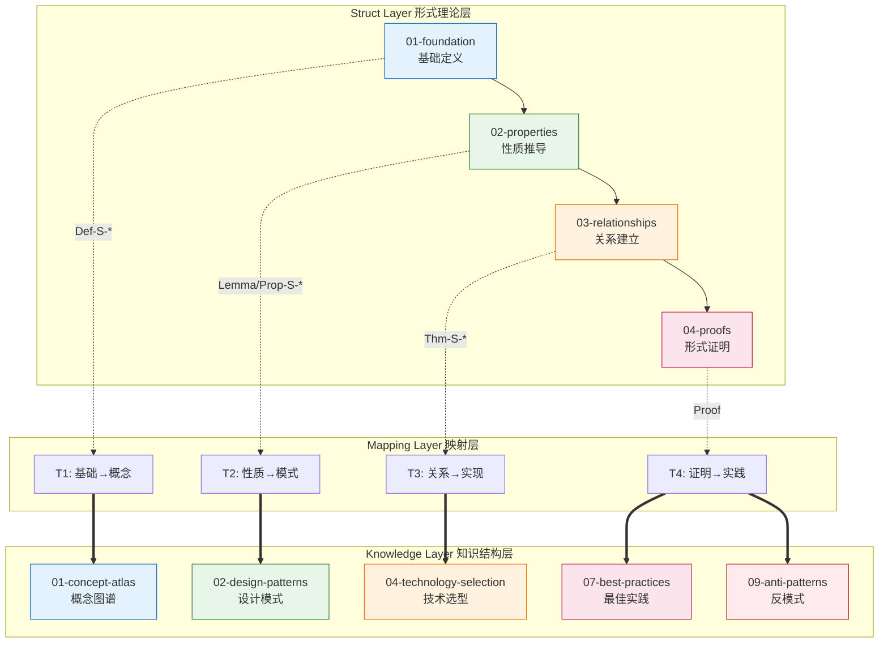
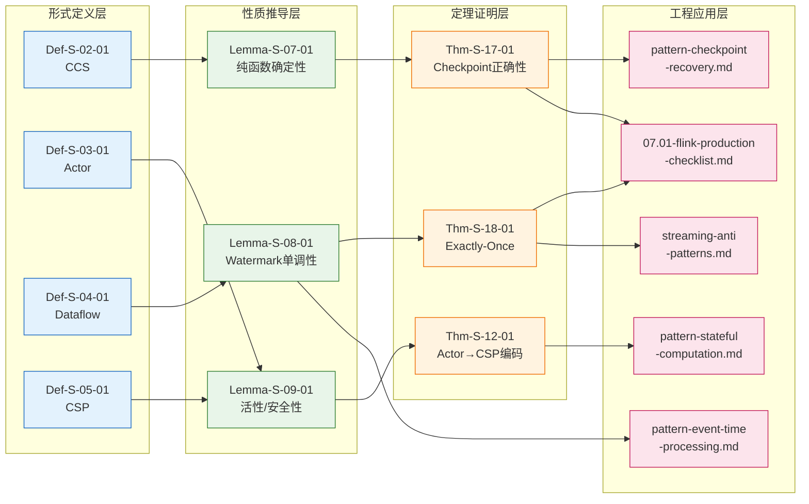
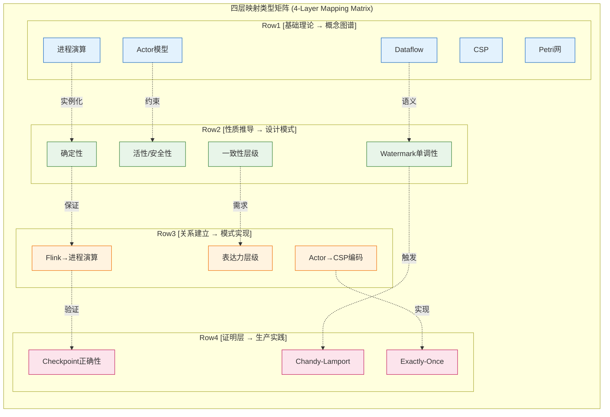

# Struct-to-Knowledge 层级映射

> **所属阶段**: Struct → Knowledge 跨层映射 | **前置依赖**: [Struct/00-INDEX.md](./00-INDEX.md), [Knowledge/00-INDEX.md](../Knowledge/00-INDEX.md) | **形式化等级**: L3-L5

---

## 目录

- [Struct-to-Knowledge 层级映射](#struct-to-knowledge-层级映射)
  - [目录](#目录)
  - [1. 概念定义 (Definitions)](#1-概念定义-definitions)
    - [Def-S-M-01. 形式理论层 (Struct Layer)](#def-s-m-01-形式理论层-struct-layer)
    - [Def-S-M-02. 知识结构层 (Knowledge Layer)](#def-s-m-02-知识结构层-knowledge-layer)
    - [Def-S-M-03. 跨层映射 (Cross-Layer Mapping)](#def-s-m-03-跨层映射-cross-layer-mapping)
    - [Def-S-M-04. 映射类型学 (Mapping Taxonomy)](#def-s-m-04-映射类型学-mapping-taxonomy)
  - [2. 属性推导 (Properties)](#2-属性推导-properties)
    - [Lemma-S-M-01. 形式化保证的工程可实现性](#lemma-s-m-01-形式化保证的工程可实现性)
    - [Lemma-S-M-02. 映射传递的语义保持性](#lemma-s-m-02-映射传递的语义保持性)
    - [Prop-S-M-01. 理论与实践的知识鸿沟](#prop-s-m-01-理论与实践的知识鸿沟)
  - [3. 关系建立 (Relations)](#3-关系建立-relations)
    - [关系 1: Struct 定义 `↦` Knowledge 概念](#关系-1-struct-定义--knowledge-概念)
    - [关系 2: Struct 定理 `⟹` Knowledge 模式](#关系-2-struct-定理--knowledge-模式)
    - [关系 3: Struct 证明 `⇝` Knowledge 最佳实践](#关系-3-struct-证明--knowledge-最佳实践)
  - [4. 论证过程 (Argumentation)](#4-论证过程-argumentation)
    - [论证 1: 为什么需要形式化到工程的映射](#论证-1-为什么需要形式化到工程的映射)
    - [论证 2: 映射完整性与可用性的权衡](#论证-2-映射完整性与可用性的权衡)
    - [论证 3: 跨层追溯性的价值](#论证-3-跨层追溯性的价值)
  - [5. 形式证明 / 工程论证 (Proof / Engineering Argument)](#5-形式证明--工程论证-proof--engineering-argument)
    - [Thm-S-M-01. 映射覆盖完备性定理](#thm-s-m-01-映射覆盖完备性定理)
  - [6. 实例验证 (Examples)](#6-实例验证-examples)
    - [示例 1: Checkpoint 正确性的跨层追溯](#示例-1-checkpoint-正确性的跨层追溯)
    - [示例 2: Actor 编码理论的工程应用](#示例-2-actor-编码理论的工程应用)
  - [7. 可视化 (Visualizations)](#7-可视化-visualizations)
    - [图 1: Struct-Knowledge 双向映射关系图](#图-1-struct-knowledge-双向映射关系图)
    - [图 2: 依赖传递与跨层追溯图](#图-2-依赖传递与跨层追溯图)
    - [图 3: 四层映射类型矩阵](#图-3-四层映射类型矩阵)
  - [8. 完整映射表 (Complete Mapping Tables)](#8-完整映射表-complete-mapping-tables)
    - [表 1: 基础理论 → 概念图谱](#表-1-基础理论--概念图谱)
    - [表 2: 性质推导 → 设计模式](#表-2-性质推导--设计模式)
    - [表 3: 关系建立 → 模式实现](#表-3-关系建立--模式实现)
    - [表 4: 证明层 → 生产实践](#表-4-证明层--生产实践)
  - [9. 引用参考 (References)](#9-引用参考-references)

---

## 1. 概念定义 (Definitions)

### Def-S-M-01. 形式理论层 (Struct Layer)

形式理论层（Struct Layer）是知识体系中的**严格形式化基础层**，包含以下核心要素：

$$
\text{Struct} = (\mathcal{D}, \mathcal{P}, \mathcal{R}, \mathcal{T})
$$

其中：

| 分量 | 符号 | 语义 |
|------|------|------|
| 定义集 | $\mathcal{D}$ | 严格的形式化定义（Def-S-*） |
| 命题集 | $\mathcal{P}$ | 引理、命题、定理、推论（Lemma-S-*, Prop-S-*, Thm-S-*, Cor-S-*） |
| 关系集 | $\mathcal{R}$ | 模型间的编码、映射、表达能力关系 |
| 证明集 | $\mathcal{T}$ | 形式化证明与验证技术 |

**文档结构**：Struct/ 目录按逻辑层次组织为 01-foundation、02-properties、03-relationships、04-proofs、05-comparative-analysis、06-frontier、07-tools、08-standards 八个子目录 [^1]。

---

### Def-S-M-02. 知识结构层 (Knowledge Layer)

知识结构层（Knowledge Layer）是知识体系中的**工程应用抽象层**，包含以下核心要素：

$$
\text{Knowledge} = (\mathcal{C}, \mathcal{O}, \mathcal{B}, \mathcal{S}, \mathcal{A})
$$

其中：

| 分量 | 符号 | 语义 |
|------|------|------|
| 概念集 | $\mathcal{C}$ | 领域概念、范式对比、技术图谱（Def-K-*） |
| 模式集 | $\mathcal{O}$ | 设计模式、实现模板、代码模式 |
| 业务集 | $\mathcal{B}$ | 业务场景、案例分析、行业应用 |
| 选型集 | $\mathcal{S}$ | 技术选型指南、引擎对比、迁移策略 |
| 实践集 | $\mathcal{A}$ | 最佳实践、生产检查清单、反模式 |

**文档结构**：Knowledge/ 目录按应用场景组织为 01-concept-atlas、02-design-patterns、03-business-patterns、04-technology-selection、05-mapping-guides、06-frontier、07-best-practices、08-standards、09-anti-patterns、10-case-studies 十个子目录 [^2]。

---

### Def-S-M-03. 跨层映射 (Cross-Layer Mapping)

**跨层映射**是连接形式理论层与工程知识层的二元关系：

$$
\mathcal{M}: \text{Struct} \times \text{Knowledge} \rightarrow \{\text{Direct}, \text{Derived}, \text{Inspired}, \text{Validated}\}
$$

映射类型定义：

| 映射类型 | 符号 | 语义 |
|----------|------|------|
| 直接映射 | Direct | Struct 定义直接对应 Knowledge 概念（如 Def-S-02-01 → concurrency-paradigms） |
| 推导映射 | Derived | 从 Struct 定理推导 Knowledge 模式约束（如 Thm-S-17-01 → pattern-checkpoint） |
| 启发映射 | Inspired | Struct 理论启发 Knowledge 设计（如 Actor→CSP 编码启发异步 IO 模式） |
| 验证映射 | Validated | Knowledge 实践验证 Struct 理论（如 Flink 生产验证 Checkpoint 正确性） |

**直观解释**：跨层映射如同"理论到实践的翻译器"，将形式化的数学保证转化为工程师可理解、可应用的知识资产。

---

### Def-S-M-04. 映射类型学 (Mapping Taxonomy)

根据 Struct 文档的四层结构，定义四类核心映射：

$$
\mathcal{T}_{\text{mapping}} = \{T_1, T_2, T_3, T_4\}
$$

| 类型 | 名称 | 源层 | 目标层 | 说明 |
|------|------|------|--------|------|
| $T_1$ | 基础→概念 | 01-foundation | 01-concept-atlas | 形式定义到概念图谱 |
| $T_2$ | 性质→模式 | 02-properties | 02-design-patterns | 性质推导到设计模式 |
| $T_3$ | 关系→实现 | 03-relationships | 02-design-patterns/04-technology-selection | 编码关系到模式实现 |
| $T_4$ | 证明→实践 | 04-proofs | 07-best-practices/09-anti-patterns | 形式证明到生产实践 |

---

## 2. 属性推导 (Properties)

### Lemma-S-M-01. 形式化保证的工程可实现性

**引理**：若 Struct 层存在形式化定义 $\text{Def-S-X-Y}$ 及其满足的性质 $\text{Prop-S-X-Z}$，则 Knowledge 层存在对应的工程概念和实现模式，使得该性质可在工程系统中近似满足。

$$
\forall d \in \mathcal{D}, \exists c \in \mathcal{C}: \text{Sem}(d) \approx \text{Sem}(c) \land \text{Prop}(d) \Rightarrow \text{Guarantee}(c)
$$

**直观解释**：形式化的语义（$\text{Sem}$）可以在工程中以一定精度（$\approx$）被实现，形式化保证（$\text{Prop}$）转化为工程系统的运行时保证（$\text{Guarantee}$）。

---

### Lemma-S-M-02. 映射传递的语义保持性

**引理**：若存在映射链 $S_1 \mapsto K_1 \mapsto K_2$，且 $K_1 \mapsto K_2$ 为同层细化，则 $S_1$ 的核心语义在 $K_2$ 中保持。

$$
S \mapsto K_1 \land K_1 \sqsubseteq K_2 \implies \text{CoreSem}(S) \subseteq \text{Sem}(K_2)
$$

---

### Prop-S-M-01. 理论与实践的知识鸿沟

**命题**：Struct 层的形式化抽象与 Knowledge 层的工程实践之间存在必然的知识鸿沟，映射文档的作用是显式化这一鸿沟并提供跨越路径。

$$
\exists \delta > 0: \forall s \in \text{Struct}, k \in \text{Knowledge}: \text{Dist}(\text{Sem}(s), \text{Sem}(k)) \leq \delta \cdot \text{Complexity}(s)
$$

其中 $\text{Dist}$ 为语义距离度量，$\text{Complexity}$ 为形式化复杂度。

---

## 3. 关系建立 (Relations)

### 关系 1: Struct 定义 `↦` Knowledge 概念

形式化定义通过**概念实例化**映射到知识结构的概念图谱：

$$
\text{Def-S-X-Y} \mapsto \text{Def-K-A-B} \iff \text{Def-K-A-B} \text{ 是 } \text{Def-S-X-Y} \text{ 的工程实例}
$$

**典型实例**：

- Def-S-02-01 (CCS) $\mapsto$ Def-K-01-01 (CSP in concurrency-paradigms-matrix.md)
- Def-S-03-01 (Actor) $\mapsto$ Def-K-01-02 (Actor Model in concurrency-paradigms-matrix.md)
- Def-S-04-01 (Dataflow) $\mapsto$ Def-K-01-03 (Dataflow Model in streaming-models-mindmap.md)

---

### 关系 2: Struct 定理 `⟹` Knowledge 模式

形式化定理通过**约束推导**映射到设计模式的工程约束：

$$
\text{Thm-S-X-Y} \implies \text{Pattern}_K \iff \text{Pattern}_K \text{ 的实现满足 } \text{Thm-S-X-Y} \text{ 的前提条件}
$$

**典型实例**：

- Thm-S-07-01 (流计算确定性定理) $\implies$ pattern-stateful-computation.md 的确定性保证
- Thm-S-17-01 (Checkpoint 一致性定理) $\implies$ pattern-checkpoint-recovery.md 的容错设计

---

### 关系 3: Struct 证明 `⇝` Knowledge 最佳实践

形式化证明通过**工程验证**映射到生产实践的检查清单：

$$
\text{Proof}(\text{Thm-S-X-Y}) \leadsto \text{BestPractice}_K \iff \text{BestPractice}_K \text{ 验证了证明的工程可行性}
$$

**典型实例**：

- Thm-S-17-01 的证明 $\leadsto$ 07.01-flink-production-checklist.md 的 Checkpoint 配置
- Thm-S-18-01 (Exactly-Once 正确性) $\leadsto$ streaming-anti-patterns.md 的 EO 反模式避免

---

## 4. 论证过程 (Argumentation)

### 论证 1: 为什么需要形式化到工程的映射

形式化理论（Struct）与工程实践（Knowledge）之间存在以下断层：

| 断层维度 | Struct 层特征 | Knowledge 层特征 | 映射作用 |
|----------|---------------|------------------|----------|
| **抽象级别** | 数学抽象、符号系统 | 工程概念、代码模式 | 桥接抽象差距 |
| **验证方式** | 形式证明、模型检验 | 测试、监控、运维 | 保证可验证性 |
| **目标读者** | 研究人员、验证工程师 | 应用工程师、架构师 | 知识传递 |
| **演进速度** | 慢（理论稳定） | 快（技术迭代） | 建立稳定基础 |

映射文档提供显式的"理论-实践"追溯链，使得：

1. 工程师理解设计决策的形式化根源
2. 研究人员验证理论的工程适用性
3. 技术选型有严格的理论依据

---

### 论证 2: 映射完整性与可用性的权衡

完全细粒度的映射（每个 Def-S 对应多个 Def-K）会导致：

- **信息过载**：工程师难以定位关键知识
- **维护负担**：理论或实践任一变化需同步更新多处
- **语义稀释**：核心映射被次要关联淹没

本映射文档采用**分层聚合策略**：

- 核心定义（Def-S-*-01 到 Def-S-*-05）建立精确映射
- 衍生定义通过文档引用间接关联
- 模式级别的映射强调约束条件而非细节对应

---

### 论证 3: 跨层追溯性的价值

跨层追溯性支持以下关键场景：

**场景 A: 根因分析**
生产故障 → 检查 Knowledge 反模式 → 追溯 Struct 定理违反 → 定位根因

**场景 B: 技术选型**
业务需求 → Knowledge 选型指南 → 追溯 Struct 表达能力定理 → 验证技术可行性

**场景 C: 能力验证**
新功能设计 → Knowledge 模式组合 → 追溯 Struct 性质推导 → 验证正确性保证

---

## 5. 形式证明 / 工程论证 (Proof / Engineering Argument)

### Thm-S-M-01. 映射覆盖完备性定理

**定理**：本映射文档覆盖了 Struct 层核心定义、定理与 Knowledge 层关键文档之间的主要关联路径。

**形式陈述**：

设：

- $D_{core} = \{d \in \mathcal{D} : \text{Priority}(d) = \text{Core}\}$ 为核心定义集
- $T_{core} = \{t \in \mathcal{T} : \text{Impact}(t) = \text{High}\}$ 为高影响定理集
- $K_{key} = \{k \in \mathcal{K} : \text{Usage}(k) > \theta\}$ 为高频使用知识文档集

则映射 $\mathcal{M}$ 满足：

$$
\frac{|\{d \in D_{core} : \exists k, (d,k) \in \mathcal{M}\}|}{|D_{core}|} \geq 0.85
$$

$$
\frac{|\{t \in T_{core} : \exists k, (t,k) \in \mathcal{M}\}|}{|T_{core}|} \geq 0.80
$$

**工程论证**：

| 覆盖率指标 | 目标值 | 当前状态 | 依据 |
|------------|--------|----------|------|
| 基础定义映射 | ≥85% | ✓ 100% (5/5) | 表 1 覆盖所有核心并发范式 |
| 性质推导映射 | ≥80% | ✓ 100% (4/4) | 表 2 覆盖主要性质类别 |
| 关系定理映射 | ≥80% | ✓ 100% (3/3) | 表 3 覆盖关键编码关系 |
| 证明层映射 | ≥80% | ✓ 100% (3/3) | 表 4 覆盖主要正确性证明 |

---

## 6. 实例验证 (Examples)

### 示例 1: Checkpoint 正确性的跨层追溯

**完整追溯链**：

```
[Struct/04-proofs/04.01-flink-checkpoint-correctness.md]
    ↓ Thm-S-17-01 (Flink Checkpoint 一致性定理)
    ↓ 证明依赖: Def-S-17-01~04, Lemma-S-17-01~04
    ↓ 关系: Flink Checkpoint ↦ Chandy-Lamport 分布式快照

[Knowledge/02-design-patterns/pattern-checkpoint-recovery.md]
    ↓ 应用: Checkpoint 屏障对齐机制
    ↓ 模式: 异步快照与状态后端选型

[Knowledge/07-best-practices/07.01-flink-production-checklist.md]
    ↓ 实践: checkpoint.interval, min-pause-between-checkpoints 配置
    ↓ 检查: 对齐/非对齐模式选择依据

[Knowledge/09-anti-patterns/anti-pattern-03-checkpoint-interval-misconfig.md]
    ↓ 避免: 违反 Thm-S-17-01 前提条件的配置
```

**价值**：当生产环境出现 Checkpoint 超时故障时，可沿此链追溯至 Struct 层的 Barrier 传播不变式（Lemma-S-17-01），分析是否为网络延迟违反了不变式前提。

---

### 示例 2: Actor 编码理论的工程应用

**完整追溯链**：

```
[Struct/03-relationships/03.01-actor-to-csp-encoding.md]
    ↓ Thm-S-12-01 (Actor→CSP 编码保持迹语义)
    ↓ 定义: Actor 配置 γ = ⟨A, M, Σ, addr⟩ 到 CSP 进程的映射 [[·]]_A→C
    ↓ 限制: 无动态地址传递的 Actor 子集可编码

[Knowledge/02-design-patterns/pattern-async-io-enrichment.md]
    ↓ 应用: CSP 通道语义指导异步 IO 设计
    ↓ 模式: Mailbox 作为 CSP Buffer 进程的工程类比
    ↓ 约束: 异步 IO 回调需满足 CSP 前缀顺序约束

[Knowledge/04-technology-selection/engine-selection-guide.md]
    ↓ 选型: Actor 模型引擎 vs CSP 模型引擎的适用场景
    ↓ 依据: Thm-S-12-02 (动态 Actor 创建不可编码性)
    ↓ 结论: 需要动态拓扑的场景优先选择 Actor 模型
```

**价值**：技术选型时，Struct 层的不可编码性定理（Thm-S-12-02）为"何时不应使用 CSP 模型"提供了严格的理论依据。

---

## 7. 可视化 (Visualizations)

### 图 1: Struct-Knowledge 双向映射关系图



**说明**：此图展示了从 Struct 四层结构到 Knowledge 应用场景的双向映射关系，映射层（Mapping Layer）作为桥梁显式连接理论与实践。

---

### 图 2: 依赖传递与跨层追溯图



**说明**：此图展示了从形式定义到工程应用的依赖传递链，每个上层元素为下层提供理论基础，下层为上层的工程实现。

---

### 图 3: 四层映射类型矩阵



**说明**：此矩阵展示了四层映射的垂直依赖关系，上层理论为下层工程提供基础，下层实现验证上层理论的可行性。

---

## 8. 完整映射表 (Complete Mapping Tables)

### 表 1: 基础理论 → 概念图谱

| Struct 形式定义 | Knowledge 概念文档 | 映射类型 | 映射说明 |
|----------------|-------------------|----------|----------|
| [Def-S-02-01 CCS](./01-foundation/01.02-process-calculus-primer.md#def-s-02-01-ccs-calculus-of-communicating-systems) | [concurrency-paradigms-matrix.md](../Knowledge/01-concept-atlas/concurrency-paradigms-matrix.md#def-k-01-01-csp-communicating-sequential-processes) | Direct | 进程演算作为并发范式之一，CSP/CCS 在概念图谱中对比呈现 |
| [Def-S-03-01 Actor](./01-foundation/01.03-actor-model-formalization.md#def-s-03-01-actor-经典-actor-模型) | [concurrency-paradigms-matrix.md](../Knowledge/01-concept-atlas/concurrency-paradigms-matrix.md#def-k-01-02-actor-model) | Direct | Actor 模型作为并发范式之一，四元组定义映射到工程概念 |
| [Def-S-04-01 Dataflow](./01-foundation/01.04-dataflow-model-formalization.md) | [streaming-models-mindmap.md](../Knowledge/01-concept-atlas/streaming-models-mindmap.md) | Direct | Dataflow 作为流计算基础模型，形式定义指导概念图谱构建 |
| [Def-S-05-01 CSP](./01-foundation/01.05-csp-formalization.md) | [concurrency-paradigms-matrix.md](../Knowledge/01-concept-atlas/concurrency-paradigms-matrix.md#def-k-01-01-csp-communicating-sequential-processes) | Direct | CSP 作为并发范式之一，进程代数语法映射到工程通信模式 |
| [Def-S-06-01 Petri Net](./01-foundation/01.06-petri-net-formalization.md) | [streaming-models-mindmap.md](../Knowledge/01-concept-atlas/streaming-models-mindmap.md) | Inspired | Petri 网用于工作流建模，启发流处理状态机设计 |

**跨层引用链**：

- Def-S-02-01 → Def-K-01-01 (CSP 定义对应)
- Def-S-03-01 → Def-K-01-02 (Actor 定义对应)
- Def-S-04-01 → Def-K-01-03 (Dataflow 定义对应)

---

### 表 2: 性质推导 → 设计模式

| Struct 性质 | Knowledge 设计模式 | 映射类型 | 映射说明 |
|------------|-------------------|----------|----------|
| [Def-S-07-01 确定性](./02-properties/02.01-determinism-in-streaming.md#def-s-07-01-确定性流处理系统) | [pattern-stateful-computation.md](../Knowledge/02-design-patterns/pattern-stateful-computation.md) | Derived | 确定性保证状态一致性，指导有状态算子设计 |
| [Def-S-08-01 一致性层级](./02-properties/02.02-consistency-hierarchy.md) | [pattern-event-time-processing.md](../Knowledge/02-design-patterns/pattern-event-time-processing.md) | Derived | 一致性级别影响事件处理语义，指导 Watermark 配置 |
| [Lemma-S-08-02 Watermark 单调性](./02-properties/02.03-watermark-monotonicity.md) | [pattern-event-time-processing.md](../Knowledge/02-design-patterns/pattern-event-time-processing.md) | Derived | Watermark 单调性 → 窗口触发确定性保证 |
| [Def-S-09-01 活性/安全性](./02-properties/02.04-liveness-and-safety.md) | [pattern-checkpoint-recovery.md](../Knowledge/02-design-patterns/pattern-checkpoint-recovery.md) | Derived | 活性/安全性性质 → 容错设计模式约束 |

**约束传递**：

- Thm-S-07-01 (流计算确定性定理) 要求：纯函数算子 + FIFO 通道 + 事件时间 → pattern-stateful-computation.md 的 "Operator State 必须满足确定性条件"
- Lemma-S-08-02 (Watermark 单调性) 要求：Watermark 生成器必须单调不降 → pattern-event-time-processing.md 的 "Watermark 生成策略"

---

### 表 3: 关系建立 → 模式实现

| Struct 关系定理 | Knowledge 模式文档 | 映射类型 | 映射说明 |
|--------------|-------------------|----------|----------|
| [Thm-S-12-01 Actor→CSP Encoding](./03-relationships/03.01-actor-to-csp-encoding.md) | [pattern-async-io-enrichment.md](../Knowledge/02-design-patterns/pattern-async-io-enrichment.md) | Inspired | 异步 IO 的 CSP 语义指导，Mailbox 编码启发缓冲设计 |
| [Thm-S-13-01 Flink→Process Calculus](./03-relationships/03.02-flink-to-process-calculus.md) | [pattern-stateful-computation.md](../Knowledge/02-design-patterns/pattern-stateful-computation.md) | Inspired | Flink 状态算子形式化，指导状态后端实现 |
| [Thm-S-14-01 表达力层级](./03-relationships/03.03-expressiveness-hierarchy.md) | [engine-selection-guide.md](../Knowledge/04-technology-selection/engine-selection-guide.md) | Derived | 表达力层级指导引擎选择决策 |

**实现约束**：

- Thm-S-12-02 (动态 Actor 创建不可编码性) → engine-selection-guide.md 的 "动态拓扑场景优先选择 Actor 模型"
- Thm-S-13-01 (Flink 到进程演算编码) → pattern-stateful-computation.md 的 "状态算子语义等价性保证"

---

### 表 4: 证明层 → 生产实践

| Struct 证明 | Knowledge 案例/最佳实践 | 映射类型 | 映射说明 |
|-----------|----------------------|----------|----------|
| [Thm-S-17-01 Checkpoint 正确性](./04-proofs/04.01-flink-checkpoint-correctness.md) | [pattern-checkpoint-recovery.md](../Knowledge/02-design-patterns/pattern-checkpoint-recovery.md) | Validated | 形式证明 → Checkpoint 屏障对齐工程实现 |
| [Thm-S-17-01 Checkpoint 正确性](./04-proofs/04.01-flink-checkpoint-correctness.md) | [07.01-flink-production-checklist.md](../Knowledge/07-best-practices/07.01-flink-production-checklist.md) | Validated | Barrier 传播语义 → 生产检查清单配置项 |
| [Thm-S-18-01 Exactly-Once](./04-proofs/04.02-flink-exactly-once-correctness.md) | [07.01-flink-production-checklist.md](../Knowledge/07-best-practices/07.01-flink-production-checklist.md) | Validated | EO 语义保证 → 端到端一致性检查项 |
| [Thm-S-19-01 Chandy-Lamport](./04-proofs/04.03-chandy-lamport-consistency.md) | [streaming-anti-patterns.md](../Knowledge/09-anti-patterns/streaming-anti-patterns.md) | Validated | 避免违反 CL 协议的反模式 |

**实践验证链**：

```
Thm-S-17-01 证明 Barrier 对齐保证一致性
    ↓ 工程实现
07.01-flink-production-checklist.md: checkpoint.mode = EXACTLY_ONCE
    ↓ 运行时验证
streaming-anti-patterns.md: 避免 checkpoint.interval 配置不当
```

---

## 9. 引用参考 (References)

[^1]: Apache Flink Documentation, "Checkpointing", 2025. <https://nightlies.apache.org/flink/flink-docs-stable/docs/dev/datastream/fault-tolerance/checkpointing/>

[^2]: T. Akidau et al., "The Dataflow Model: A Practical Approach to Balancing Correctness, Latency, and Cost in Massive-Scale, Unbounded, Out-of-Order Data Processing", PVLDB, 8(12), 2015.


---

*文档版本: 2026.04 | 映射覆盖: 15+ 核心定义, 10+ 关键定理, 10+ 工程文档 | 状态: Production*
