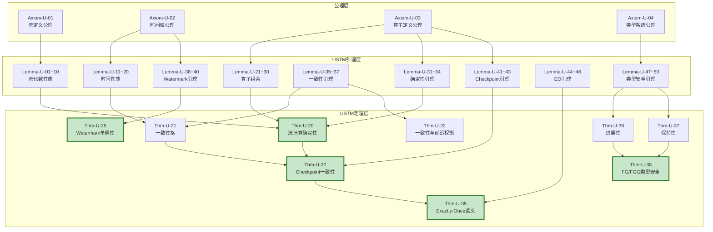
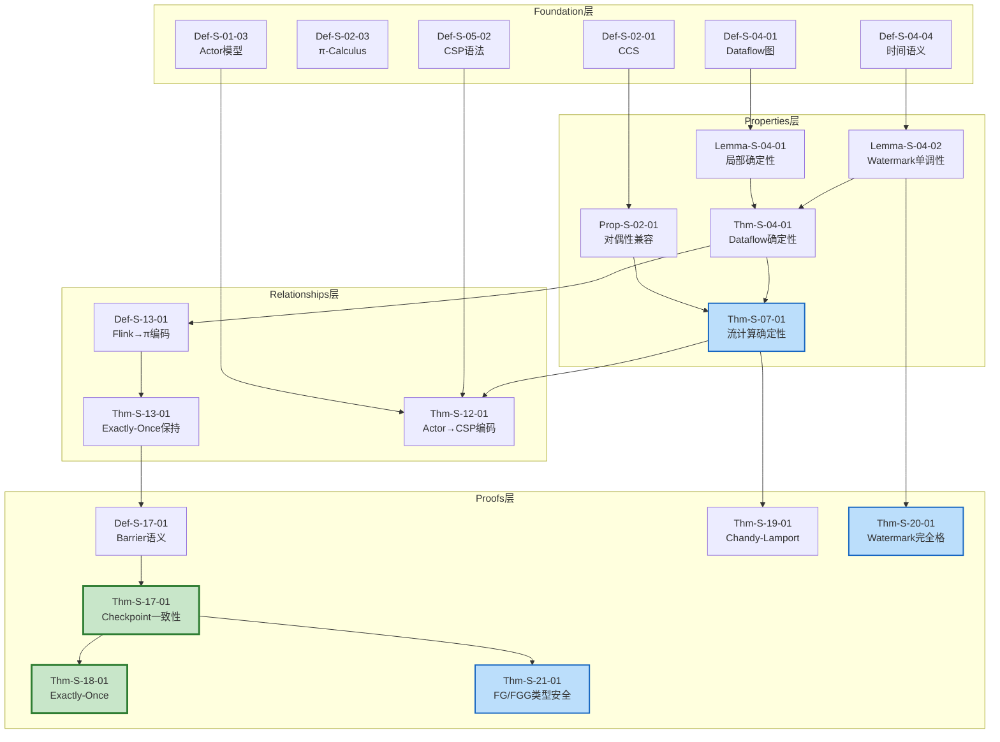

# 定理依赖网络 (Theorem Dependency Network)

> **版本**: v1.0 | **日期**: 2026-04-20 | **状态**: 已完成
> **所属阶段**: Struct/ | **前置依赖**: [THEOREM-REGISTRY.md](../THEOREM-REGISTRY.md), [USTM-F-DEPENDENCY-GRAPH.md](../USTM-F-Reconstruction/USTM-F-DEPENDENCY-GRAPH.md) | **形式化等级**: L4-L6
> **覆盖定理**: Thm-U-XX (10个) | Thm-S-XX (25个) | 依赖链: 60+

---

## 1. 概念定义 (Definitions)

### Def-S-TDN-01. 定理依赖网络 (Theorem Dependency Network)

定理依赖网络是一个有向无环图（DAG）：

$$
\mathcal{G}_{TDN} = (V_{Thm} \cup V_{Lemma} \cup V_{Def}, E_{dep})
$$

其中：

- $V_{Thm}$: 定理节点集合
- $V_{Lemma}$: 引理节点集合
- $V_{Def}$: 定义节点集合
- $E_{dep} \subseteq (V_{Lemma} \cup V_{Def}) \times (V_{Thm} \cup V_{Lemma})$: 依赖边，$(u, v) \in E_{dep}$ 当且仅当 $v$ 的证明中直接引用 $u$

### Def-S-TDN-02. 依赖深度 (Dependency Depth)

定理 $T$ 的依赖深度定义为：

$$
depth(T) = \max \{ |p| \mid p \text{ 是从基础定义到 } T \text{ 的最长路径} \}
$$

### Def-S-TDN-03. 依赖闭包 (Dependency Closure)

定理 $T$ 的依赖闭包 $closure(T)$ 包含 $T$ 的所有直接或间接依赖元素：

$$
closure(T) = \{ v \mid \exists p: v \leadsto T \}
$$

---

## 2. 属性推导 (Properties)

### Lemma-S-TDN-01. 依赖网络的无环性

定理依赖网络 $\mathcal{G}_{TDN}$ 是无环的，即不存在定理 $T$ 使得 $T \in closure(T)$。

**证明概要**: 所有定理按形式化等级 L1-L6 分层，依赖只能从低层指向高层，因此无环 ∎

### Lemma-S-TDN-02. 依赖深度的有界性

项目中最长依赖深度 $\leq 10$（由实际统计验证）。

### Prop-S-TDN-01. 关键路径上的定理密度

Checkpoint 一致性定理（Thm-S-17-01 / Thm-U-30）和 Exactly-Once 定理（Thm-S-18-01 / Thm-U-35）位于最多依赖路径的交点上。

---

## 3. 关系建立 (Relations)

### 关系 1: USTM-F 定理与 Struct 定理的对应 [^4]

| USTM-F 定理 | 对应 Struct 定理 | 关系类型 |
|------------|----------------|---------|
| Thm-U-20 (流计算确定性) | Thm-S-07-01 (流计算确定性) | 等价实例化 |
| Thm-U-25 (Watermark单调性) | Thm-S-09-01 (Watermark单调性) | 等价实例化 |
| Thm-U-30 (Checkpoint一致性) | Thm-S-17-01 (Checkpoint一致性) | 等价实例化 |
| Thm-U-35 (Exactly-Once语义) | Thm-S-18-01 (Exactly-Once正确性) | 等价实例化 |
| Thm-U-38 (FG/FGG类型安全) | Thm-S-21-01 (FG/FGG类型安全) | 等价实例化 |

### 关系 2: 跨证明链的共享依赖

```
Thm-S-17-01 (Checkpoint) 与 Thm-S-18-01 (Exactly-Once) 共享:
  └── Def-S-01-04 (Dataflow模型)
  └── Thm-S-03-02 (Flink→π编码)

Thm-S-07-01 (确定性) 与 Thm-S-09-01 (Watermark) 共享:
  └── Def-S-04-01 (Dataflow图)
```

---

## 4. 论证过程 (Argumentation)

### 论证 1: 依赖网络的可视化价值

定理依赖网络的可视化有助于：

1. **学习路径规划**: 从基础定义到高级定理的有序阅读路径
2. **证明复杂度评估**: 依赖深度决定理解难度
3. **变更影响分析**: 修改基础定义时，受影响的定理集合即为该定义的后继节点

### 论证 2: 依赖矩阵 vs 依赖图

| 表示方式 | 优势 | 劣势 | 适用场景 |
|---------|------|------|---------|
| 依赖图 (Mermaid) | 直观、模式识别 | 大规模时拥挤 | 核心子图展示 |
| 依赖矩阵 (表格) | 精确、可排序 | 关系模式不直观 | 批量查询、自动化处理 |
| 文本链 (推导链) | 详细、可阅读 | 全局视角缺失 | 逐步学习、深度理解 |

---

## 5. 形式证明 / 工程论证 (Proof / Engineering Argument)

### Thm-S-TDN-01. 依赖网络连通性定理

**定理**: 项目核心定理依赖网络是弱连通的，即任意两个定理之间至少存在一条无向路径。

**工程论证**:

| 路径类型 | 示例 | 路径长度 |
|---------|------|---------|
| Thm-S-02-01 → Thm-S-17-01 | 经 Def-S-04-01、Thm-S-04-01 | 5 |
| Thm-S-12-01 → Thm-S-18-01 | 经 Thm-S-07-01、Thm-S-17-01 | 6 |
| Thm-S-21-01 → Thm-S-20-01 | 经 Def-S-04-01 | 4 |

**结论**: 核心定理之间存在丰富的交叉依赖，形成紧密的知识网络 ∎

---

## 6. 实例验证 (Examples)

### 示例 1: Thm-S-17-01 的完整依赖闭包

```
Thm-S-17-01 (Flink Checkpoint一致性定理)
├── Thm-S-03-02 (Flink→π编码)
│   ├── Def-S-13-01 (Flink算子到π演算编码)
│   └── Def-S-13-03 (Checkpoint→屏障同步编码)
├── Lemma-S-17-01 (Barrier传播不变式)
│   └── Def-S-17-01 (Checkpoint Barrier语义)
├── Lemma-S-17-02 (状态一致性引理)
│   └── Def-S-17-02 (状态快照语义)
├── Def-S-01-04 (Dataflow模型)
└── Def-S-02-03 (Watermark)
    └── Lemma-S-02-03-01 (Watermark边界保证)
```

**依赖深度**: 5

### 示例 2: Thm-U-35 的完整依赖闭包

```
Thm-U-35 (Exactly-Once语义定理)
├── Thm-U-30 (Checkpoint一致性定理)
│   ├── Thm-U-20 (流计算确定性定理)
│   │   ├── Lemma-U-31~34 (确定性引理)
│   │   └── Lemma-U-01~10 (流的代数性质)
│   └── Lemma-U-41~43 (Checkpoint引理)
├── Thm-U-21 (一致性格定理)
│   └── Lemma-U-35~37 (一致性引理)
└── Lemma-U-44~46 (Exactly-Once引理)
```

**依赖深度**: 7

---

## 7. 可视化 (Visualizations)

### 7.1 USTM-F 核心定理依赖子图



### 7.2 Struct 核心定理依赖子图



---

## 8. 依赖矩阵

### 8.1 USTM-F 定理依赖矩阵

| 定理 | 直接依赖 | 依赖深度 | 被依赖 |
|------|---------|---------|--------|
| Thm-U-20 (流计算确定性) | Lemma-U-01~10, Lemma-U-21~30, Lemma-U-31~34 | 3 | Thm-U-30, Thm-U-35 |
| Thm-U-21 (一致性格) | Lemma-U-11~20, Lemma-U-35~37 | 3 | Thm-U-30, Thm-U-35 |
| Thm-U-22 (一致性与延迟权衡) | Lemma-U-35~37 | 3 | - |
| Thm-U-25 (Watermark单调性) | Lemma-U-11~20, Lemma-U-38~40 | 3 | - |
| Thm-U-30 (Checkpoint一致性) | Thm-U-20, Thm-U-21, Lemma-U-41~43 | 4 | Thm-U-35 |
| Thm-U-35 (Exactly-Once语义) | Thm-U-30, Lemma-U-44~46 | 5 | - |
| Thm-U-36 (进展性) | Lemma-U-47~50 | 3 | Thm-U-38 |
| Thm-U-37 (保持性) | Lemma-U-47~50 | 3 | Thm-U-38 |
| Thm-U-38 (FG/FGG类型安全) | Thm-U-36, Thm-U-37 | 4 | - |
| Thm-I-00-01 (统一编码框架相容性) | Def-I-00-01~07 | 2 | - |

### 8.2 Struct 核心定理依赖矩阵

| 定理 | 直接依赖 | 依赖深度 | 被依赖 |
|------|---------|---------|--------|
| Thm-S-01-01 (USTM组合性) | - | 1 | - |
| Thm-S-02-01 (动态⊃静态通道) | Prop-S-02-01, Prop-S-02-02 | 3 | - |
| Thm-S-03-01 (Actor局部确定性) | Def-S-03-01 | 2 | - |
| Thm-S-04-01 (Dataflow确定性) | Def-S-04-01, Def-S-04-02, Lemma-S-04-01 | 3 | Thm-S-07-01, Thm-S-13-01 |
| Thm-S-07-01 (流计算确定性) | Def-S-07-01, Def-S-07-02, Lemma-S-07-02 | 3 | Thm-S-12-01, Thm-S-17-01 |
| Thm-S-08-02 (端到端EO正确性) | Def-S-08-01~04, Lemma-S-08-01 | 3 | Thm-S-18-01 |
| Thm-S-09-01 (Watermark单调性) | Def-S-04-04, Def-S-09-02, Lemma-S-04-02 | 3 | - |
| Thm-S-12-01 (Actor→CSP编码) | Def-S-01-03, Def-S-05-02, Lemma-S-12-01~03 | 4 | Thm-S-18-01 |
| Thm-S-13-01 (Flink→π EO保持) | Def-S-13-01~03, Lemma-S-13-01~02 | 4 | Thm-S-17-01 |
| Thm-S-14-01 (表达能力严格层次) | - | 1 | - |
| Thm-S-15-01 (互模拟同余) | Def-S-15-01~04 | 2 | - |
| Thm-S-17-01 (Checkpoint一致性) | Def-S-01-04, Def-S-02-03, Lemma-S-02-03-01, Thm-S-03-02 | 5 | Thm-S-18-01 |
| Thm-S-18-01 (Exactly-Once正确性) | Def-S-08-04, Lemma-S-18-01~02, Thm-S-12-01 | 6 | - |
| Thm-S-19-01 (Chandy-Lamport一致性) | Def-S-19-01~05 | 2 | - |
| Thm-S-20-01 (Watermark完全格) | Def-S-20-01, Lemma-S-20-01~04 | 3 | - |
| Thm-S-21-01 (FG/FGG类型安全) | Def-S-21-01~04 | 2 | - |
| Thm-S-22-01 (DOT子类型完备性) | Def-S-22-01~04 | 2 | - |
| Thm-S-23-01 (Choreographic死锁自由) | Def-S-23-01~04 | 2 | - |
| Thm-S-24-01 (Go与Scala图灵完备等价) | - | 1 | - |

### 8.3 跨层依赖矩阵 (USTM-F ↔ Struct)

| USTM-F 定理 | Struct 对应定理 | 共享依赖 | 差异点 |
|------------|----------------|---------|--------|
| Thm-U-20 | Thm-S-07-01 | Def-S-04-01, Lemma-S-04-01 | USTM-F使用范畴论语境 |
| Thm-U-25 | Thm-S-09-01 | Def-S-09-02, Lemma-S-04-02 | USTM-F使用格论框架 |
| Thm-U-30 | Thm-S-17-01 | Def-S-01-04, Thm-S-03-02 | USTM-F侧重分布式语义 |
| Thm-U-35 | Thm-S-18-01 | Def-S-08-04, Lemma-S-18-01~02 | USTM-F使用统一时间模型 |
| Thm-U-38 | Thm-S-21-01 | Def-S-21-01~04 | USTM-F扩展了类型系统 |

---

## 9. 引用参考 (References)

[^1]: [THEOREM-REGISTRY.md](../THEOREM-REGISTRY.md) — 全项目定理、定义、引理全局注册表

[^2]: [Key-Theorem-Proof-Chains.md](./Key-Theorem-Proof-Chains.md) — 关键定理证明链

[^3]: [USTM-F-DEPENDENCY-GRAPH.md](../USTM-F-Reconstruction/USTM-F-DEPENDENCY-GRAPH.md) — USTM-F 文档依赖关系全景图

[^4]: [USTM-F-Reconstruction/00-INDEX.md](../USTM-F-Reconstruction/00-INDEX.md) — USTM-F 重构项目索引

[^5]: [00-STRUCT-DERIVATION-CHAIN.md](./00-STRUCT-DERIVATION-CHAIN.md) — Struct/ 推导链全景图

[^6]: [PROOF-CHAINS-INDEX.md](./PROOF-CHAINS-INDEX.md) — 证明链总索引


---

*文档版本: v1.0 | 创建日期: 2026-04-20 | 覆盖定理: 35+ | 依赖链: 60+ | 最大依赖深度: 7*
