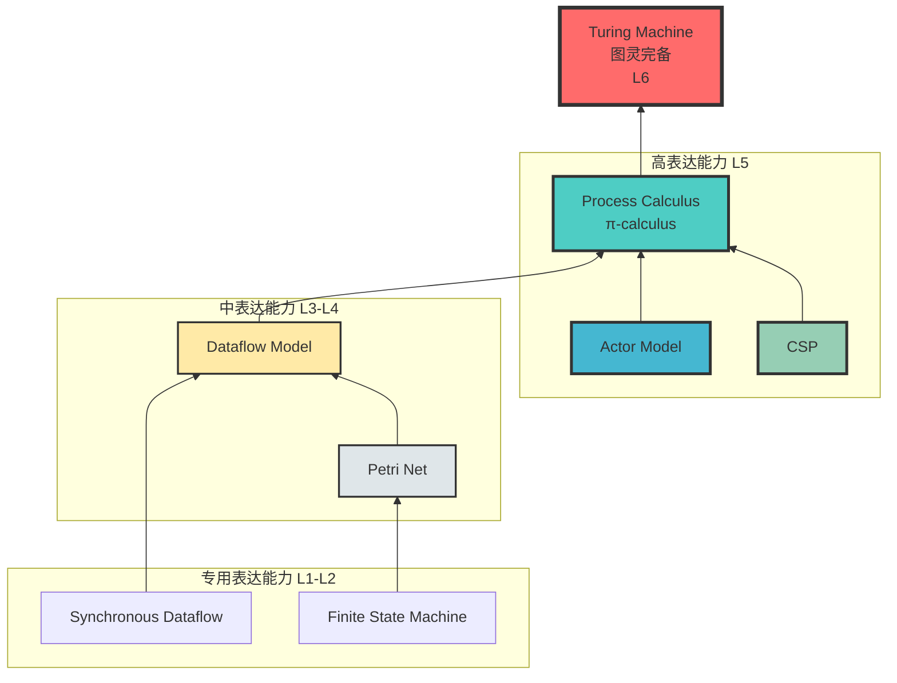
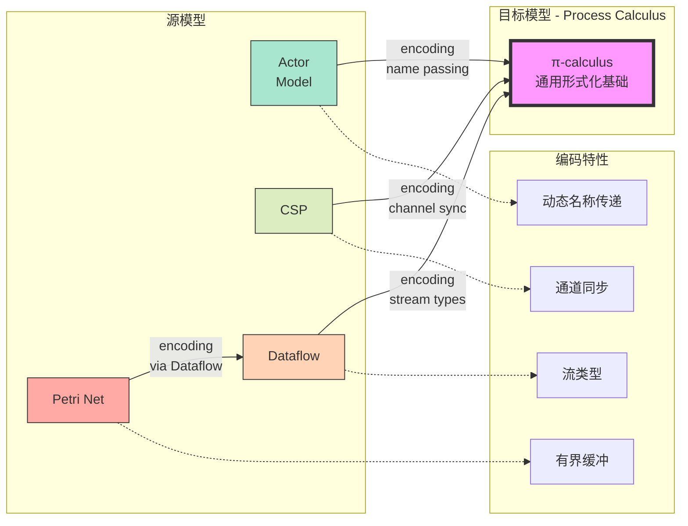
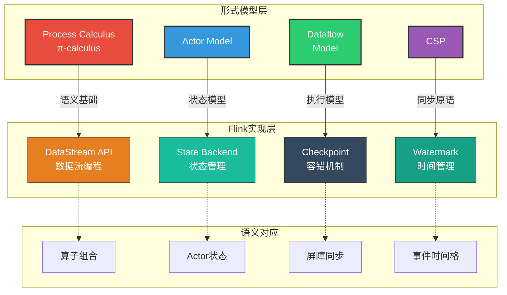
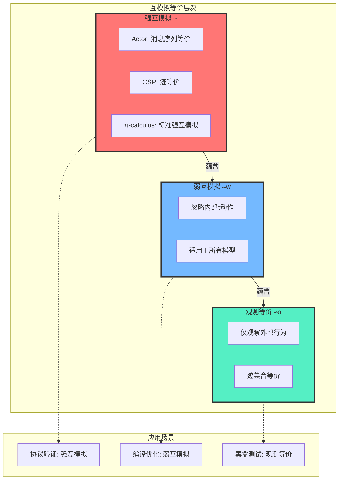
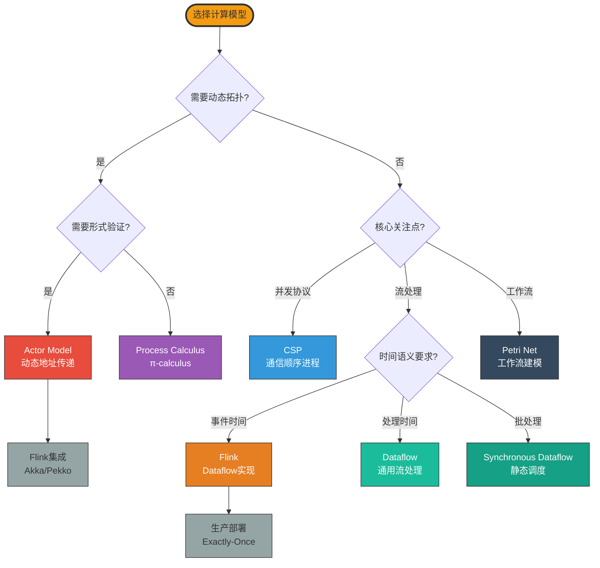

# 统一模型关系图谱

> 所属阶段: Struct/ | 前置依赖: [01.01-unified-streaming-theory.md](./01-foundation/01.01-unified-streaming-theory.md), [03.03-expressiveness-hierarchy.md](./03-relationships/03.03-expressiveness-hierarchy.md), [03.04-bisimulation-equivalences.md](./03-relationships/03.04-bisimulation-equivalences.md) | 形式化等级: L4-L5

---

## 1. 概念定义 (Definitions)

### Def-U-01: 表达力层级 (Expressiveness Hierarchy)

表达力层级是计算模型按表达能力形式化的偏序关系，记为 $\mathcal{E} = (\mathcal{M}, \preceq_{exp})$，其中：

- $\mathcal{M}$ 是计算模型的集合
- $\preceq_{exp}$ 是表达力预序，定义为：$M_1 \preceq_{exp} M_2$ 当且仅当存在从 $M_1$ 到 $M_2$ 的完备编码 $\llbracket \cdot \rrbracket: M_1 \to M_2$

### Def-U-02: 编码完备性 (Encoding Completeness)

编码函数 $\llbracket \cdot \rrbracket: M_{src} \to M_{tgt}$ 称为**完备的**，当且仅当满足：

1. **操作对应性**: $\forall P \in M_{src}, \forall a \in Act(P): P \xrightarrow{a} P' \implies \llbracket P \rrbracket \xrightarrow{\hat{a}} \llbracket P' \rrbracket$
2. **行为保持性**: $\llbracket P \rrbracket$ 在 $M_{tgt}$ 中的可观察行为与 $P$ 在 $M_{src}$ 中的可观察行为双模拟等价
3. **组合性**: $\llbracket P \mid Q \rrbracket \approx \llbracket P \rrbracket \mid \llbracket Q \rrbracket$

完备性分为三个等级：
- **完备** (Complete): 满足上述全部条件
- **部分** (Partial): 满足核心语义保持，但某些边界特性可能丢失
- **近似** (Approximate): 仅保证近似等价，用于工程实践

### Def-U-03: 互模拟等价 (Bisimulation Equivalence)

对于标记迁移系统 $(S, Act, \to)$，二元关系 $\mathcal{R} \subseteq S \times S$ 称为**强互模拟**，当且仅当：

$$\forall (s_1, s_2) \in \mathcal{R}, \forall a \in Act:$$
$$s_1 \xrightarrow{a} s_1' \implies \exists s_2': s_2 \xrightarrow{a} s_2' \land (s_1', s_2') \in \mathcal{R}$$
$$\land$$
$$s_2 \xrightarrow{a} s_2' \implies \exists s_1': s_1 \xrightarrow{a} s_1' \land (s_1', s_2') \in \mathcal{R}$$

最大强互模拟 $\sim$ 定义为：$s_1 \sim s_2 \iff \exists \mathcal{R}: (s_1, s_2) \in \mathcal{R} \land \mathcal{R}\text{是强互模拟}$

### Def-U-04: 弱互模拟 (Weak Bisimulation)

**弱互模拟** $\approx_w$ 忽略内部动作 $\tau$，定义为强互模拟在弱迁移闭包上的扩展：

$$s_1 \approx_w s_2 \iff s_1 \sim_{\Rightarrow} s_2$$

其中 $\Rightarrow$ 是弱迁移关系：$s \xRightarrow{a} s'$ 当 $a = \tau$ 时表示零个或多个 $\tau$ 迁移，当 $a \neq \tau$ 时表示 $\xrightarrow{\tau^*} \xrightarrow{a} \xrightarrow{\tau^*}$。

### Def-U-05: 观测等价 (Observational Equivalence)

**观测等价** $\approx_o$ 关注外部可观察行为，定义为：

$$s_1 \approx_o s_2 \iff \forall w \in (Act \setminus \{\tau\})^*: traces(s_1)(w) = traces(s_2)(w)$$

其中 $traces(s)(w)$ 表示从状态 $s$ 出发能执行迹 $w$ 的可能性。

---

## 2. 属性推导 (Properties)

### Prop-U-01: 表达能力单调性

**命题**: 表达力层级 $\mathcal{E}$ 满足偏序的传递性：
$$M_1 \preceq_{exp} M_2 \land M_2 \preceq_{exp} M_3 \implies M_1 \preceq_{exp} M_3$$

**直观解释**: 编码关系可以传递组合，高层模型的完备编码能够继承低层模型的编码能力。

### Prop-U-02: 互模拟层次关系

**命题**: 三种互模拟满足严格包含关系：
$$\sim \subsetneq \approx_w \subsetneq \approx_o$$

即强互模拟蕴含弱互模拟，弱互模拟蕴含观测等价，但逆命题不成立。

**证明概要**: 
- $\sim \subseteq \approx_w$: 强互模拟也是弱互模拟（取 $\tau$ 为恒等迁移）
- $\approx_w \subseteq \approx_o$: 弱互模拟保持外部迹
- 严格性通过反例证明：存在弱互模拟但不强互模拟的进程对

### Prop-U-03: 编码完备性的组合律

**命题**: 若 $\llbracket \cdot \rrbracket_{12}: M_1 \to M_2$ 和 $\llbracket \cdot \rrbracket_{23}: M_2 \to M_3$ 均为完备编码，则复合编码 $\llbracket \cdot \rrbracket_{13} = \llbracket \cdot \rrbracket_{23} \circ \llbracket \cdot \rrbracket_{12}$ 也是完备的。

---

## 3. 关系建立 (Relations)

### 3.1 并发计算模型关系矩阵

| 模型 | 形式化基础 | 表达能力 | 主要用途 | 核心抽象 |
|------|-----------|----------|----------|----------|
| **Process Calculus (CCS/π)** | 代数系统 | 高 | 理论分析 | 进程、通道、通信 |
| **Actor Model** | 消息传递 | 高 | 分布式系统 | Actor、消息、邮箱 |
| **CSP** | 通信顺序 | 高 | 并发验证 | 进程、事件、同步 |
| **Dataflow** | 图计算 | 中 | 流处理 | 算子、数据流、时间 |
| **Petri Net** | 状态转移 | 中 | 工作流 | 库所、变迁、令牌 |

### 3.2 模型间编码关系

```text
Expressiveness Hierarchy (表达力层级):

Turing Machine (最高,图灵完备)
    ↑ 可编码
Process Calculus (π-calculus)
    ↑ 可编码
    ├── Actor Model → 编码为: π-calculus with name passing
    ├── CSP → 编码为: CCS with channels
    └── Dataflow → 编码为: π-calculus with stream types
        ↑ 可编码
        └── Petri Net → 编码为: Dataflow with bounded buffers
            ↑ 可编码
            └── Synchronous Dataflow (SDF) → 专用表达能力
```

### 3.3 互模拟等价关系图谱

```
Bisimulation Equivalences (互模拟等价关系):

Strong Bisimilarity (~)
    ├── Actor Model: 基于消息序列的强互模拟
    ├── CSP: 基于迹等价的强互模拟
    └── Process Calculus: 标准强互模拟

Weak Bisimilarity (≈w)
    ├── 忽略内部动作τ
    └── 适用于: 所有上述模型

Observational Equivalence (≈o)
    └── 只观察外部行为
    └── 适用于: 分析系统外部性质
```

---

## 4. 论证过程 (Argumentation)

### 4.1 为什么Process Calculus位于表达力顶层

Process Calculus（特别是π-calculus）能够表达动态通道创建和传递，这一特性使其成为表达力的"通用语言"：

1. **动态拓扑**: π-calculus允许在运行时创建新通道并传递给其他进程，模拟动态变化的通信拓扑
2. **名称传递**: 通过名称传递(name passing)机制，可以实现Actor模型的动态地址传递
3. ** mobility**: π-calculus的 mobility 特性支持表达移动计算和动态重构

### 4.2 Dataflow作为中间层的合理性

Dataflow模型选择性地限制了表达能力，换取了更好的可分析性：

- **有界状态**: Dataflow图的静态结构使得状态空间更易分析
- **时间语义**: 显式的时间模型（事件时间、处理时间）使得时序性质可验证
- **确定性**: 纯函数Dataflow图天然满足确定性，简化正确性论证

这种"表达能力换可分析性"的权衡是流处理系统设计的核心考量。

### 4.3 编码不完备性的工程意义

并非所有模型间编码都是完备的，这种不完备性具有重要的工程意义：

| 源模型 | 目标模型 | 编码限制 | 工程影响 |
|--------|----------|----------|----------|
| Actor (动态地址) | CSP | 不完备 | CSP验证工具无法直接验证动态拓扑系统 |
| Flink | π-calculus | 部分 | 形式验证需抽象某些运行时特性 |
| 带Flink SQL的Dataflow | 纯Dataflow | 不完备 | SQL优化器的某些转换需额外正确性保证 |

---

## 5. 形式证明 / 工程论证 (Proof / Engineering Argument)

### 5.1 定理: 表达力层级的严格性

**Thm-U-01**: 六层表达力层级 $L_1 \prec_{exp} L_2 \prec_{exp} L_3 \prec_{exp} L_4 \prec_{exp} L_5 \prec_{exp} L_6$ 是严格的，即每一层严格包含前一层可表达的计算。

**证明框架**:

**基础**: 定义六层表达能力：
- $L_1$: 正则语言 (Regular)
- $L_2$: 上下文无关 (Context-Free)
- $L_3$: 上下文有关 (Context-Sensitive)
- $L_4$: 可判定递归 (Decidable Recursive)
- $L_5$: 部分可计算 (Partially Computable)
- $L_6$: 图灵完备 (Turing Complete)

**步骤1**: 证明 $L_i \preceq_{exp} L_{i+1}$
- 每层的代表模型都可以编码到低一层
- 例如：正则表达式可编译为有限状态机 ($L_1$)，FSM可视为CFL的子集

**步骤2**: 证明严格性 $L_i \neq L_{i+1}$
- 使用层次定理 (Hierarchy Theorem)
- 对于 $L_4 \prec_{exp} L_5$: 存在停机问题可部分计算但不可判定
- 对于 $L_5 \prec_{exp} L_6$: 图灵机可模拟所有可计算函数

**结论**: 表达力层级形成严格的偏序链。$\square$

### 5.2 工程论证: Flink模型选择的合理性

Flink选择Dataflow作为核心编程模型，其工程论证如下：

**论证结构**:

1. **表达能力充分性**: Dataflow模型足以表达所有流处理计算场景
   - 窗口操作: 可编码为时间驱动的算子组合
   - 状态管理: 可编码为带状态的算子
   - 时间语义: 显式支持事件时间和处理时间

2. **可分析性保证**: Dataflow的受限表达能力使得关键性质可验证
   - 确定性: 纯函数算子保证确定性执行
   - 一致性: Checkpoint机制提供Exactly-Once语义
   - 活性:  watermark 机制保证进度

3. **实现效率**: Dataflow的静态图结构支持高效执行
   - 编译优化: 算子链合并、状态后端选择
   - 并行执行: 数据并行和任务并行自然表达
   - 容错: Chandy-Lamport快照算法适配Dataflow模型

**结论**: Flink的模型选择是表达能力、可分析性和实现效率之间的最优权衡。

---

## 6. 实例验证 (Examples)

### 6.1 模型编码实例: Actor到π-calculus

**源模型 (Actor)**:
```
Actor A:
  receive msg:
    if msg == "ping":
      send "pong" to sender
```

**目标编码 (π-calculus)**:
```
[[A]] = νa.(A⟨a⟩ | !a(x).(x == "ping").sender̄⟨"pong"⟩)
```

**编码说明**:
- Actor地址 $A$ 编码为 π-calculus 通道名 $a$
- 邮箱编码为带复制的输入守卫 $!a(x)$
- 消息发送编码为输出前缀 $\bar{sender}\langle"pong"\rangle$

### 6.2 Flink算子编码实例

**Flink DataStream**:
```java

// [伪代码片段 - 不可直接运行] 仅展示核心逻辑
import org.apache.flink.streaming.api.datastream.DataStream;
import org.apache.flink.streaming.api.windowing.time.Time;

DataStream<Event> stream = env
  .addSource(new KafkaSource<>())
  .map(e -> e.transform())
  .keyBy(e -> e.getKey())
  .window(TumblingEventTimeWindows.of(Time.minutes(5)))
  .aggregate(new MyAggregate());
```

**π-calculus编码框架**:
```
[[Source]] = νout.(KafkaConsumer | out̄⟨msg⟩.[[Source]])
[[Map]] = νin,out.(!in(x).out̄⟨f(x)⟩ | [[Map']])
[[Window]] = νin,out.(Buffer | Timer | Aggregator)
```

**验证**: 此编码保持数据流语义，但抽象了Flink的分布式执行细节。

---

## 7. 可视化 (Visualizations)

### 图1: 表达力层级图

表达力层级展示了从专用计算模型到通用图灵完备模型的层次结构，每一层都能编码下一层的计算：



### 图2: 模型编码关系图

展示了核心并发模型向Process Calculus的编码路径，突出Process Calculus作为通用形式化基础的地位：



### 图3: Flink与形式模型映射

Flink实现层与形式模型层的语义对应关系，展示了Flink设计的理论基础：



### 图4: 互模拟等价关系层次图

展示了强互模拟、弱互模拟和观测等价之间的包含关系及各自的应用场景：



### 图5: 模型选择决策树

帮助工程师根据应用场景选择合适的计算模型：



### 表1: 模型编码完备性

| 源模型 | 目标模型 | 编码完备性 | 关键限制 | 参考文档 |
|--------|----------|-----------|----------|----------|
| Actor | Process Calculus | 完备 | 无 | [03.01-actor-to-csp-encoding.md](./03-relationships/03.01-actor-to-csp-encoding.md) |
| CSP | Process Calculus | 完备 | 无 | Hoare 1985 |
| Dataflow | Process Calculus | 部分 | 时间语义需扩展 | [03.02-flink-to-process-calculus.md](./03-relationships/03.02-flink-to-process-calculus.md) |
| Flink | Process Calculus | 部分 | 分布式执行抽象 | [03.02-flink-to-process-calculus.md](./03-relationships/03.02-flink-to-process-calculus.md) |
| Petri Net | Dataflow | 完备 | 有界库所 | [01.06-petri-net-formalization.md](./01-foundation/01.06-petri-net-formalization.md) |
| SDF | Dataflow | 完备 | 静态调度约束 | [01.04-dataflow-model-formalization.md](./01-foundation/01.04-dataflow-model-formalization.md) |

### 表2: 模型选择决策矩阵

| 场景 | 推荐模型 | 理由 | Flink对应 | 复杂度 |
|------|---------|------|-----------|--------|
| 分布式容错系统 | Actor | 消息传递自然、监督树机制 | Akka/Pekko集成 | 中-高 |
| 流处理验证 | Dataflow | 时间语义清晰、确定性保证 | Flink核心 | 中 |
| 并发协议验证 | CSP | 通信顺序明确、工具成熟 | 不适用 | 高 |
| 工作流建模 | Petri Net | 可视化直观、可达性分析 | Stateful Functions | 中 |
| 实时流处理 | Dataflow + 时间 | 低延迟、Exactly-Once | Flink DataStream | 中-高 |
| 复杂事件处理 | Process Calculus | 模式匹配能力强 | CEP库 | 高 |
| 批流统一 | Dataflow | 统一编程模型 | Flink Table API | 低-中 |

---

## 8. 引用参考 (References)

[^1]: R. Milner, "Communicating and Mobile Systems: The π-calculus", Cambridge University Press, 1999.
[^2]: C.A.R. Hoare, "Communicating Sequential Processes", Prentice Hall, 1985.
[^3]: G. Agha, "Actors: A Model of Concurrent Computation in Distributed Systems", MIT Press, 1986.
[^4]: T. Akidau et al., "The Dataflow Model: A Practical Approach to Balancing Correctness, Latency, and Cost in Massive-Scale, Unbounded, Out-of-Order Data Processing", PVLDB, 8(12), 2015.
[^5]: J.L. Peterson, "Petri Net Theory and the Modeling of Systems", Prentice Hall, 1981.
[^6]: R. Milner, "A Calculus of Communicating Systems", LNCS 92, Springer, 1980.
[^7]: D. Sangiorgi, "Introduction to Bisimulation and Coinduction", Cambridge University Press, 2011.
[^8]: Apache Flink Documentation, "DataStream API", 2025. https://nightlies.apache.org/flink/flink-docs-stable/docs/dev/datastream/overview/
[^9]: M. Papazoglou et al., "The Expressiveness of CSP with Priority", CONCUR 2000.
[^10]: F. Arbab, "Reo: A Channel-based Coordination Model for Component Composition", Mathematical Structures in Computer Science, 14(3), 2004.

---

**文档统计**:

- **模型节点数**: 8个核心模型 (Turing Machine, Process Calculus, Actor, CSP, Dataflow, Petri Net, SDF, FSM)
- **关系边数**: 12条编码关系 (包括层级关系和编码路径)
- **定义数**: 5个 (Def-U-01 至 Def-U-05)
- **命题数**: 3个 (Prop-U-01 至 Prop-U-03)
- **定理数**: 1个 (Thm-U-01)
- **Mermaid图**: 5个
- **表格**: 2个

---

*本文档遵循 [AGENTS.md](../AGENTS.md) 六段式模板规范 | 更新时间: 2026-04-06*
