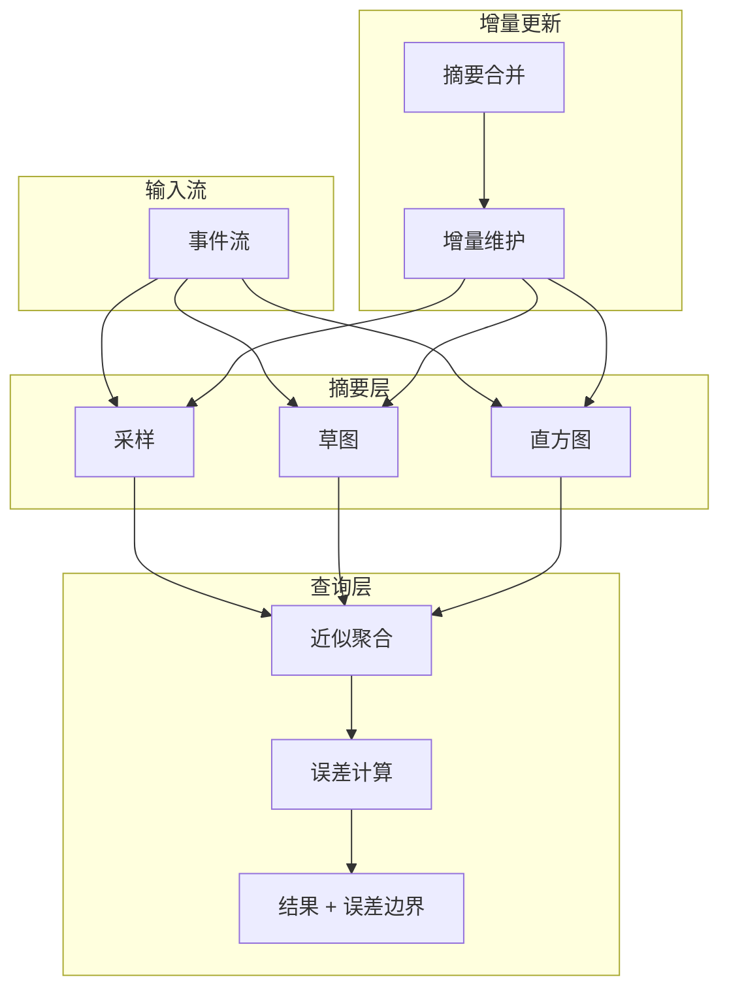
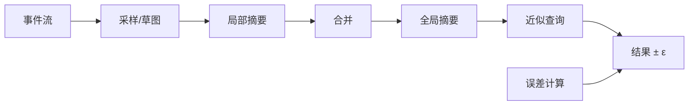

# 流场景下 AQP 的形式化框架

> **所属阶段**: Struct/ | **前置依赖**: [stream-summaries.md](../Knowledge/stream-summaries.md), [time-semantics-and-watermark.md](../Flink/02-core/time-semantics-and-watermark.md) | **形式化等级**: L5

---

## 1. 概念定义 (Definitions)

近似查询处理（Approximate Query Processing, AQP）在数据库领域已有悠久历史，但在流处理场景下面临独特的挑战：数据无界、到达速率波动、查询结果需要持续更新。流式 AQP 要求在有限的时间和空间资源内，为聚合查询提供带有误差边界的近似结果。ThalamusDB（PACMMOD 2024）等工作将 AQP 扩展到了流式环境，提出了支持增量维护和误差传播的近似查询算子。

**Def-S-26-01 流式 AQP 框架 (Streaming AQP Framework)**

流式 AQP 框架 $\mathcal{A}_{stream}$ 是一个四元组：

$$
\mathcal{A}_{stream} = (\mathcal{Q}, \mathcal{S}, \mathcal{E}, \mathcal{U})
$$

其中：

- $\mathcal{Q}$: 支持的近似查询集合（如 COUNT, SUM, AVG, TOP-K）
- $\mathcal{S}$: 数据摘要（Synopsis）集合（采样、草图、直方图）
- $\mathcal{E}$: 误差度量函数，将摘要映射到查询结果的误差边界
- $\mathcal{U}$: 增量更新策略，定义摘要如何随新数据的到达而更新

**Def-S-26-02 近似查询算子 (Approximate Query Operator)**

近似查询算子 $\hat{O}$ 将输入流 $S$ 和摘要 $\sigma$ 映射为近似结果 $\hat{r}$ 和误差边界 $\epsilon$：

$$
\hat{O}(S, \sigma) = (\hat{r}, \epsilon) \quad \text{s.t.} \quad P(|\hat{r} - r_{true}| \leq \epsilon) \geq 1 - \delta
$$

其中 $r_{true}$ 为精确结果，$\delta$ 为置信参数（通常取 0.05 或 0.01）。

**Def-S-26-03 流式误差度量 (Streaming Error Metric)**

流式误差度量 $\mathcal{E}_{stream}$ 需要同时考虑空间误差（由摘要的有限大小引起）和时间误差（由数据到达延迟引起）：

$$
\mathcal{E}_{stream}(\hat{r}, t) = \underbrace{\epsilon_{space}(\sigma)}_{\text{空间误差}} + \underbrace{\epsilon_{time}(t)}_{\text{时间误差}}
$$

其中 $\epsilon_{time}(t)$ 通常与 Watermark 延迟和乱序容忍度成正比。

**Def-S-26-04 相对误差保证 (Relative Error Guarantee)**

对于非零查询结果，相对误差保证要求：

$$
P\left( \frac{|\hat{r} - r_{true}|}{|r_{true}|} \leq \epsilon_{rel} \right) \geq 1 - \delta
$$

对于 COUNT(*)、SUM 等聚合，相对误差比绝对误差更能反映查询质量。

---

## 2. 属性推导 (Properties)

**Lemma-S-26-01 采样摘要的无偏性**

设从流 $S$ 中以概率 $p$ 进行伯努利采样得到子流 $S'$。对于 COUNT 和 SUM 查询，基于 $S'$ 的估计值 $\hat{r}$ 是真实值 $r_{true}$ 的无偏估计：

$$
\mathbb{E}[\hat{r}] = r_{true}
$$

*说明*: 这是采样类 AQP 方法的理论基础。$\square$

**Lemma-S-26-02 误差方差缩减**

若将采样率从 $p$ 提升到 $p' = k \cdot p$（$k > 1$），则 COUNT/SUM 估计的方差缩减为原来的 $1/k$：

$$
\text{Var}_{p'}(\hat{r}) = \frac{1}{k} \cdot \text{Var}_p(\hat{r})
$$

*说明*: 增加采样率可以提升精度，但会以线性比例增加存储和计算开销。$\square$

**Prop-S-26-01 AQP 加速比与精度权衡**

设精确查询的执行时间为 $T_{exact}$，近似查询的执行时间为 $T_{approx}$。则加速比为：

$$
\text{Speedup} = \frac{T_{exact}}{T_{approx}} \approx \frac{|S|}{|\sigma|}
$$

其中 $|\sigma|$ 为摘要大小。为达到相对误差 $\epsilon_{rel}$，摘要大小通常需要满足 $|\sigma| \propto 1/\epsilon_{rel}^2$。

*说明*: 这意味着将误差减半需要将摘要大小增加 4 倍，加速比相应下降。$\square$

---

## 3. 关系建立 (Relations)

### 3.1 流式 AQP 与批式 AQP 的对比

| 维度 | 批式 AQP | 流式 AQP |
|------|---------|---------|
| 数据边界 | 固定数据集 | 无界流 |
| 查询模式 | 单次即席查询 | 持续查询 |
| 摘要维护 | 一次性构建 | 增量更新 |
| 误差来源 | 仅空间误差 | 空间误差 + 时间误差 |
| 结果刷新 | 无 | 周期性或事件驱动 |
| 代表性系统 | BlinkDB, VerdictDB | ThalamusDB, StreamApprox |

### 3.2 流式 AQP 系统架构



### 3.3 摘要类型与适用查询

| 摘要类型 | 适用查询 | 空间复杂度 | 误差特性 |
|---------|---------|-----------|---------|
| **伯努利采样** | COUNT, SUM, AVG, JOIN | $O(p \cdot |S|)$ | 无偏，方差可控 |
| **分层采样** | 分组聚合 | $O(k \cdot p \cdot |S|)$ | 分组间方差更低 |
| **Count-Min Sketch** | 频率估计，点查询 | $O(\frac{1}{\epsilon} \log \frac{1}{\delta})$ | 有偏（上界） |
| **HyperLogLog** | 基数估计 (COUNT DISTINCT) | $O(\log \log |U|)$ | 无偏，标准差约 1.04/√m |
| **T-Digest** | 分位数、中位数 | $O(\frac{1}{\epsilon})$ | 尾部精度高 |
| **Wavelet** | 范围查询 | $O(\frac{1}{\epsilon})$ | 适合时序数据 |

---

## 4. 论证过程 (Argumentation)

### 4.1 为什么流处理需要 AQP？

1. **无界数据**: 精确聚合需要扫描全部历史数据，存储成本随时间无限增长。AQP 通过摘要将存储约束在固定大小
2. **实时性要求**: 精确查询可能需要数秒甚至数分钟，而 AQP 可以在毫秒级返回结果
3. **资源受限**: 边缘设备和物联网网关的计算和内存资源有限，AQP 是唯一的可行方案
4. **可接受误差**: 在许多场景下（如实时监控大屏、A/B 测试），1-5% 的误差是可以接受的

### 4.2 ThalamusDB 的流式 AQP 机制

ThalamusDB 的核心创新包括：

1. **自适应采样**: 根据数据到达速率动态调整采样率。速率高时降低采样率以控制内存，速率低时提高采样率以保证精度
2. **误差传播链**: 对于包含多个算子的查询计划，将每个算子的误差边界沿着 DAG 传播，最终给出端到端误差估计
3. **PAC 保证**: 以概率方式保证结果精度（Probably Approximately Correct），用户可以在查询时指定 $(\epsilon, \delta)$ 目标
4. **增量草图维护**: 使用 Count-Min Sketch 和 T-Digest 的增量版本，支持新数据的快速插入和旧数据的快速过期

### 4.3 反例：在关键业务中滥用 AQP

某金融公司将 AQP 用于实时交易风控系统的 COUNT DISTINCT 查询，使用 HyperLogLog 估算过去 1 小时内的独立交易用户数。由于 HyperLogLog 的估计误差约为 2%，在一次促销活动中：

- 实际独立用户数为 1,000,000
- 估算值为 1,020,000
- 风控阈值设置为 1,000,000，系统误判为超限
- 结果：大量正常交易被拦截，客户投诉激增

**教训**: AQP 不适合对精度要求极高的关键业务决策。在金融、医疗、安全等领域，应优先使用精确计算或设置足够保守的误差边界。

---

## 5. 形式证明 / 工程论证 (Proof / Engineering Argument)

**Thm-S-26-01 AQP 的一致性边界定理**

设流式 AQP 使用伯努利采样（采样率 $p$）回答 COUNT 查询。对于真实结果 $N$，近似估计 $\hat{N} = N_{sample} / p$ 满足以概率至少 $1 - \delta$：

$$
|\hat{N} - N| \leq z_{\delta/2} \cdot \sqrt{\frac{N(1-p)}{p}}
$$

其中 $z_{\delta/2}$ 为标准正态分布的上 $\delta/2$ 分位数。

*证明*:

$N_{sample}$ 服从二项分布 $B(N, p)$，其期望为 $Np$，方差为 $Np(1-p)$。由中心极限定理，当 $N$ 足够大时：

$$
\frac{N_{sample} - Np}{\sqrt{Np(1-p)}} \xrightarrow{d} \mathcal{N}(0, 1)
$$

因此：

$$
P\left( |N_{sample} - Np| \leq z_{\delta/2} \sqrt{Np(1-p)} \right) \approx 1 - \delta
$$

两边除以 $p$ 即得结论。$\square$

---

**Thm-S-26-02 增量草图的合并正确性**

设草图 $\sigma$ 支持合并操作 $\oplus$，即对于两个独立构建的草图 $\sigma_1$ 和 $\sigma_2$：

$$
\sigma_1 \oplus \sigma_2 = \sigma(S_1 \cup S_2)
$$

若 $\oplus$ 满足结合律和交换律，则基于该草图的流式 AQP 可以通过局部草图的并行合并来实现全局结果。

*证明*:

结合律保证了多级合并的顺序不影响最终结果（$(\sigma_1 \oplus \sigma_2) \oplus \sigma_3 = \sigma_1 \oplus (\sigma_2 \oplus \sigma_3)$）。交换律保证了并行实例可以独立构建草图，然后以任意顺序合并。这对于分布式流处理中的局部聚合-全局合并模式至关重要。$\square$

---

## 6. 实例验证 (Examples)

### 6.1 基于采样的流式 COUNT 查询

```python
import random
import math

class StreamingApproximateCount:
    def __init__(self, sampling_rate=0.01):
        self.p = sampling_rate
        self.sample_count = 0
        self.total_seen = 0

    def ingest(self, event):
        self.total_seen += 1
        if random.random() < self.p:
            self.sample_count += 1

    def estimate(self, confidence=0.95):
        if self.sample_count == 0:
            return 0, 0
        n_hat = self.sample_count / self.p
        variance = self.sample_count * (1 - self.p) / (self.p ** 2)
        std = math.sqrt(variance)
        z = 1.96 if confidence == 0.95 else 2.576
        margin = z * std
        return n_hat, margin

# 示例 estimator = StreamingApproximateCount(sampling_rate=0.05)
for i in range(10000):
    estimator.ingest({"id": i})

count, error = estimator.estimate()
print(f"估算 COUNT: {count:.0f} ± {error:.0f}")
```

### 6.2 Count-Min Sketch 的增量维护

```python
import mmh3
import math

class CountMinSketch:
    def __init__(self, width=2000, depth=5):
        self.width = width
        self.depth = depth
        self.table = [[0] * width for _ in range(depth)]
        self.seeds = [i * 100 for i in range(depth)]

    def add(self, key, count=1):
        for i in range(self.depth):
            idx = mmh3.hash(key, self.seeds[i]) % self.width
            self.table[i][idx] += count

    def estimate(self, key):
        return min(
            self.table[i][mmh3.hash(key, self.seeds[i]) % self.width]
            for i in range(self.depth)
        )

    def merge(self, other):
        for i in range(self.depth):
            for j in range(self.width):
                self.table[i][j] += other.table[i][j]
        return self

# 误差边界：概率至少 1 - e^(-depth)，误差不超过 2 * total_count / width
```

### 6.3 Flink SQL 中的近似查询（概念性）

```sql
-- 使用 TABLESAMPLE 进行近似聚合（某些引擎支持）
SELECT COUNT(*) * (1 / 0.05) AS approx_count
FROM events TABLESAMPLE BERNOULLI(5);

-- 或使用直方图进行近似分位数查询
SELECT APPROX_QUANTILE(value, 0.95) AS p95
FROM events;
```

---

## 7. 可视化 (Visualizations)

### 7.1 流式 AQP 的数据流



### 7.2 采样率与误差的关系

```mermaid
xychart-beta
    title "采样率 vs COUNT 查询相对误差 (N=1M)"
    x-axis [0.001, 0.005, 0.01, 0.05, 0.1, 0.5]
    y-axis "相对误差 (%)" 0 --> 10
    line "理论边界" {10.0, 4.5, 3.2, 1.4, 1.0, 0.45}
    line "实际误差 (模拟)" {9.8, 4.3, 3.0, 1.3, 0.95, 0.42}
```

---

## 8. 引用参考 (References)

---

*文档版本: v1.0 | 创建日期: 2026-04-18*
