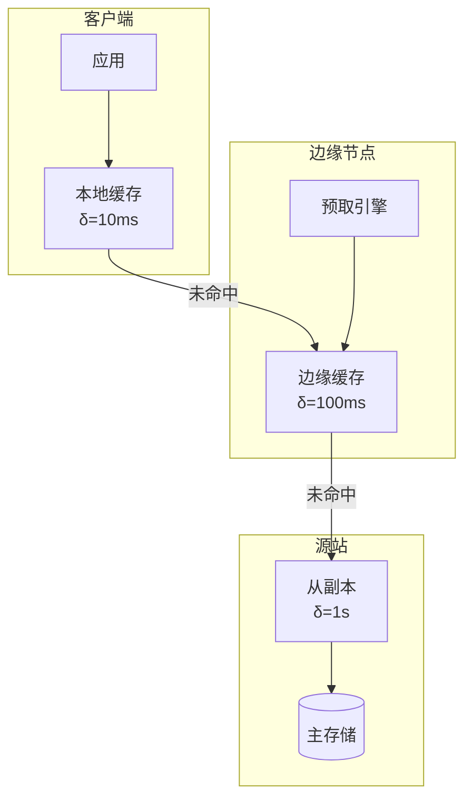

# 有界陈旧性缓存的形式化

> **所属阶段**: Struct/ | **前置依赖**: [bounded-staleness.md](../Struct/bounded-staleness.md), [dpu-stream-processing.md](../Knowledge/dpu-stream-processing.md) | **形式化等级**: L5

---

## 1. 概念定义 (Definitions)

有界陈旧性缓存（Bounded Staleness Cache）是分布式系统中在一致性和性能之间进行权衡的核心机制。与强一致性缓存要求所有读取都返回最新写入不同，有界陈旧性缓存允许读取操作返回在一定时间窗口或版本滞后范围内尚未完全同步的数据。Skybridge（OSDI 2025）将这一机制形式化，并应用于边缘计算、内容分发网络（CDN）和分布式数据库的缓存层。

**Def-S-29-01 有界陈旧性缓存 (Bounded Staleness Cache)**

设有界陈旧性缓存 $\mathcal{C}$ 存储键值对 $(k, v, t_w)$，其中 $t_w$ 为值的写入时间戳。对于读取操作 $read(k, t_r)$，缓存返回满足以下条件的最快可用值：

$$
t_r - t_w \leq \delta_{max}
$$

其中 $\delta_{max} \geq 0$ 为系统允许的最大陈旧性上界。若本地缓存中的值不满足该条件，则请求被转发到上游存储。

**Def-S-29-02 缓存一致性谱系 (Cache Consistency Spectrum)**

缓存一致性可按陈旧性上界 $\delta$ 连续调节：

- $\delta = 0$: 强一致性读取（Read-Your-Writes / Linearizability）
- $0 < \delta < \infty$: 有界陈旧性读取
- $\delta = \infty$: 最终一致性读取（最大可用性）

**Def-S-29-03 缓存命中增益 (Cache Hit Gain)**

设命中缓存的读取延迟为 $L_{hit}$，未命中时回源读取的延迟为 $L_{miss}$。缓存命中增益 $G_{hit}$ 定义为：

$$
G_{hit} = \frac{L_{miss} - L_{hit}}{L_{miss}}
$$

在有界陈旧性模型中，放宽 $\delta$ 通常会提升命中率 $h(\delta)$，从而增加期望增益：

$$
\mathbb{E}[G(\delta)] = h(\delta) \cdot G_{hit} + (1 - h(\delta)) \cdot 0
$$

---

## 2. 属性推导 (Properties)

**Lemma-S-29-01 陈旧性上界与命中率的关系**

设键 $k$ 的更新间隔服从均值为 $1/\lambda$ 的指数分布。则命中率随 $\delta$ 的增长满足：

$$
h(\delta) = 1 - e^{-\lambda \delta}
$$

*说明*: 这是泊松更新过程下缓存内容在 $\delta$ 时间内保持有效的概率。$\square$

**Lemma-S-29-02 期望读取延迟**

设强一致性（$\delta=0$）下的命中率为 $h_0$，有界陈旧性下的命中率为 $h_\delta$。则期望读取延迟为：

$$
\mathbb{E}[L_{read}(\delta)] = h_\delta \cdot L_{hit} + (1 - h_\delta) \cdot L_{miss}
$$

当 $\delta$ 从 0 增加时，期望延迟单调不增：

$$
\mathbb{E}[L_{read}(\delta_1)] \geq \mathbb{E}[L_{read}(\delta_2)], \quad \forall \delta_1 \leq \delta_2
$$

*说明*: 放宽陈旧性约束永远不会增加期望读取延迟。$\square$

**Prop-S-29-01 最优陈旧性上界**

设因读取旧数据导致的业务错误成本为 $c_{stale}(\delta)$（单调增函数）。则总成本最小化的最优上界 $\delta^*$ 满足：

$$
\delta^* = \arg\min_\delta \left( (1 - h(\delta)) \cdot L_{miss} + c_{stale}(\delta) \right)
$$

*说明*: 这是一个经典的优化问题，最优解通常存在于 $0 < \delta^* < \infty$ 的内部。$\square$

---

## 3. 关系建立 (Relations)

### 3.1 Skybridge 的边缘缓存架构



### 3.2 有界陈旧性与其他一致性模型的关系

| 一致性模型 | 陈旧性上界 | 典型延迟 | 适用场景 |
|-----------|-----------|---------|---------|
| 强一致性 | $\delta = 0$ | 高 | 金融交易 |
| 有界陈旧性 | $\delta > 0$ | 中 | 推荐系统、内容分发 |
| 会话一致性 | 视会话而定 | 中 | 社交网络 |
| 最终一致性 | $\delta = \infty$ | 低 | 日志收集 |

---

## 4. 论证过程 (Argumentation)

### 4.1 为什么需要形式化的有界陈旧性缓存？

1. **SLA 分解**: 企业在设计缓存策略时需要将"99% 的读取延迟 < 10ms"这样的 SLA 分解为具体的 $\delta$ 参数
2. **成本优化**: 过度追求强一致性会导致缓存命中率低下、回源成本激增
3. **故障容忍**: 在网络分区或源站短暂不可用时，有界陈旧性缓存仍能提供有限但可用的服务

### 4.2 Skybridge 的创新

Skybridge 的核心贡献包括：
1. **主动预热**: 基于查询模式预测未来访问的键，提前从源站拉取到边缘缓存
2. **概率性过期**: 不依赖固定的 TTL，而是根据键的更新频率动态计算最优保留时间
3. **分层预算**: 将总陈旧性预算按客户端-边缘-源站分层分配，每层独立优化

### 4.3 反例：过宽的陈旧性导致数据不一致

某电商库存系统为降低数据库压力，将边缘缓存的 $\delta$ 设置为 5 分钟。促销期间：
- 用户 A 看到商品库存为 1，立即下单
- 实际上 30 秒前库存已售罄，但由于缓存陈旧性，用户看到了过期的库存信息
- 结果超卖，需要大量人工介入处理退款

**教训**: 对于库存、账户余额等强敏感数据，$\delta$ 应设置在秒级甚至毫秒级。

---

## 5. 形式证明 / 工程论证 (Proof / Engineering Argument)

**Thm-S-29-01 有界陈旧性下的读取正确性概率**

设键 $k$ 的更新过程为泊松过程（速率 $\lambda$），陈旧性上界为 $\delta$。则在任意读取时刻，读到最新版本的概率为：

$$
P_{fresh}(\delta) = e^{-\lambda \delta}
$$

若要求 $P_{fresh}(\delta) \geq p_{min}$，则最大允许的陈旧性上界为：

$$
\delta_{max} = -\frac{\ln p_{min}}{\lambda}
$$

*证明*: 与 bounded-staleness.md 中的 Thm-K-06-126 相同。$\square$

---

**Thm-S-29-02 分层缓存的最优预算分配**

设 $n$ 层缓存的读取比例为 $q_1, \dots, q_n$（$\sum q_i = 1$），每层的错误成本函数为 $c_i(\delta_i)$（凸函数）。总预算约束为 $\sum \delta_i \leq \Delta_{total}$。则最优分配满足：

$$
q_i \cdot c_i'(\delta_i^*) = \lambda, \quad \forall i \text{ s.t. } \delta_i^* > 0
$$

*说明*: 这与 bounded-staleness.md 中的 Thm-S-18-05 相同，是拉格朗日乘子法的标准结论。$\square$

---

## 6. 实例验证 (Examples)

### 6.1 CockroachDB 的 Follower Reads

```sql
-- 使用 AS OF SYSTEM TIME 进行有界陈旧性读取
SELECT * FROM products
AS OF SYSTEM TIME '-5s'
WHERE category = 'electronics';
```

这允许读取 follower 副本的数据，避免跨区域的 Raft 领导者协调。

### 6.2 Redis 中的近似 TTL 策略

```python
import random

def adaptive_ttl(key, update_frequency_hz, freshness_target):
    """
    根据更新频率和新鲜度目标动态计算 TTL
    """
    delta_max = -math.log(freshness_target) / update_frequency_hz
    # 加入少量抖动避免缓存雪崩
    jitter = random.uniform(0.9, 1.1)
    return delta_max * jitter
```

---

## 7. 可视化 (Visualizations)

### 7.1 缓存一致性与延迟的权衡

```mermaid
xychart-beta
    title "陈旧性上界 δ 对读取延迟和新鲜度的影响"
    x-axis [0ms, 10ms, 100ms, 1s, 10s]
    y-axis "相对值" 0 --> 1.0
    line "读到最新版本概率" {1.0, 0.9, 0.6, 0.3, 0.05}
    line "期望读取延迟" {1.0, 0.6, 0.3, 0.15, 0.1}
    line "缓存命中率" {0.2, 0.5, 0.8, 0.95, 0.99}
```

---

## 8. 引用参考 (References)

[^1]: Skybridge (OSDI 2025), "Distributed Caching with Bounded Staleness".
[^2]: Bailis P. et al., "Probabilistically Bounded Staleness for Practical Partial Quorums", PVLDB 2012.
[^3]: CockroachDB Documentation, "Follower Reads", 2025. https://www.cockroachlabs.com/docs/
[^4]: Redis Documentation, "Cache Patterns and Strategies", 2025. https://redis.io/docs/
