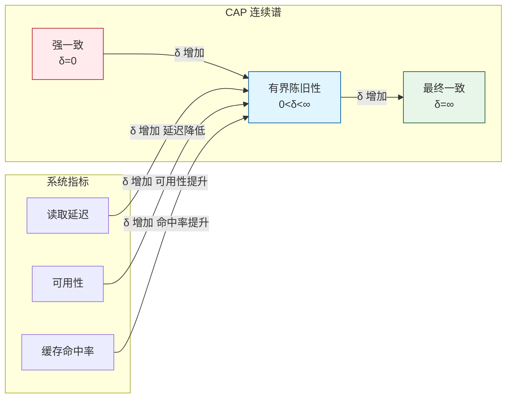
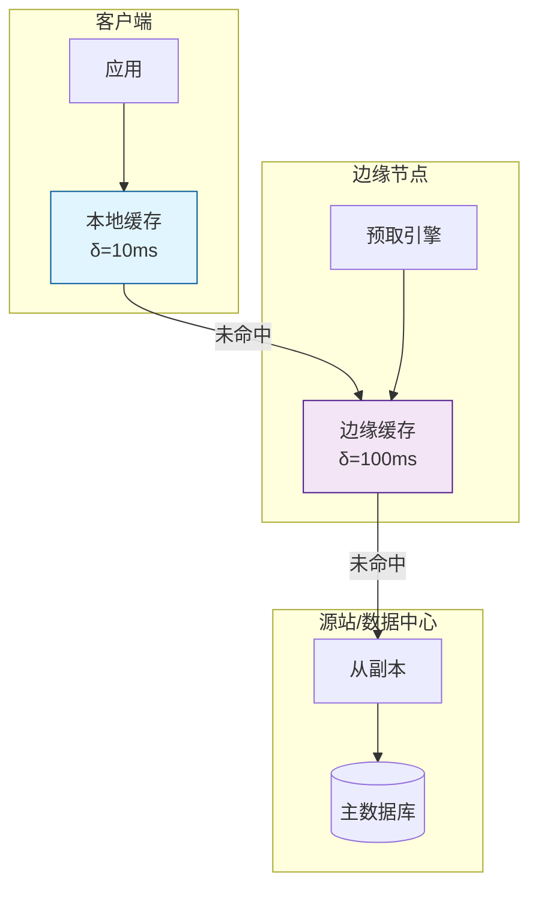
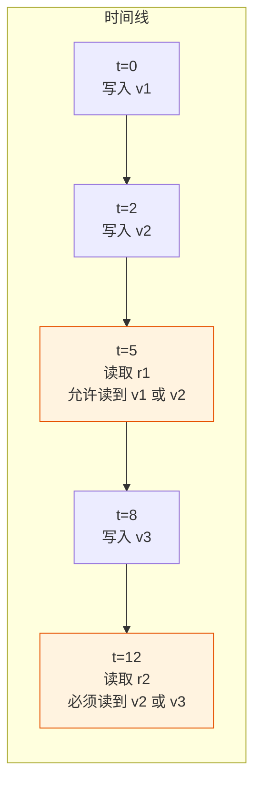

# 有界陈旧性的形式化定义与分布式缓存应用

> **所属阶段**: Struct/ | **前置依赖**: [transactional-stream-semantics.md](./transactional-stream-semantics.md), [acid-in-stream-processing.md](../Knowledge/acid-in-stream-processing.md) | **形式化等级**: L5

---

## 1. 概念定义 (Definitions)

有界陈旧性（Bounded Staleness）是分布式系统在性能与一致性之间进行权衡的核心机制。它允许读取操作返回并非最新但仍在可接受时间窗口内的数据版本，从而显著降低读取延迟、减少跨节点协调开销，并提升系统整体吞吐量。Skybridge（OSDI 2025）等系统将这一概念扩展到了流处理、边缘缓存和分布式数据库领域。

**Def-S-18-01 有界陈旧性 (Bounded Staleness)**

设分布式系统中的键 $k$ 在真实时间 $t$ 的最新写入值为 $v_{latest}(k, t)$，写入时间戳为 $t_{write}(k, t)$。读取操作 $r(k, t)$ 返回的值 $v_{read}$ 对应的时间戳为 $t_{read}$。有界陈旧性要求：

$$
t - t_{read} \leq \delta \quad \lor \quad t_{write}(k, t) - t_{read} \leq \delta
$$

其中 $\delta \geq 0$ 为陈旧性上界。第一个不等式基于**读取时间**定义（read-time staleness），第二个不等式基于**写入时间**定义（write-time staleness）。

**Def-S-18-02 版本陈旧性 (Version Staleness)**

设键 $k$ 在时刻 $t$ 的最新版本号为 $ver_{latest}(k, t)$，读取到的版本号为 $ver_{read}$。版本陈旧性要求：

$$
ver_{latest}(k, t) - ver_{read} \leq \Delta_{ver}
$$

其中 $\Delta_{ver} \geq 0$ 为最大允许版本滞后数。当 $\Delta_{ver} = 0$ 时，要求读到最新版本；当 $\Delta_{ver} = 1$ 时，允许读到前一个版本。

**Def-S-18-03 概率有界陈旧性 (Probabilistic Bounded Staleness, PBS)**

PBS 放松了确定性的上界约束，允许以高概率满足陈旧性要求：

$$
P(t - t_{read} \leq \delta) \geq p_{threshold}
$$

其中 $p_{threshold} \in (0, 1]$ 为概率阈值（通常取 0.95 或 0.99）。PBS 更适合复制延迟存在波动的分布式存储系统。

**Def-S-18-04 单调读一致性 (Monotonic Reads)**

在单调读一致性下，若客户端 $c$ 在时间 $t_1$ 读取到键 $k$ 的版本 $v_1$（对应时间戳 $t_{v1}$），则 $c$ 在后续任何时间 $t_2 > t_1$ 的读取必须满足：

$$
t_{v2} \geq t_{v1}
$$

其中 $t_{v2}$ 为后续读取版本的写入时间戳。单调读一致性是有界陈旧性系统中最常见的配套保证。

**Def-S-18-05 陈旧性预算分配 (Staleness Budget Allocation)**

在多层缓存架构中，总陈旧性预算 $\Delta_{total}$ 可按层级分配：

$$
\Delta_{total} = \sum_{i=1}^{n} \Delta_i + \Delta_{source}
$$

其中 $\Delta_i$ 为第 $i$ 层缓存的陈旧性预算，$\Delta_{source}$ 为数据源本身的复制延迟预算。层级 $i$ 的读取只有在满足 $\sum_{j=1}^{i} \Delta_j$ 累积预算时才是合法的。

---

## 2. 属性推导 (Properties)

**Lemma-S-18-01 有界陈旧性蕴含最终一致性**

若系统满足有界陈旧性参数 $\delta$，则当读取操作等待时间 $t_{wait} \geq \delta$ 时，读取结果必然等价于强一致性读取。

*证明*: 由 Def-S-18-01，任意读取返回的版本时间戳 $t_{read}$ 满足 $t - t_{read} \leq \delta$。若读取发生在 $t + \delta$ 之后，则对于该时刻 $t' = t + \delta$，有 $t' - t_{read} \geq \delta$，这意味着只有 $t_{read} \geq t$ 的版本才能满足约束。即读取到了时刻 $t$ 或之后的最新版本。$\square$

**Lemma-S-18-02 版本陈旧性与时间陈旧性的关系**

若键 $k$ 的写入速率为 $\lambda$（版本/秒），且版本写入时间间隔服从均值为 $1/\lambda$ 的分布，则时间陈旧性上界 $\delta$ 与版本陈旧性上界 $\Delta_{ver}$ 的期望关系为：

$$
\mathbb{E}[\Delta_{ver}] \approx \lambda \cdot \delta
$$

*说明*: 该引理允许系统在配置时根据业务场景选择合适的陈旧性度量（时间或版本）。$\square$

**Lemma-S-18-03 PBS 下的期望读取延迟**

设复制延迟分布为 $F_D(x) = P(D \leq x)$，则为了满足 $P(t - t_{read} \leq \delta) \geq p$，系统的最小期望读取延迟为：

$$
\mathbb{E}[L_{read}] = \int_{0}^{\delta} x \cdot f_D(x) dx + \delta \cdot (1 - F_D(\delta))
$$

*说明*: 当 $p \to 1$（强一致性）时，$\delta \to \infty$ 或必须等待所有副本确认，延迟趋于最大复制延迟。$\square$

**Prop-S-18-01 缓存命中率的陈旧性敏感度**

在分布式缓存系统中，放宽陈旧性上界 $\delta$ 通常可显著提升缓存命中率 $h(\delta)$，二者近似满足对数关系：

$$
h(\delta) \approx h_0 + k \cdot \ln(1 + \delta / \delta_0)
$$

其中 $h_0$ 为强一致性下的基础命中率，$k$ 和 $\delta_0$ 为与工作负载特征相关的常数。

---

## 3. 关系建立 (Relations)

### 3.1 CAP 定理视角下的有界陈旧性

CAP 定理指出分布式系统无法同时满足一致性（C）、可用性（A）和分区容错性（P）。有界陈旧性可视为 CAP 的**连续松弛**：

- $\delta = 0$: 对应强一致性（CP 系统），可用性在分区时受限
- $\delta = \infty$: 对应最终一致性（AP 系统），最大化可用性
- $0 < \delta < \infty$: 在一致性和可用性/延迟之间连续调节



### 3.2 有界陈旧性在流处理系统中的实现层级

| 层级 | 实现机制 | 典型系统 | 控制粒度 |
|-----|---------|---------|---------|
| **客户端缓存** | TTL + 版本校验 | Redis, Memcached | 键级别 |
| **边缘节点缓存** | 地理复制延迟预算 | CDN, Skybridge | 区域级别 |
| **流处理状态缓存** | Watermark 驱动刷新 | Flink State Backend | 算子/KeyGroup 级别 |
| **物化视图缓存** | 增量刷新 + 快照版本 | Materialize, RisingWave | 视图级别 |
| **跨区域复制** | Quorum 读取 + 时间戳约束 | CockroachDB, Spanner | 区域/表级别 |

### 3.3 与 Flink Watermark 机制的关联

Flink 的 Watermark 本质上是一种**时间陈旧性控制机制**：

- Watermark $w(t)$ 表示"事件时间 $\leq t$ 的数据已经全部到达"
- 窗口算子在水印推进后才触发计算，等价于接受 $w(t)$ 之前数据的"有界陈旧性"
- 允许迟到数据（Allowed Lateness）进一步放宽了陈旧性上界

从这个意义上，Flink 的窗口聚合天然符合有界陈旧性模型，只是这里的"陈旧性"是针对**事件时间完整性**而非**版本新旧**的。

---

## 4. 论证过程 (Argumentation)

### 4.1 Skybridge 的创新：分布式缓存中的有界陈旧性

Skybridge（OSDI 2025）是一个面向分布式系统的有界陈旧性缓存框架，其核心思想包括：

1. **主动缓存预热**: 基于工作负载模式预测未来可能被访问的键，提前从远端副本拉取到本地缓存
2. **分层预算管理**: 将总陈旧性预算按客户端-边缘-源站分层分配，每层独立优化
3. **概率性过期策略**: 不依赖固定的 TTL，而是根据键的更新频率动态计算最优缓存保留时间

### 4.2 为什么不是强一致？

在以下场景中，强一致性带来的性能损失是不可接受的：

- **全球分布式推荐系统**: 用户画像数据跨三大洲复制，强一致读取的 RTT 可能高达 200-300ms
- **实时广告竞价**: 竞价决策必须在 100ms 内完成，无法等待所有副本同步
- **边缘 IoT 处理**: 边缘节点与中心云的连接间歇性中断，强一致读取会导致频繁超时

有界陈旧性通过允许"足够新"的数据，将读取延迟控制在业务可接受的范围内。

### 4.3 反例：过宽的陈旧性上界导致业务错误

某库存管理系统将边缘缓存的陈旧性上界设置为 5 分钟，以追求极致的低延迟。结果：

- 用户 A 在东京边缘节点查询 SKU-100 库存为 10
- 实际上，在 30 秒前，纽约的订单系统已将该 SKU 库存扣减至 0
- 由于东京缓存的陈旧性，用户 A 成功下单，导致超卖

**教训**: 陈旧性上界的设置必须与业务语义对齐。对于库存等强敏感数据，$\delta$ 应设置为数秒甚至毫秒级；对于用户行为统计等弱敏感数据，$\delta$ 可放宽至分钟级。

---

## 5. 形式证明 / 工程论证 (Proof / Engineering Argument)

**Thm-S-18-04 有界陈旧性下的读取新鲜度上界**

设键 $k$ 的写入事件形成一个泊松过程，速率为 $\lambda$。系统采用时间陈旧性上界 $\delta$。则在任意读取时刻，读到最新版本的概率为：

$$
P_{fresh} = P(\text{在 } [t-\delta, t] \text{ 内无写入}) = e^{-\lambda \delta}
$$

若要求 $P_{fresh} \geq p_{min}$，则最大允许的陈旧性上界为：

$$
\delta_{max} = -\frac{\ln(p_{min})}{\lambda}
$$

*证明*: 泊松过程中，时间区间长度 $\delta$ 内事件发生次数 $N(\delta) \sim \text{Poisson}(\lambda \delta)$。无写入事件的概率为 $P(N(\delta)=0) = e^{-\lambda \delta}$。令 $e^{-\lambda \delta} \geq p_{min}$，两边取对数并整理得 $\delta \leq -\ln(p_{min})/\lambda$。$\square$

---

**Thm-S-18-05 多层缓存的最优预算分配**

设 $n$ 层缓存的读取请求比例为 $q_1, q_2, \dots, q_n$（$\sum q_i = 1$），每层缓存因陈旧性导致的错误成本为 $c_i(\Delta_i)$（凸函数）。则最优预算分配问题为：

$$
\min_{\Delta_1, \dots, \Delta_n} \sum_{i=1}^{n} q_i \cdot c_i(\Delta_i) \quad \text{s.t.} \quad \sum_{i=1}^{n} \Delta_i \leq \Delta_{total}
$$

若 $c_i(\Delta_i) = \alpha_i e^{-\beta_i \Delta_i}$，则最优解满足：

$$
q_i \cdot \alpha_i \beta_i e^{-\beta_i \Delta_i^*} = \lambda \quad \text{（对所有满足 } \Delta_i^* > 0 \text{ 的 } i \text{）}
$$

其中 $\lambda$ 为拉格朗日乘子。

*证明梗概*: 构造拉格朗日函数 $\mathcal{L} = \sum q_i c_i(\Delta_i) + \lambda (\sum \Delta_i - \Delta_{total})$。对 $\Delta_i$ 求偏导并令其为零：$\frac{\partial \mathcal{L}}{\partial \Delta_i} = q_i c_i'(\Delta_i) + \lambda = 0$。代入 $c_i'(\Delta_i) = -\alpha_i \beta_i e^{-\beta_i \Delta_i}$ 即得结论。$\square$

---

**Thm-S-18-06 单调读与有界陈旧性的兼容性**

若系统同时满足有界陈旧性（Def-S-18-01）和单调读一致性（Def-S-18-04），则客户端的读取序列形成一个时间戳单调非减的序列，且相邻两次读取之间的时间戳差距不超过 $\delta$ 加上两次读取之间的新写入最大延迟。

*证明*:

设客户端 $c$ 的读取序列为 $r_1, r_2, \dots$，对应版本时间戳为 $t_1 \leq t_2 \leq \dots$（由单调读保证）。对于读取 $r_j$ 发生在真实时间 $T_j$，有界陈旧性保证 $T_j - t_j \leq \delta$。因此 $t_j \geq T_j - \delta$。若两次读取之间 $[T_{j-1}, T_j]$ 内最新写入的时间戳为 $t_{new}$，则 $t_j \geq \min(t_{j-1}, t_{new})$，结合单调读知 $t_j \geq t_{j-1}$。$\square$

---

## 6. 实例验证 (Examples)

### 6.1 Skybridge 的分层缓存架构



Skybridge 根据键的更新频率和访问模式，动态调整每层缓存的 $\delta$ 值：

- 热键（高频读写）: 本地缓存 $\delta=10$ms，边缘缓存 $\delta=50$ms
- 温键（中频访问）: 边缘缓存 $\delta=500$ms
- 冷键（低频访问）: 直接回源源站，不缓存

### 6.2 CockroachDB 的 Follower Reads

CockroachDB 支持 `AS OF SYSTEM TIME` 查询，允许读取 follower 副本的旧版本数据：

```sql
-- 读取 10 秒前的数据（有界陈旧性 δ=10s）
SELECT * FROM orders
AS OF SYSTEM TIME '-10s'
WHERE region = 'us-west';
```

这种读取模式避免了跨区域的 Raft 领导者协调，显著降低了 P99 延迟。在流处理场景下，类似的查询模式可用于：

- 实时报表的近似刷新
- 特征存储中的近实时特征查询
- 备份和审计的数据快照

### 6.3 Flink 状态后端中的有界陈旧性读取

在 Flink 的 RocksDB State Backend 中，可以配置状态读取的"近实时"模式：

```java
// 概念性配置：允许读取上一次 Checkpoint 的状态快照
StateBackendConfig config = new RocksDBStateBackendConfig();
config.setStateReadMode(StateReadMode.BOUNDED_STALENESS);
config.setMaxStalenessMillis(5000); // 允许最多 5 秒的陈旧状态
```

在这种模式下，某些只读查询可以直接从本地 RocksDB 的快照中读取，而不必等待最新内存状态的刷新，从而降低查询延迟。

---

## 7. 可视化 (Visualizations)

### 7.1 陈旧性上界与系统指标的关系

```mermaid
xychart-beta
    title "陈旧性上界 δ 对系统指标的影响"
    x-axis "δ (ms)" [0, 10, 100, 1000]
    y-axis "相对值" 0 --> 1.5
    line "读取延迟" {1.0, 0.5, 0.2, 0.1}
    line "缓存命中率" {0.3, 0.6, 0.85, 0.95}
    line "读到最新版本概率" {1.0, 0.9, 0.6, 0.3}
```

### 7.2 有界陈旧性在数据流中的时间语义



*说明*: 若 $\delta = 5$，则 $t=5$ 的读取允许读到 $t=0$ 或 $t=2$ 的版本；$t=12$ 的读取允许读到 $t=7$ 及之前的版本，因此至少要读到 v2。

---

## 8. 引用参考 (References)
