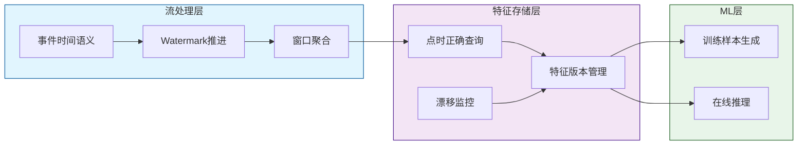
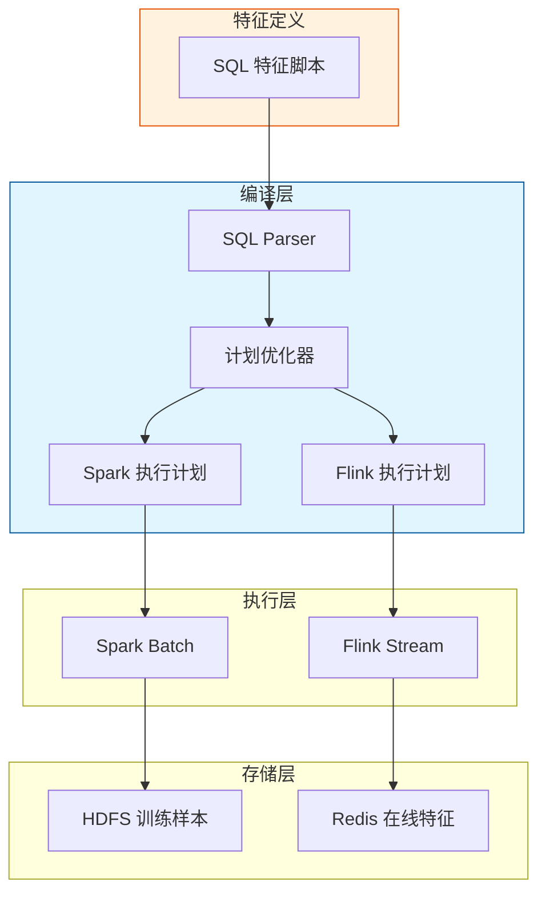
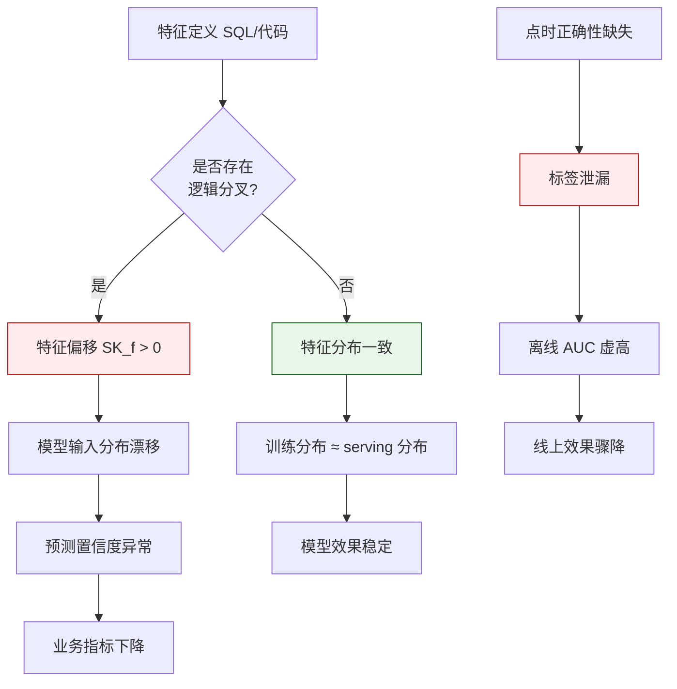
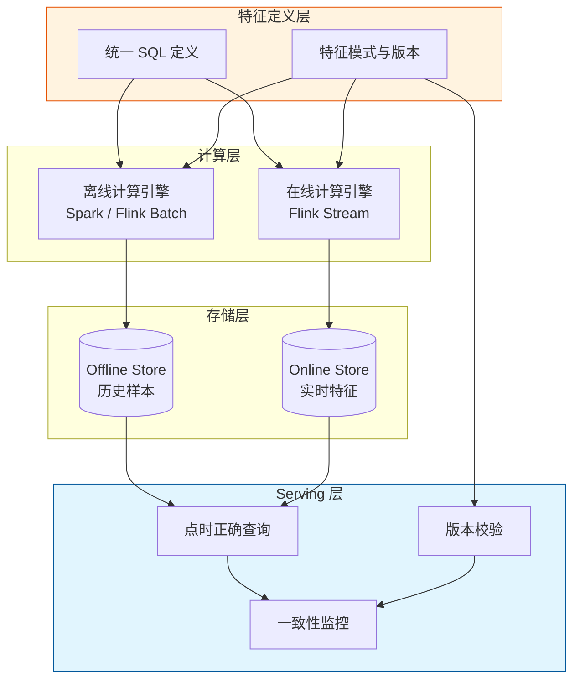

# 训练-推理一致性的形式化定义与保证机制

> **所属阶段**: Struct/ | **前置依赖**: [feature-store-architecture.md](../Knowledge/feature-store-architecture.md), [exactly-once-end-to-end.md](../Flink/02-core/exactly-once-end-to-end.md) | **形式化等级**: L5

---

## 1. 概念定义 (Definitions)

机器学习系统的生产效果严重依赖于训练阶段（Training）与推理阶段（Serving）所使用特征的一致性。若两个阶段对同一逻辑特征的计算结果存在系统性差异，则模型在实际部署中会出现不可预期的性能衰减。

**Def-S-16-01 训练-推理一致性 (Training-Serving Consistency)**

设特征空间为 $\mathcal{X}$，训练阶段对样本 $s$ 提取的特征为 $x_{train}(s) \in \mathcal{X}$，推理阶段对同一样本（或对应实体）提取的特征为 $x_{serve}(s) \in \mathcal{X}$。训练-推理一致性定义为：

$$
\mathcal{C}_{TS}(s) \triangleq \mathbb{1}\left[ \| x_{train}(s) - x_{serve}(s) \|_p \leq \epsilon \right]
$$

其中 $\| \cdot \|_p$ 为 $L_p$ 范数（通常取 $p=2$ 或 $p=\infty$），$\epsilon \geq 0$ 为预设容差。当系统满足强一致性时，$\epsilon = 0$ 且对所有样本 $s$ 有 $\mathcal{C}_{TS}(s) = 1$。

**Def-S-16-02 特征偏移 (Feature Skew)**

特征偏移 $SK_f$ 量化了训练与推理阶段特征分布之间的差异。设训练分布为 $P_{train}$，Serving 分布为 $P_{serve}$，则：

$$
SK_f(P_{train}, P_{serve}) \triangleq \mathbb{E}_{x \sim P_{train}, y \sim P_{serve}} \left[ \| x - y \| \right]
$$

若 $SK_f = 0$，称系统在该特征上无偏移；若 $SK_f > \delta$（$\delta$ 为业务阈值），则称存在显著偏移。

**Def-S-16-03 分布漂移 (Distribution Drift)**

对于时间演化特征，设时刻 $t$ 的特征分布为 $P_t$，漂移函数 $D$ 定义为：

$$
D(P_t, P_{t+\Delta}) \triangleq \sup_{A \in \mathcal{A}} | P_t(A) - P_{t+\Delta}(A) |
$$

其中 $\mathcal{A}$ 为可测集族。若 $\exists \Delta > 0$ 使得 $D(P_t, P_{t+\Delta}) > \eta$，则称在时间窗口 $\Delta$ 内发生了显著分布漂移。

**Def-S-16-04 一致性误差边界 (Consistency Error Bound)**

设模型 $M: \mathcal{X} \to \mathcal{Y}$ 为 $L$-Lipschitz 连续（即 $\| M(x_1) - M(x_2) \| \leq L \| x_1 - x_2 \|$），则训练-推理不一致性导致的预测误差上界为：

$$
\| M(x_{train}) - M(x_{serve}) \| \leq L \cdot \| x_{train} - x_{serve} \| \leq L \cdot \epsilon
$$

该不等式将特征层面的不一致性映射到模型预测层面的风险上界。

**Def-S-16-05 点时正确拼接 (Point-in-Time Join Correctness)**

设训练样本 $s$ 的事件时间戳为 $t_s$，点时正确拼接要求训练使用的特征向量 $\vec{x}(s)$ 满足：

$$
\forall f_i \in \mathcal{F}, \quad \tau(f_i(s)) \leq t_s
$$

其中 $\tau(f_i(s))$ 为特征 $f_i$ 在样本 $s$ 上取值所依赖数据的最大有效时间戳。若存在 $f_i$ 使得 $\tau(f_i(s)) > t_s$，则称拼接发生了**标签泄漏 (Label Leakage)**。

**Def-S-16-06 在线-离线执行计划等价 (Online-Offline Plan Equivalence)**

设离线特征转换的执行计划为 $\Pi_{offline}$，在线特征转换的执行计划为 $\Pi_{online}$。若对于任意合法输入数据集 $D$ 有：

$$
\Pi_{offline}(D) = \Pi_{online}(D)
$$

则称两个执行计划在语义上等价。此处"="指输出关系（表）的元组集合相等（考虑排序无关性）。

---

## 2. 属性推导 (Properties)

从上述定义可直接推导特征一致性的若干关键性质。

**Lemma-S-16-01 特征偏移的单调传播性**

若模型 $M$ 由 $k$ 个级联子模型 $M_1, M_2, \dots, M_k$ 组成，且每个子模型 $M_i$ 为 $L_i$-Lipschitz 连续，则输入特征的初始偏移 $\epsilon_0$ 在第 $i$ 层的输出偏移满足：

$$
\epsilon_i \leq L_i \cdot \epsilon_{i-1}
$$

整体输出偏移上界为：

$$
\epsilon_k \leq \left( \prod_{i=1}^{k} L_i \right) \cdot \epsilon_0
$$

*证明*: 由 Lipschitz 定义直接递推可得。$\square$

**Lemma-S-16-02 分布漂移的复合效应**

设系统有 $n$ 个独立特征，各特征在 $\Delta$ 时间窗口内的漂移量为 $D_i$。则联合特征分布的漂移满足：

$$
D_{joint} \leq \sum_{i=1}^{n} D_i
$$

*证明*: 由全变差距离的次可加性及独立分布的乘积结构，通过数学归纳法可得。$\square$

**Lemma-S-16-03 点时正确性蕴含无标签泄漏**

若训练样本 $s$ 的所有特征均满足点时正确拼接（Def-S-16-05），则该样本无标签泄漏。

*证明*: 反设存在标签泄漏，则 $\exists f_i$ 使得 $\tau(f_i(s)) > t_s$。这与点时正确性定义 $\tau(f_i(s)) \leq t_s$ 矛盾。故假设不成立，无标签泄漏。$\square$

**Prop-S-16-01 一致性与系统延迟的权衡**

在特征 Serving 路径中，设缓存命中率为 $h$，缓存版本延迟为 $\Delta_{cache}$，实时计算延迟为 $\Delta_{real}$（通常 $\Delta_{real} \ll \Delta_{cache}$）。则期望一致性误差为：

$$
\mathbb{E}[\epsilon] = h \cdot D(P_t, P_{t-\Delta_{cache}}) + (1-h) \cdot 0
$$

这表明提高缓存命中率以降低延迟的同时，会引入与缓存延迟成正比的一致性误差。

---

## 3. 关系建立 (Relations)

### 3.1 与 Exactly-Once 语义的关系

训练-推理一致性与 Flink 的 Exactly-Once 语义存在深层联系：

- **Exactly-Once 保证**: 确保特征转换过程中每个事件被恰好处理一次，避免重复计数或遗漏导致特征值偏移
- **一致性依赖**: 若流处理引擎出现重复处理（At-Least-Once 无去重）或丢失事件，则 $SK_f > 0$ 几乎必然发生

### 3.2 与特征存储架构的映射

| 特征存储组件 | 一致性角色 | 失效模式 |
|-------------|-----------|---------|
| 统一转换层 ($T$) | 保证 $\Pi_{offline} = \Pi_{online}$ | 代码分叉导致逻辑差异 |
| 特征版本空间 ($V$) | 锁定训练与推理使用同一特征版本 | 版本混用导致模式不匹配 |
| 点时查询引擎 ($\Phi$) | 保证 $\tau(f_i) \leq t_s$ | 无时序过滤导致标签泄漏 |
| 监控治理 ($\Psi$) | 检测 $SK_f > \delta$ 的异常 | 监控缺失导致漂移长期未被发现 |

### 3.3 与流处理时间语义的关联

特征存储中的点时正确性直接依赖于流处理系统的**事件时间 (Event Time)** 处理能力：

- **Watermark 机制**: 定义了特征聚合结果何时可被安全地物化到存储中
- **窗口触发策略**: 决定了训练样本中聚合特征的时间边界精度
- **Allowed Lateness**: 影响点时查询对迟到数据的处理策略



---

## 4. 论证过程 (Argumentation)

### 4.1 训练-推理不一致的典型根因

通过大量生产案例分析，特征不一致的根因可归纳为以下四类：

**类型 A: 转换逻辑分叉 (Code Fork)**

数据科学家使用 Python/Pandas 在离线笔记本中实现特征工程，而工程团队使用 Java/Flink 在线重写同一逻辑。由于语言差异、浮点精度、时区处理、空值策略等细节，导致 $\Pi_{offline} \neq \Pi_{online}$。

**类型 B: 数据源版本差异 (Source Version Mismatch)**

训练使用的用户画像表为 T-1 快照，而 Serving 使用的画像来自实时流更新。若模型学习到"用户最近 7 天消费金额"这一特征，但训练与 Serving 的数据新鲜度不同，则该特征在两个阶段的分布不同。

**类型 C: 标签泄漏 (Label Leakage)**

在构建训练样本时，使用了发生在标签事件之后的特征值。例如：预测"用户是否会在未来 7 天内购买"，但训练样本中却包含了该次购买发生后的浏览行为特征。此时模型在离线评估中表现虚高，上线后急剧下降。

**类型 D: 环境侧信道差异 (Environmental Side-Channel)**

离线训练在 CPU 上运行，在线 Serving 在 GPU 上运行，某些数值运算（如 `sum` 的累加顺序）导致微小但系统性的差异。对于对输入极度敏感的高维深度模型，这种差异可能被放大。

### 4.2 反例：无统一转换层的灾难

某金融科技公司开发反欺诈模型，离线 AUC 达到 0.94。上线后一周内，模型捕获率从预期的 85% 骤降至 52%。事后分析发现：

- 离线 Python 代码中使用 `pd.cut` 对用户年龄做分箱，边界为 `[0, 18, 35, 50, 65, 100]`
- 在线 Flink Java 代码中使用自定义分箱函数，边界为 `[0, 18, 35, 50, 60, 100]`
- 65-100 岁用户群体在两个系统中的分箱标签不同，导致模型对该群体完全失效

该案例表明，即使微小的逻辑差异也可能在特定子群体上造成灾难性后果。

### 4.3 一致性检测的统计学方法

在生产环境中，持续监控训练-推理一致性需要统计学工具：

- **Population Stability Index (PSI)**: 衡量训练与 Serving 特征分布的整体稳定性
- **Kolmogorov-Smirnov 检验**: 针对连续特征进行分布差异显著性检验
- **Jensen-Shannon 散度**: 对称化地度量两个概率分布的相似性

---

## 5. 形式证明 / 工程论证 (Proof / Engineering Argument)

**Thm-S-16-01 统一执行计划保证训练-推理一致性的充分条件**

设特征存储系统满足：

1. 在线执行计划 $\Pi_{online}$ 与离线执行计划 $\Pi_{offline}$ 语义等价（Def-S-16-06）
2. 训练与 Serving 使用同一特征版本 $v \in V$ 和同一数据源快照 $S_v$
3. 训练样本采用点时正确拼接（Def-S-16-05）

则对于任意样本 $s$，训练特征 $x_{train}(s)$ 与 Serving 特征 $x_{serve}(s)$ 强一致，即 $\| x_{train}(s) - x_{serve}(s) \| = 0$。

*证明*:

由条件 3，训练样本 $s$ 的事件时间为 $t_s$，训练使用的特征值为：

$$
x_{train}(s) = \Pi_{offline}(S_v, s, t_s)
$$

Serving 时，对于同一实体 $e$ 和事件时间 $t_s$ 的请求，由条件 1 和 2：

$$
x_{serve}(s) = \Pi_{online}(S_v, s, t_s) = \Pi_{offline}(S_v, s, t_s)
$$

故 $x_{train}(s) = x_{serve}(s)$，差异范数为 0。$\square$

---

**Thm-S-16-02 点时正确拼接消除标签泄漏的充分必要性**

在监督学习任务中，设标签 $y$ 依赖于事件时间 $t_y$，特征向量 $\vec{x}$ 由特征集合 $\mathcal{F}$ 在事件时间 $t$ 处查询得到。则：

$$
\text{无标签泄漏} \iff \forall f_i \in \mathcal{F}, \tau(f_i) \leq t_y
$$

*证明*:

**充分性** ($\Leftarrow$): 若所有特征的时间戳 $\tau(f_i) \leq t_y$，则特征值仅基于标签事件发生前或同时的数据生成，不包含未来信息。因此无标签泄漏。

**必要性** ($\Rightarrow$): 反设无标签泄漏但 $\exists f_j$ 使得 $\tau(f_j) > t_y$。则 $f_j$ 的生成依赖于 $t_y$ 之后的事件。若该事件与标签 $y$ 存在统计相关性，则 $f_j$ 携带有助于预测 $y$ 的"未来信息"，构成标签泄漏。矛盾。故必要性成立。$\square$

---

**Thm-S-16-03 特征偏移上界与模型性能衰减的关系**

设模型 $M$ 为 $L$-Lipschitz 连续，损失函数 $\ell$ 为 $\lambda$-Lipschitz 连续。若特征偏移满足 $SK_f \leq \epsilon$，则模型在 Serving 分布上的期望损失与训练分布的期望损失之差满足：

$$
| \mathbb{E}_{P_{serve}}[\ell(M(x), y)] - \mathbb{E}_{P_{train}}[\ell(M(x), y)] | \leq \lambda L \epsilon
$$

*证明梗概*:

对任意输入 $x$，由 $M$ 的 Lipschitz 性质：

$$
\| M(x_{serve}) - M(x_{train}) \| \leq L \| x_{serve} - x_{train} \| \leq L \epsilon
$$

再由 $\ell$ 的 Lipschitz 性质：

$$
| \ell(M(x_{serve}), y) - \ell(M(x_{train}), y) | \leq \lambda \| M(x_{serve}) - M(x_{train}) \| \leq \lambda L \epsilon
$$

对两边取期望即得结论。$\square$

---

## 6. 实例验证 (Examples)

### 6.1 OpenMLDB 的统一执行计划机制

OpenMLDB 通过"一致的 SQL 执行计划"解决训练-推理一致性问题：

- **离线模式**: 使用 Spark 分布式执行 SQL 特征转换，生成训练样本
- **在线模式**: 将同一 SQL 编译为 Flink 流处理任务，实时计算特征并写入 Redis
- **一致性保证**: 两者共享同一 SQL 解析器和优化器，确保逻辑等价



### 6.2 Tecton 的 Materialization 与点时正确性

Tecton 提供两种物化（Materialization）策略：

- **Online Materialization**: 将流计算结果实时写入 Online Store（如 DynamoDB、Redis）
- **Offline Materialization**: 将批处理结果写入 Offline Store（如 S3、Snowflake）

Tecton 的 `get_historical_features()` API 自动执行点时正确拼接，用户只需指定：

```python
from tecton import get_historical_features

features_df = get_historical_features(
    feature_service=fraud_detection_feature_service,
    spine=transaction_df,  # 包含 event_timestamp 的样本表
    timestamp_key="event_timestamp"
)
```

系统会自动将每个样本的 `event_timestamp` 作为时间切点，查询该时刻之前的最新特征值，从而避免标签泄漏。

### 6.3 FEBench 评测框架中的一致性指标

FEBench 是一个面向实时特征工程的基准测试，其中包含训练-推理一致性评测维度：

| 评测项 | 指标 | 说明 |
|--------|------|------|
| 逻辑一致性 | $\Pi_{offline} \equiv \Pi_{online}$ | 对比同一 SQL 在离线与在线引擎的输出 |
| 数值一致性 | $\| x_{train} - x_{serve} \|_2$ | 逐样本特征向量的 L2 距离 |
| 时序正确性 | 标签泄漏率 | 检查时序切点是否被正确应用 |
| 性能一致性 | 延迟/吞吐比 | 在线延迟应在离线延迟的 1/1000 以内 |

---

## 7. 可视化 (Visualizations)

### 7.1 训练-推理不一致的影响链路



### 7.2 一致性保证的工程架构



---

## 8. 引用参考 (References)

---

*文档版本: v1.0 | 创建日期: 2026-04-15*
