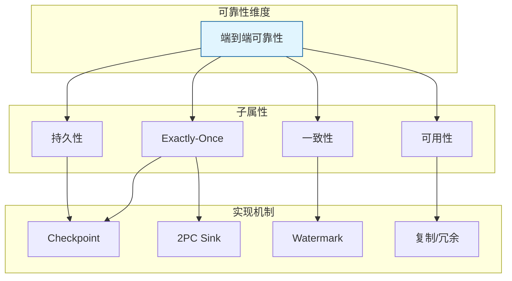
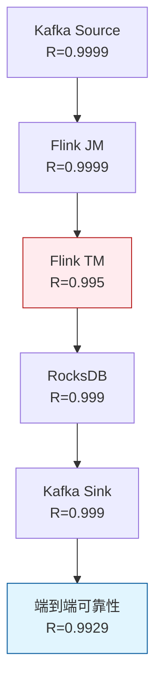

# 端到端可靠性的形式化定义

> **所属阶段**: Struct/ | **前置依赖**: [transactional-stream-semantics.md](./transactional-stream-semantics.md), [exactly-once-end-to-end.md](../Flink/02-core/exactly-once-end-to-end.md) | **形式化等级**: L5

---

## 1. 概念定义 (Definitions)

在分布式流处理系统中，"可靠性"不仅仅指单个组件不崩溃，而是指从数据源到数据汇的整个链路能够在各种故障模式下持续提供正确的结果。
端到端可靠性（End-to-End Reliability）需要将 Source、Processing、State、Sink 等各环节的可靠性进行系统化的组合分析。
Mayer et al.（VLDB 2025）从形式化角度提出了流处理端到端可靠性的定义框架。

**Def-S-22-01 流处理端到端可靠性 (End-to-End Reliability in Streaming)**

设流处理系统 $\mathcal{S}$ 由 $n$ 个组件 $C_1, C_2, \dots, C_n$ 组成（如 Kafka Source、Flink JobManager、TaskManager、RocksDB、Elasticsearch Sink）。
端到端可靠性 $R_{e2e}(\mathcal{S}, T)$ 定义为系统在时间区间 $[0, T]$ 内，对所有输入事件产生正确且完整输出的概率：

$$
R_{e2e}(\mathcal{S}, T) = P\left( \forall e \in \text{Input}_{[0,T]}, \text{Output}(e) \text{ is correct and complete} \right)
$$

其中"correct"意味着输出满足语义规范，"complete"意味着无遗漏。

**Def-S-22-02 可靠性组合函数 (Reliability Composition Function)**

设组件 $C_i$ 的可靠性为 $R_i(T)$。可靠性组合函数 $\mathcal{C}_{rel}$ 将各组件可靠性映射为系统级可靠性：

$$
R_{e2e}(\mathcal{S}, T) = \mathcal{C}_{rel}(R_1(T), R_2(T), \dots, R_n(T), \mathcal{G})
$$

其中 $\mathcal{G}$ 为系统的依赖拓扑图。对于串联结构：

$$
\mathcal{C}_{rel}^{series} = \prod_{i=1}^{n} R_i(T)
$$

对于并联冗余结构：

$$
\mathcal{C}_{rel}^{parallel} = 1 - \prod_{i=1}^{n} (1 - R_i(T))
$$

**Def-S-22-03 故障模式分类学 (Failure Mode Taxonomy)**

流处理系统的故障模式可按以下层次分类：

- **F1-进程级故障**: TaskManager/JVM 崩溃、OOM、死锁
- **F2-节点级故障**: 机器宕机、网络断开、磁盘损坏
- **F3-网络级故障**: 分区、延迟抖动、丢包、乱序
- **F4-数据源故障**: Kafka Broker 不可用、Schema 变更、数据损坏
- **F5-数据汇故障**: Sink 写入失败、事务超时、外部系统不可用
- **F6-语义故障**: Watermark 推进异常、状态不一致、Exactly-Once 失效

**Def-S-22-04 恢复时间目标 (Recovery Time Objective, RTO)**

RTO 定义了系统在发生故障后，必须在多长时间内恢复到可接受的服务水平：

$$
\text{RTO}: \quad P(\text{Recovery Time} \leq t_{RTO}) \geq p_{RTO}
$$

对于流处理系统，恢复时间通常包括故障检测时间、Checkpoint 恢复时间和状态重放时间。

---

## 2. 属性推导 (Properties)

**Lemma-S-22-01 串联系统可靠性上界**

对于由 $n$ 个组件串联构成的系统，若每个组件的可靠性 $R_i \leq 1$，则：

$$
R_{e2e} = \prod_{i=1}^{n} R_i \leq \min_i R_i
$$

*说明*: 串联系统的可靠性受限于最不可靠的组件（"短板效应"）。提升端到端可靠性的关键是强化薄弱环节。$\square$

**Lemma-S-22-02 并联系统可靠性下界**

对于由 $n$ 个相同组件并联冗余构成的系统，若单组件可靠性为 $R$，则：

$$
R_{parallel} = 1 - (1 - R)^n \geq 1 - e^{-nR} \quad \text{（当 } R \ll 1 \text{ 时）}
$$

*说明*: 即使单组件可靠性很低，足够的冗余度也能显著提升系统级可靠性。$\square$

**Prop-S-22-01 可靠性冗余的收益递减**

设并联系统中单组件可靠性为 $R = 0.9$。每增加一个冗余组件，可靠性增益为：

| 冗余度 $n$ | $R_{parallel}$ | 边际增益 |
|:---------:|:--------------:|:--------:|
| 1 | 0.900 | — |
| 2 | 0.990 | 0.090 |
| 3 | 0.999 | 0.009 |
| 4 | 0.9999 | 0.0009 |

*说明*: 冗余的收益遵循边际递减规律，过度冗余会导致成本激增而可靠性提升甚微。$\square$

---

## 3. 关系建立 (Relations)

### 3.1 端到端可靠性与 Exactly-Once 语义的关系



Exactly-Once 语义是端到端可靠性的**必要非充分条件**。即使系统保证了 Exactly-Once，若 Sink 不可用导致输出无法持久化，或 Source 数据在保留期后丢失，端到端可靠性仍然受损。

### 3.2 Flink 端到端可靠性组件映射

| 组件 | 常见故障模式 | 可靠性机制 | 典型可靠性 |
|------|-------------|-----------|-----------|
| **Kafka Source** | Broker 宕机、分区 Rebalance | Offset 持久化、Consumer Group | 0.999 |
| **Flink JobManager** | 进程崩溃、ZK 失联 | HA（ZooKeeper/K8s） | 0.9999 |
| **Flink TaskManager** | OOM、网络分区 | 故障恢复、自动重启 | 0.995 |
| **RocksDB State** | 磁盘损坏、Corruption | Incremental Checkpoint | 0.999 |
| **Kafka Sink** | Broker 不可用 | Kafka Transaction API | 0.999 |
| **JDBC Sink** | 连接池耗尽 | 连接重试、批量写入 | 0.99 |

### 3.3 主流流系统的端到端可靠性保证

| 系统 | 可靠性核心机制 | RTO 典型值 | 数据丢失风险 |
|------|---------------|-----------|-------------|
| **Apache Flink** | Checkpoint + 2PC | 10-60s | 两次 Checkpoint 之间 |
| **Kafka Streams** | Log-based State + Kafka TX | 1-10s | 未确认消息 |
| **Spark Structured Streaming** | WAL + Checkpoint | 10-60s | 与 Flink 类似 |
| **Google Dataflow** | 自动缩放 + 持久化 Shuffle | 30-120s | 极低（托管服务） |
| **AWS Kinesis** | 多 AZ 复制 | < 1s（自动故障转移） | 托管 SLA |

---

## 4. 论证过程 (Argumentation)

### 4.1 为什么需要形式化的端到端可靠性定义？

1. **组件孤立优化无效**: 单独提升 Source 的可靠性到 0.99999，若 Sink 只有 0.99，端到端可靠性仍被 Sink 瓶颈限制在 0.99
2. **SLA 分解**: 企业级流处理系统需要向上游客户承诺 SLA（如 99.99% 可用性），形式化定义帮助将 SLA 分解为各组件的具体指标
3. **故障投入优先级**: 通过可靠性组合分析，可以识别出对端到端可靠性影响最大的薄弱环节，集中资源优化
4. **架构选型依据**: 在自建集群 vs 托管服务、单 Region vs 多 Region 等架构决策中，形式化模型提供了量化比较的基础

### 4.2 Mayer et al. 的可靠性组合模型

Mayer et al.（VLDB 2025）提出了一个考虑依赖拓扑的可靠性组合框架：

1. **组件级可靠性估计**: 基于历史故障日志和 MTBF/MTTR 数据，估计每个组件的 $R_i(T)$
2. **依赖图构建**: 将系统建模为有向无环图（DAG），节点为组件，边为数据/控制依赖
3. **路径可靠性计算**: 对于 Source 到 Sink 的每条路径，计算其串联可靠性
4. **系统级可靠性聚合**: 若存在多条冗余路径（如多分区并行），使用并联公式聚合
5. **瓶颈识别**: 找出对 $R_{e2e}$ 边际贡献最小的组件，作为优化重点

### 4.3 反例：忽视 Sink 可靠性的端到端设计

某电商公司构建了一个 Flink + Redis 的实时推荐流处理系统。系统设计时：

- Source（Kafka）配置了 3 副本，可靠性 0.9999
- Flink Checkpoint 每分钟一次，状态可靠性 0.999
- Redis Sink 使用单节点部署，无持久化

某天 Redis 节点因内存耗尽而崩溃，导致过去 1 小时生成的推荐结果全部丢失，需要重新计算。虽然 Flink 本身成功恢复，但用户看到的推荐系统长时间不可用。

**教训**: 端到端可靠性必须覆盖到最终的数据消费端。Sink 的可靠性往往被低估，但却是整个链路的最后一环。

---

## 5. 形式证明 / 工程论证 (Proof / Engineering Argument)

**Thm-S-22-01 端到端可靠性上界定理**

设流处理系统 $\mathcal{S}$ 的 Source-to-Sink 路径集合为 $\mathcal{P} = \{P_1, P_2, \dots, P_m\}$，每条路径 $P_j$ 由组件 $C_{j1}, C_{j2}, \dots, C_{jk_j}$ 串联组成。则系统的端到端可靠性满足：

$$
R_{e2e}(\mathcal{S}, T) \leq \sum_{j=1}^{m} w_j \cdot \prod_{i=1}^{k_j} R_{ji}(T)
$$

其中 $w_j$ 为路径 $P_j$ 的流量权重（$\sum_j w_j = 1$）。若所有路径共享同一 Sink，则：

$$
R_{e2e}(\mathcal{S}, T) \leq R_{sink}(T)
$$

*证明*:

每条路径必须独立地完成 Source-to-Sink 的数据传输，因此单条路径的可靠性为该路径上所有组件可靠性的乘积。系统的整体可靠性是各路径可靠性的加权组合（因为不同路径可能处理不同的数据分区）。由于所有路径最终都依赖 Sink，Sink 的可靠性构成了端到端可靠性的全局上界。$\square$

---

**Thm-S-22-02 组件可靠性的单调性**

若将系统中任意组件 $C_i$ 的可靠性从 $R_i$ 提升为 $R_i' \geq R_i$（其他组件不变），则端到端可靠性单调不减：

$$
R_{e2e}(\mathcal{S}, T; R_i') \geq R_{e2e}(\mathcal{S}, T; R_i)
$$

*证明*:

对于串联结构，$R_{e2e} = \prod_j R_j$，显然提升任一因子会提升乘积。对于并联结构，$R_{parallel} = 1 - \prod_j (1 - R_j)$，对每个 $R_i$ 求偏导：

$$
\frac{\partial R_{parallel}}{\partial R_i} = \prod_{j \neq i} (1 - R_j) \geq 0
$$

由于任何复杂拓扑都可以分解为串联和并联的子结构，单调性对整体系统成立。$\square$

---

## 6. 实例验证 (Examples)

### 6.1 典型 Flink 作业端到端可靠性估算

假设一个 Flink 作业的链路如下：

```
Kafka Source (R=0.9999)
    -> Flink JobManager (R=0.9999)
    -> Flink TaskManager (R=0.995)
    -> RocksDB State (R=0.999)
    -> Kafka Sink (R=0.999)
```

串联可靠性：

$$
R_{e2e} = 0.9999 \times 0.9999 \times 0.995 \times 0.999 \times 0.999 \approx 0.9929
$$

即端到端可靠性约为 **99.29%**（月度不可用时间约 5 小时）。最薄弱环节是 TaskManager（0.995），若将其提升至 0.999：

$$
R_{e2e}^{new} = 0.9999 \times 0.9999 \times 0.999 \times 0.999 \times 0.999 \approx 0.9969
$$

提升至 **99.69%**（月度不可用时间约 2.2 小时）。

### 6.2 多 Sink 冗余设计

若系统需要更高的可靠性，可引入双 Kafka Sink 冗余：

```
Flink -> Kafka Sink A (R=0.999)
     -> Kafka Sink B (R=0.999)
```

并联可靠性：

$$
R_{sinks} = 1 - (1 - 0.999)^2 = 0.999999
$$

整体链路可靠性：

$$
R_{e2e} = 0.9999 \times 0.9999 \times 0.995 \times 0.999 \times 0.999999 \approx 0.9929
$$

*观察*: 由于 TaskManager 仍然是瓶颈，增加 Sink 冗余对整体可靠性提升微乎其微（从 0.9929 到约 0.9929）。这验证了 Lemma-S-22-01 的结论。

### 6.3 Python 中的可靠性计算工具

```python
def series_reliability(reliabilities):
    """计算串联系统可靠性"""
    result = 1.0
    for r in reliabilities:
        result *= r
    return result

def parallel_reliability(reliabilities):
    """计算并联系统可靠性"""
    failure_prob = 1.0
    for r in reliabilities:
        failure_prob *= (1 - r)
    return 1 - failure_prob

def find_bottleneck(path_components):
    """找出可靠性瓶颈组件"""
    min_r = min(path_components.values())
    bottlenecks = [name for name, r in path_components.items() if r == min_r]
    return bottlenecks, min_r

# 示例
components = {
    "Kafka Source": 0.9999,
    "JobManager": 0.9999,
    "TaskManager": 0.995,
    "RocksDB": 0.999,
    "Kafka Sink": 0.999,
}

e2e_r = series_reliability(components.values())
bottlenecks, min_r = find_bottleneck(components)
print(f"端到端可靠性: {e2e_r:.4f} ({e2e_r*100:.2f}%)")
print(f"瓶颈组件: {bottlenecks}, 可靠性: {min_r}")
```

---

## 7. 可视化 (Visualizations)

### 7.1 流处理系统端到端可靠性分解



### 7.2 冗余度与可靠性增益的关系

```mermaid
xychart-beta
    title "并联冗余度 vs 系统可靠性 (单组件 R=0.9)"
    x-axis [1, 2, 3, 4, 5]
    y-axis "系统可靠性" 0.8 --> 1.0
    line "并联系统" {0.9, 0.99, 0.999, 0.9999, 0.99999}
    line "边际增益" {0, 0.09, 0.009, 0.0009, 0.00009}
```

---

## 8. 引用参考 (References)
