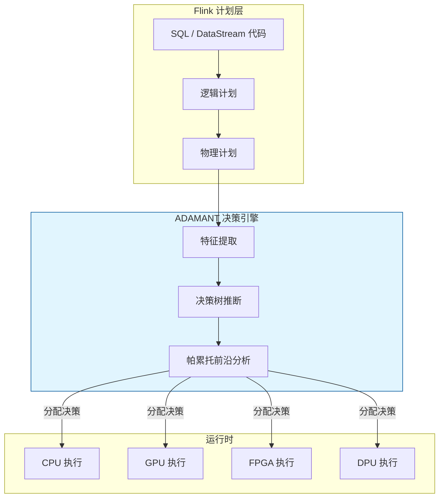
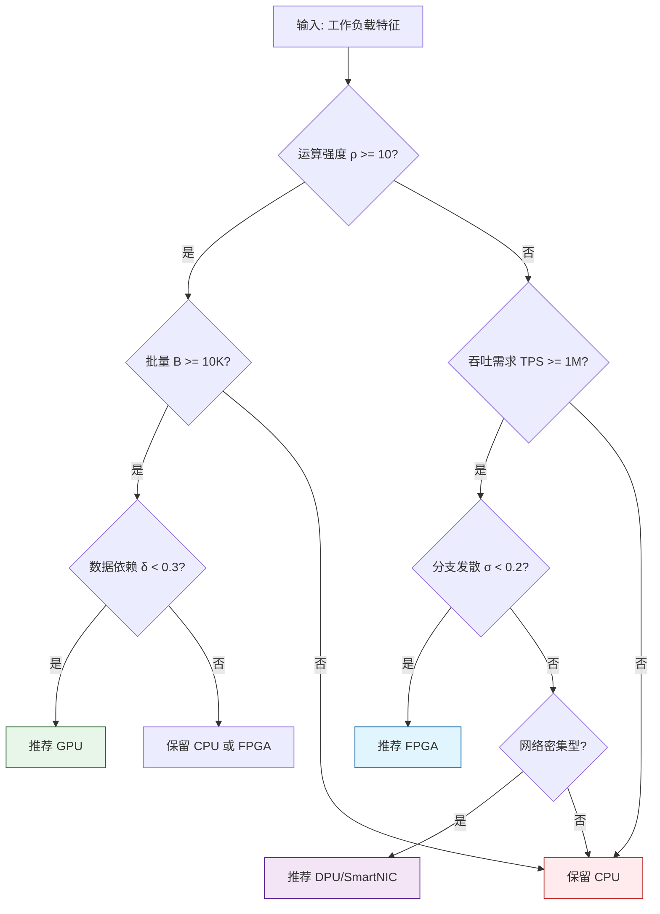
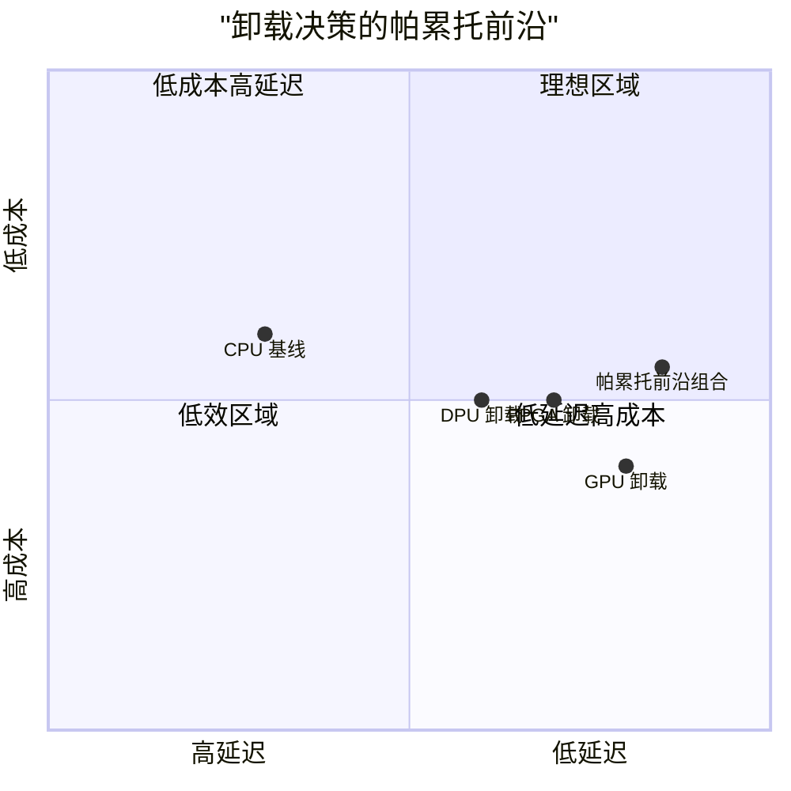

# 硬件卸载决策的形式化模型

> **所属阶段**: Struct/ | **前置依赖**: [hardware-accelerated-streaming.md](../Knowledge/hardware-accelerated-streaming.md), [dpu-stream-processing.md](../Knowledge/dpu-stream-processing.md) | **形式化等级**: L5

---

## 1. 概念定义 (Definitions)

硬件卸载决策是异构计算系统中的核心优化问题：给定一个流处理算子（或算子子图），决定它应该在通用 CPU 上执行，还是应该卸载到 FPGA、GPU、DPU 等专用加速器上。ADAMANT 框架为这一问题提供了系统性的形式化方法。

**Def-S-17-01 卸载决策问题 (Offload Decision Problem)**

设流处理工作负载为 $\mathcal{W} = \{w_1, w_2, \dots, w_n\}$，每个工作负载 $w_i$ 由数据特征 $D_i$ 和计算特征 $C_i$ 描述。可用计算资源集合为 $\mathcal{R} = \{r_{cpu}, r_{fpga}, r_{gpu}, r_{dpu}\}$。卸载决策问题寻求一个分配函数：

$$
\mathcal{A}: \mathcal{W} \to \mathcal{R}
$$

使得整体目标函数 $J(\mathcal{A})$ 最优。

**Def-S-17-02 工作负载特征向量 (Workload Characterization Vector)**

每个工作负载 $w_i$ 的特征向量为：

$$
\vec{\chi}(w_i) = (B_i, \rho_i, \delta_i, \sigma_i, \lambda_i, \mu_i)
$$

- $B_i$: 批量大小（Batch Size），即单次调用的平均输入记录数
- $\rho_i$: 运算强度（Operational Intensity），FLOP/Byte
- $\delta_i$: 数据依赖度，衡量算子内部跨记录状态依赖的程度（$0 \leq \delta_i \leq 1$）
- $\sigma_i$: 分支发散系数，反映条件分支的不可预测性
- $\lambda_i$: 算子变更频率（变更/月），反映业务逻辑的演化速度
- $\mu_i$: 内存访问局部性得分（$0 \leq \mu_i \leq 1$）

**Def-S-17-03 加速器能力模型 (Accelerator Capability Model)**

每个加速器 $r \in \mathcal{R}$ 的能力模型为：

$$
\mathcal{M}(r) = (F_r, B_r^{mem}, B_r^{io}, L_r^{launch}, P_r, C_r^{hour})
$$

- $F_r$: 峰值计算吞吐量（FLOP/s 或 records/s）
- $B_r^{mem}$: 设备内存带宽（Byte/s）
- $B_r^{io}$: 主机-设备互联带宽（Byte/s）
- $L_r^{launch}$: 任务启动/上下文切换延迟（秒）
- $P_r$: 设备空闲+峰值功耗（瓦特）
- $C_r^{hour}$: 设备使用成本（美元/小时）

**Def-S-17-04 卸载收益函数 (Offload Utility Function)**

工作负载 $w_i$ 卸载到加速器 $r$ 的收益函数 $U(w_i, r)$ 定义为：

$$
U(w_i, r) = \alpha \cdot \frac{T_{cpu}(w_i)}{T_r(w_i)} + \beta \cdot \frac{E_{cpu}(w_i)}{E_r(w_i)} + \gamma \cdot \frac{C_{cpu}(w_i)}{C_r(w_i)} - \delta \cdot R(w_i, r)
$$

其中：

- $T$ 为执行时间，$E$ 为能耗，$C$ 为货币成本
- $R(w_i, r)$ 为风险因子（如可维护性、可移植性、故障恢复复杂度）
- $\alpha, \beta, \gamma, \delta$ 为组织偏好的权重系数，满足 $\alpha + \beta + \gamma + \delta = 1$

**Def-S-17-05 帕累托最优卸载决策 (Pareto-Optimal Offload Decision)**

决策 $\mathcal{A}^*$ 是帕累托最优的，当且仅当不存在另一个决策 $\mathcal{A}'$ 使得：

$$
\forall i, J_i(\mathcal{A}') \geq J_i(\mathcal{A}^*) \land \exists j, J_j(\mathcal{A}') > J_j(\mathcal{A}^*)
$$

其中 $J_i$ 为第 $i$ 个目标函数（如延迟、吞吐、能耗、成本）。

**Def-S-17-06 决策树模型 (Decision Tree Model)**

ADAMANT 框架采用分层决策树对卸载问题进行结构化分解。设决策树深度为 $d$，每个内部节点对应一个特征阈值判断，叶子节点对应一个加速器推荐 $r \in \mathcal{R}$ 或保留在 CPU 的决策。

---

## 2. 属性推导 (Properties)

**Lemma-S-17-01 运算强度与加速器选择的相关性**

对于高运算强度工作负载（$\rho_i \gg 1$），GPU 通常是更优选择；对于低运算强度但高吞吐要求的工作负载（$\rho_i \ll 1, TPS_i \gg 10^6$），FPGA 或 DPU 更具优势。

*说明*: GPU 的峰值计算能力需要足够的运算强度才能充分发挥；FPGA/DPU 的流水线架构更适合内存密集型、规则化的流处理任务。$\square$

**Lemma-S-17-02 数据依赖度与卸载可行性的反比关系**

若工作负载的数据依赖度 $\delta_i \to 1$（如需要维护跨记录的复杂状态），则有效并行度受限，卸载收益 $U(w_i, r)$ 随 $\delta_i$ 增加而单调递减。

*说明*: 高度状态化的算子（如长周期 Session Window）在加速器上的并行扩展性较差，通常更适合留在 CPU 执行。$\square$

**Lemma-S-17-03 启动延迟与批量大小的权衡**

设加速器启动延迟为 $L_r^{launch}$，单记录处理时间为 $t_r$。则当批量大小 $B_i$ 满足以下条件时，卸载的平均单记录成本低于 CPU：

$$
B_i \geq \frac{L_r^{launch}}{t_{cpu} - t_r - \frac{D_i}{B_r^{io}}}
$$

*说明*: 该引理给出了每个加速器-工作负载对的最小有效批量阈值，是生产环境中调度器设计的核心依据。$\square$

**Prop-S-17-01 多目标优化中的不可兼得的三角**

在流处理硬件卸载决策中，延迟、成本和可维护性通常构成不可兼得的三角：

- 追求最低延迟 → FPGA 定制化 → 高开发成本、低可维护性
- 追求最低成本 → 保留在 CPU → 高延迟、高能耗
- 追求最高可维护性 → GPU CUDA 代码 → 中等延迟和成本

---

## 3. 关系建立 (Relations)

### 3.1 ADAMANT 决策树与 Flink 优化器的集成



### 3.2 工作负载特征与加速器映射矩阵

| 特征组合 | 推荐加速器 | 原因 |
|---------|-----------|------|
| 高 $\rho$ + 大 $B$ + 低 $\delta$ | GPU | 数据并行计算密集型任务 |
| 低 $\rho$ + 高 $TPS$ + 低 $\sigma$ | FPGA | 内存密集型、规则流水线 |
| 网络密集型 + 安全需求 | DPU/SmartNIC | 网络卸载、内核旁路 |
| 高 $\delta$ + 高 $\lambda$ | CPU | 状态依赖强、变更频繁 |
| 低 $B$ + 任意 | CPU | 批量不足，卸载开销不可摊销 |

### 3.3 与 Roofline 模型的关联

ADAMANT 的运算强度概念 $\rho_i$ 直接来源于 Roofline 模型。Roofline 模型描述了计算性能上限与内存带宽上限的交汇点：

$$
P_{max} = \min(P_{peak}, \rho \cdot B_{mem})
$$

在卸载决策中，我们首先用 Roofline 模型判断工作负载在目标加速器上是否受内存带宽限制。若 $\rho_i \cdot B_r^{mem} < F_r$，则加速器的计算能力无法充分利用，卸载收益可能低于预期。

---

## 4. 论证过程 (Argumentation)

### 4.1 为什么需要一个形式化的卸载决策模型？

在早期的硬件加速实践中，卸载决策往往基于工程师的直觉或简单的基准测试。这种方法存在明显缺陷：

1. **局部最优**: 某个算子在 GPU 上比 CPU 快 2 倍，但如果考虑数据传输和调度开销，端到端可能反而更慢
2. **环境敏感**: 实验室环境中的测试结果可能与生产环境（多租户、网络拥塞、共享存储）差异巨大
3. **多目标冲突**: 不同团队关注的指标不同（基础设施团队关注 TCO，算法团队关注延迟，运维团队关注稳定性）
4. **动态演化**: 业务逻辑、数据分布和硬件代际都在持续变化，静态决策很快过时

ADAMANT 框架通过形式化的特征向量和多目标优化，将卸载决策从"艺术"转化为"可计算的科学"。

### 4.2 决策树的构建方法

ADAMANT 决策树的训练数据来源于：

- **离线微基准测试**: 对常见算子类型（Filter、Map、Join、Aggregate、CEP）在不同加速器上的性能采样
- **生产遥测数据**: 从实际 Flink 集群中采集的执行时间、资源利用率、错误率等指标
- **成本核算数据**: 云厂商的按需/预留实例价格、电费、运维人力成本

决策树的每个节点对应一个特征阈值，例如：

- $\rho_i \geq 10$ FLOP/Byte？→ 走向 GPU 分支
- $B_i \geq 10000$？→ 继续评估 GPU 可行性
- $\delta_i \geq 0.5$？→ 回退到 CPU 分支

### 4.3 反例：单一指标驱动的错误决策

某团队单纯以"GPU Hash Join 比 CPU 快 10 倍"为由，将所有 Join 算子 offload 到 GPU。结果生产环境出现严重问题：

- 小窗口 Join（$B_i < 1000$）的 GPU 启动和传输开销使实际延迟增加了 3 倍
- 涉及复杂范围谓词的 Join 在 GPU 上由于 Warp Divergence，实际加速比只有 1.5 倍
- GPU 显存不足导致大状态 Join 频繁触发 Out-Of-Memory，作业频繁重启

**教训**: 卸载决策必须综合考虑批量大小、运算强度、数据依赖度和环境约束，不能仅凭单一算子的峰值性能数据做判断。

---

## 5. 形式证明 / 工程论证 (Proof / Engineering Argument)

**Thm-S-17-02 卸载决策的 NP-hard 下界**

在一般情况下，考虑 $n$ 个工作负载和 $m$ 种加速器类型，且每个工作负载的卸载决策会影响共享资源（如 PCIe 带宽、设备内存）的可用性，则寻找全局最优分配 $\mathcal{A}^*$ 的问题是 NP-hard。

*证明梗概*:

考虑一个特例：所有工作负载具有相同的执行特征，加速器资源有限（如只有 $k$ 个 GPU 插槽）。此时问题退化为将 $n$ 个任务分配到 $m$ 种机器类型上的调度问题，且需要考虑资源约束。这是经典的 GAP（Generalized Assignment Problem），已知为 NP-hard。由于 GAP 是本问题的特例，故原问题也是 NP-hard。$\square$

---

**Thm-S-17-03 贪心启发式的近似保证**

若将工作负载按卸载收益 $U(w_i, r)$ 降序排列，并依次将每个工作负载分配到能使其收益最大化的加速器（或 CPU）上，则该贪心算法获得的解 $\mathcal{A}_{greedy}$ 满足：

$$
J(\mathcal{A}_{greedy}) \geq \left(1 - \frac{1}{e}\right) \cdot J(\mathcal{A}^*)
$$

前提是目标函数 $J$ 是单调子模函数且资源约束为拟阵约束。

*证明梗概*:

对于子模函数最大化问题，在拟阵约束下，贪心算法具有 $(1 - 1/e)$ 的近似比是经典结果（Nemhauser et al., 1978）。若我们将卸载收益的总和作为子模目标函数，将每个加速器的容量约束视为拟阵约束，则该结论直接适用。$\square$

---

**Thm-S-17-04 最小有效批量的闭合形式**

设 CPU 处理批量 $B$ 的时间为 $T_{cpu}(B) = c_0 + c_1 B$，加速器处理时间为 $T_{acc}(B) = l_0 + l_1 B$（含启动开销 $l_0$），数据移动时间为 $T_{move}(B) = \frac{D \cdot B}{B_{io}}$。则卸载优于 CPU 的最小批量 $B_{min}$ 为：

$$
B_{min} = \max\left(0, \frac{l_0 - c_0}{c_1 - l_1 - \frac{D}{B_{io}}} \right)
$$

前提是分母 $c_1 - l_1 - \frac{D}{B_{io}} > 0$。

*证明*:

要求 $T_{acc}(B) + T_{move}(B) < T_{cpu}(B)$，即：

$$
l_0 + l_1 B + \frac{D B}{B_{io}} < c_0 + c_1 B
$$

整理得：

$$
l_0 - c_0 < B \left( c_1 - l_1 - \frac{D}{B_{io}} \right)
$$

若分母为正，两边同除即得 $B_{min}$。$\square$

---

**Thm-S-17-05 运算强度阈值与加速器选择**

设 CPU 的峰值计算性能为 $F_{cpu}$，内存带宽为 $B_{cpu}^{mem}$；GPU 的对应参数为 $F_{gpu}$ 和 $B_{gpu}^{mem}$。则存在运算强度阈值：

$$
\rho^* = \frac{F_{cpu} / B_{cpu}^{mem} - F_{gpu} / B_{gpu}^{mem}}{F_{gpu} - F_{cpu}} \cdot F_{gpu} \cdot B_{gpu}^{mem}
$$

（简化形式）。更直观地，当运算强度满足：

$$
\rho \geq \frac{F_{gpu}}{B_{gpu}^{mem}}
$$

时，GPU 处于计算受限区，能够充分发挥其峰值性能；当 $\rho < \frac{F_{gpu}}{B_{gpu}^{mem}}$ 时，GPU 受内存带宽限制，实际加速比可能不理想。

*说明*: 该定理来源于 Roofline 模型，是 ADAMANT 决策树中判断 GPU 适用性的关键阈值。$\square$

---

## 6. 实例验证 (Examples)

### 6.1 ADAMANT 风格的决策流程



### 6.2 基于收益函数的量化评估

假设某窗口聚合算子有以下特征：

- $B = 50,000$，$\rho = 25$ FLOP/Byte，$\delta = 0.1$

各平台性能估算：

- CPU: $T_{cpu} = 120$ ms，$E_{cpu} = 15$ J
- GPU: $T_{gpu} = 8$ ms，$E_{gpu} = 5$ J（含传输）
- FPGA: $T_{fpga} = 15$ ms，$E_{fpga} = 2$ J

设权重 $\alpha=0.5, \beta=0.3, \gamma=0.1, \delta=0.1$：

$$
U(w, gpu) = 0.5 \times 15 + 0.3 \times 3 + 0.1 \times 1 - 0.1 \times 0.3 = 8.37
$$

$$
U(w, fpga) = 0.5 \times 8 + 0.3 \times 7.5 + 0.1 \times 0.8 - 0.1 \times 0.5 = 6.33
$$

在此目标偏好下，GPU 是更优选择。

### 6.3 Flink 自适应卸载调度器原型

```java
/**
 * ADAMANT 风格的硬件卸载决策器
 * 根据工作负载特征动态选择执行后端
 */
public class HardwareOffloadDecider {

    public AcceleratorType decide(WorkloadProfile profile) {
        // 1. 计算运算强度
        double rho = profile.getFlops() / profile.getBytesMoved();

        // 2. 检查最小批量阈值
        if (profile.getBatchSize() < getMinBatchThreshold(profile)) {
            return AcceleratorType.CPU;
        }

        // 3. 高运算强度 + 大数据依赖低 → GPU
        if (rho >= GPU_ROOFLINE_THRESHOLD && profile.getDependency() < 0.3) {
            return AcceleratorType.GPU;
        }

        // 4. 高吞吐 + 低分支发散 → FPGA
        if (profile.getRequiredTps() > 1_000_000 && profile.getBranchDivergence() < 0.2) {
            return AcceleratorType.FPGA;
        }

        // 5. 网络密集型 → DPU
        if (profile.isNetworkIntensive()) {
            return AcceleratorType.DPU;
        }

        return AcceleratorType.CPU;
    }

    private double getMinBatchThreshold(WorkloadProfile profile) {
        double launchLatency = profile.getAcceleratorLaunchLatency();
        double cpuTimePerRecord = profile.getCpuTimePerRecord();
        double accTimePerRecord = profile.getAccelTimePerRecord();
        double ioBandwidth = profile.getIoBandwidth();
        double recordSize = profile.getAvgRecordSize();

        double denominator = cpuTimePerRecord - accTimePerRecord - recordSize / ioBandwidth;
        if (denominator <= 0) return Double.MAX_VALUE;
        return launchLatency / denominator;
    }
}
```

---

## 7. 可视化 (Visualizations)

### 7.1 卸载决策的 Roofline 分析

```mermaid
xychart-beta
    title "Roofline 模型与加速器选择"
    x-axis "运算强度 ρ (FLOP/Byte)" [0.1, 1, 10, 100]
    y-axis "性能 (GFLOP/s)" 0 --> 10000
    line "CPU Roof" {100, 100, 100, 100}
    line "GPU Roof" {100, 100, 5000, 10000}
    line "FPGA Roof" {200, 200, 200, 200}
    line "工作负载 A" {10, 500, 500, 500}
    line "工作负载 B" {1, 50, 50, 50}
```

*说明*: 工作负载 A（$\rho=10$）位于 GPU 的内存带宽受限区边缘，加速效果中等；工作负载 B（$\rho=1$）位于所有设备的内存受限区，可能更适合 FPGA。

### 7.2 多目标帕累托前沿



---

## 8. 引用参考 (References)

---

*文档版本: v1.0 | 创建日期: 2026-04-15*
