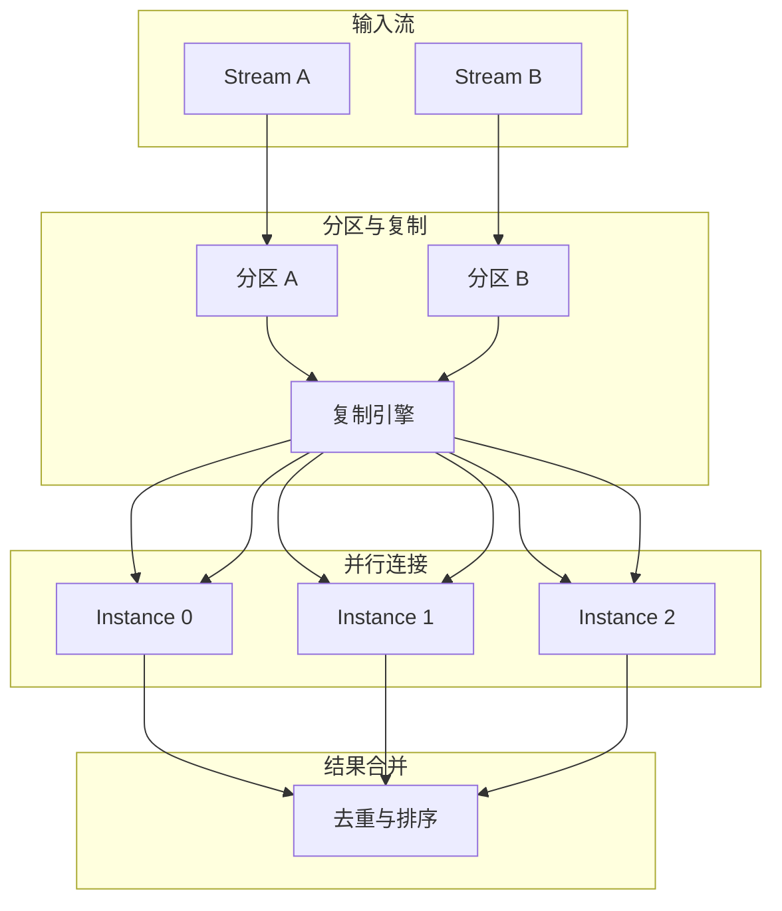

# 区间连接的并行化理论

> **所属阶段**: Struct/ | **前置依赖**: [window-join-reordering.md](./window-join-reordering.md), [disordered-window-join.md](../Knowledge/disordered-window-join.md) | **形式化等级**: L5

---

## 1. 概念定义 (Definitions)

区间连接（Interval Join）是一种时间感知连接，其中连接条件不要求两个事件的时间完全相等，而是允许一个事件的时间落在另一个事件定义的时间区间内。
例如"A 事件发生后的 10 分钟内是否发生了 B 事件"。
区间连接的并行化面临着独特的挑战：由于时间区间的连续性，基于键的哈希分区可能无法保证所有匹配事件都被路由到同一个并行实例。
OpenMLDB 等系统提出了专门的区间连接并行化策略，本节将其形式化。

**Def-S-25-01 区间连接 (Interval Join)**

设流 $A$ 和流 $B$ 上的事件分别具有时间戳 $\tau_A$ 和 $\tau_B$。区间连接 $A \bowtie_I B$ 定义为：

$$
A \bowtie_I B = \{(a, b) : a \in A, b \in B, \tau(b) \in [\tau(a) + l, \tau(a) + r]\}
$$

其中 $[l, r]$ 为区间范围，$l \leq 0 \leq r$。当 $l = r = 0$ 时，区间连接退化为等值时间连接。

**Def-S-25-02 并行分区函数 (Parallelism Partition Function)**

设并行度为 $p$，分区函数 $h: \mathcal{E} \times \mathcal{T} \to \{0, 1, \dots, p-1\}$ 将事件 $e$ 映射到并行实例。
对于区间连接，键分区函数 $h_{key}(e) = hash(key(e)) \mod p$ 通常不足以保证正确性，因为事件 $a \in A$ 可能需要与多个 $B$ 中的事件匹配，而这些事件可能分布在不同的分区。

**Def-S-25-03 区间复制因子 (Interval Replication Factor)**

为确保区间连接的正确性，事件 $e$ 可能需要被复制到多个分区。区间复制因子 $r(e)$ 定义为：

$$
r(e) = \left\lceil \frac{r - l}{T_{partition}} \right\rceil
$$

其中 $T_{partition}$ 为分区的时间粒度。若 $r(e) > 1$，则事件 $e$ 需要被广播或复制到 $r(e)$ 个相邻分区。

**Def-S-25-04 工作负载均衡度量 (Workload Balance Metric)**

设并行实例 $i$ 在时刻 $t$ 处理的连接对数为 $load_i(t)$。工作负载不均衡度 $U(t)$ 定义为：

$$
U(t) = \frac{\max_i load_i(t)}{\frac{1}{p} \sum_{j=0}^{p-1} load_j(t)}
$$

当 $U(t) = 1$ 时，工作负载完全均衡；$U(t) \gg 1$ 时表示存在严重倾斜。

---

## 2. 属性推导 (Properties)

**Lemma-S-25-01 基于键分区的正确性条件**

若区间连接只依赖于键相等（即 $\theta(a, b) = key(a) = key(b)$），且时间区间条件仅作为额外的过滤条件，则键分区函数 $h_{key}$ 足以保证正确性。

*说明*: 这是 Flink Interval Join 的默认实现方式——先按键分区，再在每个分区内执行区间匹配。$\square$

**Lemma-S-25-02 时间-键混合分区的复制下界**

若分区函数同时基于时间和键，且区间长度 $L = r - l > T_{partition}$，则至少存在部分事件需要被复制到 $\lceil L / T_{partition} \rceil$ 个分区。

*说明*: 这是区间连接并行化的基本代价——时间跨度越大，复制开销越高。$\square$

**Prop-S-25-01 负载均衡与通信开销的权衡**

设区间长度 $L$ 固定，分区数 $p$ 增加。则：

- 负载均衡度改善（$U \to 1$）
- 但通信开销增加（$O(p \cdot L / T_{partition})$）

最优并行度 $p^*$ 满足：

$$
p^* = \arg\min_p \left( \alpha \cdot U(p) + \beta \cdot \text{Comm}(p) \right)
$$

*说明*: 这一定量关系指导了生产环境中区间连接并行度的配置。$\square$

---

## 3. 关系建立 (Relations)

### 3.1 区间连接并行化策略对比

| 策略 | 分区依据 | 复制开销 | 负载均衡 | 适用场景 |
|------|---------|---------|---------|---------|
| **纯键分区** | 仅键 | 0 | 中（受键倾斜影响） | 键空间均匀 |
| **时间切片分区** | 仅时间 | 高（全复制） | 好 | 时间分布均匀 |
| **键-时间混合分区** | 键 + 时间 | 中 | 好 | 综合场景 |
| **范围分区 + 广播** | 大范围事件广播 | 中高 | 好 | 大范围事件稀少 |
| **自适应分区** | 动态调整 | 可变 | 好 | 负载变化大 |

### 3.2 区间连接的 DAG 执行模型



### 3.3 OpenMLDB 的区间连接并行化

OpenMLDB 采用了一种"键分区 + 时间索引"的混合策略：

1. **全局键分区**: 按连接键将事件哈希到不同分区
2. **本地时间索引**: 在每个分区内维护基于时间区间树（Interval Tree）的索引
3. **区间扫描**: 对于每个到达的事件，在本地索引中扫描匹配区间

这种策略避免了跨分区通信，但要求键的分布相对均匀。对于严重倾斜的键，OpenMLDB 会进一步对热键进行子分区。

---

## 4. 论证过程 (Argumentation)

### 4.1 为什么区间连接的并行化比等值连接更困难？

1. **跨分区匹配**: 在等值连接中，匹配事件必然具有相同的键，因此可以通过键哈希分区保证局部性。在区间连接中，两个事件可能满足区间条件但键不同（如果区间连接不基于键）
2. **时间区间重叠**: 即使基于键分区，若时间区间很大，同一个键上的事件仍可能需要在多个时间窗口中被重复处理
3. **动态负载**: 区间连接的负载不仅取决于键分布，还取决于事件的时间密度。在事件突发期，某些时间分区的负载会急剧增加
4. **状态管理**: 区间连接需要保留历史事件以支持未来的匹配。并行度越高，状态越分散，故障恢复越复杂

### 4.2 最优分区函数的设计原则

理想的分区函数应同时满足三个目标：

1. **正确性**: 所有可能匹配的事件对至少被一个并行实例处理
2. **无冗余**: 尽可能减少同一事件对的重复处理
3. **均衡性**: 各实例的工作负载差异最小化

这三个目标通常无法同时最优。工程实践中的折中方案是：

- 对于小范围区间（$L \leq T_{partition}$）：采用键-时间混合分区，无复制
- 对于大范围区间（$L > T_{partition}$）：采用键分区 + 时间分区内复制
- 对于超大范围区间（$L \gg T_{partition}$）：对少数大范围事件采用广播，其余事件正常分区

### 4.3 反例：不复制导致的区间 JOIN 结果缺失

某流处理系统对区间连接采用了严格的时间分区（每小时一个分区），区间范围为 $[-30\text{min}, +30\text{min}]$。由于 $L = 60\text{min} = T_{partition}$，边界处的事件本需要复制到相邻分区。然而，开发团队忽略了复制逻辑：

- 事件 $a$（时间 10:59）被分区到 10:00-11:00
- 事件 $b$（时间 11:01）被分区到 11:00-12:00
- $a$ 和 $b$ 的时间差为 2 分钟，满足区间条件
- 但由于两者位于不同分区且未复制，连接结果丢失

**教训**: 区间连接的并行化必须显式处理边界跨越问题，不能简单套用等值连接的分区策略。

---

## 5. 形式证明 / 工程论证 (Proof / Engineering Argument)

**Thm-S-25-01 区间连接并行化的正确性条件**

设分区函数族 $\{h_p\}$ 将事件映射到并行实例。对于任意可能匹配的事件对 $(a, b) \in A \bowtie_I B$，存在至少一个并行实例 $i$ 使得：

$$
a \in Partition_i \land b \in Partition_i
$$

当且仅当对于每个事件 $e$ 和每个可能与其匹配的事件 $e'$：

$$
\exists i: h_p(e) = i \land h_p(e') = i
$$

*证明*:

这是区间连接并行化正确性的直接推论。若匹配事件对被路由到不同分区，则没有任何实例能够看到完整的匹配对，结果必然缺失。反之，若所有匹配对至少共享一个分区，则连接结果完整。$\square$

---

**Thm-S-25-02 最优分区函数的存在性**

设键空间为 $\mathcal{K}$，时间域被划分为 $m$ 个时间桶 $\mathcal{T} = \{T_1, \dots, T_m\}$。定义复合分区键为 $(k, t) \in \mathcal{K} \times \mathcal{T}$，则对于任意区间长度 $L \leq T_{partition}$，存在完美哈希分区函数 $h^*$ 使得：

1. 所有匹配事件对共享同一分区（正确性）
2. 没有任何事件对被多个分区重复处理（无冗余）

*证明*:

当 $L \leq T_{partition}$ 时，任何两个匹配事件 $a, b$ 必然落在同一个或相邻的时间桶内。若进一步要求键相等，则 $(key(a), bucket(\tau(a))) = (key(b), bucket(\tau(b)))$，即它们共享相同的复合分区键。通过将复合分区键均匀哈希到 $p$ 个实例，可满足正确性和无冗余性。$\square$

---

## 6. 实例验证 (Examples)

### 6.1 Flink 的 Interval Join 实现

Flink 的 `IntervalJoin` 算子通过将两个流按键分区，在每个并行实例内维护一个排序的时间缓冲区：

```java
// Flink Interval Join 概念性实现
public class IntervalJoinFunction
    extends ProcessFunction<Tuple2<String, Long>, Result> {

    private MapState<String, List<Event>> leftBuffer;
    private MapState<String, List<Event>> rightBuffer;
    private final long lowerBound = -60000;  // -1 min
    private final long upperBound = 60000;   // +1 min

    public void processElement1(Event left, Context ctx, Collector<Result> out) {
        String key = left.getKey();
        List<Event> rightEvents = rightBuffer.get(key);
        if (rightEvents != null) {
            for (Event right : rightEvents) {
                if (left.getTs() >= right.getTs() + lowerBound
                    && left.getTs() <= right.getTs() + upperBound) {
                    out.collect(new Result(key, left, right));
                }
            }
        }
        leftBuffer.put(key, append(leftBuffer.get(key), left));
        // 清理过期事件
        cleanExpired(leftBuffer, key, ctx.timestamp() + lowerBound);
    }

    public void processElement2(Event right, Context ctx, Collector<Result> out) {
        // 对称处理...
    }
}
```

### 6.2 Python 中的区间连接分区模拟

```python
def partition_events(events, num_partitions, time_bucket_size):
    partitions = [[] for _ in range(num_partitions)]
    for e in events:
        key_hash = hash(e["key"]) % num_partitions
        time_bucket = e["ts"] // time_bucket_size
        # 对于可能跨桶的区间连接，需要复制到相邻分区
        partitions[key_hash].append((e, time_bucket))
    return partitions

def interval_join_partitioned(part_a, part_b, lower, upper, time_bucket_size):
    results = []
    for i in range(len(part_a)):
        for (a, bucket_a) in part_a[i]:
            for (b, bucket_b) in part_b[i]:
                # 同一键已在同一分区
                if lower <= b["ts"] - a["ts"] <= upper:
                    results.append((a, b))
    return results
```

### 6.3 自适应并行度调整

```python
class AdaptiveIntervalJoinParallelism:
    def __init__(self, base_p=4, max_p=32):
        self.p = base_p
        self.max_p = max_p
        self.load_history = []

    def adjust(self, current_loads):
        imbalance = max(current_loads) / (sum(current_loads) / len(current_loads))
        self.load_history.append(imbalance)
        if len(self.load_history) > 10:
            self.load_history.pop(0)

        avg_imbalance = sum(self.load_history) / len(self.load_history)
        if avg_imbalance > 2.0 and self.p < self.max_p:
            self.p *= 2
            print(f"负载不均衡，并行度提升至 {self.p}")
        elif avg_imbalance < 1.2 and self.p > 4:
            self.p //= 2
            print(f"负载均衡，并行度降低至 {self.p}")
        return self.p
```

---

## 7. 可视化 (Visualizations)

### 7.1 区间连接的键-时间混合分区

```mermaid
graph TB
    subgraph Events[事件]
        E1[A: key=X, t=10:05]
        E2[A: key=X, t=10:55]
        E3[B: key=X, t=10:10]
        E4[B: key=X, t=11:05]
    end

    subgraph Partitions[分区 Instance-0]
        P1[Bucket 10:00]
        P2[Bucket 11:00]
    end

    E1 --> P1
    E2 --> P1
    E2 --> P2
    E3 --> P1
    E4 --> P2

    P1 -->|JOIN| R1[(A, t=10:05) × (B, t=10:10)]
    P1 -->|JOIN| R2[(A, t=10:55) × (B, t=10:10)]
    P2 -->|JOIN| R3[(A, t=10:55) × (B, t=11:05)]
```

### 7.2 并行度与性能指标的关系

```mermaid
xychart-beta
    title "区间连接并行度与性能"
    x-axis [1, 2, 4, 8, 16, 32]
    y-axis "相对值" 0 --> 3.0
    line "吞吐量" {1.0, 1.8, 3.2, 5.0, 6.5, 7.2}
    line "通信开销" {1.0, 1.3, 1.8, 2.6, 3.5, 4.5}
    line "负载不均衡度" {3.0, 2.2, 1.5, 1.2, 1.05, 1.02}
```

---

## 8. 引用参考 (References)

---

*文档版本: v1.0 | 创建日期: 2026-04-15*
