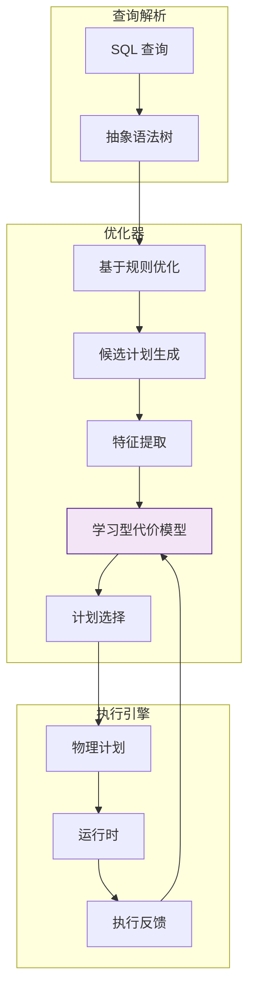
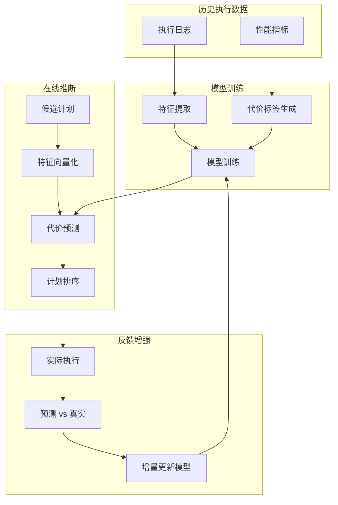

# 学习型成本模型在流处理中的应用

> **所属阶段**: Struct/ | **前置依赖**: [llm-stream-tuning.md](../Knowledge/llm-stream-tuning.md), [flink-system-architecture-deep-dive.md](../Flink/01-concepts/flink-system-architecture-deep-dive.md) | **形式化等级**: L5

---

## 1. 概念定义 (Definitions)

基于代价的优化器（CBO）的核心是准确估计查询执行计划的代价。
传统代价模型依赖手工标定的公式和启发式假设，难以适应复杂的流处理执行环境（如动态数据倾斜、异构硬件、状态后端差异）。
学习型成本模型（Learned Cost Model）通过机器学习从大量历史执行记录中学习计划特征与真实执行代价之间的映射关系，能够显著提升代价估计的准确性。
Heinrich et al.（PVLDB 2025）将这一思想扩展到了流处理领域。

**Def-S-21-01 流处理学习型成本模型 (Learned Cost Model for Streaming)**

流处理学习型成本模型 $\mathcal{M}_{cost}$ 是一个监督学习模型，将执行计划 $P$ 映射到预测代价 $\hat{C}$：

$$
\mathcal{M}_{cost}: \phi(P) \mapsto \hat{C}(P)
$$

其中 $\phi(P) \in \mathbb{R}^d$ 为计划 $P$ 的特征向量，$\hat{C}(P) \in \mathbb{R}^+$ 为预测的代价（可以是延迟、吞吐量倒数、资源消耗等）。
模型的训练数据为历史执行记录 $\{(\phi(P_i), C(P_i))\}_{i=1}^{N}$。

**Def-S-21-02 计划特征向量 (Plan Feature Vector)**

计划特征向量 $\phi(P)$ 编码了执行计划的拓扑结构、算子类型、数据特征和运行时环境：

$$
\phi(P) = [\phi_{struct}(P); \phi_{operator}(P); \phi_{data}(P); \phi_{env}(P)]
$$

其中：

- $\phi_{struct}$: 计划深度、宽度、JOIN 数量、DAG 复杂度
- $\phi_{operator}$: 各算子类型（Filter/Map/Window/Join/Aggregate）的分布
- $\phi_{data}$: 输入速率、数据倾斜度、键基数、事件时间乱序度
- $\phi_{env}$: 并行度、CPU 核数、内存大小、状态后端类型

**Def-S-21-03 流处理代价替代模型 (Streaming Cost Surrogate)**

由于真实流处理代价 $C(P)$ 需要在实际集群上执行才能获得，代价替代模型（Surrogate）$\hat{C}_s$ 使用轻量级模拟或历史插值来近似真实代价：

$$
\hat{C}_s(P) = \mathbb{E}_{P' \sim \mathcal{N}(P)} [C(P')]
$$

其中 $\mathcal{N}(P)$ 为与 $P$ 在历史记录中相似的计划集合。 surrogate 模型用于快速生成训练标签，避免每次都在真实集群上执行计划。

**Def-S-21-04 代价估计误差 (Cost Estimation Error)**

设模型对计划 $P$ 的预测代价为 $\hat{C}(P)$，真实代价为 $C(P)$。常用的误差度量包括：

- **绝对相对误差 (ARE)**:
  $$
  \text{ARE}(P) = \frac{|\hat{C}(P) - C(P)|}{C(P)}
  $$
- **排序一致性 (Rank Correlation)**:
  $$
  \rho_{rank} = \text{Corr}_{Spearman}\left(\{\hat{C}(P_i)\}, \{C(P_i)\}\right)
  $$

对于基于代价的优化器，排序一致性比绝对误差更为关键——优化器只需要知道哪个计划更便宜，而不需要知道精确的代价数值。

---

## 2. 属性推导 (Properties)

**Lemma-S-21-01 代价函数的 Lipschitz 连续性**

若两个执行计划 $P_1$ 和 $P_2$ 的特征向量距离为 $\|\phi(P_1) - \phi(P_2)\|_2 \leq \delta$，且真实代价函数 $C(P)$ 对特征变化敏感但不过度剧烈，则存在常数 $L > 0$ 使得：

$$
|C(P_1) - C(P_2)| \leq L \cdot \|\phi(P_1) - \phi(P_2)\|_2
$$

*说明*: Lipschitz 连续性保证了相似计划的代价相近，这是学习型模型能够泛化到新计划的基本前提。$\square$

**Lemma-S-21-02 替代模型一致性**

设历史计划集合为 $\mathcal{H}$， surrogate 模型 $\hat{C}_s$ 在 $\mathcal{H}$ 上满足 $\hat{C}_s(P) = C(P)$。对于新计划 $P \notin \mathcal{H}$，若 $P$ 可分解为 $k$ 个历史已知子计划 $\{P_i\}$ 的组合，则：

$$
\hat{C}_s(P) = \sum_{i=1}^{k} w_i \cdot C(P_i) + \epsilon_{surrogate}
$$

其中 $w_i$ 为子计划权重，$\epsilon_{surrogate}$ 为组合误差。当子计划之间无显著资源竞争时，$\epsilon_{surrogate} \to 0$。

*说明*: 这是基于算子级代价累加的经典假设。$\square$

**Prop-S-21-01 模型准确率与训练数据规模的关系**

设训练集大小为 $N$，模型复杂度为 $d$（特征维度），则在 i.i.d. 假设下，测试集上的平均相对误差满足：

$$
\mathbb{E}[\text{ARE}_{test}] \leq \mathbb{E}[\text{ARE}_{train}] + O\left(\sqrt{\frac{d \log N}{N}}\right)
$$

*说明*: 增加训练数据量和降低模型复杂度都能减小泛化误差。$\square$

---

## 3. 关系建立 (Relations)

### 3.1 学习型成本模型与传统代价模型的对比

| 维度 | 传统代价模型 | 学习型成本模型 |
|------|-------------|---------------|
| 构建方式 | 手工标定公式 | 从历史数据自动学习 |
| 适应性 | 差（难以适应新硬件/新算子） | 强（重新训练即可） |
| 解释性 | 高（公式透明） | 中（特征重要性可解释） |
| 数据需求 | 无 | 大量历史执行记录 |
| 对异常值敏感 | 低 | 高 |
| 排序一致性 | 中 | 高（通常 > 0.9） |

### 3.2 学习型 CBO 在流处理优化器中的位置



### 3.3 主流学习型代价模型架构

| 模型 | 输入表示 | 学习范式 | 适用场景 |
|------|---------|---------|---------|
| **NeuroCard** | 查询特征向量 | 深度神经网络 | 基数估计 |
| **Balsa** | 树形结构（Tree-LSTM） | 强化学习 | 端到端查询优化 |
| **Lero** | 计划对比较 | 成对排序学习 | 计划排序 |
| **Heinrich et al. (2025)** | 流计划图特征 | 图神经网络 (GNN) | 流处理代价估计 |

---

## 4. 论证过程 (Argumentation)

### 4.1 为什么流处理需要学习型成本模型？

1. **动态环境**: 流处理系统的输入速率、数据分布、硬件负载时刻变化，传统标定公式无法实时适应
2. **复杂算子交互**: 窗口算子、状态算子、异步 Sink 之间的资源竞争具有强非线性，手工建模困难
3. **新型硬件**: GPU、FPGA、SmartNIC 等异构硬件的引入改变了传统 CPU-内存主导的代价假设
4. **快速迭代**: 新版本的 Flink 不断引入新算子和优化规则，手工更新代价模型成本高

### 4.2 Heinrich et al. 的流处理 GNN 代价模型

Heinrich et al.（PVLDB 2025）提出了首个专门针对流处理的学习型代价模型，其核心创新包括：

1. **图结构特征化**: 将 Flink 的物理执行计划表示为计算图，使用 GNN 学习节点（算子）和边（数据流）的嵌入
2. **时序特征编码**: 将数据到达速率、Watermark 延迟、事件时间分布等时序特征编码为边属性
3. **多目标预测**: 模型同时预测吞吐量、延迟和资源利用率三个目标，支持多目标优化器
4. **在线更新**: 模型以滑动窗口方式增量学习新的执行记录，适应工作负载漂移

### 4.3 反例：训练数据不足导致代价估计严重偏差

某团队在其 Flink 集群上部署了一个基于神经网络的学习型代价模型，但训练数据仅包含 50 条历史执行记录。在一次优化器选择中：

- 模型对一个新的 8 表 JOIN 计划预测延迟为 200ms
- 实际执行延迟为 4500ms
- 优化器因此选择了该计划，导致生产环境出现严重的反压和延迟 spike

**教训**: 学习型代价模型对训练数据的覆盖度和多样性要求极高。在数据不足时，应回退到传统代价模型或引入不确定性量化（如贝叶斯神经网络）。

---

## 5. 形式证明 / 工程论证 (Proof / Engineering Argument)

**Thm-S-21-01 替代模型一致性定理**

设训练数据集 $\mathcal{D}$ 在特征空间中是 $\epsilon$-稠密的，即对于任意计划 $P$，存在 $P' \in \mathcal{D}$ 使得 $\|\phi(P) - \phi(P')\|_2 \leq \epsilon$。若学习型模型 $\mathcal{M}_{cost}$ 满足 Lipschitz 条件（常数 $L$），则对于任意 $P$：

$$
|\hat{C}(P) - C(P)| \leq L \cdot \epsilon + \delta_{model}
$$

其中 $\delta_{model}$ 为模型在训练集上的拟合误差。

*证明*:

由三角不等式：

$$
|\hat{C}(P) - C(P)| \leq |\hat{C}(P) - \hat{C}(P')| + |\hat{C}(P') - C(P')| + |C(P') - C(P)|
$$

由于 $P' \in \mathcal{D}$，$\hat{C}(P')$ 是模型对训练样本的预测，$|\hat{C}(P') - C(P')| = \delta_{model}$。由 Lipschitz 连续性，$|\hat{C}(P) - \hat{C}(P')| \leq L \epsilon$ 且 $|C(P') - C(P)| \leq L \epsilon$。代入即得结论。$\square$

---

**Thm-S-21-02 排序一致性的泛化界**

设模型为基于经验风险最小化训练的回归模型，损失函数为成对排序损失。对于从同一分布中独立抽取的测试计划对，模型的排序错误率 $R_{rank}$ 满足以至少 $1-\delta$ 的概率：

$$
R_{rank} \leq \hat{R}_{rank} + O\left( \sqrt{\frac{d + \log(1/\delta)}{N}} \right)
$$

其中 $\hat{R}_{rank}$ 为训练集上的经验排序错误率，$d$ 为模型复杂度，$N$ 为训练样本数。

*说明*: 这一定理说明，即使绝对代价估计存在偏差，只要模型具有良好的排序泛化能力，仍然可以支持高效的基于代价的优化。$\square$

---

## 6. 实例验证 (Examples)

### 6.1 Heinrich et al. 的 GNN 特征表示

Flink 执行计划可以被表示为一个有向图 $G = (V, E)$：

- 节点 $v \in V$ 代表算子（Source、Map、Filter、Window、Join、Sink）
- 边 $e \in E$ 代表数据流，边特征包含：
  - `record_rate`: 每秒记录数
  - `avg_record_size`: 平均记录大小（字节）
  - `key_cardinality`: 键基数
  - `skewness`: 数据倾斜度（基尼系数）

GNN 通过消息传递学习每个节点的嵌入，最终聚合为整个计划的代价预测。

### 6.2 Python 中的轻量级学习型代价模型

```python
import torch
import torch.nn as nn
from torch_geometric.nn import GCNConv, global_mean_pool

class StreamingCostGNN(nn.Module):
    def __init__(self, in_channels, hidden_channels, out_channels=1):
        super().__init__()
        self.conv1 = GCNConv(in_channels, hidden_channels)
        self.conv2 = GCNConv(hidden_channels, hidden_channels)
        self.fc = nn.Linear(hidden_channels, out_channels)

    def forward(self, x, edge_index, batch):
        # x: 节点特征 [num_nodes, in_channels]
        # edge_index: 边索引 [2, num_edges]
        # batch: 批次分配 [num_nodes]
        x = self.conv1(x, edge_index).relu()
        x = self.conv2(x, edge_index).relu()
        x = global_mean_pool(x, batch)  # 图级别聚合
        x = self.fc(x)
        return x.squeeze(-1)  # 预测代价

# 伪代码：训练循环
# model = StreamingCostGNN(in_channels=16, hidden_channels=64)
# optimizer = torch.optim.Adam(model.parameters(), lr=0.001)
# criterion = nn.MSELoss()
# for data in train_loader:
#     pred = model(data.x, data.edge_index, data.batch)
#     loss = criterion(pred, data.y)
#     loss.backward()
#     optimizer.step()
```

### 6.3 基于轻量级回归的 Surrogate 模型

当无法使用 GNN 时，基于梯度提升树（如 XGBoost/LightGBM）的回归模型也能取得不错的效果：

```python
import lightgbm as lgb
from sklearn.model_selection import train_test_split
from sklearn.metrics import mean_absolute_percentage_error

# 特征: 计划特征向量 phi(P)
# 标签: 真实执行代价 C(P)
X_train, X_test, y_train, y_test = train_test_split(features, costs, test_size=0.2)

train_data = lgb.Dataset(X_train, label=y_train)
params = {
    'objective': 'regression',
    'metric': 'mape',
    'boosting_type': 'gbdt',
    'num_leaves': 31,
    'learning_rate': 0.05,
}

model = lgb.train(params, train_data, num_boost_round=100)
preds = model.predict(X_test)
mape = mean_absolute_percentage_error(y_test, preds)
print(f"Test MAPE: {mape:.2%}")
```

---

## 7. 可视化 (Visualizations)

### 7.1 学习型代价模型在优化器中的数据流



### 7.2 模型准确率随训练数据增长的变化

```mermaid
xychart-beta
    title "学习型代价模型：测试集 MAPE 随训练数据变化"
    x-axis [100, 500, 1K, 5K, 10K, 50K]
    y-axis "MAPE (%)" 0 --> 50
    line "GNN 模型" {45, 30, 22, 12, 8, 5}
    line "XGBoost 模型" {38, 25, 18, 10, 7, 4}
    line "传统线性模型" {40, 35, 32, 30, 28, 25}
```

---

## 8. 引用参考 (References)

---

*文档版本: v1.0 | 创建日期: 2026-04-15*
