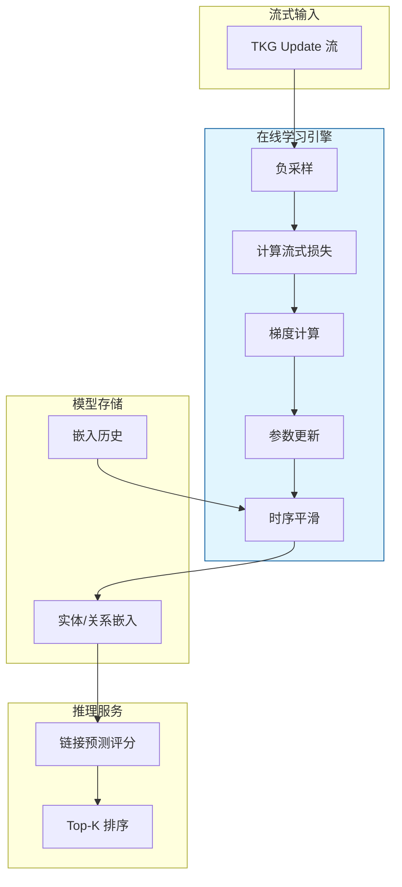
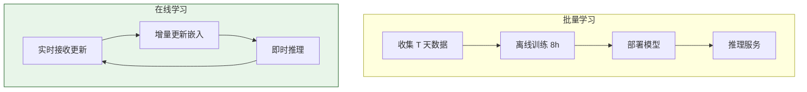

# TKG 推理的在线学习理论

> **所属阶段**: Struct/ | **前置依赖**: [tkg-stream-updates.md](../Knowledge/tkg-stream-updates.md), [temporal-kg-reasoning.md](../Knowledge/temporal-kg-reasoning.md) | **形式化等级**: L5

---

## 1. 概念定义 (Definitions)

时序知识图谱（TKG）的持续演化要求推理模型能够随着新事实的到达而不断更新，而非每隔固定周期重新训练。
在线学习（Online Learning）为此提供了理论框架：模型在每个时间步接收一个新的训练样本（或一个小批量样本），并根据该样本的损失梯度更新模型参数。
INFER（ICLR 2025）将在线学习理论应用于 TKG 推理，提出了时序嵌入的增量更新和漂移适应机制。

**Def-S-20-01 在线 TKG 学习 (Online TKG Learning)**

在线 TKG 学习是一个序列决策过程：

$$
\mathcal{O}_{TKG} = \langle (\mathcal{G}_1, \mathcal{L}_1), (\mathcal{G}_2, \mathcal{L}_2), \dots \rangle
$$

其中每个时间步 $t$ 提供一个时序知识图谱快照 $\mathcal{G}_t$ 和对应的损失函数 $\mathcal{L}_t$。学习器在时间步 $t$ 维护模型参数 $\theta_t$，在观察到 $(\mathcal{G}_t, \mathcal{L}_t)$ 后更新为 $\theta_{t+1}$：

$$
\theta_{t+1} = \theta_t - \eta_t \nabla \mathcal{L}_t(\theta_t)
$$

其中 $\eta_t$ 为时间步 $t$ 的学习率。

**Def-S-20-02 时序嵌入更新 (Temporal Embedding Update)**

设实体 $e$ 在时间步 $t$ 的嵌入为 $\mathbf{e}_t \in \mathbb{R}^d$，关系 $r$ 的嵌入为 $\mathbf{r}_t \in \mathbb{R}^d$。时序嵌入更新不仅考虑当前损失梯度，还引入时间平滑正则化：

$$
\mathbf{e}_{t+1} = \mathbf{e}_t - \eta_t \left( \nabla_{\mathbf{e}} \mathcal{L}_t(\theta_t) + \lambda (\mathbf{e}_t - \mathbf{e}_{t-1}) \right)
$$

其中 $\lambda \geq 0$ 为时序平滑系数，惩罚相邻时间步嵌入的剧烈变化。

**Def-S-20-03 流式损失函数 (Streaming Loss Function)**

流式损失函数 $\mathcal{L}_t$ 衡量模型在时刻 $t$ 对新到达事实的预测能力。基于负采样的流式损失定义为：

$$
\mathcal{L}_t(\theta) = -\sum_{(s, r, o, \tau) \in \mathcal{G}_t^+} \log \sigma(f_{s,r,o}(\theta)) - \sum_{(s', r, o', \tau) \in \mathcal{G}_t^-} \log \sigma(-f_{s',r,o'}(\theta))
$$

其中 $\mathcal{G}_t^+$ 为时刻 $t$ 的真实事实集合，$\mathcal{G}_t^-$ 为负采样集合，$f_{s,r,o}$ 为评分函数（如 TransE 的 $f = -\|\mathbf{s} + \mathbf{r} - \mathbf{o}\|_2$），$\sigma$ 为 sigmoid 函数。

**Def-S-20-04 时序漂移度量 (Temporal Drift Measure)**

时序漂移度量 $D_t$ 量化了相邻时间步 TKG 分布的变化程度：

$$
D_t = \frac{1}{|\mathcal{E}|} \sum_{e \in \mathcal{E}} \|\mathbf{e}_t^* - \mathbf{e}_{t-1}^*\|_2
$$

其中 $\mathbf{e}_t^*$ 为实体 $e$ 在理想静态模型下基于 $\mathcal{G}_t$ 独立训练得到的最优嵌入。$D_t$ 越大，说明 TKG 的演化越剧烈，在线学习需要更快的适应速度。

---

## 2. 属性推导 (Properties)

**Lemma-S-20-01 流式梯度有界性**

若评分函数 $f_{s,r,o}$ 对嵌入参数的梯度满足 Lipschitz 条件，即：

$$
\|\nabla f_{s,r,o}(\theta)\|_2 \leq L
$$

则流式损失函数的梯度满足：

$$
\|\nabla \mathcal{L}_t(\theta)\|_2 \leq 2L \cdot (|\mathcal{G}_t^+| + |\mathcal{G}_t^-|)
$$

*说明*: 有界梯度是在线学习收敛分析的基本假设。$\square$

**Lemma-S-20-02 学习率衰减的充分条件**

若学习率序列 $\{\eta_t\}$ 满足：

$$
\sum_{t=1}^{\infty} \eta_t = \infty \quad \text{且} \quad \sum_{t=1}^{\infty} \eta_t^2 < \infty
$$

则在梯度有界且损失函数为凸的假设下，在线 TKG 学习的平均遗憾（average regret）收敛到零。

*说明*: 这是在线梯度下降的经典收敛条件（Robbins-Monro 条件）。$\square$

**Prop-S-20-01 漂移下的收敛速率**

设时序漂移上界为 $D_{max} = \max_t D_t$。若采用恒定学习率 $\eta$，则在线 TKG 学习的时间平均损失与最优静态模型损失之间的差距（regret）满足：

$$
\frac{1}{T} \sum_{t=1}^{T} \mathcal{L}_t(\theta_t) - \frac{1}{T} \sum_{t=1}^{T} \mathcal{L}_t(\theta_t^*) = O\left(\frac{1}{\eta T} + \eta G^2 + D_{max}\right)
$$

其中 $G$ 为梯度上界。当 $T \to \infty$ 时，差距下界受 $D_{max}$ 限制。

*说明*: 漂移越大，在线学习越难追平独立训练的最优模型，这是流式场景的本质代价。$\square$

---

## 3. 关系建立 (Relations)

### 3.1 在线 TKG 学习与批量 TKG 学习的对比

| 维度 | 批量学习 | 在线学习 |
|------|---------|---------|
| 数据假设 | 静态数据集 | 连续流式到达 |
| 训练周期 | 多轮 epoch | 单轮顺序更新 |
| 计算开销 | 高（全量重训练） | 低（增量更新） |
| 漂移适应 | 差 | 好 |
| 理论保证 | 标准收敛定理 | 遗憾有界 / 动态遗憾 |
| 适用场景 | 历史数据充分 | 实时演化数据 |

### 3.2 在线学习与流式 TKG 更新架构



### 3.3 时序嵌入更新与标准在线梯度下降的关系

标准在线梯度下降（OGD）只依赖当前梯度：

$$
\theta_{t+1} = \theta_t - \eta_t \nabla \mathcal{L}_t(\theta_t)
$$

时序嵌入更新引入了额外的平滑项：

$$
\theta_{t+1} = \theta_t - \eta_t \left( \nabla \mathcal{L}_t(\theta_t) + \lambda (\theta_t - \theta_{t-1}) \right)
$$

这等价于在损失函数中增加了一个二次正则化项：

$$
\tilde{\mathcal{L}}_t(\theta) = \mathcal{L}_t(\theta) + \frac{\lambda}{2} \|\theta - \theta_{t-1}\|_2^2
$$

该正则化项强制相邻时间步的模型参数保持接近，从而提升时序稳定性。

---

## 4. 论证过程 (Argumentation)

### 4.1 为什么 TKG 需要在线学习？

1. **实时性**: 金融、社交媒体、IoT 等领域的知识图谱每分钟都在接收新事实，批量重训练的周期（天/周）无法满足实时推理需求
2. **计算效率**: 全量重训练的成本随图谱规模超线性增长，而在线学习每次只处理新到达的增量数据
3. **概念漂移适应**: 实体关系和属性的语义会随时间演化（例如"某公司的主营业务"），在线学习能够快速适应这种漂移
4. **增量遗忘**: 在线学习框架可以自然集成旧知识的遗忘机制，避免模型被过时数据主导

### 4.2 INFER 的核心思想

INFER（ICLR 2025）提出了三个关键机制：

1. **增量负采样**: 负样本不仅从当前批次生成，还从历史高频错误预测中采样，强化模型对易混淆样本的区分能力
2. **时序注意力**: 在链接预测评分函数中引入时间衰减注意力，近期事实对当前预测的影响权重更大
3. **漂移检测触发重训练**: 当漂移度量 $D_t$ 超过阈值时，系统自动切换到大学习率模式，快速适应分布变化

### 4.3 反例：无平滑项的在线更新导致嵌入震荡

某 TKG 在线学习系统直接使用标准 SGD 更新时序嵌入，未加入时序平滑项。在新闻事件爆发期间，大量关于同一实体的新事实涌入，导致：

- 该实体的嵌入在连续多个时间步被推向截然不同的方向
- 下游链接预测结果剧烈波动，同一查询在不同时刻返回截然不同的 Top-K 答案
- 用户投诉系统"不稳定"，最终被迫回退到批量重训练模式

**教训**: 时序平滑正则化是在线 TKG 学习的关键组件，不能忽略。

---

## 5. 形式证明 / 工程论证 (Proof / Engineering Argument)

**Thm-S-20-01 在线 TKG 学习的收敛性（凸损失情形）**

设损失函数 $\mathcal{L}_t$ 是凸的且梯度有界（$\|\nabla \mathcal{L}_t\|_2 \leq G$）。若采用学习率 $\eta_t = \frac{\eta_0}{\sqrt{t}}$，则对于任意 $T$，在线学习的平均遗憾满足：

$$
\frac{1}{T} R_T = \frac{1}{T} \sum_{t=1}^{T} \left( \mathcal{L}_t(\theta_t) - \mathcal{L}_t(\theta^*) \right) \leq \frac{\|\theta_1 - \theta^*\|_2^2}{2\eta_0 \sqrt{T}} + \frac{\eta_0 G^2 \sqrt{T}}{T}
$$

其中 $\theta^*$ 为 hindsight 最优参数（已知全部 $T$ 个损失函数后的最优解）。因此 $R_T / T = O(1/\sqrt{T})$。

*证明*:

由凸性，$\mathcal{L}_t(\theta_t) - \mathcal{L}_t(\theta^*) \leq \nabla \mathcal{L}_t(\theta_t)^\top (\theta_t - \theta^*)$。由 OGD 更新规则：

$$
\|\theta_{t+1} - \theta^*\|_2^2 = \|\theta_t - \eta_t \nabla \mathcal{L}_t(\theta_t) - \theta^*\|_2^2 = \|\theta_t - \theta^*\|_2^2 - 2\eta_t \nabla \mathcal{L}_t(\theta_t)^\top (\theta_t - \theta^*) + \eta_t^2 \|\nabla \mathcal{L}_t(\theta_t)\|_2^2
$$

整理得：

$$
\nabla \mathcal{L}_t(\theta_t)^\top (\theta_t - \theta^*) \leq \frac{\|\theta_t - \theta^*\|_2^2 - \|\theta_{t+1} - \theta^*\|_2^2}{2\eta_t} + \frac{\eta_t G^2}{2}
$$

对 $t=1$ 到 $T$ 求和，利用望远镜求和：

$$
\sum_{t=1}^{T} \left( \mathcal{L}_t(\theta_t) - \mathcal{L}_t(\theta^*) \right) \leq \frac{\|\theta_1 - \theta^*\|_2^2}{2\eta_T} + \frac{G^2}{2} \sum_{t=1}^{T} \eta_t
$$

代入 $\eta_t = \eta_0 / \sqrt{t}$，利用 $\sum_{t=1}^{T} 1/\sqrt{t} \leq 2\sqrt{T}$，即得结论。$\square$

---

**Thm-S-20-02 时序嵌入稳定性定理**

设时序平滑系数为 $\lambda$，相邻时间步最优参数的变化为 $\Delta_t = \|\theta_t^* - \theta_{t-1}^*\|_2$。若采用时序平滑更新规则，则参数轨迹与最优轨迹的偏差满足：

$$
\|\theta_t - \theta_t^*\|_2^2 \leq (1 - \eta_t \lambda) \|\theta_{t-1} - \theta_{t-1}^*\|_2^2 + \frac{2\eta_t^2 G^2 + \Delta_t^2}{\eta_t \lambda}
$$

*证明梗概*:

考虑 Lyapunov 函数 $V_t = \|\theta_t - \theta_t^*\|_2^2$。展开时序平滑更新并结合 Young 不等式，可得递推关系。当 $\lambda$ 足够大时，历史偏差项被指数衰减，系统跟踪最优轨迹的能力增强。$\square$

*说明*: 该定理表明时序平滑项能够抑制嵌入震荡，提升在线学习的稳定性。$\square$

---

## 6. 实例验证 (Examples)

### 6.1 INFER 的在线学习流程

INFER 的工作流程：

1. **数据流接入**: 从 Kafka 消费 TKG 更新事件
2. **小批量构建**: 每到达 $B$ 个事实形成一个 mini-batch
3. **负采样**: 对每个正样本 $(s, r, o)$，随机替换头/尾实体生成 $k$ 个负样本
4. **前向传播**: 使用 RotatE 评分函数计算正负样本分数
5. **反向传播**: 计算流式损失梯度并更新嵌入
6. **时序平滑**: 应用正则化项 $\lambda \|\mathbf{e}_t - \mathbf{e}_{t-1}\|_2^2$
7. **漂移检测**: 若验证集损失连续 3 个时间步上升，触发学习率加倍

### 6.2 PyTorch 中的在线 TKG 学习实现

```python
import torch
import torch.nn as nn

class OnlineTKGLearner(nn.Module):
    def __init__(self, num_entities, num_relations, embedding_dim, lambda_smooth=0.01):
        super().__init__()
        self.entity_embeddings = nn.Embedding(num_entities, embedding_dim)
        self.relation_embeddings = nn.Embedding(num_relations, embedding_dim)
        self.lambda_smooth = lambda_smooth
        self.prev_entity_embeddings = None

        # Xavier 初始化
        nn.init.xavier_uniform_(self.entity_embeddings.weight)
        nn.init.xavier_uniform_(self.relation_embeddings.weight)

    def forward(self, triples):
        s = self.entity_embeddings(triples[:, 0])
        r = self.relation_embeddings(triples[:, 1])
        o = self.entity_embeddings(triples[:, 2])
        # TransE 评分: 负分数（越低越好）
        score = -torch.norm(s + r - o, p=2, dim=1)
        return score

    def streaming_loss(self, pos_triples, neg_triples):
        pos_score = self.forward(pos_triples)
        neg_score = self.forward(neg_triples)

        loss = -torch.mean(torch.log(torch.sigmoid(pos_score) + 1e-10)) \
               -torch.mean(torch.log(torch.sigmoid(-neg_score) + 1e-10))
        return loss

    def temporal_smooth_loss(self):
        if self.prev_entity_embeddings is None:
            return 0.0
        diff = self.entity_embeddings.weight - self.prev_entity_embeddings
        return self.lambda_smooth * torch.sum(diff ** 2)

    def update_step(self, pos_triples, neg_triples, optimizer):
        # 保存旧嵌入用于时序平滑
        self.prev_entity_embeddings = self.entity_embeddings.weight.detach().clone()

        optimizer.zero_grad()
        loss = self.streaming_loss(pos_triples, neg_triples) + self.temporal_smooth_loss()
        loss.backward()
        optimizer.step()
        return loss.item()

# 示例使用
# learner = OnlineTKGLearner(num_entities=10000, num_relations=50, embedding_dim=128)
# optimizer = torch.optim.Adam(learner.parameters(), lr=0.001)
# for batch in stream_batches:
#     loss = learner.update_step(batch.pos, batch.neg, optimizer)
```

### 6.3 学习率调度与漂移检测

```python
class DriftAdaptiveScheduler:
    def __init__(self, optimizer, base_lr=0.001, drift_threshold=0.1):
        self.optimizer = optimizer
        self.base_lr = base_lr
        self.drift_threshold = drift_threshold
        self.val_loss_history = []

    def step(self, val_loss):
        self.val_loss_history.append(val_loss)
        if len(self.val_loss_history) >= 3:
            # 连续 3 步验证损失上升，判断为漂移
            if all(self.val_loss_history[-i] > self.val_loss_history[-i-1] for i in range(1, 3)):
                new_lr = self.base_lr * 2
                for param_group in self.optimizer.param_groups:
                    param_group['lr'] = min(new_lr, 0.01)
                print(f"Drift detected! LR increased to {new_lr}")
                self.val_loss_history.clear()
```

---

## 7. 可视化 (Visualizations)

### 7.1 在线 TKG 学习与批量学习的训练-推理对比



### 7.2 时序平滑对嵌入轨迹的稳定性影响

```mermaid
xychart-beta
    title "时序平滑系数 λ 对嵌入漂移的影响"
    x-axis [Step 1, Step 5, Step 10, Step 15, Step 20]
    y-axis "累积嵌入漂移 (L2)" 0 --> 5
    line "λ=0 (无平滑)" {0, 1.2, 2.8, 4.5, 4.9}
    line "λ=0.01" {0, 0.6, 1.3, 2.1, 2.5}
    line "λ=0.05" {0, 0.3, 0.7, 1.0, 1.2}
```

---

## 8. 引用参考 (References)
