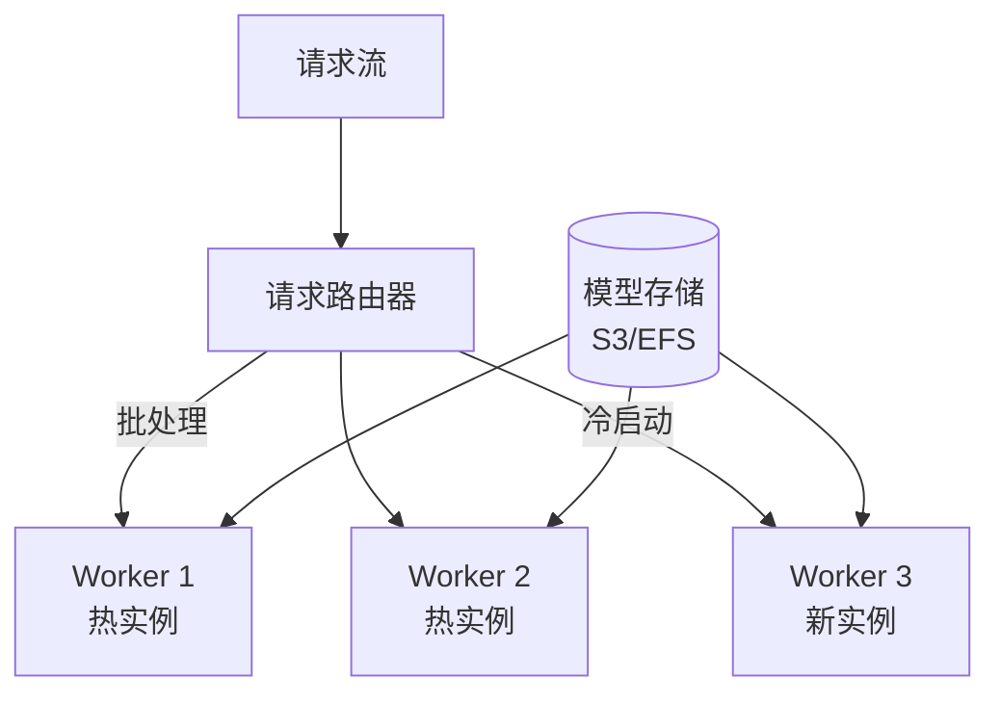
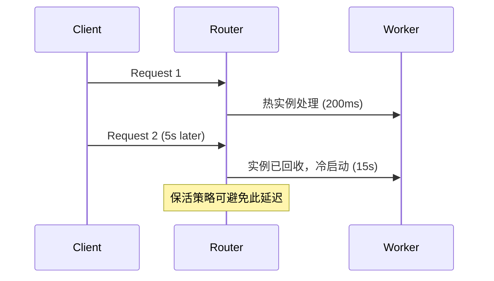

# 无服务器机器学习推理的形式化

> **所属阶段**: Struct/ | **前置依赖**: [llm-stream-tuning.md](../Knowledge/llm-stream-tuning.md), [online-tkg-learning.md](../Struct/online-tkg-learning.md) | **形式化等级**: L5

---

## 1. 概念定义 (Definitions)

无服务器（Serverless）架构为机器学习推理提供了一种按需扩展、按调用付费的执行模型。
然而，Serverless 的冷启动延迟、执行时间限制和状态隔离特性给流式推理带来了独特的挑战。
ServerlessLLM（OSDI 2024）等工作提出了针对 LLM 推理的 Serverless 优化框架，包括快速模型加载、请求批处理和弹性扩缩容。

**Def-S-28-01 无服务器推理函数 (Serverless Inference Function)**

无服务器推理函数 $\mathcal{F}_{serverless}$ 是一个受约束的计算单元：

$$
\mathcal{F}_{serverless} = (M, T_{max}, Mem_{max}, C_{cold}, C_{warm})
$$

其中 $M$ 为部署的模型，$T_{max}$ 为最大执行时间，$Mem_{max}$ 为最大内存，$C_{cold}$ 为冷启动成本，$C_{warm}$ 为热执行成本。

**Def-S-28-02 推理请求流 (Inference Request Stream)**

推理请求流 $R$ 是一个到达过程，每个请求 $r_i$ 包含输入数据 $x_i$ 和延迟要求 $L_i$：

$$
R = \langle (x_1, L_1, t_1), (x_2, L_2, t_2), \dots \rangle
$$

其中 $t_i$ 为到达时间。

**Def-S-28-03 批处理增益 (Batching Gain)**

设单个请求的推理延迟为 $l_{single}$，$b$ 个请求批处理的延迟为 $l_{batch}(b)$。批处理增益定义为：

$$
G_{batch}(b) = \frac{b \cdot l_{single}}{l_{batch}(b)}
$$

对于 GPU 上的 Transformer 推理，通常 $l_{batch}(b) \approx l_{single} + \Delta \cdot b$，其中 $\Delta \ll l_{single}$，因此 $G_{batch}(b) \gg 1$。

---

## 2. 属性推导 (Properties)

**Lemma-S-28-01 冷启动的延迟惩罚**

设热启动延迟为 $L_{warm}$，冷启动延迟为 $L_{cold}$。则对于到达间隔大于保活时间的请求流，平均延迟为：

$$
\mathbb{E}[L] = p_{cold} \cdot L_{cold} + (1 - p_{cold}) \cdot L_{warm}
$$

其中 $p_{cold}$ 为请求触发冷启动的概率。

*说明*: 降低 $p_{cold}$ 是优化 Serverless 推理延迟的核心。$\square$

**Prop-S-28-01 批处理的最优大小**

设请求到达率为 $\lambda$，批处理等待时间为 $t_{wait}$。则最优批大小 $b^*$ 满足：

$$
b^* = \arg\max_b \left( G_{batch}(b) - \gamma \cdot t_{wait}(b) \right)
$$

其中 $t_{wait}(b) \approx b / \lambda$，$\gamma$ 为延迟惩罚系数。

*说明*: 批大小过大虽提升吞吐，但会增加队首请求的等待延迟。$\square$

---

## 3. 关系建立 (Relations)

### 3.1 Serverless 推理与常驻服务的对比

| 维度 | 常驻服务 | Serverless 推理 |
|------|---------|----------------|
| 延迟 | 稳定低延迟 | 冷启动延迟波动 |
| 成本 | 持续计费 | 按调用计费 |
| 扩展 | 需预配资源 | 自动毫秒级扩展 |
| 状态 | 可保持 | 无状态（每次调用独立） |
| 适用负载 | 稳定高流量 | 波动、间歇性负载 |

### 3.2 ServerlessLLM 架构



---

## 4. 论证过程 (Argumentation)

### 4.1 ServerlessLLM 的核心优化

1. **快速模型加载**: 通过层共享、增量加载和本地缓存将大模型加载时间从分钟级降至秒级
2. **动态批处理**: 使用滑动窗口批处理，在延迟约束内最大化批大小
3. **预测性扩缩容**: 基于请求到达模式预测负载高峰，提前预热实例

### 4.2 反例：未考虑冷启动导致 SLA 违约

某公司将实时推荐模型部署为 Serverless 函数。促销期间请求突增：

- 大量新实例冷启动，每个冷启动耗时 15 秒
- 99% 的请求延迟从 200ms 飙升至 15 秒以上
- 用户端出现大量超时，转化率骤降

**教训**: 对于延迟敏感型流推理，Serverless 必须配合预热、保活或常驻实例池使用。

---

## 5. 形式证明 / 工程论证 (Proof / Engineering Argument)

**Thm-S-28-01 Serverless 推理的成本-延迟权衡**

设请求到达服从泊松过程（速率 $\lambda$），每个实例的保活成本为 $c_{keep}$ /秒，冷启动成本为 $c_{cold}$。则最优保活策略（保持 $N$ 个常驻实例）最小化：

$$
\min_N \left( N \cdot c_{keep} \cdot T + \lambda \cdot P(queue > N) \cdot c_{cold} \right)
$$

其中 $P(queue > N)$ 为请求队列长度超过 $N$ 的概率（由 Erlang-B 公式计算）。

*证明梗概*:

泊松到达下，$N$ 个并行服务通道的排队系统为 M/M/N/N 损失制。请求到达时若所有 $N$ 个实例都忙，则触发新实例冷启动。总成本为保活成本与预期冷启动成本之和。对 $N$ 求导并令其为零，可得最优解。$\square$

---

## 6. 实例验证 (Examples)

### 6.1 AWS Lambda 上的推理函数配置

```python
# serverless.yml 概念配置 functions:
  inference:
    handler: handler.inference
    timeout: 30
    memorySize: 10240  # 10GB，分配更多 GPU/CPU 资源
    provisionedConcurrency: 5  # 常驻 5 个热实例
    events:
      - http:
          path: /predict
          method: post
```

### 6.2 动态批处理控制器

```python
class DynamicBatcher:
    def __init__(self, max_batch_size=16, max_wait_ms=50):
        self.max_batch_size = max_batch_size
        self.max_wait = max_wait_ms / 1000.0
        self.queue = []

    def submit(self, request):
        self.queue.append(request)
        if len(self.queue) >= self.max_batch_size:
            return self.flush()
        return None

    def flush(self):
        batch = self.queue[:self.max_batch_size]
        self.queue = self.queue[self.max_batch_size:]
        return batch
```

---

## 7. 可视化 (Visualizations)

### 7.1 Serverless 推理的扩缩容时间线



---

## 8. 引用参考 (References)
