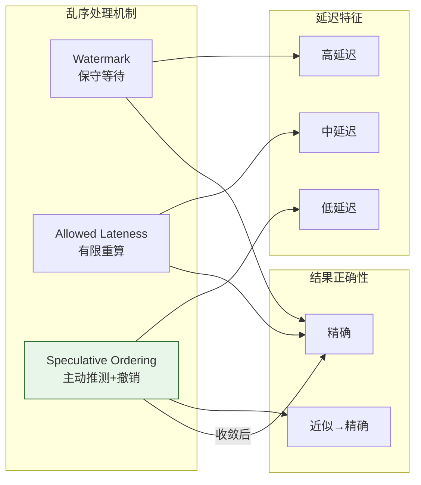
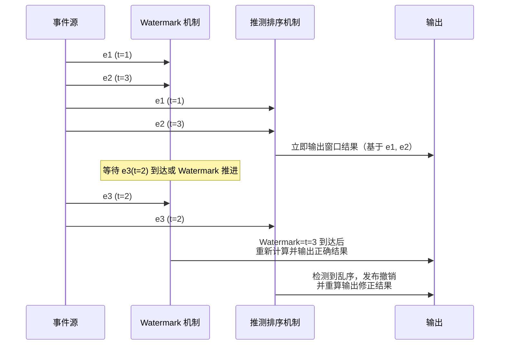
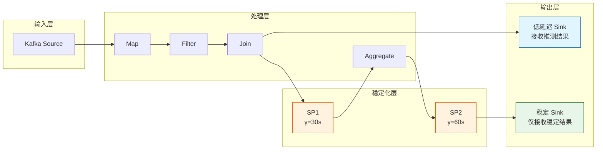

# 推测流排序的形式化模型与撤销机制

> **所属阶段**: Struct/ | **前置依赖**: [transactional-stream-semantics.md](./transactional-stream-semantics.md), [time-semantics-and-watermark.md](../Flink/02-core/time-semantics-and-watermark.md) | **形式化等级**: L5

---

## 1. 概念定义 (Definitions)

在分布式流处理中，由于网络延迟、乱序发送和节点间时钟偏移，事件到达顺序往往与其事件时间顺序不一致。
传统 Watermark 机制通过等待来处理乱序，但这会引入延迟。
推测流排序（Speculative Stream Ordering）是一种主动处理乱序的技术：系统在事件到达时立即基于当前假设进行处理，一旦后续发现排序假设错误，则通过撤销（Retraction）和重算（Re-computation）修正结果。
SpecLog（OSDI 2025）等系统通过推测日志将这一机制形式化并扩展到了通用流处理框架中。

**Def-S-19-01 推测排序 (Speculative Ordering)**

设事件流 $S = \{e_1, e_2, \dots\}$ 中每个事件 $e_i$ 具有事件时间 $\tau(e_i)$ 和到达时间 $\alpha(e_i)$。推测排序 $\mathcal{SO}$ 是一个二元组：

$$
\mathcal{SO} = (\prec_{spec}, \mathcal{R})
$$

其中 $\prec_{spec}$ 是基于当前已到达事件集合 $S_{arrived}$ 构建的临时全序关系，$\mathcal{R}$ 是撤销机制，当新的乱序事件 $e_{new}$ 到达并破坏 $\prec_{spec}$ 时，触发结果修正。

**Def-S-19-02 乱序事件 (Out-of-Order Event)**

事件 $e_{new}$ 相对于推测排序 $\prec_{spec}$ 是乱序的，当且仅当：

$$
\exists e_i \in S_{arrived} : \tau(e_{new}) < \tau(e_i) \land e_i \prec_{spec} e_{new}
$$

即 $e_{new}$ 的事件时间早于某个已经排序并处理的事件，但到达时间更晚。

**Def-S-19-03 推测窗口 (Speculative Window)**

推测窗口 $W_{spec}(t)$ 是时刻 $t$ 系统允许基于推测进行处理的未来事件时间范围：

$$
W_{spec}(t) = [w(t), w(t) + \omega]
$$

其中 $w(t)$ 为当前 Watermark，$\omega \geq 0$ 为推测深度。事件 $e$ 满足 $\tau(e) \in W_{spec}(t)$ 时，系统可以立即处理而不等待 Watermark 推进。

**Def-S-19-04 撤销操作 (Retraction)**

设算子在推测排序下产出了结果 $r$（对应输入事件集合 $E_r$）。当乱序事件 $e_{new}$ 证明 $E_r$ 不完整时，撤销操作 $\rho(r)$ 生成一个负结果 $-r$，用于抵消此前已发布的 $r$：

$$
\rho(r) = -r \quad \text{使得} \quad r + (-r) \equiv 0 \text{ 在下游聚合语义中}
$$.

对于非聚合算子（如过滤、映射），撤销通常意味着重新发布修正后的完整结果。

**Def-S-19-05 排序正确性 (Ordering Correctness)**

设流的最终事件时间排序为 $\prec_{true}$（即所有事件到达后的真实排序）。推测排序 $\prec_{spec}$ 在时刻 $t$ 的排序正确性定义为：

$$
C_{order}(t) = \frac{|\{(e_i, e_j) : e_i \prec_{spec} e_j \land e_i \prec_{true} e_j, \alpha(e_i), \alpha(e_j) \leq t\}|}{|\{(e_i, e_j) : \alpha(e_i), \alpha(e_j) \leq t\}|}
$$

即已处理事件对中，推测排序与真实排序一致的比例。

**Def-S-19-06 结果收敛 (Result Convergence)**

设算子在时刻 $t$ 的推测输出为 $O_{spec}(t)$，最终正确输出为 $O_{final}$。若对于任意时刻 $t$，存在后续时刻 $t' > t$ 使得：

$$
O_{spec}(t') = O_{final} \quad \text{且} \quad \forall t'' \geq t', O_{spec}(t'') = O_{final}
$$

则称该算子的推测执行具有结果收敛性。

---

## 2. 属性推导 (Properties)

**Lemma-S-19-01 Watermark 是推测排序的保守特例**

当推测深度 $\omega = 0$ 且系统拒绝处理任何乱序事件时，推测排序退化为标准 Watermark 机制。
此时排序正确性 $C_{order}(t) = 1$（对于所有已被 Watermark 确认的事件），但端到端延迟可能最大。

*说明*: 这是 Watermark 的保守性体现——宁可延迟也不犯错。$\square$

**Lemma-S-19-02 撤销次数上界**

设每个事件触发下游结果的概率为 $p$，且乱序事件 $e_{new}$ 影响此前已处理事件集合的期望比例为 $q$。
则引入 $e_{new}$ 导致的期望撤销次数为：

$$
\mathbb{E}[\text{retractions}] \leq p \cdot q \cdot N_{processed}
$$

其中 $N_{processed}$ 为 $e_{new}$ 到达前已处理的事件数。

*说明*: 通过限制推测深度 $\omega$ 和局部化状态管理，可将 $q$ 控制得很小。$\square$

**Lemma-S-19-03 推测窗口深度与乱序处理延迟的权衡**

设乱序事件的最大事件时间差距为 $\Delta_{max}$，推测深度为 $\omega$。则：

- 若 $\omega \geq \Delta_{max}$：所有事件可在到达时立即处理，乱序处理延迟为 0，但撤销风险最大
- 若 $\omega = 0$：无推测处理，乱序处理延迟等于 Watermark 等待时间
- 若 $0 < \omega < \Delta_{max}$：部分乱序事件可直接处理，其余需等待

*说明*: 最优 $\omega$ 取决于工作负载的乱序分布。$\square$

**Prop-S-19-01 聚合算子的撤销可交换性**

对于满足结合律和交换律的聚合函数 $f$（如 SUM, COUNT, MAX, MIN），若算子对输入集合 $E$ 先输出 $f(E)$，后因乱序事件增加输入 $e_{new}$，则修正输出可通过增量更新实现，无需显式撤销：

$$
f(E \cup \{e_{new}\}) = f(E) \oplus \Delta f(e_{new})
$$

*说明*: 这类聚合算子是推测排序系统的理想目标，因为修正成本最低。$\square$

---

## 3. 关系建立 (Relations)

### 3.1 推测排序与 Flink 的迟到数据处理

Flink 提供了两种处理乱序事件的机制：

1. **Watermark + Allowed Lateness**: 保守等待，在窗口触发后仍允许一定时间内的迟到事件触发窗口重算
2. **Side Output**: 将超过允许迟到时间的事件输出到侧流

推测排序可视为这两种机制的**主动扩展**：
- 不再被动等待 Watermark，而是主动基于当前假设处理
- 不再将超期事件简单丢弃或侧流输出，而是通过撤销机制修正结果
- 特别适用于需要低延迟且结果必须最终精确的实时分析场景



### 3.2 推测排序系统的架构对比

| 系统/机制 | 推测方式 | 撤销机制 | 适用场景 |
|----------|---------|---------|---------|
| **Flink Late Data** | Watermark 延迟 | 窗口重触发 | 批式窗口聚合 |
| **Materialize** | 逻辑时间戳排序 | 增量更新 + 负结果 | SQL 物化视图 |
| **SpecLog** | 推测日志 + 乱序检测 | 日志补偿 + 重放 | 通用流处理 |
| **Google Dataflow** | Watermark + Trigger | 累加/撤回模式 | 无界流分析 |

### 3.3 与有界陈旧性的关联

推测排序和有界陈旧性（Bounded Staleness）都涉及"暂时接受不完美结果"的哲学，但侧重点不同：

- **有界陈旧性**: 关注读取的数据版本可能不是最新的，但允许的时间/版本滞后是有界的
- **推测排序**: 关注处理顺序可能不是最终顺序，但通过撤销机制保证结果最终收敛

在系统设计中，两者可以组合使用：先以推测排序降低乱序处理延迟，再通过有界陈旧性控制读取到的结果是否等待撤销收敛完成。

---

## 4. 论证过程 (Argumentation)

### 4.1 为什么需要推测流排序？

在以下场景中，单纯依赖 Watermark 等待是不够的：

1. **实时风控**: 欺诈检测需要在事件到达后毫秒级触发，等待 Watermark 可能让欺诈交易通过
2. **IoT 设备监控**: 边缘设备网络不稳定，部分事件延迟数分钟才到达，但大部分事件已经到达，系统不能无限期等待
3. **实时推荐**: 用户行为流的乱序可能导致推荐结果滞后，影响用户体验
4. **金融交易分析**: 需要在交易到达时立即生成近似报表，并在后续乱序事件到达时逐步修正

推测排序通过"立即行动、逐步修正"的策略，为这些场景提供了新的设计选择。

### 4.2 推测排序的核心挑战

**挑战 1：撤销传播的级联效应**

在复杂 DAG 中，上游算子的撤销可能触发下游大量算子的重算。例如：
- 上游 join 结果因乱序事件被撤销
- 下游聚合算子需要重新计算涉及被撤销 join 结果的所有窗口
- 再下游的 sink 需要向外部存储发送负结果和修正结果

**解决方案**：
- 限制推测深度 $\omega$，减少乱序影响范围
- 使用增量聚合和可交换算子，降低修正成本
- 在 DAG 中引入"稳定化点"（Stabilization Points），只有经过稳定化点的结果才对外发布

**挑战 2：状态爆炸**

推测排序要求系统保留足够的历史状态以支持撤销和重算。
例如，一个滑动窗口聚合算子可能需要保留过去 $\omega + \Delta_{max}$ 时间内的所有原始事件。

**解决方案**：
- 使用压缩和摘要数据结构（如 Count-Min Sketch、HyperLogLog）替代原始事件存储
- 对于支持增量更新的聚合，只保留聚合状态而非原始事件
- 定期清理超过最大乱序时间范围的状态

**挑战 3：下游系统的撤销兼容性**

并非所有外部存储都支持负结果或撤销语义。例如，向 MySQL 插入一条负记录是没有意义的。

**解决方案**：
- 在 Sink 层引入"最终一致性闸门"，只有确认不再会被撤销的结果才写入外部存储
- 对于支持幂等写入的系统（如 Kafka with transactional id、Key-Value 存储），使用键覆盖策略
- 对于不支持撤销的系统，延长稳定化等待时间

### 4.3 反例：无限制推测导致系统崩溃

某初创公司在其实时分析平台中实现了无限制的推测排序：任何事件到达时立即处理，后续乱序事件触发全局重算。
结果：
- 在高乱序率的生产环境中，每秒产生数千次撤销
- 下游 Kafka Topic 被正负结果淹没，消费者处理不过来
- RocksDB 状态后端因需要保留全部历史事件而磁盘耗尽
- 系统最终因级联重算和状态膨胀而 OOM

**教训**: 推测排序必须有边界控制（推测深度、最大乱序时间、稳定化点），不能无限制推测。

---

## 5. 形式证明 / 工程论证 (Proof / Engineering Argument)

**Thm-S-19-04 推测排序的结果收敛定理**

设事件流 $S$ 的事件时间戳集合为 $T = \{\tau(e) : e \in S\}$，且 $T$ 在任意有界区间内是有限的（局部有限性）。
若推测排序系统满足：

1. 所有事件最终都会被处理（无丢失）
2. 撤销机制 $\mathcal{R}$ 能完全抵消此前错误发布的任何结果
3. 存在一个全局稳定化时间 $t_{stable}(\tau)$，使得事件时间 $\leq \tau$ 的所有事件在真实时间 $t_{stable}(\tau)$ 前已全部到达

则系统的输出序列具有结果收敛性，且最终输出 $O_{final}$ 与按真实排序 $\prec_{true}$ 批处理的结果一致。

*证明*:

考虑任意事件时间边界 $\tau$。由假设 3，存在 $t_{stable}(\tau)$ 使得所有 $\tau(e) \leq \tau$ 的事件在 $t_{stable}(\tau)$ 前到达。
由假设 1，这些事件都会被处理。由假设 2，任何因乱序导致的错误结果都会被撤销并修正。
因此在 $t_{stable}(\tau)$ 之后，系统对事件时间 $\leq \tau$ 的输入集合的累计输出不再变化，且等于按真实事件时间排序处理的结果。
由于 $\tau$ 是任意的，整个输出序列收敛到批处理正确结果。$\square$

---

**Thm-S-19-05 稳定化点后的零撤销保证**

设系统在 DAG 中的算子 $op_i$ 之后插入稳定化点 $SP_i$，其稳定化延迟为 $\gamma_i$（即只有事件时间 $\leq t - \gamma_i$ 的结果才允许通过）。
若乱序事件的最大事件时间延迟为 $\Delta_{max}$，且 $\gamma_i \geq \Delta_{max}$，则通过 $SP_i$ 的结果永远不会被后续撤销。

*证明*:

对于算子 $op_i$ 在真实时间 $t$ 产出的结果 $r$，其对应的最大输入事件时间为 $\tau_{max}$。
由于稳定化点只允许事件时间 $\leq t - \gamma_i$ 的结果通过（相对于处理时间），且 $\gamma_i \geq \Delta_{max}$，任何事件时间 $\leq \tau_{max}$ 的乱序事件都已在 $t$ 之前到达。
因此不会再有新的乱序事件影响已通过 $SP_i$ 的结果。$\square$

*说明*: 这是工程实践中控制撤销传播范围的核心定理。$\square$

---

**Thm-S-19-06 聚合算子的修正复杂度下界**

设聚合算子的输入事件集合大小为 $n$，每次乱序事件触发需要重算的窗口数量为 $w$。
若聚合函数不可增量计算，则修正复杂度为 $\Omega(w \cdot n)$；若聚合函数可增量计算，则修正复杂度为 $O(w)$。

*证明*:

对于不可增量计算的聚合，重算一个窗口需要重新扫描该窗口内的全部 $n$ 个事件（或平均 $n/w$ 个事件），因此 $w$ 个窗口的总复杂度为 $\Omega(w \cdot n)$。对于可增量计算的聚合，每个窗口只需应用新增事件的影响，复杂度与窗口数量成正比，即 $O(w)$。$\square$

---

## 6. 实例验证 (Examples)

### 6.1 SpecLog 的推测日志实现

SpecLog（OSDI 2025）通过一种称为"推测日志"的数据结构实现高效的乱序处理和撤销：

```
SpecLog 条目格式:
{
  event_id: 唯一标识,
  event_time: 事件时间戳,
  payload: 事件载荷,
  speculation_level: 推测级别（该事件到达时 Watermark 的领先深度）,
  dependencies: [依赖的前序事件 ID 列表]
}
```

当乱序事件到达时，SpecLog 执行以下步骤：
1. **冲突检测**: 扫描日志，找出推测排序被新事件破坏的区间
2. **撤销生成**: 为受影响的输出结果生成负结果条目
3. **局部重放**: 仅重放冲突区间内的相关事件，重新计算结果
4. **日志压缩**: 合并连续的增量更新，压缩日志长度

### 6.2 Flink 中实现推测窗口的扩展模式

以下代码展示了如何在 Flink 的 ProcessFunction 中实现基于推测窗口的计算（概念性示例）：

```java
public class SpeculativeWindowFunction
    extends KeyedProcessFunction<String, Event, Result> {

    private ValueState<PriorityQueue<Event>> eventBuffer;
    private ValueState<Map<TimeWindow, Result>> speculativeResults;
    private static final long SPECULATION_DEPTH_MS = 5000;

    @Override
    public void processElement(Event event, Context ctx, Collector<Result> out) {
        PriorityQueue<Event> buffer = eventBuffer.value();
        buffer.add(event);

        // 检查是否触发推测窗口计算
        long currentWatermark = ctx.timerService().currentWatermark();
        if (event.getEventTime() <= currentWatermark + SPECULATION_DEPTH_MS) {
            // 立即基于当前缓冲区内容计算推测结果
            Result specResult = computeWindow(buffer, event.getWindow());
            Map<TimeWindow, Result> results = speculativeResults.value();

            Result previous = results.get(event.getWindow());
            if (previous != null && !previous.equals(specResult)) {
                // 发布撤销和修正结果
                out.collect(new Result(previous.getValue(), true)); // retraction
            }
            out.collect(specResult);
            results.put(event.getWindow(), specResult);
            speculativeResults.update(results);
        }

        eventBuffer.update(buffer);
    }

    @Override
    public void onTimer(long timestamp, OnTimerContext ctx, Collector<Result> out) {
        // Watermark 推进后的最终确认：清理超过最大乱序时间的状态
        long stableTime = timestamp - MAX_OUT_OF_ORDERNESS;
        // 清理 buffer 中 event_time < stableTime 的事件
    }
}
```

### 6.3 Materialize 中的负结果（Retractions）语义

Materialize 的 SQL 查询结果支持负结果语义，这是其实现推测排序和增量更新的基础：

```sql
-- 一个会随时间修正的物化视图
CREATE MATERIALIZED VIEW user_event_counts AS
SELECT user_id, COUNT(*) AS cnt
FROM user_events
GROUP BY user_id;

-- 若某 user_events 记录被撤销（如上游 CDC 事务回滚），
-- Materialize 会自动向下游发布对应的负结果 (-1) 和修正后的新计数
```

Materialize 的底层 Differential Dataflow 使用"差分集合"（differential collections）来跟踪每个记录的出现次数。当记录计数从正变零时，自动触发撤销输出。

---

## 7. 可视化 (Visualizations)

### 7.1 推测排序与 Watermark 的时序对比



### 7.2 DAG 中的稳定化点设计



---

## 8. 引用参考 (References)

[^1]: SpecLog (OSDI 2025), "Speculative Logging for Out-of-Order Stream Processing".
[^2]: Akidau et al., "The Dataflow Model: A Practical Approach to Balancing Correctness, Latency, and Cost in Massive-Scale, Unbounded, Out-of-Order Data Processing", PVLDB 8(12), 2015.
[^3]: Apache Flink Documentation, "Windowing and Allowed Lateness", 2025. https://nightlies.apache.org/flink/flink-docs-stable/
[^4]: Materialize Documentation, "Retractions and Differential Dataflow", 2025. https://materialize.com/docs/
[^5]: Zaharia et al., "Discretized Streams: Fault-Tolerant Streaming Computation at Scale", SOSP 2013.
[^6]: Li et al., "Out-of-Order Processing: A New Architecture for High-Performance Stream Systems", PVLDB 1(1), 2008.
[^7]: Kleppmann M., "Designing Data-Intensive Applications", O'Reilly Media, 2017.
