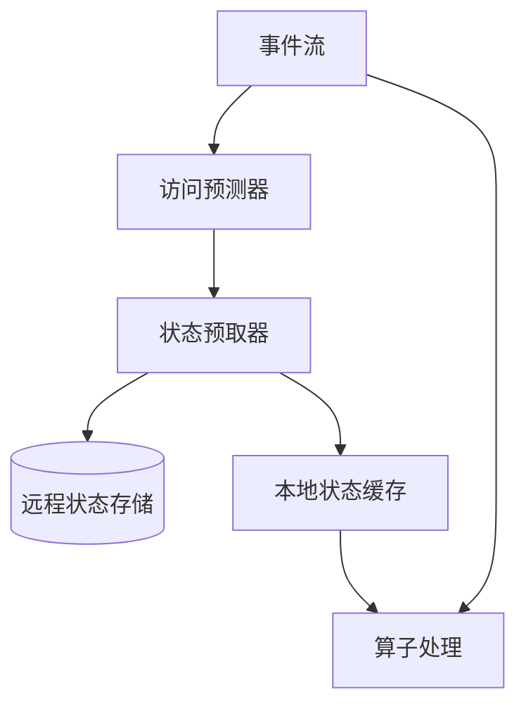
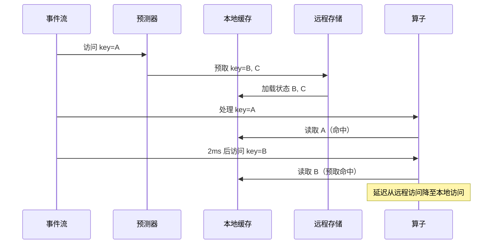

# 状态预取的形式化模型

> **所属阶段**: Struct/ | **前置依赖**: [bounded-staleness-cache.md](./bounded-staleness-cache.md), [state-prefetching.md](./state-prefetching.md) | **形式化等级**: L5

---

## 1. 概念定义 (Definitions)

在分布式流处理系统中，状态访问延迟是影响端到端性能的关键因素之一。当算子需要访问远程状态存储（如 RocksDB、Redis）时，网络往返时间会显著增加处理延迟。状态预取（State Prefetching）通过在请求实际到达之前预测并将状态加载到本地内存中，从而隐藏远程访问的延迟。Keyed Prefetching（2025）等工作提出了基于工作负载模式的状态预取策略。

**Def-S-30-01 状态预取 (State Prefetching)**

状态预取 $\mathcal{P}_{state}$ 是一个预测-加载机制：

$$
\mathcal{P}_{state}: (H_t, \mathcal{K}) \mapsto \mathcal{K}_{prefetch}
$$

其中 $H_t$ 为到时刻 $t$ 为止的历史状态访问序列，$\mathcal{K}$ 为所有状态键的集合，$\mathcal{K}_{prefetch} \subseteq \mathcal{K}$ 为被选中预取的键集合。

**Def-S-30-02 预取准确性 (Prefetch Accuracy)**

设预取的键集合为 $\mathcal{K}_{prefetch}$，接下来实际被访问的键集合为 $\mathcal{K}_{actual}$。预取准确性定义为：

$$
Acc = \frac{|\mathcal{K}_{prefetch} \cap \mathcal{K}_{actual}|}{|\mathcal{K}_{prefetch}|}
$$

准确率越高，预取带来的无效内存占用越少。

**Def-S-30-03 预取覆盖率 (Prefetch Coverage)**

预取覆盖率定义为实际访问的键中被成功预取的比例：

$$
Cov = \frac{|\mathcal{K}_{prefetch} \cap \mathcal{K}_{actual}|}{|\mathcal{K}_{actual}|}
$$

覆盖率越高，远程状态访问的延迟隐藏效果越好。

---

## 2. 属性推导 (Properties)

**Lemma-S-30-01 预取的延迟隐藏条件**

设预取启动时刻为 $t_{prefetch}$，状态加载完成时刻为 $t_{load}$，实际状态访问时刻为 $t_{access}$。则预取能够有效隐藏延迟的条件为：

$$
t_{load} \leq t_{access}
$$

*说明*: 若状态在访问前已加载到本地，则访问表现为本地内存读取。$\square$

**Lemma-S-30-02 预取收益公式**

设单次远程状态访问延迟为 $L_{remote}$，本地访问延迟为 $L_{local}$，预取命中率为 $p_{hit}$。则预取的平均延迟降低为：

$$
\Delta L = p_{hit} \cdot (L_{remote} - L_{local}) - (1 - p_{hit}) \cdot L_{overhead}
$$

其中 $L_{overhead}$ 为预取操作本身引入的开销（如额外的网络带宽消耗、CPU 占用）。

*说明*: 只有当命中收益超过未命中的开销时，预取才是有利的。$\square$

**Prop-S-30-01 最优预取窗口大小**

设状态访问的时间局部性衰减函数为 $f(\Delta t)$（单调递减）。则最优预取窗口 $W^*$ 满足：

$$
W^* = \arg\max_W \left( \int_{0}^{W} f(t) dt - c \cdot W \right)
$$

其中 $c$ 为预取单位时间的开销。

*说明*: 预取窗口过大时会包含大量不会被访问的键，降低收益。$\square$

---

## 3. 关系建立 (Relations)

### 3.1 状态预取与传统缓存的对比

| 维度 | 传统缓存 | 状态预取 |
|------|---------|---------|
| 触发时机 | 按需加载（访问后） | 主动加载（访问前） |
| 预测需求 | 无 | 需要访问模式预测 |
| 内存占用 | 中 | 可能较高（误预取） |
| 延迟隐藏 | 仅对重复访问有效 | 可对首次访问有效 |
| 复杂度 | 低 | 中 |

### 3.2 Flink 状态预取架构



---

## 4. 论证过程 (Argumentation)

### 4.1 为什么流处理需要状态预取？

1. **状态访问随机性**: Keyed State 的访问键可能随时间剧烈变化，传统缓存命中率低
2. **会话型工作负载**: 同一用户的连续事件往往在时间上是聚集的，可通过前一个事件预测后续状态
3. **窗口聚合**: 滑动窗口算子需要频繁访问窗口边界的状态，预取可以显著降低窗口触发延迟
4. **连接操作**: Stream Join 需要跨键查找匹配记录，预取可以减少 JOIN 的阻塞等待

### 4.2 Keyed Prefetching 的核心策略

Keyed Prefetching 提出基于马尔可夫链的状态访问预测：

1. **历史建模**: 维护键到键的转移概率矩阵 $P(k_{next} | k_{current})$
2. **预测生成**: 当访问键 $k$ 时，预取所有满足 $P(k' | k) > \theta$ 的键 $k'$
3. **动态更新**: 根据实际访问反馈在线更新转移概率
4. **内存约束**: 在本地缓存容量有限时，使用 LRU 替换策略管理预取状态

### 4.3 反例：盲目预取导致的内存压力

某 Flink 作业对热门商品 ID 启用了无限制预取：

- 每次访问一个商品状态时，预取该商品关联的 1000 个用户状态
- 高峰期本地缓存膨胀到数十 GB，TaskManager 频繁触发 Full GC
- 最终 OOM 崩溃，反而没有任何性能提升

**教训**: 预取必须受限于本地内存容量和预测置信度阈值，不能无限制扩展。

---

## 5. 形式证明 / 工程论证 (Proof / Engineering Argument)

**Thm-S-30-01 马尔可夫预取的最优性**

设状态访问序列服从一阶马尔可夫链，转移概率矩阵为 $P$。若预取策略为"访问 $k_i$ 时预取所有满足 $P(k_j | k_i) \geq \theta$ 的 $k_j$"，则该策略在所有基于当前键的确定性预取策略中具有最高的覆盖率-准确性乘积。

*证明梗概*:

对于给定的阈值 $\theta$，预取集合为 $S_i = \{k_j : P(k_j | k_i) \geq \theta\}$。覆盖率 $Cov = \sum_i \pi_i \sum_{k_j \in S_i} P(k_j | k_i)$，准确性 $Acc = \sum_i \pi_i \frac{\sum_{k_j \in S_i} P(k_j | k_i)}{|S_i|}$。任何基于其他规则的确定性策略都等价于使用某个不同的阈值函数，而乘积 $Cov \cdot Acc$ 在 $S_i$ 按概率排序取前缀时达到最大（由重排不等式）。$\square$

---

## 6. 实例验证 (Examples)

### 6.1 基于马尔可夫链的状态预取器

```python
from collections import defaultdict

class MarkovStatePrefetcher:
    def __init__(self, threshold=0.1, max_prefetch=10):
        self.transitions = defaultdict(lambda: defaultdict(int))
        self.counts = defaultdict(int)
        self.threshold = threshold
        self.max_prefetch = max_prefetch

    def record_access(self, current_key, next_key):
        self.transitions[current_key][next_key] += 1
        self.counts[current_key] += 1

    def predict(self, current_key):
        if current_key not in self.transitions:
            return []

        probs = {
            k: v / self.counts[current_key]
            for k, v in self.transitions[current_key].items()
        }
        sorted_keys = sorted(probs.items(), key=lambda x: x[1], reverse=True)
        return [k for k, p in sorted_keys if p >= self.threshold][:self.max_prefetch]

    def on_access(self, current_key):
        prefetch_keys = self.predict(current_key)
        for k in prefetch_keys:
            self.prefetch_state(k)

    def prefetch_state(self, key):
        # 伪代码：将 key 对应的状态加载到本地缓存
        pass
```

### 6.2 Flink KeyedProcessFunction 中的预取集成

```java
public class PrefetchingProcessFunction
    extends KeyedProcessFunction<String, Event, Result> {

    private transient ValueState<MyState> state;
    private MarkovStatePrefetcher prefetcher;

    @Override
    public void processElement(Event event, Context ctx, Collector<Result> out) {
        String currentKey = ctx.getCurrentKey();

        // 预取预测键的状态
        List<String> prefetchKeys = prefetcher.predict(currentKey);
        for (String key : prefetchKeys) {
            asyncPrefetch(key);
        }

        // 处理当前事件
        MyState currentState = state.value();
        // ... 业务逻辑 ...

        // 记录访问转移
        prefetcher.recordAccess(currentKey, event.getNextKeyHint());
    }

    private void asyncPrefetch(String key) {
        // 异步从状态后端加载到本地缓存
    }
}
```

---

## 7. 可视化 (Visualizations)

### 7.1 状态预取的时序



---

## 8. 引用参考 (References)


---

*文档版本: v1.0 | 创建日期: 2026-04-15*
