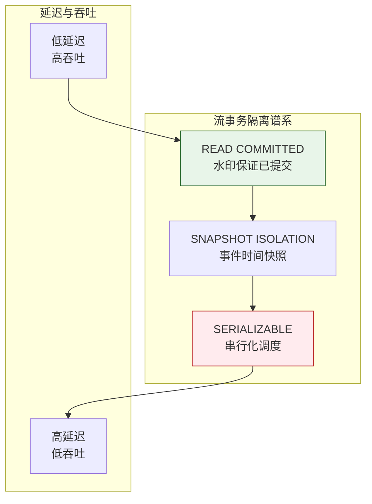
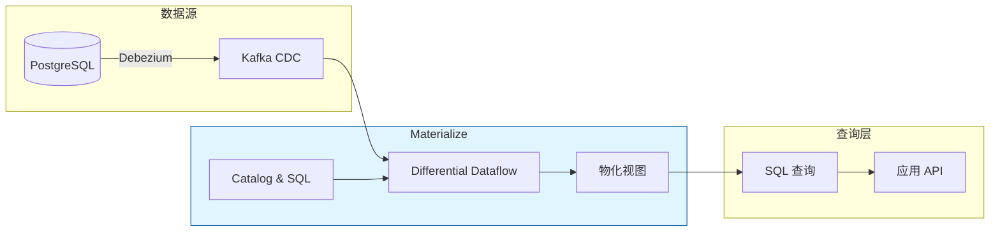
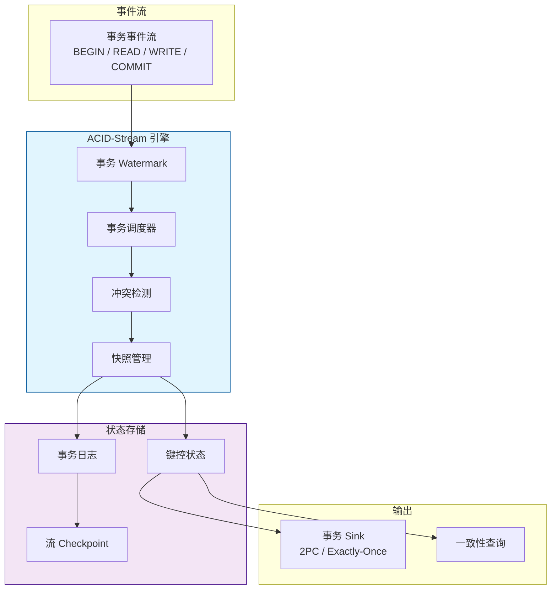
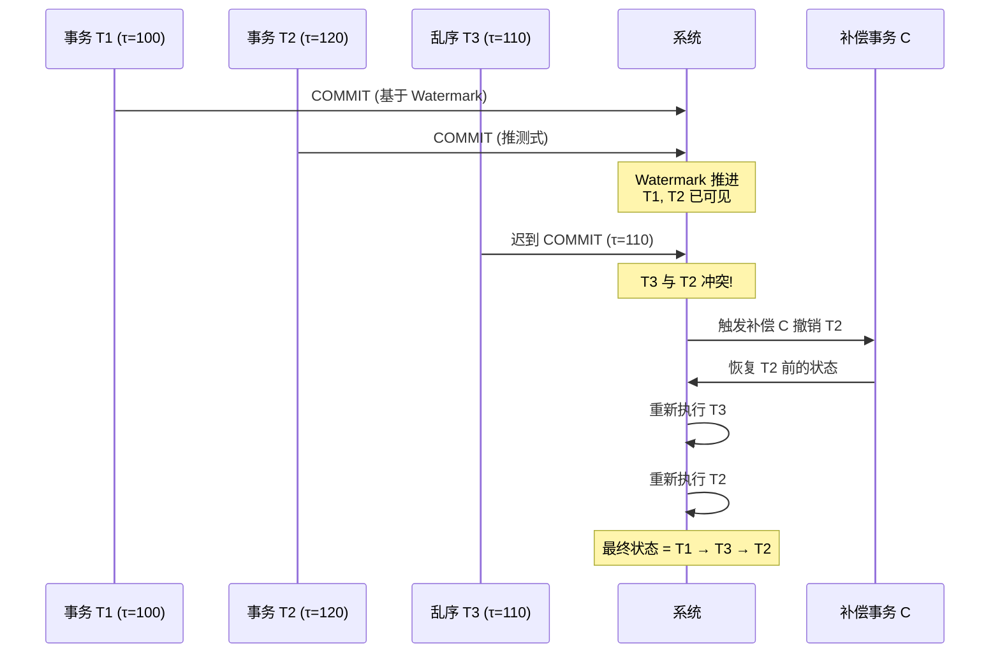

# 事务语义与流语义的统一形式化

> **所属阶段**: Struct/ | **前置依赖**: [exactly-once-end-to-end.md](../Flink/02-core/exactly-once-end-to-end.md), [consistency-training-inference.md](./consistency-training-inference.md) | **形式化等级**: L5

---

## 1. 概念定义 (Definitions)

事务处理系统追求 ACID 语义（原子性、一致性、隔离性、持久性），而流处理系统追求低延迟、高吞吐和事件时间语义。在传统架构中，这两者被视为独立的计算范式。然而，随着实时金融交易、分布式库存管理和在线拍卖等场景的需求增长，事务语义与流语义的统一成为形式化理论和系统工程的重要前沿问题。

**Def-S-16-07 事务流 (Transactional Stream)**

事务流 $\mathcal{T\!S}$ 是一个无限的事件序列，其中每个事件 $e$ 都关联一个事务标识符 $tid(e)$ 和一个操作类型 $op(e) \in \{ \text{BEGIN}, \text{READ}, \text{WRITE}, \text{COMMIT}, \text{ABORT} \}$：

$$
\mathcal{T\!S} = \langle e_1, e_2, \dots \rangle, \quad \text{其中 } e_i = (tid_i, op_i, k_i, v_i, t_i)
$$

$k_i$ 为键，$v_i$ 为值（READ 操作可为空），$t_i$ 为事件时间戳。同一 $tid$ 的事件按严格顺序构成一个事务。

**Def-S-16-08 ACID-Stream 统一模型 (ACID-Stream Unified Model)**

ACID-Stream 统一模型 $\mathcal{M}_{ACID\text{-}S}$ 是一个七元组：

$$
\mathcal{M}_{ACID\text{-}S} = (\mathcal{T\!S}, \mathcal{K}, \mathcal{V}, \mathcal{H}, \prec, \mathcal{I}, \mathcal{D})
$$

- $\mathcal{T\!S}$ 为事务流
- $\mathcal{K}$ 为键空间
- $\mathcal{V}$ 为值空间
- $\mathcal{H}: \mathcal{K} \times \mathbb{T} \to \mathcal{V}$ 为系统状态历史函数，记录每个键在每个事件时间的值
- $\prec$ 为全局偏序关系（由事件时间和事务提交顺序共同定义）
- $\mathcal{I}$ 为隔离级别（SERIALIZABLE、SNAPSHOT、READ_COMMITTED 等）
- $\mathcal{D}$ 为持久性保证（DURABLE、BEST_EFFORT 等）

**Def-S-16-09 流事务一致性 (Stream Transactional Consistency)**

设事务 $T$ 在流处理系统中的执行效果等价于某个串行调度 $\mathcal{S}_{serial}$，则称系统在该隔离级别下满足流事务一致性。形式上，对于事务集合 $\mathcal{T} = \{T_1, T_2, \dots, T_n\}$：

$$
\mathcal{C}_{stream}(\mathcal{T}) \iff \exists \mathcal{S}_{serial} \in \text{Serial}(\mathcal{T}), \quad \text{Eff}(\mathcal{T}) \equiv \text{Eff}(\mathcal{S}_{serial})
$$

其中 $\text{Eff}(\cdot)$ 表示执行效果（读写操作的返回值和最终数据库状态）。

**Def-S-16-10 有界陈旧性 (Bounded Staleness)**

设读取操作 $r$ 在事件时间 $t_r$ 执行，目标键 $k$ 的最新提交版本时间为 $t_{latest}(k)$。有界陈旧性要求读取到的版本时间 $t_{read}$ 满足：

$$
t_r - t_{read} \leq \delta_{staleness}
$$

其中 $\delta_{staleness} \geq 0$ 为陈旧性上界。若 $\delta_{staleness} = 0$，则读取必须返回最新提交版本（强一致）；若 $\delta_{staleness} > 0$，则允许读取稍旧的版本以提升吞吐和降低延迟。

**Def-S-16-11 推测式排序 (Speculative Stream Ordering)**

在乱序数据流中，系统可能基于当前 Watermark $w(t)$ 对事件进行**推测式排序**：对于事件 $e_1, e_2$，若 $\tau(e_1) \leq w(t)$ 且 $\tau(e_2) > w(t)$，则系统暂时认定 $e_1 \prec e_2$。若后续收到 $e_3$ 使得 $\tau(e_3) < \tau(e_2)$ 且 $e_3$ 与已处理事务冲突，则系统可能需要执行**补偿事务 (Compensating Transaction)** 修正状态。

**Def-S-16-12 事务 Watermark (Transaction Watermark)**

事务 Watermark $W_{txn}(t)$ 是扩展的 Flink Watermark，它不仅反映事件时间的推进，还保证在该 Watermark 之前所有事务都已达到最终提交状态：

$$
W_{txn}(t) = \max \{ t' \mid \forall e \in \mathcal{T\!S}, \tau(e) \leq t' \implies \text{txn}(e) \text{ 已最终提交或中止} \}
$$

---

## 2. 属性推导 (Properties)

**Lemma-S-16-04 事务 Watermark 的单调性**

事务 Watermark $W_{txn}(t)$ 是关于处理时间的单调非减函数。

*证明*: 设 $t_1 < t_2$。由 Def-S-16-12，$W_{txn}(t_1)$ 保证所有事件时间 $\leq W_{txn}(t_1)$ 的事务已最终化。由于时间是单向演化的，到 $t_2$ 时该保证仍然成立，且可能有更多事务达到最终状态。因此 $W_{txn}(t_2) \geq W_{txn}(t_1)$。$\square$

**Lemma-S-16-05 有界陈旧性蕴含最终一致性**

若系统满足有界陈旧性 $\delta_{staleness}$，且事务提交速率有限（每秒最多 $R$ 个事务影响键 $k$），则在时间 $t + \delta_{staleness}$ 时，键 $k$ 的读取版本与最新版本的差异事务数不超过 $R \cdot \delta_{staleness}$。

*证明*: 在时间区间 $[t_{read}, t_r]$ 内，长度为 $\delta_{staleness}$，最多有 $R \cdot \delta_{staleness}$ 个事务提交。因此读取版本与最新版本之间的事务数上界为 $R \cdot \delta_{staleness}$。$\square$

**Lemma-S-16-06 推测式排序的可修正性条件**

设系统基于 Watermark $w$ 对事务 $T$ 进行了推测式提交。若后续出现乱序事务 $T'$ 满足 $\tau(T') < \tau(T)$ 且 $T'$ 与 $T$ 的写集相交，则当且仅当存在补偿事务 $C_T$ 使得 $\text{Eff}(T' \circ C_T \circ T) \equiv \text{Eff}(T' \circ T_{reordered})$ 时，系统状态可被修正。

*说明*: 该引理揭示了推测式排序的理论边界——并非所有乱序冲突都可修正，某些情况下必须阻塞或重试。$\square$

**Prop-S-16-03 隔离级别与流延迟的权衡**

在流事务处理系统中，隔离级别与端到端延迟存在以下近似关系：

$$
L_{total} \approx L_{compute} + L_{commit}^{\mathcal{I}}
$$

其中 $L_{commit}^{SERIALIZABLE} > L_{commit}^{SNAPSHOT} > L_{commit}^{READ\_COMMITTED}$。SERIALIZABLE 需要分布式冲突检测和两阶段提交，显著增加 $L_{commit}$。

---

## 3. 关系建立 (Relations)

### 3.1 传统事务模型与流事务模型的对比

| 维度 | 传统 OLTP | 流事务处理 (ACID-Stream) |
|-----|----------|--------------------------|
| **数据模型** | 静态关系表 | 无界事件流 + 动态状态 |
| **事务边界** | 明确的 BEGIN/COMMIT | 由窗口或 Watermark 隐式定义 |
| **一致性目标** | 全局强一致 | 事件时间一致性 + 有界陈旧性 |
| **隔离机制** | 锁 / MVCC | 流 Watermark + 推测式排序 |
| **故障恢复** | WAL + Checkpoint | 流 Checkpoint + 补偿事务 |
| **典型系统** | Spanner, CockroachDB | Flink CDC, Materialize, RisingWave |

### 3.2 事务隔离级别在流系统中的映射



### 3.3 与 Flink Checkpoint 机制的融合

Flink 的 Checkpoint 机制为流事务处理提供了故障恢复基础：

- **事务状态快照**: Checkpoint 不仅保存算子状态，还保存未完成事务的日志
- **Exactly-Once Sink**: 通过 2PC 保证事务输出到外部存储的原子性
- **Watermark 驱动提交**: 事务可在 Watermark 推进到安全边界后批量提交，降低协调开销

### 3.4 事务协议对比：2PC、Calvin 与流事务模型

| 维度 | 2PC | Calvin | ACID-Stream |
|------|-----|--------|-------------|
| **协调时机** | 运行期 | 编译期（全局排序） | Watermark 边界 |
| **阻塞性** | 阻塞（Prepare 阶段） | 无阻塞 | 非阻塞（推测式提交） |
| **容错依赖** | 协调者持久化 | 确定性重放 | Checkpoint + 补偿 |
| **扩展性** | 受限于协调者 | 线性扩展 | 受限于 Watermark 推进 |
| **适用场景** | 传统分布式事务 | 高吞吐确定性负载 | 流处理事务 |

> **延伸阅读**: Calvin与2PC、Raft、Paxos的严格形式化对比分析

---

## 4. 论证过程 (Argumentation)

### 4.1 为什么需要事务语义与流语义的统一？

在以下场景中，纯粹的流处理语义不足以保证数据正确性：

1. **金融支付系统**: 账户余额更新必须是原子的，不能出现部分扣款或重复扣款
2. **库存管理系统**: 多个订单同时扣减同一 SKU 库存时，必须防止超卖
3. **在线拍卖系统**: 出价和成交必须满足可串行化隔离，否则会出现冲突成交
4. **跨系统数据同步**: CDC 流必须保证源数据库事务的边界不被破坏

传统的流处理系统（如 Flink DataStream）提供的是 At-Least-Once 或 Exactly-Once 语义，保证的是"每条记录被正确处理一次"，但并未保证"跨记录的事务原子性"。ACID-Stream 统一模型填补了这一空白。

### 4.2 事务流处理的工程挑战

**挑战 1: 高性能与强隔离的冲突**

在每秒百万级事件的流系统中，全局锁或严格的两阶段锁（2PL）会成为严重瓶颈。

**应对策略**:

- 采用乐观并发控制（OCC）：事务先本地执行，提交时检测冲突
- 利用事件时间将事务分区：同一事件时间窗口内的事务串行执行，不同窗口的事务并行执行
- 使用确定性数据库（Deterministic Database）技术，按事件时间预设事务执行顺序

**挑战 2: 乱序数据与事务原子性**

流数据天然乱序。若事务 $T$ 的 COMMIT 事件迟到，系统可能已基于不完整信息处理了后续事务。

**应对策略**:

- 扩展 Watermark 为事务 Watermark（Def-S-16-12），保证 Watermark 之前所有事务都已最终化
- 对于迟到的事务事件，触发补偿事务或状态重算
- 将事务边界与窗口边界对齐，延迟提交直到 Watermark 安全通过

**挑战 3: 分布式事务协调**

当流处理作业跨多个 TaskManager 维护状态时，涉及多个分区的事务需要分布式协调。

**应对策略**:

- 使用 Percolator 或 TSO（Timestamp Oracle）风格的分布式事务协议
- 将事务键的设计与 Flink 的 KeyGroup 对齐，减少跨节点协调
- 利用 Flink Checkpoint 作为分布式事务的Prepare/Commit 边界

### 4.3 反例：无事务语义的库存扣减

某电商平台使用 Flink 处理订单流，直接通过 `KeyedProcessFunction` 扣减 Redis 库存：

```java
// 错误的实现：无事务保护
public void processElement(Order order, Context ctx, Collector<Result> out) {
    int stock = redis.get("sku:" + order.getSkuId());
    if (stock >= order.getQuantity()) {
        redis.decrBy("sku:" + order.getSkuId(), order.getQuantity());
        out.collect(new Result("SUCCESS"));
    }
}
```

问题：

- 读取库存和扣减库存不是原子操作，两个并发订单可能同时读到 stock=1，结果都扣减成功，导致超卖
- Flink 故障恢复后可能重放订单事件，导致重复扣减
- 没有补偿机制，无法回滚已扣减的库存

正确做法应采用事务语义：将读取-判断-扣减封装为原子事务，并配合 Exactly-Once 处理保证幂等性。

---

## 5. 形式证明 / 工程论证 (Proof / Engineering Argument)

**Thm-S-16-07 事务可串行化与流一致性的兼容条件**

设流事务集合 $\mathcal{T}$ 在事件时间上满足：对于任意两个冲突事务 $T_i, T_j$（即访问同一键且至少一个为写操作），它们的事件时间窗口不重叠或可通过 Watermark 排序。则存在一种调度使得 $\mathcal{T}$ 既满足 SERIALIZABLE 隔离级别，又满足流一致性（即结果等价于按事件时间串行执行的调度）。

*证明*:

设冲突事务 $T_i$ 和 $T_j$ 的事件时间窗口分别为 $[t_i^{begin}, t_i^{commit}]$ 和 $[t_j^{begin}, t_j^{commit}]$。由假设，若窗口不重叠，不妨设 $t_i^{commit} < t_j^{begin}$。定义串行调度 $\mathcal{S}$ 为按事件时间递增顺序执行所有事务。由于 $T_i$ 在事件时间上完全早于 $T_j$，$\mathcal{S}$ 中 $T_i$ 先于 $T_j$ 执行。

对于任何实际并发调度，事务 Watermark $W_{txn}$ 保证在 $W_{txn} \geq t_i^{commit}$ 时 $T_i$ 的最终状态已经确定。因此任何在 $T_j$ 执行时读取键的操作都会看到 $T_i$ 的写效果。这与串行调度 $\mathcal{S}$ 的效果一致。故系统满足 SERIALIZABLE 且与流语义兼容。$\square$

---

**Thm-S-16-08 有界陈旧性下的读取正确性**

设系统满足有界陈旧性 $\delta_{staleness}$，事务 $T$ 在事件时间 $t$ 读取键 $k$ 的值为 $v_{read}$（对应版本时间 $t_{read}$），且 $t - t_{read} \leq \delta_{staleness}$。若在 $[t_{read}, t]$ 内影响键 $k$ 的所有事务均已提交且满足原子性，则 $v_{read}$ 是某个合法 SNAPSHOT ISOLATION 读取的结果。

*证明*:

SNAPSHOT ISOLATION 允许事务基于一个一致的快照读取数据，该快照为事务开始时刻或之前最新提交的状态。设 $t_{snapshot} = t_{read}$，由于 $t - t_{read} \leq \delta_{staleness}$ 且区间内所有事务已提交，$t_{snapshot}$ 对应的状态是一个有效的一致快照。事务 $T$ 在 $t$ 读取 $v_{read}$ 等价于在 $t_{snapshot}$ 建立快照并读取，完全符合 SNAPSHOT ISOLATION 的语义。$\square$

---

**Thm-S-16-09 推测式排序的补偿完整性条件**

设系统对事务 $T$ 进行了推测式提交，随后收到乱序事务 $T'$（$\tau(T') < \tau(T)$）且 $T'$ 与 $T$ 写集冲突。若满足以下条件，则存在补偿事务 $C$ 使得系统最终状态等价于按正确事件时间顺序执行 $T'$ 后 $T$ 的状态：

1. $T$ 的写效果可逆（即对每个写操作 $w(k, v)$，存在逆操作 $w^{-1}(k, v_{before})$ 恢复为 $T$ 前的值）
2. $T$ 的外部可见输出（如发送到下游系统）可被撤回或覆盖
3. 在 $T$ 和 $T'$ 之间没有第三个事务 $T''$ 读取了 $T$ 的写并产生不可撤销的副作用

*证明*:

由条件 1，可构造补偿事务 $C$ 撤销 $T$ 的所有写效果，将系统状态恢复到 $T$ 执行前。然后按正确顺序执行 $T'$，再重新执行 $T$。由条件 2，$T$ 的外部输出可被修正。由条件 3，没有第三方事务依赖于 $T$ 的不可逆副作用。因此最终状态等价于正确顺序执行。$\square$

---

**Thm-S-16-10 Watermark 驱动提交的事务原子性**

设流处理系统将事务分组到事件时间窗口 $W_i = [t_i, t_{i+1})$ 中，并延迟到事务 Watermark $W_{txn}(t) \geq t_{i+1}$ 时才批量提交窗口内所有事务。则该批量提交满足原子性：要么窗口内所有事务都持久化成功，要么在故障恢复后全部重放并重试。

*证明*:

由 Def-S-16-12，$W_{txn}(t) \geq t_{i+1}$ 保证在 $t_{i+1}$ 之前开始的所有事务都已最终化（提交或中止）。因此窗口 $W_i$ 内的事务集合是封闭的、不再变化的。批量提交操作可视为一个超级事务：若 Checkpoint 成功，则超级事务提交，所有子事务持久化；若 Checkpoint 失败，则超级事务回滚，系统从上一个成功 Checkpoint 恢复，并重放窗口 $W_i$ 的所有事件。由 Flink 的 Exactly-Once 语义，重放不会导致重复持久化。故原子性成立。$\square$

---

## 6. 实例验证 (Examples)

### 6.1 Materialize 的 SQL 流事务模型

Materialize 是一个将 SQL 和流处理结合的数据库，其核心特性包括：

- **一致性视图**: 所有查询都基于一个逻辑一致的时间点快照
- **增量计算**: Differential Dataflow 保证在事务提交后，视图增量更新
- **串行化隔离**: 默认提供 SERIALIZABLE 隔离级别



### 6.2 Flink 两阶段提交实现 Exactly-Once 事务 Sink

Flink 的 `TwoPhaseCommitSinkFunction` 是实现 ACID-Stream 原子性的关键抽象：

```java
public class TransactionalKafkaSink
    extends TwoPhaseCommitSinkFunction<String, KafkaTransaction, Void> {

    private transient KafkaProducer<String, String> producer;

    @Override
    protected void invoke(KafkaTransaction txn, String value, Context ctx) {
        // 预提交：写入 Kafka 事务缓冲区
        producer.send(new ProducerRecord<>(txn.getTopic(), value));
    }

    @Override
    protected KafkaTransaction beginTransaction() {
        // 开启新 Kafka 事务
        producer.beginTransaction();
        return new KafkaTransaction(producer.transactionalId());
    }

    @Override
    protected void preCommit(KafkaTransaction txn) {
        // Flush 数据到 Broker，但暂不提交
        producer.flush();
    }

    @Override
    protected void commit(KafkaTransaction txn) {
        // Checkpoint 成功后，提交 Kafka 事务
        producer.commitTransaction();
    }

    @Override
    protected void abort(KafkaTransaction txn) {
        // Checkpoint 失败，回滚 Kafka 事务
        producer.abortTransaction();
    }
}
```

### 6.3 基于 Watermark 的库存事务管理

```java
/**
 * 基于事件时间和 Watermark 的事务库存管理
 * 在窗口边界安全提交事务，保证原子性和一致性
 */
public class TransactionalInventoryManager
    extends KeyedProcessFunction<String, OrderEvent, InventoryResult> {

    private ValueState<InventoryState> inventoryState;
    private ListState<OrderEvent> pendingOrders; // 待提交订单

    @Override
    public void open(Configuration parameters) {
        inventoryState = getRuntimeContext().getState(
            new ValueStateDescriptor<>("inventory", InventoryState.class));
        pendingOrders = getRuntimeContext().getListState(
            new ListStateDescriptor<>("pending", OrderEvent.class));
    }

    @Override
    public void processElement(OrderEvent order, Context ctx, Collector<InventoryResult> out)
            throws Exception {
        // 将订单加入待处理队列
        pendingOrders.add(order);

        // 注册 Watermark 触发的定时器（延迟提交）
        long safeCommitTime = ctx.timestamp() + ALLOWED_LATENESS_MS;
        ctx.timerService().registerEventTimeTimer(safeCommitTime);
    }

    @Override
    public void onTimer(long timestamp, OnTimerContext ctx, Collector<InventoryResult> out)
            throws Exception {
        // Watermark 已推进到安全时间点，可以原子提交该窗口内所有订单
        InventoryState state = inventoryState.value();
        if (state == null) state = new InventoryState();

        List<OrderEvent> orders = new ArrayList<>();
        pendingOrders.get().forEach(orders::add);

        // 原子执行整批订单的扣减
        for (OrderEvent order : orders) {
            if (state.getStock(order.getSkuId()) >= order.getQuantity()) {
                state.decrement(order.getSkuId(), order.getQuantity());
                out.collect(new InventoryResult(order, "SUCCESS"));
            } else {
                out.collect(new InventoryResult(order, "OUT_OF_STOCK"));
            }
        }

        inventoryState.update(state);
        pendingOrders.clear();
    }
}
```

---

## 7. 可视化 (Visualizations)

### 7.1 ACID-Stream 统一模型架构



### 7.2 推测式排序与补偿事务



---

## 8. 引用参考 (References)
