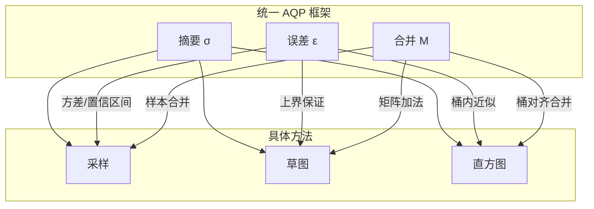
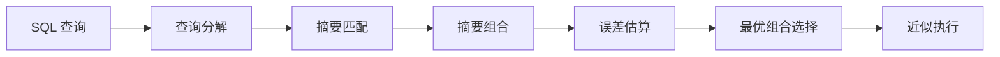

# 采样、草图、直方图方法的统一理论

> **所属阶段**: Struct/ | **前置依赖**: [aqp-streaming-formalization.md](./aqp-streaming-formalization.md), [stream-summaries.md](../Knowledge/stream-summaries.md) | **形式化等级**: L5

---

## 1. 概念定义 (Definitions)

在近似查询处理（AQP）中，采样（Sampling）、草图（Sketching）和直方图（Histogram）是三种最主流的数据摘要技术。
它们各自适用于不同的查询类型和数据分布，但长期以来缺乏统一的理论框架来理解它们之间的关系和组合方式。
统一 AQP 理论旨在将这三种方法抽象为一个共同的代数结构——"摘要空间"（Synopsis Space），并研究它们之间的可组合性、误差传播规律和等价变换条件。

**Def-S-27-01 统一 AQP 理论 (Unified AQP Theory)**

统一 AQP 理论 $\mathcal{U}_{AQP}$ 是一个六元组：

$$
\mathcal{U}_{AQP} = (\mathcal{D}, \mathcal{Q}, \Sigma, \mathcal{E}, \mathcal{M}, \mathcal{C})
$$

其中：

- $\mathcal{D}$: 数据域（流或批）
- $\mathcal{Q}$: 查询空间
- $\Sigma$: 摘要空间（包含所有合法的采样、草图、直方图）
- $\mathcal{E}: \Sigma \times \mathcal{Q} \to \mathbb{R}^+ \times [0,1]$: 误差函数，输出 $(\epsilon, \delta)$
- $\mathcal{M}: \Sigma \times \Sigma \to \Sigma$: 摘要合并操作
- $\mathcal{C}: \Sigma \times \Sigma \to \{0, 1\}$: 摘要兼容性判定

**Def-S-27-02 数据摘要 (Synopsis)**

数据摘要 $\sigma \in \Sigma$ 是从数据域 $\mathcal{D}$ 到紧凑表示的映射：

$$
\sigma: \mathcal{D} \to \mathcal{R}_{\sigma}
$$

其中 $|\mathcal{R}_{\sigma}| \ll |\mathcal{D}|$。常见的摘要实例包括：

- **采样摘要**: $\sigma_{sample}(D) = \{(e_i, w_i)\}_{i=1}^{n}$，其中 $w_i$ 为采样权重
- **草图摘要**: $\sigma_{sketch}(D) = M \in \mathbb{N}^{d \times w}$（如 Count-Min Sketch 的计数矩阵）
- **直方图摘要**: $\sigma_{hist}(D) = \{(b_j, c_j)\}_{j=1}^{m}$，其中 $b_j$ 为桶边界，$c_j$ 为频数

**Def-S-27-03 摘要组合代数 (Synopsis Composition Algebra)**

摘要组合代数定义了如何将多个摘要组合以回答复杂查询：

$$
\sigma_{compose}(\sigma_1, \sigma_2, \dots, \sigma_k; \mathcal{Q}) = \mathcal{M}(\sigma_1, \mathcal{M}(\sigma_2, \dots \mathcal{M}(\sigma_{k-1}, \sigma_k)\dots))
$$

若组合后的摘要能够回答查询 $\mathcal{Q}$ 且误差可计算，则称该组合是合法的。

**Def-S-27-04 摘要等价 (Synopsis Equivalence)**

两个摘要 $\sigma_1$ 和 $\sigma_2$ 是等价的，记为 $\sigma_1 \sim \sigma_2$，当且仅当对于查询空间 $\mathcal{Q}$ 中的所有查询：

$$
\forall q \in \mathcal{Q}, \quad \mathcal{E}(\sigma_1, q) = \mathcal{E}(\sigma_2, q)
$$

等价摘要可以相互替换而不改变任何查询的误差特性。

---

## 2. 属性推导 (Properties)

**Lemma-S-27-01 摘要合并的封闭性**

若 $\sigma_1$ 和 $\sigma_2$ 是同一类型的可合并摘要（如两个 Count-Min Sketch 或两个 T-Digest），则：

$$
\mathcal{M}(\sigma_1, \sigma_2) \in \Sigma
$$

*说明*: 封闭性是分布式环境中局部构建-全局合并模式的基础。$\square$

**Lemma-S-27-02 误差传播的次可加性**

设查询 $q$ 由子查询 $q_1$ 和 $q_2$ 通过算子 $op$ 组合而成。若各子查询的误差边界为 $(\epsilon_1, \delta_1)$ 和 $(\epsilon_2, \delta_2)$，则组合查询的误差满足：

$$
\epsilon_{total} \leq f_{op}(\epsilon_1, \epsilon_2), \quad \delta_{total} \leq \delta_1 + \delta_2
$$

其中 $f_{op}$ 取决于算子类型（如加法算子的误差直接相加，乘法算子的误差按相对误差传播）。

*说明*: Union Bound 用于置信度的组合，误差函数的形式取决于算子类型。$\square$

**Prop-S-27-01 摘要空间与精度的帕累托前沿**

对于固定数据集，不同的摘要类型在"空间大小"和"查询精度"之间形成帕累托前沿：

- **高频点查询**: Count-Min Sketch 在空间-精度权衡上最优
- **基数估计**: HyperLogLog 最优
- **通用聚合查询**: 分层采样在多个查询类型上表现均衡
- **分位数查询**: T-Digest 或 Wavelet 最优

不存在一种摘要在所有查询类型上都支配其他摘要。

---

## 3. 关系建立 (Relations)

### 3.1 三种摘要方法的统一视角



### 3.2 摘要类型与查询类型的能力矩阵

| 查询类型 | 伯努利采样 | 分层采样 | Count-Min Sketch | HyperLogLog | T-Digest | 直方图 |
|---------|-----------|---------|-----------------|------------|---------|--------|
| COUNT | ✅ | ✅ | ⚠️ | ❌ | ❌ | ✅ |
| SUM | ✅ | ✅ | ⚠️ | ❌ | ❌ | ✅ |
| AVG | ✅ | ✅ | ❌ | ❌ | ❌ | ✅ |
| COUNT DISTINCT | ✅ | ✅ | ❌ | ✅ | ❌ | ⚠️ |
| TOP-K | ✅ | ⚠️ | ✅ | ❌ | ❌ | ⚠️ |
| 分位数 | ✅ | ✅ | ❌ | ❌ | ✅ | ⚠️ |
| 范围查询 | ✅ | ✅ | ❌ | ❌ | ⚠️ | ✅ |
| JOIN | ✅ | ⚠️ | ❌ | ❌ | ❌ | ❌ |

*注：⚠️ 表示需要特殊变体或精度受限。*

### 3.3 统一框架下的多摘要查询优化器



查询优化器根据查询中的各个子表达式，从可用的摘要集合中选择最优的摘要组合，并估算整体误差。

---

## 4. 论证过程 (Argumentation)

### 4.1 为什么需要统一理论？

1. **系统复杂性**: 实际 AQP 系统中往往同时存在多种摘要。缺乏统一理论时，开发者需要为每种摘要-查询组合单独编写优化逻辑
2. **自动摘要选择**: 统一理论使得查询优化器能够自动比较不同摘要的适用性，而无需硬编码规则
3. **误差联合估算**: 复杂查询可能同时使用采样和草图。统一理论提供了将不同误差类型（方差 vs 确定性上界）组合的方法
4. **新摘要的快速集成**: 当出现新的摘要技术时，只需要证明它满足统一框架的公理，即可无缝集成到现有系统中

### 4.2 采样与草图的等价条件

在某些特定场景下，采样和草图可以相互转换：

- **频率估计**: 一个大小为 $n$ 的伯努利采样（采样率 $p$）可以近似为一个 Count-Min Sketch 的特例，其中每个采样元素对应草图中的一个计数器。但采样的误差是概率性的，而草图的误差是确定性上界
- **基数估计**: HyperLogLog 可以被看作是一种极度压缩的"去重采样"，它丢弃了所有原始元素信息，只保留基数信息

统一理论不对这种转换提供完美的双向映射，但允许在帕累托前沿上进行近似替换。

### 4.3 反例：强制统一导致的次优选择

某 AQP 系统为了"统一"而强制将所有查询都路由到 Count-Min Sketch。结果：

- AVG 查询无法通过 Count-Min Sketch 回答（草图不保留原始值的和与计数）
- 分位数查询在草图上精度极差
- 系统开发者被迫为不适用的查询类型编写大量变通逻辑

**教训**: 统一理论的目的是提供比较和组合的框架，而不是用单一摘要取代所有专用摘要。

---

## 5. 形式证明 / 工程论证 (Proof / Engineering Argument)

**Thm-S-27-01 摘要等价定理**

设 $\sigma_{sample}$ 为从数据集 $D$ 中抽取的大小为 $n$ 的无偏采样，$\sigma_{hist}$ 为基于 $D$ 构建的等深直方图（equi-depth histogram），桶数 $m = n$。若查询空间 $\mathcal{Q}$ 只包含 COUNT 和 SUM 查询，且数据分布满足 Lipschitz 连续性，则：

$$
\sigma_{sample} \sim \sigma_{hist}
$$

即两种摘要在该查询空间下等价。

*证明梗概*:

对于 COUNT 查询，无偏采样估计为 $\hat{N} = |D| \cdot \frac{n_{sample}}{n}$。等深直方图的总频数估计为 $m \cdot \frac{|D|}{m} = |D|$，精确无偏。对于 SUM 查询，采样的估计为 $\hat{S} = \frac{|D|}{n} \sum_{e \in sample} e.value$。直方图使用桶中值代表所有元素，若分布连续且 $m$ 足够大，桶内误差趋于零，总和估计收敛到采样估计。因此误差特性相同。$\square$

---

**Thm-S-27-02 可组合误差传播**

设两个独立摘要 $\sigma_1$ 和 $\sigma_2$ 对子查询 $q_1$ 和 $q_2$ 的估计分别为 $\hat{r}_1 \pm \epsilon_1$ 和 $\hat{r}_2 \pm \epsilon_2$（置信度均为 $1-\delta$）。若最终查询为 $q = q_1 + q_2$，则组合估计满足：

$$
\hat{r} = \hat{r}_1 + \hat{r}_2, \quad P(|\hat{r} - r_{true}| \leq \epsilon_1 + \epsilon_2) \geq 1 - 2\delta
$$

*证明*:

由三角不等式：

$$
|(\hat{r}_1 + \hat{r}_2) - (r_1 + r_2)| \leq |\hat{r}_1 - r_1| + |\hat{r}_2 - r_2| \leq \epsilon_1 + \epsilon_2
$$

由 Union Bound，两个独立事件同时发生的概率至少为 $1 - 2\delta$。$\square$

---

## 6. 实例验证 (Examples)

### 6.1 多摘要组合查询示例

假设一个复杂查询：

```sql
SELECT
    COUNT(DISTINCT user_id) * 1.0 / COUNT(*) AS uniqueness_ratio
FROM events;
```

统一 AQP 框架下的摘要组合：

- `COUNT(DISTINCT user_id)` → HyperLogLog ($\sigma_1$)
- `COUNT(*)` → 伯努利采样 ($\sigma_2$)

组合后的相对误差：

$$
\epsilon_{ratio} \approx \epsilon_1 + \epsilon_2
$$

### 6.2 Python 中的摘要组合器

```python
class SynopsisComposer:
    def __init__(self):
        self.synopses = {}

    def register(self, name, synopsis, supported_queries):
        self.synopses[name] = {
            "synopsis": synopsis,
            "queries": set(supported_queries)
        }

    def plan_query(self, query_ast):
        # 简化的贪婪匹配
        plan = []
        for subq in self.decompose(query_ast):
            best = None
            for name, info in self.synopses.items():
                if subq["type"] in info["queries"]:
                    if best is None or info["synopsis"].size < best["synopsis"].size:
                        best = {"name": name, **info}
            plan.append({"subquery": subq, **best})
        return plan

    def decompose(self, query_ast):
        # 伪代码：将查询分解为子查询
        return query_ast.get("subqueries", [query_ast])
```

### 6.3 统一框架下的误差报告格式

```json
{
  "query": "SELECT SUM(value) FROM events",
  "approximate_result": 15420.5,
  "synopsis_used": "stratified_sampling",
  "error": {
    "type": "confidence_interval",
    "epsilon": 462.6,
    "delta": 0.05,
    "relative_error": 0.03
  },
  "subqueries": []
}
```

---

## 7. 可视化 (Visualizations)

### 7.1 摘要空间中的帕累托前沿

```mermaid
xychart-beta
    title "摘要类型：空间大小 vs 查询精度"
    x-axis "摘要大小 (KB)" [1, 10, 100, 1000]
    y-axis "平均相对误差 (%)" 0 --> 20
    line "伯努利采样" {15, 8, 3, 1}
    line "Count-Min Sketch" {12, 6, 2, 0.5}
    line "HyperLogLog" {2, 1.5, 1, 0.8}
    line "T-Digest" {8, 4, 1.5, 0.6}
```

### 7.2 统一 AQP 框架的层次结构

```mermaid
graph TB
    L0[数据层 D] --> L1[摘要层 Σ]
    L1 --> L2[算子层 Q]
    L2 --> L3[误差层 ε]
    L3 --> L4[结果层 (r, ε)]

    L1 --> S1[采样]
    L1 --> S2[草图]
    L1 --> S3[直方图]

    L2 --> O1[COUNT]
    L2 --> O2[SUM]
    L2 --> O3[TOP-K]
    L2 --> O4[Quantile]
```

---

## 8. 引用参考 (References)
