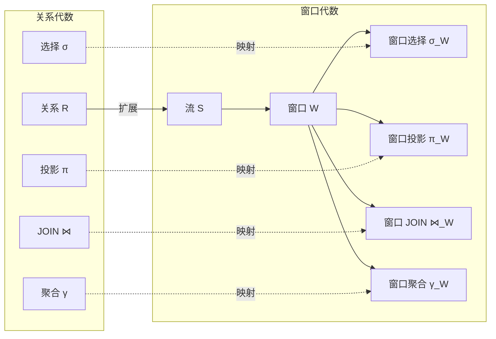
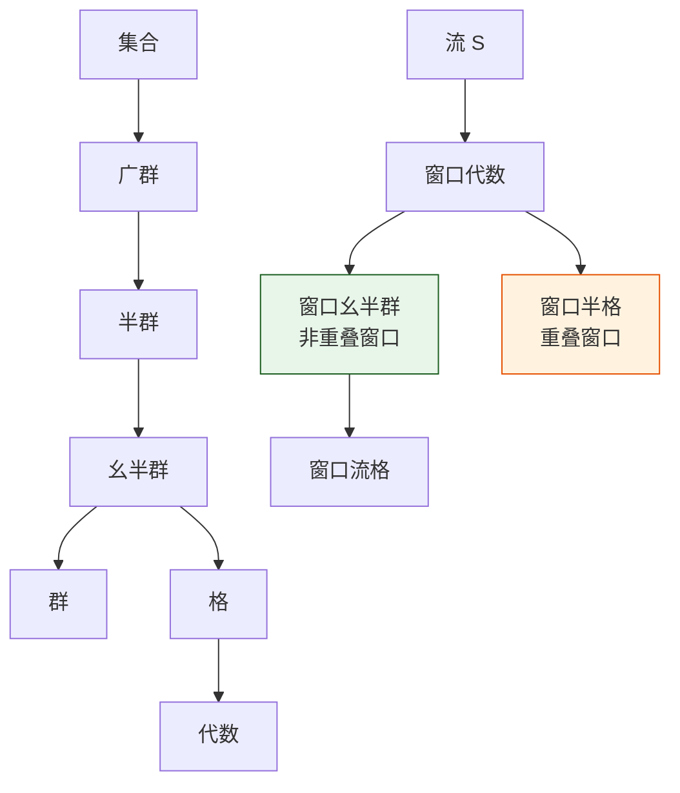

# 窗口语义对代数性质的影响

> **所属阶段**: Struct/ | **前置依赖**: [window-join-reordering.md](./window-join-reordering.md), [time-semantics-and-watermark.md](../Flink/02-core/time-semantics-and-watermark.md) | **形式化等级**: L5

---

## 1. 概念定义 (Definitions)

窗口操作是流处理区别于批处理的核心特征。
从代数角度看，窗口将无界流划分为有限子集，使得经典的集合操作和关系代数得以在流上应用。
然而，窗口的引入也改变了底层数据结构的代数性质——流不再是简单的序列，而是一个由时间窗口索引的集合族。
理解窗口语义对代数性质的影响，对于查询优化、等价变换和分布式执行计划的正确性至关重要。

**Def-S-24-01 窗口代数 (Window Algebra)**

窗口代数 $\mathcal{A}_W$ 是一个五元组：

$$
\mathcal{A}_W = (\mathcal{S}, \mathcal{W}, \oplus, \otimes, \emptyset)
$$

其中：

- $\mathcal{S}$: 事件流集合
- $\mathcal{W}$: 窗口函数集合，$W: \mathcal{S} \to 2^{\mathcal{S}}$（将流映射为子流集合）
- $\oplus$: 流合并操作（Union）
- $\otimes$: 窗口连接操作（Join）
- $\emptyset$: 空流

**Def-S-24-02 窗口幺半群 (Window Monoid)**

设窗口 $W$ 对算子 $\oplus$ 构成幺半群，当且仅当满足：

1. **封闭性**: $\forall S_1, S_2 \in \mathcal{S}, W(S_1 \oplus S_2) \in 2^{\mathcal{S}}$
2. **结合律**: $W((S_1 \oplus S_2) \oplus S_3) = W(S_1 \oplus (S_2 \oplus S_3))$
3. **幺元**: $W(S \oplus \emptyset) = W(S)$

对于非重叠窗口（如滚动窗口），$W(S_1 \oplus S_2) = W(S_1) \cup W(S_2)$，封闭性和结合律自然成立。

**Def-S-24-03 窗口流格 (Window Stream Lattice)**

若进一步定义偏序关系 $\sqsubseteq$ 为流的包含关系（$S_1 \sqsubseteq S_2 \iff S_1 \subseteq S_2$），则 $(\mathcal{S}, \sqsubseteq, \oplus, \emptyset)$ 构成一个格，其中：

- **交（Meet）**: $S_1 \sqcap S_2 = S_1 \cap S_2$
- **并（Join）**: $S_1 \sqcup S_2 = S_1 \oplus S_2 = S_1 \cup S_2$

窗口函数 $W$ 在该格上诱导出一个子格结构：$W(S)$ 是 $S$ 的一个划分（对于非重叠窗口）或覆盖（对于重叠窗口）。

**Def-S-24-04 窗口聚合的单调性 (Window Aggregation Monotonicity)**

设聚合函数 $agg: 2^{\mathcal{S}} \to V$ 将窗口内的元素映射到值域 $V$。$agg$ 关于窗口包含关系是单调的，当且仅当：

$$
\forall w_1, w_2 \in W(S), \quad w_1 \subseteq w_2 \implies agg(w_1) \preceq agg(w_2)
$$

其中 $\preceq$ 为 $V$ 上的适当偏序。例如，对于 COUNT 聚合，$V = \mathbb{N}$，$\preceq$ 为自然数的大小顺序，COUNT 显然是单调的。

---

## 2. 属性推导 (Properties)

**Lemma-S-24-01 非重叠窗口下的并封闭性**

若 $W$ 是非重叠窗口（如滚动窗口或会话窗口），则对于任意流 $S_1, S_2$：

$$
W(S_1 \cup S_2) = W(S_1) \cup W(S_2)
$$

*说明*: 非重叠窗口将流空间划分为不相交的子集，因此并操作可以直接分配到窗口级别。$\square$

**Lemma-S-24-02 重叠窗口下的并半封闭性**

若 $W$ 是重叠窗口（如滑动窗口），则：

$$
W(S_1 \cup S_2) \subseteq W(S_1) \cup W(S_2) \cup W_{overlap}(S_1, S_2)
$$

其中 $W_{overlap}(S_1, S_2)$ 为跨越 $S_1$ 和 $S_2$ 边界的额外窗口。

*说明*: 重叠窗口破坏了严格的分配律，因为合并后的流可能产生原流中不存在的新窗口实例。$\square$

**Prop-S-24-01 代数优化的完备性边界**

在窗口代数中，以下传统关系代数等价变换在特定条件下保持有效：

- 选择下推：✅ 总是有效
- 投影下推：✅ 在窗口键被保留时有效
- JOIN 交换律：⚠️ 仅当窗口对齐且谓词对称时有效
- JOIN 结合律：⚠️ 仅当窗口兼容时有效
- 聚合分配律：❌ 一般无效（$agg(A \cup B) \neq agg(A) \oplus agg(B)$）

*说明*: 聚合分配律的失效是流处理查询优化中最具挑战性的问题之一。$\square$

---

## 3. 关系建立 (Relations)

### 3.1 窗口代数与传统关系代数的映射



### 3.2 不同窗口类型的代数性质

| 窗口类型 | 是否划分 | 是否重叠 | 并分配律 | 代数结构 |
|---------|---------|---------|---------|---------|
| **滚动窗口 (Tumbling)** | 是 | 否 | ✅ 满足 | 幺半群 / 格 |
| **滑动窗口 (Sliding)** | 否 | 是 | ⚠️ 半满足 | 半格 |
| **会话窗口 (Session)** | 是* | 否* | ✅ 满足* | 幺半群* |
| **全局窗口 (Global)** | 否 | 否 | ✅ 平凡满足 | 格 |

*注：会话窗口的边界取决于数据内容，因此其代数性质是动态的。*

### 3.3 Flink SQL 中的代数变换示例

```mermaid
graph TB
    subgraph Original[原始查询]
        O1[SELECT COUNT(*) FROM S GROUP BY TUMBLE(ts, 1h)]
    end

    subgraph Invalid[无效变换]
        I1[SELECT SUM(cnt) FROM (SELECT COUNT(*) AS cnt FROM S GROUP BY TUMBLE(ts, 10m))]
    end

    subgraph Valid[有效变换]
        V1[SELECT * FROM S WHERE ts > '10:00' GROUP BY TUMBLE(ts, 1h)]
        V2[SELECT * FROM (SELECT * FROM S WHERE ts > '10:00') GROUP BY TUMBLE(ts, 1h)]
    end

    O1 -.->|聚合不可分配| I1
    O1 -.->|选择可下推| V1
    V1 -->|等价| V2
```

---

## 4. 论证过程 (Argumentation)

### 4.1 为什么聚合分配律在窗口代数中失效？

考虑一个简单的 COUNT 聚合：

```sql
SELECT TUMBLE_START(ts, INTERVAL '1' HOUR) AS win, COUNT(*) AS cnt
FROM events
GROUP BY TUMBLE(ts, INTERVAL '1' HOUR);
```

如果我们先将流按 10 分钟窗口聚合，再汇总为 1 小时窗口：

```sql
SELECT TUMBLE_START(win, INTERVAL '1' HOUR) AS hour, SUM(cnt) AS cnt
FROM (
    SELECT TUMBLE_START(ts, INTERVAL '10' MINUTE) AS win, COUNT(*) AS cnt
    FROM events
    GROUP BY TUMBLE(ts, INTERVAL '10' MINUTE)
)
GROUP BY TUMBLE(win, INTERVAL '1' HOUR);
```

这个变换在批处理中通常成立（因为子聚合可以精确划分父聚合的边界），但在流处理中不一定：

- 若 1 小时窗口的边界与 10 分钟窗口不完全对齐，子聚合的结果会被错误地分配到错误的父窗口
- Watermark 的推进在两个查询中可能不同，导致迟到数据的处理不一致
- 某些聚合函数（如 COUNT DISTINCT、MEDIAN）天然不可分解

### 4.2 窗口格的工程意义

将窗口流建模为格具有重要的工程意义：

1. **增量计算**: 格的单调性保证了当新数据到达时，只需更新受影响的窗口实例，而不需全局重算
2. **查询重写安全边界**: 格的交并运算明确了哪些代数变换是安全的，哪些会改变语义
3. **分布式执行**: 格的并运算支持窗口结果的局部聚合和全局合并，这是分布式聚合的理论基础

### 4.3 反例：在会话窗口上错误应用分配律

某系统尝试对会话窗口聚合进行"分而治之"优化：

```sql
-- 原始查询
SELECT session_id, COUNT(*) FROM events GROUP BY SESSION(ts, INTERVAL '5' MINUTE);

-- 错误优化：先按 1 分钟窗口聚合，再合并为会话
SELECT session_id, SUM(cnt) FROM (
    SELECT session_id, COUNT(*) AS cnt
    FROM events
    GROUP BY SESSION(ts, INTERVAL '1' MINUTE)
) GROUP BY session_id;
```

结果：

- 1 分钟会话窗口将原本属于同一个 5 分钟会话的事件拆分到了多个会话中
- 最终的 `SUM(cnt)` 产生了比正确结果更多的会话数量和错误的计数

**教训**: 会话窗口的边界是数据依赖的，不能通过固定大小的子窗口来近似。

---

## 5. 形式证明 / 工程论证 (Proof / Engineering Argument)

**Thm-S-24-01 滚动窗口下的聚合单调性**

设 $W_{tumble}$ 为大小为 $T$ 的滚动窗口，$S$ 为事件流。对于单调聚合函数 $agg$（如 COUNT, SUM, MAX, MIN），若 $w_1, w_2 \in W_{tumble}(S)$ 且 $w_1 \subseteq w_2$，则：

$$
agg(w_1) \preceq agg(w_2)
$$

*证明*:

对于 COUNT 和 SUM，增加元素只会使结果增大或不变，因此单调性显然成立。对于 MAX 和 MIN，增加元素可能提升最大值或降低最小值，但相对于适当的偏序（MAX 用 $\leq$，MIN 用 $\geq$），单调性也成立。$\square$

---

**Thm-S-24-02 窗口 JOIN 对并的分配律条件**

设 $W$ 为非重叠窗口，$A, B, C$ 为三个流。则窗口 JOIN 对并操作满足分配律：

$$
(A \cup B) \bowtie_W C \equiv (A \bowtie_W C) \cup (B \bowtie_W C)
$$

当且仅当窗口函数 $W$ 满足 $W(X \cup Y) = W(X) \cup W(Y)$。

*证明*:

由窗口 JOIN 的定义：

$$
(A \cup B) \bowtie_W C = \bigcup_{w \in W(A \cup B)} (w \cap (A \cup B)) \bowtie (w \cap C)
$$

若 $W(A \cup B) = W(A) \cup W(B)$，则上式可分解为：

$$
\bigcup_{w \in W(A)} (w \cap A) \bowtie (w \cap C) \cup \bigcup_{w \in W(B)} (w \cap B) \bowtie (w \cap C) = (A \bowtie_W C) \cup (B \bowtie_W C)
$$

反之，若 $W$ 不满足分配律（如重叠窗口），则 $W(A \cup B)$ 中可能包含既不属于 $W(A)$ 也不属于 $W(B)$ 的新窗口，分配律失效。$\square$

---

## 6. 实例验证 (Examples)

### 6.1 滚动窗口的幺半群结构

滚动窗口 $\text{TUMBLE}(S, T)$ 将流 $S$ 划分为不相交的子集：

$$
\text{TUMBLE}(S, T) = \{S_{[0,T)}, S_{[T,2T)}, S_{[2T,3T)}, \dots\}
$$

对于任意两个流 $S_1, S_2$：

$$
\text{TUMBLE}(S_1 \cup S_2, T) = \text{TUMBLE}(S_1, T) \cup \text{TUMBLE}(S_2, T)
$$

因此 $(\mathcal{S}, \cup, \emptyset)$ 在 TUMBLE 下构成幺半群。

### 6.2 Python 中的窗口代数验证

```python
from collections import defaultdict
from dataclasses import dataclass

@dataclass
class Event:
    key: str
    ts: int
    value: float

def tumbling_window(stream, size):
    windows = defaultdict(list)
    for e in stream:
        win_id = e.ts // size
        windows[win_id].append(e)
    return dict(windows)

def union_windows(w1, w2):
    result = dict(w1)
    for k, v in w2.items():
        result[k] = result.get(k, []) + v
    return result

# 验证分配律
S1 = [Event("a", 5, 1.0), Event("b", 15, 2.0)]
S2 = [Event("c", 8, 3.0), Event("d", 25, 4.0)]

left = tumbling_window(S1 + S2, 10)
right = union_windows(tumbling_window(S1, 10), tumbling_window(S2, 10))

assert left == right, "Tumbling window satisfies distributive law"
print("分配律验证通过")
```

### 6.3 Flink SQL 中的代数安全变换

**安全变换 1：选择下推**

```sql
-- 原始
SELECT COUNT(*) FROM events WHERE value > 100 GROUP BY TUMBLE(ts, 1h);

-- 等价变换
SELECT COUNT(*) FROM (SELECT * FROM events WHERE value > 100) GROUP BY TUMBLE(ts, 1h);
```

**安全变换 2：窗口键投影保留**

```sql
-- 原始
SELECT key, COUNT(*) FROM events GROUP BY key, TUMBLE(ts, 1h);

-- 等价变换（先投影）
SELECT key, COUNT(*) FROM (SELECT key, ts FROM events) GROUP BY key, TUMBLE(ts, 1h);
```

**不安全变换：聚合拆分**

```sql
-- 原始
SELECT TUMBLE(ts, 1h), COUNT(DISTINCT user_id) FROM events GROUP BY TUMBLE(ts, 1h);

-- 错误优化：COUNT DISTINCT 不可分解
SELECT TUMBLE(win, 1h), SUM(cnt) FROM (
    SELECT TUMBLE(ts, 10m) AS win, COUNT(DISTINCT user_id) AS cnt FROM events GROUP BY TUMBLE(ts, 10m)
) GROUP BY TUMBLE(win, 1h);
```

---

## 7. 可视化 (Visualizations)

### 7.1 窗口代数结构层次



### 7.2 不同窗口的并分配律可视化

```mermaid
xychart-beta
    title "窗口类型与代数性质满足度"
    x-axis [Tumbling, Sliding, Session, Global]
    y-axis "性质满足度 (%)" 0 --> 100
    bar "并分配律" {100, 40, 100, 100}
    bar "结合律" {100, 80, 90, 100}
    bar "交换律" {100, 100, 100, 100}
    bar "聚合可分解" {100, 20, 0, 100}
```

---

## 8. 引用参考 (References)
