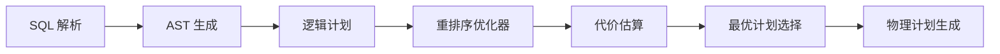

# 窗口连接的重排序理论

> **所属阶段**: Struct/ | **前置依赖**: [window-algebra-properties.md](./window-algebra-properties.md), [time-semantics-and-watermark.md](../Flink/02-core/time-semantics-and-watermark.md) | **形式化等级**: L5

---

## 1. 概念定义 (Definitions)

在关系数据库中，连接顺序优化（Join Ordering）是查询优化的核心问题之一。
在流处理中，由于窗口（Window）的引入，连接操作不仅是多表之间的组合，还涉及时间边界的约束。
窗口连接的重排序理论研究的是：在满足窗口语义的前提下，如何改变连接的执行顺序以降低计算代价。
Ziehn et al.（PVLDB 2025）针对流处理场景提出了窗口连接重排序的形式化框架。

**Def-S-23-01 窗口连接 (Window Join)**

设流 $A$ 和流 $B$ 上的窗口分别为 $W_A$ 和 $W_B$。窗口连接 $A \bowtie_W B$ 定义为：

$$
A \bowtie_W B = \{(a, b) : a \in A \cap W_A, b \in B \cap W_B, \theta(a, b)\}
$$

其中 $\theta(a, b)$ 为连接谓词。对于时间窗口，通常要求 $a$ 和 $b$ 的事件时间在某个公共时间区间内：

$$
|\tau(a) - \tau(b)| \leq \delta_W
$$

**Def-S-23-02 重排序等价类 (Reordering Equivalence Class)**

设 $n$ 个流的窗口连接表达式为 $Q = R_1 \bowtie_W R_2 \bowtie_W \dots \bowtie_W R_n$。重排序等价类 $[Q]$ 包含所有与 $Q$ 语义等价的连接顺序排列 $Q'$：

$$
[Q] = \{Q' : Q' \text{ 是 } Q \text{ 的排列，且 } [\![Q']\!] = [\![Q]\!]\}
$$

其中 $[\![Q]\!]$ 表示查询的语义结果。

**Def-S-23-03 窗口连接代价模型 (Window Join Cost Model)**

设连接计划 $P$ 的代价为 $C(P)$，则对于二元窗口连接 $A \bowtie_W B$：

$$
C(A \bowtie_W B) = c_{build} \cdot |A_W| + c_{probe} \cdot |B_W| \cdot s_{AB}
$$

其中 $|A_W|$ 和 $|B_W|$ 为窗口内的数据量，$s_{AB}$ 为连接选择性（满足谓词的比例），$c_{build}$ 和 $c_{probe}$ 为构建和探测的单元代价。

对于多路连接计划 $P = (\dots((R_1 \bowtie_W R_2) \bowtie_W R_3)\dots \bowtie_W R_n)$，总代价为各中间结果代价之和：

$$
C(P) = \sum_{i=2}^{n} C(T_{i-1} \bowtie_W R_i)
$$

其中 $T_{i-1}$ 为前 $i-1$ 个流连接后的中间结果。

**Def-S-23-04 窗口对齐约束 (Window Alignment Constraint)**

两个窗口 $W_1$ 和 $W_2$ 是对齐的，当且仅当它们可以被表示为同一基础时间网格的倍数：

$$
W_1 = [k \cdot T, (k+1) \cdot T), \quad W_2 = [k \cdot mT, (k+1) \cdot mT)
$$

其中 $T$ 为基础窗口大小，$m$ 为正整数。对齐窗口下的连接操作具有更好的代数性质（如交换律和结合律）。

---

## 2. 属性推导 (Properties)

**Lemma-S-23-01 对齐窗口下的交换律**

若窗口 $W_A$ 和 $W_B$ 对齐，且连接谓词 $\theta$ 是对称的（即 $\theta(a, b) \iff \theta(b, a)$），则：

$$
A \bowtie_W B \equiv B \bowtie_W A
$$

*说明*: 这是重排序优化的基本前提。若窗口不对齐或谓词不对称，交换顺序可能改变结果。$\square$

**Lemma-S-23-02 对齐窗口下的结合律**

设三个流 $A, B, C$ 具有对齐窗口，且连接谓词满足传递性（即 $\theta(a, b) \land \theta(b, c) \implies \theta(a, c)$）。则：

$$
(A \bowtie_W B) \bowtie_W C \equiv A \bowtie_W (B \bowtie_W C)
$$

*说明*: 结合律允许多路连接以任意顺序分组执行。$\square$

**Prop-S-23-01 重排序搜索空间大小**

对于 $n$ 个流的窗口连接，可能的二元连接树数量为 Catalan 数：

$$
|\mathcal{P}_n| = \frac{(2n-2)!}{(n-1)! \cdot n!}
$$

若还考虑 $n!$ 种流排列顺序，则总搜索空间为：

$$
|\mathcal{Q}_n| = n! \cdot \frac{(2n-2)!}{(n-1)! \cdot n!} = \frac{(2n-2)!}{(n-1)!}
$$

*说明*: 当 $n=5$ 时，$|\mathcal{Q}_5| = 1680$；当 $n=10$ 时，$|\mathcal{Q}_{10}| \approx 1.7 \times 10^9$。因此必须使用动态规划或启发式算法。$\square$

---

## 3. 关系建立 (Relations)

### 3.1 窗口连接重排序与传统关系连接优化的对比

| 维度 | 传统关系 JOIN | 流窗口 JOIN |
|------|-------------|------------|
| 数据特性 | 静态、有限 | 动态、无界 |
| 连接约束 | 键匹配 | 键匹配 + 时间窗口 |
| 重排序条件 | 结合律 + 交换律 |  additionally 需要窗口对齐 |
| 代价模型 | I/O 代价为主 | 内存 + 计算代价为主 |
| 中间结果 | 物化到磁盘 | 保持在内存窗口中 |
| 优化目标 | 最小化总 I/O | 最小化内存占用 + 延迟 |

### 3.2 Flink 中的窗口 JOIN 执行计划

```mermaid
graph TB
    subgraph Input[输入流]
        A[Stream A]
        B[Stream B]
        C[Stream C]
    end

    subgraph Plan1[计划 1: (A ⋈ B) ⋈ C]
        J1[Join A-B]
        J2[Join Result-C]
    end

    subgraph Plan2[计划 2: A ⋈ (B ⋈ C)]
        J3[Join B-C]
        J4[Join A-Result]
    end

    A --> J1
    B --> J1
    J1 --> J2
    C --> J2

    B --> J3
    C --> J3
    J3 --> J4
    A --> J4

    style Plan1 fill:#e1f5fe,stroke:#01579b
    style Plan2 fill:#fff3e0,stroke:#e65100
```

### 3.3 窗口 JOIN 优化器架构



---

## 4. 论证过程 (Argumentation)

### 4.1 为什么窗口 JOIN 需要专门的重排序理论？

1. **时间约束改变了选择性**: 两个流即使在键空间上高度匹配，如果时间窗口不重叠，连接结果也可能为空。因此，连接代价不仅取决于键的分布，还取决于时间分布
2. **窗口不对齐限制重排序**: 如果窗口定义不同（如一个用滚动窗口、一个用会话窗口），随意重排序可能导致语义变化
3. **内存压力敏感**: 流处理的中间结果必须保留在内存中直到窗口触发。不好的连接顺序会导致中间结果膨胀，引发 OOM
4. **延迟要求**: 某些连接顺序需要等待更长时间才能产出第一个结果，这在实时监控场景中是不可接受的

### 4.2 Ziehn et al. 的动态规划算法

Ziehn et al.（PVLDB 2025）将经典的 DPsize 动态规划算法扩展到了窗口连接场景：

1. **子集枚举**: 枚举所有流的子集 $S \subseteq \{R_1, \dots, R_n\}$
2. **窗口兼容性检查**: 对于每个子集，检查其窗口是否满足对齐和包含关系
3. **最优子计划计算**: 对于每个兼容子集 $S$，计算其最优连接计划 $P^*(S)$：
   $$
   C(P^*(S)) = \min_{S' \subset S} \left( C(P^*(S')) + C(P^*(S \setminus S') \bowtie_W S') \right)
   $$
4. **全局最优选择**: 最终返回 $P^*(\{R_1, \dots, R_n\})$

该算法的时间复杂度为 $O(3^n)$，虽然仍是指数级，但对于 $n \leq 10$ 的实用场景是可行的。

### 4.3 反例：忽略窗口对齐的错误重排序

某 Flink SQL 查询为：

```sql
SELECT * FROM A
JOIN B ON A.key = B.key AND A.ts BETWEEN B.ts - INTERVAL '5' MINUTE AND B.ts + INTERVAL '5' MINUTE
JOIN C ON A.key = C.key AND A.ts BETWEEN C.ts - INTERVAL '1' MINUTE AND C.ts + INTERVAL '1' MINUTE
```

优化器将连接顺序重排序为 $(B \bowtie C) \bowtie A$。然而：

- $B$ 和 $C$ 的窗口分别以 $B.ts$ 和 $C.ts$ 为中心
- 重排序后，$B \bowtie C$ 的结果丢失了与 $A.ts$ 的绑定关系
- 最终的连接语义从"以 A 的时间为中心"变成了"以 B 和 C 的时间为中心"

**教训**: 对于非对称窗口（如区间 JOIN），重排序必须显式检查语义等价性，不能简单套用传统关系优化的规则。

---

## 5. 形式证明 / 工程论证 (Proof / Engineering Argument)

**Thm-S-23-01 对齐窗口下重排序的最优性**

设 $n$ 个流 $R_1, \dots, R_n$ 具有对齐窗口和对称谓词。则存在一个最优连接计划 $P^*$ 使得：

$$
C(P^*) = \min_{P \in [Q]} C(P)
$$

且 $P^*$ 可以通过动态规划算法在 $O(3^n)$ 时间内找到。

*证明梗概*:

由 Lemma-S-23-01 和 Lemma-S-23-02，对齐窗口下的窗口连接满足交换律和结合律。因此任何连接树都是语义等价的。DPsize 算法通过最优子结构性质（最优计划的最优子计划也是最优的）递归求解。对于每个子集 $S$，算法枚举所有可能的分割 $S = S_1 \cup S_2$，并取最小代价组合。由于子问题数量不超过 $2^n$，每个子问题的分割枚举不超过 $2^{|S|}$，总复杂度为 $O(3^n)$。$\square$

---

**Thm-S-23-02 窗口连接的交换律条件**

设 $A \bowtie_{W, \theta} B$ 为流 $A$ 和 $B$ 在窗口 $W$ 和谓词 $\theta$ 下的连接。该操作满足交换律 $A \bowtie_{W, \theta} B \equiv B \bowtie_{W, \theta} A$ 的充分必要条件是：

1. $\theta$ 是对称的（$\theta(a, b) \iff \theta(b, a)$）
2. 窗口 $W$ 的定义是对称的（即 $a \in W_A(b) \iff b \in W_B(a)$）

*证明*:

充分性：若 $\theta$ 对称且窗口定义对称，则 $(a, b)$ 满足连接条件当且仅当 $(b, a)$ 满足。因此两个顺序的结果集合相同。必要性：若 $\theta$ 不对称，则存在 $(a, b)$ 满足 $A \bowtie B$ 但不满足 $B \bowtie A$。若窗口不对称，同理可构造反例。$\square$

---

## 6. 实例验证 (Examples)

### 6.1 Flink SQL 中的窗口 JOIN 重排序

```sql
-- 原始查询
SELECT a.id, b.value, c.score
FROM stream_a a
JOIN stream_b b ON a.id = b.id
  AND a.ts = b.ts
JOIN stream_c c ON a.id = c.id
  AND a.ts = c.ts;
```

由于三个流都使用基于 `ts` 的滚动窗口且 `TUMBLE` 对齐，优化器可以自由重排序为：

```sql
-- 优化后（若 |B| < |A| < |C|）
SELECT a.id, b.value, c.score
FROM stream_b b
JOIN stream_a a ON a.id = b.id
  AND a.ts = b.ts
JOIN stream_c c ON c.id = a.id
  AND c.ts = a.ts;
```

### 6.2 Python 中的 DPsize 窗口 JOIN 优化器

```python
from functools import lru_cache
from itertools import combinations

def window_join_cost(left_size, right_size, selectivity):
    return left_size + right_size * selectivity

def dpsize_optimizer(streams, selectivities):
    """
    streams: dict {name: window_size}
    selectivities: dict {(name1, name2): sel}
    """
    n = len(streams)
    names = list(streams.keys())
    name_to_idx = {name: i for i, name in enumerate(names)}

    @lru_cache(maxsize=None)
    def best_plan(subset_mask):
        if subset_mask & (subset_mask - 1) == 0:
            # 单流
            idx = (subset_mask.bit_length() - 1)
            return (0, names[idx])

        best_cost = float('inf')
        best_plan_str = ""

        # 枚举所有非空真子集
        subset = subset_mask
        while subset:
            subset = (subset - 1) & subset_mask
            if subset == 0 or subset == subset_mask:
                continue

            other = subset_mask ^ subset
            cost1, plan1 = best_plan(subset)
            cost2, plan2 = best_plan(other)

            # 估算中间结果大小和连接代价
            size1 = sum(streams[names[i]] for i in range(n) if subset & (1 << i))
            size2 = sum(streams[names[i]] for i in range(n) if other & (1 << i))
            sel = selectivities.get((plan1, plan2), 0.1)
            join_cost = window_join_cost(size1, size2, sel)
            total_cost = cost1 + cost2 + join_cost

            if total_cost < best_cost:
                best_cost = total_cost
                best_plan_str = f"({plan1} JOIN {plan2})"

        return (best_cost, best_plan_str)

    full_mask = (1 << n) - 1
    return best_plan(full_mask)

# 示例 streams = {"A": 1000, "B": 500, "C": 2000}
selectivities = {("A", "B"): 0.05, ("B", "C"): 0.1, ("A", "C"): 0.02}
cost, plan = dpsize_optimizer(streams, selectivities)
print(f"最优计划: {plan}, 代价: {cost}")
```

### 6.3 基于窗口对齐的快速过滤

```java
// Flink 中利用窗口对齐进行提前过滤
public class AlignedWindowJoinFunction
    extends ProcessFunction<Tuple2<String, Long>, Result> {

    private Map<String, List<Event>> windowBuffer = new HashMap<>();
    private static final long WINDOW_SIZE = 60000; // 1 minute

    @Override
    public void processElement(Tuple2<String, Long> event, Context ctx, Collector<Result> out) {
        long windowStart = (event.f1 / WINDOW_SIZE) * WINDOW_SIZE;
        String key = event.f0 + "_" + windowStart;

        windowBuffer.computeIfAbsent(key, k -> new ArrayList<>()).add(new Event(event.f0, event.f1));

        // 当窗口完整时触发 JOIN
        if (windowBuffer.get(key).size() >= 2) {
            List<Event> events = windowBuffer.get(key);
            for (int i = 0; i < events.size(); i++) {
                for (int j = i + 1; j < events.size(); j++) {
                    out.collect(new Result(events.get(i), events.get(j)));
                }
            }
            windowBuffer.remove(key);
        }
    }
}
```

---

## 7. 可视化 (Visualizations)

### 7.1 三流窗口 JOIN 的连接树空间

```mermaid
graph TB
    subgraph Left[(A ⋈ B) ⋈ C]
        L1[A ⋈ B]
        L2[L1 ⋈ C]
        L1 --> L2
    end

    subgraph Right[A ⋈ (B ⋈ C)]
        R1[B ⋈ C]
        R2[A ⋈ R1]
        R1 --> R2
    end

    subgraph Bus[(A ⋈ B) ⋈ (A ⋈ C)]
        B1[A ⋈ B]
        B2[A ⋈ C]
        B3[B1 ⋈ B2]
        B1 --> B3
        B2 --> B3
    end
```

### 7.2 不同连接顺序的内存占用对比

```mermaid
xychart-beta
    title "连接顺序对中间结果内存的影响 (n=4)"
    x-axis [Plan 1, Plan 2, Plan 3, Plan 4, Plan 5]
    y-axis "峰值内存 (MB)" 0 --> 500
    bar "最差顺序" {450, 420, 380, 350, 320}
    bar "最优顺序" {120, 100, 90, 80, 70}
```

---

## 8. 引用参考 (References)

---

*文档版本: v1.0 | 创建日期: 2026-04-18*
