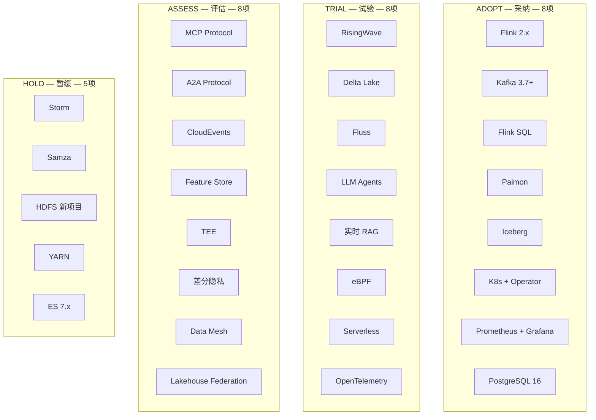

> **状态**: 生产内容 | **风险等级**: 中 | **最后更新**: 2026-04-30
>
# TECH-RADAR 目录索引

> AnalysisDataFlow 项目 — 流计算技术雷达体系

## 模块定位

TECH-RADAR 模块是 AnalysisDataFlow 项目的**技术战略决策支持系统**，采用 ThoughtWorks Technology Radar 的四环模型（Adopt / Trial / Assess / Hold），对流计算全栈技术进行系统化的季度评估与追踪，为技术选型、架构决策、投资规划提供权威参考。

## 目录结构

```
TECH-RADAR/
├── 00-INDEX.md                    # 本索引文件
├── README.md                      # 模块概览与使用指南
├── radar-q2-2026.md               # ★ Q2 2026 技术雷达基线（当前版本）
├── methodology.md                 # 技术评估方法论与评审流程
├── quarterly-review-template.md   # 季度评审报告模板
├── evolution-timeline.md          # 技术演进时间线与历史追踪
├── decision-tree.md               # 技术选型决策树
├── migration-recommendations.md   # 迁移路径与升级指南
├── risk-assessment.md             # 多维度风险评估框架
└── visuals/                       # 可视化资源
    ├── radar-chart.svg            # 静态 SVG 雷达图
    └── interactive-radar.html     # 交互式 D3.js 雷达图
```

## 快速导航

### 核心雷达

| 文档 | 说明 | 阅读建议 |
|------|------|----------|
| [radar-q2-2026.md](./radar-q2-2026.md) | **当前季度技术雷达**，包含 29 项技术的详细评估 | **必读** — 获取最新技术推荐 |
| [methodology.md](./methodology.md) | 评估方法论：五维度评分、环位迁移规则、评审流程 | 架构师 / 技术负责人必读 |
| [quarterly-review-template.md](./quarterly-review-template.md) | 未来季度评审的标准模板 | 评审委员会成员参考 |

### 决策支持

| 文档 | 说明 | 使用场景 |
|------|------|----------|
| [decision-tree.md](./decision-tree.md) | 系统化选型流程与对比矩阵 | 面对多个候选技术时 |
| [migration-recommendations.md](./migration-recommendations.md) | 各技术栈迁移路径与工具链 | 规划技术债务清理时 |
| [risk-assessment.md](./risk-assessment.md) | 多维度风险分析与缓解策略 | 高风险技术采用前 |
| [evolution-timeline.md](./evolution-timeline.md) | 技术发展历程与趋势预测 | 制定中长期技术规划时 |

### 可视化

| 资源 | 说明 |
|------|------|
| [静态雷达图](./visuals/radar-chart.svg) | SVG 格式技术分布图 |
| [交互式雷达图](./visuals/interactive-radar.html) | D3.js 交互式探索工具 |

## 当前雷达概览 (Q2 2026)

### 四环分布



### 类别覆盖

| 类别 | Adopt | Trial | Assess | Hold | 合计 |
|------|-------|-------|--------|------|------|
| Streaming Engines | 2 | 2 | — | 2 | 4 |
| Storage | 3 | 3 | — | 2 | 5 |
| AI/ML Integration | — | 2 | 2 | — | 2 |
| Protocols | — | — | 3 | — | 3 |
| Observability | 1 | 2 | — | — | 3 |
| Security | — | — | 2 | — | 2 |
| Architecture | 2 | 1 | 1 | 1 | 4 |
| **合计** | **8** | **8** | **8** | **5** | **29** |

## 版本历史

| 版本 | 日期 | 基线文档 | 主要变化 |
|------|------|----------|----------|
| **v2026.2-Q2** | 2026-04-30 | [radar-q2-2026.md](./radar-q2-2026.md) | **首次系统化季度雷达**，29 项技术，7 大类别，引入五维度评分法 |
| v2026.1 | 2026-02-15 | README.md | 新增 Wasm UDF、AI Agent、RisingWave 升级 |
| v2025.4 | 2025-12-15 | README.md | 新增 Paimon → Adopt，Temporal → Trial |
| v2025.3 | 2025-09-15 | README.md | 新增 ForSt State Backend → Trial |
| v2025.2 | 2025-06-15 | README.md | 新增 OpenTelemetry → Assess |
| v2025.1 | 2025-03-15 | README.md | 新增 Flink 2.0 → Trial |

## 使用建议

### 按角色

| 角色 | 推荐阅读 | 使用方式 |
|------|----------|----------|
| **CTO / 技术 VP** | radar-q2-2026.md (Executive Summary) + evolution-timeline.md | 技术投资决策、预算规划 |
| **架构师** | radar-q2-2026.md (全量) + methodology.md + decision-tree.md | 架构设计评审、技术选型 |
| **技术负责人** | radar-q2-2026.md (相关类别) + migration-recommendations.md | 迭代规划、技术债务管理 |
| **工程师** | radar-q2-2026.md (Adopt/Trial 相关项) | 学习路径、技能提升 |
| **安全/合规** | radar-q2-2026.md (Security 类别) + risk-assessment.md | 安全审查、合规评估 |

### 按场景

1. **新项目技术选型**
   → 查阅 [radar-q2-2026.md](./radar-q2-2026.md) Adopt 环，优先选用
   → 如有特殊需求，参考 [decision-tree.md](./decision-tree.md)

2. **遗留系统升级**
   → 检查现有技术是否在 Hold 环
   → 参考 [migration-recommendations.md](./migration-recommendations.md) 规划路径
   → 使用 [risk-assessment.md](./risk-assessment.md) 评估风险

3. **前沿技术跟踪**
   → 关注 [radar-q2-2026.md](./radar-q2-2026.md) Assess 环
   → 跟踪 [evolution-timeline.md](./evolution-timeline.md) 趋势预测

4. **季度规划会议**
   → 使用 [quarterly-review-template.md](./quarterly-review-template.md) 准备评审材料
   → 遵循 [methodology.md](./methodology.md) 的评审流程

## 贡献与更新

### 提交技术评估建议

欢迎通过以下方式贡献：

- **新进入提案**：提供技术名称、类别、建议环位、五维度评分理由
- **环位变更建议**：提供变更技术、目标环位、支撑证据（生产数据/POC 报告/社区动态）
- **信息勘误**：报告过时版本号、错误链接、失效引用

### 评审日历 (2026)

| 季度 | 评审启动 | 委员会评审 | 正式发布 | 基线文档 |
|------|----------|-----------|----------|----------|
| Q1 | 2026-02-01 | 2026-02-10 | 2026-02-15 | radar-q1-2026.md |
| **Q2** | **2026-04-15** | **2026-04-25** | **2026-04-30** | **radar-q2-2026.md** |
| Q3 | 2026-07-01 | 2026-07-10 | 2026-07-15 | radar-q3-2026.md |
| Q4 | 2026-10-01 | 2026-10-10 | 2026-10-15 | radar-q4-2026.md |

请遵循项目 [CONTRIBUTING.md](../CONTRIBUTING.md) 规范。

---

*AnalysisDataFlow Project | 技术委员会 | 2026 Q2*
