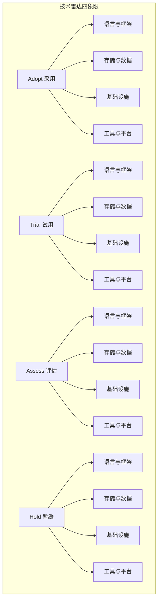

# 流计算技术雷达 (Streaming Technology Radar)

> 所属阶段: Knowledge | 前置依赖: [Flink生态](../Flink/00-INDEX.md), [技术全景](../Knowledge/01-concept-atlas/data-streaming-landscape-2026-complete.md) | 形式化等级: L3

## 1. 概述

流计算技术雷达是 AnalysisDataFlow 项目的技术选型参考框架，采用 ThoughtWorks 技术雷达的四象限分类法，系统评估流计算领域的关键技术。

### 1.1 评估维度

| 维度 | 说明 | 更新周期 |
|------|------|----------|
| **Adopt (采用)** | 成熟稳定，建议在生产环境广泛使用 | 每季度回顾 |
| **Trial (试用)** | 有前景的技术，建议在非核心场景试点 | 每季度评估 |
| **Assess (评估)** | 新兴技术，值得研究和POC验证 | 每月跟踪 |
| **Hold (暂缓)** | 技术债务或替代方案更优，建议暂停新采用 | 按需审查 |

### 1.2 技术分类



## 2. 雷达概览 (2026 Q2)

### 2.1 技术全景

| 分类 | Adopt | Trial | Assess | Hold |
|------|-------|-------|--------|------|
| **语言与框架** | 8项 | 6项 | 5项 | 3项 |
| **存储与数据** | 7项 | 5项 | 6项 | 4项 |
| **基础设施** | 6项 | 5项 | 4项 | 3项 |
| **工具与平台** | 7项 | 4项 | 5项 | 2项 |
| **总计** | **28项** | **20项** | **20项** | **12项** |

### 2.2 最近更新

- **2026-04**: 新增 Wasm/WASI 组件模型到 Assess，Flink DataStream V2 API 升级到 Adopt
- **2026-03**: RisingWave 升级到 Trial，Temporal + Flink 架构进入 Assess
- **2026-02**: Paimon 升级到 Adopt，Delta Lake 2.0 进入 Trial
- **2026-01**: AI Agent 集成技术 (FLIP-531) 进入 Assess

## 3. 详细技术清单

### 3.1 语言与框架

#### Adopt (采用)

| 技术 | 版本 | 说明 | 相关文档 |
|------|------|------|----------|
| **Apache Flink** | 2.0+ | 流计算核心引擎，Exactly-Once语义 | [Flink指南](../Flink/00-INDEX.md) |
| **Flink SQL/Table API** | 2.0+ | 声明式流处理，生产级稳定 | [SQL指南](../Flink/03-sql-table-api/flink-table-sql-complete-guide.md) |
| **Java 21** | LTS | Flink 主推语言，虚拟线程支持 | |
| **Kafka Client** | 3.7+ | 流数据摄入标准 | [集成指南](../Flink/04-connectors/kafka-integration-patterns.md) |
| **Scala 2.12/2.13** | - | Flink 原生支持，类型推导强 | [类型系统](../Flink/09-language-foundations/01.01-scala-types-for-streaming.md) |

#### Trial (试用)

| 技术 | 版本 | 说明 | 相关文档 |
|------|------|------|----------|
| **Flink Python (PyFlink)** | 2.0+ | Python 生态集成，ML场景 | [PyFlink](../Flink/09-language-foundations/02-python-api.md) |
| **Rust Native Streaming** | - | 高性能原生实现 | [Rust生态](../Flink/09-language-foundations/07-rust-streaming-landscape.md) |
| **RisingWave** | 2.0+ | 流处理数据库，物化视图 | [RisingWave](../Flink/09-language-foundations/06-risingwave-deep-dive.md) |
| **Timely Dataflow** | - | Rust 分布式计算框架 | [Timely](../Flink/09-language-foundations/07.01-timely-dataflow-optimization.md) |
| **Flink CDC** | 3.2+ | 变更数据捕获集成 | [CDC指南](../Flink/04-connectors/flink-cdc-3.0-data-integration.md) |

#### Assess (评估)

| 技术 | 版本 | 说明 | 相关文档 |
|------|------|------|----------|
| **Flink + AI Agent** | FLIP-531 | AI Agent 流式集成 | [FLIP-531](../Flink/12-ai-ml/flink-agents-flip-531.md) |
| **Wasm UDF** | WASI 0.3 | WebAssembly 用户函数 | [Wasm UDF](../Flink/09-language-foundations/09-wasm-udf-frameworks.md) |
| **Gleam** | - | 类型安全函数式语言 | |
| **Kotlin Flow** | - | Kotlin 协程流处理 | |
| **Zig** | - | 系统级高性能语言 | |

#### Hold (暂缓)

| 技术 | 原因 | 替代方案 |
|------|------|----------|
| **Apache Storm** | 社区活跃度低 | Apache Flink |
| **Flink Scala 2.11** | 已弃用 | Scala 2.12/2.13 |
| **Samza** | 维护模式 | Kafka Streams / Flink |

### 3.2 存储与数据

#### Adopt (采用)

| 技术 | 版本 | 说明 | 相关文档 |
|------|------|------|----------|
| **Apache Kafka** | 3.7+ | 流数据平台事实标准 | [Kafka集成](../Flink/04-connectors/kafka-integration-patterns.md) |
| **Apache Paimon** | 0.9+ | 流式湖仓存储 | [Paimon](../Flink/14-lakehouse/flink-paimon-integration.md) |
| **Apache Iceberg** | 1.6+ | 湖仓表格式标准 | [Iceberg](../Flink/04-connectors/flink-iceberg-integration.md) |
| **RocksDB** | - | 嵌入式状态存储 | [状态后端](../Flink/06-engineering/state-backend-selection.md) |
| **PostgreSQL** | 16+ | 流维表/CDC源 | |

#### Trial (试用)

| 技术 | 版本 | 说明 | 相关文档 |
|------|------|------|----------|
| **Delta Lake 2.0** | 3.2+ | 统一批流存储 | [Delta集成](../Flink/04-connectors/flink-delta-lake-integration.md) |
| **Hudi** | 0.15+ | 近实时数据湖 | |
| **ForSt State Backend** | - | Flink 2.0 远程状态 | [ForSt](../Flink/02-core-mechanisms/flink-2.0-forst-state-backend.md) |
| **Fluss (Fluss)** | - | Kafka 兼容流存储 | [Fluss](../Flink/04-connectors/fluss-integration.md) |

#### Assess (评估)

| 技术 | 版本 | 说明 | 相关文档 |
|------|------|------|----------|
| **Apache Ozone** | - | 分布式对象存储 | |
| **Ceph** | - | 统一存储系统 | |
| **Tiered Storage** | - | 分层存储架构 | [分层存储](../Flink/01-architecture/disaggregated-state-analysis.md) |
| **Vector DB (PGVector)** | - | AI 向量存储 | [向量搜索](../Flink/12-ai-ml/vector-database-integration.md) |

#### Hold (暂缓)

| 技术 | 原因 | 替代方案 |
|------|------|----------|
| **HDFS** | 云原生趋势 | S3/OSS + 对象存储 |
| **Cassandra (老版本)** | 运维复杂 | ScyllaDB / 托管服务 |
| **Redis Cluster (大规模)** | 一致性限制 | Redis Raft / 专用方案 |
| **Elasticsearch 7.x** | 版本过时 | Elasticsearch 8.x |

### 3.3 基础设施

#### Adopt (采用)

| 技术 | 版本 | 说明 | 相关文档 |
|------|------|------|----------|
| **Kubernetes** | 1.29+ | 容器编排标准 | [K8s部署](../Flink/10-deployment/kubernetes-deployment-production-guide.md) |
| **Flink Kubernetes Operator** | 1.9+ | 生产级部署 | [Operator](../Flink/10-deployment/flink-kubernetes-operator-deep-dive.md) |
| **Prometheus + Grafana** | - | 监控可观测性 | [监控指南](../Flink/15-observability/flink-observability-complete-guide.md) |
| **OpenTelemetry** | - | 分布式追踪 | [OTel](../Flink/15-observability/opentelemetry-streaming-observability.md) |
| **Istio/Envoy** | - | 服务网格 | |

#### Trial (试用)

| 技术 | 版本 | 说明 | 相关文档 |
|------|------|------|----------|
| **Serverless Flink** | - | 无服务器流处理 | [Serverless](../Knowledge/06-frontier/serverless-stream-processing-architecture.md) |
| **eBPF** | - | 内核级可观测性 | |
| **Cilium** | - | eBPF 网络与安全 | |
| **GPUs for Inference** | - | 流式ML推理 | [ML推理](../Flink/12-ai-ml/flink-realtime-ml-inference.md) |
| **Confidential Computing** | - | 可信执行环境 | [机密计算](../Flink/13-security/trusted-execution-flink.md) |

#### Assess (评估)

| 技术 | 版本 | 说明 | 相关文档 |
|------|------|------|----------|
| **WebAssembly Runtime** | WASI 0.3 | Wasm 运行时 | [Wasm](../Flink/13-wasm/wasm-streaming.md) |
| **Unikernels** | - | 单内核技术 | |
| **DPU/IPU** | - | 数据/基础设施处理单元 | |
| **Quantum-safe Crypto** | - | 后量子密码 | |

#### Hold (暂缓)

| 技术 | 原因 | 替代方案 |
|------|------|----------|
| **YARN** | 云原生趋势 | Kubernetes |
| **Mesos** | 已归档 | Kubernetes |
| **Docker Swarm** | 社区支持有限 | Kubernetes |

### 3.4 工具与平台

#### Adopt (采用)

| 技术 | 版本 | 说明 | 相关文档 |
|------|------|------|----------|
| **Debezium** | 2.7+ | CDC 数据捕获 | [CDC集成](../Flink/04-connectors/04.04-cdc-debezium-integration.md) |
| **dbt** | 1.8+ | 数据转换 | [dbt集成](../Flink/06-engineering/flink-dbt-integration.md) |
| **Apache Airflow** | 2.9+ | 工作流编排 | |
| **Schema Registry** | - | 数据契约管理 | |
| **DataHub** | - | 数据目录 | |

#### Trial (试用)

| 技术 | 版本 | 说明 | 相关文档 |
|------|------|------|----------|
| **Temporal** | - | 工作流即代码 | [Temporal](../Knowledge/06-frontier/temporal-flink-layered-architecture.md) |
| **Flink SQL Gateway** | - | 远程SQL执行 | |
| **Great Expectations** | - | 数据质量 | [数据质量](../Flink/15-observability/realtime-data-quality-monitoring.md) |
| **Soda Core** | - | 数据可观测性 | |

#### Assess (评估)

| 技术 | 版本 | 说明 | 相关文档 |
|------|------|------|----------|
| **MCP Protocol** | - | AI Agent 协议 | [MCP](../Knowledge/06-frontier/mcp-protocol-agent-streaming.md) |
| **A2A Protocol** | - | Agent 间通信 | [A2A](../Knowledge/06-frontier/a2a-protocol-agent-communication.md) |
| **LangChain/LangGraph** | - | AI 编排框架 | |
| **DuckDB** | - | 分析型嵌入式DB | |
| **Materialize** | - | SQL 流处理 | |

#### Hold (暂缓)

| 技术 | 原因 | 替代方案 |
|------|------|----------|
| **Apache Nifi** | 流处理场景弱 | Flink + Kafka Connect |
| **Logstash** | 性能瓶颈 | Fluentd / Vector |

## 4. 可视化雷达图

### 4.1 静态 SVG 雷达图

查看 [radar-chart.svg](./visuals/radar-chart.svg) 获取静态可视化。

### 4.2 交互式雷达图

查看 [interactive-radar.html](./visuals/interactive-radar.html) 获取交互式探索。

```mermaid
radar
    title 流计算技术雷达 - 成熟度 vs 采用度

    axis Adopt Trial Assess Hold

    area 语言与框架: 80, 60, 40, 20
    area 存储与数据: 70, 50, 60, 30
    area 基础设施: 60, 50, 40, 25
    area 工具与平台: 70, 40, 50, 15
```

## 5. 时间演进

### 5.1 技术趋势历史

查看 [evolution-timeline.md](./evolution-timeline.md) 了解技术演进。

### 5.2 版本对比

| 版本 | 日期 | 主要变化 |
|------|------|----------|
| v2026.2 | 2026-04 | 新增 Wasm、AI Agent、RisingWave 升级 |
| v2026.1 | 2026-01 | 新增 Paimon 到 Adopt，Temporal 到 Trial |
| v2025.4 | 2025-12 | 新增 OpenTelemetry，Flink 2.0 发布 |
| v2025.3 | 2025-09 | 新增 ForSt State Backend |

## 6. 评估报告

- [选型决策树](./decision-tree.md) - 技术选型指导
- [迁移建议](./migration-recommendations.md) - 升级路径规划
- [风险评估](./risk-assessment.md) - 技术风险分析

## 7. 贡献与更新

### 7.1 更新机制

1. **季度评审** (每季度最后一周)
   - 技术状态评审会议
   - 社区反馈汇总
   - 新版本发布

2. **月度跟踪** (每月第一周)
   - Assess 技术进展检查
   - 新进入技术评估

3. **即时更新**
   - 重大安全漏洞
   - 版本EOL通知
   - 突破性技术发布

### 7.2 贡献指南

欢迎通过 Issue 或 PR 提交技术评估建议，请包含：

- 技术名称和版本
- 评估象限建议
- 技术说明和用例
- 相关文档链接

## 8. 引用参考


---

*最后更新: 2026-04-04 | 版本: v2026.2 | 维护者: AnalysisDataFlow Team*
