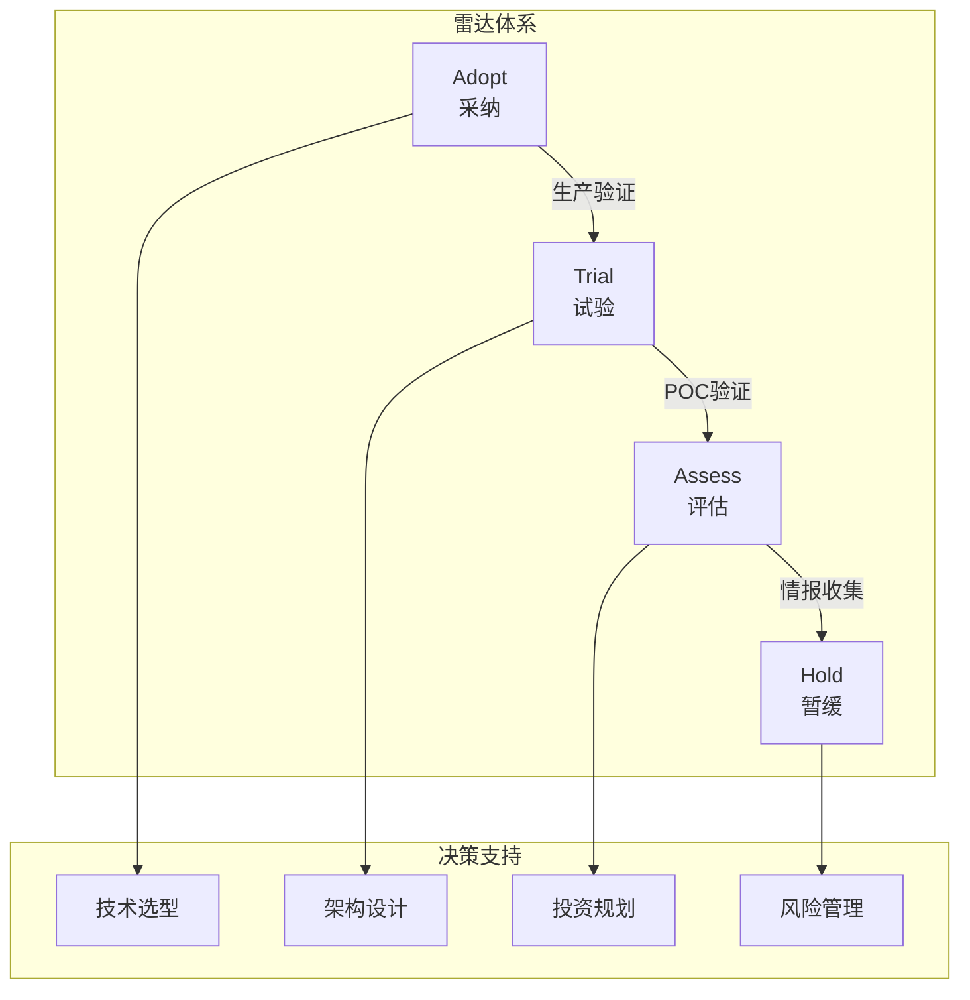
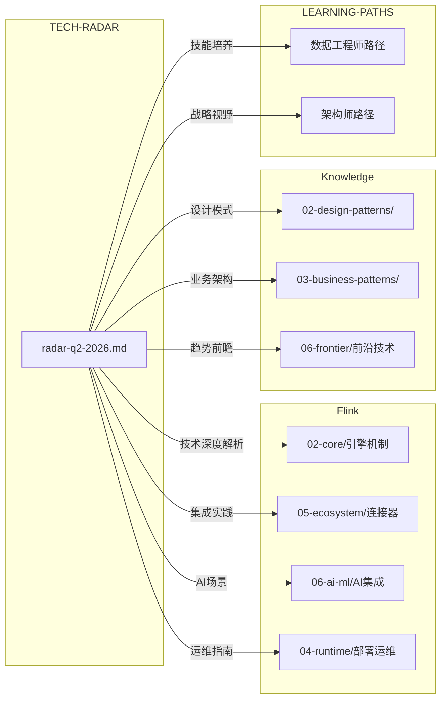

> **状态**: 生产内容 | **风险等级**: 中 | **最后更新**: 2026-04-30
>
# 流计算技术雷达体系 (Streaming Technology Radar)

> 所属阶段: Knowledge | 前置依赖: [Flink生态](../Flink/00-INDEX.md), [技术全景](../Knowledge/01-concept-atlas/data-streaming-landscape-2026-complete.md) | 形式化等级: L3

## 1. 概述

AnalysisDataFlow 技术雷达是一个面向流计算领域的**系统化技术评估与战略决策支持体系**，基于 ThoughtWorks Technology Radar 的四环模型，结合本项目 1,600+ 文档的知识积累，为技术选型提供权威、可追溯、可执行的参考框架。

### 1.1 核心理念



**关键原则：**

- **行动导向**：每个环位直接对应明确的行动建议，避免纯学术讨论
- **季度节奏**：以季度为周期更新，平衡时效性与稳定性
- **证据驱动**：环位变更需有生产数据、POC 报告或社区动态支撑
- **可追溯性**：完整记录技术的历史轨迹，支持决策回溯

### 1.2 四环定义

| 环位 | 中文 | 含义 | 行动建议 |
|------|------|------|----------|
| **Adopt** | 采纳 | 生产就绪、广泛验证 | **优先采用**，纳入标准技术栈 |
| **Trial** | 试验 | 有前景、值得试点 | **非核心场景试点**，收集反馈 |
| **Assess** | 评估 | 新兴技术、潜在价值 | **投入研究**，POC 验证 |
| **Hold** | 暂缓 | 技术债务、替代方案更优 | **新项目避免**，已有系统规划迁移 |

## 2. 模块结构

```
TECH-RADAR/
├── radar-q2-2026.md               ← 当前季度雷达（核心交付物）
├── methodology.md                  ← 评估方法论与评审流程
├── quarterly-review-template.md    ← 季度评审模板
├── evolution-timeline.md           ← 技术演进历史
├── decision-tree.md                ← 选型决策树
├── migration-recommendations.md    ← 迁移路径指南
├── risk-assessment.md              ← 风险评估框架
└── visuals/                        ← 可视化资源
```

## 3. 当前版本 (Q2 2026)

### 3.1 版本概览

| 属性 | 内容 |
|------|------|
| **版本号** | v2026.2-Q2 |
| **发布日期** | 2026-04-30 |
| **技术总数** | 29 项 |
| **覆盖类别** | 7 大维度（Streaming Engines / Storage / AI/ML / Protocols / Observability / Security / Architecture） |
| **评审方式** | 技术委员会投票（≥ 2/3 赞成） |

### 3.2 快速参考卡

```
┌─────────────────────────────────────────────────────────────────┐
│              流计算技术雷达 Q2 2026 速查卡                       │
├─────────────────────────────────────────────────────────────────┤
│  【ADOPT — 直接用】                                              │
│  • 引擎: Flink 2.x, Kafka 3.7+, Flink SQL                      │
│  • 存储: Paimon, Iceberg, PostgreSQL 16                        │
│  • 架构: K8s + Flink Operator                                   │
│  • 观测: Prometheus + Grafana                                   │
├─────────────────────────────────────────────────────────────────┤
│  【TRIAL — 试点用】                                              │
│  • 引擎: RisingWave 2.0+                                        │
│  • 存储: Delta Lake 3.2+, Fluss                                 │
│  • AI/ML: LLM Agents (FLIP-531), 实时 RAG                       │
│  • 观测: eBPF, OpenTelemetry Collector                          │
│  • 架构: Serverless Streaming                                   │
├─────────────────────────────────────────────────────────────────┤
│  【ASSESS — 研究看】                                             │
│  • 协议: MCP, A2A, CloudEvents                                  │
│  • AI/ML: 实时 Feature Store                                    │
│  • 安全: TEE, 差分隐私                                          │
│  • 架构: Data Mesh 流域, Lakehouse Federation                   │
├─────────────────────────────────────────────────────────────────┤
│  【HOLD — 避免用】                                               │
│  • 引擎: Apache Storm, Apache Samza                             │
│  • 存储: HDFS (新项目), ES 7.x                                  │
│  • 架构: YARN                                                   │
└─────────────────────────────────────────────────────────────────┘
```

### 3.3 阅读入口

| 读者目标 | 推荐阅读 |
|----------|----------|
| 了解当前技术推荐 | → [radar-q2-2026.md](./radar-q2-2026.md) |
| 理解评估逻辑 | → [methodology.md](./methodology.md) |
| 选择具体技术 | → [decision-tree.md](./decision-tree.md) |
| 规划迁移路径 | → [migration-recommendations.md](./migration-recommendations.md) |
| 评估技术风险 | → [risk-assessment.md](./risk-assessment.md) |
| 跟踪技术趋势 | → [evolution-timeline.md](./evolution-timeline.md) |

## 4. 与其他模块的关系



## 5. 使用协议

### 5.1 雷达的适用范围

✅ **适用：**

- 新项目技术选型参考
- 现有系统技术债务评估
- 团队技能培养方向规划
- 采购/预算申请的技术依据

⚠️ **注意：**

- 雷达反映的是**一般性推荐**，具体场景需结合 [decision-tree.md](./decision-tree.md) 细化分析
- Assess 环技术存在较高不确定性，投资前需完成内部 POC
- Hold 环技术的迁移优先级需结合业务影响评估

### 5.2 定制化使用

各组织可基于本方法论创建自己的雷达：

1. 复制 [methodology.md](./methodology.md) 的评估框架
2. 根据团队技能栈调整"团队能力匹配"维度权重
3. 根据业务领域增删技术类别
4. 使用 [quarterly-review-template.md](./quarterly-review-template.md) 建立评审节奏

## 6. 版本与更新

### 6.1 发布节奏

- **季度基线**：每季度末发布正式版本（3月/6月/9月/12月）
- **月度跟踪**：Assess 环技术每月进展检查
- **即时更新**：重大安全漏洞或 EOL 通知时发布紧急补丁

### 6.2 历史版本

| 版本 | 日期 | 说明 |
|------|------|------|
| v2026.2-Q2 | 2026-04-30 | 首次系统化季度雷达，29 项技术，[radar-q2-2026.md](./radar-q2-2026.md) |
| v2026.1 | 2026-02-15 | 月度更新版本 |
| v2025.4 | 2025-12-15 | 年度收官版本 |

完整版本历史见 [evolution-timeline.md](./evolution-timeline.md) 和 [00-INDEX.md](./00-INDEX.md)。

## 7. 贡献指南

### 7.1 如何提交建议

1. **阅读当前雷达**：确认技术尚未被覆盖或环位需要更新
2. **准备评估材料**：按 [methodology.md](./methodology.md) 的五维度评分法准备评分
3. **提交提案**：参照 [quarterly-review-template.md](./quarterly-review-template.md) 格式
4. **参与评审**：技术委员会每季度公开征集评审意见

### 7.2 质量门禁

所有雷达更新必须通过：

- ✅ 五维度评分完整性检查
- ✅ 相关文档链接有效性检查
- ✅ 委员会投票通过（≥ 2/3）
- ✅ 版本历史同步更新

## 8. 引用参考


---

*最后更新: 2026-04-30 | 当前版本: v2026.2-Q2 | 维护者: AnalysisDataFlow 技术委员会*
