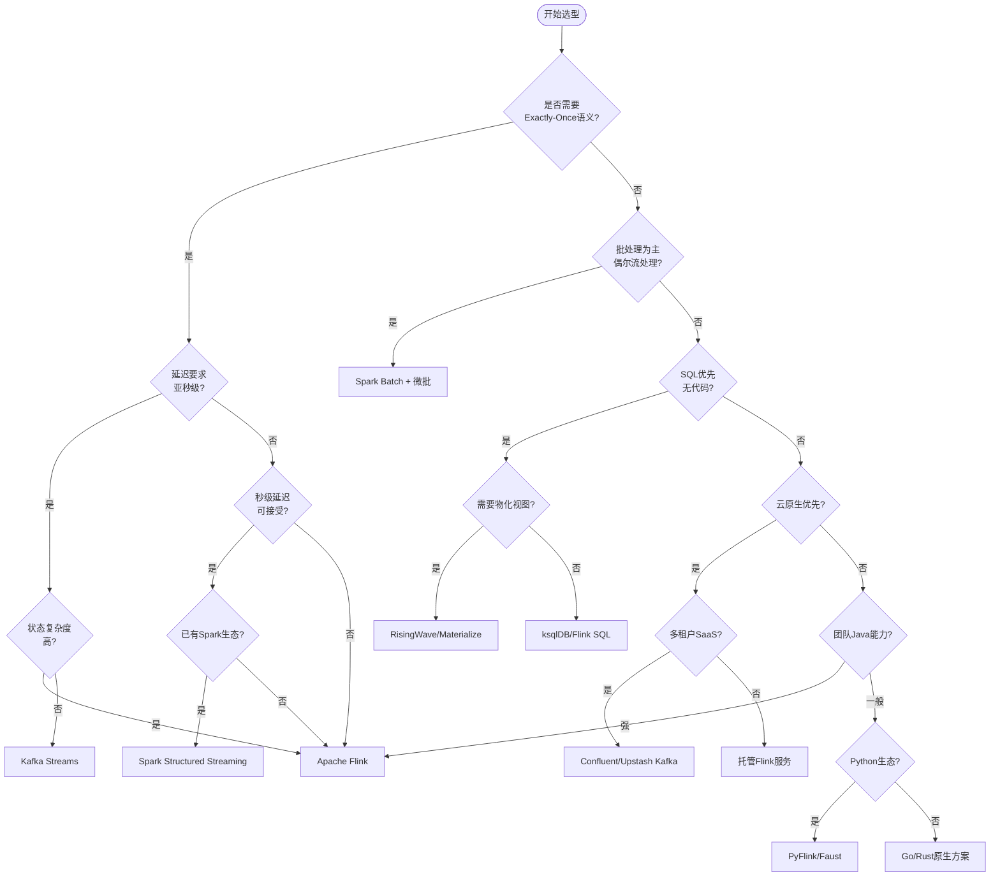
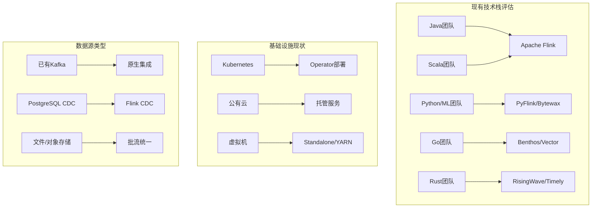
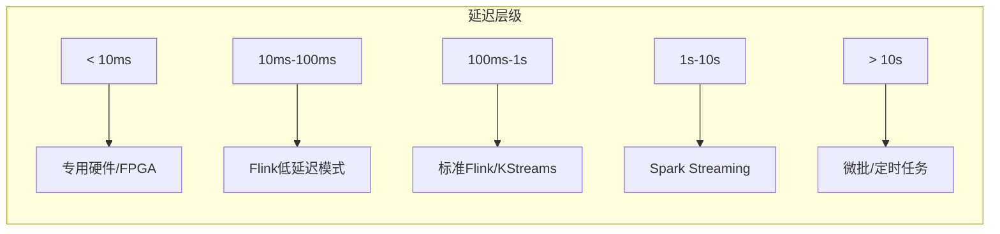
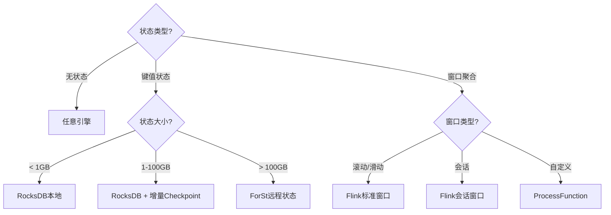

# 流计算技术选型决策树

> 所属阶段: Knowledge | 前置依赖: [技术雷达](./README.md) | 形式化等级: L3

## 1. 概述

本决策树帮助技术团队在面对流计算技术选型时，系统化地评估各种因素，做出最适合业务场景的决策。

## 2. 核心决策流程



## 3. 场景化决策矩阵

### 3.1 实时数据处理场景

| 场景特征 | 推荐技术 | 备选方案 | 关键考量 |
|----------|----------|----------|----------|
| **金融风控** (毫秒级延迟) | Apache Flink | Redpanda + Flink | 状态一致性、Checkpoint |
| **电商实时推荐** | Flink + Redis | RisingWave | 特征实时性、低延迟 |
| **IoT设备监控** | Flink/Mqtt | Kafka Streams | 高吞吐、乱序处理 |
| **日志分析** | Flink + ES | ClickHouse | 海量数据、Schema灵活 |
| **CDC数据同步** | Flink CDC | Debezium + Kafka | 多源支持、Schema变更 |

### 3.2 技术栈匹配



## 4. 详细决策路径

### 4.1 延迟需求决策



**决策要点:**

| 延迟要求 | 技术选择 | 配置重点 |
|----------|----------|----------|
| < 50ms | Flink + RocksDB本地状态 | 禁用远程状态、优化序列化 |
| 50-200ms | Flink标准配置 | 调整Checkpoint间隔 |
| 200ms-1s | Flink/Kafka Streams | 平衡延迟与吞吐量 |
| > 1s | Spark/Flink均可 | 优先考虑开发效率 |

### 4.2 状态管理决策



### 4.3 一致性级别决策

| 一致性要求 | 推荐方案 | 实现方式 |
|------------|----------|----------|
| **Exactly-Once** | Flink Checkpoint + 幂等Sink | 两阶段提交 |
| **At-Least-Once** | Kafka + 去重 | 幂等生产者 |
| **最终一致** | 异步Sink + 补偿 | 最大努力交付 |

## 5. 技术对比矩阵

### 5.1 流处理引擎对比

| 维度 | Apache Flink | Kafka Streams | Spark Streaming | RisingWave |
|------|-------------|---------------|-----------------|------------|
| **延迟** | 毫秒级 | 毫秒级 | 秒级 | 毫秒级 |
| **语义** | Exactly-Once | Exactly-Once | Exactly-Once | Exactly-Once |
| **状态管理** | ★★★★★ | ★★★☆☆ | ★★★★☆ | ★★★★★ |
| **SQL支持** | ★★★★☆ | ★★☆☆☆ | ★★★★☆ | ★★★★★ |
| **生态集成** | ★★★★★ | ★★★★☆ | ★★★★★ | ★★★☆☆ |
| **学习曲线** | 中等 | 低 | 低 | 低 |
| **云原生** | ★★★★★ | ★★★☆☆ | ★★★★☆ | ★★★★★ |

### 5.2 存储方案对比

| 场景 | 推荐存储 | 优势 | 劣势 |
|------|----------|------|------|
| 实时状态 | RocksDB | 低延迟、嵌入式 | 内存限制 |
| 大状态 | ForSt/S3 | 无限扩展 | 网络延迟 |
| 湖仓一体 | Paimon/Iceberg | 批流统一 | 成熟度 |
| 消息队列 | Kafka | 高吞吐、持久化 | 运维成本 |
| 向量存储 | PGVector/Milvus | AI集成 | 专用场景 |

## 6. 成本效益分析

### 6.1 TCO估算模型

```
总拥有成本(TCO) = 开发成本 + 基础设施成本 + 运维成本 + 机会成本

其中:
- 开发成本 = 学习曲线 × 人天 × 人力成本
- 基础设施成本 = 计算资源 + 存储资源 + 网络流量
- 运维成本 = 监控 + 告警 + 故障处理 + 版本升级
- 机会成本 = 技术债务 + 迁移风险
```

### 6.2 规模适配建议

| 数据规模 | 推荐架构 | 预估成本 |
|----------|----------|----------|
| < 1K TPS | 单机/嵌入式 | $500-2000/月 |
| 1K-10K TPS | 小型集群 | $2000-8000/月 |
| 10K-100K TPS | 中型集群 | $8000-30000/月 |
| > 100K TPS | 大型集群/云原生 | $30000+/月 |

## 7. 风险评估矩阵

| 风险类型 | 低风险 | 中风险 | 高风险 |
|----------|--------|--------|--------|
| **技术成熟度** | Kafka, Flink 2.0 | RisingWave, Paimon | Wasm UDF, AI Agent |
| **社区支持** | Apache顶级项目 | 活跃商业项目 | 新兴小众项目 |
| **人才获取** | Java/Flink | Python/Go | Rust/Scala |
| **供应商锁定** | 开源方案 | 云托管服务 | 专有SaaS |

## 8. 迁移决策检查清单

### 8.1 从批处理迁移到流处理

- [ ] 业务场景是否需要实时洞察？
- [ ] 现有ETL是否可以增量执行？
- [ ] 数据源是否支持CDC？
- [ ] 团队是否具备流处理经验？
- [ ] 基础设施是否支持持续运行？

### 8.2 引擎迁移评估

- [ ] 现有作业的SQL/DataStream代码量
- [ ] 自定义Connector/Format数量
- [ ] 状态数据大小与迁移策略
- [ ] 生产环境的SLA要求
- [ ] 回滚方案是否就绪

## 9. 决策支持工具

### 9.1 交互式决策助手

访问 [decision-helper.html](./visuals/decision-helper.html) 使用交互式决策工具。

### 9.2 快速决策参考卡

```
┌─────────────────────────────────────────────────────────┐
│              流计算技术选型速查卡                         │
├─────────────────────────────────────────────────────────┤
│  低延迟(<100ms)    →  Apache Flink                      │
│  高吞吐(>100K TPS) →  Apache Flink + Kafka              │
│  SQL优先           →  Flink SQL / RisingWave            │
│  云原生            →  托管Flink / Confluent             │
│  Python生态        →  PyFlink / Bytewax                 │
│  无状态简单转换    →  Kafka Streams / Benthos           │
│  AI/ML集成         →  Flink + 模型服务                  │
│  成本敏感          →  开源方案 + K8s自托管              │
└─────────────────────────────────────────────────────────┘
```

## 10. 引用参考


---

*最后更新: 2026-04-04*
