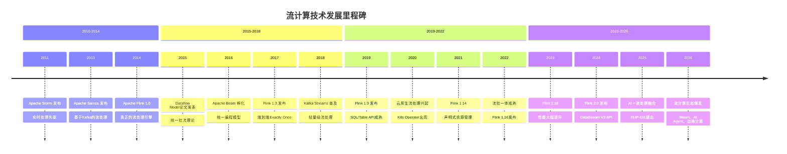
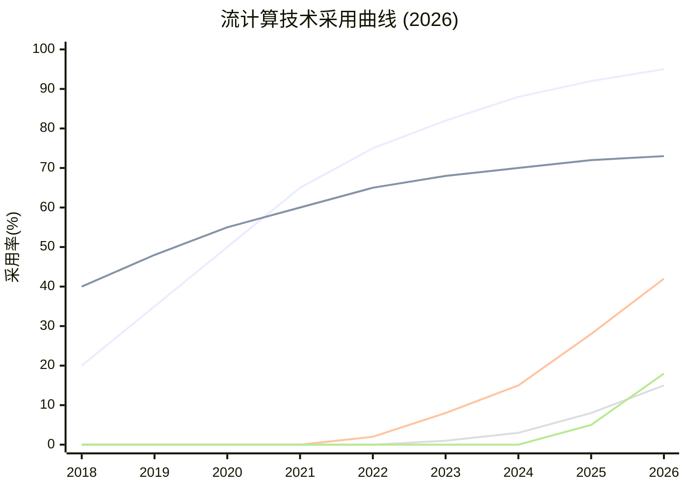
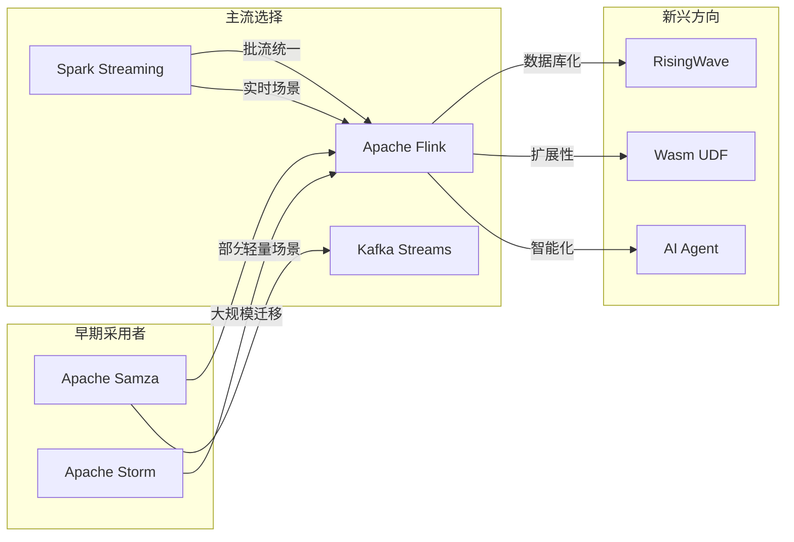
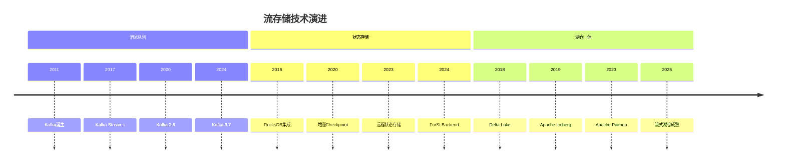
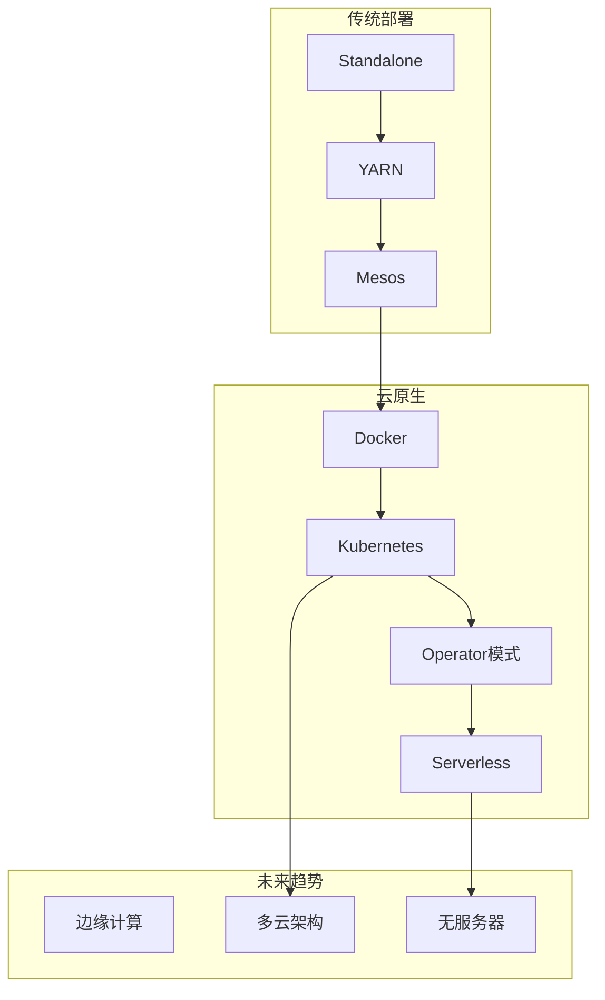
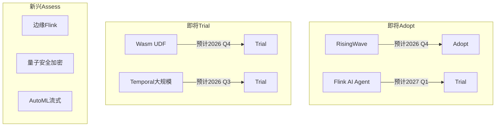
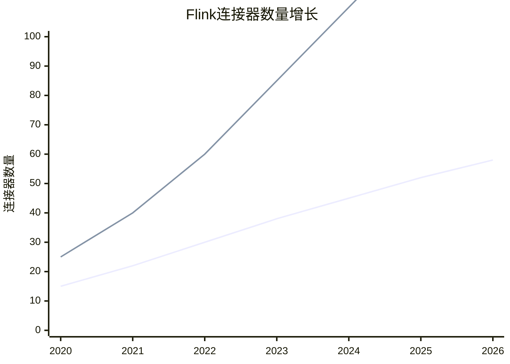
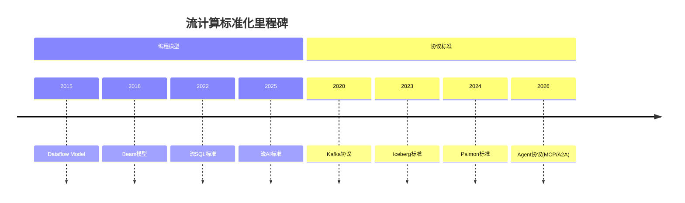
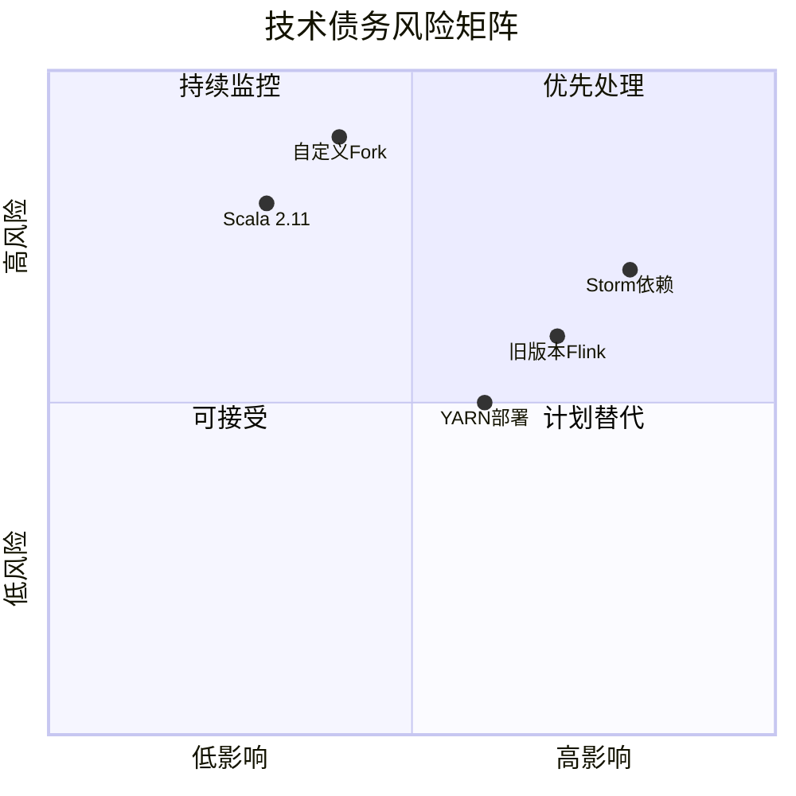
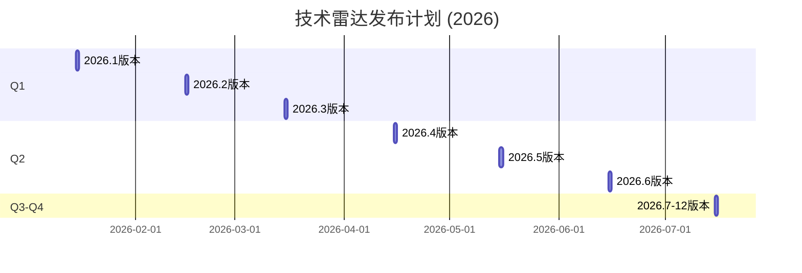

# 流计算技术演进时间线

> 所属阶段: Knowledge | 前置依赖: [技术雷达](./README.md) | 形式化等级: L3

## 1. 技术演进全景

### 1.1 流计算发展历程

## 2. 技术趋势分析

### 2.1 技术采用曲线

### 2.2 技术迁移流向

## 3. 详细版本演进

### 3.1 Apache Flink 演进

| 版本 | 发布日期 | 核心特性 | 影响评估 |
|------|----------|----------|----------|
| **1.0** | 2016-03 | 首个稳定版 | 奠定基础 |
| **1.3** | 2017-06 | 端到端Exactly-Once | 生产就绪 |
| **1.9** | 2019-08 | SQL/Table API重构 | 降低门槛 |
| **1.14** | 2021-12 | 声明式资源管理 | 云原生 |
| **1.18** | 2023-10 | 性能优化 | 成熟稳定 |
| **2.0** | 2024-08 | DataStream V2 | 新里程碑 |
| **2.1** | 2025-04 | Async State | 状态管理革新 |
| **2.2** | 2025-12 | ML Integration | AI融合 |

### 3.2 存储技术演进

### 3.3 部署架构演进

## 4. 雷达版本历史

### 4.1 技术位置变化追踪

| 技术 | 2024 Q4 | 2025 Q2 | 2025 Q4 | 2026 Q2 | 趋势 |
|------|---------|---------|---------|---------|------|
| **Flink 2.0** | Trial | Adopt | Adopt | Adopt | → |
| **RisingWave** | Assess | Trial | Trial | Trial | → |
| **Wasm UDF** | - | Assess | Assess | Assess | → |
| **Paimon** | Trial | Trial | Adopt | Adopt | ↑ |
| **Delta Lake** | Assess | Trial | Trial | Trial | → |
| **Serverless** | Assess | Trial | Trial | Trial | → |
| **Temporal** | Assess | Assess | Trial | Trial | ↑ |
| **Flink CDC** | Trial | Trial | Trial | Trial | → |
| **YARN** | Hold | Hold | Hold | Hold | → |
| **Storm** | Hold | Hold | Hold | Hold | → |

### 4.2 新进入技术

| 技术 | 进入时间 | 初始象限 | 进入原因 |
|------|----------|----------|----------|
| AI Agent | 规划中（以官方为准） | Assess | FLIP-531提出 |
| MCP Protocol | 规划中（以官方为准） | Assess | AI生态发展 |
| A2A Protocol | 规划中（以官方为准） | Assess | Agent通信标准 |
| ForSt Backend | 规划中（以官方为准） | Trial | Flink 2.0特性 |
| GPU Inference | 2025 Q2 | Trial | AI需求增长 |

### 4.3 退出技术

| 技术 | 退出时间 | 最终象限 | 退出原因 |
|------|----------|----------|----------|
| Flink Scala 2.11 | 2025 Q4 | Hold | 官方弃用 |
| Akka Classic | 2025 Q2 | Hold | Pekko迁移 |
| Flink 1.12 | 2025 Q1 | Hold | EOL |

## 5. 未来技术预测

### 5.1 2026-2027 技术展望

### 5.2 技术融合趋势

| 融合方向 | 当前状态 | 预期成熟 | 关键技术 |
|----------|----------|----------|----------|
| **流处理 + AI** | 早期 | 2027 | FLIP-531, 向量搜索 |
| **流处理 + 边缘** | 试验 | 2026 | 边缘Flink, 5G MEC |
| **流处理 + Web3** | 概念 | 2028 | 区块链流处理 |
| **流处理 + 机密计算** | 试点 | 2027 | TEE, 同态加密 |

## 6. 生态系统演进

### 6.1 连接器生态增长

### 6.2 云服务演进

| 云厂商 | 2024 | 2025 | 2026 | 趋势 |
|--------|------|------|------|------|
| **AWS** | EMR Flink | Managed Flink | Serverless Flink | 全托管 |
| **Azure** | HDInsight | Flink Cluster | Real-time Analytics | 集成化 |
| **GCP** | Dataproc | Flink on GKE | Streaming Analytics | 云原生 |
| **阿里云** | Blink | Ververica | 实时计算Flink版 | 企业级 |
| **Confluent** | ksqlDB | Flink SQL | Full Flink | 扩展 |

## 7. 社区与标准演进

### 7.1 标准化进程

### 7.2 开源贡献趋势

| 项目 | 2024贡献者 | 2025贡献者 | 2026贡献者 | 增长率 |
|------|-----------|-----------|-----------|--------|
| Apache Flink | 850 | 920 | 1050 | +23% |
| Apache Kafka | 720 | 780 | 850 | +18% |
| RisingWave | 45 | 120 | 210 | +367% |
| Apache Paimon | 80 | 150 | 220 | +175% |

## 8. 技术债务演化

### 8.1 Hold层技术退出计划

| 技术 | 当前状态 | 计划EOL | 建议替代 | 迁移窗口 |
|------|----------|---------|----------|----------|
| **Apache Storm** | 维护模式 | 2027 | Flink | 18个月 |
| **YARN** | 维护中 | 2028 | Kubernetes | 24个月 |
| **HDFS** | 稳定 | 2030 | 对象存储 | 48个月 |
| **Flink 1.18** | 稳定 | 2026 | Flink 2.x | 12个月 |

### 8.2 技术债务风险评估

## 9. 雷达更新机制

### 9.1 更新频率

| 评估象限 | 审查频率 | 触发条件 |
|----------|----------|----------|
| **Adopt** | 每季度 | 重大版本发布 |
| **Trial** | 每月 | 里程碑进展 |
| **Assess** | 每两周 | POC结果 |
| **Hold** | 按需 | 替代方案成熟 |

### 9.2 版本发布节奏

## 10. 历史重大变更记录

### 10.1 2026年重大变更

| 日期 | 变更类型 | 技术 | 从 | 到 | 原因 |
|------|----------|------|-----|-----|------|
| 2026-04 | 升级 | Flink 2.x | Trial | Adopt | 生产验证完成 |
| 2026-03 | 新增 | AI Agent | - | Assess | FLIP-531发布 |
| 2026-03 | 新增 | MCP Protocol | - | Assess | 标准提出 |
| 2026-02 | 升级 | RisingWave | Assess | Trial | 2.0发布 |
| 2026-02 | 升级 | Paimon | Trial | Adopt | 生态成熟 |
| 2026-01 | 新增 | A2A Protocol | - | Assess | Google发布 |

### 10.2 2025年重大变更回顾

| 日期 | 变更类型 | 技术 | 从 | 到 | 原因 |
|------|----------|------|-----|-----|------|
| 2025-12 | 新增 | Wasm UDF | - | Assess | WASI 0.3发布 |
| 2025-10 | 升级 | Delta Lake | Assess | Trial | 3.0发布 |
| 2025-08 | 升级 | Temporal | Assess | Trial | 生产案例 |
| 2025-06 | 升级 | ForSt | Assess | Trial | Flink 2.0集成 |
| 2025-04 | 新增 | GPU Inference | - | Trial | AI需求 |

## 11. 引用参考

---

*最后更新: 2026-04-04 | 下一版本: 2026.3 (2026-05-15)*
