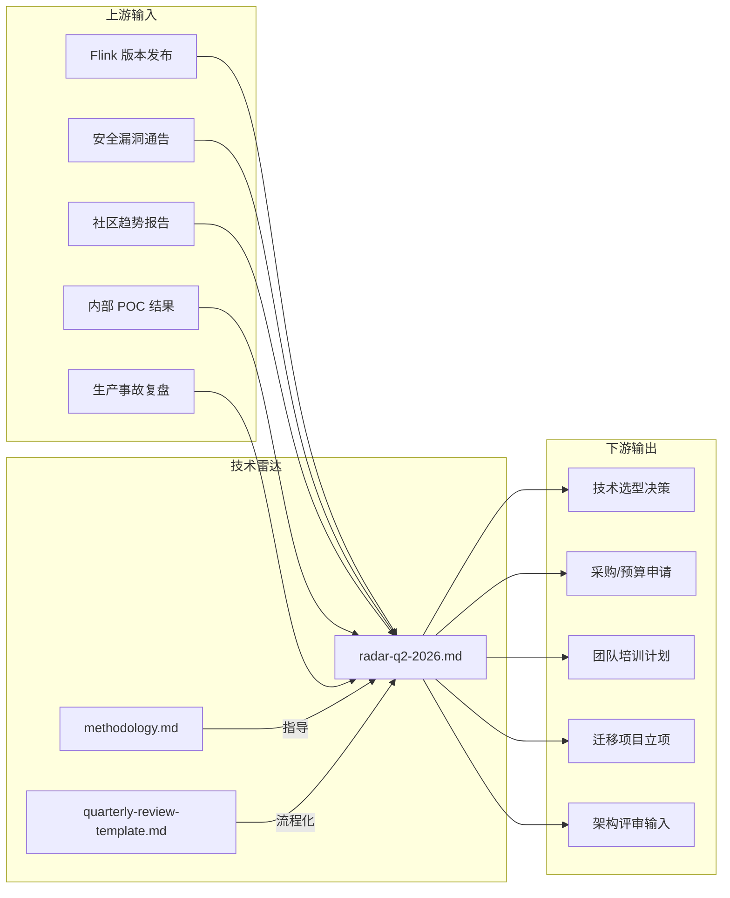
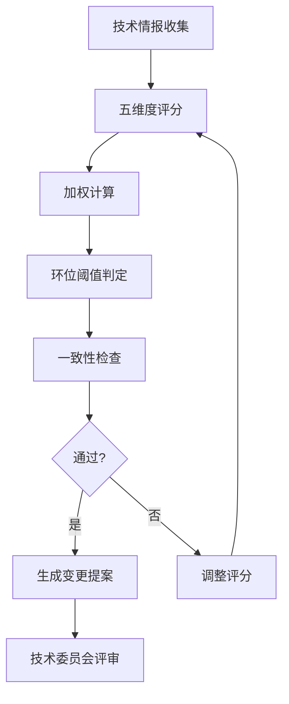
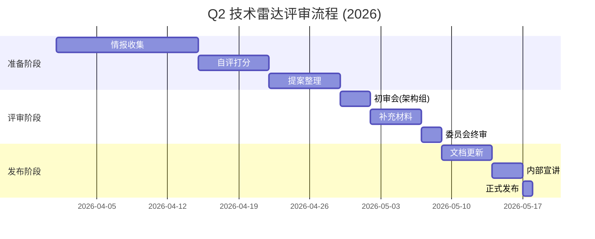
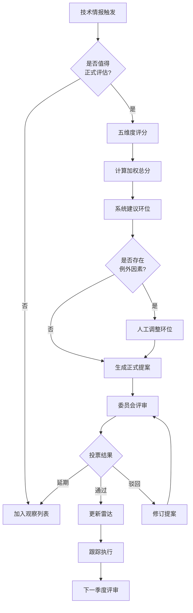
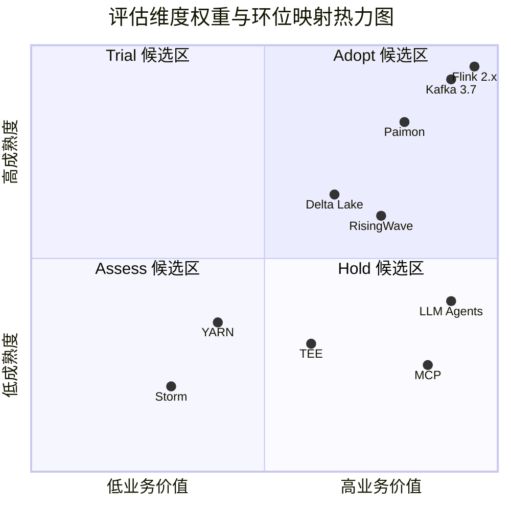

> **状态**: 生产内容 | **风险等级**: 中 | **最后更新**: 2026-04-30
>
# 技术雷达评估方法论

> 所属阶段: Knowledge | 前置依赖: [radar-q2-2026.md](./radar-q2-2026.md) | 形式化等级: L3

## 1. 概念定义 (Definitions)

### Def-TR-M-01: 技术评估框架 (Technology Assessment Framework)

技术评估框架是一套系统化、可重复的决策支持体系，用于对特定领域内的技术进行分级分类。本框架以 ThoughtWorks Technology Radar 的四环模型为基础，针对流计算领域进行领域化适配。

**形式化表达：**

设技术空间为 `T`，评估维度集合为 `D = {d₁, d₂, ..., dₙ}`，环位集合为 `R = {Adopt, Trial, Assess, Hold}`，则评估函数 `f: T × D → R` 将每项技术映射到唯一环位。

### Def-TR-M-02: 环位迁移 (Ring Transition)

技术从一个环位移动到另一个环位的状态变更。迁移分为：

- **升级 (Promote)**：向更内侧环位移动（Assess → Trial → Adopt）
- **降级 (Demote)**：向更外侧环位移动（Adopt → Trial → Assess → Hold）
- **新进入 (New Entry)**：首次出现在雷达中
- **退出 (Exit)**：从雷达中移除（通常因 EOL 或被完全替代）

### Def-TR-M-03: 评估维度 (Evaluation Dimension)

评估技术的五个正交维度：

| 维度 | 符号 | 含义 | 权重 |
|------|------|------|------|
| 技术成熟度 | `M` | 版本稳定性、Bug 密度、API 兼容性承诺 | 25% |
| 生态集成度 | `E` | 与现有技术栈的集成深度与广度 | 20% |
| 团队能力匹配 | `C` | 内部人才储备、培训成本、运维能力 | 20% |
| 业务价值 | `B` | 对业务目标的直接贡献与 ROI | 20% |
| 风险可控性 | `R` | 安全风险、供应商锁定、迁移成本 | 15% |

### Def-TR-M-04: 技术委员会 (Technology Review Board)

负责雷达评审与决策的跨职能小组，由架构师、技术负责人、安全代表、运维代表组成。委员会采用投票制，技术迁移需获得 ≥ 2/3 赞成票。

### Def-TR-M-05: 基线版本 (Baseline Version)

雷达的季度快照版本。基线版本一经发布即冻结，后续变更通过补丁版本（如 v2026.2.1）或下一季度基线追踪。

## 2. 属性推导 (Properties)

### Prop-TR-M-01: 迁移单调性约束

在常规评审周期内，技术迁移应遵循逐步原则：

> 单次评审中，技术最多跨越一个环位。即：`|R_new - R_old| ≤ 1`

**例外情况：**

- 重大安全漏洞曝光：可跨环降级（Adopt → Hold）
- 项目 EOL 宣布：可直接退出
- 颠覆性技术突破：经委员会全票通过可跨环升级

### Prop-TR-M-02: 环位容量约束

雷达应保持合理的分布结构，避免某一环位过度膨胀：

| 环位 | 目标容量 | 最大容量 | 溢出策略 |
|------|----------|----------|----------|
| Adopt | 6-10 项 | 12 项 | 优先将成熟技术标记为"已采纳标准"并退出雷达 |
| Trial | 6-10 项 | 12 项 | 延迟低优先级技术进入，或加速评估 |
| Assess | 6-10 项 | 15 项 | 提高准入门槛，或建立"观察列表" |
| Hold | 3-6 项 | 8 项 | 加速迁移，或合并同类遗留技术 |

### Prop-TR-M-03: 评审可追溯性

每项环位变更必须记录：

- 变更提案人及日期
- 支撑证据（POC 报告、生产数据、社区动态）
- 委员会投票结果
- 预期下次评审时间

### Prop-TR-M-04: 风险-环位对应关系

在统计意义上，环位与风险等级存在负相关：`Risk(Adopt) < Risk(Trial) < Risk(Assess)`。此关系用于快速风险初筛：Adopt 环技术默认可直接采用，Assess 环技术默认需要专项风险评估。

## 3. 关系建立 (Relations)

### 3.1 与项目知识体系的关联



### 3.2 与外部标准的关系

| 外部标准 | 关系类型 | 映射说明 |
|----------|----------|----------|
| ThoughtWorks Radar | 继承 | 四环模型、Blip 概念、可视化规范 |
| CNCF Trail Map | 参考 | 云原生技术的成熟度评估交叉验证 |
| Gartner Hype Cycle | 互补 | 技术炒作周期用于解释 Assess 环技术的高风险 |
| ThoughtWorks OSS Passport | 参考 | 开源项目的健康度评估指标 |

## 4. 论证过程 (Argumentation)

### 4.1 为什么选择 ThoughtWorks 四环模型

**对比其他技术评估模型：**

| 模型 | 优势 | 劣势 | 适用场景 |
|------|------|------|----------|
| **ThoughtWorks Radar** | 可视化直观、决策导向明确、行业认可度高 | 主观性强、缺乏量化标准 | 技术战略沟通、团队对齐 |
| **Gartner Hype Cycle** | 市场视角、预测性强 | 供应商导向、时间轴模糊 | 采购决策、预算规划 |
| **CNCF Trail Map** | 云原生聚焦、路径清晰 | 领域局限、忽略成熟度差异 | 云原生技术栈建设 |
| **Technology Readiness Level** | 量化程度高、工程导向 | 过于僵化、不适合快速迭代技术 | 航天/军工等严谨工程 |

**选择理由：**

1. **决策导向**：Radar 的环位直接对应行动建议（Adopt = 直接用，Hold = 别用）
2. **团队沟通**：可视化形式降低跨团队技术讨论的认知门槛
3. **演进追踪**：历史版本对比直观展示技术趋势
4. **行业对齐**：与业界广泛采用的标准保持一致，便于人才交流与外部咨询

### 4.2 五维度评分法的合理性

为什么不采用更简单的"成熟度 + 流行度"二维模型？

**论证：**

- **成熟度**单独无法解释：成熟但与现有栈不兼容的技术（如某些闭源方案）
- **流行度**单独无法解释：热门但团队无力运维的技术（如 Rust 原生方案在 Java 团队中）
- **五维度**覆盖：技术本身（M）、环境适配（E, C）、价值导向（B）、风险底线（R）

### 4.3 季度评审周期的设定依据

| 环位 | 建议评审周期 | 理由 |
|------|-------------|------|
| Adopt | 每季度回顾 | 验证长期稳定性，及时发现版本 EOL |
| Trial | 每月检查 | 快速收集试点反馈，加速或终止 |
| Assess | 每两周跟踪 | 技术迭代快，需密切跟踪 POC 进展 |
| Hold | 按需审查 | 仅当替代方案成熟或迁移完成时变更 |

## 5. 评估与迁移方法论 (The Methodology)

### 5.1 评分流程



#### 步骤 1: 五维度评分细则

**技术成熟度 (M) — 权重 25%**

| 分值 | 标准 |
|------|------|
| 5 | 主流版本稳定运行 ≥ 2 年，LTS 支持，大规模生产验证 |
| 4 | 稳定运行 ≥ 1 年，有明确发布周期，中等规模验证 |
| 3 | 1.0+ 版本，基本稳定，小规模生产案例 |
| 2 | Beta/RC 阶段，API 可能变动，仅测试环境 |
| 1 | Alpha/Preview，设计未冻结，实验性质 |

**生态集成度 (E) — 权重 20%**

| 分值 | 标准 |
|------|------|
| 5 | 与 Flink/Kafka/K8s 深度集成，官方维护 Connector |
| 4 | 有成熟社区 Connector，文档完善 |
| 3 | 需少量定制开发，有参考实现 |
| 2 | 需大量适配工作，仅概念验证 |
| 1 | 无集成路径，架构冲突 |

**团队能力匹配 (C) — 权重 20%**

| 分值 | 标准 |
|------|------|
| 5 | 团队已有生产运维经验，有内部专家 |
| 4 | 团队具备相关技能栈，需短期培训 |
| 3 | 需专项培训（1-3 个月），有学习资源 |
| 2 | 技能栈差异大，需长期培养或外部招聘 |
| 1 | 无相关技能储备，培养周期 > 6 个月 |

**业务价值 (B) — 权重 20%**

| 分值 | 标准 |
|------|------|
| 5 | 直接支撑核心业务指标，ROI 可量化 |
| 4 | 显著提升效率/降低成本，有明确受益方 |
| 3 | 解决特定痛点，价值可描述但难量化 |
| 2 | 锦上添花，非关键路径 |
| 1 | 价值不明确，或可被现有方案覆盖 |

**风险可控性 (R) — 权重 15%**

| 分值 | 标准 |
|------|------|
| 5 | 无已知重大风险，回滚方案成熟 |
| 4 | 风险可控，有标准缓解措施 |
| 3 | 存在已知限制，需额外监控 |
| 2 | 有潜在重大风险，需专项预案 |
| 1 | 风险不可控，或缺乏缓解手段 |

#### 步骤 2: 加权总分计算

```
Total = M × 0.25 + E × 0.20 + C × 0.20 + B × 0.20 + R × 0.15
```

#### 步骤 3: 环位阈值判定

| 总分范围 | 建议环位 | 行动建议 |
|----------|----------|----------|
| 4.0 - 5.0 | Adopt | 广泛采用，纳入标准技术栈 |
| 3.0 - 3.9 | Trial | 非核心场景试点，收集反馈 |
| 2.0 - 2.9 | Assess | 研究评估，POC 验证 |
| 1.0 - 1.9 | Hold / 不进入 | 暂缓或排除 |

**注意：** 总分仅为初筛，最终环位由委员会综合判断确定。存在"高分低环"（如总分 4.2 但团队能力不匹配）和"低分高环"（如总分 3.2 但战略价值极高）的例外。

### 5.2 环位迁移规则

#### 升级规则 (Promote)

| 从 → 到 | 最小停留时间 | 必要证据 |
|----------|-------------|----------|
| Assess → Trial | 2 个季度 | 完成 POC 报告，关键指标达标 |
| Trial → Adopt | 2 个季度 | 生产环境稳定运行 ≥ 3 个月，无 P1 事故 |

#### 降级规则 (Demote)

| 从 → 到 | 触发条件 | 决策时限 |
|----------|----------|----------|
| Adopt → Trial | 重大版本回退、核心维护者流失、安全架构缺陷 | 1 个月内决策 |
| Trial → Assess | 试点失败、关键 Bug 未修复 > 3 个月、替代方案成熟 | 2 周内决策 |
| Adopt/Trial/Assess → Hold | 官方 EOL、高危漏洞未修复 > 90 天、社区停滞 | 立即决策 |

### 5.3 评审会议流程

**季度评审会议（Q2 示例）**



**会议议程模板：**

1. **上一季度行动项回顾**（10 分钟）
2. **新进入技术提案**（每项 10 分钟，≤ 3 项）
3. **环位变更审议**（每项 5 分钟）
4. **退出技术确认**（5 分钟）
5. **下一季度重点跟踪清单**（10 分钟）

## 6. 实例验证 (Examples)

### 6.1 完整评分示例：RisingWave 2.0

| 维度 | 评分 | 理由 | 加权分 |
|------|------|------|--------|
| 技术成熟度 (M) | 3 | 2.0 版本发布 6 个月，有生产案例但大规模验证有限 | 0.75 |
| 生态集成度 (E) | 3 | Flink 连接器可用，JDBC/PSQL 协议兼容，生态在扩展 | 0.60 |
| 团队能力匹配 (C) | 3 | 需要 SQL 能力，团队有 PG/MySQL 经验可迁移 | 0.60 |
| 业务价值 (B) | 4 | 物化视图直接服务查询，显著简化实时看板架构 | 0.80 |
| 风险可控性 (R) | 3 | 商业公司主导，开源协议友好，但长期可持续性需观察 | 0.45 |
| **总分** | — | — | **3.20** |

**判定：** 总分 3.20，落在 Trial 区间。结合委员会判断（战略价值高、架构简化效果显著），确认环位为 **Trial**。

### 6.2 降级决策示例：HDFS

**背景：** HDFS 在 Q4 2025 处于 Trial 环，作为新数据湖的存储选项被评估。

**触发因素：**

- 阿里云 OSS、AWS S3 的对象存储成本在 2026 年进一步下降
- Paimon 0.9+ 对对象存储的适配已生产可用
- 内部 2 个新数据湖项目均选择 OSS 而非 HDFS

**评分变化：**

| 维度 | Q4 2025 | Q2 2026 | 变化原因 |
|------|---------|---------|----------|
| M | 4 | 4 | 无变化 |
| E | 3 | 2 | 新表格式优先对象存储 |
| C | 4 | 3 | Hadoop 人才减少 |
| B | 3 | 2 | 云原生架构降低价值 |
| R | 3 | 3 | 无变化 |
| **总分** | **3.40** | **2.85** | — |

**判定：** 总分降至 2.85，且业务价值和生态集成度均下降。委员会决议：HDFS 新项目中降级至 **Hold**，已有集群维持现状。

### 6.3 新进入技术评估示例：CloudEvents

**提案人：** 平台架构组
**提案日期：** 2026-04-15

**评估摘要：**

- **问题：** 内部 12 个系统的 Kafka Topic 使用各自的事件格式，集成成本高
- **提案：** 采用 CloudEvents 作为跨系统事件标准格式
- **POC 结果：** 在 2 个系统间试点，集成代码量减少 40%
- **评分：** M=3, E=3, C=4, B=4, R=3，总分 3.40
- **委员会决议：** 鉴于标准仍在推广期，先进入 **Assess**，要求 Q3 前完成 5 个系统的互通验证

## 7. 可视化 (Visualizations)

### 7.1 评估决策流程图



### 7.2 维度-环位映射热力图



## 8. 引用参考


---

*版本: v1.0 | 发布日期: 2026-04-30 | 维护者: AnalysisDataFlow 技术委员会*
