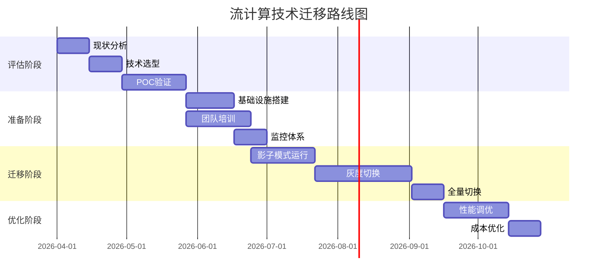
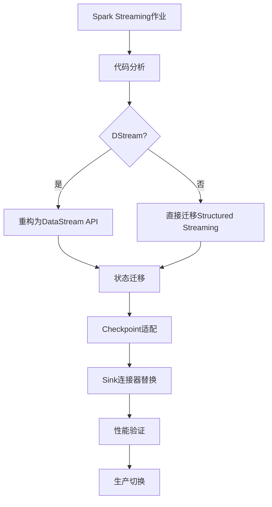
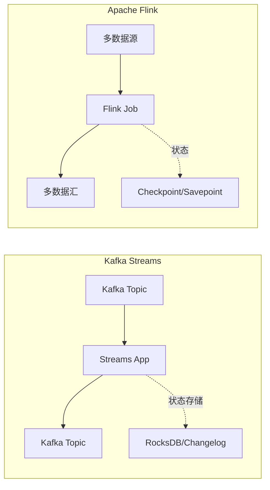
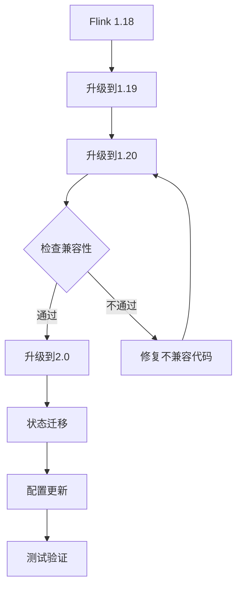
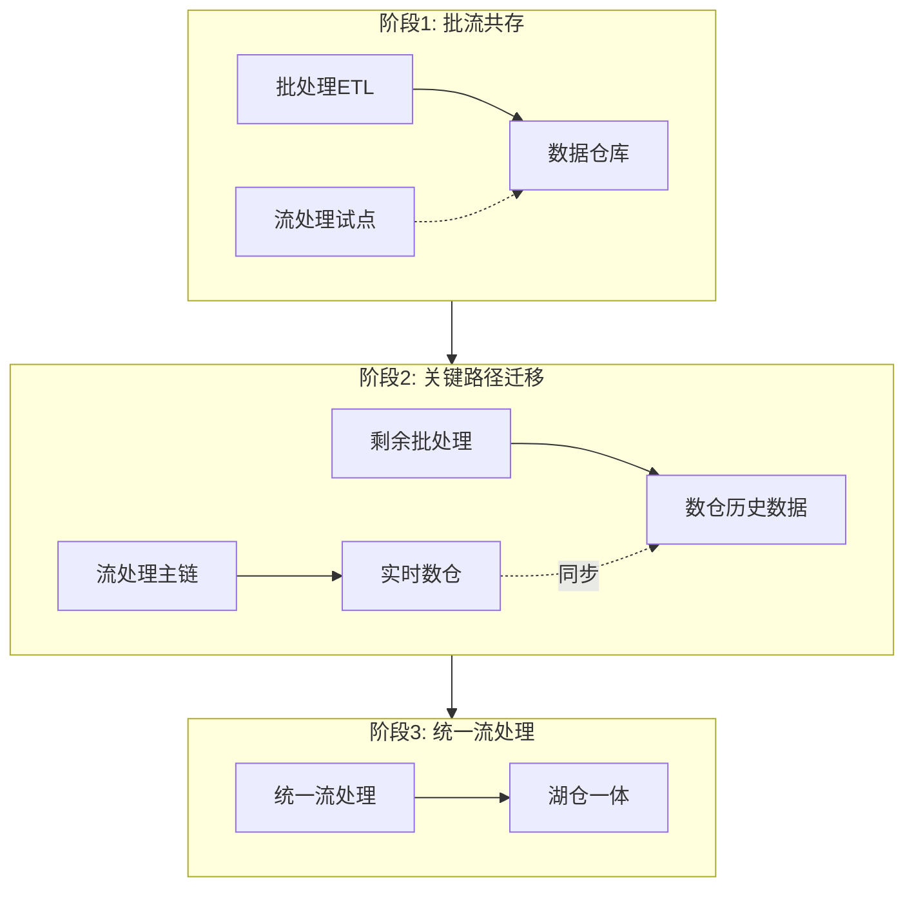
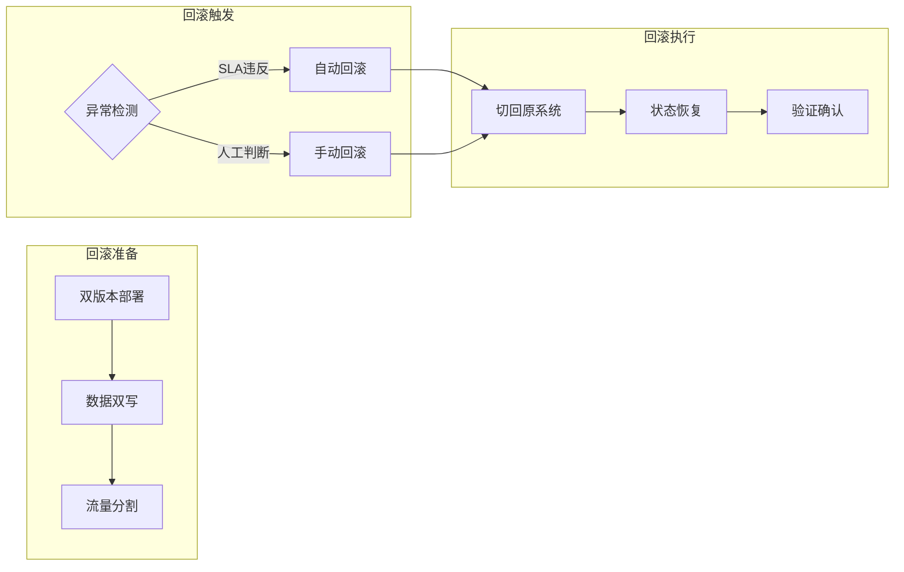

# 流计算技术迁移建议

> 所属阶段: Knowledge | 前置依赖: [技术雷达](./README.md), [决策树](./decision-tree.md) | 形式化等级: L3

## 1. 迁移策略总览

### 1.1 迁移路线图



### 1.2 迁移模式选择

| 模式 | 适用场景 | 风险等级 | 时间周期 |
|------|----------|----------|----------|
| **大爆炸** | 小型系统、停机可接受 | 高 | 1-2周 |
**金丝雀** | 关键业务、需验证 | 中 | 4-8周 |
| **蓝绿** | 高可用要求 | 低 | 6-12周 |
| **影子** | 复杂系统、需对比 | 低 | 8-16周 |
| **绞杀者** | 单体拆分 | 中 | 3-6月 |

## 2. 具体迁移路径

### 2.1 Spark Streaming → Apache Flink

**适用场景:**

- 需要更低延迟处理
- 复杂事件处理需求
- 精确一次语义要求

**迁移步骤:**



**代码映射示例:**

| Spark | Flink | 注意点 |
|-------|-------|--------|
| `DStream` | `DataStream` | 语义等价 |
| `updateStateByKey` | `KeyedProcessFunction` | 需手动状态管理 |
| `window()` | `window()` + `WindowFunction` | 时间语义差异 |
| `StreamingContext` | `StreamExecutionEnvironment` | 配置方式不同 |
| `KafkaUtils` | `FlinkKafkaConsumer` | 参数映射 |

**详细迁移指南:** [05.1-spark-streaming-to-flink-migration.md](../Knowledge/05-mapping-guides/migration-guides/05.1-spark-streaming-to-flink-migration.md)

### 2.2 Kafka Streams → Apache Flink

**适用场景:**

- 跨Kafka集群处理
- 复杂状态计算
- 多源数据融合

**关键差异:**



**迁移检查清单:**

- [ ] Kafka Consumer Group ID重新规划
- [ ] 状态存储从RocksDB → Flink State Backend
- [ ] 拓扑从KStream DSL → DataStream API
- [ ] 窗口语义对齐（Kafka vs Flink时间定义）
- [ ] Exactly-Once配置迁移

**详细迁移指南:** [05.2-kafka-streams-to-flink-migration.md](../Knowledge/05-mapping-guides/migration-guides/05.2-kafka-streams-to-flink-migration.md)

### 2.3 Storm → Apache Flink

**适用场景:**

- Storm项目维护困难
- 需要更好的状态管理
- 精确一次处理需求

**迁移要点:**

```java
// Storm Bolt
public class WordCountBolt extends BaseRichBolt {
    private Map<String, Integer> counts = new HashMap<>();

    @Override
    public void execute(Tuple tuple) {
        String word = tuple.getStringByField("word");
        counts.put(word, counts.getOrDefault(word, 0) + 1);
        collector.emit(new Values(word, counts.get(word)));
    }
}

// Flink 等效实现
DataStream<Tuple2<String, Integer>> wordCounts =
    words.keyBy(word -> word.f0)
         .process(new KeyedProcessFunction<String, String, Tuple2<String, Integer>>() {
             private ValueState<Integer> countState;

             @Override
             public void open(Configuration parameters) {
                 countState = getRuntimeContext()
                     .getState(new ValueStateDescriptor<>("count", Types.INT));
             }

             @Override
             public void processElement(String word, Context ctx,
                                       Collector<Tuple2<String, Integer>> out) throws Exception {
                 int current = countState.value() != null ? countState.value() : 0;
                 countState.update(current + 1);
                 out.collect(new Tuple2<>(word, current + 1));
             }
         });
```

**详细迁移指南:** [05.3-storm-to-flink-migration.md](../Knowledge/05-mapping-guides/migration-guides/05.3-storm-to-flink-migration.md)

### 2.4 Flink 1.x → Flink 2.x

**主要变化:**

- DataStream API V2
- 新的状态后端架构
- 移除Scala 2.11支持

**迁移路径:**



**关键变更点:**

| Flink 1.x | Flink 2.x | 迁移操作 |
|-----------|-----------|----------|
| `DataStreamSource` | `DataStreamSource` | API兼容 |
| `StateTtlConfig` | 新增`cleanupIncrementally` | 检查清理策略 |
| `RocksDBStateBackend` | `EmbeddedRocksDBStateBackend` | 类名变更 |
| `FsStateBackend` | `HashMapStateBackend` | 类名变更 |
| Scala 2.11 | 移除 | 升级到Scala 2.12/2.13 |

**详细迁移指南:** [05.4-flink-1x-to-2x-migration.md](../Knowledge/05-mapping-guides/migration-guides/05.4-flink-1x-to-2x-migration.md)

### 2.5 批处理 → 流处理架构迁移

**绞杀者模式实施:**



**详细迁移指南:** [05.5-batch-to-streaming-migration.md](../Knowledge/05-mapping-guides/migration-guides/05.5-batch-to-streaming-migration.md)

## 3. 状态迁移策略

### 3.1 Savepoint兼容性矩阵

| 源版本 | 目标版本 | 兼容性 | 操作 |
|--------|----------|--------|------|
| 1.18 | 1.19 | ✓ 完全兼容 | 直接恢复 |
| 1.18 | 2.0 | △ 部分兼容 | 检查变更 |
| 1.15 | 2.0 | ✗ 不兼容 | 重新消费 |

### 3.2 状态迁移工具链

```bash
# 1. 创建Savepoint
flink savepoint <jobId> <savepointPath>

# 2. 状态分析
flink-state-analyzer analyze <savepointPath> --output report.json

# 3. 状态转换（如有必要）
flink-state-migrate transform \
    --from <oldSavepoint> \
    --to <newSavepoint> \
    --mapping state-mapping.yaml

# 4. 验证
flink-state-analyzer verify <newSavepoint>
```

## 4. 风险缓解策略

### 4.1 回滚方案



### 4.2 数据一致性保证

| 场景 | 策略 | 工具 |
|------|------|------|
| 并行运行期 | 双写比对 | Apache Griffin |
| 切换时刻 | 断点续传 | Kafka Offset管理 |
| 异常恢复 | 幂等写入 | Sink幂等设计 |
| 长期校验 | 审计日志 | Flink CDC + 比对 |

## 5. 性能基线建立

### 5.1 迁移前基准测试

```yaml
# benchmark-config.yaml
baseline:
  throughput:
    target: 100000  # events/sec
    duration: 10min
  latency:
    p50: < 50ms
    p99: < 200ms
  resource:
    cpu: < 4 cores
    memory: < 8GB

workloads:
  - name: simple-map
    complexity: low
  - name: keyed-aggregation
    complexity: medium
  - name: window-join
    complexity: high
```

### 5.2 迁移后验证

```python
# 自动化验证脚本示例
class MigrationValidator:
    def validate_latency(self, baseline, current):
        """验证延迟指标"""
        assert current.p50 <= baseline.p50 * 1.1
        assert current.p99 <= baseline.p99 * 1.2

    def validate_throughput(self, baseline, current):
        """验证吞吐量"""
        assert current >= baseline * 0.95

    def validate_correctness(self, expected, actual):
        """验证结果正确性"""
        diff = compare_datasets(expected, actual)
        assert diff.error_rate < 0.001
```

## 6. 团队能力建设

### 6.1 培训计划

| 阶段 | 内容 | 时长 | 目标 |
|------|------|------|------|
| **基础** | Flink核心概念 | 2天 | 理解API和语义 |
| **进阶** | 状态管理与容错 | 2天 | 掌握高级特性 |
| **实战** | 项目实战演练 | 1周 | 独立开发能力 |
| **专家** | 源码与调优 | 持续 | 性能优化能力 |

### 6.2 知识转移检查清单

- [ ] 架构设计文档更新
- [ ] 运维手册编写
- [ ] 故障处理Playbook
- [ ] 代码Review指南
- [ ] 性能调优手册

## 7. 成本效益分析模板

### 7.1 ROI计算

```
迁移ROI = (收益 - 成本) / 成本 × 100%

收益组成:
- 延迟降低带来的业务价值
- 运维效率提升节省人力
- 资源利用率优化节省成本
- 故障减少避免的损失

成本组成:
- 迁移开发人力成本
- 双系统并行运行成本
- 培训与文档成本
- 风险准备金
```

### 7.2 迁移决策评分卡

| 维度 | 权重 | 评分(1-5) | 加权分 |
|------|------|-----------|--------|
| 技术必要性 | 25% | | |
| 业务价值 | 25% | | |
| 团队就绪度 | 20% | | |
| 资源可用性 | 15% | | |
| 风险可控性 | 15% | | |
| **总计** | 100% | | **/5** |

评分≥3.5: 建议迁移
评分2.5-3.5: 评估后决定
评分<2.5: 暂缓迁移

## 8. 引用参考


---

*最后更新: 2026-04-04*
