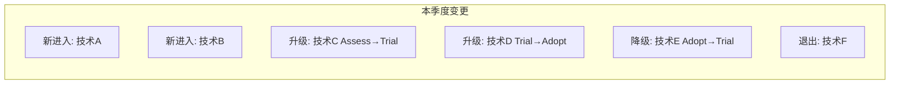

> **状态**: 模板文件 | **风险等级**: 低 | **最后更新**: 2026-04-30
>
> 本文档为季度技术雷达评审的标准模板。每次评审时复制本文件，按 `{年份}-Q{季度}-review.md` 命名。
>
# 技术雷达 Q{季度} {年份} 评审报告

> 所属阶段: Knowledge | 前置依赖: [methodology.md](./methodology.md), [上一季度雷达](./radar-q2-2026.md) | 形式化等级: L3

## 1. 评审元信息 (Review Metadata)

| 字段 | 内容 |
|------|------|
| **评审季度** | Q{季度} {年份} |
| **基线版本** | v{年份}.{季度} |
| **评审日期** | YYYY-MM-DD |
| **评审委员会** | （列出参会人员及角色） |
| **上一基线** | [v{上一版本}](./radar-{上一版本}.md) |

## 2. 变更概览 (Change Summary)

### 2.1 统计摘要

| 指标 | 上一季度 | 本季度 | 变化 |
|------|----------|--------|------|
| Adopt 数量 | X | Y | Δ |
| Trial 数量 | X | Y | Δ |
| Assess 数量 | X | Y | Δ |
| Hold 数量 | X | Y | Δ |
| **总计** | **X** | **Y** | **Δ** |

### 2.2 变更清单

#### 新进入 (New Entries)

| 序号 | 技术名称 | 类别 | 初始环位 | 提案人 | 核心理由 |
|------|----------|------|----------|--------|----------|
| 1 | （技术名） | （类别） | （环位） | （姓名） | （一句话理由） |
| 2 | | | | | |

#### 环位升级 (Promotions)

| 序号 | 技术名称 | 从 | 到 | 核心证据 | 评审结论 |
|------|----------|-----|-----|----------|----------|
| 1 | （技术名） | Assess | Trial | （POC报告/生产数据） | 通过 |
| 2 | | | | | |

#### 环位降级 (Demotions)

| 序号 | 技术名称 | 从 | 到 | 触发原因 | 评审结论 |
|------|----------|-----|-----|----------|----------|
| 1 | （技术名） | Adopt | Trial | （EOL/安全漏洞/替代方案） | 通过 |
| 2 | | | | | |

#### 退出雷达 (Exits)

| 序号 | 技术名称 | 最终环位 | 退出原因 | 后续安排 |
|------|----------|----------|----------|----------|
| 1 | （技术名） | Hold | EOL/完全替代 | 迁移完成 |
| 2 | | | | |

### 2.3 变更可视化

## 3. 逐技术评审记录 (Detailed Reviews)

### 3.1 新进入技术评审

#### {技术名称}

**提案信息：**

- 提案人：
- 提案日期：
- 关联需求/项目：

**五维度评分：**

| 维度 | 评分 | 评分理由 |
|------|------|----------|
| 技术成熟度 (M) | X/5 | |
| 生态集成度 (E) | X/5 | |
| 团队能力匹配 (C) | X/5 | |
| 业务价值 (B) | X/5 | |
| 风险可控性 (R) | X/5 | |
| **加权总分** | **X.XX** | |

**系统建议环位：** {Assess / Trial / Adopt / Hold}
**委员会决议环位：** {实际环位}
**决议理由：** （如果与系统建议不同，说明人工调整原因）

**行动项：**

- [ ] （具体跟踪任务）
- [ ] 负责人：（姓名） 截止日期：（日期）

### 3.2 升级技术评审

#### {技术名称}

**升级理由：**

- 上一环位停留时间：
- 生产验证证据：
- 关键指标达成情况：

**委员会决议：** 通过 / 延期 / 驳回
**延期条件（如适用）：** （需补充的证据或等待的条件）

### 3.3 降级技术评审

#### {技术名称}

**降级触发因素：**

- 因素 1：
- 因素 2：

**风险缓解措施：**

- （已采取或计划采取的措施）

**迁移计划（如适用）：**

- 目标替代方案：
- 预计完成时间：
- 负责人：

## 4. 风险重评估 (Risk Reassessment)

### 4.1 全局风险热力图

| 技术名称 | 上季度风险 | 本季度风险 | 变化 | 原因 |
|----------|-----------|-----------|------|------|
| | 低/中/高 | 低/中/高 | ↑/↓/→ | |

### 4.2 新增高风险项

| 技术 | 风险描述 | 缓解措施 | 负责人 | 跟踪频率 |
|------|----------|----------|--------|----------|
| | | | | |

### 4.3 风险降级项

| 技术 | 原风险 | 现风险 | 降级原因 |
|------|--------|--------|----------|
| | | | |

## 5. 决策与行动项 (Decisions & Action Items)

### 5.1 本季度关键决策

| 决策编号 | 决策内容 | 影响范围 | 生效日期 |
|----------|----------|----------|----------|
| D-001 | | | |

### 5.2 行动项跟踪

| 编号 | 行动项 | 负责人 | 优先级 | 截止日期 | 状态 |
|------|--------|--------|--------|----------|------|
| A-001 | | | P0/P1/P2 | | 待办/进行中/已完成 |

### 5.3 下一季度重点跟踪清单

| 技术名称 | 当前环位 | 预计动作 | 触发条件 | 提前准备 |
|----------|----------|----------|----------|----------|
| | | 升级/降级/退出 | | |

## 6. 附录 (Appendices)

### 附录 A: 评审会议记录

**会议时间：** YYYY-MM-DD HH:MM - HH:MM
**会议地点/链接：**
**参会人员：**
**缺席人员：**
**会议主持人：**
**记录人：**

**会议决议投票结果：**

| 提案 | 赞成 | 反对 | 弃权 | 结果 |
|------|------|------|------|------|
| | | | | |

### 附录 B: 支撑材料清单

| 材料名称 | 类型 | 链接 | 说明 |
|----------|------|------|------|
| | POC报告/生产数据/社区动态/安全通告 | | |

### 附录 C: 术语与缩写

| 缩写 | 全称 | 说明 |
|------|------|------|
| | | |

---

*本评审报告基于 [技术雷达评估方法论](./methodology.md) 编制。*
*版本: v{年份}.{季度} | 发布日期: YYYY-MM-DD | 下次评审: YYYY-MM-DD*
