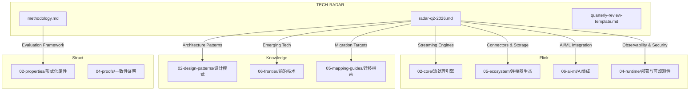
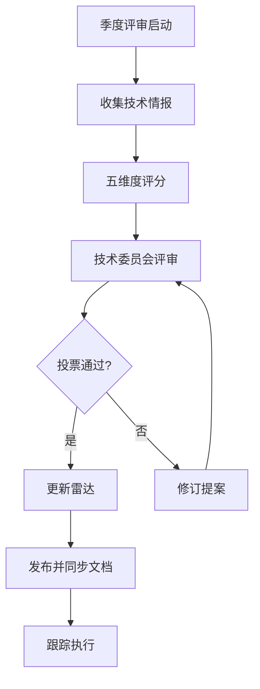
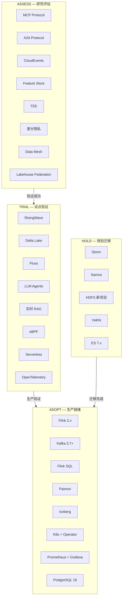

> **状态**: 生产内容 | **风险等级**: 中 | **最后更新**: 2026-04-30
>
> 此文档为 Q2 2026 技术雷达基线版本，经评审委员会审议通过。
>
# 流计算技术雷达 Q2 2026

> 所属阶段: Knowledge | 前置依赖: [技术雷达方法论](./methodology.md), [Flink生态](../Flink/00-INDEX.md) | 形式化等级: L3

## 1. 概念定义 (Definitions)

### Def-TR-Q2-01: 技术雷达 (Technology Radar)

技术雷达是一种系统化的技术评估与可视化工具，采用极坐标形式将技术点（Blip）分布于四个同心圆环（Ring）与多个象限（Quadrant）之中，用于指导组织在技术选型上的战略决策。

### Def-TR-Q2-02: 采纳环 (Adopt Ring)

生产就绪、社区成熟、团队具备运维能力的技术。进入此环的技术应被优先用于新项目，并逐步替换 Hold 环中的遗留技术。

**准入条件：**

- 主流版本稳定运行 ≥ 12 个月
- 生产环境案例 ≥ 10 个（含至少 1 个同规模案例）
- 社区活跃度：核心提交者 ≥ 5 人，近半年 commits ≥ 100
- 团队内部具备独立运维与故障排查能力

### Def-TR-Q2-03: 试验环 (Trial Ring)

有明确前景、值得在非核心业务场景进行生产试点的技术。进入此环的技术应已完成内部 POC 验证。

**准入条件：**

- 版本 ≥ 1.0（或同等成熟度标记）
- 具备基本生产级文档与社区支持
- 已完成内部 POC，关键指标（性能/稳定性/兼容性）达标
- 存在明确的成功案例（不限于同规模）

### Def-TR-Q2-04: 评估环 (Assess Ring)

新兴技术，具备潜在战略价值，值得投入资源进行研究与原型验证。

**准入条件：**

- 技术方向与项目战略一致
- 已有初步文档或论文支撑
- 社区或商业生态处于活跃发展期
- 未发现根本性设计缺陷

### Def-TR-Q2-05: 暂缓环 (Hold Ring)

存在更优替代方案、社区停滞、或已知重大缺陷的技术。新项目中应避免采用，已有系统应规划迁移。

**准入条件（满足任一）：**

- 官方宣布停止维护或进入维护模式
- 替代方案在功能/性能/生态上全面超越
- 存在未修复的高危安全漏洞（> 90 天）
- 团队运维成本显著高于替代方案

### Def-TR-Q2-06: 风险等级 (Risk Level)

| 等级 | 定义 | 量化标准 |
|------|------|----------|
| **低** | 可控风险，标准运维流程可覆盖 | 故障恢复时间 < 15min，数据丢失概率 < 0.001% |
| **中** | 需额外监控或预案 | 故障恢复时间 < 2h，存在已知限制但不影响核心 SLA |
| **高** | 需专项风险缓解计划 | 可能导致 SLA 违反、数据不一致或显著成本超支 |

## 2. 属性推导 (Properties)

### Prop-TR-Q2-01: 雷达覆盖完备性

Q2 2026 雷达覆盖流计算技术栈的 7 个核心维度，每个维度至少包含 3 个技术点，确保从技术引擎到基础设施的全栈可视性。

### Prop-TR-Q2-02: 时序有效性

雷达以季度为周期更新，技术点的环位（Ring Position）具有时间戳属性。历史轨迹通过 [evolution-timeline.md](./evolution-timeline.md) 追踪，确保决策可回溯。

### Prop-TR-Q2-03: 风险单调性

在统计意义上，Assess 环技术的平均风险等级高于 Trial 环，Trial 环高于 Adopt 环。即：`Risk(Assess) ≥ Risk(Trial) ≥ Risk(Adopt)`。Hold 环风险定义为迁移风险而非使用风险。

### Prop-TR-Q2-04: 单点唯一性

任一技术点在同一季度雷达中仅出现一次，不存在跨环重复。若技术存在多个变体（如 Flink 1.x 与 2.x），视为独立技术点。

## 3. 关系建立 (Relations)

### 与项目模块的映射关系



### 与历史版本的演进关系

本版本为 Q2 2026 基线（v2026.2），继承自 v2026.1 的评估结果，并整合以下变更：

- **新进入**：LLM Agents 集成、MCP Protocol、CloudEvents、Feature Store、Lakehouse Federation
- **升级**：RisingWave (Assess → Trial)、Paimon (Trial → Adopt)、OpenTelemetry (Assess → Trial)
- **降级**：HDFS (Trial → Hold)
- **退出**：Apache Flink 1.18（EOL，移出雷达）

## 4. 论证过程 (Argumentation)

### 4.1 评估维度矩阵

每项技术的环位由以下 5 个维度加权评分决定（每项 1-5 分，权重如下）：

| 维度 | 权重 | Adopt 阈值 | Trial 阈值 | Assess 阈值 |
|------|------|-----------|-----------|------------|
| **技术成熟度** | 25% | ≥ 4.0 | ≥ 3.0 | ≥ 2.0 |
| **生态集成度** | 20% | ≥ 4.0 | ≥ 3.0 | ≥ 2.0 |
| **团队能力匹配** | 20% | ≥ 4.0 | ≥ 3.0 | ≥ 2.0 |
| **业务价值** | 20% | ≥ 4.0 | ≥ 3.5 | ≥ 2.5 |
| **风险可控性** | 15% | ≥ 4.0 | ≥ 3.0 | ≥ 2.0 |

### 4.2 象限分类逻辑

不同于传统 ThoughtWorks 雷达的语言/工具/平台/技术分类法，本雷达针对流计算领域采用**功能域分类**，更贴合数据工程团队的决策场景：

1. **Streaming Engines**：数据处理的核心执行引擎
2. **AI/ML Integration**：智能化能力嵌入流处理链路
3. **Storage**：消息队列、状态存储、湖仓格式
4. **Protocols**：数据交换、Agent 通信、事件规范
5. **Observability**：监控、追踪、可观测性体系
6. **Security**：数据安全、隐私保护、可信执行
7. **Architecture**：部署模式、数据架构、组织范式

### 4.3 环位变更决策流程



## 5. Q2 2026 技术雷达详表 (The Radar)

### 5.1 采纳 (ADOPT) — 8 项

生产就绪，建议广泛采用。

#### AD-01: Apache Flink 2.x

| 属性 | 内容 |
|------|------|
| **类别** | Streaming Engines |
| **推荐版本** | 2.0+ |
| **风险等级** | 低 |
| **上一环位** | Trial (Q4 2025) |
| **进入 Adopt** | Q1 2026 |

**描述：** Apache Flink 是流计算领域的事实标准，提供真正的流处理语义（非微批）、精确一次（Exactly-Once）状态一致性保证、以及强大的事件时间处理能力。2.x 系列在 DataStream V2 API、异步状态访问、SQL/Table API 成熟度上达到新的高度。

**采纳理由：**

- 经过 4 年以上大规模生产验证（阿里巴巴、Uber、Netflix 等）
- 2.0 版本 API 稳定性承诺，向后兼容策略清晰
- 社区活跃，Apache 顶级项目，版本发布节奏稳定
- 本项目中 Flink 专项文档已达 437+ 篇，知识体系完备

**相关文档：**

- [Flink 核心索引](../Flink/00-INDEX.md)
- [Flink 2.0 深度解析](../Flink/02-core/flink-2.0-forst-state-backend.md)
- [DataStream V2 API](../Flink/03-api/03.01-datastream-api/datastream-v2-api-guide.md)

**已知限制：** 大状态场景需配合 ForSt/Tiered Storage 使用，纯 RocksDB 本地状态有内存上限。

---

#### AD-02: Apache Kafka 3.7+

| 属性 | 内容 |
|------|------|
| **类别** | Streaming Engines |
| **推荐版本** | 3.7+ |
| **风险等级** | 低 |
| **上一环位** | Adopt (持续) |
| **进入 Adopt** | 2023 Q4 |

**描述：** 分布式流数据平台的事实标准，提供高吞吐、持久化、可重放的消息队列能力。Kafka 3.x 引入 KRaft 模式（逐步移除 ZooKeeper 依赖），Tiered Storage 降低长期存储成本。

**采纳理由：**

- 与 Flink 的原生集成最为成熟（Exactly-Once Source/Sink）
- KRaft 模式简化运维，降低外部依赖
- 生态系统完善：Kafka Connect、Schema Registry、ksqlDB

**相关文档：**

- [Kafka 集成模式](../Flink/05-ecosystem/05.01-connectors/kafka-integration-patterns.md)
- [Kafka CDC 深度解析](../Flink/05-ecosystem/05.01-connectors/flink-cdc-3.0-data-integration.md)

**已知限制：** 超大规模集群（> 200 节点）的再平衡仍需谨慎规划。

---

#### AD-03: Flink SQL / Table API

| 属性 | 内容 |
|------|------|
| **类别** | Streaming Engines |
| **推荐版本** | 2.0+ |
| **风险等级** | 低 |
| **上一环位** | Adopt (持续) |
| **进入 Adopt** | 2022 Q2 |

**描述：** Flink 的声明式编程接口，支持标准 ANSI SQL 语义在流数据和批数据上的统一执行。Table API 提供类型安全的编程式接口，SQL Gateway 支持远程 JDBC/ODBC 访问。

**采纳理由：**

- 大幅降低流处理开发门槛，数据分析团队可直接使用
- Flink 2.x 中 SQL 优化器（CBO）与运行时性能接近 DataStream API
- 与 Hive Metastore、Paimon、Iceberg 的 Catalog 集成成熟

**相关文档：**

- [Flink SQL 完整指南](../Flink/03-api/03.02-table-sql-api/flink-table-sql-complete-guide.md)
- [SQL Gateway 部署](../Flink/03-api/03.02-table-sql-api/flink-sql-gateway-production.md)

**已知限制：** 极复杂自定义逻辑（如异步 I/O 与精细状态控制）仍需回退到 DataStream API。

---

#### AD-04: Apache Paimon 0.9+

| 属性 | 内容 |
|------|------|
| **类别** | Storage |
| **推荐版本** | 0.9+ / 1.0 |
| **风险等级** | 低 |
| **上一环位** | Trial (Q4 2025) |
| **进入 Adopt** | Q1 2026 |

**描述：** Apache Paimon（原 Flink Table Store）是专为流批一体设计的湖仓表格式，支持增量数据摄取、时间旅行查询、以及高效的流读能力。与 Flink 深度集成，提供原生 CDC 入湖能力。

**采纳理由：**

- Flink 社区官方支持的湖仓方案，战略绑定
- 支持 Lookup Join 和增量流读，补足 Iceberg 的流处理短板
- 阿里云、字节跳动等已大规模生产验证

**相关文档：**

- [Paimon 集成指南](../Flink/05-ecosystem/05.01-connectors/flink-paimon-integration.md)
- [湖仓一体架构](../Knowledge/03-business-patterns/lakehouse-streaming-architecture.md)

**已知限制：** 生态工具（如 Spark 读支持）相比 Iceberg 仍在追赶。

---

#### AD-05: Apache Iceberg 1.6+

| 属性 | 内容 |
|------|------|
| **类别** | Storage |
| **推荐版本** | 1.6+ |
| **风险等级** | 低 |
| **上一环位** | Adopt (持续) |
| **进入 Adopt** | 2023 Q2 |

**描述：** 开放表格式标准，提供 ACID 事务、时间旅行、隐藏分区、Schema 演进等能力。被 Flink、Spark、Trino、StarRocks 等广泛支持。

**采纳理由：**

- 最广泛的引擎兼容性，避免供应商锁定
- 成熟的生态：REST Catalog、Nessie 版本控制、数据治理工具
- 适合作为企业级数据湖的统一元数据层

**相关文档：**

- [Iceberg 集成](../Flink/05-ecosystem/05.01-connectors/flink-iceberg-integration.md)

**已知限制：** 实时增量流读性能弱于 Paimon，适合分钟级延迟场景。

---

#### AD-06: Kubernetes 1.29+ + Flink Operator

| 属性 | 内容 |
|------|------|
| **类别** | Architecture |
| **推荐版本** | K8s 1.29+, Operator 1.9+ |
| **风险等级** | 低 |
| **上一环位** | Adopt (持续) |
| **进入 Adopt** | 2022 Q4 |

**描述：** Flink Kubernetes Operator 提供声明式部署、自动升级、自愈和弹性伸缩能力，是 Flink 在云原生环境的标准部署方式。

**采纳理由：**

- 声明式资源管理，与 GitOps 工作流天然契合
- 支持会话模式、应用模式、无服务器模式的统一管理
- 阿里云、AWS、GCP 等云厂商托管 Flink 均基于 K8s

**相关文档：**

- [K8s 生产部署指南](../Flink/04-runtime/04.01-deployment/kubernetes-deployment-production-guide.md)
- [Operator 深度解析](../Flink/04-runtime/04.01-deployment/flink-kubernetes-operator-deep-dive.md)

**已知限制：** K8s 运维本身需要专门团队，小型团队建议使用托管服务。

---

#### AD-07: Prometheus + Grafana

| 属性 | 内容 |
|------|------|
| **类别** | Observability |
| **推荐版本** | Prometheus 2.50+, Grafana 10+ |
| **风险等级** | 低 |
| **上一环位** | Adopt (持续) |
| **进入 Adopt** | 2021 Q2 |

**描述：** 流计算系统监控的可观测性基座。Prometheus 负责指标采集与告警，Grafana 负责可视化与仪表盘。Flink Metrics Reporter 原生支持 Prometheus 导出。

**采纳理由：**

- 云原生可观测性事实标准
- Flink 内置 Prometheus Reporter，零代码集成
- 成熟的告警规则模板与社区仪表盘

**相关文档：**

- [Flink 可观测性完整指南](../Flink/04-runtime/04.03-observability/flink-observability-complete-guide.md)

**已知限制：** 长期存储需配合 Thanos/Cortex/VictoriaMetrics。

---

#### AD-08: PostgreSQL 16+ (CDC / 维表)

| 属性 | 内容 |
|------|------|
| **类别** | Storage |
| **推荐版本** | 16+ |
| **风险等级** | 低 |
| **上一环位** | Adopt (持续) |
| **进入 Adopt** | 2021 Q4 |

**描述：** 作为 Flink 的 CDC 数据源和异步维表查询目标。PG 16 在逻辑复制性能、JSONB 处理、并行查询上有显著提升。

**采纳理由：**

- Debezium + Flink CDC 对 PostgreSQL 的支持最为成熟
- 异步 Lookup Join 延迟可控制在 5ms 以内
- 广泛的人才储备和运维经验

**相关文档：**

- [CDC Debezium 集成](../Flink/05-ecosystem/05.01-connectors/04.04-cdc-debezium-integration.md)

**已知限制：** 单表 CDC 吞吐上限约 1-2 万 TPS，超大规模需分库分表。

---

### 5.2 试验 (TRIAL) — 8 项

非核心场景试点，收集生产反馈。

#### TR-01: RisingWave 2.0+

| 属性 | 内容 |
|------|------|
| **类别** | Streaming Engines |
| **推荐版本** | 2.0+ |
| **风险等级** | 中 |
| **上一环位** | Assess (Q4 2025) |
| **进入 Trial** | Q1 2026 |

**描述：** 流处理数据库（Streaming Database），以物化视图（Materialized View）为核心抽象，将流处理的结果直接作为数据库表对外提供 SQL 查询服务。

**试验理由：**

- 2.0 版本在容错、多租户、云原生部署上达到生产可用
- 适合实时看板、实时报表等"流结果即服务"场景
- 减少 Flink + OLAP 的复杂链路，降低架构复杂度

**相关文档：**

- [RisingWave 深度解析](../Flink/03-api/09-language-foundations/06-risingwave-deep-dive.md)
- [流处理数据库对比](../Knowledge/06-frontier/streaming-database-comparison.md)

**试点建议：** 选择低风险的内部实时报表场景，对比现有 Flink + ClickHouse/Doris 方案的总拥有成本。

**已知限制：** 复杂事件处理（CEP）、自定义状态逻辑仍需 Flink；生态连接器数量少于 Flink。

---

#### TR-02: Delta Lake 3.2+

| 属性 | 内容 |
|------|------|
| **类别** | Storage |
| **推荐版本** | 3.2+ |
| **风险等级** | 中 |
| **上一环位** | Trial (持续) |
| **进入 Trial** | 2024 Q4 |

**描述：** 由 Databricks 开源的湖仓表格式，提供 ACID 事务、时间旅行、Schema 约束与演进。3.x 版本引入 Liquid Clustering 和 Predictive I/O，显著优化流写性能。

**试验理由：**

- 与 Spark 生态的绑定最深，Spark + Delta 仍是批流统一的主力方案
- Delta Uniform（Iceberg 兼容元数据）降低格式锁定风险
- 适合已有 Spark 基础设施的团队渐进采用

**相关文档：**

- [Delta Lake 集成](../Flink/05-ecosystem/05.01-connectors/flink-delta-lake-integration.md)

**试点建议：** 用于已有 Spark 批处理管道的增量流化改造。

**已知限制：** Flink 对 Delta 的写支持成熟度低于 Paimon/Iceberg。

---

#### TR-03: Apache Fluss

| 属性 | 内容 |
|------|------|
| **类别** | Storage |
| **推荐版本** | 0.6+ |
| **风险等级** | 中 |
| **上一环位** | Assess (Q4 2025) |
| **进入 Trial** | Q1 2026 |

**描述：** Kafka 兼容的流存储系统，专为实时分析场景设计，提供列式存储、MVCC、以及直接向 Flink/RisingWave 供数的能力。

**试验理由：**

- 作为 Kafka 的潜在升级路径，解决 Kafka 分析性能差的问题
- 列式存储显著降低实时 OLAP 的存储与查询成本
- 阿里云实时计算团队背书

**相关文档：**

- [Fluss 集成](../Flink/05-ecosystem/05.01-connectors/fluss-integration.md)

**试点建议：** 在 Kafka 日志分析场景中并行部署，对比吞吐与查询延迟。

**已知限制：** 社区规模较小，生态工具（如 Connect 框架）待完善。

---

#### TR-04: LLM Agents + 流处理 (FLIP-531)

| 属性 | 内容 |
|------|------|
| **类别** | AI/ML Integration |
| **推荐版本** | Flink 2.1+ (规划中，以官方为准) |
| **风险等级** | 中-高 |
| **上一环位** | Assess (Q4 2025) |
| **进入 Trial** | Q1 2026 |

**描述：** 将大语言模型（LLM）的推理能力嵌入流处理链路，实现实时内容生成、智能分类、异常解释、决策推荐等 AI 驱动的流应用。FLIP-531 定义了 Flink 与外部模型服务的异步交互标准。

**试验理由：**

- 实时特征工程 + 在线推理的架构需求快速增长
- Flink 的 Async I/O 与事件时间语义天然适合 LLM 调用的延迟掩码
- 金融风控中的实时异常解释、电商实时个性化文案生成等场景有明确 ROI

**相关文档：**

- [Flink AI Agents FLIP-531](../Flink/06-ai-ml/flink-ai-agents-flip-531.md)
- [实时 ML 推理](../Flink/06-ai-ml/flink-realtime-ml-inference.md)

**试点建议：** 选择延迟容忍度较高（秒级）的辅助决策场景，严格监控 LLM API 调用成本与 Token 消耗。

**已知限制：** LLM 调用延迟（100ms-数秒）与流处理低延迟目标的矛盾；API 成本波动大。

---

#### TR-05: 实时 RAG Pipeline

| 属性 | 内容 |
|------|------|
| **类别** | AI/ML Integration |
| **推荐版本** | 架构模式，无固定版本 |
| **风险等级** | 中 |
| **上一环位** | Assess (Q1 2026) |
| **进入 Trial** | Q2 2026 |

**描述：** 检索增强生成（RAG）的实时化架构：流式文档摄取 → 向量索引更新 → 实时查询服务。将批式 RAG 升级为持续知识同步的流式 RAG。

**试验理由：**

- 企业知识库需要分钟级甚至秒级的更新可见性
- Flink CDC + 向量数据库（PGVector/Milvus）的链路已跑通
- 客服机器人、内部知识助手等场景有明确需求

**相关文档：**

- [向量数据库集成](../Flink/06-ai-ml/vector-database-integration.md)
- [RAG 流式架构](../Knowledge/06-frontier/streaming-rag-architecture.md)

**试点建议：** 内部知识库问答系统，监控向量更新延迟与检索准确率。

**已知限制：** 向量索引的频繁更新可能导致检索质量波动；需建立索引质量监控。

---

#### TR-06: eBPF 可观测性

| 属性 | 内容 |
|------|------|
| **类别** | Observability |
| **推荐版本** | Linux 5.10+, BCC / libbpf / bpftool |
| **风险等级** | 中 |
| **上一环位** | Assess (Q4 2025) |
| **进入 Trial** | Q1 2026 |

**描述：** 使用 eBPF（extended Berkeley Packet Filter）在内核态采集网络、I/O、调度级别的细粒度遥测数据，用于流处理系统的性能根因分析。

**试验理由：**

- 可观测性从"黑盒指标"深入到"内核事件"，对网络延迟抖动、磁盘 I/O 争用等根因定位能力质的飞跃
- Pixie、Grafana Beyla、Cilium Hubble 等工具降低使用门槛
- 适合排查 Flink Checkpoint 超时、反压等深层性能问题

**相关文档：**

- [eBPF 流处理可观测性](../Flink/04-runtime/04.03-observability/ebpf-streaming-observability.md)

**试点建议：** 在测试环境部署 Beyla/Pixie，针对已知性能问题验证根因定位效率。

**已知限制：** 需要 Linux 内核版本支持；安全策略可能限制 eBPF 程序加载。

---

#### TR-07: Serverless Streaming

| 属性 | 内容 |
|------|------|
| **类别** | Architecture |
| **推荐版本** | 云厂商托管服务 |
| **风险等级** | 中 |
| **上一环位** | Trial (持续) |
| **进入 Trial** | 2024 Q4 |

**描述：** 无服务器流处理架构，由云厂商托管 Flink/Kafka 基础设施，用户只需提交作业逻辑，按需付费。

**试验理由：**

- 适合流量波动大、难以预估资源的场景（如营销活动、季节性业务）
- AWS Managed Flink、阿里云实时计算全托管版、Confluent Cloud 等产品日趋成熟
- 降低运维成本，让团队聚焦业务逻辑

**相关文档：**

- [Serverless 流处理架构](../Knowledge/06-frontier/serverless-stream-processing-architecture.md)

**试点建议：** 选择非核心、流量波动明显的业务线，对比自托管与 Serverless 的 TCO。

**已知限制：** 供应商锁定风险；自定义插件/Connector 受限；冷启动延迟可能违反 SLA。

---

#### TR-08: OpenTelemetry Collector

| 属性 | 内容 |
|------|------|
| **类别** | Observability |
| **推荐版本** | 0.100+ |
| **风险等级** | 低-中 |
| **上一环位** | Assess (Q4 2025) |
| **进入 Trial** | Q2 2026 |

**描述：** CNCF 主导的遥测数据统一采集与转发框架，支持指标（Metrics）、日志（Logs）、追踪（Traces）的统一管道处理。

**试验理由：**

- 统一可观测性数据平面，避免 Prometheus + Jaeger + Fluentd 的多栈维护
- Flink 已开始原生支持 OpenTelemetry 格式的指标导出
- 与云厂商监控服务（AWS X-Ray、Azure Monitor、阿里云 SLS）的标准化集成

**相关文档：**

- [OpenTelemetry 流处理可观测性](../Flink/04-runtime/04.03-observability/opentelemetry-streaming-observability.md)

**试点建议：** 在新集群中用 OTel Collector 替代原有 Metrics/Logs 采集代理。

**已知限制：** 配置复杂度高于单一用途代理；Collector 本身成为新的故障点需高可用部署。

---

### 5.3 评估 (ASSESS) — 8 项

值得投入研究资源，进行 POC 验证。

#### AS-01: MCP Protocol (Model Context Protocol)

| 属性 | 内容 |
|------|------|
| **类别** | Protocols |
| **推荐版本** | v2025-03 (Anthropic 提出) |
| **风险等级** | 高 |
| **上一环位** | 新进入 |
| **进入 Assess** | Q2 2026 |

**描述：** Anthropic 提出的开放标准，用于 AI Agent 与外部数据源、工具之间的标准化通信。在流处理场景中，可用于 LLM Agent 实时访问流数据状态、触发流作业等。

**评估理由：**

- AI Agent 与数据基础设施的集成尚缺乏标准，MCP 是潜在的统一接口
- RisingWave 等流数据库已开始探索 MCP Server 实现
- 标准化可降低每个数据源定制集成的开发成本

**相关文档：**

- [MCP Protocol 与流处理](../Knowledge/06-frontier/mcp-protocol-agent-streaming.md)
- [MCP/A2A 流处理集成](../Knowledge/06-frontier/streaming-mcp-a2a-integration.md)

**研究方向：** 验证 MCP Server 在高并发流查询场景下的性能；评估与现有 REST/gRPC 接口的互补性。

**已知限制：** 标准仍在快速演进，v1.0 尚未发布；生态实现有限。

---

#### AS-02: A2A Protocol (Agent-to-Agent)

| 属性 | 内容 |
|------|------|
| **类别** | Protocols |
| **推荐版本** | v0.3 (Google 提出) |
| **风险等级** | 高 |
| **上一环位** | Assess (Q1 2026) |
| **进入 Assess** | Q1 2026 |

**描述：** Google 提出的 Agent 间通信协议，支持能力发现、任务协商、安全上下文传递。在流处理场景中，可用于多 Agent 协作的复杂数据处理工作流。

**评估理由：**

- 多 Agent 系统的互操作性是 AI 应用落地的关键瓶颈
- 与 MCP 互补（MCP 是 Agent→工具，A2A 是 Agent→Agent）
- 流处理工作流天然可建模为 Agent 协作图

**相关文档：**

- [A2A Protocol 深度解析](../Knowledge/06-frontier/a2a-protocol-agent-communication.md)

**研究方向：** 设计流处理 Agent（数据摄取 Agent、清洗 Agent、分析 Agent）的 A2A 协作原型。

**已知限制：** 与 MCP 存在功能重叠和标准竞争风险；Google 主导，社区中立性待观察。

---

#### AS-03: CloudEvents

| 属性 | 内容 |
|------|------|
| **类别** | Protocols |
| **推荐版本** | 1.0+ |
| **风险等级** | 中 |
| **上一环位** | 新进入 |
| **进入 Assess** | Q2 2026 |

**描述：** CNCF 制定的事件数据规范，定义事件的标准化元数据格式（如 `specversion`、`type`、`source`、`id`、`time` 等），实现跨系统的事件互操作性。

**评估理由：**

- 流处理系统的核心抽象是事件，但各系统的事件格式差异大
- CloudEvents 可作为 Flink Kafka Source/Sink 的标准化事件封装
- 与 AsyncAPI、OpenAPI 结合可构建完整的 Event-Driven API 规范

**相关文档：**

- [事件驱动架构](../Knowledge/02-design-patterns/event-driven-streaming-patterns.md)

**研究方向：** 在 Flink 作业中实现 CloudEvents 格式的标准化输入/输出；评估与现有 Avro/Protobuf Schema 的兼容性。

**已知限制：** 采用率仍低于 Kafka 原生消息格式；部分属性（如 `datacontenttype`）的语义存在歧义。

---

#### AS-04: 实时 Feature Store

| 属性 | 内容 |
|------|------|
| **类别** | AI/ML Integration |
| **推荐版本** | Feast 0.40+, Tecton (商业) |
| **风险等级** | 中-高 |
| **上一环位** | 新进入 |
| **进入 Assess** | Q2 2026 |

**描述：** 面向实时机器学习场景的 Feature Store，支持在线特征（Online Features）的低延迟 Serving 与离线特征（Offline Features）的批流一致性保障。

**评估理由：**

- ML 模型在线推理的特征新鲜度直接决定预测质量，流计算是实时特征的核心来源
- Feast 等开源方案与 Flink 的集成正在成熟
- 特征一致性（训练-服务偏差）问题是 ML 工程的核心痛点

**相关文档：**

- [Flink 实时特征工程](../Flink/06-ai-ml/flink-realtime-feature-engineering.md)

**研究方向：** 验证 Feast + Flink 的实时特征摄取链路延迟；评估特征版本管理与血缘追踪能力。

**已知限制：** 开源 Feature Store 的实时能力仍弱于商业产品（Tecton）；运维复杂度较高。

---

#### AS-05: TEE (可信执行环境)

| 属性 | 内容 |
|------|------|
| **类别** | Security |
| **推荐版本** | Intel TDX, AMD SEV-SNP, ARM CCA |
| **风险等级** | 中 |
| **上一环位** | Assess (持续) |
| **进入 Assess** | 2024 Q4 |

**描述：** 在硬件层面创建安全隔离的执行环境，保护流处理过程中的敏感数据（如金融交易、医疗记录）即使对云厂商管理员也不可见。

**评估理由：**

- 金融、医疗、政务等场景的合规要求日益严格
- Flink 在 TEE 中的部署已有研究原型（SGX-based Flink）
- 机密计算硬件（Intel TDX, AMD SEV-SNP）已逐步在云厂商可用

**相关文档：**

- [可信执行环境 Flink](../Flink/09-practices/09.04-security/trusted-execution-flink.md)

**研究方向：** 评估 TEE 对 Flink Checkpoint、Shuffle、网络通信的性能开销；验证远程证明（Remote Attestation）流程。

**已知限制：** 性能开销 5%-30%；调试困难；云厂商支持碎片化。

---

#### AS-06: 差分隐私 (Differential Privacy)

| 属性 | 内容 |
|------|------|
| **类别** | Security |
| **推荐版本** | OpenDP 0.12+, Google DP Library |
| **风险等级** | 中-高 |
| **上一环位** | 新进入 |
| **进入 Assess** | Q2 2026 |

**描述：** 在流数据聚合与分析中注入可控噪声，确保单条记录的存在与否不会影响查询结果，从而从数学上保障个体隐私。

**评估理由：**

- GDPR、个人信息保护法等法规对数据使用提出严格要求
- 流数据的实时聚合（如实时人数统计、消费金额汇总）是隐私泄露高风险区
- 差分隐私为"数据可用不可见"提供形式化保证

**相关文档：**

- [流处理数据安全](../Flink/09-practices/09.04-security/streaming-data-security-patterns.md)

**研究方向：** 在 Flink 聚合算子中集成差分隐私噪声注入；评估 ε-预算管理在无限流场景下的可行性。

**已知限制：** 噪声影响结果精度；流场景下的隐私预算耗尽问题尚无完美方案。

---

#### AS-07: Data Mesh 流数据域

| 属性 | 内容 |
|------|------|
| **类别** | Architecture |
| **推荐版本** | 架构范式，无固定版本 |
| **风险等级** | 中 |
| **上一环位** | Assess (持续) |
| **进入 Assess** | 2024 Q2 |

**描述：** 将 Data Mesh 的去中心化数据所有权理念应用于流数据：每个业务域自主拥有和管理其流数据产品（Stream Data Product），通过标准化接口对外提供。

**评估理由：**

- 大型组织中流数据的治理瓶颈日益突出（谁拥有 Kafka Topic？谁保障 Schema 质量？）
- 流数据产品化（带 Schema、SLA、文档的 Topic/Stream）是 Data Mesh 的自然延伸
- Flink SQL Gateway 可作为域内流数据产品的标准化查询接口

**相关文档：**

- [Data Mesh 与流处理](../Knowledge/03-business-patterns/data-mesh-streaming-products.md)

**研究方向：** 在 1-2 个业务域试点流数据产品化，定义 Schema 契约、SLA 模板、自助服务流程。

**已知限制：** 组织架构变革阻力大；缺乏成熟的流数据产品平台和工具链。

---

#### AS-08: Lakehouse Federation

| 属性 | 内容 |
|------|------|
| **类别** | Architecture |
| **推荐版本** | Trino 450+, StarRocks 3.3+, Dremio 25+ |
| **风险等级** | 中 |
| **上一环位** | 新进入 |
| **进入 Assess** | Q2 2026 |

**描述：** 跨多个 Lakehouse 表格式（Iceberg、Paimon、Delta、Hudi）的统一查询与治理能力，避免被单一表格式锁定。

**评估理由：**

- 企业数据湖往往同时存在多种表格式（历史原因或部门选择差异）
- 联邦查询允许不同格式共存，由查询引擎自动路由
- 与数据虚拟化结合，可实现"逻辑统一、物理分散"的架构

**相关文档：**

- [Lakehouse 架构指南](../Knowledge/03-business-patterns/lakehouse-streaming-architecture.md)

**研究方向：** 验证 Trino/StarRocks 对 Paimon + Iceberg 联邦查询的性能；评估元数据同步复杂度。

**已知限制：** 联邦查询性能通常低于原生格式查询；跨格式事务一致性难以保证。

---

### 5.4 暂缓 (HOLD) — 5 项

新项目中应避免，已有系统规划迁移。

#### HO-01: Apache Storm

| 属性 | 内容 |
|------|------|
| **类别** | Streaming Engines |
| **风险等级** | 高 (迁移风险) |
| **上一环位** | Hold (持续) |
| **进入 Hold** | 2023 Q2 |

**描述：** 早期的实时流处理框架，采用 Tuple-at-a-time 处理模型。

**暂缓理由：**

- 社区活跃度持续下降，核心提交者流失
- 无 Exactly-Once 语义保障，状态管理薄弱
- Apache Flink 在功能、性能、生态上全面超越

**迁移路径：** [Storm → Flink 迁移指南](../Knowledge/05-mapping-guides/migration-guides/05.3-storm-to-flink-migration.md)

**建议：** 制定 18 个月内的迁移计划，优先迁移核心收入相关作业。

---

#### HO-02: Apache Samza

| 属性 | 内容 |
|------|------|
| **类别** | Streaming Engines |
| **风险等级** | 中 (迁移风险) |
| **上一环位** | Hold (持续) |
| **进入 Hold** | 2023 Q4 |

**描述：** 基于 Kafka 日志的流处理框架，由 LinkedIn 开发。

**暂缓理由：**

- 社区进入维护模式，LinkedIn 内部已迁移至 Flink
- Kafka Streams 在轻量级场景中已取代 Samza 的生态位
- 复杂场景（窗口、CEP、SQL）不如 Flink

**迁移路径：** Samza → Kafka Streams（轻量场景）或 Flink（复杂场景）

---

#### HO-03: HDFS (新项目)

| 属性 | 内容 |
|------|------|
| **类别** | Storage |
| **风险等级** | 低-中 |
| **上一环位** | Trial (Q4 2025) |
| **进入 Hold** | Q2 2026 |

**描述：** Hadoop 分布式文件系统。

**暂缓理由：**

- 云原生趋势下，对象存储（S3/OSS/GCS）在成本、弹性、免运维上全面优于 HDFS
- 湖仓表格式（Iceberg/Paimon/Delta）的设计假设是基于对象存储
- 新项目使用 HDFS 将产生不必要的技术债务

**例外：** 已有 Hadoop 集群的维护可继续，但新数据湖项目应直接选用对象存储。

---

#### HO-04: YARN

| 属性 | 内容 |
|------|------|
| **类别** | Architecture |
| **风险等级** | 中 |
| **上一环位** | Hold (持续) |
| **进入 Hold** | 2023 Q2 |

**描述：** Hadoop 资源调度器。

**暂缓理由：**

- 云原生时代，Kubernetes 已成为资源调度的事实标准
- Flink 对 YARN 的支持虽在维护，但新特性优先在 K8s 上验证
- YARN 的运维复杂度和人才获取成本高于 K8s

**迁移路径：** [YARN → K8s 迁移指南](../Flink/04-runtime/04.01-deployment/yarn-to-kubernetes-migration.md)

---

#### HO-05: Elasticsearch 7.x

| 属性 | 内容 |
|------|------|
| **类别** | Storage |
| **风险等级** | 中 |
| **上一环位** | Hold (持续) |
| **进入 Hold** | 2024 Q2 |

**描述：** 7.x 版本的 Elasticsearch 搜索引擎。

**暂缓理由：**

- Elasticsearch 8.x 在安全性、性能、向量搜索上有重大改进
- 7.x 将于 2026 年底 EOL，届时无官方安全更新
- 向量搜索（k-NN）在 8.x 中生产可用，是 AI 应用的基础设施

**迁移路径：** 滚动升级至 8.x，注意 Mapping 类型移除和 SSL 强制变更。

---

## 6. 实例验证 (Examples)

### 6.1 采纳路径示例：从 Trial 到 Adopt

**案例：Apache Paimon 的采纳历程**

| 阶段 | 时间 | 关键里程碑 | 证据 |
|------|------|-----------|------|
| Assess | 2023 Q3 | 首次 POC，验证 CDC 入湖 | 内部测试报告 |
| Assess | 2024 Q1 | 与 Flink 1.18 集成验证 | 兼容性测试通过 |
| Trial | 2024 Q3 | 非核心数据域生产试点 | 3 个月无故障运行 |
| Trial | 2025 Q2 | 多项目并行使用 | 5 个业务域采纳 |
| Adopt | 2026 Q1 | 正式发布为默认湖仓格式 | 技术委员会决议 |

### 6.2 技术选型决策实例

**场景：某金融机构构建实时风控平台**

根据本雷达推荐：

- **Streaming Engine**: Apache Flink 2.x (Adopt) — 毫秒级延迟 + Exactly-Once
- **Storage**: Kafka 3.7+ (Adopt) 作为事件总线，Paimon (Adopt) 作为审计日志湖仓
- **Observability**: Prometheus + Grafana (Adopt) + eBPF (Trial) 用于深层性能分析
- **Security**: TEE (Assess) 用于敏感交易数据的机密计算验证
- **Avoid**: Storm (Hold) — 无法满足 Exactly-Once 要求

### 6.3 暂缓技术迁移实例

**场景：某电商公司 Storm 集群迁移**

- **现状**: 30 个 Storm Topology，负责实时统计和简单转换
- **目标**: Apache Flink 2.x
- **路径**: 绞杀者模式（Strangler Fig）
  1. 新功能直接用 Flink 开发（6 个月）
  2. 无状态 Topology 直接重写（4 个月）
  3. 有状态 Topology 通过双写 + 比对迁移（8 个月）
  4. Storm 集群下线（总计 18 个月）

## 7. 可视化 (Visualizations)

### 7.1 技术雷达全景图

```mermaid
quadrantChart
    title 技术雷达 Q2 2026 — 采用度 vs 战略重要性
    x-axis 低战略重要性 --> 高战略重要性
    y-axis 低采用度 --> 高采用度

    quadrant-1 明星技术 (高采用 × 高战略)
    quadrant-2 潜力技术 (低采用 × 高战略)
    quadrant-3 观察技术 (低采用 × 低战略)
    quadrant-4 基础技术 (高采用 × 低战略)

    "Flink 2.x": [0.95, 0.95]
    "Kafka 3.7+": [0.90, 0.92]
    "Flink SQL": [0.85, 0.88]
    "Paimon": [0.80, 0.82]
    "Iceberg": [0.75, 0.85]
    "K8s + Operator": [0.85, 0.90]
    "Prometheus + Grafana": [0.70, 0.92]
    "PostgreSQL 16": [0.65, 0.88]

    "RisingWave": [0.75, 0.55]
    "Delta Lake": [0.60, 0.60]
    "Fluss": [0.55, 0.50]
    "LLM Agents": [0.90, 0.45]
    "实时 RAG": [0.80, 0.40]
    "eBPF": [0.65, 0.50]
    "Serverless": [0.55, 0.55]
    "OpenTelemetry": [0.70, 0.52]

    "MCP": [0.85, 0.25]
    "A2A": [0.80, 0.20]
    "CloudEvents": [0.60, 0.30]
    "Feature Store": [0.75, 0.22]
    "TEE": [0.65, 0.18]
    "差分隐私": [0.55, 0.15]
    "Data Mesh": [0.70, 0.25]
    "Lakehouse Federation": [0.50, 0.20]
```

### 7.2 四环分布矩阵



### 7.3 类别-环位交叉矩阵

| 类别 | Adopt | Trial | Assess | Hold | 合计 |
|------|-------|-------|--------|------|------|
| Streaming Engines | 2 | 2 | 0 | 2 | 6 |
| Storage | 3 | 3 | 0 | 2 | 8 |
| AI/ML Integration | 0 | 2 | 2 | 0 | 4 |
| Protocols | 0 | 0 | 3 | 0 | 3 |
| Observability | 1 | 2 | 0 | 0 | 3 |
| Security | 0 | 0 | 2 | 0 | 2 |
| Architecture | 2 | 1 | 1 | 1 | 5 |
| **合计** | **8** | **8** | **8** | **5** | **29** |

## 8. 引用参考


---

*版本: v2026.2-Q2 | 发布日期: 2026-04-30 | 下次评审: 2026-07-15 | 维护者: AnalysisDataFlow 技术委员会*
