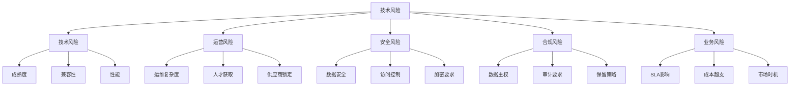
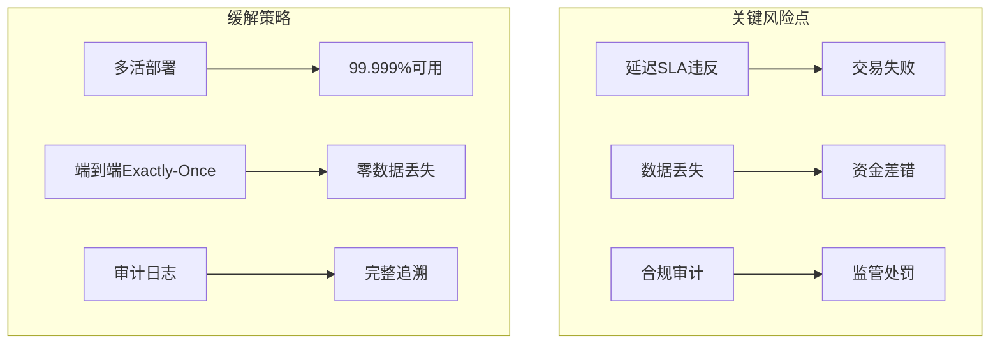
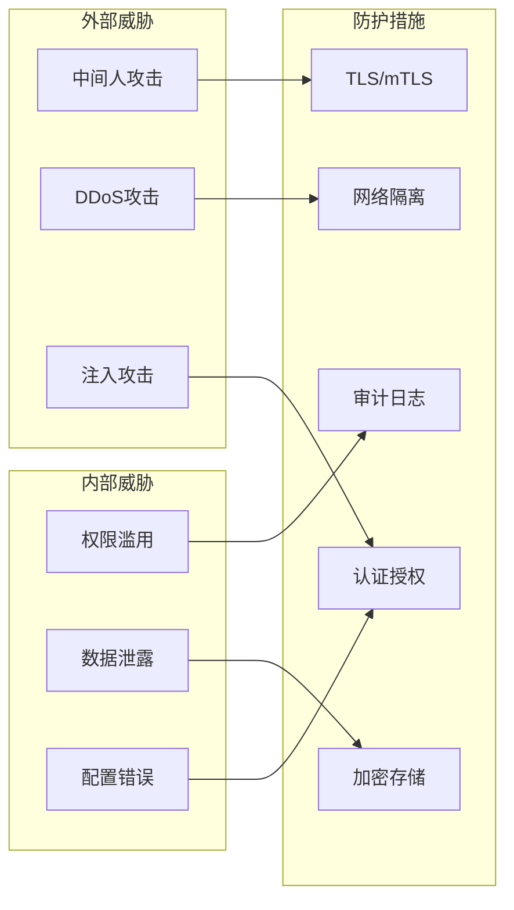
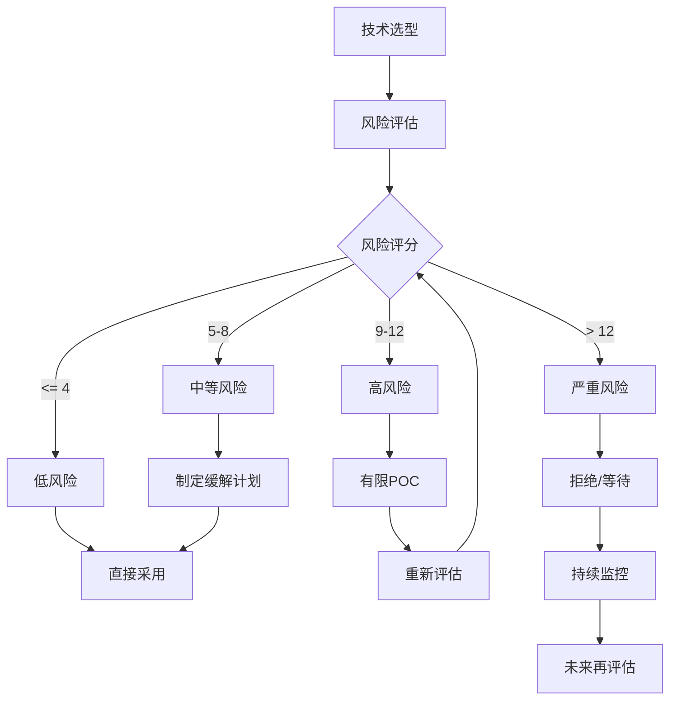

> **状态**: 🔮 前瞻内容 | **风险等级**: 高 | **最后更新**: 2026-04
>
> 此文档描述的内容处于早期规划阶段，可能与最终实现不符。请以 Apache Flink 官方发布为准。
>
# 流计算技术风险评估

> 所属阶段: Knowledge | 前置依赖: [技术雷达](./README.md) | 形式化等级: L3

## 1. 风险评估框架

### 1.1 风险维度



### 1.2 风险评级矩阵

| 概率\影响 | 低(1) | 中(2) | 高(3) | 严重(4) |
|-----------|-------|-------|-------|---------|
| **高(4)** | 中等(4) | 高(8) | 极高(12) | 严重(16) |
| **中(3)** | 低(3) | 中等(6) | 高(9) | 极高(12) |
| **低(2)** | 低(2) | 低(4) | 中等(6) | 高(8) |
| **极低(1)** | 极低(1) | 低(2) | 低(3) | 中等(4) |

**风险等级:**

- 1-4: 低风险（监控）
- 5-8: 中等风险（制定缓解计划）
- 9-12: 高风险（需要缓解措施）
- 13-16: 严重风险（需要立即处理）

## 2. 各技术层级风险评估

### 2.1 ADOPT 层风险评估

| 技术 | 主要风险 | 概率 | 影响 | 等级 | 缓解措施 |
|------|----------|------|------|------|----------|
| **Flink 2.0** | 版本升级兼容性 | 中 | 中 | 6 | 完整测试、灰度发布 |
| **Kafka 3.7** | 集群运维复杂度 | 中 | 高 | 9 | 托管服务、专家支持 |
| **K8s Operator** | K8s学习曲线 | 中 | 中 | 6 | 培训、标准化流程 |
| **RocksDB** | 内存管理 | 中 | 中 | 6 | 监控、自动调优 |
| **Paimon** | 相对较新 | 低 | 中 | 4 | 社区参与、备用方案 |

### 2.2 TRIAL 层风险评估

| 技术 | 主要风险 | 概率 | 影响 | 等级 | 缓解措施 |
|------|----------|------|------|------|----------|
| **RisingWave** | 商业产品依赖 | 中 | 高 | 9 | 开源协议审查、退出策略 |
| **Rust Native** | 人才稀缺 | 高 | 中 | 9 | 内部培养、外包支持 |
| **Serverless Flink** | 供应商锁定 | 高 | 中 | 9 | 多云策略、数据可移植性 |
| **GPU Inference** | 成本波动 | 中 | 中 | 6 | 预算上限、自动扩缩容 |
| **Temporal** | 技术栈增加 | 中 | 低 | 4 | 渐进采用、团队培训 |

### 2.3 ASSESS 层风险评估

| 技术 | 主要风险 | 概率 | 影响 | 等级 | 缓解措施 |
|------|----------|------|------|------|----------|
| **AI Agent (FLIP-531)** | 标准未稳定 | 高 | 中 | 9 | 跟踪标准、PoC验证 |
| **Wasm UDF** | 生态不成熟 | 高 | 中 | 9 | 小规模试点、社区参与 |
| **Unikernels** | 工具链欠缺 | 高 | 高 | 12 | 等待成熟、持续评估 |
| **MCP/A2A Protocol** | 标准竞争 | 中 | 中 | 6 | 关注多标准、保持灵活 |

### 2.4 HOLD 层风险说明

| 技术 | 风险原因 | 风险等级 | 建议 |
|------|----------|----------|------|
| **Apache Storm** | 社区停滞、安全更新不足 | 高 | 制定迁移计划 |
| **YARN** | 云原生趋势、维护负担 | 中 | 逐步迁移到K8s |
| **HDFS** | 对象存储成本优势 | 低 | 新项目避免使用 |
| **Mesos** | 项目已归档 | 高 | 立即迁移 |

## 3. 场景化风险分析

### 3.1 金融支付场景



**风险评估:**

| 风险项 | 概率 | 影响 | 等级 | 缓解措施 |
|--------|------|------|------|----------|
| 处理延迟>100ms | 低 | 严重 | 8 | Flink低延迟优化、监控告警 |
| 数据不一致 | 极低 | 严重 | 4 | 两阶段提交、对账机制 |
| 系统不可用 | 低 | 严重 | 8 | 多地域部署、自动故障转移 |
| 安全漏洞 | 中 | 高 | 9 | 定期安全扫描、WAF |

### 3.2 物联网场景

| 风险项 | 概率 | 影响 | 等级 | 缓解措施 |
|--------|------|------|------|----------|
| 设备接入激增 | 高 | 高 | 12 | 自动扩缩容、背压机制 |
| 数据乱序 | 高 | 中 | 9 | 水印机制、延迟数据处理 |
| 网络分区 | 中 | 中 | 6 | 边缘缓存、断点续传 |
| 设备仿冒 | 中 | 高 | 9 | mTLS、设备证书 |

### 3.3 推荐系统场景

| 风险项 | 概率 | 影响 | 等级 | 缓解措施 |
|--------|------|------|------|----------|
| 特征延迟 | 中 | 中 | 6 | 多级缓存、降级策略 |
| 模型更新失败 | 低 | 中 | 4 | 蓝绿部署、A/B测试 |
| 隐私泄露 | 低 | 严重 | 8 | 数据脱敏、访问控制 |

## 4. 安全风险专项

### 4.1 数据流安全威胁模型



### 4.2 安全控制矩阵

| 控制域 | Adopt | Trial | Assess | 合规要求 |
|--------|-------|-------|--------|----------|
| **传输加密** | 强制TLS 1.3 | 强制TLS 1.2+ | 建议加密 | SOC2/PCI-DSS |
| **静态加密** | 强制 | 强制 | 建议 | GDPR/等保 |
| **访问控制** | RBAC + ABAC | RBAC | 基础认证 | 等保三级 |
| **审计日志** | 完整记录 | 关键操作 | 基础日志 | SOX/等保 |
| **密钥管理** | HSM/KMS | KMS | 环境变量 | PCI-DSS |

## 5. 运营风险评估

### 5.1 运维复杂度评估

```mermaid
radar
    title 运维复杂度评估
    axis 部署难度 监控复杂度 故障排查 扩缩容 成本控制

    area Flink: 3, 4, 3, 4, 3
    area Kafka Streams: 2, 3, 2, 3, 2
    area RisingWave: 2, 2, 2, 3, 2
    area Serverless: 1, 2, 3, 1, 2
```

### 5.2 人才获取风险

| 技术栈 | 市场供应 | 薪资溢价 | 培养周期 | 风险等级 |
|--------|----------|----------|----------|----------|
| Java + Flink | 高 | 10-20% | 3-6月 | 低 |
| Python + PyFlink | 高 | 15-25% | 2-4月 | 低 |
| Rust Streaming | 极低 | 50-100% | 12月+ | 高 |
| K8s + Operator | 中 | 30-50% | 6-9月 | 中 |
| Scala | 低 | 40-60% | 6-12月 | 中 |

## 6. 合规风险矩阵

### 6.1 数据主权要求

| 法规 | 要求 | 技术影响 | 缓解措施 |
|------|------|----------|----------|
| **GDPR** | 数据本地化 | 跨区域传输限制 | 区域部署、数据分类 |
| **等保2.0** | 三级系统审计 | 完整日志、访问控制 | 合规架构设计 |
| **PCI-DSS** | 支付数据保护 | 加密、隔离 | 专用集群、密钥管理 |
| **SOX** | 财务数据完整性 | 不可篡改日志 | WORM存储、审计 |

### 6.2 行业特定合规

| 行业 | 关键要求 | 技术选型影响 |
|------|----------|--------------|
| 金融 | 实时风控、交易追踪 | Flink CEP、审计日志 |
| 医疗 | PHI保护、HIPAA | 数据脱敏、访问审计 |
| 政务 | 等保三级、国产化 | 自主可控技术栈 |
| 零售 | PCI-DSS | 支付数据隔离 |

## 7. 风险缓解策略模板

### 7.1 高风险技术采用策略

```yaml
risk_mitigation:
  technology: "AI Agent Integration"
  risk_level: "high"

  mitigation_strategies:
    - phase: "评估期"
      actions:
        - 技术POC验证
        - 安全渗透测试
        - 性能基准测试
      timeline: "4周"

    - phase: "试点期"
      actions:
        - 非核心业务试点
        - 完整监控覆盖
        - 快速回滚方案
      timeline: "8周"

    - phase: "推广期"
      actions:
        - 渐进式流量切换
        - 持续风险评估
        - 应急预案演练
      timeline: "12周"

  exit_strategy:
    trigger_conditions:
      - "关键bug未修复超过2周"
      - "性能下降超过30%"
      - "安全漏洞高危以上"
    rollback_plan: "影子模式切换回旧系统"
    data_migration: "双写确保数据一致性"
```

### 7.2 风险监控Dashboard指标

| 指标类别 | 关键指标 | 告警阈值 | 监控频率 |
|----------|----------|----------|----------|
| **可用性** | 作业正常运行率 | < 99.9% | 实时 |
| **性能** | P99延迟 | > SLA 150% | 1分钟 |
| **数据质量** | 数据丢失率 | > 0.01% | 5分钟 |
| **资源** | 资源利用率 | > 80% | 5分钟 |
| **安全** | 认证失败率 | > 1% | 实时 |

## 8. 风险决策流程



## 9. 风险案例研究

### 9.1 案例: 某金融公司Flink升级风险

**背景:** 从Flink 1.13升级到2.0

**识别风险:**

- 状态格式不兼容（风险等级: 9）
- API废弃变更（风险等级: 6）
- 性能回归（风险等级: 6）

**缓解措施:**

1. 完整回归测试（2周）
2. 状态迁移工具开发（1周）
3. 影子模式并行运行（4周）
4. 金丝雀发布策略

**结果:** 零故障完成升级

### 9.2 案例: 某电商Serverless采用风险

**背景:** 采用云厂商Serverless Flink

**识别风险:**

- 供应商锁定（风险等级: 9）
- 冷启动延迟（风险等级: 6）
- 成本不可控（风险等级: 6）

**缓解措施:**

1. 抽象层封装厂商API
2. 预留实例降低冷启动
3. 预算告警+自动限制

## 10. 风险登记册模板

| ID | 风险描述 | 类别 | 概率 | 影响 | 等级 | 责任人 | 状态 | 缓解措施 |
|----|----------|------|------|------|------|--------|------|----------|
| R001 | Flink社区活跃度下降 | 技术 | 低 | 高 | 6 | 架构组 | 监控 | 参与社区 |
| R002 | 关键人员离职 | 运营 | 中 | 高 | 9 | HR | 缓解 | 知识文档化 |
| R003 | 云厂商涨价 | 业务 | 中 | 中 | 6 | 财务 | 监控 | 多云策略 |
| R004 | 安全漏洞曝光 | 安全 | 低 | 严重 | 8 | 安全组 | 缓解 | 快速响应 |

## 11. 引用参考


---

*最后更新: 2026-04-04*
