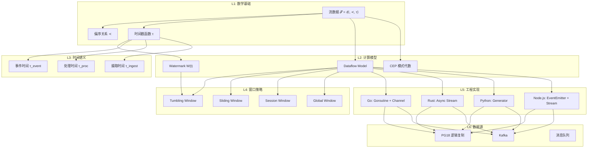
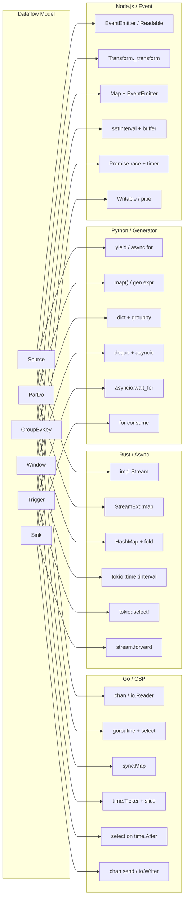
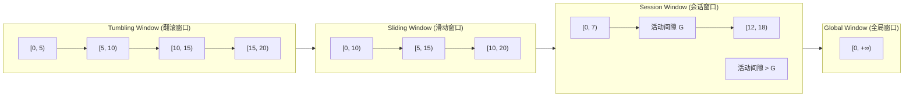

# 流计算理论模型 — 从 Dataflow Model 到 CEP 再到时间语义

> **所属阶段**: TECH-STACK-POSTGRESQL-18-MULTI-LANGUAGE-STREAMING | **前置依赖**: [PG18 逻辑复制基础](../../TECH-STACK-STREAMING-POSTGRES-TEMPORAL-KRATOS/02-component-deep-dive/02.01-postgresql-logical-replication.md) | **形式化等级**: L5
> **最后更新**: 2026-05-06

## 1. 概念定义 (Definitions)

本节建立流计算理论的形式化基础，为 PG18 与多语言流处理生态的融合提供概念锚点。

### 1.1 流数据的形式化定义

**Def-TS-01-01** (流数据模型). 一个**流数据**（Stream）是一个三元组 $\mathcal{S} = \langle E, \prec, \tau \rangle$，其中：

- $E$ 为事件的集合，每个事件 $e \in E$ 携带一个**载荷**（Payload）$\text{payload}(e) \in \mathcal{D}$（$\mathcal{D}$ 为某个值域）；
- $\prec \subseteq E \times E$ 为事件间的**发生先于**（Happens-Before）偏序关系，满足自反性、反对称性与传递性；
- $\tau: E \to \mathbb{T}$ 为**时间戳函数**，将每个事件映射到某个**时间域** $\mathbb{T}$（通常 $\mathbb{T} = \mathbb{R}_{\geq 0}$ 或 $\mathbb{N}$）。

直观上，$\mathcal{S}$ 描述了无限事件序列，并发事件不可比较，但每个事件绑定时间戳。

> **注**: 在 PG18 逻辑复制中，$E$ 对应 WAL 记录，$\prec$ 对应 LSN 全序，$\tau$ 对应事务提交时间戳。

---

### 1.2 Dataflow Model 核心概念

**Def-TS-01-02** (Dataflow Model 计算图). Apache Beam/Dataflow Model 将流计算抽象为**有向无环变换图**（DAG of Transformations）$G = (V, T)$，其中：

- $V = P \cup C$ 为顶点集合，$P$ 为**产生器**（Producer，如 Kafka 订阅、PG18 逻辑复制槽），$C$ 为**消费者**（Consumer，如 Sink 到下游存储）；
- $T$ 为**变换算子**（Transform）集合，每个 $t \in T$ 是一个函数 $t: \mathcal{S}_{\text{in}} \to \mathcal{S}_{\text{out}}$，将输入流映射为输出流。

核心变换算子：

| 算子 | 符号 | 语义 |
|------|------|------|
| **ParDo** | $\text{ParDo}(f)$ | 并行应用 $f: \mathcal{D} \to \mathcal{D}'$ |
| **GroupByKey** | $\text{GBK}(K)$ | 按键 $K$ 分组 |
| **Window** | $W_{\psi}(\mathcal{S})$ | 按策略 $\psi$ 切分流 |
| **Trigger** | $\text{Trig}_{\phi}(\mathcal{S})$ | 按条件 $\phi$ 触发输出 |

**Def-TS-01-03** (ParDo 的形式化定义). 给定流 $\mathcal{S} = \langle E, \prec, \tau \rangle$ 和纯函数 $f: \mathcal{D} \to \mathcal{D}'$，ParDo 变换产生新流：

$$
\text{ParDo}(f)(\mathcal{S}) = \langle E', \prec', \tau' \rangle
$$

其中：

- $E' = \{ e' : \exists e \in E, \text{payload}(e') = f(\text{payload}(e)), \tau'(e') = \tau(e) \}$
- $\prec'$ 继承 $\prec$ 的序关系：$e'_1 \prec' e'_2 \iff \exists e_1 \prec e_2, \text{payload}(e'_i) = f(\text{payload}(e_i))$

> **工程解释**: ParDo 强调逐元素并行性。Go 中对应 goroutine 处理 stage；Rust 中对应 `Stream::map`；Python 中对应 generator expression；Node.js 中对应 `Transform._transform`。

**Def-TS-01-04** (GroupByKey 的形式化定义). 给定键提取函数 $\text{key}: \mathcal{D} \to \mathcal{K}$，GroupByKey 将流 $\mathcal{S}$ 转换为键值分组流：

$$
\text{GBK}(\text{key})(\mathcal{S}) = \langle E'', \prec'', \tau'' \rangle
$$

其中每个 $e'' \in E''$ 载荷为 $(k, B_k)$，$B_k = \{ e \in E : \text{key}(\text{payload}(e)) = k \}$，时间戳 $\tau''(e'') = \sup\{ \tau(e) : e \in B_k \}$。

> **工程解释**: GroupByKey 引入状态——需维护每个键的累积缓冲区，是流计算从"无状态"到"有状态"的关键，涉及一致性、故障恢复、内存管理等。

---

### 1.3 CEP 模式代数

**Def-TS-01-05** (CEP 模式代数). 复杂事件处理（Complex Event Processing）定义在事件流 $\mathcal{S}$ 上的**模式**（Pattern）$P$ 由以下语法递归生成：

$$
P ::= \epsilon \;|\; a \in \Sigma \;|\; P_1 \cdot P_2 \;|\; P_1 \lor P_2 \;|\; P^* \;|\; P^{+} \;|\; P_1 \;\text{WHERE}\; \theta \;|\; P \;\text{WITHIN}\; t
$$

其中：

- $\epsilon$: 空模式（匹配零个事件）
- $a \in \Sigma$: 原子事件类型（$\Sigma$ 为事件类型字母表）
- $P_1 \cdot P_2$: 顺序组合（$P_1$ 发生后 $P_2$ 发生）
- $P_1 \lor P_2$: 选择（$P_1$ 或 $P_2$ 任一匹配）
- $P^*$: Kleene 闭包（$P$ 零次或多次重复）
- $P^{+}$: 正闭包（$P$ 一次或多次重复）
- $\text{WHERE}\; \theta$: 过滤条件（谓词约束）
- $\text{WITHIN}\; t$: 时间窗口约束（整个模式必须在时间 $t$ 内完成匹配）

**语义解释**: 模式 $P$ 在流 $\mathcal{S}$ 上的匹配结果是一个**复杂事件**（Complex Event）集合 $\mathcal{M}(P, \mathcal{S}) \subseteq 2^E$，其中每个 $m \in \mathcal{M}(P, \mathcal{S})$ 是满足 $P$ 结构的事件子集。

> **与 Dataflow Model 的关系**: CEP 关注"如何从流中提取高层语义"，与 Dataflow 的"如何变换流"形成互补。

---

### 1.4 时间语义的三重维度

**Def-TS-01-06** (事件时间 / Event Time). 事件时间 $\tau_{\text{event}}(e)$ 是事件在**产生端**发生的真实时间戳，由事件源（如应用服务器、IoT 传感器、数据库事务提交）嵌入到事件载荷中：

$$
\tau_{\text{event}}: E \to \mathbb{T}_{\text{wall}}
$$

其中 $\mathbb{T}_{\text{wall}}$ 为物理 wall-clock 时间域。事件时间是**不可变**的，一旦产生即固定。

**Def-TS-01-07** (处理时间 / Processing Time). 处理时间 $\tau_{\text{proc}}(e)$ 是事件在**处理端**被算子观察到的时间戳：

$$
\tau_{\text{proc}}: E \to \mathbb{T}_{\text{wall}}, \quad \tau_{\text{proc}}(e) = \text{now}()
$$

处理时间是**动态变化**的，取决于系统负载、网络延迟、调度策略等运行时因素。同一事件在不同算子、不同重放中的处理时间均可能不同。

**Def-TS-01-08** (摄取时间 / Ingestion Time). 摄取时间 $\tau_{\text{ingest}}(e)$ 是事件进入**流处理系统边界**（如 Kafka broker、PG18 复制槽、消息队列）时被赋予的时间戳：

$$
\tau_{\text{ingest}}: E \to \mathbb{T}_{\text{wall}}
$$

摄取时间介于事件时间与处理时间之间：比事件时间稍晚（包含传输延迟），但比处理时间早（尚未进入算子逻辑）。

| 时间语义 | 确定性 | 乱序容忍 | 适用场景 |
|----------|--------|----------|----------|
| 事件时间 | 高（不变） | 强 | 精确统计、CEP、窗口聚合 |
| 处理时间 | 低（变化） | 弱 | 低延迟近似计算、实时监控 |
| 摄取时间 | 中（进入系统时固定） | 中 | 跨重放一致性场景 |

> **PG18 场景**: 事件时间对应 `commit_timestamp`；摄取时间对应 WAL 解码时间；处理时间对应下游消费者实际处理时间。

---

### 1.5 Watermark 的形式化定义

**Def-TS-01-09** (Watermark). 给定流 $\mathcal{S} = \langle E, \prec, \tau_{\text{event}} \rangle$，一个**水印**（Watermark）是一个单调不减函数 $W: \mathbb{T}_{\text{proc}} \to \mathbb{T}_{\text{event}}$，满足：

$$
\forall t_1, t_2 \in \mathbb{T}_{\text{proc}}: t_1 \leq t_2 \implies W(t_1) \leq W(t_2) \quad \text{(单调性)}
$$

且对于所有已观察事件，水印不超越任何未到达事件的将来事件时间：

$$
\forall e \in E_{\text{observed}}: \tau_{\text{event}}(e) \leq W(t_{\text{now}}) \;\lor\; e \text{ 尚未到达}
$$

**Watermark 语义承诺**: 当水印推进到 $T$ 时，系统断言"所有事件时间 $\leq T$ 的事件已到达（或永不到达）"，可安全触发窗口计算、输出结果、清理状态。

**理想水印**: $W_{\text{ideal}}(t) = \max\{ \tau_{\text{event}}(e) : e \in E_{\text{observed}}(t) \}$

**启发式水印**: 实际系统中水印通常是保守估计：

$$
W_{\text{heuristic}}(t) = W_{\text{ideal}}(t) - \delta(t)
$$

$\delta(t) \geq 0$ 为**延迟裕度**，可根据历史延迟分布动态调整。

> **多语言生态对应**:
>
> - **Flink**: `WatermarkStrategy.forBoundedOutOfOrderness(Duration)` 生成启发式水印
> - **Kafka Streams**: `TimestampExtractor` + `GracePeriod` 机制
> - **PG18**: 逻辑复制槽的 `confirmed_flush_lsn` 天然构成一种水印——它标志着"此 LSN 之前的所有事务变更已确认消费"
> - **Go**: 自定义 watermark channel，通过 `select` 与数据 channel 并行推进
> - **Rust**: `tokio::time::interval` 驱动的周期性 watermark 注入
> - **Python**: asyncio `loop.call_later` 实现 watermark 定时器
> - **Node.js**: `setInterval` 或 `Readable` 流的 `readable` 事件驱动

---

## 2. 属性推导 (Properties)

### 2.1 Watermark 单调性引理

**Lemma-TS-01-01** (Watermark 单调性). 设 $W$ 为流 $\mathcal{S}$ 上的水印函数，$t_1 \leq t_2$ 为任意两个处理时刻，则：

$$
W(t_1) \leq W(t_2)
$$

**证明**: 由 Def-TS-01-09 中水印的单调性定义直接可得。$\square$

**推论**: 水印推进形成事件时间维度上永不回退的时序基准，为窗口触发和状态清理提供安全保证。

---

### 2.2 窗口完整性条件

**Def-TS-01-10** (窗口). 给定时间域 $\mathbb{T}$，一个**窗口**（Window）是一个半开区间 $[t_{\text{start}}, t_{\text{end}}) \subseteq \mathbb{T}$。流 $\mathcal{S}$ 在窗口 $w$ 上的**投影**为：

$$
\mathcal{S}|_w = \{ e \in E : \tau_{\text{event}}(e) \in w \}
$$

**Lemma-TS-01-02** (窗口输出完整性). 设窗口 $w = [t_s, t_e)$，水印在时刻 $t$ 推进到 $W(t) \geq t_e$，则窗口 $w$ 的输出结果 $R(w)$ 满足**完整性**（Completeness）：

$$
W(t) \geq t_e \implies \forall e \in E: \tau_{\text{event}}(e) \in w \implies e \in E_{\text{observed}}(t)
$$

即所有事件时间落在 $w$ 内的事件都已被观察到，窗口结果可以安全输出而不会遗漏。

**证明**: 反证法。假设存在 $e \in E$ 使得 $\tau_{\text{event}}(e) \in w$ 但 $e \notin E_{\text{observed}}(t)$。由 Def-TS-01-09，水印承诺所有事件时间 $\leq W(t)$ 的事件已到达。由于 $\tau_{\text{event}}(e) < t_e \leq W(t)$，矛盾。$\square$

---

### 2.3 CEP 模式匹配完备性命题

**Prop-TS-01-01** (CEP 模式匹配上界). 对于任意 CEP 模式 $P$ 和有限事件流前缀 $\mathcal{S}_n = \{e_1, \ldots, e_n\}$，模式匹配结果集的大小满足：

$$
|\mathcal{M}(P, \mathcal{S}_n)| \leq \binom{n}{|P|_{\min}} \cdot |\Sigma|^{|P|_{\max}}
$$

其中 $|P|_{\min}$ 和 $|P|_{\max}$ 分别为模式 $P$ 要求的最小和最大事件数（对于 Kleene 闭包 $P^*$，$|P|_{\max} = n$）。

**直观解释**: CEP 匹配复杂度随流长度指数增长，实际系统采用 NFA/DFA 或树形索引将复杂度降至多项式。

---

## 3. 关系建立 (Relations)

### 3.1 Dataflow Model 到多语言生态的映射

Dataflow Model 的抽象算子在不同语言生态中有不同的实现形态。下表建立严格的对应关系：

| Dataflow 算子 | Go | Rust | Python | Node.js |
|---------------|-----|------|--------|---------|
| **Source** | `chan` / `io.Reader` | `impl Stream` | `generator` / `yield` | `EventEmitter` / `Readable` |
| **ParDo** | goroutine + `select` | `stream.map()` | `map()` / gen expr | `Transform` stream |
| **GroupByKey** | `sync.Map` + goroutine | `HashMap<K, Vec<V>>` | `dict` + `groupby` | `Map` + `EventEmitter` |
| **Window** | `time.Ticker` + slice | `chunks()` / `tokio::time` | `itertools` + `deque` | `setInterval` + buffer |
| **Trigger** | `select` on `time.After` | `tokio::select!` | `asyncio.wait_for` | `Promise.race` + timer |
| **Sink** | `chan` send / `io.Writer` | `stream.forward()` | `for` consume | `Writable` / `pipe()` |

#### 3.1.1 Go: Goroutine 管道模型

Go 语言通过**goroutine + channel** 实现了 Dataflow Model 的"通信顺序进程"（CSP）变体：

- **Source**: 一个 goroutine 从 PG18 复制槽读取，写入 `chan Event`
- **ParDo**: 多个 goroutine 并行从输入 channel 读取，应用函数后写入输出 channel
- **GroupByKey**: 一个 goroutine 维护 `map[string][]Event`，按 key 路由
- **Window**: `time.Ticker` 驱动窗口边界，定期关闭窗口并输出

**形式化对应**: Go channel 的**有界缓冲区**对应 Dataflow 的**背压**（Backpressure）机制；channel 的**阻塞发送/接收**对应 Dataflow 的**同步数据交换**。

#### 3.1.2 Rust: Async Stream 模型

Rust 的 `futures::Stream` trait 提供类型安全的异步流抽象：Source 通过实现 `Stream`（如 `PgReplicationStream`）；ParDo 用 `StreamExt::map`；GroupByKey 用 `fold` + `HashMap`；Window 用 `tokio::time::interval`。`Poll` 语义对应 Dataflow 拉取式数据流。

#### 3.1.3 Python: Generator-based 模型

Python 的 `yield` / `async for` 提供生成器流抽象：Source 用 `yield` 逐条产生；ParDo 用 generator expression；GroupByKey 用 `itertools.groupby`；Window 用 `asyncio` + `deque`。惰性求值对应 Dataflow 按需计算。

#### 3.1.4 Node.js/TypeScript: EventEmitter + Stream 模型

Node.js 提供推式（EventEmitter）和拉式（Stream API）两种模型：Source 通过 `emit('data')` 或 `Readable.push`；ParDo 通过 `Transform._transform`；GroupByKey 通过 `Transform` + `Map`；Window 通过 `setInterval`。`highWaterMark` + `pause()`/`resume()` 对应 Dataflow 背压。

---

### 3.2 PG18 逻辑复制与流数据模型的对应

PG18 的逻辑复制（Logical Replication）提供了**数据库变更流**（CDC, Change Data Capture）的原生支持，其概念与流计算理论模型存在天然映射：

| 流计算概念 | PG18 逻辑复制对应 | 说明 |
|-----------|------------------|------|
| 事件 $e$ | WAL 记录 / `ReorderBufferChange` | 每条 INSERT/UPDATE/DELETE 是一个事件 |
| 事件时间 $\tau_{\text{event}}$ | `commit_timestamp` / `xact_commit_timestamp` | 事务提交时间 |
| 摄取时间 $\tau_{\text{ingest}}$ | WAL 写入时间 / `pgoutput` 解码时间 | 记录进入复制槽的时间 |
| 处理时间 $\tau_{\text{proc}}$ | 下游消费者处理时间 | 应用端实际消费时间 |
| 偏序 $\prec$ | LSN（Log Sequence Number）全序 | `pg_lsn` 类型提供精确的全序关系 |
| Watermark | `confirmed_flush_lsn` | 复制槽确认的消费位置，承诺此前 LSN 已全部处理 |
| Source | `pg_recvlogical` / `wal2json` / `pgoutput` | 逻辑解码插件 |
| Sink | `pglogical` 订阅端 / 外部消费者 | 将变更应用到目标库或外部系统 |

**形式化对应**: PG18 的 LSN 空间 $\mathcal{L} = \{0/0, 0/1, \ldots\}$ 是一个**离散全序集**（Discrete Total Order），与流数据模型中的时间戳域 $\mathbb{T}$ 同构（通过单调映射 $\phi: \mathcal{L} \to \mathbb{T}$）。这使得 PG18 逻辑复制天然适合作为流计算系统的**可靠 Source**——它提供了：

1. **exactly-once 语义**（通过复制槽的持久化位置）
2. **全序保证**（LSN 严格递增）
3. **可重放性**（从任意 LSN 重新启动消费）

---

## 4. 论证过程 (Argumentation)

### 4.1 乱序事件处理策略

分布式系统中，事件不可避免地**乱序**（Out-of-Order）到达——网络抖动、分区重平衡、时钟偏差均会导致先发生后到达。

**策略一: Buffer + Watermark（等待策略）**

维护一个**事件时间排序缓冲区**（Event Time Buffer），延迟窗口输出直到水印越过窗口边界：

```
对于窗口 w = [ts, te):
  W(t) < te:  将事件按事件时间插入有序缓冲区
  W(t) >= te: 触发窗口计算，输出结果，清理缓冲区
```

- **优点**: 结果准确（Lemma-TS-01-02 完整性保证）
- **缺点**: 引入延迟，需额外内存

**策略二: 延迟事件旁路（Late Data Side-Output）**

将水印推进后到达的延迟事件路由到**旁路输出**（Side Output）：

$$
\text{Late}(e) = \{ e : \tau_{\text{event}}(e) < W(t) \land e \text{ 延迟到达} \}
$$

- **优点**: 主路径低延迟
- **缺点**: 需额外处理旁路数据

**策略三: 增量近似（Incremental Approximation）**

窗口未关闭前定期输出**部分结果**，新数据到达时**修正**（Retract/Update）：

$$
R_k(w) = \text{aggregate}(\{ e \in E_{\text{observed}}(t_k) : \tau_{\text{event}}(e) \in w \})
$$

- **优点**: 低延迟、流式更新
- **缺点**: 结果非单调，下游需支持 retract 语义

**策略对比矩阵**:

| 策略 | 延迟 | 准确性 | 内存开销 | 复杂度 | 适用场景 |
|------|------|--------|----------|--------|----------|
| Watermark等待 | 高 | 高 | 中 | 低 | 精确统计、财务报表 |
| 旁路输出 | 中 | 高+补全 | 中 | 中 | 实时监控+延迟审计 |
| 增量近似 | 低 | 中 | 低 | 高 | 实时大屏、A/B测试 |

### 4.2 窗口类型对比

窗口是将无界流切分为有界子集的核心机制。以下是四种主要窗口类型的严格对比：

**Tumbling Window（翻滚窗口）**

- **定义**: 固定大小、不重叠、无间隙
- **形式化**: $w_i = [iT, (i+1)T)$
- **特性**: 每个事件恰好属于一个窗口
- **适用**: 固定周期聚合

**Sliding Window（滑动窗口）**

- **定义**: 固定大小、可重叠
- **形式化**: $w_i = [iS, iS + T)$, $S \leq T$
- **特性**: 每个事件可属于多个窗口
- **适用**: 平滑趋势分析

**Session Window（会话窗口）**

- **定义**: 由**活动间隙**动态划分
- **形式化**: 连续事件间隔 $> G$ 则开新窗口
- **特性**: 窗口大小和数量动态变化
- **适用**: 用户行为分析

**Global Window（全局窗口）**

- **定义**: 单一窗口覆盖全部事件
- **形式化**: $w_{\text{global}} = [0, +\infty)$
- **特性**: 无边界，必须配合 Trigger
- **适用**: 全局状态维护

**窗口类型对比 Mermaid 图**（见第 7 节可视化部分）

---

## 5. 形式证明 / 工程论证 (Proof / Engineering Argument)

### 5.1 基于 Watermark 的窗口输出正确性定理

**Thm-TS-01-01** (Watermark 窗口输出正确性). 设流 $\mathcal{S}$ 上的水印函数 $W$ 满足 Def-TS-01-09 的语义承诺，窗口策略为固定 tumbling 窗口 $w_i = [iT, (i+1)T)$，触发条件为 $W(t) \geq (i+1)T$。则对于任意窗口 $w_i$，当触发输出结果 $R(w_i)$ 时：

$$
R(w_i) = \text{aggregate}(\{ e \in E : \tau_{\text{event}}(e) \in w_i \})
$$

即输出结果等于窗口内**所有事件**的聚合值，无遗漏、无多余。

**证明**:

**步骤 1**（完备性）: 设触发时刻 $t^*$ 满足 $W(t^*) \geq (i+1)T$。由 Lemma-TS-01-02，对任意 $e \in E$：

$$
\tau_{\text{event}}(e) \in w_i = [iT, (i+1)T) \implies \tau_{\text{event}}(e) < (i+1)T \leq W(t^*)
$$

由水印语义承诺（Def-TS-01-09），所有事件时间 $\leq W(t^*)$ 的事件已到达。因此：

$$
\forall e \in E: \tau_{\text{event}}(e) \in w_i \implies e \in E_{\text{observed}}(t^*)
$$

即窗口 $w_i$ 内的所有事件在触发时刻都已被观察到，没有遗漏。

**步骤 2**（正确性）: 窗口投影 $\mathcal{S}|_{w_i}$ 严格按事件时间过滤，聚合算子仅作用于窗口内事件，不会包含其他窗口事件。

**步骤 3**（聚合一致性）:

常见聚合函数（`SUM`, `COUNT`, `AVG`, `MIN`, `MAX`）满足**结合律**和**交换律**，计算顺序不影响最终结果：

$$
\text{aggregate}(A \cup B) = \text{aggregate}(\text{aggregate}(A), \text{aggregate}(B))
$$

这保证了分布式并行聚合的正确性。

**步骤 4**（结论）:

综合步骤 1-3，$R(w_i)$ 精确等于窗口 $w_i$ 内所有事件的聚合值。$\square$

---

### 5.2 工程论证: PG18 作为流 Source 的可靠性

**工程命题**: PG18 逻辑复制作为 Source 提供 At-Least-Once 语义，配合幂等 Sink 可提升至 Exactly-Once。

**论证**:

1. **持久化位置**: `confirmed_flush_lsn` 持久化于系统表，崩溃后可从该位置重启
2. **全序保证**: LSN 严格全序，消除分区乱序
3. **幂等性提升**: 幂等 Sink（UPSERT、CAS）使重复消费无副作用
4. **局限性**: 无端到端事务——确认 LSN 前崩溃会重放，需应用层去重或幂等设计

---

## 6. 实例验证 (Examples)

### 6.1 Go: Goroutine 管道实现简单流处理

```go
package main

import (
 "context"
 "fmt"
 "time"
)

type Event struct {
 Key       string
 Value     int
 EventTime time.Time
}

// Source: 模拟 PG18 逻辑复制槽产生事件
func source(ctx context.Context) <-chan Event {
 out := make(chan Event, 100)
 go func() {
  defer close(out)
  ticker := time.NewTicker(100 * time.Millisecond)
  defer ticker.Stop()
  for i := 0; i < 20; i++ {
   select {
   case <-ctx.Done(): return
   case <-ticker.C:
    eventTime := time.Now().Add(-time.Duration(i%3) * 50 * time.Millisecond)
    out <- Event{Key: fmt.Sprintf("key_%d", i%3), Value: i, EventTime: eventTime}
   }
  }
 }()
 return out
}

// ParDo: 映射变换 (Def-TS-01-03)
func mapEvent(in <-chan Event) <-chan Event {
 out := make(chan Event, 100)
 go func() {
  defer close(out)
  for e := range in {
   out <- Event{Key: e.Key, Value: e.Value * 2, EventTime: e.EventTime}
  }
 }()
 return out
}

// Watermark: 启发式水印推进 (Def-TS-01-09)
func withWatermark(in <-chan Event) <-chan Event {
 out := make(chan Event, 100)
 go func() {
  defer close(out)
  ticker := time.NewTicker(300 * time.Millisecond)
  defer ticker.Stop()
  buffer := make([]Event, 0)
  for {
   select {
   case e, ok := <-in:
    if !ok {
     for _, ev := range buffer { out <- ev }
     return
    }
    buffer = append(buffer, e)
    for i := len(buffer)-1; i > 0 && buffer[i].EventTime.Before(buffer[i-1].EventTime); i-- {
     buffer[i], buffer[i-1] = buffer[i-1], buffer[i]
    }
   case <-ticker.C:
    wm := time.Now().Add(-200 * time.Millisecond)
    var remain []Event
    for _, ev := range buffer {
     if !ev.EventTime.After(wm) { out <- ev } else { remain = append(remain, ev) }
    }
    buffer = remain
   }
  }
 }()
 return out
}

// Window: Tumbling Window (Def-TS-01-10)
func tumblingWindow(in <-chan Event, d time.Duration) <-chan []Event {
 out := make(chan []Event, 10)
 go func() {
  defer close(out)
  ticker := time.NewTicker(d)
  defer ticker.Stop()
  window := make([]Event, 0)
  for {
   select {
   case e, ok := <-in:
    if !ok { if len(window) > 0 { out <- window }; return }
    window = append(window, e)
   case <-ticker.C:
    if len(window) > 0 { out <- window; window = make([]Event, 0) }
   }
  }
 }()
 return out
}

func sink(in <-chan []Event) {
 for w := range in {
  sum := 0
  for _, e := range w { sum += e.Value }
  fmt.Printf("Window sum: %d (events: %d)\n", sum, len(w))
 }
}

func main() {
 ctx, cancel := context.WithTimeout(context.Background(), 10*time.Second)
 defer cancel()
 pipe := tumblingWindow(withWatermark(mapEvent(source(ctx))), 500*time.Millisecond)
 sink(pipe)
}
```

**关键点**: `source()` 模拟 PG18 逻辑复制；`mapEvent()` 对应 ParDo（Def-TS-01-03）；`withWatermark()` 实现启发式水印（Def-TS-01-09）；`tumblingWindow()` 实现翻滚窗口（Def-TS-01-10）。

---

### 6.2 Rust: Async Stream 示例

```rust
use futures::{stream, Stream, StreamExt};
use std::pin::Pin;
use std::time::{Duration, SystemTime};
use tokio::time::{interval, Instant};

#[derive(Clone, Debug)]
struct Event {
    key: String,
    value: i32,
    event_time: SystemTime,
}

fn source_stream() -> impl Stream<Item = Event> {
    stream::iter(0..20).then(|i| async move {
        tokio::time::sleep(Duration::from_millis(50)).await;
        Event {
            key: format!("key_{}", i % 3),
            value: i,
            event_time: SystemTime::now() - Duration::from_millis((i % 3 * 50) as u64),
        }
    })
}

// ParDo: Stream::map (Def-TS-01-03)
fn par_do<S: Stream<Item = Event>>(input: S) -> impl Stream<Item = Event> {
    input.map(|e| Event { key: e.key, value: e.value * 2, event_time: e.event_time })
}

// Window: tumbling window (Def-TS-01-10)
async fn tumbling_window<S: Stream<Item = Event> + Unpin>(
    mut input: Pin<&mut S>, duration: Duration
) -> Vec<Vec<Event>> {
    let mut windows: Vec<Vec<Event>> = vec![];
    let mut cur = vec![];
    let mut tick = interval(duration);
    loop {
        tokio::select! {
            _ = tick.tick() => { if !cur.is_empty() { windows.push(cur); cur = vec![]; } }
            ev = input.next() => {
                match ev {
                    Some(e) => cur.push(e),
                    None => { if !cur.is_empty() { windows.push(cur); } break; }
                }
            }
        }
    }
    windows
}

#[tokio::main]
async fn main() {
    let src = source_stream();
    let mapped = par_do(src);
    futures::pin_mut!(mapped);
    let windows = tumbling_window(mapped, Duration::from_millis(500)).await;
    for (i, w) in windows.iter().enumerate() {
        println!("Window {}: sum={}, events={}", i, w.iter().map(|e| e.value).sum::<i32>(), w.len());
    }
}
```

**关键点解析**:

- `Stream::map` 对应 ParDo，类型系统保证变换函数的输入输出类型安全
- `tokio::select!` 实现并发事件处理和水印推进
- `StreamExt` 提供了丰富的组合子（`filter`, `fold`, `chunks`, `timeout` 等），对应 Dataflow Model 的算子库

---

### 6.3 Python: Generator-based 流处理

```python
import asyncio
import time
from collections import deque
from typing import AsyncGenerator, List, Dict, Any

class Event:
    def __init__(self, key: str, value: int, event_time: float):
        self.key = key
        self.value = value
        self.event_time = event_time

# Source: 异步生成器模拟 PG18 逻辑复制 (Def-TS-01-01)
async def source() -> AsyncGenerator[Event, None]:
    for i in range(20):
        await asyncio.sleep(0.05)
        # 模拟乱序
        event_time = time.time() - (i % 3) * 0.05
        yield Event(key=f"key_{i % 3}", value=i, event_time=event_time)

# ParDo: 生成器表达式 (Def-TS-01-03)
async def par_do(src: AsyncGenerator[Event, None]) -> AsyncGenerator[Event, None]:
    async for e in src:
        yield Event(key=e.key, value=e.value * 2, event_time=e.event_time)

# Watermark: 带缓冲的排序输出 (Def-TS-01-09)
async def with_watermark(
    src: AsyncGenerator[Event, None],
    delay_margin: float = 0.2
) -> AsyncGenerator[Event, None]:
    buffer: List[Event] = []
    last_watermark = 0.0

    async for e in src:
        buffer.append(e)
        buffer.sort(key=lambda x: x.event_time)

        current_watermark = time.time() - delay_margin
        if current_watermark > last_watermark:
            last_watermark = current_watermark
            # 输出事件时间 <= watermark 的事件
            while buffer and buffer[0].event_time <= current_watermark:
                yield buffer.pop(0)

    # 输出剩余
    for e in buffer:
        yield e

# Window: Tumbling Window (Def-TS-01-10)
async def tumbling_window(
    src: AsyncGenerator[Event, None],
    duration: float
) -> AsyncGenerator[List[Event], None]:
    window: List[Event] = []
    start_time = time.time()

    async for e in src:
        window.append(e)
        if time.time() - start_time >= duration:
            yield window
            window = []
            start_time = time.time()

    if window:
        yield window

# Sink
async def sink(windows: AsyncGenerator[List[Event], None]):
    async for w in windows:
        total = sum(e.value for e in w)
        print(f"Window sum: {total}, events: {len(w)}")

async def main():
    pipe = tumbling_window(with_watermark(par_do(source())), 0.5)
    await sink(pipe)

if __name__ == "__main__":
    asyncio.run(main())
```

**关键点**: `AsyncGenerator` 对应惰性求值；`async for` 避免阻塞事件循环。

---

### 6.4 TypeScript: EventEmitter + Readable Stream

```typescript
import { EventEmitter } from 'events';
import { Readable, Transform, pipeline } from 'stream';
import * as util from 'util';

interface Event {
    key: string;
    value: number;
    eventTime: number;
}

class EventSource extends EventEmitter {
    private timer: NodeJS.Timeout | null = null;
    private count = 0;
    start() {
        this.timer = setInterval(() => {
            this.emit('data', { key: `key_${this.count%3}`, value: this.count,
                eventTime: Date.now() - (this.count%3)*50 } as Event);
            if (++this.count >= 20) { this.stop(); this.emit('end'); }
        }, 50);
    }
    stop() { if (this.timer) clearInterval(this.timer); this.timer = null; }
}

// ParDo (Def-TS-01-03)
class MapTransform extends Transform {
    constructor() { super({ objectMode: true }); }
    _transform(chunk: Event, enc: BufferEncoding, cb: Function) {
        cb(null, { key: chunk.key, value: chunk.value * 2, eventTime: chunk.eventTime });
    }
}

// Window (Def-TS-01-10)
class TumblingWindowTransform extends Transform {
    private window: Event[] = [];
    private timer: NodeJS.Timeout;
    constructor(ms: number) {
        super({ objectMode: true });
        this.timer = setInterval(() => this.flush(), ms);
    }
    _transform(chunk: Event, enc: BufferEncoding, cb: Function) {
        this.window.push(chunk); cb();
    }
    _flush(cb: Function) { this.flush(); clearInterval(this.timer); cb(); }
    private flush() {
        if (this.window.length) { this.push([...this.window]); this.window = []; }
    }
}

class Sink extends Transform {
    constructor() { super({ objectMode: true }); }
    _transform(chunks: Event[], enc: BufferEncoding, cb: Function) {
        console.log(`Window sum: ${chunks.reduce((a,e)=>a+e.value,0)}, events: ${chunks.length}`);
        cb();
    }
}

async function main() {
    const src = new EventSource();
    const readable = new Readable({ objectMode: true, read() {} });
    src.on('data', e => readable.push(e));
    src.on('end', () => readable.push(null));
    try {
        await util.promisify(pipeline)(readable, new MapTransform(),
            new TumblingWindowTransform(500), new Sink());
    } catch(err) { console.error('Pipeline error:', err); }
    src.start();
}
main();
```

**关键点**: `EventEmitter` 推式事件流；`Transform` 拉式背压控制；`pipeline()` 自动错误传播和资源清理。

---

## 7. 可视化 (Visualizations)

### 7.1 流计算概念层次图

以下思维导图展示了从流数据基础模型到多语言工程实现的完整概念层次：



**图说明**: 从数学基础（L1）逐层展开到工程实现（L5）和数据源（L6），展示流计算理论模型的完整知识谱系。

---

### 7.2 时间语义对比图

以下时序图展示了三种时间语义在分布式流处理中的差异：

```mermaid
gantt
    title 时间语义对比时序图
    dateFormat X
    axisFormat %s

    section 物理时间线
    真实事件发生     :milestone, e1, 0, 0
    真实事件发生     :milestone, e2, 2, 2
    真实事件发生     :milestone, e3, 4, 4

    section 事件时间 (τ_event)
    e1 时间戳        :done, et1, 0, 0
    e2 时间戳        :done, et2, 2, 2
    e3 时间戳        :done, et3, 4, 4

    section 摄取时间 (τ_ingest)
    e1 进入系统      :active, it1, 1, 1
    e2 进入系统      :active, it2, 3, 3
    e3 进入系统      :active, it3, 5, 5

    section 处理时间 (τ_proc)
    算子A处理e1      :crit, pa1, 2, 2
    算子A处理e2      :crit, pa2, 4, 4
    算子A处理e3      :crit, pa3, 6, 6
    算子B处理e1      :crit, pb1, 3, 3
    算子B处理e2      :crit, pb2, 7, 7
    算子B处理e3      :crit, pb3, 5, 5
```



**图说明**:

- **事件时间**（绿色）与真实发生时刻一致，是客观不变的
- **摄取时间**（蓝色）因网络传输引入固定偏移
- **处理时间**（红色）因算子负载和调度策略呈现非确定性的偏移和乱序（如 e3 在算子B中先于 e2 处理）

---

### 7.3 Dataflow 算子到多语言生态映射图



**图说明**: Dataflow 六个核心算子与四种语言生态的对应关系，每条映射线代表同一计算语义在不同运行时中的形式化等价。

---

### 7.4 窗口类型对比图



**图说明**: 四种窗口核心差异在于边界划分策略：Tumbling 固定互斥；Sliding 固定可重叠；Session 动态由活动间隙驱动；Global 单一无限窗口需配合 Trigger。

---

## 8. 引用参考 (References)

[^1]: T. Akidau et al., "The Dataflow Model: A Practical Approach to Balancing Correctness, Latency, and Cost in Massive-Scale, Unbounded, Out-of-Order Data Processing", PVLDB, 8(12), 2015. https://www.vldb.org/pvldb/vol8/p1792-Akidau.pdf

[^2]: Apache Flink Documentation, "Streaming Concepts — Time and Windows", 2025. https://nightlies.apache.org/flink/flink-docs-stable/docs/concepts/time/

[^3]: PostgreSQL 18 Documentation, "Logical Replication", 2025. https://www.postgresql.org/docs/18/logical-replication.html

[^4]: PostgreSQL 18 Documentation, "Logical Decoding", 2025. https://www.postgresql.org/docs/18/logicaldecoding.html

[^5]: L. Lamport, "Time, Clocks, and the Ordering of Events in a Distributed System", Communications of the ACM, 21(7), pp. 558-565, 1978. https://dl.acm.org/doi/10.1145/359545.359563

[^6]: T. Akidau et al., "Streaming Systems: The What, Where, When, and How of Large-Scale Data Processing", O'Reilly Media, 2018. ISBN: 978-1491983874

[^7]: G. Cugola and A. Margara, "Processing Flows of Information: From Data Stream to Complex Event Processing", ACM Computing Surveys, 44(3), 2012. https://dl.acm.org/doi/10.1145/2187671.2187677

[^8]: Apache Beam Documentation, "Programming Guide — Watermarks and Late Data", 2025. https://beam.apache.org/documentation/programming-guide/#watermarks-and-late-data

[^9]: M. Kleppmann, "Designing Data-Intensive Applications: The Big Ideas Behind Reliable, Scalable, and Maintainable Systems", O'Reilly Media, 2017. ISBN: 978-1449373320

[^10]: Go Team, "Go Concurrency Patterns: Pipelines and Cancellation", Go Blog, 2014. https://go.dev/blog/pipelines

[^11]: Rust Team, "Asynchronous Programming in Rust — Streams", The Rust Programming Language, 2025. https://rust-lang.github.io/async-book/05_streams/01_chapter.html

[^12]: Node.js Documentation, "Stream API", 2025. https://nodejs.org/api/stream.html
