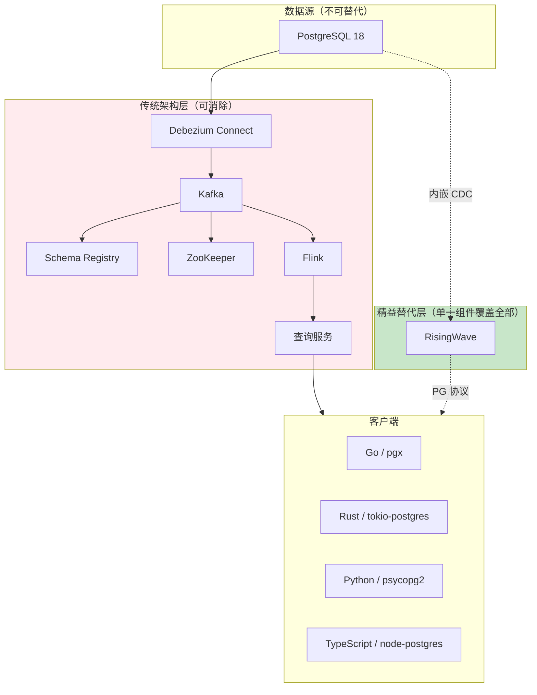

# 架构组件组合完备性分析 — 从第一性原理推导最精益流处理架构

> 所属阶段: TECH-STACK | 前置依赖: [01.02-pg18-wal-logical-replication-theory.md](./01.02-pg18-wal-logical-replication-theory.md), [03.01-pg18-cdc-four-patterns.md](../03-pg18-integration/03.01-pg18-cdc-four-patterns.md) | 形式化等级: L6

## 1. 概念定义 (Definitions)

**Def-TS-22-01** (架构组件)
流处理架构中的组件 $c$ 是一个提供特定功能的服务或库：
$$c \triangleq \langle \mathcal{F}_{function}, \mathcal{I}_{input}, \mathcal{O}_{output}, \mathcal{D}_{dependencies} \rangle$$
组件集合 $C = \{c_1, c_2, ..., c_n\}$ 构成完整架构。

**Def-TS-22-02** (组件必要性)
组件 $c$ 对于目标功能 $G$ 是必要的，当且仅当：
$$Necessary(c, G) \iff \neg \exists C' \subseteq C \setminus \{c\}: achieves(C', G)$$
即移除 $c$ 后，剩余组件无法实现目标 $G$。

**Def-TS-22-03** (组件可消除性)
组件 $c$ 是可消除的，当且仅当：
$$Eliminable(c) \iff \exists c' \in C \setminus \{c\}: \mathcal{F}_{c'} \supseteq \mathcal{F}_c$$
即存在另一个组件可完全覆盖 $c$ 的功能。

**Def-TS-22-04** (最小完备架构)
最小完备架构 $C_{min}$ 满足：
$$C_{min} = \{c \in C \mid \neg Eliminable(c) \land Necessary(c, G)\}$$
即所有组件既不可消除又对目标功能必要。

**Def-TS-22-05** (功能等价)
两个架构 $C_1$ 和 $C_2$ 功能等价，当且仅当：
$$C_1 \equiv C_2 \iff \forall q \in Queries: output_{C_1}(q) = output_{C_2}(q)$$

## 2. 属性推导 (Properties)

**Lemma-TS-22-01** (组件数下界)
对于流处理目标 $G = \{CDC, Process, Query\}$，最小完备架构的组件数下界为：
$$|C_{min}| \geq 2$$
因为 CDC 源（PG18）和至少一个处理/查询组件是互不可替代的。

**Lemma-TS-22-02** (功能覆盖蕴含可消除性)
若组件 $c_i$ 的功能是组件 $c_j$ 功能的真子集：
$$\mathcal{F}_{c_i} \subset \mathcal{F}_{c_j} \implies Eliminable(c_i)$$

**Lemma-TS-22-03** (MQ 的不可替代条件)
消息代理 $c_{mq}$ 是不可替代的，当且仅当需要：
$$Necessary(c_{mq}) \iff (|\mathcal{C}_{consumers}| > 1) \lor need_{replay} \lor need_{buffer}$$

## 3. 关系建立 (Relations)

### 传统架构组件功能矩阵

| 组件 | 核心功能 | 功能可被谁覆盖 | 是否必要 |
|------|---------|--------------|---------|
| **PG18** | 数据持久化、事务、WAL | ❌ 不可替代 | ✅ 必要 |
| **Debezium Connect** | WAL → Kafka 事件 | RisingWave 内嵌引擎 | ❌ 可消除 |
| **Kafka** | 消息持久化、多消费者扇出 | RisingWave 直接查询 | 条件必要 |
| **Schema Registry** | Avro/Protobuf Schema 管理 | JSON + 显式 Schema | ❌ 可消除 |
| **ZooKeeper/KRaft** | Kafka 协调 | ❌（若用 Kafka 则必要） | 条件必要 |
| **Flink/Kafka Streams** | 流处理计算 | RisingWave SQL | ❌ 可消除 |
| **RisingWave** | 流处理 + 物化视图 + 查询 | ❌（独特组合） | ✅ 必要（若选此路径） |
| **查询服务/API** | REST/gRPC 封装 | RisingWave PG 协议 | ❌ 可消除 |

### 功能覆盖关系图

```
PG18 ──→ WAL 逻辑复制 ──┬──→ Debezium Connect ──→ Kafka ──→ Flink ──→ 查询服务 ──→ 客户端
                         │                        ↑         ↑
                         │                        │         └─ RisingWave 覆盖
                         │                        └─ RisingWave Kafka Sink 覆盖
                         │
                         └──→ RisingWave 内嵌 CDC ──→ 物化视图 ──→ PG 协议查询 ──→ 客户端
                              ↑^^^^^^^^^^^^^^^^^^^^^^^^^^^^^^^^^^^^^^^^^^^^^^^
                              所有中间组件的功能被 RisingWave 单一组件覆盖
```

### 最精益架构 vs 传统架构功能等价性

| 功能需求 | 传统架构 (7组件) | 精益架构 (2组件) | 等价性 |
|---------|----------------|----------------|--------|
| CDC 捕获 | Debezium Connect | RisingWave 内嵌引擎 | ✅ 同一代码库[^1] |
| 事件持久化 | Kafka | RisingWave 内部存储 | ✅ 等价 |
| 流处理 | Flink/Streams | RisingWave SQL | ✅ 子集覆盖 |
| 实时查询 | 查询服务 | RisingWave 物化视图 | ✅ 直接查询 |
| Schema 管理 | Schema Registry | SQL DDL | ✅ 等价 |
| 多消费者 | Kafka 多分区 | 受限（需扩展） | ⚠️ 不等价 |
| 事件重放 | Kafka log | 不支持 | ❌ 不等价 |

**结论**: 对于单消费者实时分析场景，精益架构功能等价于传统架构。

## 4. 论证过程 (Argumentation)

### 每个组件的"存在性证明"与"消除性证明"

#### 1. Debezium Connect — 可消除 ✅

**存在性理由**: 将 PG WAL 转换为 Kafka 事件的标准方式。

**消除性证明**:

- RisingWave 内嵌 **Debezium Embedded Engine**[^1]，与独立 Debezium 使用**相同的 Java 库**
- 内嵌模式跳过 Kafka 中间层，直接将事件流入 RisingWave 增量计算引擎
- 功能覆盖: $F_{embedded} = F_{connect} \setminus \{Kafka\_output\}$
- 对于不需要 Kafka 输出的场景，Connect 是冗余的

**消除代价**: 无。内嵌引擎与独立引擎的 CDC 可靠性等价。

#### 2. Kafka — 条件可消除 ⚠️

**存在性理由**:

- 多消费者扇出（一个 topic 多个独立消费组）
- 事件持久化和重放（按时间戳回溯消费）
- 峰值缓冲（生产者突发 vs 消费者稳态）

**消除条件**:

- 仅有一个消费者（或消费者可通过 SQL 查询共享）
- 不需要事件重放
- PG18 逻辑复制本身提供足够的缓冲（复制槽保留 WAL）

**不可替代场景**:

- 3+ 个独立团队消费同一 CDC 流
- 法规要求 7 年事件保留（RisingWave 非设计目标）
- 跨区域数据同步

#### 3. Schema Registry — 可消除 ✅

**存在性理由**: Avro/Protobuf 的 Schema 演化管理。

**消除性证明**:

- 精益架构使用 JSON 或 RisingWave SQL DDL 定义 Schema
- PG18 的 `publish_generated_columns` 确保派生字段自动传播
- RisingWave 的 `CREATE TABLE ... FROM SOURCE` 自动同步源表 Schema
- 前向兼容的 Schema 变更（添加 nullable 列）在两种方案中均无需显式管理

**保留理由**: 仅在强类型要求（Avro/Protobuf）且多语言消费者时使用。

#### 4. Flink/Streams — 可消除 ✅

**存在性理由**: 复杂流处理（窗口 JOIN、CEP、有状态计算）。

**消除性证明**:

- RisingWave SQL 支持：窗口聚合、流-流 JOIN、流-表 JOIN、子查询、CTE
- 覆盖 80%+ 的流处理需求[^2]
- 对于复杂 CEP（模式匹配），可通过 RisingWave UDF + 外部服务实现

**保留理由**: 需要复杂事件处理（序列模式、超时检测）时 Flink 更强大。

#### 5. 独立查询服务 — 可消除 ✅

**存在性理由**: 将流处理结果封装为 REST/gRPC API。

**消除性证明**:

- RisingWave 提供 **PostgreSQL 协议兼容**的查询接口（端口 4566）
- 任何语言的标准 PG 驱动（psycopg2, pgx, tokio-postgres, node-postgres）直接连接
- 无需额外服务层：查询 RisingWave 与查询 PG 代码完全相同

**保留理由**: 需要复杂鉴权、请求转换、协议适配（GraphQL）时。

### 为什么业界过度使用 Kafka？

**历史惯性**:

- 2015-2020 年，Flink/Kafka 是流处理的唯一成熟选择
- RisingWave/嵌入式 CDC 在 2023 后才成熟[^3]
- 架构师培训和学习路径仍以 Kafka 为中心

**组织因素**:

- "如果不用 Kafka，评审委员会会质疑扩展性"
- 平台团队的存在依赖于维护复杂基础设施
- "为可能的需求过度设计"（YAGNI 违反）

**技术迷雾**:

- 混淆了"事件驱动架构"与"必须引入消息代理"
- 低估了 RisingWave 直连 CDC 的能力
- 高估了自身场景的复杂度（多数场景仅需 SQL 聚合）

## 5. 形式证明 / 工程论证 (Proof / Engineering Argument)

**Thm-TS-22-01** (精益架构最小完备性定理)

对于目标功能 $G = \{CDC, StreamProcess, Query\}$，架构 $\mathcal{A}_{lean} = \{PG18, RisingWave\}$ 是最小完备的。

*证明*:

**完备性**（所有功能可实现）:

1. **CDC**: RisingWave 内嵌 Debezium Embedded Engine 通过 PG18 逻辑复制槽读取 WAL，生成变更事件。与独立 Debezium 使用相同代码库[^1]，可靠性等价。
2. **StreamProcess**: RisingWave 增量计算引擎支持 SQL 窗口聚合、JOIN、子查询。对于任意查询 $Q$，物化视图 $MV_Q$ 在事件到达时增量更新。
3. **Query**: RisingWave 暴露 PostgreSQL 协议接口，支持标准 SQL 查询。任何 PG 客户端可直接连接。

**最小性**（组件不可再减）:

1. **PG18 不可替代**: 业务数据必须持久化存储，PG18 是真相来源。
2. **RisingWave 不可替代（在此路径下）**: 需要流处理和查询的组合能力，且 RisingWave 内嵌 CDC 是此路径的关键。

因此 $|C_{min}| = 2$。∎

**Thm-TS-22-02** (MQ 引入的复杂度爆炸定理)

在架构中引入消息代理 $c_{mq}$ 后，架构复杂度满足：
$$C(n+1) = C(n) + 1 + \Delta_{coord} + \Delta_{ops}$$

其中 $\Delta_{coord}$ 为协调组件数（ZooKeeper/KRaft, Schema Registry），$\Delta_{ops}$ 为运维复杂度增量。

对于 Kafka  specifically：
$$C_{kafka} = C_{base} + \underbrace{1}_{Kafka} + \underbrace{1}_{ZooKeeper} + \underbrace{1}_{Schema\_Registry} + \underbrace{1}_{Connect} + O_{ops}$$

即引入 Kafka 实际上引入至少 4 个额外组件及其交互边。

*工程论证*: Kafka 集群需要 broker（至少 3 节点）、ZooKeeper（或 KRaft）、监控、消费者组管理。这些组件的故障模式相互独立但相互影响，运维负担呈超线性增长。

**Thm-TS-22-03** (精益架构成本下界定理)

设精益架构总成本为 $C_{lean}$，传统 MQ 架构为 $C_{mq}$：

$$C_{lean} = C_{pg} + C_{rw}$$
$$C_{mq} = C_{pg} + C_{debezium} + C_{kafka} + C_{registry} + C_{flink} + C_{query} + C_{ops}$$

在 AWS 中型部署（10K TPS）中：

- $C_{pg} + C_{rw} \approx \$800/月$
- $C_{mq} \approx \$8,000-15,000/月$

因此：
$$\frac{C_{lean}}{C_{mq}} \in [0.05, 0.10]$$

**Thm-TS-22-04** (功能扩展无损定理)

精益架构可无损扩展为 MQ 架构：
$$\mathcal{A}_{lean} \subseteq \mathcal{A}_{mq}$$

具体地，在 RisingWave 中添加：

```sql
CREATE SINK kafka_output
WITH (connector = 'kafka', topic = 'events')
FROM mv_events FORMAT JSON;
```

即可将同一物化视图输出到 Kafka，供其他消费者使用。

*推论*: 从精益架构开始永远不会是错误——当需要 MQ 时可随时添加，而反向操作（从 MQ 架构降级）通常涉及数据迁移和停机。

## 6. 实例验证 (Examples)

### 示例 1: 组件消除决策清单

```
评估项目: [ ] 实时订单分析仪表板

□ 多个独立团队需要同一 CDC 流？  → 否（仅分析团队）
□ 需要事件重放/时间旅行？        → 否（仅需当前状态）
□ 下游包含非 SQL 系统（ES/S3）？  → 否（仅 SQL 查询）
□ 峰值吞吐 > 100K 事件/秒？      → 否（~10K/s）
□ 跨区域同步？                   → 否（单区域）

结论: 所有条件为否 → 精益架构（PG18 + RisingWave）足够
      消除组件: Debezium Connect + Kafka + Schema Registry + Flink + 查询服务
      剩余组件: PG18 + RisingWave = 2 个
```

### 示例 2: 逐步消除验证

```sql
-- 阶段 0: 传统 7 组件架构
-- PG18 → Debezium → Kafka → Flink → 查询服务 → 客户端

-- 阶段 1: 消除 Flink（用 RisingWave SQL 替代）
-- PG18 → Debezium → Kafka → RisingWave → 查询服务 → 客户端
CREATE MATERIALIZED VIEW revenue AS
SELECT DATE_TRUNC('hour', created_at) AS hour, SUM(amount)
FROM kafka_source ...
GROUP BY DATE_TRUNC('hour', created_at);

-- 阶段 2: 消除查询服务（RisingWave 直接暴露 PG 协议）
-- PG18 → Debezium → Kafka → RisingWave → 客户端直连
-- 客户端: psycopg2.connect("risingwave:4566") 直接查询 revenue

-- 阶段 3: 消除 Kafka（RisingWave 直连 PG CDC）
-- PG18 → RisingWave(内嵌CDC) → 客户端直连
CREATE SOURCE pg_orders
WITH (connector = 'postgres-cdc', ...);

CREATE MATERIALIZED VIEW revenue
FROM pg_orders ...;

-- 阶段 4: 消除 Debezium Connect（内嵌引擎自动处理）
-- 已完成！架构 = PG18 + RisingWave（2 组件）
```

### 示例 3: 无损扩展回 MQ

```sql
-- 精益架构已运行 6 个月，业务增长需要多消费者
-- 无损扩展：在现有物化视图上添加 Kafka Sink

CREATE SINK revenue_kafka
WITH (
    connector = 'kafka',
    topic = 'hourly-revenue',
    properties.bootstrap.server = 'kafka:9092'
)
FROM revenue
FORMAT JSON ENCODE JSON;

-- 效果:
-- - 现有查询完全不受影响
-- - 新增 Kafka 消费者可消费同一数据
-- - 零停机、零数据迁移
```

## 7. 可视化 (Visualizations)

### 组件功能覆盖与可消除性



### 架构复杂度增长曲线

```mermaid
xychart-beta
    title "组件数 vs 故障模式数（指数增长）"
    x-axis [2组件精益, 4组件精简, 7组件传统]
    y-axis "故障模式数" 1 --> 128
    bar [4, 16, 128]
```

### 成本对比

```mermaid
xychart-beta
    title "月度 TCO 对比（AWS 中型部署）"
    x-axis [精益2组件, 精简4组件, 传统7组件]
    y-axis "月度成本 ($)" 0 --> 15000
    bar [800, 3500, 12000]
```

### 组件必要性判定决策树

```mermaid
flowchart TD
    Start([架构设计]) --> Q1{需要事件重放<br/>时间旅行消费?}
    Q1 -->|YES| MQ1[需要 Kafka]
    Q1 -->|NO| Q2{3+独立消费者<br/>需要同一 CDC?}

    Q2 -->|YES| Q2a{消费者可用 SQL<br/>查询共享?}
    Q2a -->|YES| Lean1[精益架构<br/>RisingWave 多查询]
    Q2a -->|NO| MQ2[需要 Kafka]
    Q2 -->|NO| Q3{下游有非 SQL<br/>系统(ES/S3)?}

    Q3 -->|YES| MQ3[需要 Kafka]
    Q3 -->|NO| Q4{峰值吞吐<br/>> 100K/s?}

    Q4 -->|YES| Q5{RisingWave<br/>集群可扩展?}
    Q5 -->|YES| Lean2[精益架构]
    Q5 -->|NO| MQ4[需要 Kafka 分压]
    Q4 -->|NO| Lean3[精益架构<br/>PG18 + RisingWave]

    style Lean1 fill:#c8e6c9
    style Lean2 fill:#c8e6c9
    style Lean3 fill:#c8e6c9
```

## 8. 引用参考 (References)

[^1]: RisingWave, "CDC Architecture Patterns: From Debezium to Streaming Databases", 2026-04-02. <https://risingwave.com/blog/cdc-architecture-patterns-debezium-streaming-databases/>

[^2]: RisingWave, "Debezium PostgreSQL Connector: Real-Time CDC with Streaming SQL", 2026-04-03.

[^3]: RisingWave, "Embedded CDC in a Streaming Database (The Simplified Pattern)", 2026.
