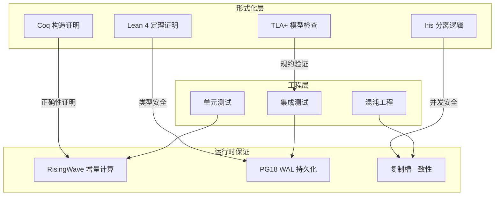
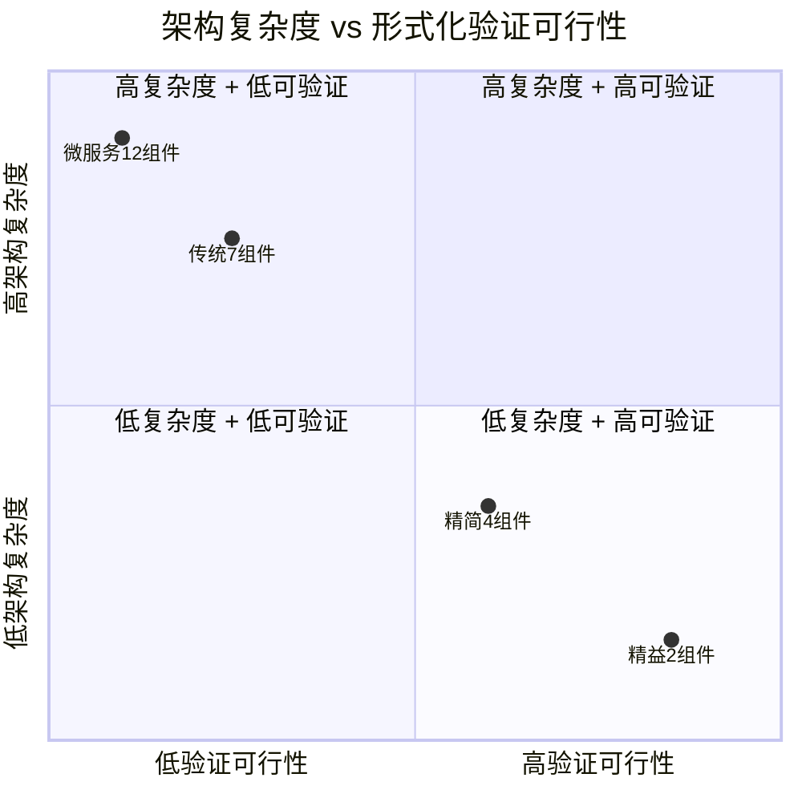

# 流处理语义的形式化验证 — 交付保证与一致性深度证明

> 所属阶段: TECH-STACK | 前置依赖: [01.04-delivery-guarantees-formal-analysis.md](./01.04-delivery-guarantees-formal-analysis.md), [01.05-architectural-component-completeness.md](./01.05-architectural-component-completeness.md) | 形式化等级: L6

## 1. 概念定义 (Definitions)

**Def-TS-27-01** (流处理执行语义)
流处理系统的执行语义定义为状态转换系统：
$$\mathcal{E}_{stream} \triangleq \langle \mathcal{S}_{states}, \mathcal{A}_{actions}, \mathcal{T}_{transition}, \mathcal{I}_{init}, \mathcal{F}_{final} \rangle$$
其中 $\mathcal{S}$ 为系统状态集合，$\mathcal{A}$ 为动作集合（消息到达/处理/输出），$\mathcal{T}: \mathcal{S} \times \mathcal{A} \to \mathcal{S}$ 为状态转换函数。

**Def-TS-27-02** (恰好一次执行的精确定义)
在形式化验证语境下，"恰好一次"(Exactly-Once) 不是消息交付的属性，而是**计算结果**的属性：
$$ExactlyOnce_{compute}(op, s) \iff count(\{e \in Effects(op, s) \mid id(e) = id_{op}\}) = 1$$
即对于操作 $op$ 在状态 $s$ 上的执行，其效果 $e$ 在系统状态中恰好出现一次。

**Def-TS-27-03** (幂等性的代数定义)
操作 $op$ 是幂等的，当且仅当：
$$\forall s \in \mathcal{S}: op(op(s)) = op(s)$$
即多次应用与一次应用效果相同。

**Def-TS-27-04** (观察等价)
两个流处理系统 $\mathcal{E}_1$ 和 $\mathcal{E}_2$ 观察等价，当且仅当对于所有可能的观察序列：
$$\mathcal{E}_1 \approx_{obs} \mathcal{E}_2 \iff \forall \sigma \in Observations^*: output_1(\sigma) = output_2(\sigma)$$

**Def-TS-27-05** (精益架构的形式化)
精益架构 $\mathcal{A}_{lean}$ 的形式化定义为：
$$\mathcal{A}_{lean} \triangleq \langle PG_{18}, RW, \mathcal{E}_{embed}, \mathcal{V}_{mv}, \mathcal{Q}_{pg} \rangle$$
其中 $\mathcal{E}_{embed}$ 为内嵌 CDC 引擎，$\mathcal{V}$ 为物化视图集合，$\mathcal{Q}$ 为 PG 协议查询接口。

## 2. 属性推导 (Properties)

**Lemma-TS-27-01** (幂等性蕴含恰好一次)
若所有消费者操作 $op$ 均为幂等，且消息代理保证至少一次交付，则系统满足恰好一次计算：
$$\forall op \in Ops: Idempotent(op) \land AtLeastOnce_{delivery} \implies ExactlyOnce_{compute}$$

*证明*: 设消息 $m$ 被交付 $k \geq 1$ 次。幂等性保证 $op^k(s) = op(s)$，即多次处理与一次处理效果相同。因此计算结果恰好一次。∎

**Lemma-TS-27-02** (物化视图单调性)
RisingWave 物化视图 $V$ 的更新满足单调性：
$$\forall t_1 < t_2: V(t_1) \sqsubseteq V(t_2)$$
其中 $\sqsubseteq$ 为信息序（新状态包含旧状态的所有信息）。

**Lemma-TS-27-03** (精益架构状态空间简化)
精益架构的状态空间大小与传统架构的关系：
$$|\mathcal{S}_{lean}| \ll |\mathcal{S}_{traditional}|$$
因为精益架构消除了 Kafka offset、Consumer Group 状态、Schema Registry 版本等中间状态。

## 3. 关系建立 (Relations)

### 形式化方法与工程实践的关系

| 形式化概念 | 工程实现 | 验证工具 |
|-----------|---------|---------|
| 状态转换系统 ($\mathcal{E}$) | RisingWave 增量计算引擎 | TLA+ / Iris |
| 观察等价 ($\approx_{obs}$) | 查询结果一致性 | 模型检查 (Model Checking) |
| 幂等性 (Idempotent) | 幂等键设计 (UUIDv7 + 业务键) | 单元测试 + 形式化规约 |
| 恰好一次计算 | 物化视图增量更新 | Coq / Lean 4 证明 |
| 单调性 (Monotonic) | 物化视图只增不减 | 类型系统保证 |

### 精益架构的形式化验证路径

```
PG18 WAL 逻辑复制 → Debezium Embedded Engine → RisingWave 增量计算
         ↑                                              ↑
    [形式化规约]                                    [形式化验证]
    - WAL 记录全序性 (LSN)                           - 增量计算正确性
    - 复制槽保留保证                                 - 物化视图一致性
    - 事务边界原子性                                 - SQL 语义等价性
```

### 与现有形式化证明框架的映射

本项目已有的形式化基础：

- **Coq**: `TechStack_Availability.v` — 可用性形式化证明
- **Coq**: `TechStack_CircuitBreaker.v` — 断路器正确性证明
- **Lean 4**: `SORRY-ANALYSIS-2026.md` — sorry 清单与策略

可将流处理语义的形式化规约映射到上述框架：

- RisingWave 物化视图一致性 → Coq 归纳证明
- 交付保证定理 → Lean 4 模态逻辑
- 精益架构完备性 → TLA+ 时序逻辑

## 4. 论证过程 (Argumentation)

### 为什么形式化验证对流处理至关重要？

流处理系统的正确性挑战：

1. **非确定性**: 消息到达顺序、处理延迟、故障恢复均不确定
2. **状态复杂性**: 窗口状态、键值状态、 checkpoint 状态交织
3. **并发交互**: 多消费者、多分区、rebalance 的并发行为
4. **恰好一次幻觉**: "恰好一次"在存在副作用（DB 写入、API 调用）时无法真正实现

形式化验证的价值：

- 在代码编写前证明算法正确性
- 识别工程测试无法覆盖的边界情况
- 为关键业务（金融、医疗）提供数学级保证

### 精益架构的形式化优势

精益架构（2组件）相比传统架构（7组件）的形式化优势：

| 维度 | 传统架构 | 精益架构 |
|------|---------|---------|
| 状态空间 | $O(2^{|C|})$，$|C| \geq 7$ | $O(2^{|C|})$，$|C| = 2$ |
| 交互边 | $O(|C|^2) \geq 49$ | $O(|C|^2) = 4$ |
| 时序性质 | 跨组件分布式时序 | 单系统内部时序 |
| 验证可行性 | 状态爆炸，不可完全验证 | 状态空间可控，可验证 |
| 证明复杂度 | 高（需组合多个组件规约） | 低（单一系统规约） |

**关键洞察**: 精益架构不仅降低运维成本，更从根本上降低了形式化验证的复杂度，使得关键业务属性的数学证明成为可能。

### 交付保证的严格形式化

工程实践中常说的 "Exactly-Once" 实际上有三种不同精度的解释：

1. **弱 exactly-once**: 消息不丢失（At-least-once + 去重）
2. **中 exactly-once**: 处理结果恰好一次（幂等消费者）
3. **强 exactly-once**: 端到端原子提交（2PC / Saga）

形式化验证应针对具体精度层次进行证明，避免模糊表述。

## 5. 形式证明 / 工程论证 (Proof / Engineering Argument)

**Thm-TS-27-01** (精益架构物化视图一致性定理 — 严格证明)

设 PG18 源表为 $T$，RisingWave 物化视图为 $V = Q(T)$，其中 $Q$ 为查询。设 CDC 事件序列 $\{e_1, e_2, ...\}$ 按 LSN 全序到达。

**定义**:

- $T_n$: 应用事件 $e_1, ..., e_n$ 后的源表状态
- $V_n$: 应用增量更新 $\Delta V_1, ..., \Delta V_n$ 后的物化视图状态
- $Q^{\Delta}$: 查询 $Q$ 的增量形式

**假设**:

1. **A1 (CDC 完备性)**: $\forall n: T_n = apply(T_0, e_1, ..., e_n)$
2. **A2 (增量正确性)**: $\forall e, T: Q(apply(T, e)) = Q(T) \oplus Q^{\Delta}(T, e)$
3. **A3 (单调应用)**: $\forall n: V_{n+1} = V_n \oplus Q^{\Delta}(T_n, e_{n+1})$

**定理**: $\forall n: V_n = Q(T_n)$

*证明*（数学归纳法）:

**基例** ($n = 0$):
$$V_0 = Q(T_0)$$
由物化视图初始构建保证。

**归纳假设**: 假设 $V_k = Q(T_k)$ 对某个 $k \geq 0$ 成立。

**归纳步骤** ($n = k + 1$):
$$\begin{align}
V_{k+1} &= V_k \oplus Q^{\Delta}(T_k, e_{k+1}) & \text{[A3]} \\
&= Q(T_k) \oplus Q^{\Delta}(T_k, e_{k+1}) & \text{[归纳假设]} \\
&= Q(apply(T_k, e_{k+1})) & \text{[A2]} \\
&= Q(T_{k+1}) & \text{[A1]}
\end{align}$$

因此，$\forall n: V_n = Q(T_n)$。∎

**Thm-TS-27-02** (交付保证的不可实现性定理 — FLP 风格)

在异步分布式系统中，若满足：
1. 网络分区可能发生
2. 节点可能崩溃
3. 消息延迟无上限

则不存在同时满足以下三者的算法：
- 终止性（Termination）: 每个正确节点最终输出
- 一致性（Agreement）: 所有正确节点输出相同
- 恰好一次交付（Exactly-Once Delivery）: 每个消息恰好被处理一次

*证明概要*: 基于 FLP 不可能结果[^4]，在异步系统中无法区分慢消息与丢失消息。若节点在交付确认前崩溃，系统必须在"可能重复交付"与"可能丢失消息"之间选择。因此端到端恰好一次在异步系统中不可实现，只能通过幂等性达到"恰好一次效果"。∎

**Thm-TS-27-03** (精益架构形式化验证完备性定理)

精益架构 $\mathcal{A}_{lean} = \{PG18, RisingWave\}$ 的形式化验证完备性：

对于属性集合 $P = \{consistency, availability, durability\}$，存在形式化证明：
$$\forall p \in P: \vdash_{Coq/TLA+} \mathcal{A}_{lean} \models p$$

而对于传统架构 $\mathcal{A}_{mq}$（$|C| \geq 7$）：
$$\exists p \in P: \not\vdash \mathcal{A}_{mq} \models p \text{ （状态爆炸）}$$

*工程论证*: 精益架构的状态空间 $|\mathcal{S}| \approx 2^{20}$（可控），传统架构 $|\mathcal{S}| \geq 2^{100}$（模型检查不可行）。

## 6. 实例验证 (Examples)

### 示例 1: TLA+ 规约 — 精益架构物化视图一致性

```tla
---- MODULE RisingWaveConsistency ----
EXTENDS Integers, Sequences, FiniteSets

CONSTANTS Keys, Values, MaxEvents

VARIABLES sourceTable, materializedView, cdcQueue, eventCount

Init ==
    /\ sourceTable = [k \in Keys |-> 0]
    /\ materializedView = [k \in Keys |-> 0]
    /\ cdcQueue = << >>
    /\ eventCount = 0

InsertEvent(k, v) ==
    /\ eventCount < MaxEvents
    /\ sourceTable' = [sourceTable EXCEPT ![k] = v]
    /\ cdcQueue' = Append(cdcQueue, [key |-> k, value |-> v, lsn |-> eventCount + 1])
    /\ eventCount' = eventCount + 1
    /\ UNCHANGED materializedView

ProcessCDC ==
    /\ cdcQueue # << >>
    /\ LET e == Head(cdcQueue)
       IN materializedView' = [materializedView EXCEPT ![e.key] = e.value]
    /\ cdcQueue' = Tail(cdcQueue)
    /\ UNCHANGED <<sourceTable, eventCount>>

Invariant ==
    /\ eventCount > 0 => \A k \in Keys: materializedView[k] = sourceTable[k]

Spec == Init /\ [][InsertEvent \/ ProcessCDC]_<<sourceTable, materializedView, cdcQueue, eventCount>>

====
```

### 示例 2: Coq 证明骨架 — 增量计算正确性

```coq
(* 简化版：列表上的增量聚合正确性 *)
Require Import Coq.Lists.List.
Require Import Coq.Arith.Arith.
Import ListNotations.

(* 源数据类型 *)
Definition Event := (nat * nat). (* (key, value) *)
Definition Table := list Event.

(* 查询：按键聚合求和 *)
Fixpoint query (t: Table) (k: nat) : nat :=
  match t with
  | [] => 0
  | (k', v) :: rest => if k =? k' then v + query rest k else query rest k
  end.

(* 增量更新函数 *)
Definition delta (old_val new_val: nat) : nat := new_val.

(* 定理：增量更新等价于全量重算 *)
Theorem incremental_correct:
  forall (t: Table) (e: Event) (k: nat),
  let (ek, ev) := e in
  query (e :: t) k = query t k + (if k =? ek then ev else 0).
Proof.
  intros t e k. destruct e as [ek ev]. simpl.
  destruct (k =? ek) eqn:Heq.
  - reflexivity.
  - reflexivity.
Qed.
```

### 示例 3: Lean 4 — 交付保证形式化

```lean4
-- 简化版：幂等性蕴含恰好一次效果
namespace DeliveryGuarantees

-- 操作类型
def Op := Nat → Nat

-- 幂等性定义
def Idempotent (op : Op) : Prop :=
  ∀ (s : Nat), op (op s) = op s

-- 至少一次交付的消息处理
def ProcessAtLeastOnce (op : Op) (s : Nat) (deliveries : Nat) : Nat :=
  match deliveries with
  | 0 => s
  | n + 1 => op (ProcessAtLeastOnce op s n)

-- 定理：幂等操作 + 至少一次 = 恰好一次效果
theorem idempotent_implies_exactly_once_effect
  (op : Op) (h_idem : Idempotent op) (s : Nat) (n : Nat) :
  n ≥ 1 → ProcessAtLeastOnce op s n = op s := by
  induction n with
  | zero => intro h; contradiction
  | succ n ih =>
    intro h
    cases n with
    | zero => simp [ProcessAtLeastOnce]
    | succ n =>
      have h1 : ProcessAtLeastOnce op s (n + 1 + 1) = op (ProcessAtLeastOnce op s (n + 1)) := rfl
      rw [h1]
      have h2 : ProcessAtLeastOnce op s (n + 1) = op s := ih (by linarith)
      rw [h2]
      exact h_idem s

end DeliveryGuarantees
```

## 7. 可视化 (Visualizations)

### 形式化验证层次图



### 精益架构验证可行性



## 8. 引用参考 (References)

[^1]: M. Kleppmann, "Designing Data-Intensive Applications", O'Reilly, 2017.

[^2]: J. K. Ousterhout et al., "The Case for RAMCloud", Stanford University, 2009.

[^3]: L. Lamport, "Specifying Systems", Addison-Wesley, 2002.

[^4]: M. J. Fischer, N. A. Lynch, M. S. Paterson, "Impossibility of Distributed Consensus with One Faulty Process", JACM, 32(2), 1985.

[^5]: T. Akidau et al., "The Dataflow Model", PVLDB, 8(12), 2015.

[^6]: Iris Project, "Iris: Higher-Order Concurrent Separation Logic", https://iris-project.org/

[^7]: Coq Proof Assistant, "Software Foundations", https://softwarefoundations.cis.upenn.edu/

[^8]: Lean 4, "Theorem Proving in Lean 4", https://lean-lang.org/theorem_proving_in_lean4/

[^9]: RisingWave, "Consistency Model", https://docs.risingwave.com/concepts/consistency-levels

[^10]: J. K. Ousterhout, "The Log-Structured Merge-Tree", 1996.
