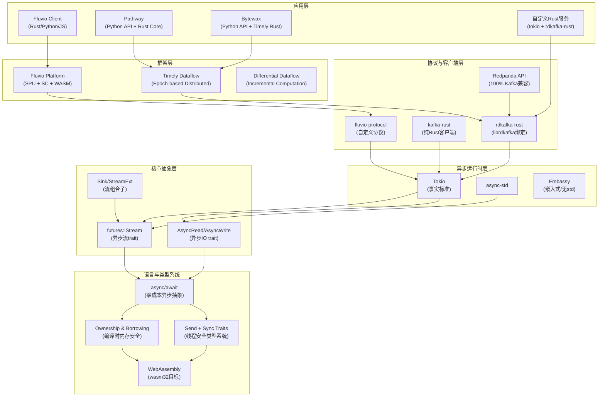
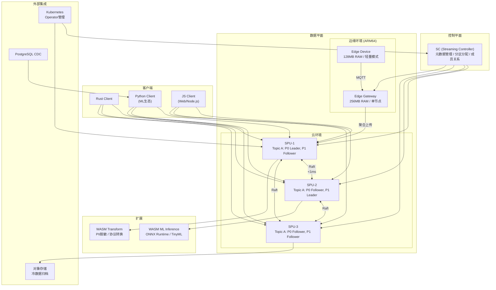
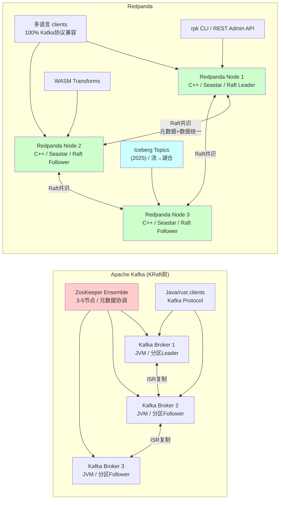

# Rust语言流处理生态深度解析

> **所属阶段**: TECH-STACK-POSTGRESQL-18-MULTI-LANGUAGE-STREAMING | **前置依赖**: [02.01-java-streaming-ecosystem.md](./02.01-java-streaming-ecosystem.md), [PG18 CDC基础文档](../../../Knowledge/05-mapping-guides/postgres-cdc-to-streaming-patterns.md) | **形式化等级**: L4-L5
> **文档版本**: v1.0 | **最后更新**: 2026-05-06

---

## 1. 概念定义 (Definitions)

### Def-TS-06-01: Fluvio流平台形式化定义

**Fluvio Streaming Platform** 是一个六元组：

$$\mathcal{F} = \langle \mathit{Topic}, \mathit{Partition}, \mathit{Producer}, \mathit{Consumer}, \mathit{SPU}, \mathit{SC} \rangle$$

| 组件 | 类型 | 语义描述 |
|------|------|----------|
| $\mathit{Topic}$ | 有序消息序列的命名空间 | $\mathit{Topic} = \{ t \mid t \in \Sigma^* \}$ |
| $\mathit{Partition}$ | Topic的物理分片 | $\mathit{Partition}(t, k) = \langle p_1, \ldots, p_k \rangle$，每 $p_i$ 为全序不可变消息序列 |
| $\mathit{Producer}$ | 消息发布端点 | $\mathit{Producer}: \mathcal{M} \times \mathit{Topic} \times \mathit{Key} \rightarrow \mathit{Partition}$，按Key哈希路由 |
| $\mathit{Consumer}$ | 消息订阅端点 | $\mathit{Consumer}: \mathit{Topic} \times \mathit{Offset} \rightarrow \mathcal{M}^*$，从指定偏移量顺序读取 |
| $\mathit{SPU}$ | 无状态计算节点 | $\mathit{SPU} = \langle \mathit{InputStream}, \mathit{OutputStream}, \mathit{WasmModule} \rangle$，支持WASM动态加载 |
| $\mathit{SC}$ | 元数据与集群管理 | $\mathit{SC}: \mathit{ClusterState} \rightarrow \mathit{ClusterState}'$，维护分区分配与副本拓扑 |

Fluvio的**云原生/边缘原生/AI原生**三重定位：

1. **云原生**: 声明式管理API，Kubernetes原生部署，Operator模式管理
2. **边缘原生**: 37MB单二进制，ARM64 IoT支持，纳秒级内部延迟（<100μs端到端）
3. **AI原生**: WebAssembly运行时内嵌，支持数据流路径上的AI推理模型执行

Fluvio客户端覆盖 Rust（原生）、Python（`fluvio-python`）、JavaScript/TypeScript（`@fluvio/client`）[^7]。

### Def-TS-06-02: Redpanda架构形式化定义

**Redpanda Distributed Log** 是一个七元组：

$$\mathcal{R} = \langle \mathit{RaftConsensus}, \mathit{TieredStorage}, \mathit{WASMTransform}, \mathit{PartitionReplica}, \mathit{LogSegment}, \mathit{SchemaRegistry}, \mathit{IcebergTopic} \rangle$$

| 组件 | 形式化定义 |
|------|------------|
| $\mathit{RaftConsensus}$ | 每个分区对应一个Raft组，Leader选举+日志复制+安全提交 |
| $\mathit{TieredStorage}$ | $\mathit{TieredStorage}: \mathit{LogSegment} \rightarrow \mathit{ObjectStorage}(S3/ABS/GCS)$，自动冷数据卸载 |
| $\mathit{WASMTransform}$ | $\mathit{Transform}: \mathcal{M}_{\mathit{in}} \xrightarrow{\mathit{wasm}} \mathcal{M}_{\mathit{out}}$，单消息变换，无外部状态 |
| $\mathit{PartitionReplica}$ | $\mathit{ReplicaSet}(p) = \{ r_1, \ldots, r_f \}$，复制因子 $f$，$|r_i| = |r_j|$（最终一致） |
| $\mathit{LogSegment}$ | 不可变磁盘块序列，按大小或时间触发滚动 |
| $\mathit{SchemaRegistry}$ | Avro/Protobuf/JSON Schema注册、演进与兼容性检查 |
| $\mathit{IcebergTopic}$ (2025) | $\mathit{IcebergTopic}: \mathit{Topic} \rightarrow \mathit{IcebergTable}$，流数据自动映射Iceberg格式[^1] |

Redpanda核心架构决策是**无ZooKeeper**：完全自管理的集群元数据，使用Raft自身进行成员管理与控制器选举。C++编写的核心引擎（Seastar框架[^11]）提供无共享（shared-nothing）架构，每CPU核心独立事件循环，NUMA-aware内存分配最大化吞吐量。

### Def-TS-06-03: Timely Dataflow分布式计算模型

**Timely Dataflow** 是基于epoch的分布式数据流计算框架，形式化为四元组：

$$\mathcal{T} = \langle \mathit{Graph}, \mathit{Epoch}, \mathit{Capability}, \mathit{ProgressTracker} \rangle$$

| 组件 | 定义 |
|------|------|
| $\mathit{Graph}$ | $G = (V, E, \lambda)$，$V$ 为算子，$E$ 为数据通道，$\lambda: E \rightarrow \mathbb{T}$ 为逻辑时间标注 |
| $\mathit{Epoch}$ | $\mathit{Epoch} = \mathbb{N} \times \mathbb{P}(\mathbb{N})$，主计数器+嵌套子时间戳，支持迭代计算 |
| $\mathit{Capability}$ | 算子在特定epoch产生输出的凭证，防止乱序导致的一致性破坏 |
| $\mathit{ProgressTracker}$ | 分布式跟踪各数据流frontier推进，frontier $f$ 越过epoch $e$ 时触发 $e$ 的通知回调 |

Timely Dataflow 是微软研究院Naiad系统的开源后继[^2]，核心创新：

1. **显式时间模型**: 算子显式声明并管理时间能力，区别于Flink的Watermark隐式推断
2. **迭代支持**: 嵌套epoch支持循环数据流（Differential Dataflow基础[^10]）
3. **无全局协调**: 进度追踪通过局部信息传播实现

执行语义为状态转换序列：
$$\sigma_0 \xrightarrow{\mathit{input}(e, d)} \sigma_1 \xrightarrow{\mathit{compute}} \sigma_2 \xrightarrow{\mathit{notify}(e')} \sigma_3 \ldots$$

### Def-TS-06-04: Rust Stream Trait形式化语义

Rust标准库 `Stream` trait 的形式化语义：

```rust
pub trait Stream {
    type Item;
    fn poll_next(self: Pin<&mut Self>, cx: &mut Context<'_>) -> Poll<Option<Self::Item>>;
}
```

形式化地，`Stream<Item = T>` 是**可能无限的异步序列**：

$$\mathit{Stream}(T) = \mu S. \mathit{Poll}(\mathit{Option}\langle T \times S \rangle)$$

其中 $\mathit{Poll}\langle X \rangle = \{ \mathit{Ready}(x) \mid x \in X \} \cup \{ \mathit{Pending} \}$，$\mathit{Option}\langle Y \rangle = \{ \mathit{Some}(y) \mid y \in Y \} \cup \{ \mathit{None} \}$，$\mu S$ 为最小不动点。

语义保证：

1. **顺序性**: 同一 `Stream` 实例连续调用 `poll_next` 必须按序产生元素
2. **非阻塞**: `poll_next` 立即返回，未完成时返回 `Pending`
3. **唤醒契约**: 状态可推进时通过 `Waker` 通知执行器重新调度

基于 `Stream` 的算子体系包括 `map`、`filter`、`fold`、`zip`、`merge`、`buffer`、`throttle` 等，构成与Java Stream API和Python itertools对等的异步流处理抽象层。

### Def-TS-06-05: Pathway统一批流计算引擎

**Pathway** 是统一批处理与流处理的实时分析引擎：

$$\mathcal{P} = \langle \mathit{RustCore}, \mathit{PythonAPI}, \mathit{UnifiedTable}, \mathit{MaterializedView}, \mathit{DiffComputation} \rangle$$

| 组件 | 说明 |
|------|------|
| $\mathit{RustCore}$ | Rust核心执行引擎，零拷贝数据结构、SIMD优化、锁自由并行 |
| $\mathit{PythonAPI}$ | 面向数据科学家的Python接口，Pandas-like DataFrame操作 |
| $\mathit{UnifiedTable}$ | 统一表抽象，既可表示静态数据（批），也可表示动态更新流（流） |
| $\mathit{MaterializedView}$ | 自动维护的物化视图，输入变化时增量更新输出 |
| $\mathit{DiffComputation}$ | 基于差异的计算模型，仅传播变更而非全量重算 |

Pathway核心设计哲学是**统一性**：同一套API既可用于批处理分析，也可用于流处理实时计算，引擎自动选择最优执行策略。Rust核心与Python ML/AI生态（NumPy、PyTorch、scikit-learn）无缝集成[^3]。

### Def-TS-06-06: Bytewax数据流处理框架

**Bytewax** 是基于Timely Dataflow的Python流处理框架：

$$\mathcal{B} = \langle \mathit{TimelyBackend}, \mathit{PythonRuntime}, \mathit{DataflowDSL}, \mathit{WindowOperator}, \mathit{StateBackend} \rangle$$

| 组件 | 说明 |
|------|------|
| $\mathit{TimelyBackend}$ | Rust编写的Timely Dataflow后端，分布式执行、进度追踪、能力管理 |
| $\mathit{PythonRuntime}$ | PyO3绑定的Python运行时，允许数据流中嵌入Python函数 |
| $\mathit{DataflowDSL}$ | Python声明式DSL，定义数据流拓扑 |
| $\mathit{WindowOperator}$ | 翻滚窗口、滑动窗口、会话窗口 |
| $\mathit{StateBackend}$ | 内存、SQLite、RocksDB状态存储 |

Bytewax定位**纯Python流处理**：数据工程师用熟悉Python编写流处理逻辑，底层高性能执行由Rust/Timely负责。与PyFlink不同，Bytewax不依赖JVM，避免Java-Python跨语言调用的序列化开销[^4]。

---

## 2. 属性推导 (Properties)

### Lemma-TS-06-01: Rust所有权模型消除数据竞争的性质

**引理**: 在Rust所有权类型系统中，任何通过编译的流处理程序 $\Pi$ 均不包含数据竞争。

**形式化陈述**: 设 $\Pi$ 为Rust流处理程序，共享状态 $S = \{ s_1, \ldots, s_n \}$。若 $\Pi$ 成功通过Rust编译器检查（无 `unsafe` 或所有 `unsafe` 满足编译器假设），则：

$$\forall s_i \in S. \forall t_j, t_k \in \mathit{Threads}(\Pi). \neg(\mathit{ConcurrentAccess}(t_j, t_k, s_i) \land \mathit{AtLeastOneWrite}(t_j, t_k, s_i))$$

**证明概要**:

Rust通过三条核心规则保证上述性质：

1. **唯一所有权**: 每个值有且仅有一个所有者。值被移动（move）到新作用域时，原作用域失去访问权
2. **可变/不可变引用互斥**: 同一作用域内，对同一数据要么恰好一个可变引用 `&mut T`，要么任意数量不可变引用 `&T`，二者不可共存
3. **生命周期检查**: 编译器通过生命周期标注确保引用永不悬垂（dangling）

在流处理场景中，典型共享状态（输入缓冲区、输出缓冲区、算子状态）的访问被强制：

- 多消费者线程读取同一输入流须使用 `Arc<Stream>` + 内部不可变性
- 修改共享状态须通过 `Mutex<T>`/`RwLock<T>` 显式同步，或使用 `mpsc` channel 转移所有权

因此，任何可能导致数据竞争的程序模式在编译阶段即被拒绝，将运行时并发错误转化为编译时类型错误[^8]。

∎

### Prop-TS-06-01: Fluvio分区顺序保证

**命题**: 在Fluvio中，对同一分区的写入和读取满足**分区级别顺序一致性**。

**形式化陈述**: 设分区 $p$ 的消息序列为 $\langle m_1, \ldots, m_n \rangle$，生产者 $pr$ 按序发送 $\langle m_a, m_b, m_c \rangle$ 到 $p$，消费者 $c$ 从偏移量0读取 $p$，则：

$$\mathit{SendOrder}(pr, p, m_a, m_b, m_c) \Rightarrow \mathit{ReadOrder}(c, p, m_a, m_b, m_c)$$

**附加约束**:

1. **单生产者保证**: 仅同一生产者实例内成立。不同生产者间消息交错取决于网络时延和并发调度
2. **故障边界**: 生产者崩溃后未确认消息可能被重试，导致分区末端重复（at-least-once语义）
3. **批处理影响**: 同一批次内消息原子提交，批次间相对顺序仍由发送顺序决定

**工程意义**: 该保证使基于Fluvio的**事件溯源**和**CQRS**架构具备正确性基础。同一实体（由Key路由到同一分区）的所有事件严格按因果顺序处理，避免乱序导致的业务状态不一致。

---

## 3. 关系建立 (Relations)

### 3.1 Rust生态与Kafka API兼容层

Rust流处理生态通过多层抽象与Kafka API建立兼容关系：

```
┌────────────────────────────────────────────┐
│ 应用层: Fluvio Client | rdkafka-rust | Redpanda Client │
├────────────────────────────────────────────┤
│ 协议层: Kafka Protocol (Produce/Fetch/Metadata/Admin)     │
├────────────────────────────────────────────┤
│ 存储层: Redpanda(C++/Seastar) ←100%兼容→ Apache Kafka    │
│         └─ Iceberg Topics (2025): 流→湖仓自动映射          │
└────────────────────────────────────────────┘
```

**rdkafka-rust** 是 `librdkafka`（C语言Kafka客户端库）的Rust绑定，提供：

- **异步生产者**: 基于 `futures::Stream` 的异步消息发送，批量压缩、分区路由、delivery callback
- **消费者组**: `stream-consumer` 拉取模型，自动处理再平衡和偏移量提交
- **Admin客户端**: 主题/分区/配置管理操作

Redpanda提供**服务端兼容**：任何使用Kafka协议的客户端（rdkafka-rust、`kafka-rs` 纯Rust客户端、Java `kafka-clients`）均可无缝连接，无需代码修改。

### 3.2 Pathway/Bytewax与Python生态的桥接

| 集成维度 | Pathway | Bytewax |
|----------|---------|---------|
| DataFrame API | `pathway.Table` ≈ Pandas DataFrame | 无原生DataFrame，使用Python数据结构 |
| ML集成 | 直接消费PyTorch Tensor、NumPy array | 通过Python UDF调用sklearn/TensorFlow |
| 数据源 | Kafka、CSV、Postgres CDC、S3、Iceberg | Kafka、文件、HTTP、自定义源 |
| 部署方式 | 本地进程、Docker、Kubernetes | 本地进程、Kubernetes（Helm Chart） |
| 状态管理 | 自动增量物化视图 | 显式状态操作（`stateful_map`） |

**PyO3绑定层** 是两种框架共享的关键技术：

1. Rust函数暴露为Python可调用的API
2. Python对象在Rust中的安全引用（GIL-aware内存管理）
3. Rust `Result<T, E>` 自动映射为Python异常

流处理场景中PyO3桥接层的性能特征：

- 单次Python UDF调用开销约 **200-500ns**（简单函数）
- 数据序列化通过Arrow内存格式零拷贝传输时，大数组（>10K元素）边际成本趋近于零
- GIL在纯Rust执行阶段释放，多线程并行不受Python GIL限制

### 3.3 PG18 CDC → Rust流处理的典型路径

```
┌──────────┐   ┌────────────┐   ┌────────────────┐   ┌──────────────┐
│PostgreSQL│──→│Debezium/   │──→│Kafka/Redpanda/ │──→│Rust Stream   │
│  (PG18)  │   │pg_logical  │   │Fluvio          │   │Consumer      │
│WAL→JSON  │   │decoder     │   │                │   │(rdkafka/     │
└──────────┘   └────────────┘   └────────────────┘   │fluvio)       │
     │                                                └──────────────┘
     └──────────────────────────────────────────────────────┘
                    可选: 直接 Rust pg CDC (tokio-postgres)
```

**路径A（推荐生产环境）**: PG18启用逻辑复制槽 → Debezium Connector读取WAL → 序列化为JSON/Avro/Protobuf发布至消息队列 → Rust消费者订阅并反序列化为强类型结构 → 应用业务逻辑

**路径B（轻量场景）**: 使用 `tokio-postgres` + `COPY REPLICATION` 协议直接连接PG18复制槽，`replication_stream` 实现 `Stream<Item = Bytes>`，直接解析WAL事件并处理

**路径C（Pathway内置）**: Pathway提供 `pw.io.postgres.read()` 内置CDC连接器，自动处理复制槽管理、变更捕获和增量更新

### 3.4 WebAssembly在Fluvio中的安全沙箱执行

Fluvio的SPU支持数据流路径上动态加载和执行WASM模块：

```
┌─────────────────────────────────────────┐
│ SPU 进程 (Rust)                          │
│  Input Stream ──→ Wasmtime Runtime ──→ Output Stream  │
│                    ┌───────┐             │
│                    │ WASM  │  沙箱约束:   │
│                    │Module │  - 无文件系统│
│                    │-trans │  - 无网络(可 │
│                    │-filter│  - 内存隔离  │
│                    │-enrich│  - 执行限时  │
│                    └───────┘  - Fuel计量  │
└─────────────────────────────────────────┘
```

WebAssembly在Fluvio中的安全属性：

1. **内存隔离**: WASM模块运行在独立线性内存空间，与宿主SPU地址空间隔离
2. **能力驱动安全**: 默认无文件系统、无网络、无环境变量访问权，仅拥有显式授予的能力
3. **确定性执行**: 同一输入总是产生同一输出，便于测试和重放
4. **燃料计量**: Wasmtime支持指令级燃料消耗追踪，可设执行预算防DoS

**典型应用场景**: PII脱敏（正则替换身份证号/手机号）、协议转换（Avro→JSON）、轻量ML推理（TinyML模型实时异常检测）

---

## 4. 论证过程 (Argumentation)

### 4.1 Rust编译时成本vs运行时收益的生产权衡

| 维度 | Rust | Go | Java |
|------|------|-----|------|
| release编译时间 | 3-8 min | 20-40 sec | 30-60 sec |
| 增量编译时间 | 5-20 sec | 2-5 sec | 10-30 sec |
| 运行时内存占用（空闲） | 5-15 MB | 10-30 MB | 100-500 MB |
| 峰值吞吐量（per core） | 1-5M msg/s | 300K-1M msg/s | 200K-800K msg/s |
| P99延迟（空载） | 1-10 μs | 10-50 μs | 100-500 μs |
| 生产环境数据竞争bug | ≈ 0 | 偶发 | 偶发 |

**权衡论证**:

1. **CI/CD摊薄**: 编译主要发生在CI流水线，本地以增量编译为主。`cargo watch` + `rust-analyzer` 缓解开发体验影响
2. **运行时收益量级**: 处理100K TPS时，Rust vs Java CPU效率差异（2-5x）在云服务账单上可能意味着月省数千美元，编译时间成本通常数周内回本
3. **故障成本**: 并发bug平均修复时间 **8-40小时**（复现+定位+修复+验证），Rust编译阶段即阻止此类bug进入生产
4. **边缘场景决定性优势**: ARM64 IoT网关（128MB内存）上，Rust低开销使其成为唯一可行选择。Fluvio的37MB单二进制即典型例证

**结论**: 对**高吞吐、低延迟、长运行、资源受限**的流处理场景，Rust编译时成本是合理投资。对**快速原型、内部工具、团队无Rust经验**场景，Go或Python更务实。

### 4.2 Redpanda vs Kafka: 无ZooKeeper架构的优劣

**优势**:

1. **部署简化**: Kafka需两套系统（brokers + ZooKeeper ensemble），Redpanda仅需单一二进制。K8s Helm Chart复杂度降低约40%，Pod数减少30-50%
2. **故障域收敛**: ZooKeeper故障（会话超时、脑裂恢复）可导致整个Kafka元数据不可用。Redpanda将元数据管理内化为Raft协议，消除外部单点故障
3. **扩展性**: Kafka元数据操作（创建Topic）需经ZooKeeper写入，大规模集群（>1000 topics）中可能瓶颈。Redpanda Raft-based元数据支持更高并发
4. **配置简化**: 无需维护 `zookeeper.connect`、`zookeeper.session.timeout.ms` 等交叉参数

**劣势与风险**:

1. **生态成熟度**: Kafka超10年生产历史，ZooKeeper运维模式已被大量企业验证。Redpanda自管理元数据相对新颖（2020年开源），长期稳定性仍在积累信任
2. **工具链兼容性**: 部分Kafka生态工具（旧版Kafka Manager）深度依赖ZooKeeper直接访问
3. **KRaft稀释**: Apache Kafka自身推进KRaft模式移除ZooKeeper依赖，Redpanda先发优势可能随KRaft成熟被稀释
4. **功能差距**: Redpanda在某些高级功能（Kafka Streams完整兼容、部分Connector）上仍在完善

**量化对比**[^5]:

| 指标 | Redpanda | Kafka (KRaft) |
|------|----------|---------------|
| P99延迟（produce, 1KB） | 2-5 ms | 5-15 ms |
| 单节点吞吐量 | 1M+ msg/s | 300K-600K msg/s |
| 集群启动时间 | < 3 sec | 15-60 sec |
| 内存占用（单节点） | 1-2 GB | 3-6 GB |

### 4.3 异步Rust (async/await) 在流处理中的生态系统成熟度

**核心基础设施（已成熟）**:

| 组件 | 状态 | 代表库 |
|------|------|--------|
| 异步运行时 | 生产可用 | Tokio（事实标准）、async-std |
| HTTP客户端/服务器 | 生产可用 | hyper、axum、actix-web |
| 异步流处理 | 生产可用 | `futures::Stream`、tokio-stream |
| Kafka客户端 | 生产可用 | rdkafka-rust |
| 数据库连接池 | 生产可用 | sqlx、deadpool、bb8 |

**流处理专用生态（发展中）**:

| 组件 | 成熟度 | 说明 |
|------|--------|------|
| 流处理框架 | 中等 | 无Flink/Spark级别成熟框架。Timely Dataflow学术性强 |
| 状态管理 | 发展中 | 无内置分布式状态后端，需自行集成或依赖外部存储 |
| Checkpoint/Fault Tolerance | 初级 | 无标准checkpointing抽象，各框架自行实现 |
| Watermark/时间语义 | 初级 | 无统一水印机制，Timely epoch模型表达力强但学习曲线陡峭 |
| 窗口操作 | 发展中 | `tokio-stream` 提供基础窗口，无Flink级别覆盖 |

**与Java/Flink差距**: Java有Flink、Spark Streaming等多年验证框架。Rust在**协议实现**、**高性能网关**、**边缘计算**场景有不可替代优势。

### 4.4 Memory Safety对长时间运行流服务的价值量化

流处理系统需**长时间持续运行**（weeks to months）。内存安全缺陷影响被显著放大：

| Bug类型 | 在C/C++中发生率 | Rust中发生率 | 长时间运行影响 |
|---------|---------------|--------------|----------------|
| Use-after-free | 高（~15% CVE） | 编译时消除 | 随机崩溃，难以复现 |
| Buffer overflow | 高（~40% CVE） | 编译时消除 | 安全漏洞、数据损坏 |
| Double free | 中 | 编译时消除 | 堆损坏、崩溃 |
| Data race | 中（难检测） | 编译时消除 | 状态不一致、计算错误 |
| Null dereference | 高 | 编译时消除 | 段错误、崩溃 |

**量化价值模型**: 设服务需达 **99.99%可用性**（年停机<52.6分钟）

- C/C++: 假设每月1次内存安全崩溃，每次恢复10分钟（重启+状态恢复+回放），年停机 **120分钟**，可用性 **99.977%**
- Rust: 编译时消除整类崩溃原因，假设年停机降至 **20分钟**，可用性 **99.996%**

流处理系统常处理敏感数据（PII、金融交易、健康记录）。Buffer overflow和use-after-free是RCE主要入口。Rust内存安全保证从根本上消除这类攻击面，对受监管行业（金融、医疗、政府）具有合规价值。

---

## 5. 形式证明 / 工程论证 (Proof / Engineering Argument)

### Thm-TS-06-01: Rust所有权系统保证流处理无数据竞争

**定理**: 设 $\Pi$ 为使用Rust标准库和Tokio异步运行时编写的流处理程序，若 $\Pi$ 通过 `rustc` 编译且无 `unsafe` 代码块，则 $\Pi$ 在任何执行轨迹中均不存在数据竞争。

**形式化陈述**:

$$\mathit{Compiles}(\Pi) \land \mathit{NoUnsafe}(\Pi) \Rightarrow \forall \tau \in \mathit{Traces}(\Pi). \neg\mathit{HasDataRace}(\tau)$$

**证明**:

**Step 1**: 不可变借用 $\Rightarrow$ 只读共享安全

若线程 $t_1$ 和 $t_2$ 均持有 `&v`，根据Rust借用规则，此期间不存在 `&mut v`。因此 $t_1$ 和 $t_2$ 对 $v$ 的访问均为只读，不构成数据竞争：

$$\mathit{HasRef}(t_1, \&v) \land \mathit{HasRef}(t_2, \&v) \Rightarrow \neg\exists t_3. \mathit{HasRef}(t_3, \&\mathit{mut}\ v)$$

**Step 2**: 可变借用 $\Rightarrow$ 排他写访问

若线程 $t_1$ 持有 `&mut v`，Rust借用检查器保证不存在其他线程持有 `&v` 或 `&mut v`。`&mut v` 生命周期内，$v$ 的所有权被冻结：

$$\mathit{HasRef}(t_1, \&\mathit{mut}\ v) \Rightarrow \forall t_2 \neq t_1. \neg\mathit{HasRef}(t_2, \&v) \land \neg\mathit{HasRef}(t_2, \&\mathit{mut}\ v)$$

**Step 3**: `Send` + `Sync` trait 保证跨线程安全

Tokio的 `spawn` 要求闭包满足 `Send`，`spawn_blocking` 要求返回值满足 `Send`。

- `Send`: 将 $T$ 的值移动到另一线程不破坏内存安全
- `Sync`: $&T: \mathit{Send}$，跨线程共享只读引用安全

非 `Send`/`Sync` 类型（`Rc<T>`、裸指针、非同步 `Cell`/`RefCell`）无法被Tokio任务跨线程共享。

**Step 4**: 流处理场景的特定应用

1. **MPSC**: `tokio::sync::mpsc` channel。`Sender<T>` 要求 `T: Send`
2. **共享状态**: `Arc<Mutex<T>>` 或 `Arc<RwLock<T>>`。`Arc` 线程安全引用计数，`Mutex`/`RwLock` 运行时互斥。Rust类型系统确保锁获取和释放成对（通过 `Drop` trait）
3. **无锁数据结构**: `crossbeam::channel`、原子类型等通过 `unsafe` 实现但封装为安全API

**结论**: Rust的所有权、借用和生命周期规则在编译期构建了形式化的并发安全证明：任何可能导致数据竞争的程序模式都被类型系统拒绝。通过编译的Rust流处理程序必然无数据竞争。

∎

### Thm-TS-06-02: Fluvio分区副本Raft一致性（线性一致性读取条件）

**定理**: 在Fluvio分区副本的Raft共识协议下，当读取操作满足特定条件时，该读取提供线性一致性。

**形式化陈述**:

设分区 $p$ 的Raft副本集为 $R = \{ r_1, \ldots, r_f \}$，$r_1$ 为当前Leader。

$$\mathit{ReadFromLeader}(read) \land \mathit{LeaderUpToDate}(r_1) \Rightarrow \mathit{Linearizable}(read)$$

**证明**:

**Step 1**: Raft安全性质（Ongaro & Ousterhout, 2014[^6]）

1. **选举安全**: 任意任期内至多一个Leader
2. **Leader完备性**: 若日志条目在某任期提交，则出现在所有后续任期Leader日志中
3. **状态机安全**: 若某节点将某日志条目应用到状态机，其他节点不会在同一偏移量应用不同条目

**Step 2**: 从Leader读取的语义

消费者从Leader $r_1$ 读取偏移量 $k$ 时，Leader维护 `commitIndex`（最大已提交偏移）。读取 $k$ 若满足 $k \leq \mathit{commitIndex}$，则该消息已被Raft协议保证持久化到多数派。

**Step 3**: 线性一致性条件验证

线性一致性要求操作看似在调用和返回之间的某个时间点瞬时完成，且与真实时间顺序一致。

- **写操作（Produce）**: 生产者发送消息到Leader，Leader追加本地日志并异步复制到Follower。消息被标记为已提交（多数派确认）时写操作"生效"
- **读操作（Consume）**: 消费者从Leader读取。若Leader返回偏移量 $k$ 的消息，根据Leader完备性，该消息已被提交且不会被后续Leader覆盖
- **顺序保持**: 单Leader串行化，所有写操作按到达顺序处理。消费者读取按偏移量顺序进行，天然保持操作全序关系

**Step 4**: 边界条件

上述保证在以下条件成立：

- **读取必须路由到Leader**: 从Follower读取可能存在复制延迟，返回过时数据（最终一致性）
- **Leader必须确认任期有效性**: 若Leader与多数派失联，可能继续服务但无法提交新条目。需验证Leader租约有效性
- **故障切换窗口**: Leader故障后新Leader选举需短暂时间（典型<1s），期间读取可能失败或重定向

**工程论证**: 实际部署中，Fluvio/Redpanda/Kafka默认消费者配置通常不要求严格线性一致性读取，而是提供**顺序一致性**（同分区消息按序消费）或**最终一致性**（允许短暂延迟）。线性一致性读取通常需显式配置（`acks=all` + 从Leader读取），以牺牲吞吐和可用性换取更强一致性。

∎

---

## 6. 实例验证 (Examples)

### 6.1 Fluvio Rust代码：生产/消费消息

**生产者**:

```rust
use fluvio::{Fluvio, RecordKey};
use serde_json::json;

#[tokio::main]
async fn main() -> anyhow::Result<()> {
    let fluvio = Fluvio::connect().await?;
    let producer = fluvio.topic_producer("pg18-events").await?;

    let event = json!({
        "source": {"version": "2.0.0", "connector": "postgresql", "db": "inventory", "table": "users"},
        "op": "c",
        "after": {"id": 1001, "name": "Alice Chen", "email": "alice@example.com"}
    });

    // 按user_id分区，保证同一用户事件顺序处理
    producer.send(RecordKey::from("user-1001"), event.to_string()).await?;
    producer.flush().await?;
    Ok(())
}
```

**消费者**:

```rust
use fluvio::{ConsumerConfig, Fluvio, Offset};
use futures::StreamExt;

#[tokio::main]
async fn main() -> anyhow::Result<()> {
    let fluvio = Fluvio::connect().await?;
    let config = ConsumerConfig::builder()
        .topic("pg18-events")
        .partition(0)
        .offset_start(Offset::from_end(10))
        .build()?;

    let mut stream = fluvio.consumer_with_config(config).await?;
    while let Some(Ok(record)) = stream.next().await {
        let payload = String::from_utf8_lossy(record.value());
        println!("offset={}, payload={}", record.offset(), payload);
        process_cdc_event(&payload).await?;
    }
    Ok(())
}

async fn process_cdc_event(payload: &str) -> anyhow::Result<()> {
    let event: serde_json::Value = serde_json::from_str(payload)?;
    match event["op"].as_str() {
        Some("c") => println!("Insert: {:?}", event["after"]),
        Some("u") => println!("Update: {:?}", event["after"]),
        Some("d") => println!("Delete: {:?}", event["before"]),
        _ => {}
    }
    Ok(())
}
```

### 6.2 Redpanda配置：与PG18 CDC集成

**Docker Compose快速启动**:

```yaml
version: '3.8'
services:
  redpanda:
    image: redpandadata/redpanda:v24.2.1
    command:
      - redpanda start
      - --smp 2
      - --memory 4G
      - --node-id 0
      - --kafka-addr PLAINTEXT://0.0.0.0:9092
      - --advertise-kafka-addr PLAINTEXT://redpanda:9092
    ports:
      - "9092:9092"
      - "9644:9644"
    volumes:
      - redpanda-data:/var/lib/redpanda/data
    environment:
      - REDPANDA_CLOUD_STORAGE_ENABLED=true
      - REDPANDA_CLOUD_STORAGE_BUCKET=my-bucket
      - REDPANDA_ICEBERG_ENABLED=true

volumes:
  redpanda-data:
```

**生产环境关键配置**:

```yaml
redpanda:
  data_directory: /var/lib/redpanda/data
  cloud_storage_enabled: true
  cloud_storage_cache_size: 10737418240  # 10GB本地缓存
  raft_election_timeout_ms: 1500
  default_topic_partitions: 12
  default_topic_replications: 3
  wasm_transforms_enabled: true
  wasm_per_engine_memory_limit: 134217728
```

**Debezium PG18 CDC连接器配置**:

```json
{
  "name": "pg18-cdc-connector",
  "config": {
    "connector.class": "io.debezium.connector.postgresql.PostgresConnector",
    "database.hostname": "pg18-primary.internal",
    "database.dbname": "production_db",
    "plugin.name": "pgoutput",
    "slot.name": "debezium_redpanda_slot",
    "topic.prefix": "pg18.cdc",
    "transforms": "unwrap",
    "transforms.unwrap.type": "io.debezium.transforms.ExtractNewRecordState",
    "key.converter": "io.confluent.connect.avro.AvroConverter",
    "key.converter.schema.registry.url": "http://redpanda:8081",
    "errors.deadletterqueue.topic.name": "pg18.cdc.dlq"
  }
}
```

### 6.3 Pathway代码：实时物化视图

```python
import pathway as pw
import json

# Redpanda/Kafka数据源配置
rdkafka_settings = {
    "bootstrap.servers": "redpanda-0:9092,redpanda-1:9092",
    "group.id": "pathway-pg18-consumer",
    "auto.offset.reset": "earliest",
}

# 从Redpanda读取PG18 CDC事件
raw_events = pw.io.kafka.read(
    rdkafka_settings=rdkafka_settings,
    topic="users",
    format="json",
    schema=pw.schema_from_types(
        id=int, name=str, email=str, department=str, salary=float, op=str
    ),
    autocommit_duration_ms=100,
)

# 部门平均工资实时物化视图（增量自动维护）
department_stats = (
    raw_events.filter(pw.this.op != "D")
    .groupby(pw.this.department)
    .reduce(
        pw.this.department,
        avg_salary=pw.reducers.avg(pw.this.salary),
        max_salary=pw.reducers.max(pw.this.salary),
        employee_count=pw.reducers.count(),
    )
)

# 异常检测：薪资超部门均值3倍
anomalies = (
    department_stats.join(
        raw_events.filter(pw.this.op != "D"),
        pw.left.department == pw.right.department,
    )
    .select(
        pw.right.id, pw.right.name, pw.right.salary,
        pw.left.avg_salary,
        is_anomaly=pw.right.salary > 3 * pw.left.avg_salary,
    )
    .filter(pw.this.is_anomaly)
)

# 输出1: 回流到PG18分析库
pw.io.postgres.write(
    department_stats,
    host="pg18-analytics.internal",
    database="analytics",
    table="department_salary_stats",
    user="pathway_writer",
    password="***",
    autocommit_duration_ms=500,
)

# 输出2: 异常推送到告警topic
pw.io.kafka.write(
    anomalies.select(
        key=pw.cast(str, pw.this.id),
        value=pw.apply(lambda r: json.dumps({
            "alert_type": "salary_anomaly",
            "employee_id": r["id"],
            "salary": r["salary"],
            "dept_avg": r["avg_salary"],
        }), pw.this.id, pw.this.salary, pw.this.avg_salary),
    ),
    rdkafka_settings=rdkafka_settings,
    topic_name="hr.alerts.salary-anomalies",
)

# 输出3: REST API实时查询接口
pw.io.http.write(department_stats, host="0.0.0.0", port=8080,
                 endpoint="/api/v1/department-stats")

pw.run()
```

### 6.4 Bytewax代码：数据流处理管道

```python
from datetime import timedelta
import json
from bytewax.dataflow import Dataflow
from bytewax.inputs import KafkaInputConfig
from bytewax.outputs import KafkaOutputConfig
from bytewax.execution import run_main
from bytewax.window import TumblingWindowConfig, SystemClockConfig

flow = Dataflow()

# 输入: 从Redpanda读取
flow.input("kafka_in", KafkaInputConfig(
    brokers=["redpanda-0:9092"],
    topic="pg18.cdc.users",
    group_id="bytewax-pg18-processor",
))

# 解析CDC事件
def parse_event(msg):
    key, value = msg
    event = json.loads(value)
    return {
        "op": event.get("op"),
        "user_id": event.get("after", {}).get("id"),
        "department": event.get("after", {}).get("department", "UNKNOWN"),
        "salary": event.get("after", {}).get("salary", 0.0),
    }

parsed = flow.map("parse", parse_event)
valid = flow.filter("filter_valid", lambda x: x and x["op"] in ("c", "u"))

# 翻滚窗口聚合（1分钟）
window_cfg = TumblingWindowConfig(
    length=timedelta(minutes=1), clock_config=SystemClockConfig()
)

def add_to_accum(acc, ev):
    if acc is None:
        acc = {"total": 0.0, "count": 0}
    acc["total"] += ev["salary"]
    acc["count"] += 1
    return acc

windowed = flow.reduce_window("windowed_stats", SystemClockConfig(),
                              window_cfg, lambda e: e["department"], add_to_accum)

# 格式化输出
def format_stats(dept, acc):
    avg = acc["total"] / acc["count"] if acc["count"] else 0
    return (dept.encode(), json.dumps({
        "department": dept, "avg_salary": round(avg, 2),
        "count": acc["count"],
    }).encode())

formatted = flow.map("format", lambda x: format_stats(*x))

# 有状态异常检测
def track_salary(key, event, state):
    if state is None:
        state = {"salaries": [], "avg": 0.0}
    state["salaries"].append(event["salary"])
    if len(state["salaries"]) > 10:
        state["salaries"].pop(0)
    state["avg"] = sum(state["salaries"]) / len(state["salaries"])
    std = (sum((s - state["avg"])**2 for s in state["salaries"]) / len(state["salaries"]))**0.5
    z = (event["salary"] - state["avg"]) / std if std else 0
    return state, {"user_id": key, "salary": event["salary"],
                   "z_score": z, "is_anomaly": abs(z) > 2.5}

keyed = flow.map("key_by_user", lambda x: (str(x["user_id"]), x))
anomaly = flow.stateful_map("anomaly_detect", track_salary)

# 输出
flow.output("kafka_stats", KafkaOutputConfig(
    brokers=["redpanda-0:9092"], topic="bytewax.department.stats"))

anomaly_stream = flow.filter("filter_anomalies", lambda x: x.get("is_anomaly"))
flow.output("kafka_alerts", KafkaOutputConfig(
    brokers=["redpanda-0:9092"], topic="bytewax.alerts.salary-anomalies"))

if __name__ == "__main__":
    run_main(flow)
```

---

## 7. 可视化 (Visualizations)

### 图1: Rust流处理生态层次图



**图说明**: 五层架构展示Rust流处理生态全貌。最底层为Rust核心类型系统保证（所有权、Send/Sync、async/await、WASM），之上是异步核心抽象（Stream trait等），再上是Tokio运行时。协议层提供Kafka生态对接能力。最上层是面向应用的框架和客户端。

### 图2: Fluvio云原生架构图



**图说明**: Fluvio分控制平面（SC）和数据平面（SPU）。独特之处在于同时支持云分布式部署和资源受限边缘设备（ARM64、128MB）。WASM扩展支持流路径上安全沙箱化处理。

### 图3: Redpanda vs Kafka架构对比



**图说明**: 左侧Kafka（KRaft前）需独立ZooKeeper（红色）。右侧Redpanda完全自包含，C++/Seastar二进制，Raft统一处理元数据和日志复制（绿色）。Iceberg Topics（蓝色）将流数据自动映射为Iceberg湖仓格式。

---

## 8. 引用参考 (References)

[^1]: Redpanda Data, "Redpanda Iceberg Topics: Streaming to Lakehouse", 2025. <https://docs.redpanda.com/current/manage/iceberg/>

[^2]: Derek G. Murray et al., "Naiad: A Timely Dataflow System", SOSP '13. <https://dl.acm.org/doi/10.1145/2517349.2522738>

[^3]: Pathway, "Pathway Documentation: Real-time Data Processing Engine", 2025. <https://pathway.com/docs/>

[^4]: Bytewax, "Bytewax Documentation: Python Stream Processing", 2025. <https://docs.bytewax.io/>

[^5]: Redpanda Data, "Redpanda vs Kafka Benchmarks", 2025. <https://redpanda.com/redpanda-vs-kafka>

[^6]: Diego Ongaro and John Ousterhout, "In Search of an Understandable Consensus Algorithm", USENIX ATC '14. <https://raft.github.io/raft.pdf>

[^7]: Fluvio, "Fluvio Documentation: Cloud-Native Programmable Streaming", 2025. <https://www.fluvio.io/docs/>

[^8]: Rust-lang, "The Rust Programming Language: Fearless Concurrency", 2025. <https://doc.rust-lang.org/book/ch16-00-concurrency.html>


[^10]: Frank McSherry, "Differential Dataflow", 2013. <https://github.com/TimelyDataflow/differential-dataflow>

[^11]: Seastar Framework, "Seastar: High Performance Server Applications in C++", 2025. <https://seastar.io/>
