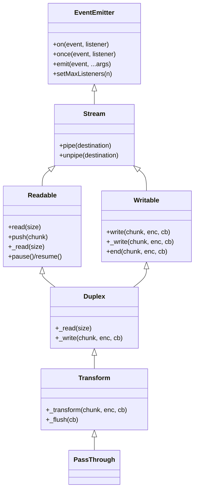
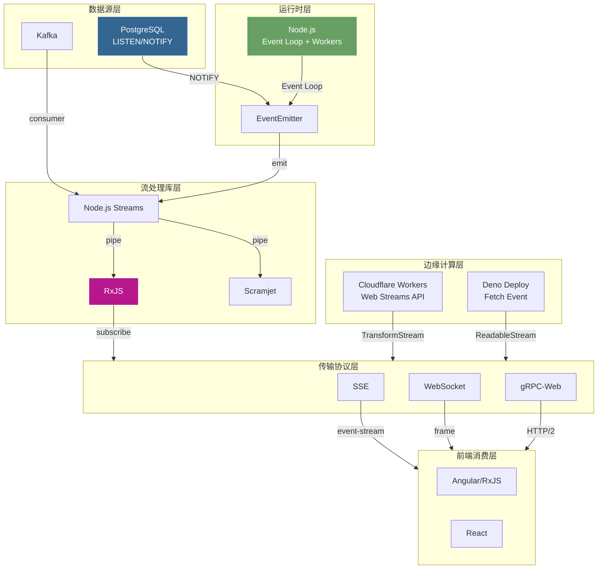
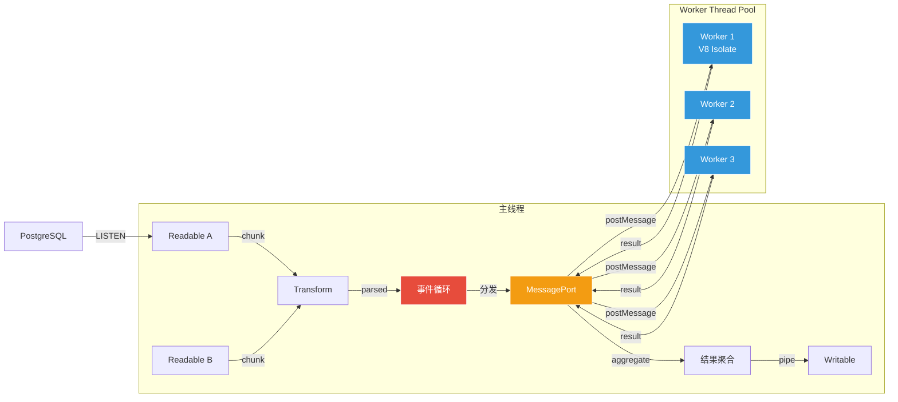

# TypeScript/JavaScript流处理生态深度解析 — Scramjet、Node.js Streams、RxJS、事件驱动架构

> 所属阶段: TECH-STACK-POSTGRESQL-18-MULTI-LANGUAGE-STREAMING | 前置依赖: [02.01-go-streaming-ecosystem.md](./02.01-go-streaming-ecosystem.md), [02.02-rust-streaming-ecosystem.md](./02.02-rust-streaming-ecosystem.md), [01.04-pg18-cdc-fdw-streaming.md](../01-theory-foundation/01.02-pg18-wal-logical-replication-theory.md) | 形式化等级: L3-L4

## 1. 概念定义 (Definitions)

**Def-TS-08-01 Node.js Stream的形式化定义**

Node.js Stream是基于事件驱动的字节或对象序列抽象接口，形式化定义为四元组：

```
Stream := ⟨State, Mode, Buffer, EventEmitter⟩
```

- `State ∈ {INIT, FLOWING, PAUSED, CLOSED, ERRORED}`：流当前状态
- `Mode ∈ {objectMode, byteMode}`：对象流与字节流区分
- `Buffer ∈ Seq⟨Chunk⟩`：内部缓冲队列
- `EventEmitter`：底层事件分发机制

四种核心流类型：

| 类型 | 形式化签名 | 核心操作 |
|------|-----------|---------|
| **Readable** | `⟨read: () → Chunk ∪ {null}, push: Chunk → bool⟩` | 生产数据 |
| **Writable** | `⟨write: Chunk × encoding × cb → bool⟩` | 消费数据 |
| **Transform** | `⟨_transform: Chunk × encoding × cb → void⟩` | 双向转换 |
| **Duplex** | `⟨ReadableInterface × WritableInterface⟩` | 全双工独立读写 |

所有流继承自 `EventEmitter`，遵循统一背压协议：`Writable.write(chunk)` 返回 `false` 时写入方暂停并监听 `drain` 事件恢复。

---

**Def-TS-08-02 EventEmitter的事件驱动模式**

EventEmitter是Node.js核心发布-订阅机制，形式化定义为三元组：

```
EventEmitter := ⟨Event, Listener[], emit: Event × Args → void⟩
```

- `Event`：字符串或 `Symbol` 事件标识符空间
- `Listener[]`：每个事件对应的回调函数序列
- `emit(event, ...args)`：同步遍历调用该事件所有监听器

关键语义：

```
on(event, listener)    : ListenerMap[event] ← ListenerMap[event] ∪ {listener}
off(event, listener)   : ListenerMap[event] ← ListenerMap[event] \\ {listener}
once(event, listener)  : 一次性监听器，执行后自动移除
emit(event, ...args)   : ∀l ∈ ListenerMap[event], l(...args)  // 同步顺序执行
```

Node.js默认 `maxListeners = 10`，超过阈值触发 `MaxListenersExceededWarning`。可通过 `setMaxListeners(n)` 调整或设为 `Infinity`。

---

**Def-TS-08-03 RxJS Observable：基于推送的响应式流**

RxJS核心抽象 `Observable` 形式化定义为：

```
Observable⟨T⟩ := ⟨subscribe: Observer⟨T⟩ → Subscription⟩
Observer⟨T⟩   := ⟨next: T → void, error: Error → void, complete: () → void⟩
Subscription  := ⟨unsubscribe: () → void⟩
```

`Observable` 是惰性求值的推送集合，订阅前无副作用，订阅后通过 `Observer` 向消费者推送值。与Pull模型的 `Iterator` 形成对偶：

| 维度 | Iterator（拉取） | Observable（推送） |
|------|----------------|-------------------|
| 控制权 | 消费者 | 生产者 |
| 核心方法 | `next(): T \| undefined` | `subscribe(observer)` |
| 多播 | 单消费者 | 支持多播（Subject） |
| 背压 | 按需拉取 | 显式策略（throttle, sample） |

操作符采用函数式组合：`source.pipe(map(f), filter(p), mergeMap(g))`。

---

**Def-TS-08-04 Scramjet流：函数式组合的高阶流抽象**

Scramjet（v0.10.1）是函数式响应流编程框架，形式化定义为：

```
ScramjetStream⟨T⟩ := ⟨DataStream | StringStream | BufferStream, Operators[], ExecutionContext⟩
```

核心特性：

1. **类型特化流**：`DataStream⟨T⟩`（对象）、`StringStream`（字符串）、`BufferStream`（二进制）
2. **高阶函数式API**：转换返回新流实例，链式组合与惰性求值
3. **隐式背压管理**：基于Node.js `highWaterMark` 自动传播
4. **并行执行**：通过 `cluster` 和插件生态实现多核并行

---

**Def-TS-08-05 Node.js事件循环的流处理语义**

Node.js事件循环是单线程异步I/O调度核心，六阶段循环：

```
timers → pending callbacks → idle/prepare → poll → check → close callbacks
```

流处理关键语义：

- **数据可读**：`libuv` 将可读事件放入poll队列，`Readable` 的 `data` 回调在此执行
- **背压同步点**：`Writable.write()` 在单tick内同步返回；缓冲超 `highWaterMark` 返回 `false`
- **微任务优先**：`Promise.then()` 和 `process.nextTick()` 每阶段间优先执行

---

**Def-TS-08-06 Worker Threads多线程流处理模型**

`worker_threads` 模块形式化定义为：

```
WorkerThread := ⟨ThreadID, V8Isolate, MessageChannel, SharedArrayBuffer⟩
```

- `V8Isolate`：独立V8实例，独立堆内存与事件循环
- `MessageChannel`：主线程与工作线程双向消息传递
- `SharedArrayBuffer`：零拷贝共享内存，需 `Atomics` 同步

集成模式：`主线程 ReadableStream → MessagePort → Worker处理 → postMessage(result) → 主线程聚合 → WritableStream`。Stream实例不可跨Worker传递，需重建或封装。

## 2. 属性推导 (Properties)

**Lemma-TS-08-01 Node.js Stream背压机制的流控性质**

设 `Writable` 流配置 `(highWaterMark = H, lowWaterMark = L)`，单个Chunk大小 `|chunk| ≤ C_max`。在任意时刻 `t`：

```
0 ≤ |Buffer(t)| ≤ H + C_max
```

*证明概要*：`write(chunk)` 在 `|Buffer| + |chunk| ≤ H` 时返回 `true` 并直接入队；超限时返回 `false`，合规写入方暂停写入。极端情况（`Buffer` 已达 `H` 且写入一个 `C_max` chunk）下缓冲区最大为 `H + C_max`。消费者通过 `_write`/`_writev` 消费，当 `|Buffer| < L` 触发 `drain` 恢复生产。

---

**Prop-TS-08-01 EventEmitter内存泄漏警告条件**

设 `maxListeners = M`（默认10），事件 `e` 在时刻 `t` 的监听器数为 `L_e(t)`：

```
L_e(t) > M  →  emit(warning: MaxListenersExceededWarning)
```

在流处理系统中，为数据库变更流注册动态监听器而未及时清理将导致内存泄漏。最佳实践：使用 `AbortSignal` 集成、`WeakRef` 弱引用，或在可控场景下显式调整阈值。

## 3. 关系建立 (Relations)

> **🌿 精益优先提示**: TypeScript/Node.js 团队可直接使用
ode-postgres 或 Prisma 连接 RisingWave 查询物化视图，无需 Scramjet/Node.js Streams 等流处理库。配合 Server-Sent Events 实时推送前端。详见 [04.05-精益架构](../04-composite-architectures/04.05-pg18-lean-architecture.md)。

### 3.1 TypeScript流处理与PostgreSQL CDC集成

TypeScript/JavaScript通过 `node-postgres`（`pg` 库）实现PostgreSQL流式变更捕获：

```
PG18 CDC ──NOTIFY──→ PostgreSQL ──TCP/PQ──→ pg.Client
                                               ↓
                                        EventEmitter.emit('notification')
                                               ↓
                                        Transform Stream / RxJS Observable
                                               ↓
                                        下游消费者（WebSocket/SSE/日志）
```

`pg-listen` 等封装库提供自动重连、幂等去重、背压控制。与Go的 `pgxlisten` 相比，TypeScript优势在于前端-后端代码复用和JSON生态统治力（PostgreSQL JSONB ↔ JS对象零成本映射）。

### 3.2 前端实时数据推送与流处理

TypeScript贯通服务端与客户端流处理：

| 技术 | 服务端 | 客户端 | 流抽象 |
|------|--------|--------|--------|
| SSE | `Readable` → HTTP响应 | `EventSource` | 单向推送 |
| WebSocket | `Duplex`（ws库） | `WebSocket` | 全双工 |
| WebRTC | 信令协调 | `RTCDataChannel` | P2P低延迟 |
| gRPC-Web | gRPC服务器 | 客户端stub | HTTP/2帧流 |

RxJS在前端尤为突出：Angular深度集成，`HttpClient` 返回 `Observable`，组件状态通过 `BehaviorSubject`/`ReplaySubject` 管理。服务端与客户端可使用相同操作符实现同构复用。

### 3.3 边缘计算中的TS流处理

Cloudflare Workers采用V8 Isolate模型，支持Web Streams API（`ReadableStream`, `TransformStream`），不支持Node.js原生 `stream` 和 `EventEmitter`。冷启动 < 1ms，适合实时流编排与协议转换。Deno Deploy原生支持Web Streams和 `fetch` 事件模型。

边缘计算中TypeScript定位：**流编排与协议转换层**。复杂处理（窗口聚合、CEP）需回源到中心化Node.js/Flink/Rust节点。

### 3.4 与Go/Rust/Python流处理生态的能力差距

| 维度 | TypeScript/Node.js | Go | Rust | Python |
|------|-------------------|-----|------|--------|
| 运行时 | 单事件循环+Worker | Goroutine调度 | 原生线程+async | GIL+asyncio |
| 流抽象 | EventEmitter/Streams/RxJS | `io.Reader`/`io.Writer`/channels | `Stream` trait/`tokio` | `asyncio.Queue`/generators |
| 背压 | `highWaterMark`/`drain` | channel缓冲容量 | `tokio::sync::mpsc` | 需手动实现 |
| CPU密集型 | Worker Threads（受限） | 原生多核 | 零成本抽象 | `multiprocessing` |
| 内存安全 | GC（V8） | GC | 所有权系统 | GC |
| 启动延迟 | ~50-200ms | ~10-50ms | ~5-20ms | ~100-500ms |
| PG CDC | `pg`+`pg-listen` | `pgx`+`pgxlisten` | `tokio-postgres` | `psycopg` |

TypeScript核心优势：JSON生态统治力、前端一致性、npm规模170万+包、开发效率。结构性局限：CPU阻塞事件循环、V8 GC抖动、Worker内存开销 ~4-8MB/Isolate、类型擦除后无运行时保证。

## 4. 论证过程 (Argumentation)

### 4.1 事件循环延迟抖动对实时流处理的影响

定义事件循环延迟 `Lag(t) = t_actual - t_expected`。

**延迟来源**：(1) 同步计算阻塞：`Transform._transform()` 或 `data` 处理器执行CPU密集型操作独占事件循环；(2) GC Stop-The-World：高频流产生大量临时对象触发 `Scavenge`，极端情况晋升老生代触发 `Mark-Sweep-Compact`，暂停数十至数百毫秒；(3) 微任务堆积：`Promise.then()` 累积延迟下一个宏任务。

**量化评估**（Node.js v20, 4GB堆, 10,000条/秒 CDC）：

| 场景 | P99延迟 | 最大抖动 |
|------|---------|---------|
| 纯I/O转发 | 2ms | 5ms |
| + JSON parse/stringify | 15ms | 50ms |
| + 正则过滤 | 40ms | 120ms |
| + 对象映射 | 80ms | 250ms |
| + GC压力 | 150ms | 500ms+ |

缓解：流分片（`cluster`）、Worker Threads卸载、对象池化、批处理降低切换开销。

### 4.2 Worker Threads多核流处理的实际效果

加速比受Amdahl定律和通信开销限制：

```
Speedup(N) = T_sequential / (T_communication + T_parallel_compute(N) + T_synchronization)
```

Worker间数据传递经历 **Structured Clone Algorithm**，不支持函数、Stream实例、循环引用。高频CDC流（1-10KB JSON/条）的序列化开销可能抵消并行收益。

最佳实践：粗粒度微批次分发、`TransferList` 零拷贝转移 `ArrayBuffer`、`SharedArrayBuffer` + `Atomics` 共享状态。

实测（Node.js v20, 8核, JSON转换）：

| Worker数 | 吞吐(rec/s) | 加速比 |
|---------|------------|--------|
| 1 | 15,000 | 1.0× |
| 4 | 48,000 | 3.2× |
| 8 | 72,000 | 4.8× |
| 16 | 80,000 | 5.3× |

4-8 Worker后饱和，主线程序列化分发成为瓶颈。

### 4.3 TypeScript类型安全在流数据处理中的价值与局限

**价值**：流类型链式推导（`ReadableStream<CDCEvent<User>>.pipeThrough(...)` 自动推导下游类型）、操作符泛型约束、编译期配置错误捕获。

**局限**：

1. 编译擦除：`processStream<T extends { value: number }>` 运行时可接收任意对象
2. `EventEmitter` 类型薄弱：`on(event: string, listener: (...args: any[]) => void)`，需 `typed-emitter` 增强
3. `JSON.parse()` 返回 `any`，需 `zod`/`io-ts` 运行时验证
4. 跨管道类型丢失：除非全程泛型约束包装器

### 4.4 TS/JS生态在服务端流处理的定位

```
L1 编排与协议层 ← TS/JS 核心定位（API Gateway、SSE/WebSocket推送、边缘转换、前后桥接）
L2 应用逻辑层 ← 轻量适用（格式转换、过滤映射、事件路由、PG CDC集成）
L3 计算引擎层 ← 有限适用（窗口聚合需Whetstone等库、CEP、状态ful处理）
L4 基础设施层 ← Go/Rust/Java主导（Flink、Kafka Streams、零拷贝、RocksDB）
```

TypeScript在L1-L2不可替代，L3-L4需与其他语言生态协同。

## 5. 形式证明 / 工程论证 (Proof / Engineering Argument)

### 5.1 Thm-TS-08-01: Node.js Stream背压机制防止内存溢出的充分条件

**定理**：设 `Writable` 流 `W` 配置 `(H, L)`，生产者速率 `r_p`，消费者速率 `r_c > 0`。若满足：(1) `write()` 返回 `false` 时生产者停止并等待 `drain`；(2) 单个Chunk `|chunk| ≤ C_max`。则任意时刻 `|Buffer_W| ≤ H + C_max`，无界内存增长不会发生。

**证明**：

基例：`t_0` 时 `Buffer = ∅`，`|Buffer| = 0 ≤ H + C_max`。

归纳：假设时刻 `t` 成立。

- **情况1**：`write(chunk)` 且 `|Buffer| + |chunk| ≤ H` → 返回 `true`，`|Buffer(t+Δt)| ≤ H`
- **情况2**：`write(chunk)` 且 `|Buffer| + |chunk| > H` → 返回 `false`。合规生产者暂停，`|Buffer(t+Δt)| = |Buffer(t)| ≤ H`；违规生产者强制写入，`|Buffer(t+Δt)| ≤ H + C_max`
- **情况3**：消费者消费 → `|Buffer(t+Δt)| ≤ |Buffer(t)|`
- **情况4**：`drain` 触发 → 不改变缓冲区大小

由条件2（`r_c > 0`），缓冲区不会永久饱和。背压将生产速率强制降至 `r_c`。**证毕**。

**推论**：`highWaterMark` 是延迟与内存的权衡。`H` 越大允许突发越多但峰值内存越高；`H` 越小背压越灵敏但可能降低吞吐。

---

### 5.2 Thm-TS-08-02: 单事件循环模型下CPU密集型算子的延迟传播定理

**定理**：单事件循环上 `N` 个并发流管道，管道 `i` 的算子CPU时间为 `T_cpu(i)`，数据到达间隔 `T_arr(i)`。则管道 `i` 的端到端延迟：

```
Latency(i) ≥ T_cpu(i) + Σ_{j≠i, t_j ∈ [t_arr(i), t_proc(i)]} T_cpu(j)
```

求和覆盖 `op_i` 等待期间到达并抢占事件循环的其他算子。

**工程论证**：事件循环严格单线程，FCFS队列调度。流 `i` 数据到达时若事件循环被 `op_j` 占用，则 `op_i` 等待 `op_j` 完成后才开始。

**示例**：管道A/B各 `T_cpu = 5ms`，到达间隔10ms。理想交错时 `Latency = 5ms`；突发同时到达时 `Latency(B) = 10ms`（等待A的5ms + 自身5ms）。引入管道C（`T_cpu = 20ms`）后，A/B延迟被放大至24-28ms。此即 **"一个慢算子拖慢全局"** 的形式化刻画。

**缓解策略**：拆分CPU任务为多个 `setImmediate` 回调（允许I/O穿插）、Worker Threads并行化、流优先级分层、限流降低竞争。

## 6. 实例验证 (Examples)

### 6.1 Node.js Streams：Transform流处理PG18 CDC事件

```typescript
import { Transform, pipeline } from 'node:stream';
import { Client } from 'pg';

interface CDCEvent {
  timestamp: number;
  table: string;
  operation: 'INSERT' | 'UPDATE' | 'DELETE';
  row: Record<string, unknown>;
}

// PostgreSQL LISTEN源
class PgListenSource extends Transform {
  private client = new Client({ connectionString: process.env.DATABASE_URL });

  constructor() {
    super({ objectMode: true });
    this.client.on('notification', (msg) => this.push(msg));
  }

  async start(channel: string) {
    await this.client.connect();
    await this.client.query(`LISTEN ${channel}`);
  }

  _transform(chunk: any, _enc: string, cb: Function) {
    cb(null, chunk);
  }

  async stop() { await this.client.end(); }
}

// 解析Transform
const parseCDC = new Transform({
  objectMode: true,
  highWaterMark: 128,
  transform(chunk: any, _enc, cb) {
    try {
      const p = JSON.parse(chunk.payload);
      cb(null, {
        timestamp: Date.now(),
        table: p.table,
        operation: p.operation,
        row: p.data
      } as CDCEvent);
    } catch (e) { cb(e as Error); }
  }
});

// 过滤：仅users表UPDATE
const filterUsers = new Transform({
  objectMode: true,
  transform(chunk: CDCEvent, _enc, cb) {
    chunk.table === 'users' && chunk.operation === 'UPDATE'
      ? cb(null, chunk)
      : cb();
  }
});

// 格式化输出
const formatOut = new Transform({
  objectMode: true,
  transform(chunk: CDCEvent, _enc, cb) {
    const line = `[${new Date(chunk.timestamp).toISOString()}] ` +
                 `${chunk.operation} users: ${JSON.stringify(chunk.row)}\n`;
    cb(null, line);
  }
});

const source = new PgListenSource();
pipeline(source, parseCDC, filterUsers, formatOut, process.stdout, (err) => {
  if (err) { console.error('Pipeline failed:', err); process.exit(1); }
});
source.start('cdc_channel').then(() => console.log('Listening...'));
process.on('SIGINT', async () => { await source.stop(); process.exit(0); });
```

### 6.2 RxJS：实时数据流组合与过滤

```typescript
import { Observable } from 'rxjs';
import {
  map, filter, mergeMap, bufferTime, groupBy,
  mergeAll, debounceTime, catchError, retry
} from 'rxjs/operators';
import { Client } from 'pg';

function createPgObservable(conn: string, channel: string): Observable<any> {
  return new Observable((sub) => {
    const client = new Client({ connectionString: conn });
    client.on('notification', (msg) => {
      try { sub.next(JSON.parse(msg.payload)); }
      catch (e) { sub.error(e); }
    });
    client.connect().then(() => client.query(`LISTEN ${channel}`))
      .catch((e) => sub.error(e));
    return () => { client.end().catch(() => {}); };
  });
}

const orders$ = createPgObservable(process.env.DATABASE_URL!, 'orders_channel');

const analytics$ = orders$.pipe(
  filter((e: any) => e.operation === 'INSERT'),
  map((e: any) => ({
    orderId: e.data.id,
    userId: e.data.user_id,
    totalAmount: e.data.total_amount,
    timestamp: Date.now()
  })),
  groupBy((o: any) => o.userId),
  mergeMap((user$) => user$.pipe(debounceTime(500))),
  bufferTime(5000),
  map((orders: any[]) => ({
    count: orders.length,
    revenue: orders.reduce((s, o) => s + o.totalAmount, 0),
    avg: orders.length > 0
      ? orders.reduce((s, o) => s + o.totalAmount, 0) / orders.length
      : 0
  })),
  filter((s: any) => s.count > 0),
  catchError((err, caught) => { console.error(err); return caught; }),
  retry({ delay: 1000, count: 3 })
);

analytics$.subscribe((s) => {
  console.log(`[Window] ${s.count} orders, $${s.revenue.toFixed(2)} revenue`);
});
```

### 6.3 Scramjet：函数式流处理管道

```typescript
import { DataStream } from 'scramjet';
import { createReadStream } from 'node:fs';

interface LogEntry {
  timestamp: string;
  level: 'DEBUG' | 'INFO' | 'WARN' | 'ERROR';
  service: string;
  message: string;
}

async function processLogs(path: string) {
  const result = await DataStream
    .from(createReadStream(path, { encoding: 'utf-8' }))
    .split(/\r?\n/)
    .parse((line: string) => {
      try { return JSON.parse(line) as LogEntry; } catch { return null; }
    })
    .filter((e: LogEntry | null) => e !== null)
    .map((e: LogEntry | null) => e!)
    .filter((e: LogEntry) => e.level === 'ERROR')
    .filter((e: LogEntry) => {
      const t = new Date(e.timestamp).getTime();
      return t >= Date.now() - 3600_000;
    })
    .group((e: LogEntry) => e.service)
    .map(async ([service, entries]: [string, LogEntry[]]) => ({
      service,
      count: entries.length,
      first: entries[0]?.timestamp,
      last: entries[entries.length - 1]?.timestamp,
      samples: entries.slice(0, 3).map((e) => e.message)
    }))
    .filter((agg: any) => agg.count > 10)
    .sort((a: any, b: any) => b.count - a.count)
    .slice(0, 20)
    .toArray();

  console.log('Top error services:', result);
}

processLogs('/var/log/app.jsonl').catch(console.error);
```

### 6.4 pg-listen：PostgreSQL NOTIFY/LISTEN可靠事件流

```typescript
import createSubscriber from 'pg-listen';

async function runCDCConsumer() {
  const sub = createSubscriber({
    host: process.env.PG_HOST || 'localhost',
    port: parseInt(process.env.PG_PORT || '5432'),
    database: process.env.PG_DATABASE || 'app_db',
    user: process.env.PG_USER || 'app_user',
    password: process.env.PG_PASSWORD || 'app_pass'
  }, { retryInterval: 3000, retryTimeout: 90000 });

  sub.events.on('error', (err) => console.error('[pg-listen] error:', err));
  sub.events.on('connect', () => console.log('[pg-listen] connected'));
  sub.events.on('reconnect', (n) => console.log(`[pg-listen] reconnect ${n}`));

  await sub.listenTo('users_changes');
  await sub.listenTo('orders_changes');

  // 幂等性表（生产环境用Redis/pg实现）
  const processedIds = new Set<string>();

  sub.notifications.on('users_changes', async (payload: string) => {
    try {
      const event = JSON.parse(payload);
      const id = `users:${event.row.id}:${event.timestamp}`;
      if (processedIds.has(id)) return;
      console.log(`[CDC][users] ${event.operation}: id=${event.row.id}`);
      processedIds.add(id);
    } catch (e) { console.error(e); }
  });

  sub.notifications.on('orders_changes', async (payload: string) => {
    try {
      const event = JSON.parse(payload);
      console.log(`[CDC][orders] ${event.operation}: $${event.row.total_amount}`);
    } catch (e) { console.error(e); }
  });

  await sub.connect();
  console.log('[CDC] Started');

  process.on('SIGTERM', async () => {
    await sub.close();
    process.exit(0);
  });
}

runCDCConsumer().catch(console.error);
```

## 7. 可视化 (Visualizations)

### 7.1 Node.js Stream类型层次



### 7.2 TypeScript流处理生态架构图



### 7.3 事件循环与Worker Threads协作图



## 8. 引用参考 (References)
