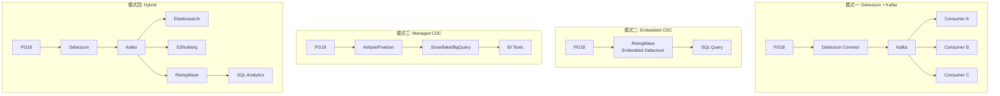
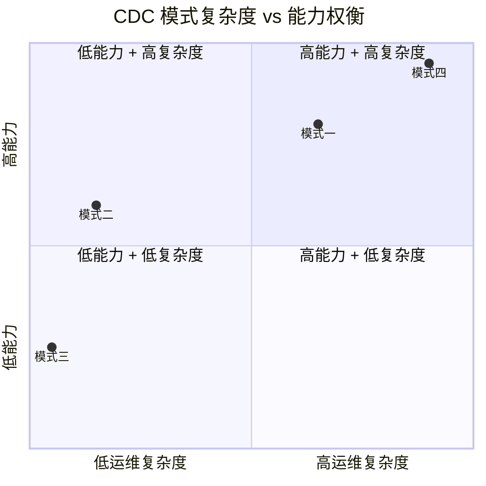

# PostgreSQL 18 CDC 四种权威模式

> 所属阶段: TECH-STACK | 前置依赖: [01.02-pg18-wal-logical-replication-theory.md](../01-theory-foundation/01.02-pg18-wal-logical-replication-theory.md) | 形式化等级: L3

## 1. 概念定义 (Definitions)

**Def-TS-09-01** (CDC 模式)
变更数据捕获 (Change Data Capture) 模式定义为从源数据库事务日志中提取变更事件并传递给下游消费者的架构：
$$\mathcal{CDC} \triangleq \langle \mathcal{D}_{source}, \mathcal{L}_{log}, \mathcal{E}_{extractor}, \mathcal{B}_{broker}, \mathcal{C}_{consumer} \rangle$$

**Def-TS-09-02** (模式一：传统 Debezium + Kafka)
$$\mathcal{M}_1 \triangleq \langle PG, WAL, Debezium, Kafka, \{C_i\}_{i=1}^n \rangle$$
Debezium 作为 Kafka Connect 插件运行，通过复制槽读取 WAL，输出到 Kafka topic。

**Def-TS-09-03** (模式二：嵌入式 CDC)
$$\mathcal{M}_2 \triangleq \langle PG, WAL, \mathcal{E}_{embedded}, \emptyset, \mathcal{DB}_{stream} \rangle$$
流数据库（如 RisingWave）内嵌 Debezium Embedded Engine，直接消费 WAL，无需 Kafka 中间层。

**Def-TS-09-04** (模式三：托管 CDC)
$$\mathcal{M}_3 \triangleq \langle PG, \mathcal{T}_{table}, \mathcal{S}_{managed}, \emptyset, \mathcal{W}_{warehouse} \rangle$$
托管服务（Fivetran/Airbyte Cloud/AWS DMS）通过定时轮询或日志读取，批量同步到数据仓库。

**Def-TS-09-05** (模式四：混合 CDC)
$$\mathcal{M}_4 \triangleq \langle PG, WAL, Debezium, Kafka, \{C_i\} \cup \mathcal{DB}_{stream} \rangle$$
结合模式一的多消费者扇出能力与模式二的 SQL 分析能力。

## 2. 属性推导 (Properties)

**Lemma-TS-09-01** (模式一延迟下界)
模式一的端到端延迟由 Kafka poll 间隔决定：
$$L_1 \geq L_{pg} + L_{debezium} + L_{kafka\_poll} + L_{consumer}$$
典型值：$L_1 \in [100\text{ms}, 5\text{s}]$。

**Lemma-TS-09-02** (模式二延迟下界)
模式二消除了 Kafka 中间层：
$$L_2 \geq L_{pg} + L_{embedded} + L_{compute}$$
典型值：$L_2 \in [1\text{ms}, 1\text{s}]$。

**Lemma-TS-09-03** (模式三延迟)
托管模式为批处理同步：
$$L_3 \in [5\text{min}, 1\text{hour}]$$

## 3. 关系建立 (Relations)

### 四模式与 PG18 特性的关系

| PG18 特性 | 模式一 | 模式二 | 模式三 | 模式四 |
|-----------|--------|--------|--------|--------|
| 并行逻辑复制 | ✅ 提升 Debezium 吞吐 | ✅ 直接受益 | ❌ 不适用 | ✅ 提升吞吐 |
| 生成列复制 | ✅ 事件 enrich | ✅ 简化 schema | ❌ 不适用 | ✅ 事件 enrich |
| 冲突报告 | ✅ 监控复制健康 | ✅ 监控复制健康 | ❌ 不适用 | ✅ 监控复制健康 |
| UUIDv7 | ✅ 优化 Kafka 分区 | ✅ 优化分片 | ❌ 不适用 | ✅ 优化分区 |
| RETURNING OLD/NEW | ✅ 简化 enrich | ✅ 简化 enrich | ❌ 不适用 | ✅ 简化 enrich |

### 四模式与多语言生态的关系

| 语言/框架 | 模式一 | 模式二 | 模式三 | 模式四 |
|-----------|--------|--------|--------|--------|
| Go/Benthos | ✅ 原生 Kafka 输入 | ❌ 不支持 | ❌ 不支持 | ✅ Kafka 输入 |
| Go/Watermill | ✅ Kafka 订阅 | ❌ 不支持 | ❌ 不支持 | ✅ Kafka 订阅 |
| Rust/Fluvio | ✅ Kafka 兼容 | ❌ 不支持 | ❌ 不支持 | ✅ Kafka 兼容 |
| Python/Bytewax | ✅ Kafka 源 | ❌ 不支持 | ❌ 不支持 | ✅ Kafka 源 |
| Python/RisingWave | ✅ Kafka 源 | ✅ 原生 PG CDC | ❌ 不支持 | ✅ 双模式 |
| TS/Node.js | ✅ Kafka 消费 | ❌ 不支持 | ❌ 不支持 | ✅ Kafka 消费 |

## 4. 论证过程 (Argumentation)

### 模式选型决策树

```
需要多个独立消费者读取同一 CDC 流？
├── YES → 已有 Kafka 基础设施？
│   ├── YES → 需要 SQL 分析能力？
│   │   ├── YES → 模式四 (Hybrid)
│   │   └── NO → 模式一 (Traditional)
│   └── NO → 模式一 + 新建 Kafka
└── NO → 目标是数据仓库且批延迟可接受？
    ├── YES → 模式三 (Managed)
    └── NO → 团队能运维 RisingWave？
        ├── YES → 模式二 (Embedded)
        └── NO → 模式一（最成熟生态）
```

### 模式一的生产风险

模式一虽最成熟，但存在以下风险：

1. **复制槽膨胀**: Debezium 停止消费时，WAL 累积可能撑爆磁盘。PG18 `max_slot_wal_keep_size` 可限制，但会导致复制中断。
2. **Kafka Connect 单点**: Connect worker 故障导致 CDC 停滞，需多 worker 集群。
3. **Schema Registry 依赖**: Avro/Protobuf 演化需要 Schema Registry，增加运维组件。
4. **初始 Snapshot 冲击**: 大表初始快照占用主库 I/O，PG18 并行 COPY 可缓解。

### 模式二的适用范围边界

模式二（Embedded CDC）**不适用**以下场景：

- 需要事件重放（Kafka log retention 提供）
- 多个独立团队消费同一 CDC 流
- 已有 Kafka 生态且团队依赖
- 需要复杂流处理（窗口/连接/CEP）且 RisingWave SQL 无法表达

## 5. 形式证明 / 工程论证 (Proof / Engineering Argument)

**Thm-TS-09-01** (模式一至少一次交付定理)

在模式一中，若满足：

1. Debezium 使用持久化复制槽
2. Kafka 配置 `acks=all` 和 `min.insync.replicas >= 2`
3. 消费者提交偏移量前完成处理

则每条变更事件至少被投递一次：
$$\forall e \in \mathcal{E}_{change}: P(deliver(e)) \geq 1$$

*工程论证*: 复制槽保证 WAL 不丢失；Kafka 多副本保证消息持久化；消费者偏移量管理保证故障恢复后重传。

**Thm-TS-09-02** (模式二最终一致性定理)

在模式二中，若流数据库的增量计算引擎满足：

1. 单调性：新事件只追加不修改历史计算结果
2. 可交换性：同键事件按 LSN 顺序处理
3. 幂等性：重复处理相同 LSN 事件结果不变

则物化视图与源数据库最终一致：
$$\lim_{t \to \infty} V_{materialized}(t) = \pi_{schema}(R_{pg}(t))$$

**Thm-TS-09-03** (模式四复杂度下界定理)

模式四的运维组件数为：
$$N_4 = N_{pg} + N_{debezium} + N_{kafka} + N_{connect} + N_{schema} + N_{risingwave}$$
组件间交互边数为 $O(N_4^2)$，故障模式数为 $O(2^{N_4})$。

*推论*: 模式四的 MTTR 中位数与组件数正相关：
$$MTTR_{median} \propto N_4 \cdot \log(N_4)$$

## 6. 实例验证 (Examples)

### 示例 1: 模式一完整配置（Debezium + Kafka）

```json
{
  "name": "pg18-orders-connector",
  "config": {
    "connector.class": "io.debezium.connector.postgresql.PostgresConnector",
    "database.hostname": "pg18.internal",
    "database.port": "5432",
    "database.user": "debezium",
    "database.password": "${secrets:dbz-pass}",
    "database.dbname": "production",
    "database.server.name": "pg18",
    "slot.name": "debezium_slot_v1",
    "plugin.name": "pgoutput",
    "publication.name": "dbz_publication",
    "table.include.list": "public.orders,public.order_items",
    "topic.prefix": "pg18",
    "heartbeat.interval.ms": "10000",
    "max.batch.size": "2048",
    "max.queue.size": "8192",
    "snapshot.mode": "initial",
    "tombstones.on.delete": "true"
  }
}
```

### 示例 2: 模式二配置（RisingWave 直连 PG18）

```sql
-- RisingWave 原生 PG CDC 源
CREATE SOURCE pg18_orders_source
WITH (
    connector = 'postgres-cdc',
    hostname = 'pg18.internal',
    port = '5432',
    username = 'replicator',
    password = 'secret',
    database.name = 'production',
    slot.name = 'rw_slot',
    table.name = 'orders'
);

-- 自动同步为表
CREATE TABLE orders (
    id BIGINT PRIMARY KEY,
    customer_id BIGINT,
    status VARCHAR,
    total NUMERIC,
    created_at TIMESTAMPTZ
) FROM pg18_orders_source;

-- 实时物化视图
CREATE MATERIALIZED VIEW hourly_revenue AS
SELECT
    DATE_TRUNC('hour', created_at) AS hour,
    SUM(total) AS revenue,
    COUNT(*) AS order_count
FROM orders
WHERE status = 'completed'
GROUP BY DATE_TRUNC('hour', created_at);
```

### 示例 3: 模式四配置（RisingWave 读取 Debezium Kafka topic）

```sql
-- RisingWave 读取 Debezium 格式的 Kafka topic
CREATE SOURCE orders_from_debezium (
    id BIGINT,
    customer_id BIGINT,
    status VARCHAR,
    total NUMERIC,
    created_at TIMESTAMPTZ,
    PRIMARY KEY (id)
)
WITH (
    connector = 'kafka',
    topic = 'pg18.public.orders',
    properties.bootstrap.server = 'kafka.internal:9092',
    scan.startup.mode = 'earliest'
)
FORMAT DEBEZIUM ENCODE JSON;

-- 物化视图与模式二相同
CREATE MATERIALIZED VIEW order_analytics AS
SELECT status, COUNT(*) AS cnt, SUM(total) AS value
FROM orders_from_debezium
GROUP BY status;
```

### 示例 4: 模式三配置（Airbyte Cloud）

```yaml
# Airbyte Cloud 连接配置（UI 导出）
source:
  type: postgres
  host: pg18.internal
  port: 5432
  database: production
  username: airbyte_readonly
  replication_method:
    method: Logical Replication (CDC)
    publication: airbyte_pub
    replication_slot: airbyte_slot

destination:
  type: snowflake
  warehouse: ANALYTICS
  database: RAW
  schema: CDC

sync:
  frequency: 15 minutes
  streams:
    - public.orders
    - public.customers
```

## 7. 可视化 (Visualizations)

### 四模式架构对比



### 延迟对比图

```mermaid
xychart-beta
    title "四模式延迟对比（对数尺度）"
    x-axis [模式一, 模式二, 模式三, 模式四]
    y-axis "延迟 (ms)" 1 --> 3600000
    bar [1000, 50, 900000, 1500]
```

### 复杂度与能力权衡



## 8. 引用参考 (References)
