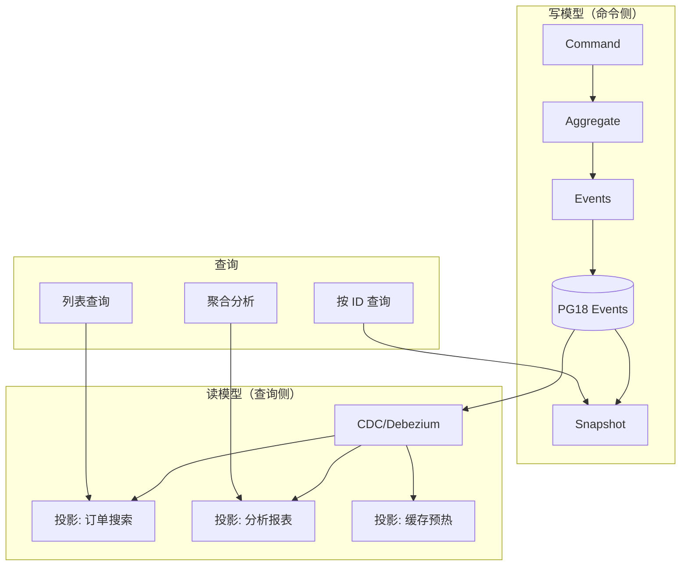
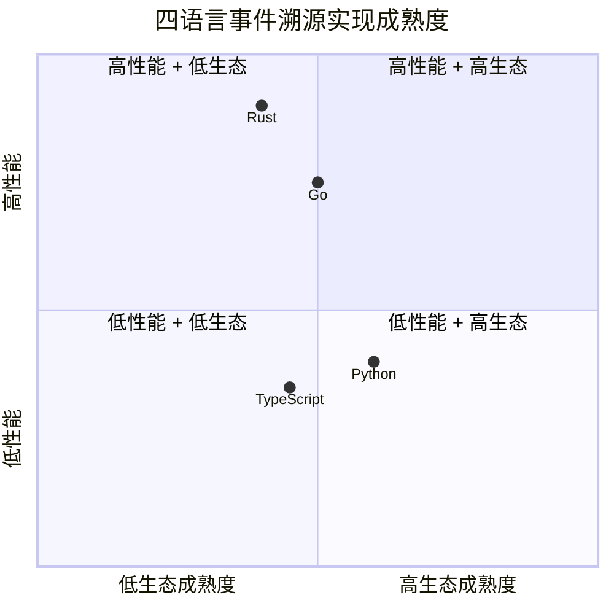

# PostgreSQL 18 事件溯源模式

> 所属阶段: TECH-STACK | 前置依赖: [03.02-pg18-outbox-multi-lang.md](./03.02-pg18-outbox-multi-lang.md) | 形式化等级: L3

## 1. 概念定义 (Definitions)

**Def-TS-11-01** (事件溯源)
事件溯源是一种以不可变事件序列作为系统真相来源的持久化模式：
$$\mathcal{ES} \triangleq \langle \mathcal{A}_{aggregate}, \mathcal{E}_{events}, \mathcal{S}_{snapshot}, \mathcal{R}_{replay}, \mathcal{P}_{projection} \rangle$$
其中 $\mathcal{A}$ 为聚合根，$\mathcal{E}$ 为事件存储，$\mathcal{S}$ 为快照机制，$\mathcal{R}$ 为重放函数，$\mathcal{P}$ 为投影读取模型。

**Def-TS-11-02** (聚合根状态函数)
聚合根当前状态由事件序列的 fold 定义：
$$State(A, t) \triangleq fold(Init_A, \{e_i\}_{i=1}^{n} \text{ where } e_i \in \mathcal{E}_A \land timestamp(e_i) \leq t)$$

**Def-TS-11-03** (PG18 事件表)
PG18 优化的事件存储表：
$$\mathcal{T}_{events}^{pg18} \triangleq \langle id_{UUIDv7}, aggregate\_id, event\_type, payload_{JSONB}, sequence, created\_at, partition\_key_{virtual} \rangle$$

**Def-TS-11-04** (投影一致性)
投影读取模型 $P$ 与事件存储一致，当且仅当：
$$\forall t: P(t) = \pi_{read}(State(A, t))$$

## 2. 属性推导 (Properties)

**Lemma-TS-11-01** (事件顺序不可变性)
一旦事件被持久化，其序列号不可变更：
$$\forall e_i, e_j \in \mathcal{E}: i < j \implies seq(e_i) < seq(e_j) \land \text{immutable}(e_i)$$

**Lemma-TS-11-02** (快照加速性质)
设快照 $S_k$ 记录第 $k$ 个事件后的状态，则从 $S_k$ 恢复状态的时间复杂度为：
$$T_{recover}(S_k) = O(|\mathcal{E}| - k)$$
对比无快照的 $T_{recover}(\emptyset) = O(|\mathcal{E}|)$。

## 3. 关系建立 (Relations)

### 事件溯源与 Outbox/CDC 的关系

| 维度 | 事件溯源 | Outbox | CDC（🌿 精益） |
|------|---------|--------|--------------|
| 真相来源 | 事件序列 | 数据库状态 | WAL 日志 |
| 写模型 | 仅追加事件 | 更新状态 + 写 outbox | 透明捕获 |
| 读模型 | 投影/物化视图 | 直接查询状态表 | RisingWave 物化视图 |
| 一致性 | 最终一致（投影延迟） | 强一致（本地事务） | 最终一致（亚秒级） |
| 复杂度 | 高 | 中 | **低（2组件）** |
| PG18 增益 | UUIDv7 + 虚拟列 + 并行流 | 生成列复制 + 冲突报告 | 并行逻辑复制 + 直连 |
| **精益适配** | ⚠️ 需快照管理 | ⚠️ 需 Relay | ✅ RisingWave 直连 |

**🌿 精益洞察**: 事件溯源的投影层可用 RisingWave 物化视图替代，实现：

- `events` 表变更 → RisingWave CDC 捕获 → 物化视图自动更新
- 无需自定义投影服务，无需 Kafka
- PG18 UUIDv7 时间排序天然支持 RisingWave 高效分区

### 四语言事件溯源实现

| 语言 | 事件存储 | 聚合框架 | 投影实现 |
|------|---------|---------|---------|
| Go | PG18 + sqlx | 自定义 | Benthos/Watermill |
| Rust | PG18 + sqlx/diesel | 自定义 | Fluvio/Pathway |
| Python | PG18 + SQLAlchemy | 自定义 | Bytewax/RisingWave |
| TypeScript | PG18 + Prisma | 自定义 | Node.js Streams |

## 4. 论证过程 (Argumentation)

### 事件溯源的适用性边界

**适合事件溯源的场景**：

- 审计需求强（金融、医疗、合规系统）
- 需要时间旅行查询（"订单在昨天12点的状态是什么？"）
- 复杂业务流程（ Saga、状态机）
- 多读取模型（同一事件投影到搜索、分析、缓存）

**不适合事件溯源的场景**：

- 简单 CRUD 应用（过度设计）
- 事件数量爆炸（如高频传感器，每秒百万事件）
- 团队缺乏分布式系统经验
- 对投影延迟零容忍（投影重建需要时间）

### PG18 UUIDv7 对事件溯源的价值

传统 UUIDv4 作为事件主键的问题：

- 完全随机，B-tree 索引频繁分裂
- 事件表按时间范围查询性能差

PG18 UUIDv7 的优势：

- 时间排序，B-tree 索引局部性极佳
- 天然支持时间范围分区
- 无需额外 `created_at` 索引即可高效按时间扫描

```sql
-- UUIDv7 事件表：时间排序天然保持
CREATE TABLE events (
    id UUID PRIMARY KEY DEFAULT uuid_generate_v7(),
    aggregate_id UUID NOT NULL,
    event_type VARCHAR(255) NOT NULL,
    payload JSONB NOT NULL,
    sequence INT GENERATED ALWAYS AS (
        (extract(epoch from id::timestamp) * 1000000)::int
    ) VIRTUAL,
    metadata JSONB DEFAULT '{}'
);

-- 按 UUIDv7 天然时间排序查询，无需额外索引
SELECT * FROM events
WHERE aggregate_id = ?
ORDER BY id
LIMIT 1000;
```

### 投影重建策略

**策略一：同步投影**（同一事务）

- 写事件 → 同步更新投影表
- 优点：强一致性
- 缺点：写延迟增加，吞吐量下降

**策略二：异步投影**（CDC 驱动）

- 写事件 → CDC 捕获 → 异步更新投影
- 优点：写吞吐量高
- 缺点：最终一致，投影延迟 100ms-5s

**策略三：混合投影**（关键投影同步，其他异步）

- 平衡一致性与性能

## 5. 形式证明 / 工程论证 (Proof / Engineering Argument)

**Thm-TS-11-01** (事件溯源状态一致性定理)

对于任意聚合 $A$，设其事件序列为 $\{e_1, e_2, ..., e_n\}$，聚合函数为 $apply$：
$$State_n = apply(...apply(apply(Init, e_1), e_2)..., e_n)$$

若 $apply$ 是确定性的（$\forall s, e: apply(s, e) = s'$ 唯一），则：
$$\forall t_1, t_2 \geq n: State(A, t_1) = State(A, t_2) = State_n$$

即重放结果与时间无关，仅取决于事件序列。

*工程论证*: 这是事件溯源可恢复性的理论基础。所有投影、快照、备份都依赖此确定性保证。

**Thm-TS-11-02** (投影最终一致性定理)

在异步投影架构中，设事件写入时刻为 $t_w$，投影更新时刻为 $t_p$，CDC 延迟为 $\Delta_{cdc}$：
$$t_p - t_w \leq \Delta_{cdc} + \Delta_{process} + \Delta_{write}$$

若 $\Delta_{cdc} \to 0$（理想情况），则投影趋近实时一致：
$$\lim_{\Delta_{cdc} \to 0} P(P(t) = State(A, t)) = 1$$

**Thm-TS-11-03** (快照空间-时间权衡)

设每 $k$ 个事件创建一个快照，存储空间增加比例为 $S_{snap}/S_{events}$，恢复时间减少比例为：
$$\frac{T_{with}}{T_{without}} = \frac{1}{k}$$

最优 $k$ 满足：
$$k^* = \arg\min_k \left( \alpha \cdot \frac{S_{snap}}{k} + \beta \cdot k \right)$$
其中 $\alpha$ 为存储成本权重，$\beta$ 为恢复时间权重。

## 6. 实例验证 (Examples)

### 示例 1: PG18 事件溯源表设计

```sql
-- 聚合根注册表
CREATE TABLE aggregates (
    id UUID PRIMARY KEY,
    type VARCHAR(255) NOT NULL,
    version INT NOT NULL DEFAULT 0,
    created_at TIMESTAMPTZ DEFAULT NOW(),
    updated_at TIMESTAMPTZ DEFAULT NOW()
);

-- 事件表（使用 UUIDv7 时间排序）
CREATE TABLE events (
    id UUID PRIMARY KEY DEFAULT uuid_generate_v7(),
    aggregate_id UUID NOT NULL REFERENCES aggregates(id),
    aggregate_type VARCHAR(255) NOT NULL,
    event_type VARCHAR(255) NOT NULL,
    payload JSONB NOT NULL,
    sequence INT NOT NULL,

    -- PG18 虚拟生成列：自动分区键
    partition_key VARCHAR(8) GENERATED ALWAYS AS (
        to_char(id::timestamp, 'YYYYMM')
    ) VIRTUAL,

    metadata JSONB DEFAULT '{}',
    created_at TIMESTAMPTZ DEFAULT NOW(),

    UNIQUE(aggregate_id, sequence)
);

-- 覆盖索引：按聚合+序列快速扫描
CREATE INDEX idx_events_aggregate_seq ON events(aggregate_id, sequence);

-- BRIN 索引：利用 UUIDv7 时间局部性（轻量级）
CREATE INDEX idx_events_id_brin ON events USING BRIN(id);

-- 按自然时间分区
CREATE TABLE events_2026_01 PARTITION OF events
FOR VALUES FROM ('018e0000-0000-7fff-8fff-ffffffffffff')
TO ('018f0000-0000-7fff-8fff-ffffffffffff');

-- 快照表
CREATE TABLE snapshots (
    aggregate_id UUID PRIMARY KEY REFERENCES aggregates(id),
    version INT NOT NULL,
    state JSONB NOT NULL,
    created_at TIMESTAMPTZ DEFAULT NOW()
);
```

### 示例 2: Go 事件溯源实现

```go
package eventsourcing

import (
    "context"
    "database/sql"
    "encoding/json"
    "fmt"

    "github.com/google/uuid"
)

type Event struct {
    ID          uuid.UUID       `json:"id"`
    AggregateID uuid.UUID       `json:"aggregate_id"`
    Type        string          `json:"type"`
    Payload     json.RawMessage `json:"payload"`
    Sequence    int             `json:"sequence"`
}

type Aggregate interface {
    ID() uuid.UUID
    Type() string
    Version() int
    Apply(event Event) error
    Events() []Event
    ClearEvents()
}

type EventStore struct {
    db *sql.DB
}

func (s *EventStore) Save(ctx context.Context, aggregate Aggregate) error {
    tx, err := s.db.BeginTx(ctx, nil)
    if err != nil {
        return err
    }
    defer tx.Rollback()

    events := aggregate.Events()
    if len(events) == 0 {
        return nil
    }

    // 乐观并发控制：检查版本
    var currentVersion int
    err = tx.QueryRowContext(ctx,
        "SELECT version FROM aggregates WHERE id = $1",
        aggregate.ID()).Scan(&currentVersion)
    if err == sql.ErrNoRows {
        _, err = tx.ExecContext(ctx,
            "INSERT INTO aggregates (id, type, version) VALUES ($1, $2, $3)",
            aggregate.ID(), aggregate.Type(), len(events))
    } else if err != nil {
        return err
    } else if currentVersion != events[0].Sequence-1 {
        return fmt.Errorf("concurrency conflict: expected version %d, got %d",
            currentVersion, events[0].Sequence-1)
    }

    // 写入事件
    for _, evt := range events {
        _, err = tx.ExecContext(ctx, `
            INSERT INTO events (id, aggregate_id, aggregate_type, event_type, payload, sequence)
            VALUES ($1, $2, $3, $4, $5, $6)
        `, evt.ID, evt.AggregateID, aggregate.Type(), evt.Type, evt.Payload, evt.Sequence)
        if err != nil {
            return err
        }
    }

    // 更新聚合版本
    _, err = tx.ExecContext(ctx,
        "UPDATE aggregates SET version = $1, updated_at = NOW() WHERE id = $2",
        events[len(events)-1].Sequence, aggregate.ID())

    return tx.Commit()
}

func (s *EventStore) Load(ctx context.Context, aggregateID uuid.UUID, aggregate Aggregate) error {
    // 优先加载快照
    var snapshotVersion int
    var snapshotState json.RawMessage
    err := s.db.QueryRowContext(ctx,
        "SELECT version, state FROM snapshots WHERE aggregate_id = $1",
        aggregateID).Scan(&snapshotVersion, &snapshotState)

    if err == nil {
        // 从快照恢复
        if err := json.Unmarshal(snapshotState, aggregate); err != nil {
            return err
        }
    }

    // 加载快照后的事件
    rows, err := s.db.QueryContext(ctx, `
        SELECT id, event_type, payload, sequence
        FROM events
        WHERE aggregate_id = $1 AND sequence > $2
        ORDER BY sequence
    `, aggregateID, snapshotVersion)
    if err != nil {
        return err
    }
    defer rows.Close()

    for rows.Next() {
        var evt Event
        if err := rows.Scan(&evt.ID, &evt.Type, &evt.Payload, &evt.Sequence); err != nil {
            return err
        }
        if err := aggregate.Apply(evt); err != nil {
            return err
        }
    }

    return rows.Err()
}
```

### 示例 3: 异步投影（CDC 驱动）

```sql
-- 投影表：订单汇总
CREATE TABLE projection_orders (
    order_id UUID PRIMARY KEY,
    customer_id UUID NOT NULL,
    status VARCHAR(50) NOT NULL,
    total NUMERIC(12, 2) NOT NULL,
    item_count INT NOT NULL DEFAULT 0,
    last_event_at TIMESTAMPTZ NOT NULL
);

-- RisingWave 物化视图作为实时投影
CREATE MATERIALIZED VIEW mv_order_summary AS
SELECT
    aggregate_id AS order_id,
    MAX(sequence) AS version,
    COUNT(*) AS event_count,
    MAX(created_at) AS last_updated
FROM events
GROUP BY aggregate_id;
```

## 7. 可视化 (Visualizations)

### 事件溯源架构全景



### 事件存储与快照关系

```mermaid
graph LR
    subgraph Events["事件序列"]
        E1[e1: Created]
        E2[e2: Updated]
        E3[e3: ItemAdded]
        E4[e4: ItemAdded]
        E5[e5: Shipped]
        E6[e6: Delivered]
    end

    subgraph Snapshots["快照点"]
        S1[Snapshot@e3]
        S2[Snapshot@e6]
    end

    E1 --> E2 --> E3 --> S1
    S1 --> E4 --> E5 --> E6 --> S2

    style S1 fill:#e1f5fe
    style S2 fill:#e1f5fe
```

### 四语言事件溯源成熟度



## 8. 引用参考 (References)
