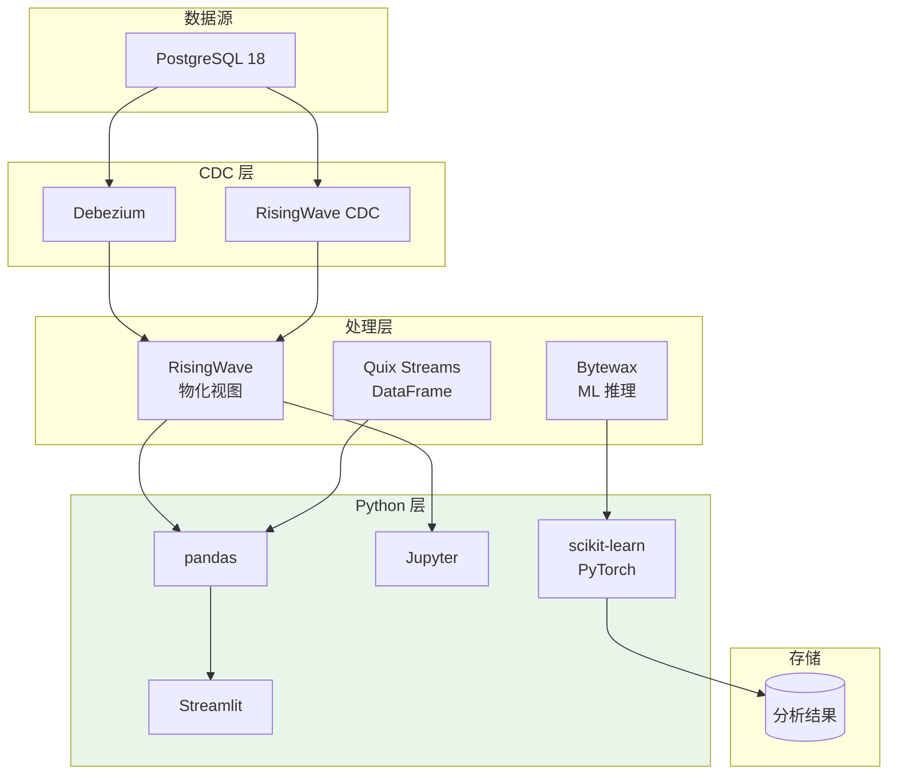
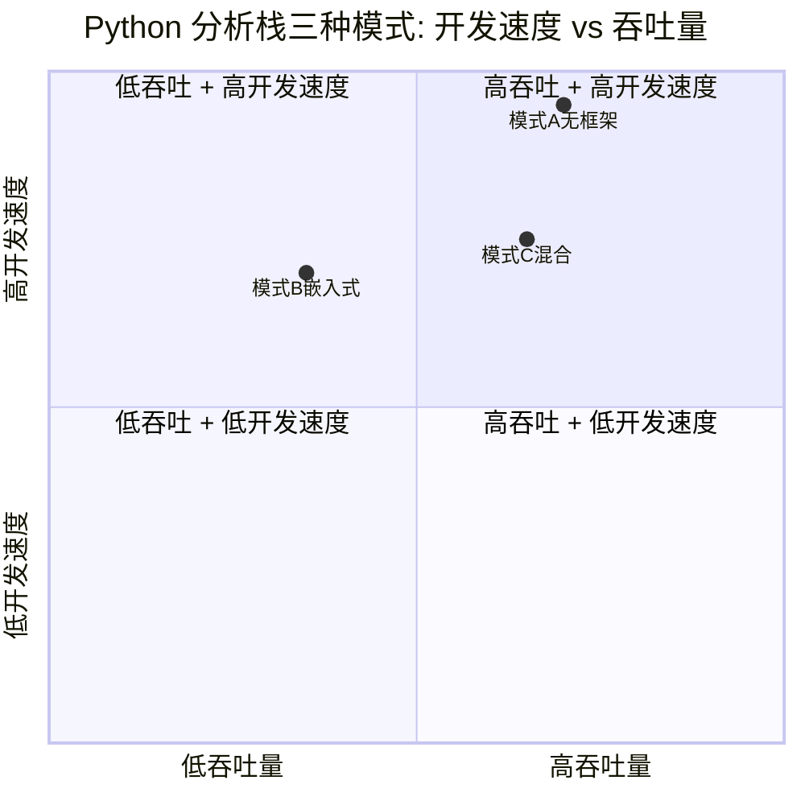
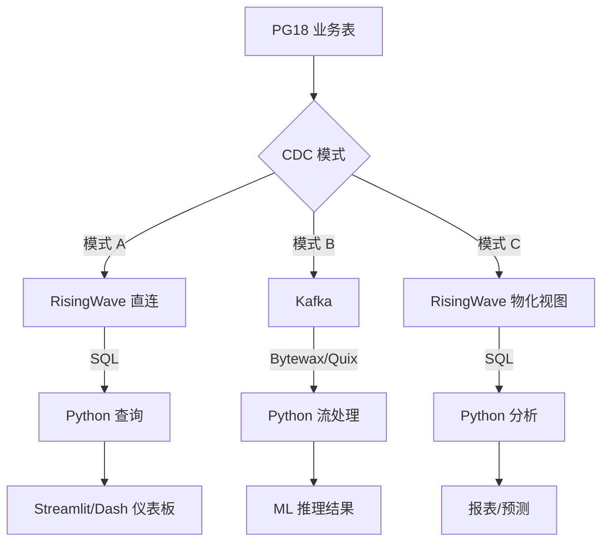

# PostgreSQL 18 × Python 实时分析栈

> 所属阶段: TECH-STACK | 前置依赖: [02.03-python-streaming-ecosystem.md](../02-language-ecosystems/02.03-python-streaming-ecosystem.md) | 形式化等级: L3

## 1. 概念定义 (Definitions)

**Def-TS-13-01** (Python 实时分析栈)
Python 实时分析栈是利用 Python 数据科学生态与流处理/流数据库结合，实现低代码实时分析的架构：
$$\mathcal{S}_{py} \triangleq \langle \mathcal{D}_{pg}, \mathcal{C}_{cdc}, \mathcal{P}_{processor}, \mathcal{V}_{view}, \mathcal{Q}_{query} \rangle$$
其中 $\mathcal{P}$ 可为 Bytewax/Quix Streams 或 RisingWave（无代码）。

**Def-TS-13-02** (无框架流处理)
无框架流处理指不引入专用流处理库，而是通过标准数据库驱动查询实时物化视图：
$$\mathcal{N}_{frame} \triangleq \langle PG/\mathcal{DB}_{stream}, psycopg2, SQL, pandas \rangle$$

**Def-TS-13-03** (DataFrame 流抽象)
Python 中的流 DataFrame 是将流数据映射为表格操作的对象：
$$\mathcal{DF}_{stream} \triangleq \langle \mathcal{S}_{source}, \mathcal{O}_{ops}, \mathcal{W}_{window}, \mathcal{T}_{trigger} \rangle$$
其中 $\mathcal{O}$ 支持 `filter`, `map`, `groupby`, `aggregate` 等操作。

**Def-TS-13-04** (ML 推理管道)
ML 推理管道在流处理中嵌入模型推理：
$$\mathcal{P}_{ml} \triangleq \langle \mathcal{S}_{features}, \mathcal{M}_{model}, \mathcal{I}_{inference}, \mathcal{O}_{prediction} \rangle$$

## 2. 属性推导 (Properties)

**Lemma-TS-13-01** (Python 流处理吞吐量上界)
在单进程 Python 中，流处理吞吐量受 GIL 限制：
$$T_{python} \leq \frac{f_{cpu}}{c_{gil} + c_{parse} + c_{process}}$$
其中 $c_{gil}$ 为 GIL 获取/释放开销。典型值：$T_{python} \in [5K, 50K]$ msg/s。

**Lemma-TS-13-02** (RisingWave 查询延迟)
通过 psycopg2 查询 RisingWave 物化视图的延迟：
$$L_{query} = L_{network} + L_{rw} + L_{serialization}$$
典型值：$L_{query} \in [1, 10]$ ms。

## 3. 关系建立 (Relations)

### Python 分析栈的三种模式

| 模式 | 组件 | 适用场景 | 开发速度 | 吞吐量 |
|------|------|---------|---------|--------|
| **模式 A: 无框架** | RisingWave + psycopg2 + pandas | 实时仪表板、报表 | ★★★★★ | 依赖 RW |
| **模式 B: 嵌入式** | Bytewax/Quix + Python ML | 实时特征工程、推理 | ★★★★☆ | 10-50K/s |
| **模式 C: 混合** | RW + Python 后处理 | 复杂分析 + 可视化 | ★★★★☆ | 依赖 RW |

### 与 PG18 CDC 的集成

```
PG18 → CDC →
    ├── 模式 A: RisingWave 直连（零 Python 流代码）
    ├── 模式 B: Bytewax/Quix Kafka 消费者
    └── 模式 C: RW 物化视图 → Python 查询
```

### Python ML 生态与流处理的融合

| ML 框架 | 流处理集成方式 | 延迟 |
|---------|-------------|------|
| scikit-learn | 预训练模型，在线推理 | 1-10ms |
| PyTorch | 小模型在线推理 | 10-100ms |
| TensorFlow | TensorFlow Serving | 5-50ms |
| Hugging Face Transformers | 文本分类/embedding | 50-500ms |
| ONNX Runtime | 跨框架优化推理 | 1-50ms |

## 4. 论证过程 (Argumentation)

### 为什么 Python 是实时分析的理想选择？

**优势**：

1. **数据科学家原生语言**：分析师无需学习 Java/Scala/Go
2. **生态丰富**：pandas/NumPy/scikit-learn/PyTorch 直接用于流数据
3. **快速原型**：从想法到生产管道的时间最短
4. **RisingWave 补充性能短板**：计算在数据库层，Python 仅查询结果

**劣势**：

1. **吞吐量天花板**：GIL 限制单进程性能
2. **内存占用**：pandas DataFrame 内存效率低
3. **部署复杂度**：Python 依赖管理 notoriously 困难

### 模式选型决策

**选择模式 A（无框架）当**：

- 团队无流处理经验
- 需求是实时仪表板/报表
- 吞吐量要求 < RisingWave 能力上限（100K+ QPS）

**选择模式 B（嵌入式）当**：

- 需要自定义 Python 变换（ML 推理、复杂业务逻辑）
- 团队熟悉 Kafka/消息队列
- 吞吐量 10-50K/s 可接受

**选择模式 C（混合）当**：

- 需要 SQL 的表达能力 + Python 的可视化/ML
- 已有 RisingWave 基础设施
- 复杂分析需求

## 5. 形式证明 / 工程论证 (Proof / Engineering Argument)

**Thm-TS-13-01** (Python 实时分析栈成本优势定理)

对于实时分析场景，Python 栈的总成本：
$$C_{py} = C_{dev} + C_{infra} + C_{maint}$$

对比 Java/Flink 栈：
$$\frac{C_{py}}{C_{java}} \approx \frac{0.5 \cdot H_{dev} + 1.2 \cdot H_{infra}}{1.0 \cdot H_{dev} + 1.0 \cdot H_{infra}}$$

其中 $H$ 为人时成本。当 $H_{dev} > 2 \cdot H_{infra}$ 时（即开发时间成本高于基础设施），Python 栈更经济。

*工程论证*: 数据科学家/分析师的时薪通常高于基础设施成本，Python 栈减少开发时间是主要收益。

**Thm-TS-13-02** (RisingWave + Python 一致性定理)

在模式 A 中，若 RisingWave 物化视图满足：

1. 增量计算正确性
2. PG18 CDC 事件按提交顺序处理
3. 查询在物化视图更新后执行

则查询结果与源数据库状态一致：
$$\forall q, t: result(q, t) = q(State_{pg}(t - \Delta_{rw}))$$

其中 $\Delta_{rw}$ 为 RisingWave 物化视图更新延迟（典型 1-5s）。

## 6. 实例验证 (Examples)

### 示例 1: 模式 A — 无框架实时仪表板

```python
# dashboard.py — 纯 Python + RisingWave，无流处理框架
import psycopg2
import pandas as pd
from sqlalchemy import create_engine
import streamlit as st

# RisingWave 通过 PostgreSQL 协议连接
engine = create_engine("postgresql://root@risingwave:4566/dev")

def get_realtime_metrics():
    """查询实时物化视图"""
    return pd.read_sql("""
        SELECT
            hour,
            revenue,
            order_count,
            avg_order_value
        FROM mv_hourly_revenue
        WHERE hour > NOW() - INTERVAL '24 hours'
        ORDER BY hour DESC
        LIMIT 24
    """, engine)

def get_top_products():
    return pd.read_sql("""
        SELECT
            product_id,
            product_name,
            sales_count,
            revenue
        FROM mv_top_products
        ORDER BY revenue DESC
        LIMIT 10
    """, engine)

# Streamlit 实时仪表板
st.title("实时销售仪表板")

# 自动刷新
st_autorefresh = st.empty()

metrics = get_realtime_metrics()
st.line_chart(metrics.set_index("hour")[["revenue", "order_count"]])

top_products = get_top_products()
st.bar_chart(top_products.set_index("product_name")["revenue"])
```

### 示例 2: 模式 B — Bytewax + ML 推理

```python
# ml_pipeline.py
import bytewax.operators as op
from bytewax.dataflow import Dataflow
from bytewax.connectors.kafka import KafkaSource, KafkaSink
from bytewax.connectors.stdio import StdOutSink
import json
import joblib

# 加载预训练模型
model = joblib.load("fraud_model.pkl")

def parse_event(msg):
    event = json.loads(msg)
    return event["order_id"], event

def extract_features(order_id, event):
    features = [
        event["amount"],
        event["hour_of_day"],
        event["customer_age_days"],
        len(event["items"]),
    ]
    return order_id, features

def predict(order_id, features):
    score = model.predict_proba([features])[0][1]
    return order_id, {
        "order_id": order_id,
        "fraud_score": float(score),
        "is_fraud": score > 0.8,
    }

flow = Dataflow("fraud-detection")

# 从 Kafka 读取
stream = op.input("kafka-in", flow, KafkaSource(["localhost:9092"], "orders"))

# 解析 → 特征提取 → 推理
parsed = op.map("parse", stream, parse_event)
features = op.map("extract", parsed, extract_features)
predictions = op.map("predict", features, predict)

# 输出到 Kafka topic
op.output("kafka-out", predictions, KafkaSink(
    brokers=["localhost:9092"],
    topic="fraud-alerts"
))
```

### 示例 3: 模式 C — RisingWave + Python 后处理

```python
# advanced_analytics.py
import psycopg2
import pandas as pd
from prophet import Prophet

# 连接 RisingWave
conn = psycopg2.connect(
    host="risingwave", port=4566, dbname="dev", user="root"
)

# 读取实时物化视图的历史数据
df = pd.read_sql("""
    SELECT
        hour as ds,
        revenue as y
    FROM mv_hourly_revenue
    WHERE hour > NOW() - INTERVAL '90 days'
    ORDER BY hour
""", conn)

# 使用 Prophet 进行实时预测
model = Prophet()
model.fit(df)

future = model.make_future_dataframe(periods=24, freq='H')
forecast = model.predict(future)

# 将预测写回 RisingWave（用于仪表板展示）
with conn.cursor() as cur:
    for _, row in forecast.tail(24).iterrows():
        cur.execute("""
            INSERT INTO forecast_revenue (hour, predicted_revenue, lower_bound, upper_bound)
            VALUES (%s, %s, %s, %s)
            ON CONFLICT (hour) DO UPDATE SET
                predicted_revenue = EXCLUDED.predicted_revenue,
                lower_bound = EXCLUDED.lower_bound,
                upper_bound = EXCLUDED.upper_bound
        """, (row['ds'], row['yhat'], row['yhat_lower'], row['yhat_upper']))
    conn.commit()
```

## 7. 可视化 (Visualizations)

### Python 实时分析栈架构



### 三种模式对比



### 数据流图



## 8. 引用参考 (References)
