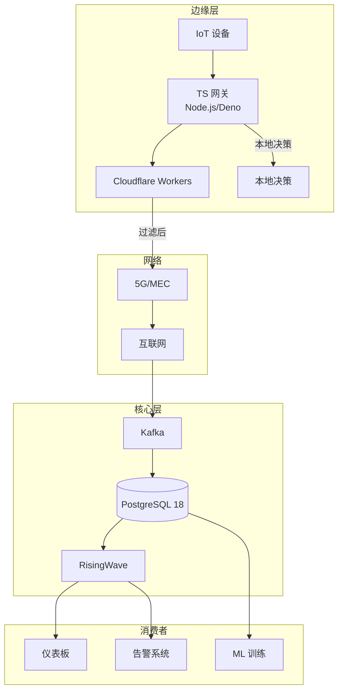
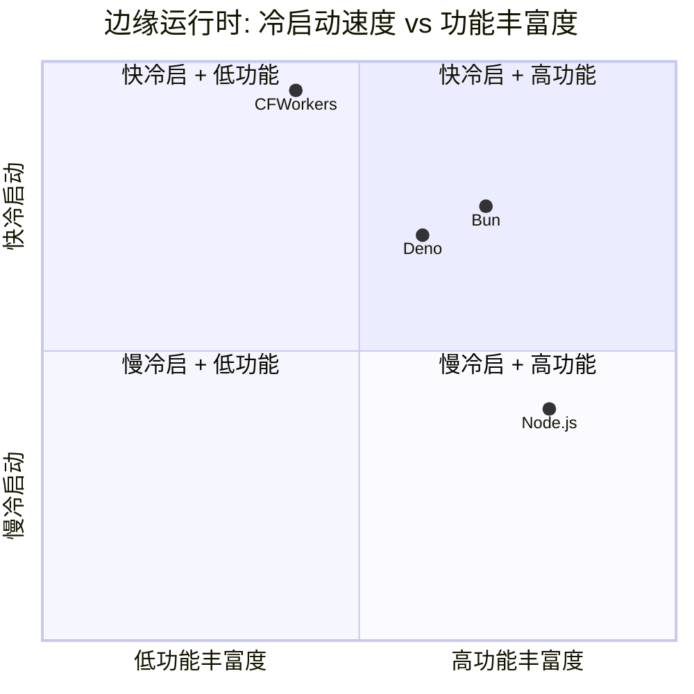
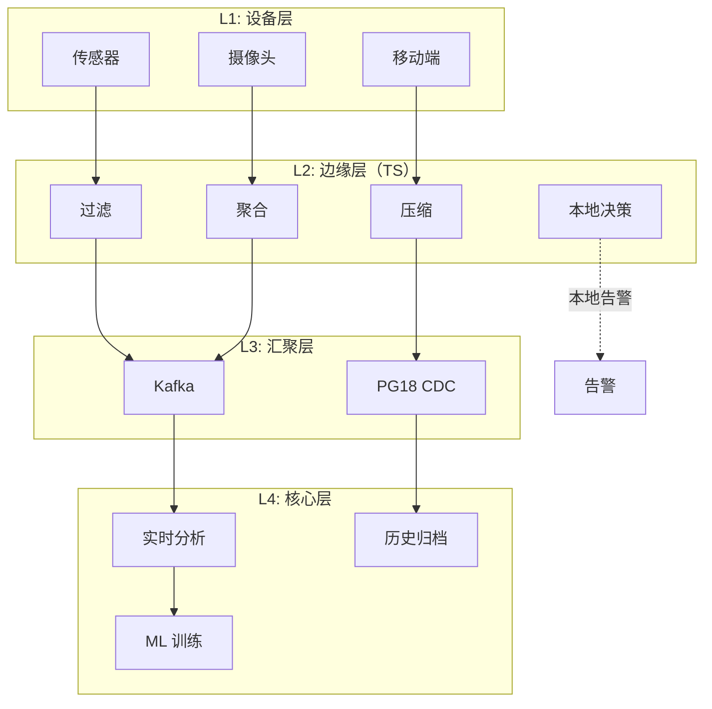

# PostgreSQL 18 × TypeScript 边缘流处理栈

> 所属阶段: TECH-STACK | 前置依赖: [02.04-typescript-streaming-ecosystem.md](../02-language-ecosystems/02.04-typescript-streaming-ecosystem.md) | 形式化等级: L3

## 1. 概念定义 (Definitions)

**Def-TS-14-01** (边缘流处理栈)
边缘流处理栈是部署在接近数据源的网络边缘位置（CDN PoP、IoT 网关、5G MEC）的轻量级流处理架构：
$$\mathcal{S}_{edge} \triangleq \langle \mathcal{N}_{node}, \mathcal{R}_{resource}, \mathcal{L}_{latency}, \mathcal{C}_{conn} \rangle$$
其中 $\mathcal{N}$ 为边缘节点，$\mathcal{R}$ 为资源约束，$\mathcal{L}$ 为延迟要求，$\mathcal{C}$ 为连接性特征。

**Def-TS-14-02** (TypeScript 边缘运行时)
TypeScript 边缘运行时指在边缘环境中执行的 TS/JS 代码：
$$\mathcal{R}_{ts} \triangleq \{ \text{Node.js}, \text{Deno}, \text{Cloudflare Workers}, \text{Bun} \}$$

**Def-TS-14-03** (边缘-核心协同)
边缘-核心协同模式定义数据在边缘预处理、核心深度分析的架构：
$$\mathcal{C}_{ec} \triangleq \langle \mathcal{P}_{edge}, \mathcal{F}_{filter}, \mathcal{T}_{transfer}, \mathcal{A}_{core} \rangle$$
其中 $\mathcal{P}_{edge}$ 为边缘预处理（过滤/聚合/压缩），$\mathcal{F}$ 为过滤函数，$\mathcal{T}$ 为传输协议，$\mathcal{A}$ 为核心分析。

**Def-TS-14-04** (PG18 边缘同步)
PG18 在边缘的受限同步模式：
$$\mathcal{S}_{pg18}^{edge} \triangleq \langle \mathcal{C}_{lite}, \mathcal{Q}_{async}, \mathcal{B}_{batch} \rangle$$
边缘设备通过轻量级客户端、异步查询或批量同步与中心 PG18 交互。

## 2. 属性推导 (Properties)

**Lemma-TS-14-01** (边缘预处理降本)
边缘预处理将传输到核心的数据量减少：
$$|D_{core}| = |D_{raw}| \cdot (1 - r_{filter}) \cdot c_{compress}$$
其中 $r_{filter}$ 为过滤率，$c_{compress}$ 为压缩率。典型值：$|D_{core}| \in [0.01, 0.1] \cdot |D_{raw}|$。

**Lemma-TS-14-02** (边缘延迟优势)
边缘处理的端到端延迟低于核心处理：
$$L_{edge} = L_{local} + L_{network}^{edge} \ll L_{core} = L_{local} + L_{network}^{core} + L_{compute}^{core}$$

## 3. 关系建立 (Relations)

> **🌿 精益优先提示**: 边缘场景下，TS 网关通过批量 INSERT 将数据写入 PG18，RisingWave 自动 CDC 捕获并生成物化视图。前端直接查询 RisingWave，无需 Kafka 中间层。详见 [04.05-精益架构](../04-composite-architectures/04.05-pg18-lean-architecture.md)。

### TypeScript 边缘运行时对比

| 运行时 | 冷启动 | 内存占用 | 包大小 | 适用场景 |
|--------|--------|---------|--------|---------|
| Node.js | 中 (~200ms) | 高 (~50MB) | 大 | 边缘网关、长期服务 |
| Deno | 低 (~50ms) | 中 (~20MB) | 中 | 安全沙箱、边缘函数 |
| Cloudflare Workers | 极低 (~0ms) | 低 (~128MB) | 小 | CDN 边缘、无服务器 |
| Bun | 低 (~30ms) | 中 (~30MB) | 中 | 高性能替代 Node.js |

### TS 边缘栈与 PG18 的关系

| 场景 | 架构模式 | PG18 角色 |
|------|---------|----------|
| 边缘缓存预热 | TS 边缘查询 PG18 物化视图 | 实时状态源 |
| 边缘事件上传 | TS 边缘缓冲 → 批量 INSERT | 事件汇聚 |
| 双向同步 | PG18 CDC → 边缘推送 | 变更广播 |
| 离线优先 | 边缘 SQLite → 间歇同步 PG18 | 最终同步目标 |

### 边缘-核心数据流

```
IoT 传感器 → TS 边缘运行时（过滤/聚合）→
    ├── 本地决策（<10ms）
    └── 批量上传 → PG18 核心（分析/归档）
```

## 4. 论证过程 (Argumentation)

### TypeScript 在边缘的独特价值

**优势**：

1. **前端-后端同构**：边缘逻辑可直接复用前端代码（如数据验证、格式化）
2. **JSON 原生**：IoT 设备普遍输出 JSON，TS/JS 处理无序列化开销
3. **部署便利**：单文件部署，无需编译（解释执行）
4. **Serverless 生态**：Cloudflare Workers/Vercel Edge 原生支持

**劣势**：

1. **单线程限制**：CPU 密集型任务阻塞事件循环
2. **内存管理**：V8 GC 在资源受限环境不可预测
3. **包体积**：node_modules 膨胀问题（edge 环境有大小限制）

### Cloudflare Workers 作为边缘流处理引擎的可行性

Cloudflare Workers 的限制：

- 单次请求 CPU 时间：50ms（免费）/ 400ms（付费）
- 内存：128MB
- 包大小：1MB（压缩后）
- 无状态（KV/Durable Objects 提供有限状态）

**适用场景**：

- 简单事件过滤/路由
- Webhook 接收与转发
- 轻量聚合（计数、求和）
- 实时通知推送

**不适用场景**：

- 复杂窗口聚合
- 有状态流处理（无持久状态存储）
- 高吞吐消息消费（HTTP 轮询模式效率低）

### PG18 在边缘协同中的角色

PG18 不直接部署在边缘（资源需求过高），但可通过以下方式与边缘协同：

1. **逻辑复制流 → 边缘推送**：PG18 CDC → Kafka → WebSocket → 边缘客户端
2. **边缘批量上传**：边缘设备缓存 → 定时批量 INSERT → PG18
3. **物化视图查询**：边缘通过 HTTP API 查询 PG18 物化视图

## 5. 形式证明 / 工程论证 (Proof / Engineering Argument)

**Thm-TS-14-01** (边缘预处理收益定理)

设原始数据率为 $R_{raw}$，边缘过滤率为 $p$，压缩率为 $c$，网络带宽为 $B$。

无边缘预处理时的核心带宽需求：
$$B_{core}^{no} = R_{raw}$$

有边缘预处理时的核心带宽需求：
$$B_{core}^{yes} = R_{raw} \cdot (1 - p) \cdot c$$

带宽节省比例：
$$S = 1 - \frac{B_{core}^{yes}}{B_{core}^{no}} = 1 - (1 - p) \cdot c$$

当 $p = 0.8$（过滤 80%），$c = 0.5$（压缩 50%）时：
$$S = 1 - 0.2 \cdot 0.5 = 0.9$$
即节省 90% 核心带宽。

**Thm-TS-14-02** (边缘决策延迟定理)

在边缘-核心架构中，决策延迟分解为：
$$L_{decision} = L_{sense} + L_{edge} + \mathbb{I}(need\_core) \cdot (L_{network} + L_{core})$$

其中 $\mathbb{I}$ 为指示函数。若边缘可本地决策（如阈值告警），则：
$$L_{decision} = L_{sense} + L_{edge} \ll L_{sense} + L_{edge} + L_{network} + L_{core}$$

*工程推论*: 将决策逻辑尽可能推向边缘，可显著降低延迟。

## 6. 实例验证 (Examples)

### 示例 1: Cloudflare Workers 边缘过滤

```typescript
// worker.ts — Cloudflare Workers 边缘事件过滤
export interface Env {
  KAFKA_REST_PROXY: string;
  ALERT_THRESHOLD: string;
}

interface SensorEvent {
  device_id: string;
  temperature: number;
  timestamp: number;
}

export default {
  async fetch(request: Request, env: Env): Promise<Response> {
    if (request.method !== "POST") {
      return new Response("Method not allowed", { status: 405 });
    }

    const event: SensorEvent = await request.json();

    // 边缘过滤：只转发异常温度
    const threshold = parseFloat(env.ALERT_THRESHOLD);
    if (event.temperature < threshold) {
      return new Response("Filtered", { status: 200 });
    }

    // 边缘聚合：同一设备 10 秒内只发一次告警
    const cacheKey = `alert:${event.device_id}`;
    const cached = await caches.default.match(cacheKey);
    if (cached) {
      return new Response("Deduplicated", { status: 200 });
    }

    // 转发到 Kafka REST Proxy
    await fetch(env.KAFKA_REST_PROXY + "/topics/alerts", {
      method: "POST",
      headers: { "Content-Type": "application/vnd.kafka.json.v2+json" },
      body: JSON.stringify({
        records: [{
          value: {
            device_id: event.device_id,
            temperature: event.temperature,
            alert_type: "high_temperature",
            edge_processed: true,
          }
        }]
      }),
    });

    // 缓存去重标记（10 秒 TTL）
    await caches.default.put(cacheKey, new Response("1"), {
      expiration: 10,
    });

    return new Response("Forwarded", { status: 200 });
  },
};
```

### 示例 2: Node.js 边缘网关

```typescript
// edge-gateway.ts — Node.js 边缘数据收集网关
import { createServer } from "http";
import { Readable } from "stream";
import { Pool } from "pg";

const pgPool = new Pool({
  host: "pg18.internal",
  database: "iot",
  max: 5, // 限制连接数
});

// 批量缓冲
const batch: any[] = [];
const BATCH_SIZE = 100;
const FLUSH_INTERVAL = 5000; // 5 秒

async function flushBatch() {
  if (batch.length === 0) return;

  const client = await pgPool.connect();
  try {
    const values = batch.map((_, i) =>
      `($${i * 4 + 1}, $${i * 4 + 2}, $${i * 4 + 3}, $${i * 4 + 4})`
    ).join(",");

    const params = batch.flatMap(e => [e.device_id, e.reading, e.ts, e.meta]);

    await client.query(
      `INSERT INTO sensor_readings (device_id, reading, ts, meta) VALUES ${values}`,
      params
    );

    batch.length = 0;
  } finally {
    client.release();
  }
}

setInterval(flushBatch, FLUSH_INTERVAL);

createServer(async (req, res) => {
  if (req.url !== "/ingest") {
    res.statusCode = 404;
    res.end();
    return;
  }

  const chunks: Buffer[] = [];
  for await (const chunk of req) {
    chunks.push(chunk);
  }

  const data = JSON.parse(Buffer.concat(chunks).toString());

  // 边缘过滤：只保留异常读数
  if (Math.abs(data.reading - data.expected) < 0.1) {
    res.statusCode = 200;
    res.end("Filtered");
    return;
  }

  batch.push(data);

  if (batch.length >= BATCH_SIZE) {
    flushBatch().catch(console.error);
  }

  res.statusCode = 202;
  res.end("Accepted");
}).listen(3000);
```

### 示例 3: Deno 边缘实时推送

```typescript
// deno-edge.ts — Deno 边缘 PG 变更推送
import { Client } from "https://deno.land/x/postgres@v0.19.3/mod.ts";

const client = new Client({
  hostname: "pg18.internal",
  database: "production",
  user: "listener",
});

await client.connect();

// 监听 PG NOTIFY
await client.query("LISTEN inventory_changes");

// WebSocket 服务器推送变更
const connections = new Set<WebSocket>();

Deno.serve({ port: 8000 }, (req) => {
  if (req.headers.get("upgrade") !== "websocket") {
    return new Response("Not a WebSocket request", { status: 400 });
  }

  const { socket, response } = Deno.upgradeWebSocket(req);
  connections.add(socket);

  socket.onclose = () => connections.delete(socket);

  return response;
});

// 将 PG NOTIFY 推送到所有 WebSocket 客户端
for await (const notification of client.notifications) {
  const payload = notification.payload;

  for (const ws of connections) {
    if (ws.readyState === WebSocket.OPEN) {
      ws.send(payload);
    }
  }
}
```

## 7. 可视化 (Visualizations)

### 边缘-核心架构全景



### 边缘运行时对比



### 数据流层次



## 8. 引用参考 (References)
