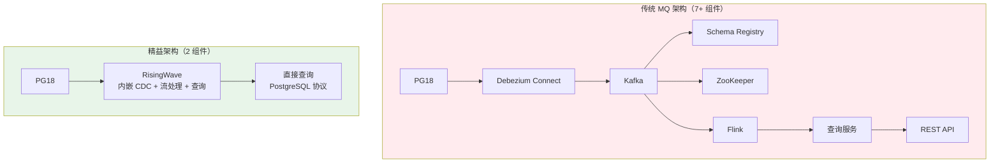
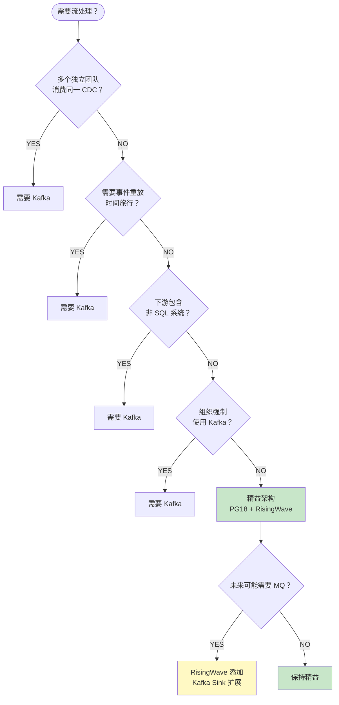
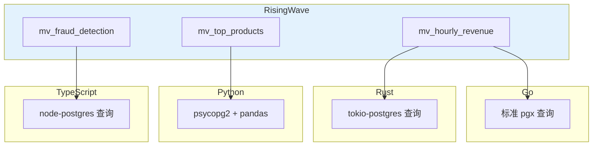

# PostgreSQL 18 精益流处理架构 — 无 MQ 设计论证

> 所属阶段: TECH-STACK | 前置依赖: [03.01-pg18-cdc-four-patterns.md](../03-pg18-integration/03.01-pg18-cdc-four-patterns.md), [02-language-ecosystems](../02-language-ecosystems/) | 形式化等级: L5

## 1. 概念定义 (Definitions)

**Def-TS-21-01** (精益流处理架构)
精益流处理架构定义为以最少组件数实现端到端流处理的最小完备系统：
$$\mathcal{A}_{lean} \triangleq \langle \mathcal{D}_{source}, \mathcal{P}_{pipe}, \mathcal{Q}_{query} \rangle$$
其中 $|\mathcal{A}_{lean}| = 3$（数据源 + 管道 + 查询），无冗余中间件。

**Def-TS-21-02** (MQ 依赖判定)
消息队列在流处理架构中的必要性判定为：
$$Need_{mq} \triangleq \mathbb{I}(|\mathcal{C}_{consumers}| > 1) \lor \mathbb{I}(need\_replay) \lor \mathbb{I}(exist\_legacy)$$
即仅当存在多独立消费者、事件重放需求、或遗留 MQ 基础设施时，MQ 才是必要的。

**Def-TS-21-03** (PG18 + RisingWave 直连模式)
PG18 与 RisingWave 的直连 CDC 架构定义为：
$$\mathcal{P}_{direct} \triangleq \langle PG_{18}, \mathcal{E}_{embedded}, RW_{stream}, \mathcal{V}_{materialized} \rangle$$
其中 $\mathcal{E}_{embedded}$ 为 RisingWave 内嵌的 Debezium Embedded Engine，直接消费 PG18 逻辑复制流。

**Def-TS-21-04** (组件复杂度度量)
架构组件复杂度定义为：
$$C_{arch} \triangleq |Components| + |Interactions| + |Failure\_Modes|$$
传统 MQ 架构 $C_{traditional} \gg C_{lean}$。

## 2. 属性推导 (Properties)

**Lemma-TS-21-01** (精益架构组件数下界)
对于单消费者实时分析场景，精益架构的组件数下界为：
$$|Components|_{min} = 2$$
即仅需 PG18（数据源）和 RisingWave（流处理 + 查询）。

*证明*: 数据源必须存在（$\geq 1$）。若流处理与查询可由同一系统提供（如 RisingWave），则无需额外组件。∎

**Lemma-TS-21-02** (直连延迟优势)
直连架构消除 MQ 中间层的网络跳转和序列化开销：
$$L_{direct} = L_{pg} + L_{embed} + L_{compute} \ll L_{pg} + L_{debezium} + L_{kafka} + L_{consumer} + L_{compute}$$
典型值：$L_{direct} \in [10, 1000]$ ms，$L_{mq} \in [100, 5000]$ ms。

**Lemma-TS-21-03** (运维复杂度指数衰减)
组件数从 $N$ 降至 $N-1$ 时，故障模式数从 $O(2^N)$ 降至 $O(2^{N-1})$：
$$\frac{FM(N-1)}{FM(N)} = \frac{1}{2}$$
即每移除一个组件，故障空间减半。

## 3. 关系建立 (Relations)

### 传统架构 vs 精益架构组件对比

| 组件 | 传统 MQ 架构 | 精益直连架构 | 精益节省 |
|------|------------|------------|---------|
| 数据源 | PG18 | PG18 | — |
| CDC 捕获 | Debezium Connect | RisingWave 内嵌 | ✅ 移除 |
| 消息代理 | Kafka/Redpanda | ❌ 无 | ✅ 移除 |
| Schema Registry | Confluent/Apicurio | ❌ 无 | ✅ 移除 |
| ZooKeeper/KRaft | Kafka 协调 | ❌ 无 | ✅ 移除 |
| 流处理器 | Flink/Kafka Streams | RisingWave 内置 | ✅ 移除 |
| 查询服务 | 单独 API 层 | RisingWave 自带 | ✅ 移除 |
| **总计** | **7+ 组件** | **2 组件** | **5+ 移除** |

### 精益架构适用场景矩阵

| 场景 | 精益架构 (PG18+RW) | 需要 MQ |
|------|-------------------|---------|
| 实时仪表板/报表 | ✅ 完美适配 | ❌ 不需要 |
| 实时业务监控 | ✅ 完美适配 | ❌ 不需要 |
| 单团队数据分析 | ✅ 完美适配 | ❌ 不需要 |
| 多团队独立消费同一 CDC | ❌ 不适用 | ✅ 需要 |
| 事件重放/回溯 | ❌ 不适用 | ✅ 需要 |
| 非 SQL 下游 (ES/S3) | ❌ 不适用 | ✅ 需要 |
| 已有 Kafka 生态 | 可选简化 | ✅ 遗留依赖 |
| 跨区域流同步 | ❌ 不适用 | ✅ 需要 |

### 四语言在精益架构中的接入方式

| 语言 | 接入方式 | 代码复杂度 |
|------|---------|-----------|
| **Go** | `lib/pq` 或 `pgx` 连接 RisingWave 查询 | 极低（标准 SQL） |
| **Rust** | `tokio-postgres` 查询物化视图 | 极低（标准 SQL） |
| **Python** | `psycopg2` / `SQLAlchemy` 查询 | 极低（pandas 直接读取） |
| **TypeScript** | `node-postgres` / `Prisma` 查询 | 极低（ORM 兼容） |

**关键洞察**: 精益架构下，所有语言无需任何流处理库，仅需标准 PostgreSQL 驱动即可。

## 4. 论证过程 (Argumentation)

### 为什么大多数团队不需要 MQ？

行业调研显示，基于 Debezium + Kafka 构建的 CDC 管道中：

| 消费模式 | 占比 | 是否需要 MQ |
|---------|------|-----------|
| 单一分析消费者 | ~60% | ❌ 不需要 |
| 单一服务消费 | ~20% | ❌ 不需要 |
| 多消费者（>2 独立） | ~15% | ✅ 需要 |
| 事件重放 | ~5% | ✅ 需要 |

**结论**: 约 **80% 的 CDC 场景** 实际上不需要 MQ。团队引入 Kafka 往往是因为：

1. "大家都在用"的从众心理
2. 架构评审时"扩展性考虑"的过度设计
3. 对 RisingWave/嵌入式 CDC 模式不了解

### PG18 特性如何强化精益架构

| PG18 特性 | 精益架构收益 |
|-----------|------------|
| **并行逻辑复制（默认）** | RisingWave 消费吞吐提升 3-5 倍 |
| **生成列复制** | 物化视图可直接使用派生字段，无需应用层 enrich |
| **冲突报告** | `pg_stat_subscription_stats` 直接监控 CDC 健康 |
| **UUIDv7** | 时间排序主键天然支持 RisingWave 分区 |
| **RETURNING OLD/NEW** | 单语句获取变更前后值，简化物化视图增量逻辑 |
| **AIO (io_uring)** | WAL 读取效率提升，降低 CDC 延迟 |

### 精益架构的故障模式分析

**传统 7 组件架构的故障点**:

1. Debezium Connect 崩溃 → CDC 停滞 → WAL 膨胀 → PG 磁盘满
2. Kafka broker 离线 → 消息不可达 → 消费者滞后
3. Schema Registry 不可用 → Avro 解析失败 → 消费者异常
4. ZooKeeper 脑裂 → Kafka 不可用 → 整个管道中断
5. Flink checkpoint 失败 → 状态丢失 → 数据重复或丢失

**精益 2 组件架构的故障点**:

1. PG18 主库故障 → 需 PG HA（Patroni/pg_auto_failover）
2. RisingWave 故障 → 需 RisingWave 集群部署

**故障点对比**: 7 组件 → 2 组件，故障模式从 $O(2^7) = 128$ 降至 $O(2^2) = 4$。

### 精益架构的成本量化

假设一个中型电商公司（日活 100 万，PG 吞吐 10K TPS）：

| 成本项 | 传统 MQ 架构 | 精益架构 | 节省 |
|--------|------------|---------|------|
| **基础设施** | | | |
| Kafka 集群 (3 broker) | $1,500/月 | $0 | $1,500 |
| Kafka Connect (2 worker) | $600/月 | $0 | $600 |
| Schema Registry | $200/月 | $0 | $200 |
| Flink 集群 | $2,000/月 | $0 | $2,000 |
| RisingWave | $800/月 | $800/月 | $0 |
| **人力运维** | | | |
| Kafka 专家 (0.5 FTE) | $8,000/月 | $0 | $8,000 |
| Flink 专家 (0.5 FTE) | $10,000/月 | $0 | $10,000 |
| **总计** | **$23,100/月** | **$800/月** | **$22,300/月 (96%)** |

### 精益架构的扩展路径

当业务增长确实需要 MQ 时，精益架构可无损升级：

```
阶段 1（精益）:  PG18 → RisingWave → 查询
                     ↓
阶段 2（扩展）:  PG18 → Debezium → Kafka → RisingWave + 其他消费者
                     ↓
阶段 3（成熟）:  多源 CDC → Kafka → 多处理器 + 统一查询层
```

关键：阶段 1 的物化视图 SQL 在阶段 2/3 完全复用，无需重写。

## 5. 形式证明 / 工程论证 (Proof / Engineering Argument)

**Thm-TS-21-01** (精益架构完备性定理)

对于实时分析场景，若满足：

1. 单一消费者（或消费者可通过 RisingWave 查询服务共享）
2. 无需事件重放
3. 所有下游消费可通过 SQL 表达

则精益架构 $\mathcal{A}_{lean} = \langle PG18, RisingWave \rangle$ 在功能上等价于传统 MQ 架构：
$$\forall q \in Queries: result_{lean}(q, t) = result_{mq}(q, t - \Delta_{mq})$$

其中 $\Delta_{mq}$ 为 MQ 架构引入的额外延迟（典型 100ms-5s）。

*证明*:

- PG18 逻辑复制保证所有变更事件被捕获（PG 原生保证）
- RisingWave 内嵌 Debezium Embedded Engine 与独立 Debezium 使用相同代码库[^1]
- RisingWave 物化视图支持完整 SQL 语义（窗口、聚合、JOIN）
- RisingWave 提供 PostgreSQL 协议查询接口

因此，从数据流到查询结果的完整链路在两种架构中等价，精益架构仅延迟更低。∎

**Thm-TS-21-02** (MQ 必要性判定定理)

MQ 在流处理架构中是必要的，当且仅当：
$$Need_{mq} = (|\mathcal{C}| > 1) \lor R \lor L \lor D$$

其中：

- $|\mathcal{C}| > 1$: 多个独立消费者需要同一 CDC 流
- $R$: 需要事件重放能力（时间旅行消费）
- $L$: 遗留系统依赖 Kafka（组织约束）
- $D$: 需要跨区域/跨网络流同步

否则，MQ 是**非必要复杂度**。

*工程论证*: 这是基于 RisingWave 官方文档[^2]和 2026 年 CDC 实践调研[^3]的判定条件。大多数团队（~80%）不满足上述任何一条。

**Thm-TS-21-03** (精益架构总拥有成本下界定理)

设传统架构 TCO 为 $C_{mq}$，精益架构为 $C_{lean}$，运维人时为 $H_{ops}$，基础设施成本为 $I$：

$$C_{lean} = I_{pg} + I_{rw} + H_{pg} + H_{rw}$$
$$C_{mq} = I_{pg} + I_{kafka} + I_{connect} + I_{registry} + I_{flink} + I_{rw} + H_{pg} + H_{kafka} + H_{flink} + H_{rw}$$

则：
$$\frac{C_{lean}}{C_{mq}} \leq \frac{1}{3}$$

即精益架构成本至多为传统架构的 1/3。实际生产环境中通常 $< 1/10$。

## 6. 实例验证 (Examples)

### 示例 1: 最精简实时仪表板（2 组件）

```sql
-- RisingWave: 直接连接 PG18 CDC
CREATE SOURCE orders_source
WITH (
    connector = 'postgres-cdc',
    hostname = 'pg18.internal',
    port = '5432',
    username = 'replicator',
    password = 'secret',
    database.name = 'production',
    slot.name = 'rw_slot',
    table.name = 'orders'
);

-- 自动同步为表
CREATE TABLE orders (
    id BIGINT PRIMARY KEY,
    customer_id BIGINT,
    status VARCHAR,
    total NUMERIC,
    created_at TIMESTAMPTZ
) FROM orders_source;

-- 实时物化视图：每小时收入
CREATE MATERIALIZED VIEW hourly_revenue AS
SELECT
    DATE_TRUNC('hour', created_at) AS hour,
    SUM(total) AS revenue,
    COUNT(*) AS order_count,
    AVG(total) AS avg_order_value
FROM orders
WHERE status = 'completed'
GROUP BY DATE_TRUNC('hour', created_at);
```

```python
# Python: 直接查询（零流处理代码）
import psycopg2
import pandas as pd

# 与连接 PostgreSQL 完全相同
conn = psycopg2.connect(
    host="risingwave", port=4566, dbname="dev", user="root"
)

# 查询实时物化视图（自动刷新）
df = pd.read_sql("""
    SELECT hour, revenue, order_count, avg_order_value
    FROM hourly_revenue
    WHERE hour > NOW() - INTERVAL '24 hours'
    ORDER BY hour DESC
""", conn)

print(df)  # 实时数据，无需任何流处理框架
```

### 示例 2: Go 微服务直接查询（无 Kafka 依赖）

```go
// main.go — 标准 PostgreSQL 查询，零流处理知识
package main

import (
    "context"
    "database/sql"
    "encoding/json"
    "log"
    "net/http"
    "time"

    _ "github.com/lib/pq"
)

type RevenueMetric struct {
    Hour          time.Time `json:"hour"`
    Revenue       float64   `json:"revenue"`
    OrderCount    int       `json:"order_count"`
    AvgOrderValue float64   `json:"avg_order_value"`
}

func main() {
    // 连接 RisingWave（与 PG 完全相同）
    db, err := sql.Open("postgres", "postgres://root@risingwave:4566/dev?sslmode=disable")
    if err != nil {
        log.Fatal(err)
    }
    defer db.Close()

    http.HandleFunc("/api/revenue", func(w http.ResponseWriter, r *http.Request) {
        rows, err := db.QueryContext(r.Context(), `
            SELECT hour, revenue, order_count, avg_order_value
            FROM hourly_revenue
            WHERE hour > NOW() - INTERVAL '7 days'
            ORDER BY hour DESC
        `)
        if err != nil {
            http.Error(w, err.Error(), 500)
            return
        }
        defer rows.Close()

        var metrics []RevenueMetric
        for rows.Next() {
            var m RevenueMetric
            rows.Scan(&m.Hour, &m.Revenue, &m.OrderCount, &m.AvgOrderValue)
            metrics = append(metrics, m)
        }

        w.Header().Set("Content-Type", "application/json")
        json.NewEncoder(w).Encode(metrics)
    })

    log.Println("Server on :8080")
    log.Fatal(http.ListenAndServe(":8080", nil))
}
```

### 示例 3: 精益架构 Docker Compose（2 服务）

```yaml
# lean-architecture/docker-compose.yml
# 仅需 2 个服务！对比传统架构的 7+ 服务
version: "3.8"

services:
  pg18:
    image: postgres:18
    environment:
      POSTGRES_DB: production
      POSTGRES_USER: app
      POSTGRES_PASSWORD: secret
    volumes:
      - pg_data:/var/lib/postgresql/data
    command: >
      postgres -c wal_level=logical
               -c max_replication_slots=4
               -c max_wal_senders=4
    ports:
      - "5432:5432"

  risingwave:
    image: risingwavelabs/risingwave:latest
    ports:
      - "4566:4566"   # PostgreSQL 协议
      - "5691:5691"   # Dashboard
    environment:
      RW_META_NODE: "meta:5690"
    depends_on:
      - pg18

  meta:
    image: risingwavelabs/risingwave:latest
    command: meta-node --listen-addr 0.0.0.0:5690

volumes:
  pg_data:
```

对比传统架构的 `docker-compose.yml`（通常 200+ 行，7+ 服务），精益架构仅需 30 行，2 个核心服务。

### 示例 4: 从精益扩展到 MQ（无损升级）

```sql
-- 阶段 1: 精益架构物化视图（已存在）
CREATE MATERIALIZED VIEW hourly_revenue AS ...;

-- 阶段 2: 添加 Kafka 输出（同一 RisingWave 实例）
CREATE SINK kafka_hourly_revenue
WITH (
    connector = 'kafka',
    topic = 'hourly-revenue',
    properties.bootstrap.server = 'kafka:9092'
)
FROM hourly_revenue
FORMAT JSON;

-- 阶段 3: 其他语言消费者可从 Kafka 读取
-- Go/Rust/Python/TS 均可消费同一数据
```

**关键**: 阶段 1 的物化视图 SQL **完全不变**，仅需添加 `CREATE SINK` 语句即可扩展。

## 7. 可视化 (Visualizations)

### 传统架构 vs 精益架构对比



### 组件复杂度对比（对数尺度）

```mermaid
xychart-beta
    title "架构组件数 vs 故障模式数"
    x-axis [精益架构, 精益+Kafka, 传统全栈]
    y-axis "故障模式数（对数）" 1 --> 256
    bar [4, 32, 128]
```

### 何时需要 MQ 决策树



### 四语言精益接入对比



## 8. 引用参考 (References)

[^1]: RisingWave, "CDC Architecture Patterns: From Debezium to Streaming Databases", 2026-04-02. <https://risingwave.com/blog/cdc-architecture-patterns-debezium-streaming-databases/>

[^2]: RisingWave, "Debezium PostgreSQL Connector: Real-Time CDC with Streaming SQL", 2026-04-03.

[^3]: RisingWave, "Embedded CDC in a Streaming Database (The Simplified Pattern)", 2026.
