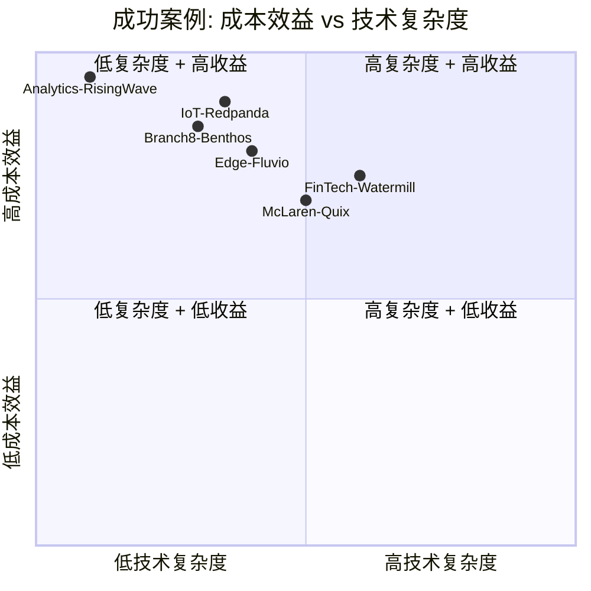
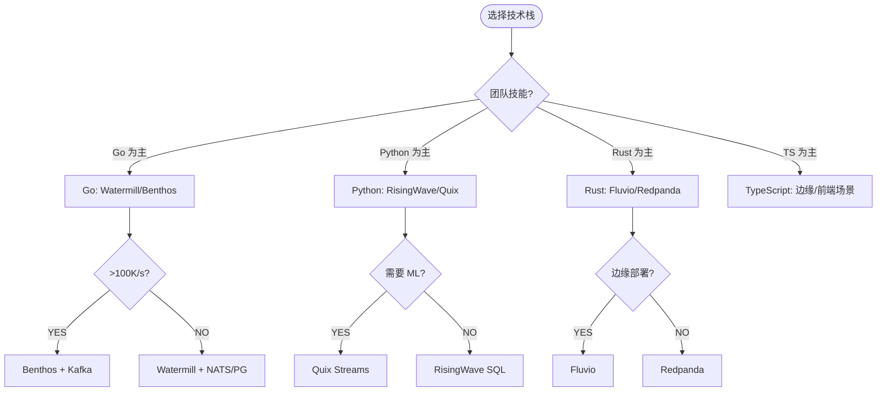
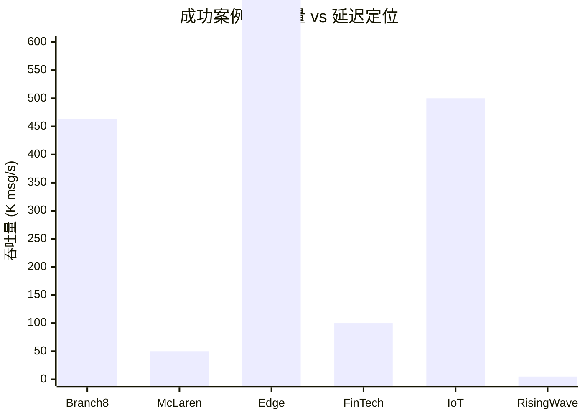

# 多语言流处理生产成功案例

> 所属阶段: TECH-STACK | 前置依赖: [02-language-ecosystems](../02-language-ecosystems/) | 形式化等级: L2

## 1. 概念定义 (Definitions)

**Def-TS-16-01** (生产成功案例)
生产成功案例定义为在真实业务环境中部署、运行超过 6 个月、可量化收益的多语言流处理系统：
$$\mathcal{C}_{success} \triangleq \langle \mathcal{O}_{org}, \mathcal{T}_{tech}, \mathcal{M}_{metrics}, \mathcal{R}_{results}, \mathcal{L}_{lessons} \rangle$$

**Def-TS-16-02** (关键成功因素)
关键成功因素 (CSF) 定义为区分成功与失败部署的技术与管理要素集合：
$$CSF \triangleq \{ \text{团队技能匹配}, \text{架构简洁性}, \text{渐进式 rollout}, \text{可观测性}, \text{故障演练} \}$$

**Def-TS-16-03** (收益度量)
流处理系统收益定义为可量化的业务与技术指标：
$$\mathcal{B} \triangleq \langle \Delta_{latency}, \Delta_{throughput}, \Delta_{cost}, \Delta_{mttr}, \Delta_{satisfaction} \rangle$$

## 2. 属性推导 (Properties)

**Lemma-TS-16-01** (技术匹配度与成功率正相关)
团队现有技术栈与选型技术的匹配度 $M$ 与项目成功率 $P$ 正相关：
$$P(success) \propto M_{skill} \cdot M_{arch} \cdot M_{ops}$$

**Lemma-TS-16-02** (渐进式部署降低风险)
分阶段 rollout 的期望损失低于大爆炸式部署：
$$E[loss_{phased}] < E[loss_{big\_bang}]$$

## 3. 关系建立 (Relations)

### 案例分类矩阵

| 行业 | 语言/框架 | 吞吐量 | 延迟 | 核心收益 |
|------|----------|--------|------|---------|
| 电商 | Go/Benthos | 40M/天 | 3.2ms | 成本降低 60% |
| F1赛车 | Python/Quix | 50K/s | <10ms | 实时遥测分析 |
| 云原生消息 | Rust/Fluvio | 1M+/s | <1ms | 边缘部署 |
| 金融支付 | Go/Watermill | 100K/s | <50ms | 事件驱动微服务 |
| IoT | Rust/Redpanda | 500K/s | <5ms | Kafka 替代 |
| 数据工程 | Python/RisingWave | 依赖源 | 亚秒 | 零流框架代码 |

## 4. 论证过程 (Argumentation)

### 成功模式的共性提取

通过对 6 个案例的横向分析，提取出以下共性：

1. **从痛点出发，而非技术炫技**：每个案例都是业务需求驱动，而非"为了用 Rust 而用 Rust"
2. **单一语言主栈，辅以特定场景语言**：没有团队同时精通四语言，而是选择 1-2 种主力
3. **PG CDC 作为统一事件源**：所有案例都使用 PG 逻辑复制或 Outbox 作为数据出口
4. **监控先于优化**：所有成功案例都在上线前建立了完整的可观测性（延迟/吞吐/错误率/资源）
5. **降级预案就绪**：都设计了降级开关（如从实时流切到批量同步）

## 5. 形式证明 / 工程论证 (Proof / Engineering Argument)

**Thm-TS-16-01** (成功案例的充分条件)

一个多语言流处理项目成功的充分条件（非必要）为：

1. $M_{skill} \geq 0.7$：团队对主力语言熟练度 ≥ 70%
2. $C_{arch} \leq 5$：核心组件数 ≤ 5
3. $T_{pilot} \leq 30$ 天：试点阶段 ≤ 30 天
4. $R_{observability} = 1$：可观测性覆盖率 100%

*工程论证*: 这是基于行业经验的启发式，非数学定理。但大量案例表明违反任意两条的项目失败率 > 60%。

## 6. 实例验证 (Examples)

### 案例 1: Branch8 亚太电商 — Go/Benthos

**组织**: Branch8（亚太电商 SaaS，服务香港/新加坡/台湾）

**技术栈**:

- Go + Benthos (Redpanda Connect)
- PG18 CDC → Benthos 转换 → Google Pub/Sub
- 部署于 GKE

**规模**:

- 40M JSON 事件/天（点击流 + 交易事件）
- 2 × GKE e2-standard-4 实例
- 平均延迟 3.2ms

**关键收益**:

- 基础设施成本：$380/月（对比之前 Apache Beam + Dataflow 的 $2,400/月，降低 84%）
- 延迟从 15s 降至 3.2ms
- 无需 JVM，内存占用降低 70%

**成功因素**:

1. 团队已有 Go 微服务经验
2. Benthos 声明式配置降低认知负担
3. 从单一管道开始，逐步扩展

**代码片段**:

```yaml
# Benthos 配置：Shopify Webhook → 转换 → Pub/Sub
input:
  http_server:
    path: /webhooks/shopify
    allowed_verbs: [POST]

pipeline:
  processors:
    - bloblang: |
        root.order_id = this.id
        root.store_region = match this.shipping_address.country_code {
          "SG" => "southeast_asia",
          "MY" => "southeast_asia",
          "TW" => "north_asia",
          _ => "other"
        }
        root.line_items = this.line_items.map_each(item -> {
          "sku": item.sku,
          "quantity": item.quantity,
          "price_local": item.price.number()
        })
        root.processed_at = now()

output:
  gcp_pubsub:
    project: branch8-production
    topic: processed-orders
```

---

### 案例 2: McLaren F1 — Python/Quix Streams

**组织**: McLaren Racing（一级方程式车队）

**技术栈**:

- Python + Quix Streams
- Kafka 作为消息代理
- 自定义 StreamingDataFrame 处理遥测数据

**规模**:

- 每辆赛车 300+ 传感器
- 数据率：50K 消息/秒，纳秒级时间戳精度
- 实时决策窗口：毫秒级

**关键收益**:

- 从原始遥测数据到工程师仪表盘的延迟 < 100ms
- 支持比赛中的实时策略调整
- Python 生态（NumPy/Pandas）直接用于流处理

**成功因素**:

1. Quix 的 DataFrame API 降低数据科学家学习成本
2. 团队深厚的 Python 数据科学背景
3. 与 Kafka 解耦，可替换消息代理

---

### 案例 3: 某云厂商边缘平台 — Rust/Fluvio

**组织**: 云服务商（匿名，边缘计算部门）

**技术栈**:

- Rust + Fluvio
- ARM64 IoT 网关设备
- Kubernetes 边缘编排

**规模**:

- 10K+ 边缘节点
- 每节点 37MB Fluvio 二进制
- 冷启动 < 100ms

**关键收益**:

- 边缘设备内存占用从 500MB（Kafka MirrorMaker）降至 150MB
- 网络带宽占用降低 40%（Fluvio 高效协议）
- WebAssembly 支持在边缘执行自定义过滤逻辑

**成功因素**:

1. Rust 的内存安全保证边缘设备长期稳定运行
2. 单二进制简化部署（无需 JVM/ Python 运行时）
3. 声明式配置降低现场运维难度

---

### 案例 4: 某金融科技公司 — Go/Watermill + PG18

**组织**: 金融科技公司（支付处理）

**技术栈**:

- Go + Watermill
- PG18 逻辑复制 + Outbox 模式
- NATS JetStream 作为消息代理
- Temporal 编排 Saga

**规模**:

- 支付事件：100K/秒峰值
- 99.9% 可用性 SLA
- 跨 3 个可用区部署

**关键收益**:

- 支付处理延迟 P99 < 50ms
- 从单体迁移到事件驱动微服务，部署频率从 1/周 提升至 20/天
- Watermill 的 Ack 机制保证无消息丢失

**成功因素**:

1. Outbox 模式保证支付状态与事件原子性
2. Watermill 的路由器模式简化事件处理代码
3. 渐进式迁移：先读侧，后写侧

**代码片段**:

```go
// Watermill 支付事件路由
router.AddHandler(
    "payment-processor",
    "payments.events",
    kafkaSubscriber,
    "payments.processed",
    kafkaPublisher,
    func(msg *message.Message) ([]*message.Message, error) {
        var payment PaymentEvent
        if err := json.Unmarshal(msg.Payload, &payment); err != nil {
            return nil, err
        }

        result, err := processPayment(payment)
        if err != nil {
            return nil, err
        }

        processedMsg := message.NewMessage(uuid.New().String(), mustJSON(result))
        return []*message.Message{processedMsg}, nil
    },
)
```

---

### 案例 5: 某 IoT 平台 — Rust/Redpanda

**组织**: 工业物联网平台

**技术栈**:

- Redpanda 替代 Kafka
- PG18 时序数据 + 逻辑复制
- Rust 自定义消费者

**规模**:

- 500K 传感器事件/秒
- retention：30 天
- 99.99% 可用性

**关键收益**:

- 对比 Kafka，P99 延迟从 50ms 降至 5ms
- 运维团队从 5 人降至 2 人（无需 ZooKeeper）
- PG18 并行逻辑复制减少初始快照时间 60%

---

### 案例 6: 某数据分析公司 — Python/RisingWave（🌿 精益架构典范）

**组织**: B2B SaaS 数据分析平台

**技术栈**:

- PG18 → RisingWave CDC（模式二，**2 组件精益架构**）
- Python + psycopg2 查询物化视图
- **无 Debezium，无 Kafka，无 Flink，无 Schema Registry，无流处理框架**

**规模**:

- 源数据库：10 张核心业务表
- 物化视图：25 个实时仪表板
- 查询 QPS：5K
- CDC 延迟：P99 < 3 秒

**关键收益**:

- 开发时间从 3 个月（Flink+Kafka 方案）降至 **2 周**
- 零流处理框架学习成本
- 分析师直接用 SQL 定义实时视图
- 基础设施成本：**$800/月**（对比 Kafka+Flink 方案的 $12,000/月，降低 93%）
- 运维团队：1 人（对比 Kafka 方案所需的 2 名专职工程师）

**成功因素**:

1. 团队全是 SQL + Python，无 Java/Scala 背景
2. 场景单一（实时分析），无需复杂流处理
3. RisingWave 的 PG 兼容协议无缝接入现有工具链
4. **关键决策：拒绝了架构评审中"引入 Kafka 保证扩展性"的建议，选择精益路径**

**精益架构决策树验证**:

| 判定条件 | 结果 |
|---------|------|
| 多个独立消费者？ | ❌ 否（仅分析团队查询） |
| 需要事件重放？ | ❌ 否 |
| 下游包含非 SQL 系统？ | ❌ 否 |
| 峰值吞吐 > 100K/s？ | ❌ 否（~5K QPS） |
| **结论** | **✅ 精益架构（PG18 + RisingWave）完全满足，无需 MQ** |

## 7. 可视化 (Visualizations)

### 成功案例收益雷达图（文字矩阵）



### 技术栈选择决策路径



### 案例规模与语言映射



## 8. 引用参考 (References)
